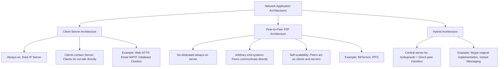
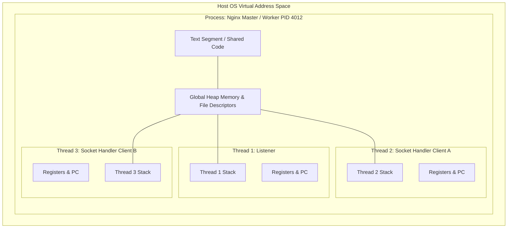
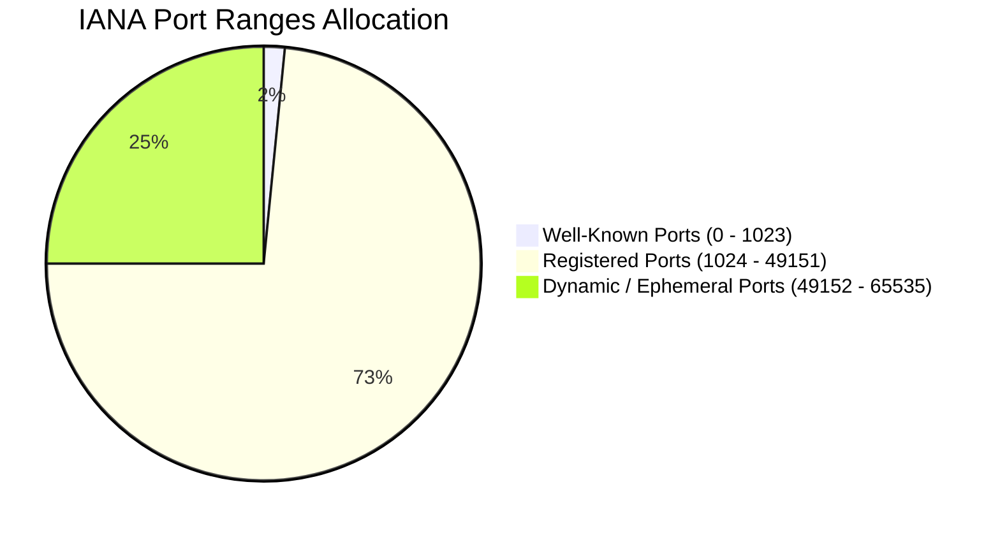
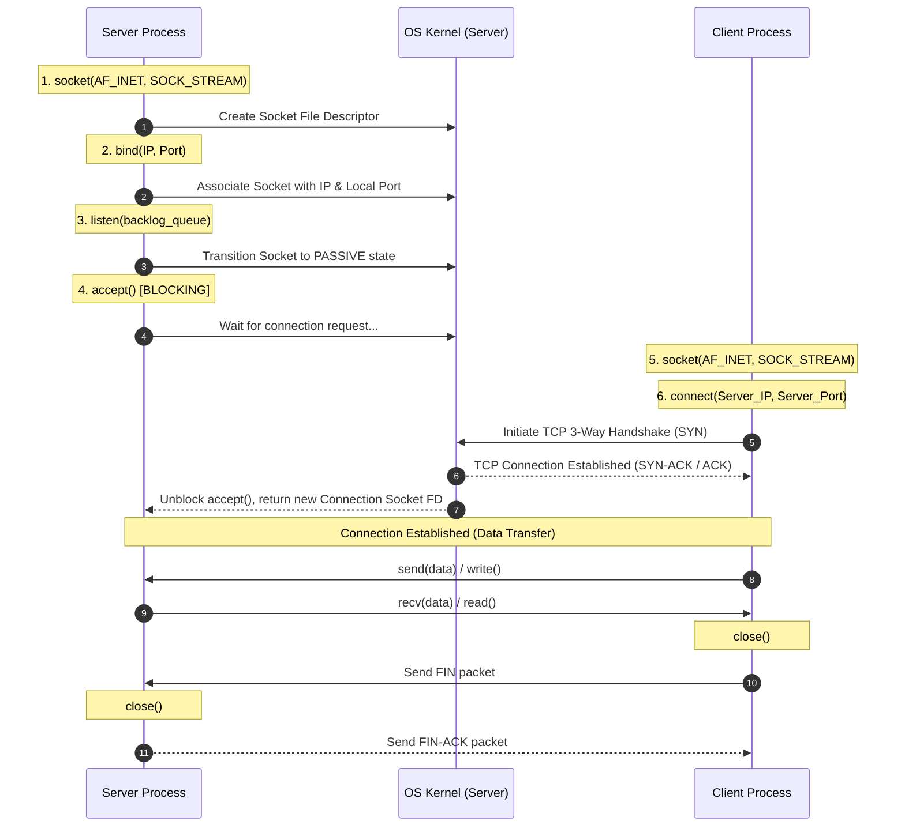

## Topic 1: Network Applications, Execution Units (Process & Thread), Common Ports, and Sockets

---

## 1. Prerequisites & Core Foundations

To understand network applications and communication primitives, you must first recognize where network applications reside within the layered Internet architecture:

* **OSI / TCP/IP Layer Context:** Network applications run exclusively at the **Application Layer** (Layer 5/7) in the user space of an operating system.
* **User Space vs. Kernel Space:** Applications operate in **user space**, while protocol stacks (TCP/UDP/IP) are implemented inside the **OS Kernel**.
* **Transport Abstraction:** Network applications communicate with lower transport layers (TCP/UDP) through an Application Programming Interface (API) provided by the operating system.

---

## 2. What is a Network Application?

### 2.1 Definition

A **Network Application** is a software program running on two or more separate end-systems (hosts) that communicate with one another over a computer network by exchanging messages.

Crucially, network applications do **not** require writing software that runs on intermediate network core devices (such as routers or layer-3 switches). Network core devices operate up to the Network/Transport layers, leaving application software restricted to edge hosts.

```
+-------------------------------------------------------------------+
|                           USER SPACE                              |
|  +------------------------+          +-------------------------+  |
|  | Client Application     |          | Server Application      |  |
|  +-----------+------------+          +------------+------------+  |
|              | (Socket API)                       | (Socket API)  |
+--------------|------------------------------------|---------------+
|              v            KERNEL SPACE            v               |
|  +------------------------+          +-------------------------+  |
|  | TCP / UDP Transport    |          | TCP / UDP Transport     |  |
|  +------------------------+          +-------------------------+  |
|  | IP (Network Layer)     |          | IP (Network Layer)      |  |
+--------------+------------------------------------+---------------+
               |                                    |
               +============== PHYSICAL ============+
                               NETWORK

```

### 2.2 Network Application Architectural Paradigms



### 2.3 Characteristics of Network Applications

1. **Distributed Execution:** Components run across geographically distributed systems.
2. **Protocol Compliance:** Communications conform to application-layer protocols (e.g., HTTP, FTP, gRPC) defining message formats, semantics, and syntax.
3. **Transport Layer Dependency:** Requires selection of transport services based on requirements for **loss tolerance**, **throughput**, **latency**, and **security**.

---

## 3. Application, Process, and Thread: Technical Breakdown & Distinction

### 3.1 Fundamental Definitions

#### A. Application

An **Application** is a static file or collection of programs stored on disk containing executable machine instructions, data, and configuration parameters (e.g., `/usr/bin/nginx` or `web_server.py`). It is passive and consumes no CPU or RAM.

#### B. Process

A **Process** is an active instance of a computer program being executed by the operating system. It possesses its own independent, isolated virtual address space, memory map (text, data, heap, stack), file descriptors, network resources, and security context.

#### C. Thread

A **Thread** (Lightweight Process) is the smallest unit of execution scheduled by the operating system kernel within a process. Multiple threads belong to a single parent process and share its virtual address space, heap memory, open file descriptors, and sockets, but each thread maintains its own program counter (PC), CPU registers, and stack memory.

### 3.2 Operating System & Networking Context

When a network message arrives at a network interface card (NIC):

1. The kernel processes the IP packet and TCP/UDP header.
2. The kernel matches the destination IP and Port to a specific **Socket** created by a **Process**.
3. The host **Process** receives the data stream, and dispatches a worker **Thread** to execute business logic concurrently without blocking other network requests.



### 3.3 Distinction Matrix: Application vs. Process vs. Thread

| Dimension | Application | Process | Thread |
| --- | --- | --- | --- |
| **Nature** | Passive entity stored on disk (Static). | Active execution instance in memory (Dynamic). | Smallest unit of CPU execution inside a process. |
| **Address Space** | N/A (Stored in file system). | Independent, isolated virtual address space. | Shared address space of parent process. |
| **Memory Sharing** | None. | Requires explicit Inter-Process Communication (IPC: Pipes, Shared Memory, Sockets). | Shares Heap, Global Variables, and File Descriptors natively. |
| **Creation Overhead** | Zero. | High (Requires `fork()`/`exec()`, page table allocation). | Low (Lightweight; allocates stack frame only). |
| **Context Switch Overhead** | N/A. | High (Requires TLB flush, CPU register save/restore, memory mapping updates). | Low (Saves registers and stack pointer; no memory mapping changes). |
| **Fault Isolation** | N/A. | High (If one process crashes, other processes remain unaffected). | Low (If one thread encounters a memory crash, the entire process terminates). |
| **Networking Context** | Defines application protocol rules. | Binds Sockets to specific Port numbers. | Handles individual incoming network client connections concurrently. |

---

## 4. Network Addressing & Common Application Ports

### 4.1 What is a Port Number?

A **Port Number** is a 16-bit unsigned integer ($0 \text{ to } 65535$) used by transport layer protocols (TCP and UDP) to achieve **process-to-process communication** (multiplexing and demultiplexing) on a host.

$$\text{Total Available Ports} = 2^{16} = 65,536 \text{ ports per IP address}$$

While an IP address identifies a specific physical or virtual **node** on a network, a Port identifies the specific **socket/process** on that node.

### 4.2 Classification of Port Ranges (Defined by IANA)



1. **Well-Known Ports ($0 - 1023$):** Reserved for standard, system-level core protocols and privileged services. On Unix-like operating systems, binding to a port in this range requires elevated (`root` / `CAP_NET_BIND_SERVICE`) permissions.
2. **Registered Ports ($1024 - 49151$):** Assigned by IANA for specific vendor services, databases, and application frameworks upon request. Non-privileged user processes can bind to these ports.
3. **Dynamic / Private / Ephemeral Ports ($49152 - 65535$):** Used by client operating systems as temporary source ports when initiating outbound network connections to servers.

### 4.3 Essential Application Ports Matrix

| Port Number | Protocol | Default Transport | Primary Function / Service |
| --- | --- | --- | --- |
| **20, 21** | FTP | TCP | File Transfer Protocol (Data & Control) |
| **22** | SSH / SFTP | TCP | Secure Shell / Secure File Transfer |
| **23** | Telnet | TCP | Unencrypted Text Communications (Legacy) |
| **25** | SMTP | TCP | Simple Mail Transfer Protocol (Email Relay) |
| **53** | DNS | UDP & TCP | Domain Name System (Name Resolution) |
| **67, 68** | DHCP | UDP | Dynamic Host Configuration Protocol (Server/Client) |
| **80** | HTTP | TCP | Hypertext Transfer Protocol (Web Unencrypted) |
| **110** | POP3 | TCP | Post Office Protocol v3 (Email Retrieval) |
| **123** | NTP | UDP | Network Time Protocol (Clock Sync) |
| **143** | IMAP | TCP | Internet Message Access Protocol (Email Management) |
| **161, 162** | SNMP | UDP | Simple Network Management Protocol |
| **389** | LDAP | TCP/UDP | Lightweight Directory Access Protocol |
| **443** | HTTPS | TCP | HTTP Secure (HTTP over TLS/SSL) |
| **465 / 587** | SMTPS | TCP | Encrypted Mail Submission |
| **1433** | MSSQL | TCP | Microsoft SQL Server Database |
| **3306** | MySQL | TCP | MySQL Database Management System |
| **3389** | RDP | TCP/UDP | Remote Desktop Protocol |
| **5432** | PostgreSQL | TCP | PostgreSQL Database System |
| **6379** | Redis | TCP | Redis In-Memory Key-Value Store |
| **8080** | HTTP Alt | TCP | Web Proxy / Alternative HTTP Server Port |

---

## 5. What is a Socket? (The Interface Layer)

### 5.1 Definition & Architectural Role

A **Socket** is an operational software abstraction created by the operating system that serves as an **endpoint for communication** between two network processes across a network.

In the classic networking text by *Kurose & Ross*, a socket is described using the **Door Analogy**:

> *"A process is like a house, and its socket is like its door. When a process wants to send a message to another process on another host, it pushes the message out its door (socket). The underlying transport infrastructure then delivers the message to the door of the destination process."*

```
+-------------------------------------------------------------+
| HOST A (Client)                                             |
| +-------------------+                                       |
| | Client Process    |                                       |
| +---------+---------+                                       |
|           | Application Layer                               |
|       [SOCKET]  <--- Software Interface (API)               |
| ----------|------------------------------------------------ |
|           v Transport Layer (OS Kernel)                     |
|      (TCP Engine)                                           |
+-----------|-------------------------------------------------+
            |
            | Physical Network Connection (IP Packets)
            v
+-----------|-------------------------------------------------+
|           | Transport Layer (OS Kernel)                     |
|      (TCP Engine)                                           |
| ----------|------------------------------------------------ |
|       [SOCKET]  <--- Software Interface (API)               |
|           ^ Application Layer                               |
| +---------+---------+                                       |
| | Server Process    |                                       |
| +-------------------+                                       |
| HOST B (Server)                                             |
+-------------------------------------------------------------+

```

### 5.2 The 4-Tuple Socket Identification Formula

A unique network connection across the Internet is fully qualified by a **Socket 4-Tuple**:

$$\text{Connection Identification Tuple} = \left( \text{Source IP}, \text{Source Port}, \text{Destination IP}, \text{Destination Port} \right)$$

* **TCP Connection Demultiplexing:** Two incoming TCP segments with different Source IP addresses or Source Ports targeting the same host will be directed to **two different connected sockets**, even if both segments share the same Destination Port (e.g., port 80/443).
* **UDP Connection Demultiplexing:** UDP sockets are identified solely by a 2-tuple $(\text{Destination IP}, \text{Destination Port})$. Incoming UDP packets with different source parameters are delivered to the exact same socket.

### 5.3 Types of Sockets

1. **Stream Sockets (`SOCK_STREAM`):** Utilizes **TCP** (Transmission Control Protocol).
* Connection-oriented, reliable, byte-stream based, guarantees packet order and error detection via ACK mechanisms.


2. **Datagram Sockets (`SOCK_DGRAM`):** Utilizes **UDP** (User Datagram Protocol).
* Connectionless, unreliable, message-oriented (preserves datagram boundaries), low overhead, zero connection latency.


3. **Raw Sockets (`SOCK_RAW`):** Bypasses the transport layer processing; allows applications directly to read/write IP headers or Ethernet frames (used for diagnostic utilities like `ping` using ICMP, `traceroute`, or network sniffing tools like Wireshark).

---

## 6. Socket Communication Lifecycle & API Workflow

The standard C/POSIX Socket API execution model for connection-oriented TCP server-client communication proceeds through specific system calls.



### Key API Primitives Explained

* `socket()`: Allocates an endpoint control structure in kernel memory and returns a file descriptor.
* `bind()`: Assigns a specific IP address and Port number to the created socket.
* `listen()`: Configures a server TCP socket into a passive listening mode, establishing the accept queue length for incoming connections.
* `accept()`: Extracts the first connection from the listening queue and creates a **new dedicated connection socket** for that specific client, freeing the main listening socket to accept further connections.
* `connect()`: Initiates the transport-layer handshake to the target server's IP and port.

---

## 7. Practical Implementation: Multithreaded TCP Socket System

Below is a complete Python implementation demonstrating a multithreaded TCP Echo Server and a TCP Client using sockets, threads, and assigned application ports.

### 7.1 Server Code (`server.py`)

```python
import socket
import threading
import sys

# Define Host and Port configurations
HOST = '127.0.0.1'  # Localhost
PORT = 65432        # Non-privileged registered/custom port

def handle_client(conn: socket.socket, addr: tuple):
    """
    Worker function executed inside a dedicated thread per client connection.
    """
    print(f"[NEW CONNECTION] Client connected from {addr[0]}:{addr[1]}")
    try:
        while True:
            # Read up to 1024 bytes from the socket
            data = conn.recv(1024)
            if not data:
                # Client closed the connection gracefully
                print(f"[DISCONNECTED] Client {addr} closed connection.")
                break
            
            message = data.decode('utf-8')
            print(f"[{addr}] Received: {message}")
            
            # Echo processing and transmission back to client
            response = f"SERVER ECHO: {message}".encode('utf-8')
            conn.sendall(response)
    except Exception as e:
        print(f"[ERROR] Exception on client {addr}: {e}")
    finally:
        conn.close()

def main():
    # 1. Create a TCP Socket using IPv4 (AF_INET) and Stream Protocol (SOCK_STREAM)
    server_socket = socket.socket(socket.AF_INET, socket.SOCK_STREAM)
    
    # Enable immediate socket port reuse after process termination
    server_socket.setsockopt(socket.SOL_SOCKET, socket.SO_REUSEADDR, 1)
    
    try:
        # 2. Bind the socket to the host IP and Port
        server_socket.bind((HOST, PORT))
        
        # 3. Put socket into listening state (backlog queue size = 5)
        server_socket.listen(5)
        print(f"[LISTENING] Server running on {HOST}:{PORT}...")
        
        while True:
            # 4. Accept connection (blocking call returns new socket and client address)
            conn, addr = server_socket.accept()
            
            # 5. Spawn a lightweight Thread to handle client concurrently
            client_thread = threading.Thread(target=handle_client, args=(conn, addr))
            client_thread.daemon = True
            client_thread.start()
            print(f"[ACTIVE THREADS] {threading.active_count() - 1}")
            
    except KeyboardInterrupt:
        print("\n[SHUTTING DOWN] Server terminating...")
    finally:
        server_socket.close()

if __name__ == '__main__':
    main()

```

### 7.2 Client Code (`client.py`)

```python
import socket

HOST = '127.0.0.1'
PORT = 65432

def main():
    # 1. Create TCP Socket
    client_socket = socket.socket(socket.AF_INET, socket.SOCK_STREAM)
    
    try:
        # 2. Connect to server endpoint
        client_socket.connect((HOST, PORT))
        print(f"[CONNECTED] Connected to server at {HOST}:{PORT}")
        
        messages = ["Hello Server!", "Computer Networks Master Class", "QUIT"]
        
        for msg in messages:
            print(f"[SENDING] {msg}")
            client_socket.sendall(msg.encode('utf-8'))
            
            # Receive server echo response
            data = client_socket.recv(1024)
            print(f"[RECEIVED] {data.decode('utf-8')}")
            
    except Exception as e:
        print(f"[ERROR] {e}")
    finally:
        # 3. Graceful termination
        client_socket.close()
        print("[CLOSED] Connection closed.")

if __name__ == '__main__':
    main()

```

---

## 8. High-Yield External References & Visualization Resources

For deeper visual exploration and external diagrams:

* **Interactive Socket Programming Workflow:** Refer to [GeeksforGeeks Socket Programming Guide](https://www.geeksforgeeks.org/python/socket-programming-python/).
* **Kurose & Ross Chapter 2 Application Layer Resources:** Access official slides and lecture animations at [Pearson Kurose & Ross Online Companion](https://gaia.cs.umass.edu/kurose_ross/videos/2/).
* **IANA Official Port Number Registry:** Review the comprehensive list of registered protocols at [IANA Service Name and Transport Protocol Port Number Registry](https://www.iana.org/assignments/service-names-port-numbers/service-names-port-numbers.xhtml).

---

## 9. Exam Tips & Commonly Asked Questions

> ### 🧠 Exam Tip 1: The `accept()` Socket Misconception
> 
> 
> University exams frequently ask: *"How can a Web Server running on a single port (80/443) handle thousands of concurrent clients simultaneously?"*
> * **Key Answer:** The listening socket on port 80 **does not transfer data**. When a client connects, `accept()` returns a **new connection socket descriptor** bound to a distinct 4-tuple $(\text{Client IP}, \text{Client Ephemeral Port}, \text{Server IP}, 80)$. The OS demultiplexes packets arriving on port 80 to these connection sockets based on the unique client source parameters.
> 
> 

> ### 🧠 Exam Tip 2: Why DNS uses both UDP and TCP Port 53
> 
> 
> * **Standard Queries:** Uses **UDP 53** due to low latency, zero connection overhead, and small packet size ($< 512$ bytes).
> * **Zone Transfers / DNSSEC:** Uses **TCP 53** when data exceeds 512 bytes or requires guaranteed, reliable transfer between authoritative DNS servers.
> 
> 

---

## 10. Frequently Asked Interview Questions

### Q1: What is the difference between Process Context Switching and Thread Context Switching?

* **Process Context Switching:** Involves switching virtual memory mappings, invalidating Translation Lookaside Buffers (TLBs), swapping CPU registers, and switching process page tables. It incurs significant CPU overhead.
* **Thread Context Switching:** Switches execution contexts (Program Counter, CPU Registers, Stack Pointer) while keeping the same virtual address space, memory page tables, and cache lines intact. It is drastically faster.

### Q2: What happens at the OS socket level when a client calls `close()` on a TCP socket?

When a process calls `close()`, the kernel sends a TCP segment with the **FIN** flag set to the remote host. The local socket state transitions from `ESTABLISHED` to `FIN_WAIT_1`, initiating the standard 4-way TCP shutdown sequence. The file descriptor is unmapped from the process's descriptor table.

### Q3: Can two different processes bind to the exact same TCP Port on the same host?

By default, **No**; the operating system returns an `EADDRINUSE` (Address already in use) error. However, modern OS kernels support the `SO_REUSEPORT` socket option, which allows multiple listening processes to bind to the exact same IP and Port combination. The kernel then load-balances incoming connection requests across the listening processes at the kernel layer.

---

## 11. Topic Summary

* **Network Application:** User-space software executing across distributed host systems without requiring code execution on network core switches/routers.
* **Process vs. Thread:** Processes provide isolated memory spaces for safety; threads execute lightweight routines concurrently inside a process while sharing heap memory and file descriptors.
* **Port Numbers:** 16-bit identifiers ($0-65535$) that allow a host operating system to multiplex and demultiplex transport streams to correct processes.
* **Socket Abstraction:** The standard API door between user-space application logic and kernel-space transport protocols.
* **Socket Identification:** Uniquely identified by a 4-tuple $(\text{Src IP}, \text{Src Port}, \text{Dst IP}, \text{Dst Port})$, enabling thousands of concurrent client sockets on a single server port.