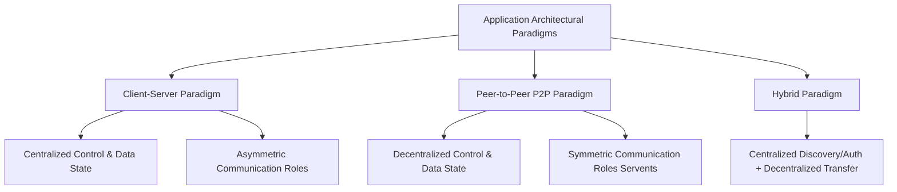
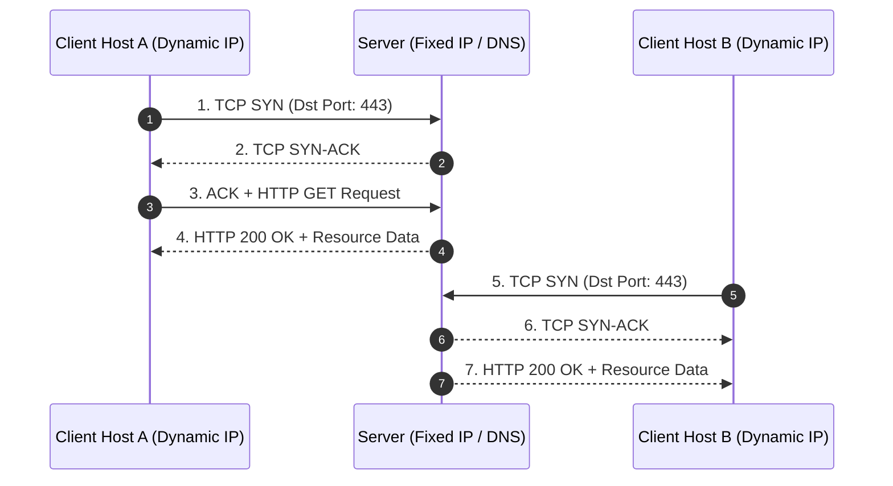
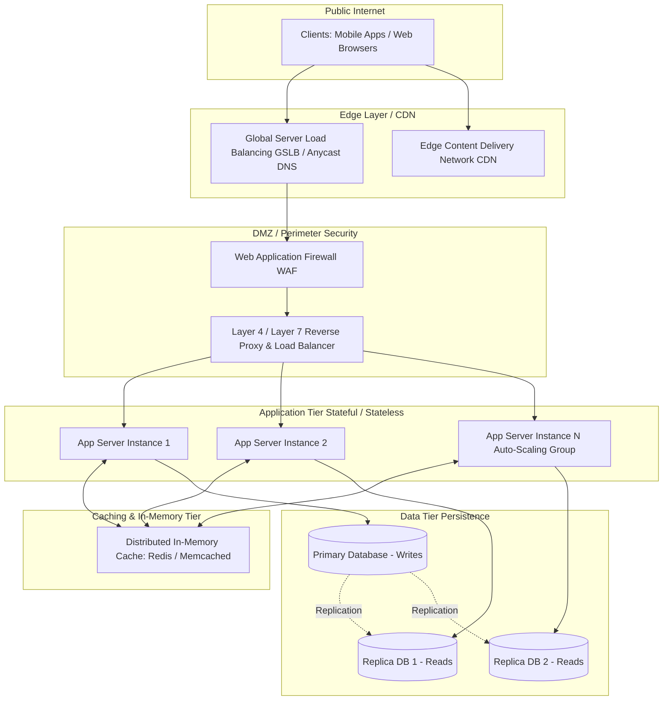
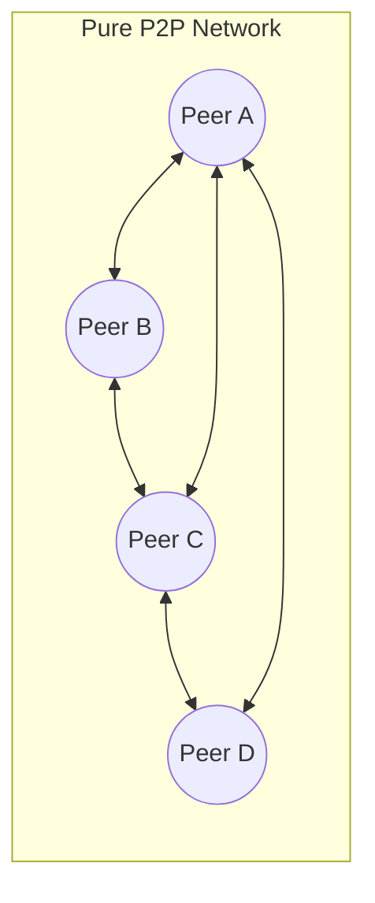
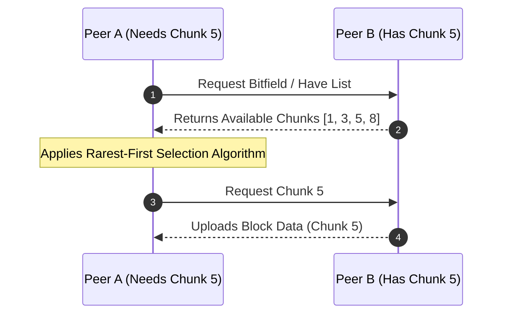
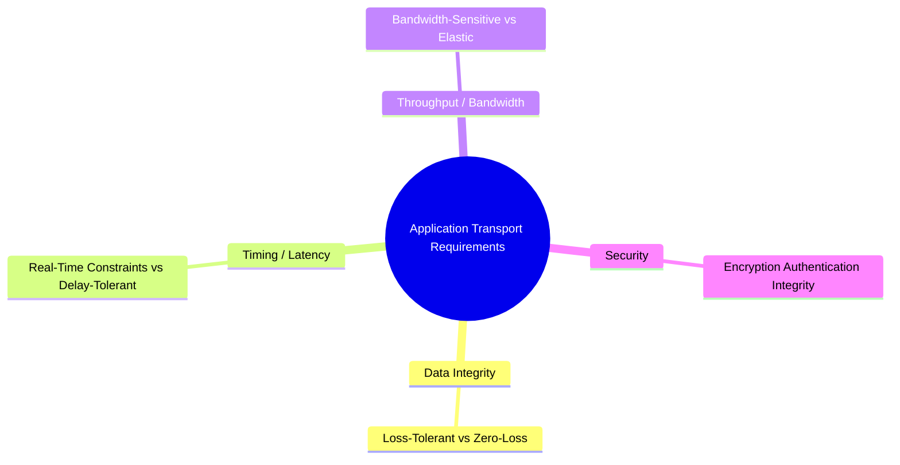
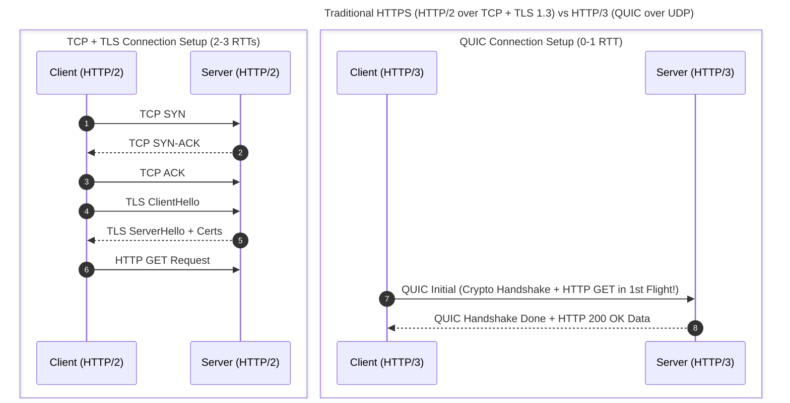

## Topic 2: Application Paradigms (Client-Server vs. P2P), Production Server Systems, Transport Service Requirements, and HTTP over UDP/QUIC

---

## 1. Application Layer Architecture Paradigms

Application layer architectures define how distributed application processes running on distinct end-systems are organized and interact with one another.



---

## 2. Client-Server Architecture

### 2.1 Fundamental Definitions & Roles

In a **Client-Server Architecture**, communication occurs between two distinct asymmetric roles:

#### A. The Client

* **Definition:** An end-system process that initiates communication with a server to request a specific service, resource, or computation.
* **Key Characteristics:**
* **Intermittent Connectivity:** Clients do not need to maintain continuous network connections; they connect on demand.
* **Dynamic IP Addresses:** Clients are frequently assigned temporary dynamic IP addresses via DHCP and may change network attachment points (e.g., roaming across Wi-Fi networks).
* **Non-Addressing Role:** Clients do not directly listen for inbound connection requests from other arbitrary clients.


#### B. The Server

* **Definition:** An always-on host process that manages resources, processes data requests, and delivers services to one or many clients.
* **Key Characteristics:**
* **Always-On Infrastructure:** Operates continuously to process incoming connection requests at any arbitrary time.
* **Static & Well-Known IP Address:** Associated with fixed IP addresses and registered Domain Name System (DNS) records so clients can reach it without prior negotiation.
* **High Concurrency Capacity:** Employs multi-core execution models to serve thousands to millions of concurrent client connections simultaneously.




---

## 3. "The Production Server Side is a System": Modern Enterprise Architecture

In real-world enterprise environments, a "server" is rarely a single monolithic physical machine running a process. Instead, **the server side is a complex, multi-tiered distributed system** designed to achieve high availability, horizontal scalability, fault tolerance, and security.

### 3.1 Anatomical Breakdown of a Modern Server Tier



### 3.2 Key Components of the Enterprise Server System

1. **DNS Anycast & Global Server Load Balancing (GSLB):**
* Routes client requests to the nearest data center based on physical proximity, latency, and operational health.


2. **Content Delivery Networks (CDNs):**
* Caches static assets (images, CSS, JavaScript, media files) at edge locations close to users, reducing traffic to origin servers.


3. **Reverse Proxies & Load Balancers (e.g., NGINX, HAProxy, AWS ALB):**
* Terminates incoming TCP/TLS client connections (SSL Offloading).
* Distributes load across backend pools using scheduling algorithms (Round Robin, Least Connections, IP Hash).
* Masks internal network topologies from public internet threats.


4. **Stateless Application Microservices:**
* Business logic executes inside isolated containerized runtimes (e.g., Docker, Kubernetes).
* **Statelessness:** Session state is decoupled from individual compute nodes and stored in central state stores, enabling seamless horizontal auto-scaling (adding or terminating nodes dynamically).


5. **Caching Tier (e.g., Redis, Memcached):**
* Stores high-frequency query results in RAM to minimize latency and database read amplification.


6. **Data Storage & Database Clustering:**
* Utilizes primary-replica (master-slave) or distributed consensus multi-primary architectures (e.g., CockroachDB, Cassandra) to maintain ACID guarantees or eventual consistency across nodes.


---

## 4. Peer-to-Peer (P2P) Architecture

### 4.1 Fundamental Concept

In a **Pure Peer-to-Peer (P2P) Architecture**, there is no reliance on a central, always-on server infrastructure. Instead, arbitrary end-systems—termed **Peers** (or **Servents**, combining *Server* and *Client*)—communicate directly with one another.

### 4.2 Architectural Mechanics: The Self-Scalability Property

The defining characteristic of P2P networks is **Self-Scalability**:

* In Client-Server systems, every new client adds **workload demand** to the server infrastructure without contributing compute or bandwidth capacity.
* In P2P systems, every new peer joining the network adds **workload demand**, but simultaneously contributes **processing power, disk storage, and upload bandwidth** to the pool.

$$\text{Total System Upload Capacity} = C_{\text{Server}} + \sum_{i=1}^{N} u_i$$

Where $u_i$ is the upload capacity contributed by peer $i$.



### 4.3 BitTorrent File Distribution Mechanics

BitTorrent is the classic example of a P2P content distribution protocol:

* **Torrent File / Magnet Link:** Contains cryptographic hashes (SHA-1/SHA-256) of file blocks and tracker locations.
* **Swarm:** The set of all peers participating in the transfer of a specific file.
* **Chunks / Pieces:** Files are segmented into fixed-size chunks (typically $256 \text{ KB}$ to $4 \text{ MB}$).
* **Tit-for-Tat Strategy (Incentive Mechanism):** A peer prioritizes uploading file chunks to the top 4 peers that are currently sending data back to it at the highest rates. This discourages "free-riding" (leeching without uploading).



---

## 5. Comparative Analysis: Client-Server vs. Peer-to-Peer

| Dimension | Client-Server Architecture | Peer-to-Peer (P2P) Architecture |
| --- | --- | --- |
| **Control Model** | Centralized administrative domain. | Decentralized, autonomous peers. |
| **Resource Dependency** | Server bandwidth and hardware cap capacity. | Scaled dynamically by aggregate peer upload bandwidth. |
| **Cost Allocation** | Heavy capital/operational expenditure for host infrastructure. | Operational costs distributed across end-user internet connections. |
| **Security & Trust** | High; single authority enforces access policies and SSL/TLS certs. | Low; vulnerable to malicious peers, poisoned files, and Sybil attacks. |
| **Fault Tolerance** | Single point of failure unless expensive redundancy is built in. | High inherent fault tolerance; node churn does not crash the system. |
| **Data Locality & Lookup** | Deterministic (IP address / DNS lookup). | Complex lookup mechanisms (Distributed Hash Tables - DHT like Kademlia). |

### 5.1 Operational Challenges of P2P Systems

1. **Peer Churn:** Peers dynamically join, drop offline, or switch networks without notice, making content availability unpredictable.
2. **ISP Traffic Asymmetry:** Consumer Internet Service Providers (ISPs) often asymmetric bandwidth (e.g., $300 \text{ Mbps}$ download, $10 \text{ Mbps}$ upload). Heavy P2P upload traffic can cause network congestion on access links.
3. **Security Risks & Sybil Attacks:** A single malicious actor can spawn thousands of virtual fake peers (a Sybil attack) to manipulate routing tables in Distributed Hash Tables (DHTs) or poison file swarms.
4. **Legal & Governance Complexity:** Difficulty in removing copyright-infringing material or enforcing regulatory compliance (e.g., GDPR data deletion requests) across decentralized nodes.

---

## 6. What Services Does an Application Need from the Transport Layer?

When designing a network application, developers must select an underlying transport protocol (e.g., TCP or UDP) based on four fundamental dimensions of service requirements:



### 6.1 Data Integrity (Reliability)

* **Zero-Loss Applications:** Require 100% reliable bit-exact transmission. A single dropped or flipped bit invalidates the payload (e.g., file transfers, web documents, financial transactions, database queries).
* **Loss-Tolerant Applications:** Can tolerate a small percentage of lost data packets without noticeable degradation in end-user experience (e.g., real-time audio/video streaming, IP telephony, online multiplayer games).

### 6.2 Timing (Latency & Jitter)

* **Real-Time Interactive Applications:** Demand low end-to-end packet propagation delays (often $< 100 \text{ ms}$) and low **jitter** (variance in packet arrival delays) to enable natural human interaction (e.g., VoIP, video conferencing, cloud gaming).
* **Delay-Tolerant Applications:** Can accept variable delay overheads (e.g., email delivery, batch file transfers, software updates).

### 6.3 Throughput (Bandwidth)

* **Bandwidth-Sensitive Applications:** Require a minimum guaranteed throughput to function effectively (e.g., 4K video streams requiring a continuous $\ge 25 \text{ Mbps}$).
* **Elastic Applications:** Adapt their transmission rate dynamically to whatever bandwidth the network provides (e.g., web browsing, SSH terminals).

### 6.4 Security

* Transport protocols or sub-layers must provide **Confidentiality** (encryption), **Data Integrity** (tamper prevention), and **Authentication** (identity verification via TLS/SSL certificates).

---

## 7. TCP vs. UDP: The Application Layer Perspective

| Feature / Abstraction | TCP (Transmission Control Protocol) | UDP (User Datagram Protocol) |
| --- | --- | --- |
| **Connection Model** | Connection-oriented (Requires 3-way handshake). | Connectionless (Send and forget). |
| **Data Transfer Unit** | Continuous **Byte Stream** (No message boundaries). | Discrete **Datagrams** (Preserves message boundaries). |
| **Reliability Mechanism** | Full reliability via Sequence Numbers, ACKs, Retransmissions (ARQ). | Best-effort delivery; no ACKs, no retransmissions. |
| **Flow Control** | Yes (Sliding window mechanism prevents receiver buffer overflow). | No (Sender can overwhelm receiver). |
| **Congestion Control** | Yes (Adapts rate to network congestion: AIMD, CUBIC, BBR). | No (Sends at whatever rate application feeds it). |
| **Header Overhead** | Large: $20 - 60 \text{ bytes}$. | Minimal: $8 \text{ bytes}$. |
| **Typical Use Cases** | HTTP/HTTPS, SSH, FTP, SMTP, Database Drivers. | DNS queries, VoIP, Video Streaming, QUIC, IoT protocols (CoAP). |

```
TCP Segment Structure (Minimum 20 Bytes Header):
+-----------------------------------+-----------------------------------+
|     Source Port (16 Bits)         |     Destination Port (16 Bits)    |
+-----------------------------------+-----------------------------------+
|                     Sequence Number (32 Bits)                         |
+-----------------------------------+-----------------------------------+
|                  Acknowledgment Number (32 Bits)                      |
+-------+-------+-------------------+-----------------------------------+
|Offset |Resrvd | Flags (URG,ACK...)|        Window Size (16 Bits)      |
+-------+-------+-------------------+-----------------------------------+

UDP Datagram Structure (Fixed 8 Bytes Header):
+-----------------------------------+-----------------------------------+
|     Source Port (16 Bits)         |     Destination Port (16 Bits)    |
+-----------------------------------+-----------------------------------+
|        Length (16 Bits)           |       Checksum (16 Bits)          |
+-----------------------------------+-----------------------------------+

```

---

## 8. The "Modern Lie": HTTP Uses UDP (Understanding HTTP/3 & QUIC)

For decades, networking textbooks taught a simple rule: **"HTTP runs over TCP."** While true for HTTP/1.1 and HTTP/2, modern web architecture has shifted this baseline. **HTTP/3 runs over QUIC, which operates on top of UDP.**

### 8.1 Why HTTP/2 Over TCP Hit a Performance Wall

Although HTTP/2 introduced **binary framing** and **multiplexing** (allowing multiple HTTP requests to travel over a single TCP connection), it suffered from a fundamental transport-layer flaw: **Head-of-Line (HoL) Blocking at the TCP Layer**.

```
HTTP/2 Over Single TCP Connection:
[Stream 1 Frame] [Stream 2 Frame] [Stream 3 Frame]  ---> [ Packet Loss ]
                                                               |
  TCP Engine Halts ALL Streams until Lost Packet is Retransmitted!

```

* If a single packet carrying data for *Stream 1* is dropped in transit, the host TCP stack **freezes delivery of all subsequent data in its receive buffer** (including data for Streams 2 and 3) until the lost packet is retransmitted and acknowledged.
* Furthermore, establishing a traditional HTTPS connection required multiple back-and-forth round trips (1 RTT for TCP Handshake + 1-2 RTTs for TLS 1.3 Handshake).



### 8.2 The Solution: QUIC (Quick UDP Internet Connections)

QUIC shifts connection management, encryption, and reliability from the kernel TCP stack up into the user space application layer running over **UDP datagrams**.

```
+--------------------------+          +--------------------------+
|  HTTP/1.1 or HTTP/2      |          |        HTTP/3            |
+--------------------------+          +--------------------------+
|      TLS 1.2 / 1.3       |          |   QUIC (Reliability,     |
+--------------------------+          |   Congestion Control,    |
|          TCP             |          |   TLS 1.3 Integrated)    |
+--------------------------+          +--------------------------+
|           IP             |          |        UDP               |
+--------------------------+          +--------------------------+
|     Network Physical     |          |     Network Physical     |
+--------------------------+          +--------------------------+
   Traditional Web Stack                   Modern HTTP/3 Stack

```

### 8.3 Technical Innovations of QUIC

1. **Independent Multiplexed Streams (No Transport HoL Blocking):** QUIC handles stream reassembly independently per HTTP request. A dropped packet on Stream 1 delays *only* Stream 1. Streams 2 and 3 continue delivering data to the application layer without interruption.
2. **0-RTT / 1-RTT Connection Establishment:** QUIC integrates the cryptographic TLS 1.3 handshake directly into its initial transport connection establishment. Repeat connections can achieve **0-RTT** data delivery.
3. **Connection Migration via Connection IDs:** Traditional TCP connections are bound to a 4-tuple $(\text{Src IP}, \text{Src Port}, \text{Dst IP}, \text{Dst Port})$. If a smartphone switches from Wi-Fi to Cellular (4G/5G), the IP changes, causing the TCP connection to break. QUIC uses a **64-bit Connection ID (CID)** independent of network interfaces, allowing seamless connection migration without drops.

---

## 9. Code Demonstration: Inspecting HTTP/3 QUIC Connections

To demonstrate how modern applications use UDP for HTTP/3, below is a Python snippet using the `aioquic` library to send an HTTP/3 request over UDP.

```python
import asyncio
from typing import Optional
from urllib.parse import urlparse

# Modern HTTP/3 implementations utilize the aioquic asynchronous library
from aioquic.h3.connection import H3_ALPN, H3Connection
from aioquic.h3.events import DataReceived, ResponseReceived
from aioquic.quic.configuration import QuicConfiguration
from aioquic.quic.connect import connect

async def fetch_http3_over_udp(url: str):
    parsed = urlparse(url)
    host = parsed.hostname
    port = parsed.port or 443

    # Configure QUIC to advertise HTTP/3 protocol support (h3)
    configuration = QuicConfiguration(
        is_client=True,
        alpn_protocols=H3_ALPN  # ALPN: Application-Layer Protocol Negotiation
    )

    print(f"[INITIATING QUIC] Connecting to {host}:{port} via UDP...")

    # Establish QUIC connection over UDP
    async with connect(host, port, configuration=configuration) as protocol:
        # Create an HTTP/3 protocol handler over the established QUIC socket
        h3_conn = H3Connection(protocol._quic)

        # Generate a new independent HTTP/3 stream ID
        stream_id = protocol._quic.get_next_available_stream_id()

        # Send HTTP/3 Headers over UDP
        headers = [
            (b":method", b"GET"),
            (b":scheme", b"https"),
            (b":authority", host.encode()),
            (b":path", parsed.path.encode() or b"/"),
            (b"user-agent", b"Python-HTTP3-MasterClass-Client"),
        ]
        
        h3_conn.send_headers(stream_id=stream_id, headers=headers, end_stream=True)
        protocol.transmit()  # Sends UDP Datagrams instantly

        print("[UDP SENT] QUIC initial flight transmitted.")

if __name__ == '__main__':
    # Target a modern server supporting HTTP/3 over QUIC
    # asyncio.run(fetch_http3_over_udp("https://cloudflare.com/"))
    pass

```

---

## 10. High-Yield External References & Visualization Resources

* **IETF RFC 9000 (QUIC Transport Protocol):** The official standard specification available at [RFC 9000 - QUIC](https://www.rfc-editor.org/rfc/rfc9000.html).
* **Cloudflare Interactive HTTP/3 Explanation:** Visual comparison of HTTP latency protocols at [Cloudflare HTTP/3 Learning Hub](https://www.cloudflare.com/learning/performance/what-is-http3/).
* **Chromium Developer Guides on QUIC:** Technical implementation details by Google engineers at [Chromium Project QUIC Documentation](https://www.chromium.org/quic/).

---

## 11. Exam Tips & Commonly Asked Questions

> ### 🧠 Exam Tip 1: The HTTP/3 over UDP Distinction
> 
> 
> When an exam asks: *"Does HTTP use reliable or unreliable transport?"*
> * **Answer:** HTTP *always* requires **data integrity and reliable transport** at the application view. HTTP/1.1 and HTTP/2 achieve this via **TCP**. HTTP/3 achieves this via **QUIC over UDP**, where QUIC implements its own custom sequencing, ACKs, and loss detection inside the UDP payload. Therefore, HTTP/3 uses UDP at Layer 4, but maintains reliability at the QUIC protocol layer!
> 
> 

> ### 🧠 Exam Tip 2: P2P BitTorrent Churn & Incentives
> 
> 
> Be prepared to explain the **Rarest-First** and **Tit-for-Tat** algorithms:
> * **Rarest-First:** Peers determine which file chunks are least common across their swarm and request those first. This distributes rare chunks widely, preventing bottlenecks.
> * **Tit-for-Tat:** Optimizes aggregate upload capacity by rewarding uploading peers with higher download priorities, mitigating the free-rider problem.
> 
> 

---

## 12. Frequently Asked Interview Questions

### Q1: What is the main difference between L4 Load Balancing and L7 Load Balancing?

* **L4 Load Balancing (Transport Layer):** Routes traffic based solely on packet IP addresses and TCP/UDP ports without inspecting application payload data. It is extremely fast and computationally efficient.
* **L7 Load Balancing (Application Layer):** Terminates TLS, parses HTTP headers, cookies, and URI paths to make intelligent routing decisions (e.g., sending `/api/` traffic to an API cluster and `/static/` traffic to a CDN).

### Q2: Why couldn't HTTP/2 simply fix Head-of-Line blocking within TCP?

Because TCP is implemented inside the **operating system kernel**. Modifying TCP requires updating every OS kernel across billions of global client devices and routers. QUIC solves this by executing transport mechanisms in **user space** over standard UDP, which is already universally supported by all network hardware.

### Q3: How does QUIC handle IP changes when a mobile device switches from Wi-Fi to 5G?

Traditional TCP connections are bound to a 4-tuple $(\text{Src IP}, \text{Src Port}, \text{Dst IP}, \text{Dst Port})$. Switching networks changes the device's IP address, breaking the TCP connection. QUIC identifies connections using a unique **64-bit Connection ID (CID)** embedded in the QUIC header, allowing the connection to persist uninterrupted across IP address transitions.

---

## 13. Topic Summary

* **Architectural Paradigms:** Client-Server relies on centralized always-on infrastructure; P2P relies on decentralized self-scaling peer nodes.
* **Production Server Systems:** Enterprise servers are multi-tiered systems incorporating GSLBs, CDNs, WAFs, L4/L7 load balancers, stateless containerized application clusters, and distributed database tiers.
* **Transport Requirements:** Applications evaluate transport layer options based on Data Integrity, Timing, Throughput, and Security needs.
* **TCP vs. UDP:** TCP provides a reliable, ordered byte-stream with flow and congestion control; UDP provides a lightweight, connectionless datagram service.
* **HTTP/3 & QUIC:** Solves TCP Head-of-Line blocking and connection setup latency by placing a reliable, encrypted transport protocol (QUIC) on top of user-space UDP.