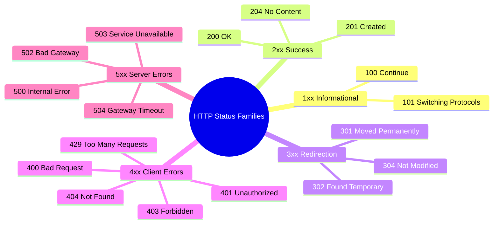
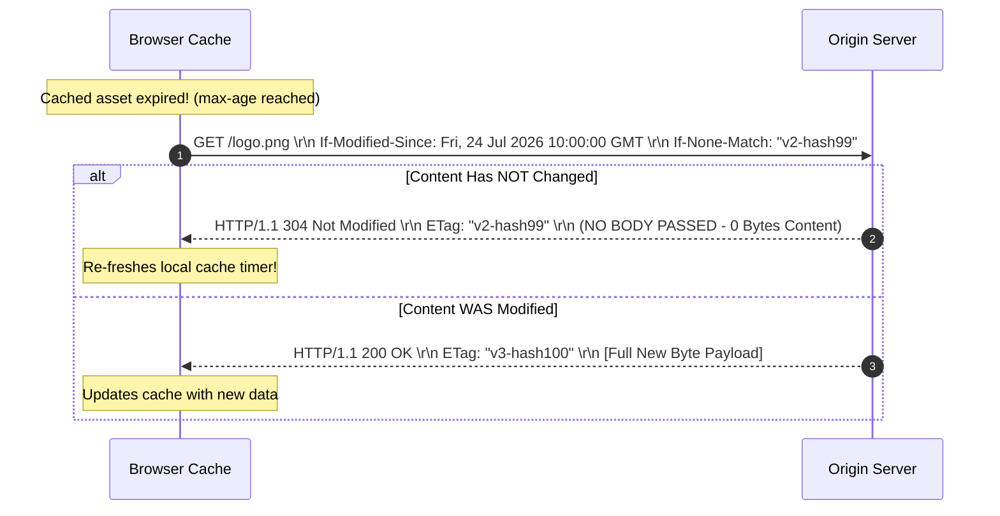
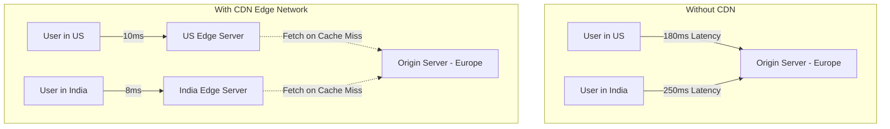

## Topic 4: HTTP Protocol Mechanics, Messages, Security (HTTPS), State Management, and Caching Infrastructures

---

## 1. Prerequisites & Context

Before analyzing the inner mechanics of the **Hypertext Transfer Protocol (HTTP)**, recall its foundation within the TCP/IP stack:

* **Layer Placement:** HTTP is a stateless, text/binary-based **Application Layer (Layer 7)** protocol.
* **Transport Dependency:** Historically bound to **TCP** on port 80 (HTTP) or 443 (HTTPS). Modern HTTP/3 operates over **QUIC (UDP)** on port 443.
* **Statelessness:** By default, every HTTP request processed by a server is executed independently without inherent memory of preceding requests.

---

## 2. Anatomy of HTTP Messages

HTTP uses two message types: **Requests** (Client $\rightarrow$ Server) and **Responses** (Server $\rightarrow$ Client).

### 2.1 HTTP Request Message Format

An HTTP Request consists of three distinct components separated by **CRLF (`\r\n`)** delimiters:

1. **Request Line:** Contains the Method, Request URI, and HTTP Version.
2. **Request Headers:** Key-value metadata controlling content negotiation, authentication, and caching.
3. **Empty Line (`\r\n`):** MANDATORY line separator signaling the end of the header block.
4. **Message Body (Optional):** Payload data (JSON, form data, file bytes) sent with methods like `POST` or `PUT`.

```
+-----------------------------------------------------------------------+
|  Request Line:  <METHOD> <SP> <REQUEST-URI> <SP> <HTTP-VERSION> \r\n |
+-----------------------------------------------------------------------+
|  Headers:       <Header-Name>: <Header-Value> \r\n                   |
|                 <Header-Name>: <Header-Value> \r\n                   |
+-----------------------------------------------------------------------+
|  Empty Line:    \r\n                                                  |
+-----------------------------------------------------------------------+
|  Entity Body:   [Optional Payload / JSON Data / Form Data]            |
+-----------------------------------------------------------------------+

```

#### Raw Request ASCII Wire Example:

```http
POST /api/v1/users HTTP/1.1\r\n
Host: api.example.com\r\n
User-Agent: Mozilla/5.0 (X11; Linux x86_64)\r\n
Content-Type: application/json\r\n
Content-Length: 38\r\n
Connection: keep-alive\r\n
\r\n
{"name": "Alice", "role": "Engineer"}

```

---

### 2.2 HTTP Response Message Format

```
+-----------------------------------------------------------------------+
|  Status Line:   <HTTP-VERSION> <SP> <STATUS-CODE> <SP> <REASON> \r\n  |
+-----------------------------------------------------------------------+
|  Headers:       <Header-Name>: <Header-Value> \r\n                   |
|                 <Header-Name>: <Header-Value> \r\n                   |
+-----------------------------------------------------------------------+
|  Empty Line:    \r\n                                                  |
+-----------------------------------------------------------------------+
|  Entity Body:   [Requested Resource Data / HTML / JSON Payload]       |
+-----------------------------------------------------------------------+

```

#### Raw Response ASCII Wire Example:

```http
HTTP/1.1 200 OK\r\n
Date: Fri, 31 Jul 2026 12:00:00 GMT\r\n
Server: Nginx/1.24.0\r\n
Content-Type: application/json; charset=utf-8\r\n
Content-Length: 52\r\n
Cache-Control: max-age=3600, public\r\n
ETag: "33a64df551425f" \r\n
\r\n
{"status": "success", "data": {"user_id": 1042}}

```

---

## 3. HTTP Methods & Semantic Properties

HTTP defines a set of request methods indicating the desired action to be performed on the identified resource.

### 3.1 Key Properties: Idempotency vs. Safety

* **Safe Methods:** Methods that **do not alter the server state** (read-only operations). They can be cached without risk.
* **Idempotent Methods:** Methods where executing $N > 1$ identical requests yields the **exact same side-effect on the server** as executing a single request.

$$\text{SideEffect}(f(x)) = \text{SideEffect}(f(f(x)))$$

| HTTP Method | Primary Purpose / CRUD Action | Safe? | Idempotent? | Request Body? | Response Body? |
| --- | --- | --- | --- | --- | --- |
| **GET** | Retrieve resource representation. | **Yes** | **Yes** | No | **Yes** |
| **HEAD** | Same as GET, but returns **headers only** (no body). | **Yes** | **Yes** | No | No |
| **POST** | Create a new subordinate resource / process data. | **No** | **No** | **Yes** | **Yes** |
| **PUT** | Replace target resource completely (or create if absent). | **No** | **Yes** | **Yes** | Optional |
| **PATCH** | Apply partial modifications to a resource. | **No** | **No** | **Yes** | **Yes** |
| **DELETE** | Remove target resource from the server. | **No** | **Yes** | Optional | Optional |
| **OPTIONS** | Describe communication options for target resource (CORS). | **Yes** | **Yes** | No | **Yes** |
| **CONNECT** | Establish a transparent TCP tunnel (used for SSL proxies). | **No** | **No** | **Yes** | **Yes** |

---

## 4. HTTP Status Code Classifications

HTTP Status Codes are 3-digit integers categorized into 5 functional families based on their leading digit:



### 4.1 Detailed Status Code Reference Table

| Code | Status Name | Technical Meaning & Practical Scenario |
| --- | --- | --- |
| **100** | Continue | Initial request headers received; client should proceed to send large request body. |
| **101** | Switching Protocols | Server agrees to switch protocols (e.g., upgrading HTTP/1.1 to WebSocket). |
| **200** | OK | Standard success response for GET, PUT, or POST requests. |
| **201** | Created | Request fulfilled; new resource successfully created (returns `Location` header). |
| **204** | No Content | Request succeeded, but server intentionally returns no message body (e.g., `DELETE`). |
| **301** | Moved Permanently | Resource moved permanently to a new URI. Search engines transfer SEO rank to new URI. |
| **302** | Found | Temporary redirect. Clients should continue using original URI for future requests. |
| **304** | Not Modified | **Conditional Validation Success:** Cached resource is fresh; server sends no body. |
| **400** | Bad Request | Server cannot process request due to client syntax error or malformed JSON payload. |
| **401** | Unauthorized | Authentication is required (missing or invalid Authorization token/credentials). |
| **403** | Forbidden | Server understands request but refuses authorization (authenticated user lacks permission). |
| **404** | Not Found | Target server cannot locate the requested URI path. |
| **409** | Conflict | Request conflicts with current server state (e.g., duplicate user email entry). |
| **429** | Too Many Requests | Rate limiting triggered; client exceeded allowed request threshold in a given window. |
| **500** | Internal Server Error | Generic crash / unhandled exception in application server business logic. |
| **502** | Bad Gateway | Reverse proxy (e.g., NGINX) received an invalid response from upstream app server. |
| **503** | Service Unavailable | Server overloaded or down for maintenance; unable to process requests currently. |
| **504** | Gateway Timeout | Upstream backend server failed to send response to reverse proxy within configured timeout. |

---

## 5. State Management: Cookies and Sessions

Because pure HTTP is **stateless**, state management mechanisms allow web applications to track user identity, shopping carts, and login state across multiple requests.

### 5.1 Architecture: Session ID Cookie Pattern

```mermaid
sequenceDiagram
    autonumber
    participant Browser
    participant Server
    participant DB as Session Store (Redis)

    Browser->>Server: 1. POST /login (credentials)
    Note over Server: Validates credentials
    Server->>DB: 2. Create Session (ID: "xyz987", User: Alice)
    Server-->>Browser: 3. HTTP 200 OK + Set-Cookie: SID=xyz987; Secure; HttpOnly; SameSite=Strict
    
    Note over Browser: Stores SID in Cookie Jar
    
    Browser->>Server: 4. GET /dashboard (Cookie: SID=xyz987)
    Server->>DB: 5. Lookup "xyz987"
    DB-->>Server: 6. Returns User Context (Alice)
    Server-->>Browser: 7. HTTP 200 OK (Rendered Dashboard)

```

### 5.2 Critical Cookie Security Directives

When servers issue cookies via the `Set-Cookie` response header, security attributes prevent client-side exploits:

```http
Set-Cookie: session_id=a8f9c12b; Expires=Sat, 01 Aug 2026 00:00:00 GMT; Secure; HttpOnly; SameSite=Strict; Path=/

```

1. **`Secure`:** Mandates that browser transmit cookie **only over encrypted HTTPS** connections.
2. **`HttpOnly`:** Blocks client-side JavaScript (`document.cookie`) from accessing the cookie, preventing **Cross-Site Scripting (XSS)** token theft.
3. **`SameSite`:** Controls cross-origin cookie transmission to prevent **Cross-Site Request Forgery (CSRF)**:
* `Strict`: Cookie never sent in cross-site requests (e.g., following external links).
* `Lax`: Cookie sent during top-level cross-site GET navigations.
* `None`: Cookie sent in all cross-site requests (requires `Secure` attribute).


---

## 6. HTTP vs. HTTPS (Security Layer Architecture)

**HTTPS (HTTP Secure)** is not a separate application protocol; it is standard HTTP executing over an encrypted **TLS (Transport Layer Security)** connection.

```
+-----------------------------------+          +-----------------------------------+
|         HTTP (Port 80)            |          |         HTTPS (Port 443)          |
+-----------------------------------+          +-----------------------------------+
|               TCP                 |   VS.    |         HTTP Application          |
+-----------------------------------+          +-----------------------------------+
|               IP                  |          |        TLS 1.3 Security           |
+-----------------------------------+          +-----------------------------------+
|         Physical Network          |          |               TCP                 |
+-----------------------------------+          +-----------------------------------+

```

### 6.1 Security Guarantees Provided by HTTPS

1. **Confidentiality:** Symmetric encryption (AES-GCM / ChaCha20) prevents eavesdropping.
2. **Integrity:** Message Authentication Codes (HMAC) or AEAD ciphers prevent active packet tampering.
3. **Authentication:** X.509 digital certificates and PKI (Public Key Infrastructure) verify server identity, preventing Man-in-the-Middle (MitM) spoofing.

---

## 7. Web Caching & Conditional Validation

Web caching stores copies of responses locally or in intermediate nodes to minimize network latency, bandwidth consumption, and server load.

### 7.1 Cache Control Headers (`Cache-Control`)

Modern caching behavior is dictated by the `Cache-Control` header:

* `Cache-Control: max-age=3600`: Resource considered **fresh** for 3600 seconds ($1 \text{ hour}$).
* `Cache-Control: no-cache`: Forces cache to **revalidate resource with origin server** via conditional request before serving cached copy.
* `Cache-Control: no-store`: **Prohibits caching entirely.** Sensitive data must not be written to disk/memory storage.
* `Cache-Control: public`: Response may be cached by shared intermediate caches (CDNs, Proxies).
* `Cache-Control: private`: Response restricted to single end-user browser storage; shared caches must not store it.

---

### 7.2 Conditional Validation (Freshness Verification)

When a cached object reaches its `max-age` expiration, the cache does not immediately discard it. It issues a **Conditional GET Request** to the origin server to verify whether the underlying content has changed.



### 7.3 Validation Header Pairs

1. **Time-Based Validation:**
* Response Header: `Last-Modified: <HTTP-Date>`
* Conditional Request: `If-Modified-Since: <HTTP-Date>`


2. **Entity Tag (ETag) Validation (Preferred):**
* Response Header: `ETag: "<cryptographic-hash-of-content>"`
* Conditional Request: `If-None-Match: "<cryptographic-hash-of-content>"`


---

## 8. Content Delivery Networks (CDNs)

A **Content Delivery Network (CDN)** is a geographically distributed network of proxy servers (Edge Nodes) that cache and deliver web assets to end-users from the closest physical location.



### 8.1 Anycast Routing Mechanics in CDNs

CDNs leverage **BGP Anycast Routing**. Multiple physical edge data centers publish the exact same IP address to global routers. Internet routing protocols naturally navigate a client's packets to the topologically closest edge data center, minimizing Round-Trip Time (RTT).

---

## 9. Code Demonstration: Caching & Conditional Validation

Below is a complete, runnable Python HTTP Server using `http.server` demonstrating `ETag` generation, `Cache-Control`, and `304 Not Modified` conditional responses:

```python
from http.server import HTTPServer, BaseHTTPRequestHandler
import hashlib
import time

# Simulated server file content
FILE_CONTENT = b"<html><body><h1>Master Class HTTP Caching Demo</h1></body></html>"
# Calculate cryptographic ETag hash of the body content
ETAG_HASH = f'"{hashlib.md5(FILE_CONTENT).hexdigest()}"'

class CachingHTTPHandler(BaseHTTPRequestHandler):
    def do_GET(self):
        # 1. Inspect conditional headers sent by client
        client_if_none_match = self.headers.get('If-None-Match')

        # 2. Check if client's cached ETag matches current content ETag
        if client_if_none_match == ETAG_HASH:
            # Resource has NOT changed! Send 304 Not Modified (No Body)
            self.send_response(304)
            self.send_header('ETag', ETAG_HASH)
            self.send_header('Cache-Control', 'public, max-age=60')
            self.end_headers()
            print("[SERVER LOG] 304 Not Modified sent. Bandwidth saved!")
            return

        # 3. Content modified or fresh request: Send 200 OK + Payload
        self.send_response(200)
        self.send_header('Content-Type', 'text/html; charset=utf-8')
        self.send_header('Content-Length', str(len(FILE_CONTENT)))
        self.send_header('ETag', ETAG_HASH)
        self.send_header('Cache-Control', 'public, max-age=60')
        self.end_headers()
        self.wfile.write(FILE_CONTENT)
        print("[SERVER LOG] 200 OK sent with full payload.")

def run():
    server_address = ('127.0.0.1', 8080)
    httpd = HTTPServer(server_address, CachingHTTPHandler)
    print("Serving HTTP Caching Demo on http://127.0.0.1:8080...")
    try:
        httpd.serve_forever()
    except KeyboardInterrupt:
        httpd.server_close()

if __name__ == '__main__':
    run()

```

---

## 10. High-Yield External References & Visualization Resources

* **IETF RFC 9110 (HTTP Semantics & Headers):** Official standard specification available at [RFC 9110 Specification](https://www.rfc-editor.org/rfc/rfc9110.html).
* **MDN Web Docs - Caching Guide:** Comprehensive guide at [MDN HTTP Caching](https://developer.mozilla.org/en-US/docs/Web/HTTP/Caching).
* **Cloudflare Developer Docs on CDN Caching:** Architectural details at [Cloudflare Caching Directives](https://developers.cloudflare.com/cache/).

---

## 11. Exam Tips & Commonly Asked Questions

> ### 🧠 Exam Tip 1: PUT vs. POST Idempotency
> 
> 
> * **POST:** **Non-idempotent.** Executing `POST /users` five times creates five distinct records in the database (e.g., IDs 1, 2, 3, 4, 5).
> * **PUT:** **Idempotent.** Executing `PUT /users/10` five times replaces user 10 with the specified payload five times. The end state of the server is identical after the first request and the fifth request.
> 
> 

> ### 🧠 Exam Tip 2: 304 Not Modified Response Body
> 
> 
> * An HTTP `304 Not Modified` response **MUST NOT contain a message body**. It contains only headers (`ETag`, `Date`, `Cache-Control`). This saves network bandwidth by instructing the browser to render the copy stored in its local cache.
> 
> 

---

## 12. Frequently Asked Interview Questions

### Q1: What is the difference between `Cache-Control: no-cache` and `Cache-Control: no-store`?

* **`no-cache`:** Allows caches to store a copy of the response, but **forces them to revalidate it** with the origin server (via `If-None-Match` or `If-Modified-Since`) before serving it to a client.
* **`no-store`:** Completely **prohibits storing the response** in any temporary memory or disk storage. It is used for sensitive financial or medical data.

### Q2: How do `HttpOnly` and `SameSite` cookie flags mitigate XSS and CSRF attacks?

* **`HttpOnly`:** Prevents client-side scripts from reading `document.cookie`, neutralizing session-hijacking attacks stemming from **Cross-Site Scripting (XSS)**.
* **`SameSite=Strict`:** Directs browsers not to attach the cookie to cross-site requests, mitigating **Cross-Site Request Forgery (CSRF)** attacks where malicious external sites attempt forged actions on behalf of authenticated users.

---

## 13. Topic Summary

* **Message Structure:** Formatted with Request/Status lines, HTTP Headers, CRLF (`\r\n`) delimiters, and optional Entity Bodies.
* **Methods & Statuses:** `GET`/`HEAD` are safe; `PUT`/`DELETE` are idempotent; `POST` is neither. Statuses are grouped into 1xx, 2xx, 3xx, 4xx, and 5xx families.
* **State & HTTPS:** Cookies persist state across stateless HTTP requests using `Secure`, `HttpOnly`, and `SameSite` flags. HTTPS secures transport via TLS encryption and PKI authentication.
* **Caching & CDNs:** Controlled via `Cache-Control` headers and verified using conditional validation (`ETag` / `If-None-Match`). CDNs distribute caching globally using BGP Anycast to minimize latency.

---