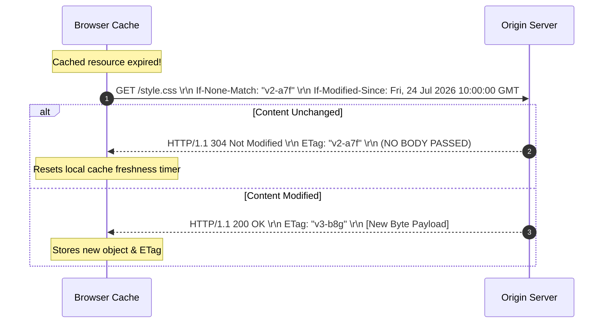
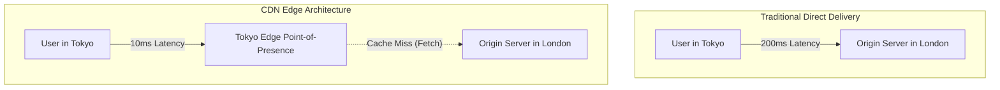

Continuing from the foundational HTTP message formats and methods, this section focuses on state persistence, secure transport, and performance optimization techniques across the web stack.

---

## 1. State Management: Cookies and Sessions

Because HTTP is fundamentally stateless, modern applications rely on client-side and server-side state abstractions to persist user identity, shopping carts, and preferences across individual TCP transactions.

### 1.1 Cookies vs. Sessions

* **Cookie:** Small key-value text data sent by the server via the `Set-Cookie` header and stored locally by the user's browser. The browser automatically attaches stored cookies to future HTTP requests matching the specified scope (`Domain` and `Path`).
* **Session:** A server-side data structure storing detailed state information (e.g., user profiles, permissions). Rather than passing raw session data across the wire, the server stores a unique, opaque **Session Identifier (Session ID)** in a cookie on the client.

```mermaid
sequenceDiagram
    autonumber
    participant Client as Browser
    participant Server as Application Server
    participant DB as Redis Session Store

    Client->>Server: 1. POST /login (Credentials)
    Note over Server: Validates user identity
    Server->>DB: 2. Create Session Record (User ID, Metadata)
    DB-->>Server: 3. Return Session ID ("sess_99x3a")
    Server-->>Client: 4. 200 OK + Set-Cookie: SID=sess_99x3a; Secure; HttpOnly
    
    Note over Client: Stores SID in Cookie Jar
    
    Client->>Server: 5. GET /profile (Cookie: SID=sess_99x3a)
    Server->>DB: 6. Lookup Session State ("sess_99x3a")
    DB-->>Server: 7. Return Active User Context
    Server-->>Client: 8. 200 OK (Rendered Profile Data)

```

### 1.2 Essential Cookie Security Attributes

Properly configuring cookie attributes mitigates client-side security risks such as **Cross-Site Scripting (XSS)** and **Cross-Site Request Forgery (CSRF)**:

```http
Set-Cookie: session_id=a8f9c12b; Expires=Sat, 01 Aug 2026 00:00:00 GMT; Secure; HttpOnly; SameSite=Strict; Path=/

```

* **`Secure`:** Instructs the browser to transmit the cookie strictly over encrypted HTTPS connections.
* **`HttpOnly`:** Blocks access to the cookie from client-side DOM APIs (`document.cookie`), neutralizing credential theft via XSS vulnerabilities.
* **`SameSite`:** Controls cross-site cookie transmission to defend against CSRF attacks:
* `Strict`: Cookie is never sent in cross-site subrequests or navigation links.
* `Lax`: Sent only on top-level top-window GET navigations from third-party sites.
* `None`: Transmitted in all cross-site contexts (requires the `Secure` flag).


---

## 2. HTTP versus HTTPS

**HTTPS (HTTP Secure)** layering inserts **Transport Layer Security (TLS)** between the Application Layer (HTTP) and the Transport Layer (TCP).

---

### 2.1 Security Model & Guarantees

HTTPS provides three core cryptographic guarantees:

1. **Confidentiality:** Symmetrically encrypted stream prevents packet sniffing on untrusted networks (AES-GCM, ChaCha20-Poly1305).
2. **Integrity:** Message Authentication Codes (HMAC) or AEAD ciphers prevent active packet modification or injection.
3. **Authentication:** Digital Certificates issued by Public Key Infrastructure (PKI) Certificate Authorities (CAs) verify server identity using asymmetric cryptography (RSA / ECDSA).

### 2.2 Protocol Comparison

| Metric / Attribute | Plain HTTP | Encrypted HTTPS |
| --- | --- | --- |
| **Default Port** | TCP Port 80 | TCP Port 443 |
| **Protocol Stack** | HTTP $\rightarrow$ TCP $\rightarrow$ IP | HTTP $\rightarrow$ **TLS** $\rightarrow$ TCP $\rightarrow$ IP |
| **Connection Handshake** | 1 RTT (TCP 3-way Handshake) | 2 RTT (TCP + TLS 1.2 Handshake) / **1 RTT (TLS 1.3)** |
| **Eavesdropping Risk** | High (Cleartext payload readable via Wireshark) | Protected (Cryptographically encrypted ciphertext) |
| **Certificate Overhead** | None | Requires domain validation and X.509 server certificate |

---

## 3. Web Caching & Conditional Validation

Web caching reduces latency, cuts bandwidth overhead, and shields origin servers by saving fresh resource representations closer to the client.

---

### 3.1 Directing Cache Behavior (`Cache-Control`)

Response freshness and storage rules are declared using HTTP/1.1 `Cache-Control` directives:

* `Cache-Control: max-age=3600`: Specifies the resource is fresh for 3,600 seconds ($1\text{ hour}$).
* `Cache-Control: no-cache`: The resource can be stored, but **must be validated with the origin server** before every reuse.
* `Cache-Control: no-store`: Completely **prohibits storage** in local or shared caches (used for sensitive financial or personal data).
* `Cache-Control: public`: Indicates the response may be cached by shared intermediate nodes (CDNs, reverse proxies).
* `Cache-Control: private`: Restricts caching exclusively to the end-user browser storage.

---

### 3.2 Conditional Validation Mechanisms

When a stored resource expires (`max-age` elapses), a cache doesn't immediately discard it. Instead, it issues a **Conditional GET** to the origin server to verify if the content has changed.



#### Validation Header Pairs

1. **Entity Tag Validation (Strong Validation - Preferred):**
* Server sends: `ETag: "v2-a7f"` (a hash of the file content).
* Client checks with: `If-None-Match: "v2-a7f"`.


2. **Timestamp Validation (Weak Validation):**
* Server sends: `Last-Modified: Fri, 24 Jul 2026 10:00:00 GMT`.
* Client checks with: `If-Modified-Since: Fri, 24 Jul 2026 10:00:00 GMT`.


If the resource has not changed, the server responds with **`304 Not Modified`** without a body, saving significant network payload bytes.

---

## 4. Content Delivery Networks (CDNs)

A **Content Delivery Network (CDN)** is a geographically distributed network of proxy servers (Edge Nodes) configured to cache static and dynamic content close to users worldwide.



### 4.1 Routing to Edge Nodes (BGP Anycast)

CDNs route user traffic to the optimal edge node using **BGP Anycast**:

* Multiple Edge Data Centers around the world broadcast the exact same IP address.
* Border Gateway Protocol (BGP) routing tables automatically direct client packets along the shortest Internet path (lowest Autonomous System hop count) to the nearest Point-of-Presence (PoP).

---

## 5. Python Demo: Validating Cache and Conditional Requests

The following executable Python script demonstrates an HTTP server handling ETags, `Cache-Control`, and returning `304 Not Modified` on cache hits:

```python
from http.server import HTTPServer, BaseHTTPRequestHandler
import hashlib

RESPONSE_DATA = b"console.log('Application initialized successfully.');"
ETAG_VAL = f'"{hashlib.md5(RESPONSE_DATA).hexdigest()}"'

class ConditionalCacheHandler(BaseHTTPRequestHandler):
    def do_GET(self):
        client_etag = self.headers.get('If-None-Match')

        # Conditional validation check
        if client_etag == ETAG_VAL:
            self.send_response(304)  # Not Modified
            self.send_header('ETag', ETAG_VAL)
            self.send_header('Cache-Control', 'public, max-age=300')
            self.end_headers()
            return

        # Full response on initial fetch or content mismatch
        self.send_response(200)
        self.send_header('Content-Type', 'application/javascript')
        self.send_header('Content-Length', str(len(RESPONSE_DATA)))
        self.send_header('ETag', ETAG_VAL)
        self.send_header('Cache-Control', 'public, max-age=300')
        self.end_headers()
        self.wfile.write(RESPONSE_DATA)

if __name__ == '__main__':
    server = HTTPServer(('127.0.0.1', 8080), ConditionalCacheHandler)
    print("Caching server running on http://127.0.0.1:8080...")
    server.serve_forever()

```

---