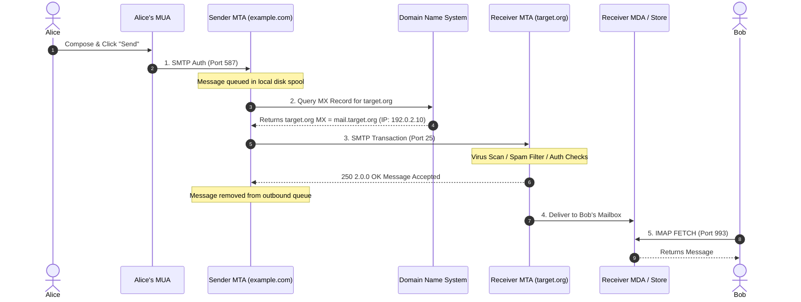
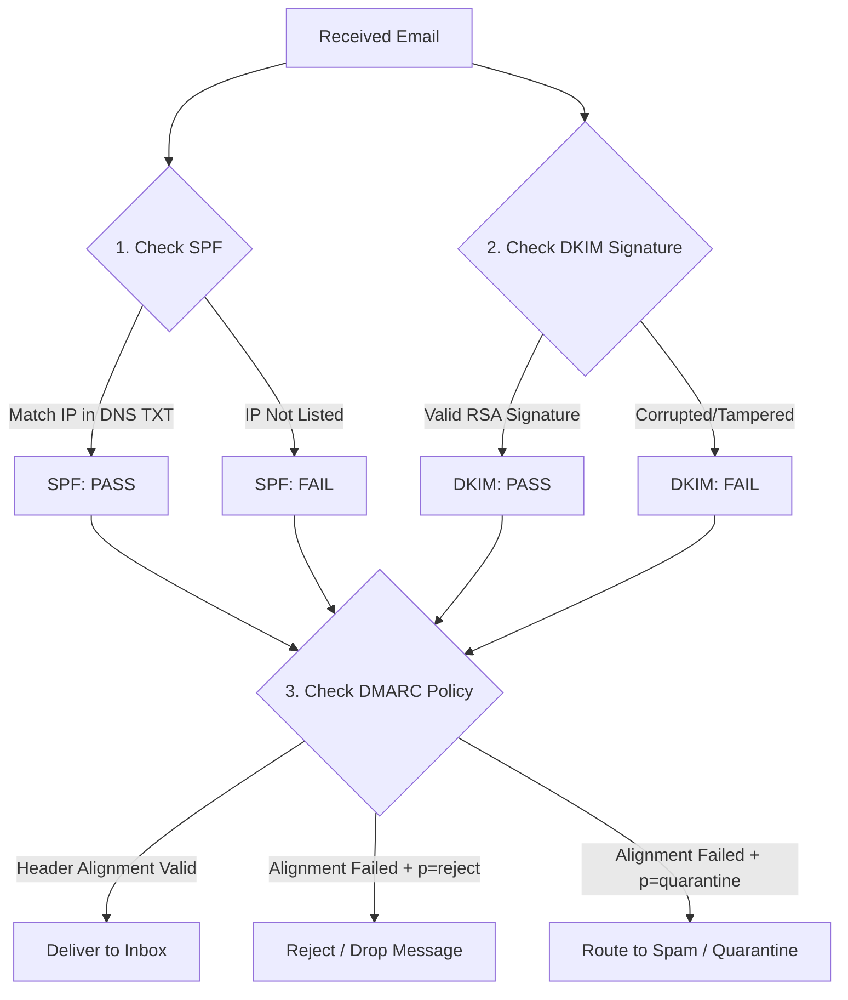

# Electronic Mail Protocols and SMTP Architecture

Electronic Mail (Email) is one of the foundational application-layer systems on the Internet. Originally designed in the early days of ARPANET as a simple plain-text message transport mechanism, it has evolved into a global, federated infrastructure governed by a suite of cooperating protocols.

---

## 1. Email is a System of Interoperating Protocols

An email does not travel end-to-end via a single protocol. Instead, it relies on a ecosystem of distinct, specialized protocol roles operating at different stages of the delivery lifecycle:

```
+---------------------------------------------------------------------------------------+
|                               EMAIL SYSTEM ARCHITECTURE                               |
+---------------------------------------------------------------------------------------+

 [ User Agent ] ──(SMTP)──> [ Submission Server / MSA ]
 (e.g., Outlook,                     │
  Apple Mail)                   (SMTP Relay)
                                     ▼
                            [ Mail Transfer Agent ] (MTA - Sender Domain)
                                     │
                                (DNS MX Lookup)
                                     │
                                (SMTP / Port 25)
                                     ▼
                            [ Mail Transfer Agent ] (MTA - Recipient Domain)
                                     │
                                (Local Delivery)
                                     ▼
                            [ Mail Delivery Agent ] (MDA / Local Store)
                                     │
                               (IMAP or POP3)
                                     ▼
 [ User Agent ] <────────────────────┘
 (Recipient Client)

```

### Core Architecture Components

* **Mail User Agent (MUA):** The client application used by end users to compose, send, and read email (e.g., Outlook, Thunderbird, Apple Mail, or Webmail interfaces).
* **Mail Submission Agent (MSA):** Accepts outgoing mail from the MUA on submission ports (typically TCP `587` with STARTTLS) and verifies user authentication.
* **Mail Transfer Agent (MTA):** The core routing engine (e.g., Postfix, Sendmail, Exchange) that transfers mail between servers across the Internet using **SMTP** on TCP `25`.
* **Mail Delivery Agent (MDA):** Receives mail from the destination MTA and stores it in local storage (e.g., Maildir, Mbox format) or mailbox databases.
* **Access Protocols (IMAP / POP3):** Protocols used by recipient MUAs to retrieve stored messages from the MDA.

---

## 2. The Store-and-Forward Path

Unlike real-time interactive communications (like VoIP or WebSockets), email relies on an asynchronous **Store-and-Forward** processing model.



### Key Stages in Delivery

1. **Submission & Spooling:** When a user clicks "Send", the client transmits the message to the sender's MTA. If the outbound destination is unreachable, the sender's MTA **spools** (stores) the message on disk and retries periodically (typically for 4–5 days before returning a Non-Delivery Report (NDR) "bounce" message).
2. **DNS MX Lookup:** The sender's MTA extracts the recipient domain (e.g., `target.org` from `bob@target.org`) and queries DNS for the domain's **Mail Exchanger (MX)** record to resolve the destination server's IP address.
3. **MTA-to-MTA Relay:** The sender's MTA connects to the receiver's MTA over TCP Port 25, negotiates TLS encryption, and transfers the payload.
4. **Local Delivery:** The destination MTA passes the verified payload to the MDA for local mailbox disk storage.

---

## 3. Simplified SMTP Dialogue

The **Simple Mail Transfer Protocol (SMTP)** is an ASCII text-based request-response protocol defined in RFC 5321. Commands are sent by the client, and the server replies with 3-digit status codes accompanied by explanatory text.

Below is an annotated sequence of a raw SMTP session between a client/sender MTA and a destination MTA:

```http
S: 220 mail.target.org ESMTP Postfix Service Ready\r\n
C: EHLO mail.example.com\r\n
S: 250-mail.target.org Hello mail.example.com\r\n
S: 250-SIZE 35651584\r\n
S: 250-STARTTLS\r\n
S: 250 OK\r\n
C: MAIL FROM:<alice@example.com>\r\n
S: 250 2.1.0 Ok\r\n
C: RCPT TO:<bob@target.org>\r\n
S: 250 2.1.5 Ok\r\n
C: DATA\r\n
S: 354 End data with <CR><LF>.<CR><LF>\r\n
C: From: Alice Smith <alice@example.com>\r\n
C: To: Bob Jones <bob@target.org>\r\n
C: Subject: Project Status Update\r\n
C: \r\n
C: Hi Bob,\r\n
C: The project documentation is finalized.\r\n
C: \r\n
C: Regards,\r\n
C: Alice\r\n
C: .\r\n
S: 250 2.0.0 Ok: queued as 4YvK3k2xPz1\r\n
C: QUIT\r\n
S: 221 2.0.0 Bye\r\n

```

### Essential Command Breakdown

* `EHLO` (Extended Hello): Identifies the connecting client domain and requests extended service capabilities (e.g., encryption, size limits).
* `MAIL FROM:` Specifies the **Envelope Sender** address used for delivery error notifications.
* `RCPT TO:` Specifies the **Envelope Recipient** address used by the MTA to route the message.
* `DATA:` Signals the start of the message header and body contents, terminated by a single line containing only a period (`.\r\n`).

---

## 4. Envelope vs. Visible Header

One of the most critical structural concepts in email is the distinction between the **Envelope Address** (Layer 4/3 routing metadata) and the **Visible Header** (Layer 7 presentation data displayed in the user's MUA).

```
   +-----------------------------------------------------+
   | ENVELOPE (SMTP Protocol Level)                      |
   |                                                     |
   |  MAIL FROM: <return-path@bounce-service.com>        |
   |  RCPT TO:   <bob@target.org>                        |
   |                                                     |
   |  +-----------------------------------------------+  |
   |  | VISIBLE HEADERS & BODY (DATA Payload)         |  |
   |  |                                               |  |
   |  |  From: Alice Smith <alice@example.com>        |  |
   |  |  To: Bob Jones <bob@target.org>               |  |
   |  |  Subject: Quarterly Invoice                   |  |
   |  |                                               |  |
   |  |  [ Message Body Text ]                        |  |
   |  +-----------------------------------------------+  |
   +-----------------------------------------------------+

```

### Architectural Comparison

| Attribute | Envelope Metadata | Visible Headers |
| --- | --- | --- |
| **Source Protocol** | Provided directly in `MAIL FROM:` and `RCPT TO:` commands during the live SMTP session. | Transmitted inside the `DATA` payload block of the message. |
| **Visibility** | Completely hidden from normal end users in email clients. | Visible to the end user in MUA headers (`From:`, `To:`, `Subject:`). |
| **Routing Impact** | Used by MTAs to route messages and handle bounced mail (Return-Path). | Ignored by MTAs during routing; parsed purely by the client MUA for rendering. |
| **Spoofing Vulnerability** | Validated via SPF authentication checks. | Historically unvalidated; can be set to any arbitrary string unless verified via **DKIM** and **DMARC**. |

> **Postal Analogy:** The **Envelope** is the physical paper envelope with postmarked addresses used by the postal worker to route the letter. The **Visible Header** is the letterhead inside the envelope—which can claim to be written by anyone.

---

## 5. Message Access Protocols: POP3 vs. IMAP vs. Webmail

While SMTP is used to *send* and *relay* messages, users require dedicated protocols to *retrieve* messages from their mailbox store.

| Feature / Metric | POP3 (Post Office Protocol v3) | IMAP4 (Internet Message Access Protocol v4) |
| --- | --- | --- |
| **Standard Port** | TCP `110` (Cleartext) / `995` (Implicit TLS) | TCP `143` (Cleartext/STARTTLS) / `993` (Implicit TLS) |
| **Primary Design Model** | **Download and Delete:** Downloads mail to local storage and removes it from the server. | **Sync and Retain:** Keeps messages stored centrally on the server; synchronizes status flags across devices. |
| **Multi-Device Support** | Poor; downloading messages on one device hides them from others. | Excellent; state changes (read, unread, deleted, moved) sync across all devices. |
| **Folder Management** | Local folders only; server folders are not created or synchronized. | Full support for server-side folders, hierarchy, and searching. |
| **Bandwidth Use** | Downloads complete messages immediately. | Selective; downloads headers first and retrieves bodies/attachments on demand. |

---

## 6. MIME (Multipurpose Internet Mail Extensions)

The original SMTP standard (RFC 822) was restricted strictly to **7-bit ASCII text lines** under 1,000 characters. To support binary file attachments, multi-language character sets (e.g., UTF-8), and rich HTML formatting, **MIME (RFC 2045–2049)** was created.

### MIME Multipart Message Structure

MIME encodes arbitrary binary objects into text streams (using encoding formats like **Base64** or **Quoted-Printable**) and uses `boundary` delimiter strings to separate different content parts.

```http
Content-Type: multipart/mixed; boundary="----=_NextPart_000_001A"

------=_NextPart_000_001A
Content-Type: text/plain; charset="utf-8"
Content-Transfer-Encoding: 7bit

Hi Bob, please find the updated report attached.

------=_NextPart_000_001A
Content-Type: application/pdf; name="Report.pdf"
Content-Transfer-Encoding: base64
Content-Disposition: attachment; filename="Report.pdf"

JVBERi0xLjUNCiW1tbW1DQoxIDAgb2JqDQo8PA0KL1R5cGUgL0NhdGFsb2cNCi9QYXJlbnRz
... [Base64-encoded binary PDF payload] ...
------=_NextPart_000_001A--

```

---

## 7. Email Security Frameworks: SPF, DKIM, and DMARC

Because original SMTP lacks inherent authentication, modern domain operators deploy a triplet of complementary cryptographic and DNS standards to prevent domain spoofing and phishing.



### 1. SPF (Sender Policy Framework - RFC 7208)

* **How It Works:** A domain owner publishes a DNS `TXT` record listing the IP addresses and hostnames authorized to send mail on behalf of their domain's `MAIL FROM` address.
* **Example DNS Record:** `v=spf1 ip4:192.0.2.0/24 include:_spf.google.com -all`
* **Limitation:** Validates only the **Envelope Sender** (`MAIL FROM`), not the visible `From:` header shown to the user.

### 2. DKIM (DomainKeys Identified Mail - RFC 6376)

* **How It Works:** The sending MTA calculates an asymmetric cryptographic hash of the message headers and body, signs it with a private key, and embeds the signature in a `DKIM-Signature` header.
* **Validation:** The receiving server queries the sender's DNS for the public key to verify that the message content was not tampered with in transit.

### 3. DMARC (Domain-based Message Authentication, Reporting, and Conformance - RFC 7489)

* **How It Works:** Links SPF and DKIM verification results to the visible `From:` header displayed to the user (**Header Alignment**).
* **Policy Enforcement:** Defines explicit policies instructing receiving mail servers how to handle non-compliant messages:
* `p=none`: Monitor and send performance reports without blocking.
* `p=quarantine`: Send failed messages to the user's Spam/Junk folder.
* `p=reject`: Block and drop the message at the MTA boundary entirely.


---

## 8. Real-World Threat Case Study: CEO Fraud (Business Email Compromise)

**CEO Fraud** is a form of **Business Email Compromise (BEC)** where an attacker impersonates a high-ranking executive to trick an employee (typically in finance or HR) into executing unauthorized wire transfers or releasing sensitive records.

```
       [ ATTACKER ]
            │
            ├─► Option A: Domain Spoofing (Sends as "ceo@company.com" with no DMARC)
            ├─► Option B: Lookalike Domain (Sends as "ceo@comp-any.com")
            └─► Option C: Account Takeover (Compromises real credential via Phishing)
            │
            ▼
       [ TARGET EMPLOYEE ] (Finance Manager)
            │
            │  "URGENT: Process $50,000 wire for confidential acquisition."
            ▼
       [ WIRE TRANSFER / DATA LOSS ]

```

### How Attackers Exploit Architectural Vulnerabilities

1. **Header Mismatching:** Attackers use an external server they control for the SMTP Envelope (`MAIL FROM: attacker@external.com` to pass basic SPF), but set the visible `From:` header to `From: CEO Name <ceo@targetcompany.com>`. Without DMARC enforcement, vulnerable email clients render the fake internal `From:` header to the victim.
2. **Cousin / Lookalike Domains:** Attackers register visually similar domain names (e.g., replacing `company.com` with `comprany.com` or using IDN homograph unicode tricks) to bypass domain authentication checks altogether.

### Defensive Mitigations

* **Enforce Strict DMARC (`p=reject`):** Guarantees that any external message claiming to originate from the corporate domain in the visible `From:` header is dropped if it fails SPF/DKIM alignment.
* **External Email Flagging:** Append prominent visual warnings in MUA client interfaces for incoming messages originating outside the organizational perimeter.
* **Multi-Factor Authentication (MFA) & Process Controls:** Enforce out-of-band verification (e.g., mandatory phone calls or dual-authorization workflows) for all financial transfers, completely bypassing email-only authorization chains.

---

## 9. Code Demonstration: Verifying Email Authentication Records

Below is an executable Python snippet using the `dnspython` library to query and inspect a domain's SPF and DMARC enforcement records:

```python
import dns.resolver

def inspect_email_security(domain: str):
    print(f"--- Email Security Inspection for: {domain} ---")
    
    # 1. Query MX Records
    try:
        mx_answers = dns.resolver.resolve(domain, 'MX')
        print("\n[+] MX (Mail Server) Records:")
        for rdata in mx_answers:
            print(f"  - Priority {rdata.preference}: {rdata.exchange}")
    except Exception as e:
        print(f"[-] MX Query Failed: {e}")

    # 2. Query SPF (TXT Record)
    try:
        txt_answers = dns.resolver.resolve(domain, 'TXT')
        print("\n[+] SPF Configuration:")
        spf_found = False
        for rdata in txt_answers:
            txt_str = rdata.to_text()
            if "v=spf1" in txt_str:
                print(f"  - {txt_str}")
                spf_found = True
        if not spf_found:
            print("  - WARNING: No SPF record found!")
    except Exception as e:
        print(f"[-] SPF Query Failed: {e}")

    # 3. Query DMARC Record
    dmarc_domain = f"_dmarc.{domain}"
    try:
        dmarc_answers = dns.resolver.resolve(dmarc_domain, 'TXT')
        print("\n[+] DMARC Record:")
        for rdata in dmarc_answers:
            print(f"  - {rdata.to_text()}")
    except Exception as e:
        print(f"[-] DMARC Query Failed (Domain may be unprotected): {e}")

if __name__ == '__main__':
    # Inspect a target domain (e.g., google.com)
    # inspect_email_security('google.com')
    pass

```

---

## 10. Topic Summary

* **Multi-Protocol System:** Email relies on a pipeline of protocols: SMTP for submission and relaying, and IMAP/POP3 for end-user retrieval.
* **Store-and-Forward:** Messages are spooled locally at MTAs along the path, resolving destination mail servers via DNS MX queries.
* **Envelope vs. Header:** The envelope dictates actual packet routing (`MAIL FROM`, `RCPT TO`), whereas visible headers (`From:`, `To:`) are displayed in user clients and require validation to prevent spoofing.
* **MIME Extensions:** Enables sending multi-part binary media, documents, and non-ASCII characters over legacy 7-bit ASCII text transport channels.
* **Security Triplet (SPF, DKIM, DMARC):** Essential defense stack designed to cryptographically verify sender identity, preserve content integrity, and protect against CEO fraud and domain spoofing.

---