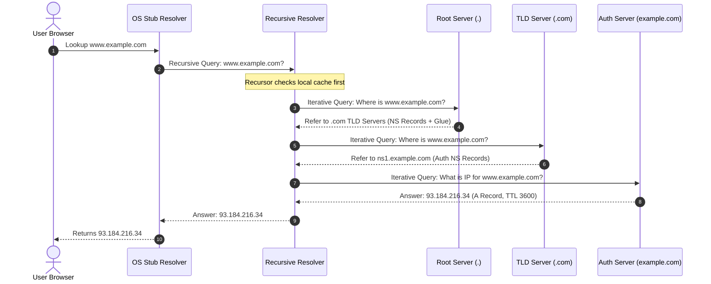

# Domain Name System (DNS) Architecture and Resolution Mechanics

The **Domain Name System (DNS)** is a core distributed database that powers the Internet. Often referred to as the "phonebook of the Internet," DNS maps human-readable hostnames (such as `[www.example.com](https://www.example.com)`) to machine-readable IP addresses (such as `193.0.2.1` or `2606:2800:220:1:248:1893:25c8:1946`), enabling computers to route network traffic efficiently.

---

## 1. Purpose of DNS

Without DNS, users would have to remember numerical IP addresses for every service on the network. DNS provides:

* **Abstraction & Decoupling:** Users access named entities while network equipment routes based on binary/numeric IP addresses. If an application's underlying server IP address changes, updating a single DNS record redirects all user traffic seamlessly.
* **Global Distributed Database:** No single server holds the entire Internet's name mappings. Instead, DNS distributes data across millions of servers globally using a hierarchical naming tree.
* **Service Discovery:** DNS maps more than just IP addresses—it publishes mail routing rules (`MX`), cryptographically signs security policies (`TXT`/`DKIM`), and provides service endpoints (`SRV`).

---

## 2. The Domain Name Hierarchy

DNS is structured as an inverted hierarchical tree starting at a single implicit **Root Node** designated as `.`.

```
                        [ . ] (Root)
                       /  |  \
                     /    |    \
                   /      |      \
               .com      .org     .uk (Top-Level Domains - TLDs)
                /          |        \
         example        wikipedia   co (Second-Level Domains - SLDs)
           /                         \
        www                          uk (Subdomains / Hosts)

```

1. **Root Domain (`.`):** The apex of the entire hierarchy. It is managed by ICANN and distributed globally via 13 root server IP addresses (backed by hundreds of anycast instances).
2. **Top-Level Domains (TLDs):** The highest division below the root. Managed by registries (e.g., Verisign for `.com`).
* **gTLDs (Generic TLDs):** `.com`, `.org`, `.net`, `.gov`, `.edu`.
* **ccTLDs (Country Code TLDs):** `.uk`, `.de`, `.jp`, `.in`.


3. **Second-Level Domains (SLDs):** Domains registered by individuals or organizations under a TLD (e.g., `example` in `example.com`).
4. **Subdomains & Hosts:** Child domains created under an SLD by the domain owner (e.g., `api.example.com` or `[www.example.com](https://www.example.com)`).
5. **Fully Qualified Domain Name (FQDN):** An unambiguous complete path terminated with a trailing dot: `[www.example.com](https://www.example.com).`

---

## 3. DNS Participants and Roles

Resolution relies on four distinct roles working together across the network:

```
+------------------+      +---------------------+      +---------------------+
|  DNS Resolver    | ---> |  Root Nameserver    | ---> |  TLD Nameserver     |
| (Recursive / ISP)| <--- | (Delegates to TLD)  | <--- | (Delegates to Auth) |
+------------------+      +---------------------+      +---------------------+
         ^                                                        |
         |                                                        v
   User Query                                           +---------------------+
         |                                              | Authoritative Server|
         +--------------------------------------------> | (Holds final records)|
                                                        +---------------------+

```

| Participant | Functional Role | Stateful Caching? |
| --- | --- | --- |
| **DNS Stub Resolver** | Built into operating systems and client apps. Accepts name resolution calls from local software and forwards them to a recursive resolver. | Minimal (OS-level cache). |
| **Recursive Resolver (Recursor)** | Operated by ISPs or public DNS providers (e.g., Cloudflare `1.1.1.1`, Google `8.8.8.8`). Traverses the hierarchy on behalf of the client to find answers. | **Heavy Caching** (enforces TTLs). |
| **Root Nameserver** | Returns glue records pointing to the responsible TLD nameservers. | No (Responds to delegation queries). |
| **TLD Nameserver** | Manages TLD registries and returns authority records pointing to the domain's Authoritative Nameservers. | No (Responds to delegation queries). |
| **Authoritative Nameserver** | The ultimate source of truth for a registered domain. Holds actual Resource Records (A, AAAA, CNAME) configured by the domain owner. | Source of Truth (Provides TTLs). |

---

## 4. Simplified Resolution Process (Iterative Lookup)

When a user enters `[http://www.example.com](http://www.example.com)` into a web browser, an iterative query resolution sequence is triggered:



---

## 5. Standard Resource Records (RRs)

Data inside DNS zone files is stored as **Resource Records**. A standard record follows this text structure:

```
[Name]   [TTL]   [Class]   [Type]   [Data]

```

### Common Record Types

| Record Type | Full Name | Purpose & Syntax Example |
| --- | --- | --- |
| **A** | Address Record | Maps a hostname to an IPv4 address.<br>

<br>`[www.example.com](https://www.example.com). 3600 IN A 93.184.216.34` |
| **AAAA** | IPv6 Address Record | Maps a hostname to a 128-bit IPv6 address.<br>

<br>`[www.example.com](https://www.example.com). 3600 IN AAAA 2606:2800:220:1:248:1893:25c8:1946` |
| **CNAME** | Canonical Name Record | Aliases one hostname to another canonical hostname (cannot exist at domain root).<br>

<br>`blog.example.com. 3600 IN CNAME myblog.wordpress.com.` |
| **MX** | Mail Exchanger | Directs domain email delivery to mail servers, prioritized by preference number.<br>

<br>`example.com. 3600 IN MX 10 mail.example.com.` |
| **NS** | Name Server | Specifies the authoritative servers responsible for a zone.<br>

<br>`example.com. 86400 IN NS ns1.dns-provider.com.` |
| **TXT** | Text Record | Stores arbitrary human or machine-readable text. Used heavily for domain security verification (**SPF, DKIM, DMARC**).<br>

<br>`example.com. 3600 IN TXT "v=spf1 include:_spf.google.com -all"` |
| **SOA** | Start of Authority | Contains critical zone metadata including serial number, contact email, and zone refresh timers.<br>

<br>`example.com. IN SOA ns1.example.com. admin.example.com. (2026073101 7200 3600 1209600 3600)` |
| **PTR** | Pointer Record | Performs **Reverse DNS lookups** (mapping an IP address back to a domain name).<br>

<br>`34.216.184.93.in-addr.arpa. 3600 IN PTR [www.example.com](https://www.example.com).` |

---

## 6. Caching mechanics and Time To Live (TTL)

To prevent billions of client queries from overwhelming the Root and Authoritative servers, DNS relies heavily on **hierarchical caching**.

### How TTL Works

Every Resource Record contains a **Time To Live (TTL)** value specified in seconds by the domain administrator:

1. When a Recursive Resolver retrieves an `A` record with a TTL of `3600` (1 hour), it caches that entry locally.
2. For the next 3,600 seconds, any subsequent client asking for that exact domain receives the cached response instantly without querying the authoritative server again.
3. As time ticks down, the cached TTL decrements ($3599, 3598, \dots$). Once the TTL hits `0`, the record expires, forcing the recursor to perform a fresh resolution attempt on the next request.

```
       [ Client Query ] 
              │
              ▼
    +-------------------+
    | Recursive Cache   | ──(Hit: TTL > 0)──> Return Cached Answer Instantly
    +-------------------+
              │
       (Miss: TTL = 0)
              │
              ▼
    [ Authoritative Lookup ] ──> Cache Answer with Full TTL ──> Return Answer

```

---

## 7. Migration Practice: Safely Changing Server IP Addresses

Because resolvers across the globe cache records based on the configured TTL, changing a server's IP address requires careful pre-planning to prevent downtime or serving stale records.

### Step-by-Step Migration Strategy

```
[ Phase 1: Pre-Migration ]           [ Phase 2: Cutover ]              [ Phase 3: Post-Migration ]
Reduce TTL to 300s (5 mins) ──────> Update A Record to New IP ──────> Restore Original TTL (86400s)
Wait out Old TTL (24-48 hrs)         Traffic flips within 5 mins       Zone stabilized

```

1. **Lower the TTL in Advance:** Several days before the planned migration (at least equal to the *old* TTL duration, e.g., 24–48 hours), reduce the record's TTL down to a short value (e.g., `300` seconds / 5 minutes).
2. **Wait for Old Cache Expiration:** Allow time for all remote recursive servers around the world to purge the long-lived record and pick up the new 5-minute TTL.
3. **Perform the Cutover:** Update the `A`/`AAAA` record to point to the new infrastructure IP address.
4. **Monitor:** Because the TTL is 300 seconds, globally cached entries will clear out and transition to the new IP within 5 minutes.
5. **Restore TTL:** Once traffic has shifted and the new IP is verified stable, restore the TTL back to its original value (e.g., `86400` seconds / 24 hours) to restore caching efficiency.

---

## 8. Critical Distinction: DNS Does NOT Retrieve Webpages

A common structural misconception is confusing domain name resolution with content retrieval.

* **DNS operates strictly at Layer 7 as a Directory Service.** Its sole responsibility is converting domain names into network routing endpoints (IP addresses and ports).
* **DNS does not transfer website content.** Once the client receives the destination IP address from DNS, the DNS interaction terminates completely.
* The client then opens an independent **TCP connection** (Port 80/443), negotiates TLS encryption, and issues standard **HTTP requests** (`GET /`) directly to the web server IP address to fetch HTML, CSS, images, and API payloads.

```
+-----------------------------------------------------------------------------------+
|  1. DNS RESOLUTION PHASE (UDP/TCP 53)                                             |
|     Client ─────────────> Recursive Resolver ─────────────> Authoritative Server  |
|     Client <───────────── [ Returns IP: 93.184.216.34 ] <───────────────────    |
+-----------------------------------------------------------------------------------+
                                          │
                                 DNS Session Complete
                                          │
+-----------------------------------------------------------------------------------+
|  2. WEB RETRIEVAL PHASE (TCP 443 / HTTP)                                          |
|     Client ────────────────────── (TLS Handshake) ─────────────────────> Web Server |
|     Client ────────────────────── GET /index.html ───────────────────> Web Server |
|     Client <────────────────────── HTTP/1.1 200 OK (HTML Payload) ───── Web Server |
+-----------------------------------------------------------------------------------+

```

---

## 9. Diagnostic Commands and Troubleshooting Tools

System administrators rely on command-line utilities to inspect DNS lookup paths, trace delegation, and verify records.

### 1. `dig` (Domain Information Groper)

The standard tool for querying DNS servers on Linux, macOS, and Unix.

```bash
# Basic A Record Query
dig www.example.com

# Query a Specific DNS Server (e.g., Google 8.8.8.8)
dig @8.8.8.8 www.example.com A

# Trace the Full Resolution Path (Root -> TLD -> Auth)
dig +trace www.example.com

# Short Output (Returns only the answer value)
dig +short www.example.com MX

```

### 2. `nslookup`

Cross-platform utility available by default on Windows, Linux, and macOS.

```bash
# Non-interactive lookup
nslookup www.example.com

# Specify record type and server
nslookup -type=TXT example.com 1.1.1.1

```

### 3. `host`

A simple, concise CLI utility for quick DNS lookups.

```bash
# Reverse DNS Lookup (IP to Hostname)
host 93.184.216.34

# Retrieve all DNS records for a domain
host -a example.com

```

---