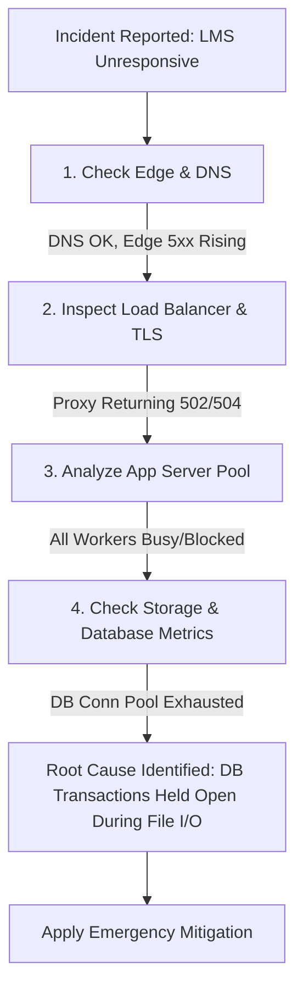

# Integrated Case Study: LMS Assignment Submission under Peak Load

This case study ties together core networking and distributed systems protocols—**DNS, HTTP/TLS, TCP stream behavior, database transactions, and file storage APIs**—by analyzing a real-world failure scenario: thousands of students attempting to submit an assignment simultaneously right before a deadline.

---

## 1. The Scenario

At **11:54 PM**, 10,000 engineering students attempt to upload a **50 MB project PDF** to a university Learning Management System (LMS) before the **11:59 PM** hard cutoff.

```
                                  PEAK SUBMISSION TRAFFIC WAVE
[ 10,000 Students ] ───(50MB PDFs)───> [ Network Edge ] ───> [ LMS Application ] ───> [ Storage & DB ]

```

### End-to-End Submission Pipeline

1. **DNS Lookup:** Student browser queries `lms.university.edu` to obtain the IP address.
2. **TLS / TCP Handshake:** Browser negotiates a TCP connection (Port 443) and performs a TLS handshake with the load balancer.
3. **HTTP Multipart POST:** Browser sends an `HTTP POST /api/v1/submissions` request carrying a 50 MB payload using `multipart/form-data`.
4. **App Logic Execution:** The application server verifies session tokens, records metadata in an SQL database, and writes the 50 MB binary payload to disk/object storage.
5. **HTTP Response:** Server responds with `HTTP 200 OK` (or `201 Created`) with a submission timestamp token.

---

## 2. Failure Analysis Across the System Stack

When load spikes from 10 requests/sec to **10,000 simultaneous 50 MB uploads**, failures cascade through every protocol layer:

```
+-----------------------------------------------------------------------------------+
|                            CASCADE OF SYSTEM FAILURES                             |
+-----------------------------------------------------------------------------------+

 1. TCP/Network Layer     ──> SYN Backlog Full (TCP connection drops / SYN retransmissions)
 2. HTTP/Proxy Tier      ──> HTTP 504 Gateway Timeout (Proxy buffer exhausted)
 3. App Thread Pool       ──> HTTP 503 Service Unavailable (Worker threads blocked on file I/O)
 4. Database Connection  ──> DB Connection Pool Starvation (Locked on metadata writes)
 5. Storage Subsystem    ──> Disk I/O Throttling / S3 Rate Limits

```

### A. Network & Transport Layer Failures (TCP / TLS)

* **SYN Flood & Backlog Saturation:** The load balancer's TCP socket accept queue (`somaxconn`) fills up instantly. New connection attempts are dropped, forcing client operating systems into exponential backoff SYN retransmissions.
* **TCP Window Congestion:** Uploading $10,000 \times 50 \text{ MB} = 500 \text{ GB}$ of raw data over saturated upstream links causes TCP packet loss. TCP congestion control mechanisms (like CUBIC or BBR) collapse the congestion window ($cwnd$), causing upload speeds to plummet from Mbps to bytes/sec.

### B. Reverse Proxy & Application Layer Failures (HTTP / WSGI)

* **Thread Pool Exhaustion:** The application tier (e.g., Node.js, Python Gunicorn, Java Spring) allocates a thread or worker process per incoming request. Because 50 MB file transfers take 30+ seconds on congested connections, **100% of app worker threads become occupied buffering slow byte streams**.
* **Reverse Proxy Timeouts (`HTTP 504 Gateway Timeout`):** NGINX or AWS ALB fronts the app. If the app server takes longer than 60 seconds to process the full payload, the reverse proxy breaks the connection and returns `504 Gateway Timeout` to the student—even though the file was 95% uploaded.

### C. Database & Storage Bottlenecks

* **Connection Pool Starvation:** App workers open a database transaction *before* the file finish uploading:
```sql
BEGIN TRANSACTION;
INSERT INTO submissions (student_id, assignment_id, timestamp) VALUES (...);
-- Worker waits 30 seconds for 50MB file I/O to finish --
COMMIT;

```


This holds open SQL database connection pool slots for tens of seconds, causing new requests to fail with `500 Internal Server Error (Database Connection Timeout)`.
* **Synchronous Disk I/O Bottlenecks:** Writing thousands of concurrent 50 MB file streams directly to local server storage leads to disk queue saturation and high I/O wait times (`iowait`).

---

## 3. Comprehensive Failure Mode Comparison Table

| System Tier | Failure Mechanism | Root Cause Protocol / Architecture Bug | Client-Facing Symptom | Immediate Remediation |
| --- | --- | --- | --- | --- |
| **DNS** | DNS Lookup Timeout / Failure | Recursive resolvers overwhelmed by client cache expirations due to short TTLs. | `ERR_NAME_NOT_RESOLVED` | Increase DNS TTL for static apex endpoints; enable DNS Anycast routing. |
| **Transport (TCP)** | SYN Packet Drops | OS kernel `tcp_max_syn_backlog` and `somaxconn` queues exhausted. | Connection Refused / Hanging handshake. | Tune kernel parameters (`net.core.somaxconn = 65535`), enable TCP SYN Cookies. |
| **Reverse Proxy** | Gateway Timeout (`504`) | Reverse proxy timeout shorter than slow upload duration over congested links. | `504 Gateway Timeout` | Increase proxy `proxy_read_timeout`; offload file buffering to dedicated object storage. |
| **Application Tier** | Thread Starvation (`503`) | Synchronous, blocking HTTP request handling waiting for large file uploads. | `503 Service Unavailable` | Implement **Asynchronous Uploads** via **Presigned S3 URLs** directly from client. |
| **Database** | Pool Starvation / Lock Timeout | Opening DB transactions prior to completing network file transfers. | `500 Internal Server Error` | Decouple metadata DB writes from file payload transfers; use message queues (RabbitMQ/Kafka). |
| **Storage Subsystem** | Disk Space / I/O Exhaustion | Writing incoming files directly to local app server block storage. | Incomplete file writes / Corrupted PDFs. | Offload uploads to distributed object storage (AWS S3, Google Cloud Storage). |

---

## 4. Professional Diagnostic Habit (Systematic Troubleshooting Workflow)

When an engineer is called to diagnose an active production incident during peak submission windows, following a structured top-down diagnostic methodology prevents guesswork and identifies root causes quickly:



### Step 1: Ingress & Edge Inspection

* **Metric to check:** Edge HTTP status code distribution (Ratio of `2xx` vs `4xx` vs `5xx`).
* **Tooling:** `curl -iv [https://lms.university.edu/health](https://lms.university.edu/health)` or CDN dashboard metrics.
* **Diagnosis:** If `504 Gateway Timeout` dominates, the edge proxy is alive, but upstream app servers are failing to respond in time.

### Step 2: Transport & Host Networking Check

* **Metric to check:** Socket backlog drops and TCP retransmissions.
* **Tooling:** Run `netstat -s | grep -i listen` or `ss -lnt` on application nodes.
* **Diagnosis:** High `SYNs to LISTEN sockets dropped` indicates kernel backlog queue exhaustion.

### Step 3: Application Process & Thread Pool Triage

* **Metric to check:** App worker CPU utilization vs active worker thread counts.
* **Tooling:** `htop`, thread dump analyzers, or APM traces (Datadog/New Relic).
* **Diagnosis:** Low CPU utilization combined with 100% thread pool saturation indicates workers are blocked on I/O (waiting for network payloads or DB pool locks).

### Step 4: Storage & Database Isolation

* **Metric to check:** Active database connection counts (`pg_stat_activity` / `SHOW PROCESSLIST`) and disk `iowait`.
* **Tooling:** SQL performance insights and storage IOPS metrics.
* **Diagnosis:** Long-running queries in state `idle in transaction` confirm that the application is holding DB locks while reading network sockets.

---

## 5. Architectural Redesign for Modern Resiliency

To prevent deadline load collapses entirely, modern LMS systems decouple network file uploads from application worker threads using **Presigned S3 Uploads**:

```
[ Client Browser ] ─── 1. POST /api/get-upload-url ───> [ LMS App Server ]
[ Client Browser ] <─── 2. Returns Presigned S3 URL ─── [ LMS App Server ]
        │
        └────── 3. Direct PUT (50MB File) ───────────> [ Cloud Object Storage (S3) ]
                                                                 │
                                                    4. S3 Event Trigger (SNS/SQS)
                                                                 │
                                                                 v
[ Client Browser ] ─── 5. Confirm Metadata ──────────> [ LMS App Server / DB ]

```

1. **Direct-to-S3 Uploads:** The client requests a presigned URL from the lightweight App API (takes <10ms). The client uploads the 50MB file **directly to S3**, completely bypassing application server memory, CPU, and thread pools.
2. **Asynchronous Processing:** S3 triggers an event notification upon completion, registering the submission via a serverless background worker (AWS Lambda) or queue worker.
3. **Graceful Degradation & Client Queueing:** If traffic exceeds limits, rate limiting (HTTP `429 Too Many Requests`) combined with a queueing system (e.g., Cloudflare Waiting Room) regulates ingress.

---