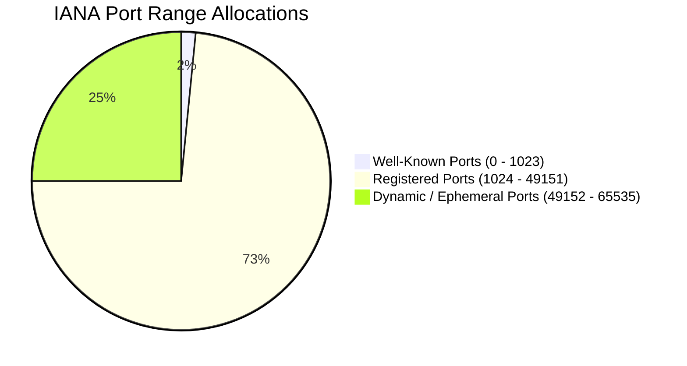
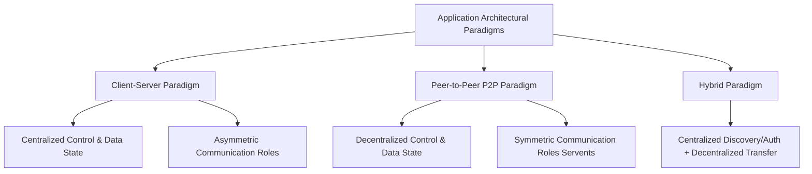
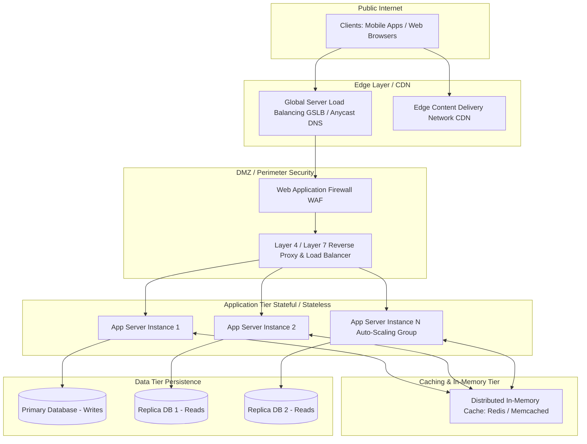
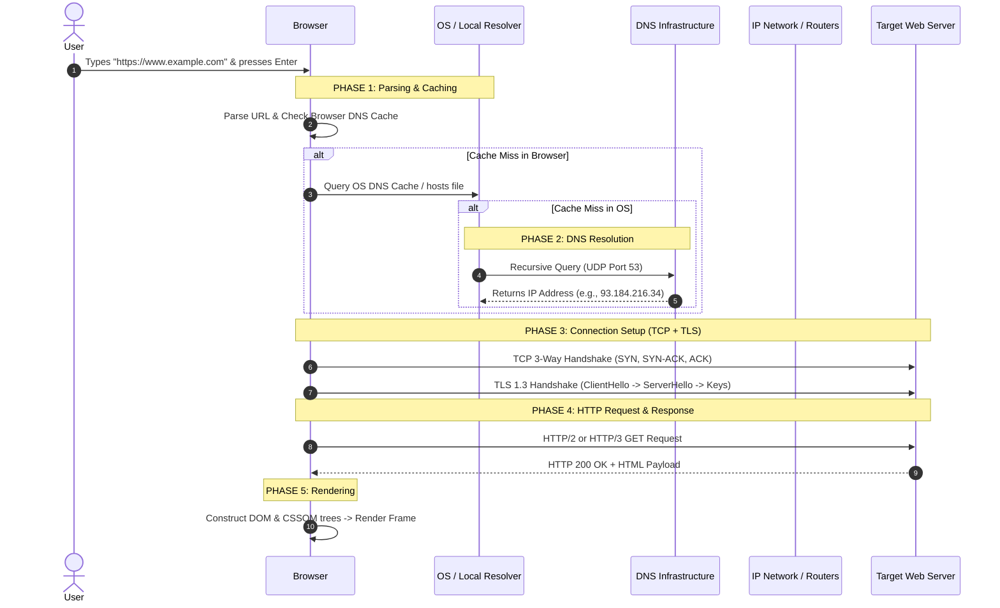
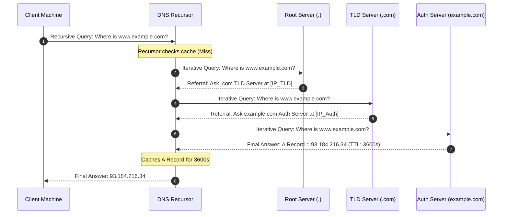
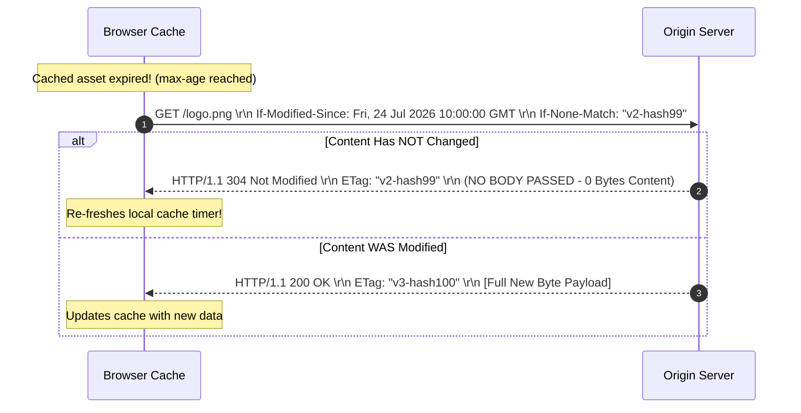
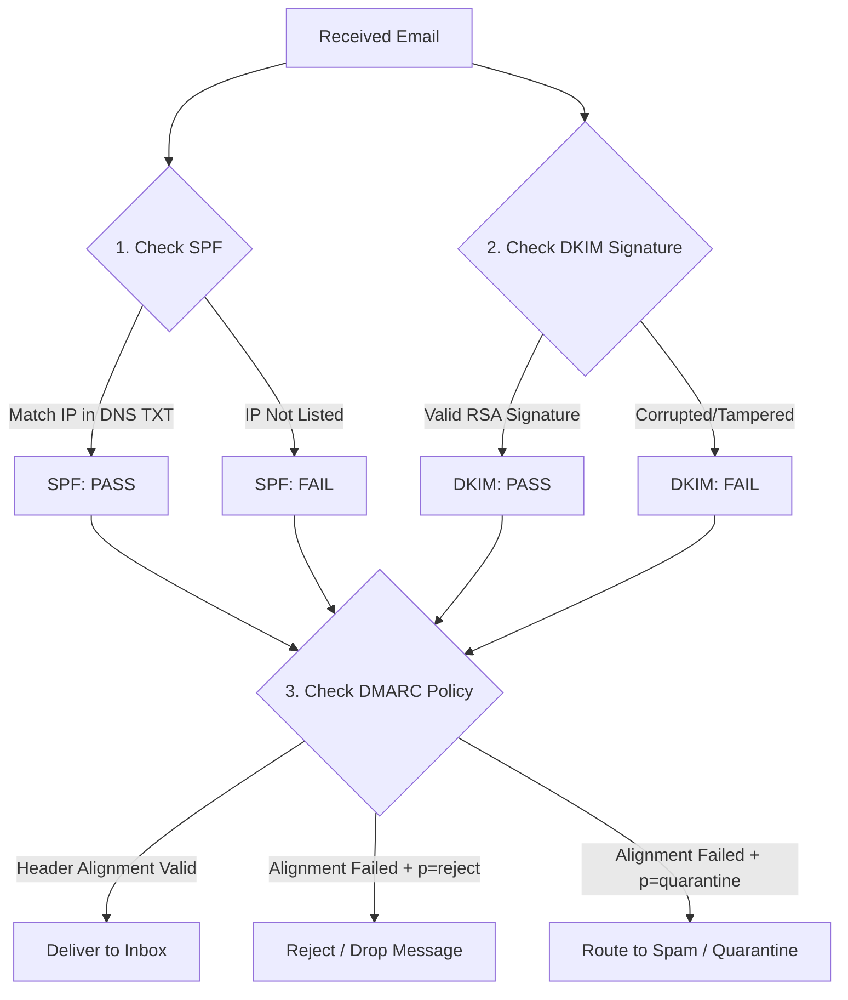
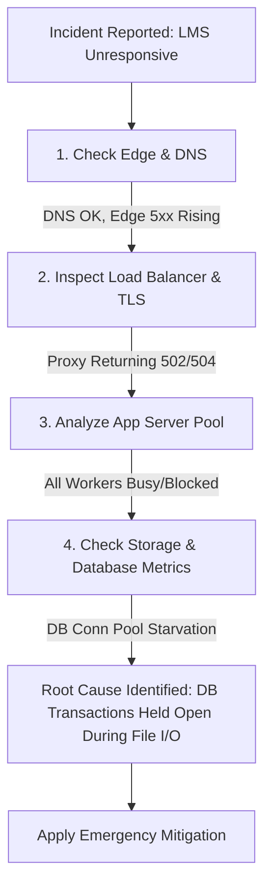

# Computer Networks: Unit-2 Master Summary (Application Layer Protocols & Systems)

---

## 1. Network Applications & Execution Foundations

The **Application Layer** (Layer 5 in the TCP/IP model, Layer 7 in the OSI model) is the topmost layer where network applications reside. It is implemented entirely in user space on edge hosts, allowing developers to write software without worrying about the underlying network core devices (such as routers and switches), which operate strictly at Layers 1 through 3.

```
+-------------------------------------------------------------------+
|                           USER SPACE                              |
|  +------------------------+          +-------------------------+  |
|  | Client Application     |          | Server Application      |  |
|  +-----------+------------+          +------------+------------+  |
|              | (Socket API)                       | (Socket API)  |
+--------------|------------------------------------|---------------+
|              v            KERNEL SPACE            v               |
|  +------------------------+          +-------------------------+  |
|  | TCP / UDP Transport    |          | TCP / UDP Transport     |  |
|  +------------------------+          +-------------------------+  |
|  | IP (Network Layer)     |          | IP (Network Layer)      |  |
+--------------+------------------------------------+---------------+
               |                                    |
               +============== PHYSICAL ============+
                                NETWORK
```

### 1.1 Processes, Threads, and Applications
* **Application:** A passive, static entity consisting of machine instructions and configuration parameters stored on disk (e.g., an executable binary `/usr/sbin/nginx`).
* **Process:** An active execution instance of an application in memory. The operating system allocates an isolated virtual address space, memory map (text, data, heap, stack), file descriptors, and network resources (sockets) per process.
* **Thread:** The smallest execution unit scheduled by the kernel. Multiple threads exist inside a single process, sharing the parent process's heap memory, address space, and open sockets, but maintaining their own stack, program counter (PC), and CPU registers.

#### Process vs. Thread Context Switching & Fault Isolation
* **Process Context Switching:** High overhead due to switching memory page tables, invalidating the Translation Lookaside Buffer (TLB), and reloading registers. Safe because processes are isolated; a crash in one does not affect others.
* **Thread Context Switching:** Low overhead since they share memory space. If one thread crashes (e.g., memory corruption or segmentation fault), the entire parent process and all its threads terminate.

---

### 1.2 Network Addressing: Port Numbers
To route arriving packets to the correct application process, operating systems use **Port Numbers** (16-bit unsigned integers, $0 \text{ to } 65535$). An IP address identifies a node, while a port identifies a specific socket on that node.



1. **Well-Known Ports ($0 - 1023$):** Reserved for system-level core protocols. UNIX-like systems restrict binding to these ports to root/privileged processes.
2. **Registered Ports ($1024 - 49151$):** Assigned by IANA for specific vendor databases, message queues, and application frameworks.
3. **Dynamic / Private / Ephemeral Ports ($49152 - 65535$):** Temporarily allocated by client operating systems as source ports for outbound connections.

#### Essential Ports Matrix
| Port Number | Protocol | Default Transport | Primary Function / Service |
| :--- | :--- | :--- | :--- |
| **20, 21** | FTP | TCP | File Transfer Protocol (Data & Control) |
| **22** | SSH / SFTP | TCP | Secure Shell / Secure File Transfer |
| **23** | Telnet | TCP | Unencrypted Text Communications (Legacy) |
| **25** | SMTP | TCP | Simple Mail Transfer Protocol (Email Relay) |
| **53** | DNS | UDP & TCP | Domain Name System (Name Resolution) |
| **67, 68** | DHCP | UDP | Dynamic Host Configuration Protocol (Server/Client) |
| **80** | HTTP | TCP | Hypertext Transfer Protocol (Web Unencrypted) |
| **110** | POP3 | TCP | Post Office Protocol v3 (Email Retrieval) |
| **123** | NTP | UDP | Network Time Protocol (Clock Sync) |
| **143** | IMAP | TCP | Internet Message Access Protocol (Email Management) |
| **161, 162** | SNMP | UDP | Simple Network Management Protocol |
| **389** | LDAP | TCP/UDP | Lightweight Directory Access Protocol |
| **443** | HTTPS | TCP | HTTP Secure (HTTP over TLS/SSL) |
| **465 / 587** | SMTPS | TCP | Encrypted Mail Submission |
| **1433** | MSSQL | TCP | Microsoft SQL Server Database |
| **3306** | MySQL | TCP | MySQL Database Management System |
| **3389** | RDP | TCP/UDP | Remote Desktop Protocol |
| **5432** | PostgreSQL | TCP | PostgreSQL Database System |
| **6379** | Redis | TCP | Redis In-Memory Key-Value Store |
| **8080** | HTTP Alt | TCP | Web Proxy / Alternative HTTP Server Port |

---

### 1.3 The Socket Interface
A **Socket** is the software abstraction created by the OS kernel that acts as the gateway between user-space application processes and kernel-space transport protocols.

* **TCP Socket Identification:** Uniquely identified by a **4-Tuple**:
  $$\text{TCP Socket} = \left( \text{Source IP}, \text{Source Port}, \text{Destination IP}, \text{Destination Port} \right)$$
  This allows a server to run a single listener on port 80/443 while demultiplexing incoming segments to thousands of individual connection sockets, provided they originate from different client IPs or source ports.
* **UDP Socket Identification:** Identified solely by a **2-Tuple**:
  $$\text{UDP Socket} = \left( \text{Destination IP}, \text{Destination Port} \right)$$
  All incoming datagrams addressing that IP and port are delivered to the same socket, regardless of source parameters.
* **Socket Types:**
  1. **Stream Sockets (`SOCK_STREAM`):** Connection-oriented, reliable, TCP-backed byte stream.
  2. **Datagram Sockets (`SOCK_DGRAM`):** Connectionless, unreliable, UDP-backed discrete messages.
  3. **Raw Sockets (`SOCK_RAW`):** Bypasses transport layer processing; reads/writes IP headers directly (e.g., used by `ping`, `traceroute`, Wireshark).

---

## 2. Application Layer Architecture Paradigms



### 2.1 Client-Server Architecture
Characterized by asymmetric roles:
* **The Client:** Initiates communication. Features intermittent connectivity, dynamic IP addresses assigned via DHCP, and does not listen for inbound requests from arbitrary nodes.
* **The Server:** Always-on host with a static, well-known IP address and DNS record. High-capacity system designed to handle large volumes of concurrent client connections.

#### Modern Enterprise Server Tier (Production System)
In production, "the server" is a multi-tiered distributed system designed for scalability, security, and high availability:



* **GSLB & Anycast DNS:** Routes clients to the closest operational datacenter.
* **CDN (Content Delivery Network):** Caches static assets globally at edge points of presence (PoPs).
* **Layer 4 / Layer 7 Load Balancer:** L4 routes traffic based on TCP/UDP headers. L7 terminates TLS and routes traffic using application-layer metadata (HTTP headers, cookies, URL paths).
* **Stateless Microservices:** Compute instances running business logic. State is stored externally to allow instances to scale up/down dynamically.
* **Caching Tier (Redis/Memcached):** In-memory key-value stores holding hot database query results.
* **Persistent Database Tier:** Distributed databases using replication or consensus clusters.

---

### 2.2 Peer-to-Peer (P2P) Architecture
Characterized by decentralized, symmetric communications. Arbitrary end-systems (Peers/Servents) interact directly.

* **Self-Scalability:** Unlike Client-Server models where adding clients decreases performance, P2P peers contribute upload bandwidth, storage, and CPU capacity to the pool.
  $$\text{Total System Upload Capacity} = C_{\text{Server}} + \sum_{i=1}^{N} u_i$$

#### BitTorrent File Distribution Mechanics
* **Torrent File:** Metadata manifest containing file chunk hashes and tracker locations.
* **Swarm:** The set of all peers actively sharing a specific torrent.
* **Pieces & Blocks:** Files are split into **pieces** (256KB to 4MB), which are subdivided into **blocks** (16KB) for transmission.
* **Leechers vs. Seeders:** Leechers are downloading files and sharing pieces; Seeders have 100% of the file and remain online exclusively to upload.
* **Rarest-First Piece Selection:** Peers query neighbors' bitfields and download the rarest pieces first to ensure rare segments propagate widely.
* **Tit-for-Tat Incentive Engine:** Peers unchoke (upload to) the top 4 neighbors providing them with the highest download speeds. Other peers are choked.
* **Optimistic Unchoking:** Every 30 seconds, a peer randomly unchokes one choked neighbor. This allows new peers with zero pieces to obtain their first blocks and bootstrap.

---

## 3. Transport Layer Service Requirements & Protocols

Applications evaluate transport protocol options along four service dimensions:
1. **Data Integrity (Reliability):** Zero-loss (files, web) vs. loss-tolerant (audio, video).
2. **Timing (Latency & Jitter):** Low delay tolerance ($<100\text{ms}$) vs. delay-tolerant (email, batch downloads).
3. **Throughput (Bandwidth):** Bandwidth-sensitive (4K streaming requires $\ge25\text{ Mbps}$) vs. elastic (web browsing).
4. **Security:** Encryption, data integrity, and authentication.

### 3.1 TCP vs. UDP: Architectural Comparison
| Feature / Abstraction | TCP (Transmission Control Protocol) | UDP (User Datagram Protocol) |
| :--- | :--- | :--- |
| **Connection Model** | Connection-oriented (Requires 3-way handshake) | Connectionless (Send and forget) |
| **Data Transfer Unit** | Continuous **Byte Stream** (No message boundaries) | Discrete **Datagrams** (Preserves message boundaries) |
| **Reliability** | Full reliability (ARQ, Sequence Numbers, ACKs) | Best-effort (No ACKs, no retransmissions) |
| **Flow Control** | Yes (Sliding window mechanism) | No (Sender can overwhelm receiver) |
| **Congestion Control** | Yes (AIMD, CUBIC, BBR) | No (Sends at application's generation rate) |
| **Header Overhead** | $20 - 60 \text{ bytes}$ | Fixed $8 \text{ bytes}$ |

---

### 3.2 Evolution to HTTP/3 and QUIC
Historically, HTTP/1.1 and HTTP/2 ran over TCP. However, HTTP/2 multiplexing hit a performance limit due to **Head-of-Line (HoL) Blocking at the TCP Layer**.

```
HTTP/2 Over Single TCP Connection:
[Stream 1 Frame] [Stream 2 Frame] [Stream 3 Frame]  ---> [ Packet Loss ]
                                                                |
  TCP Engine Halts ALL Streams until Lost Packet is Retransmitted!
```

If a packet containing data for Stream 1 is lost, the host OS kernel freezes delivery of *all* subsequent data in the TCP buffer (including streams 2 and 3) until the lost packet is retransmitted. Furthermore, establishing a secure connection required separate TCP and TLS handshakes (2-3 RTTs).

#### The Solution: QUIC (Quick UDP Internet Connections)
HTTP/3 runs over QUIC, which operates on top of **UDP** in user space:

```
+--------------------------+          +--------------------------+
|  HTTP/1.1 or HTTP/2      |          |        HTTP/3            |
+--------------------------+          +--------------------------+
|      TLS 1.2 / 1.3       |          |   QUIC (Reliability,     |
+--------------------------+          |   Congestion Control,    |
|          TCP             |          |   TLS 1.3 Integrated)    |
+--------------------------+          +--------------------------+
```

#### Technical Features of QUIC:
1. **Independent Multiplexed Streams:** Streams are handled independently in user space. A dropped packet on Stream 1 delays only Stream 1; Streams 2 and 3 continue to deliver data to the application layer.
2. **0-RTT/1-RTT Connection Setup:** Combines transport and cryptographic handshakes. Repeat connections can send data in the first packet (0-RTT).
3. **Connection Migration:** Connections are bound to a **64-bit Connection ID (CID)** rather than the standard IP/Port 4-tuple. If a mobile device switches from Wi-Fi to a cellular network (changing the IP address), the connection continues uninterrupted.

---

## 4. The Internet vs. The World Wide Web & URL Anatomy

### 4.1 Concept Distinction
* **The Internet:** The global physical infrastructure of routers, fibers, links, and servers operating at Layers 1-4. It uses the TCP/IP stack to route raw data packets.
* **The World Wide Web:** A Layer 7 information system running *on top of* the Internet. It consists of hyperlinked HTML documents, stylesheets, scripts, and media resources.

### 4.2 URL Structure
$$\text{URL Syntax} = \text{scheme} \text{://} \text{user:pass@} \text{host} \text{:} \text{port} \text{/path} \text{?} \text{query} \text{\#fragment}$$

* **Scheme:** Application protocol (e.g., `https`, `ftp`).
* **User Info:** Credentials (`user:password@`).
* **Host/Domain:** Domain name (FQDN) or IP address.
* **Port:** Transport port (defaults to 80 for HTTP, 443 for HTTPS).
* **Path:** Server-side file directory location (e.g., `/courses/index.html`).
* **Query String:** Key-value parameters passed to the server (e.g., `?id=42&format=json`).
* **Fragment:** Client-side target anchor (`#section3`).

---

### 4.3 End-to-End Workflow: Accessing a URL



1. **HSTS Preload Check:** The browser converts `http://` to `https://` if the domain is listed on the HSTS preload list.
2. **Multi-tier DNS Cache Lookup:** Checks Browser DNS cache, then queries OS resolver (which checks the local `hosts` file and OS cache). If both miss, it triggers an outbound recursive lookup.
3. **ARP Resolution:** Resolves the MAC address of the default gateway router (if destination is remote) or the target host (if local).
4. **Handshakes:** Negotiates a TCP 3-way handshake, then performs TLS negotiation to verify the server's X.509 certificate and establish symmetric session keys.
5. **HTTP Request & Backend Processing:** Sends an HTTP `GET` request. The backend server processes the query and returns the HTML payload.
6. **Critical Rendering Path:** The browser constructs the DOM and CSSOM, fetches linked assets (images, CSS, JS), constructs the render tree, and paints the layout.

---

## 5. Domain Name System (DNS) Architecture

DNS is a globally distributed, hierarchical database that translates hostnames to IP addresses.

### 5.1 The DNS Hierarchy

```
                        [ . ] (Root)
                       /  |  \
                     /    |    \
                   /      |      \
               .com      .org     .uk (Top-Level Domains - TLDs)
                 /          |        \
          example        wikipedia   co (Second-Level Domains - SLDs)
            /                         \
         www                          uk (Subdomains / Hosts)
```

1. **Root Nameservers (`.`):** The top of the tree. There are 13 logical root server IP addresses (`a.root-servers.net` to `m.root-servers.net`), backed by hundreds of physical servers globally using IP Anycast. They return glue records pointing to TLD servers.
2. **TLD Nameservers:** Manage domains ending in `.com`, `.org`, `.net`, `.in`, etc.
3. **Authoritative Nameservers:** The definitive source of truth for a domain. They hold the zone files containing the actual resource records.
4. **Recursive Resolvers:** Intermediate servers (usually run by ISPs or public providers like Cloudflare `1.1.1.1` and Google `8.8.8.8`) that handle queries for clients by traversing the hierarchy.

---

### 5.2 Recursive vs. Iterative Queries
* **Recursive Query:** The client forces the resolver to perform all lookup work and return the final answer or an error (Client $\to$ Recursor).
* **Iterative Query:** The resolver queries nameservers one by one. If a nameserver doesn't know the answer, it returns a referral pointer to the next nameserver down the chain (Recursor $\leftrightarrow$ Root/TLD/Auth).



---

### 5.3 DNS Resource Records (RRs)
DNS records use the standard format: `[Name] [TTL] [Class] [Type] [Data]`.

| Record Type | Full Name | Purpose & Syntax Example |
| :--- | :--- | :--- |
| **A** | Address Record | Maps a domain name to an IPv4 address (32-bit).<br>`example.com. 3600 IN A 93.184.216.34` |
| **AAAA** | IPv6 Address Record | Maps a domain name to an IPv6 address (128-bit).<br>`example.com. 3600 IN AAAA 2606:2800:220:1::248` |
| **CNAME** | Canonical Name | Aliases a domain to another domain. Cannot exist at the apex/root domain.<br>`www.example.com. 3600 IN CNAME example.com.` |
| **MX** | Mail Exchanger | Directs email to the domain's incoming mail servers, ordered by preference.<br>`example.com. 3600 IN MX 10 mail.example.com.` |
| **NS** | Name Server | Specifies the authoritative nameservers for a zone.<br>`example.com. 86400 IN NS ns1.dns-provider.com.` |
| **TXT** | Text Record | Stores arbitrary text metadata. Used for security configurations (**SPF, DKIM, DMARC**).<br>`example.com. 3600 IN TXT "v=spf1 include:_spf.google.com -all"` |
| **SOA** | Start of Authority | Contains zone administration metadata (serial number, refresh timers).<br>`example.com. IN SOA ns1.example.com. admin.example.com. (...)` |
| **PTR** | Pointer Record | Maps an IP address back to a domain name (Reverse DNS lookup).<br>`34.216.184.93.in-addr.arpa. 3600 IN PTR example.com.` |

* **TTL (Time to Live):** The time (in seconds) a record can be cached by a resolver before it must be re-fetched.

#### Safe IP Migration Strategy Using TTL
1. **Lower TTL:** A few days in advance (at least equal to the original TTL), lower the TTL of the `A` record (e.g., down to 300 seconds / 5 minutes).
2. **Wait:** Wait for the original long TTL window to expire globally so resolvers adopt the shorter cache duration.
3. **Change IP:** Update the IP address to point to the new server.
4. **Monitor:** Because the TTL is short, traffic shifts to the new IP globally within 5 minutes.
5. **Restore TTL:** Once stable, raise the TTL back to its original long-lived value (e.g., 86400 seconds) to reduce DNS queries.

---

## 6. HTTP Protocol, Security, and Caching

### 6.1 HTTP Message Anatomy
HTTP is a request-response protocol. Messages are formatted in plain text (HTTP/1.1) or binary frames (HTTP/2 & HTTP/3).

```
   HTTP REQUEST MESSAGE FORMAT                     HTTP RESPONSE MESSAGE FORMAT
+------------------------------------+          +------------------------------------+
| <METHOD> <URI> <VERSION> \r\n     |          | <VERSION> <STATUS> <REASON> \r\n   |
+------------------------------------+          +------------------------------------+
| <Header-Name>: <Header-Value> \r\n |          | <Header-Name>: <Header-Value> \r\n |
+------------------------------------+          +------------------------------------+
| \r\n  (Mandatory Empty Line)       |          | \r\n  (Mandatory Empty Line)       |
+------------------------------------+          +------------------------------------+
| [Optional Payload / JSON Body]     |          | [Entity Body / HTML / Image Data]  |
+------------------------------------+          +------------------------------------+
```

#### Safe vs. Idempotent HTTP Methods
* **Safe:** Read-only operations that do not alter server state (`GET`, `HEAD`, `OPTIONS`).
* **Idempotent:** Executing the request multiple times produces the same side-effect on the server as executing it once (`GET`, `PUT`, `DELETE`). `POST` and `PATCH` are non-idempotent.
  $$\text{SideEffect}(f(x)) = \text{SideEffect}(f(f(x)))$$

---

### 6.2 HTTP Status Codes
* **1xx (Informational):** e.g., `100 Continue` (header accepted, send body), `101 Switching Protocols` (upgrading to WebSockets).
* **2xx (Success):** e.g., `200 OK`, `201 Created` (returns `Location` header), `204 No Content` (succeeded, no response body returned).
* **3xx (Redirection):** e.g., `301 Moved Permanently` (transfers SEO rankings), `302 Found` (temporary redirect), `304 Not Modified` (cached resource is still fresh).
* **4xx (Client Errors):** e.g., `400 Bad Request` (malformed payload), `401 Unauthorized` (needs credentials), `403 Forbidden` (authenticated but lacks access rights), `404 Not Found` (URI doesn't exist), `409 Conflict` (duplicate resource states), `429 Too Many Requests` (rate limited).
* **5xx (Server Errors):** e.g., `500 Internal Server Error` (crash in backend logic), `502 Bad Gateway` (proxy couldn't talk to backend), `503 Service Unavailable` (overloaded server), `504 Gateway Timeout` (upstream app server timeout).

---

### 6.3 State Management: Cookies & Sessions
Since HTTP is stateless, servers use cookies to bind client requests to a server-side session.

```mermaid
sequenceDiagram
    autonumber
    participant Browser
    participant Server
    participant DB as Session Store (Redis)

    Browser->>Server: POST /login (credentials)
    Note over Server: Validates credentials
    Server->>DB: Create Session (ID: "xyz987", User: Alice)
    Server-->>Browser: HTTP 200 OK + Set-Cookie: SID=xyz987; Secure; HttpOnly; SameSite=Strict
    
    Note over Browser: Stores SID in Cookie Jar
    
    Browser->>Server: GET /dashboard (Cookie: SID=xyz987)
    Server->>DB: Lookup "xyz987"
    DB-->>Server: Returns User Context (Alice)
    Server-->>Browser: HTTP 200 OK (Rendered Dashboard)
```

#### Critical Cookie Security Attributes:
* **`Secure`:** The cookie is only sent over HTTPS.
* **`HttpOnly`:** Client-side JavaScript cannot access the cookie via `document.cookie` (mitigates XSS token theft).
* **`SameSite`:** Restricts cross-site cookie transmission to mitigate CSRF:
  * `Strict`: Never sent in cross-site contexts.
  * `Lax`: Sent only on top-level GET navigations.
  * `None`: Sent in all contexts (requires `Secure`).

---

### 6.4 Web Caching & Conditional Validation
Caches store copies of responses to reduce latency, bandwidth, and server load. Caching behavior is declared in the `Cache-Control` header:
* `max-age=3600`: Fresh for 3600 seconds.
* `no-cache`: Must validate with the server (via a conditional request) before reusing.
* `no-store`: Prohibits caching entirely.
* `public`/`private`: Shared proxy/CDN caching allowed vs. restricted to client browser only.

#### Conditional GET Validation
When a cache's `max-age` expires, it uses validation headers to verify if the file has changed:



#### Validation Pairs:
1. **Time-Based (Weak):** Server sends `Last-Modified`. Client validates with `If-Modified-Since`.
2. **Entity Tag (Strong - Hash-Based):** Server sends `ETag`. Client validates with `If-None-Match`.
   * *If unchanged,* the server returns a **`304 Not Modified`** response containing **no message body**, saving network bandwidth.

---

## 7. File Transfer Protocol (FTP)

FTP is a legacy protocol (RFC 959) designed for file transfers. It uses a **Dual-Channel Architecture (Out-of-Band Control)**:
* **Control Connection (Port 21):** A persistent TCP connection used to send commands and receive status codes.
* **Data Connection (Port 20 or dynamic):** A temporary connection opened and closed for each file or directory listing.

```
       ACTIVE MODE (PORT)                            PASSIVE MODE (PASV)
+-------------------------------+             +-------------------------------+
| Client (Port N)               |             | Client (Port N)               |
|   |                           |             |   |                           |
|   | Control (Port 21)         |             |   | Control (Port 21)         |
|   v                           |             |   v                           |
| Server                        |             | Server                        |
|                               |             |                               |
| Server connects back:         |             | Client connects:              |
| Server (Port 20)              |             | Client (Port N+1)             |
|   |                           |             |   |                           |
|   v                           |             |   v                           |
| Client (Port N+1) [Blocked]   |             | Server (Dynamic Port P)       |
+-------------------------------+             +-------------------------------+
```

### 7.1 Active vs. Passive Mode
* **Active Mode (`PORT`):** Client opens a listener on port $N+1$ and sends a `PORT` command to the server. The **server initiates** a TCP data connection from Port 20 back to the client on port $N+1$.
  * *Modern Flaw:* Client-side firewalls and NATs block inbound connections, causing Active FTP transfers to fail.
* **Passive Mode (`PASV`):** Client sends the `PASV` command. The server opens a random dynamic port $P > 1024$ and returns it. The **client initiates** the data connection to the server on port $P$. This solves the client-side firewall issue.

### 7.2 Security Risks & Evolution
Plain FTP transmits credentials and files in **cleartext**. 
* **FTPS (FTP Secure):** Adds a TLS/SSL layer to standard FTP. It inherits FTP's dual-channel complexity, making firewall rules difficult to manage.
* **SFTP (SSH File Transfer Protocol):** A completely different protocol running on **TCP Port 22** inside a single SSH channel. It handles commands, data, and authentication securely and is firewall-friendly.
* **REST/S3 Storage (HTTPS Port 443):** Web-based object storage using HTTP GET/PUT commands under TLS.

---

## 8. Electronic Mail (Email) and SMTP Architecture

Email relies on an asynchronous **Store-and-Forward** architecture powered by several interoperating protocols.

```
 [ User Agent ] ──(SMTP)──> [ Submission Server / MSA ]
 (e.g., Outlook,                     │
  Apple Mail)                   (SMTP Relay)
                                     ▼
                            [ Mail Transfer Agent ] (MTA - Sender Domain)
                                     │
                                (DNS MX Lookup)
                                     │
                                (SMTP / Port 25)
                                     ▼
                            [ Mail Transfer Agent ] (MTA - Recipient Domain)
                                     │
                                (Local Delivery)
                                     ▼
                            [ Mail Delivery Agent ] (MDA / Local Store)
                                     │
                               (IMAP or POP3)
                                     ▼
 [ User Agent ] <────────────────────┘
 (Recipient Client)
```

### 8.1 Key Email Architecture Components
* **Mail User Agent (MUA):** The user's mail client (e.g., Outlook, Webmail).
* **Mail Submission Agent (MSA):** Accepts outbound mail from the MUA, verifies authentication, and forwards it to the MTA on port 587 (using STARTTLS).
* **Mail Transfer Agent (MTA):** Relays mail between servers globally using **SMTP on Port 25**.
* **Mail Delivery Agent (MDA):** Receives mail from the incoming MTA and writes it to local user mailboxes (e.g., Maildir/Mbox).
* **Access Protocols:** Used by MUAs to fetch mail from the MDA:
  * **POP3 (Port 110/995):** *Download and Delete* model. Messages are downloaded to local storage and removed from the server (poor multi-device support).
  * **IMAP (Port 143/993):** *Sync and Retain* model. Mail remains on the server. Read/unread flags, folders, and message states are synchronized across all devices.

---

### 8.2 SMTP Dialogue (RFC 5321)
SMTP is an ASCII text-based command-response protocol. Here is a simplified transaction:

```http
S: 220 mail.target.org ESMTP Postfix Service Ready\r\n
C: EHLO mail.example.com\r\n
S: 250-mail.target.org Hello mail.example.com\r\n
S: 250-STARTTLS\r\n
S: 250 OK\r\n
C: MAIL FROM:<alice@example.com>\r\n
S: 250 2.1.0 Ok\r\n
C: RCPT TO:<bob@target.org>\r\n
S: 250 2.1.5 Ok\r\n
C: DATA\r\n
S: 354 End data with <CR><LF>.<CR><LF>\r\n
C: From: Alice Smith <alice@example.com>\r\n
C: To: Bob Jones <bob@target.org>\r\n
C: Subject: Project Status Update\r\n
C: \r\n
C: Hi Bob, the documentation is ready.\r\n
C: .\r\n
S: 250 2.0.0 Ok: queued\r\n
C: QUIT\r\n
S: 221 2.0.0 Bye\r\n
```

### 8.3 Envelope vs. Visible Header
* **The Envelope:** The SMTP protocol parameters (`MAIL FROM` and `RCPT TO`) used by MTAs to route the email and handle bounces. Hidden from end-users.
* **Visible Headers:** The email content payload inside the `DATA` block (e.g., `From:`, `To:`, `Subject:`). This is parsed and rendered to the user in their email client.

---

### 8.4 MIME (Multipurpose Internet Mail Extensions)
SMTP was originally limited to **7-bit ASCII lines** under 1,000 characters. MIME (RFC 2045) allows sending multi-part binary attachments, HTML content, and non-ASCII character sets by encoding binaries (using Base64 or Quoted-Printable) into text streams separated by `boundary` strings.

---

### 8.5 Domain Authentication Frameworks



1. **SPF (Sender Policy Framework):** The domain owner publishes a DNS `TXT` record listing all IP addresses authorized to send mail from their domain.
   * *Limitation:* Only validates the envelope sender (`MAIL FROM`), not the visible `From:` header.
2. **DKIM (DomainKeys Identified Mail):** The sending MTA hashes the message body and headers and signs them with a private key. The receiver fetches the public key from the sender's DNS records to verify that the message was not modified in transit.
3. **DMARC (Domain-based Message Authentication, Reporting, and Conformance):** Mandates **Header Alignment**—meaning the visible `From:` header domain must match the domain validated by SPF and/or DKIM. It defines enforcement policies for failures:
   * `p=none`: Monitor only.
   * `p=quarantine`: Send to spam folder.
   * `p=reject`: Drop the message entirely at the SMTP boundary.

---

## 9. Mathematical Models for File Distribution Time

To evaluate scalability, we compare the minimum time required to distribute a file of size $F$ bits to $N$ downloading client hosts.

### Variable Definitions:
* $F$: File size (bits).
* $N$: Number of downloading peers.
* $u_s$: Server upload capacity (bits/sec).
* $u_i$: Upload capacity of peer $i$ (bits/sec).
* $d_i$: Download capacity of peer $i$ (bits/sec).
* $d_{\min} = \min(d_1, d_2, \dots, d_N)$: Download capacity of the slowest peer.
* $u_{\text{total}} = \sum_{i=1}^{N} u_i$: Combined peer upload capacity.

### 9.1 Client-Server Distribution Time Bound ($D_{\text{CS}}$)
The distribution time is bottlenecked by two factors:
1. The server must upload the file $N$ times. Time required: $\frac{N \cdot F}{u_s}$.
2. The slowest client cannot download the file faster than its maximum download capacity. Time required: $\frac{F}{d_{\min}}$.

$$D_{\text{CS}} \ge \max\left( \frac{N \cdot F}{u_s}, \; \frac{F}{d_{\min}} \right)$$

As $N \to \infty$, $D_{\text{CS}}$ increases **linearly** with $N$ ($O(N)$ complexity).

### 9.2 Peer-to-Peer Distribution Time Bound ($D_{\text{P2P}}$)
The distribution time is constrained by three factors:
1. The server must upload at least one copy of the file into the swarm. Time required: $\frac{F}{u_s}$.
2. The slowest client cannot download faster than its download rate. Time required: $\frac{F}{d_{\min}}$.
3. The total volume of data to download is $N \cdot F$. The maximum upload rate of the entire system is the sum of the server's upload capacity and the upload capacities of all peers. Time required: $\frac{N \cdot F}{u_s + \sum_{i=1}^{N} u_i}$.

$$D_{\text{P2P}} \ge \max\left( \frac{F}{u_s}, \; \frac{F}{d_{\min}}, \; \frac{N \cdot F}{u_s + \sum_{i=1}^{N} u_i} \right)$$

If each peer uploads at a constant rate $u$, as $N \to \infty$, the third term approaches $\frac{F}{u}$ (a constant independent of $N$). Thus, $D_{\text{P2P}}$ reaches a flat asymptote, demonstrating **sub-linear/flat** scaling.

```
    Distribution Time (Seconds)
    160,000 |                                         / Client-Server (Linear growth)
            |                                        /
            |                                       /
      1,600 |--------------------------------------/----- P2P Bound (Sub-linear / Asymptotic)
            +-------------------------------------------------------
            N=10                   N=100                 N=1000
                                   Number of Peers (N)
```

---

## 10. Socket Programming Primitives & Workflow

```
TCP SERVER LIFECYCLE                         TCP CLIENT LIFECYCLE
--------------------+                         --------------------+
  socket() (Welcoming Socket)                  socket()
     │                                            │
  bind()                                          │
     │                                            │
  listen()                                        │
     │                                            │
  accept()  <════════ (3-Way Handshake) ══════════  connect()
     │                                            │
     +─── Creates New Connection Socket           │
     │                                            │
  recv()    <────────── (TCP Stream) ─────────────  send()
     │                                            │
  send()    ─────────── (TCP Stream) ────────────>  recv()
     │                                            │
  close()   <═════════ (4-Way Teardown) ══════════  close()
```

### 10.1 Key API Primitives
* `socket()`: Allocates a socket descriptor in kernel memory.
* `bind()`: Associates the socket with a local IP address and port.
* `listen()`: Puts the socket into passive mode and sets the connection queue backlog size.
* `accept()`: Extracts the first connection request from the queue. Blocks until a connection is ready, then returns a **new connection socket** for data transfer. The welcoming socket continues to listen on the original port.
* `connect()`: Initiates a TCP connection (the 3-way handshake) to the server.
* `send()` / `sendall()`: Transmits bytes over TCP. `send` can transmit fewer bytes than requested; `sendall` loops internally until all data is transmitted.
* `recv()` / `recvfrom()`: Receives bytes. `recv` is used for TCP stream I/O; `recvfrom` is used for UDP, returning the sender's IP/port details.
* `sendto()`: Sends a UDP datagram to a specific destination IP and port.

### 10.2 TCP Byte Stream vs. UDP Datagram Programming
* **TCP is a Byte Stream:** It has **no message boundaries**. Multiple calls to `send()` can be combined by the kernel (Nagle's Algorithm) or split across packet fragments.
  * *Robustness Rule:* Applications must implement custom **framing** (fixed-length messages, delimiters like `\n`, or length-prefixed headers) and read from the socket in a loop to ensure complete messages are reconstructed.
* **UDP preserves message boundaries:** One call to `sendto()` maps directly to one call to `recvfrom()`.
  * *Unreliability Rule:* UDP is connectionless and does not guarantee delivery or ordering. Applications must implement their own recovery, packet tracking, and timeouts if needed.

---

## 11. Integrated Case Study: LMS Deadline Load Collapse

This case study illustrates how network protocols, server architectures, databases, and file storage APIs interact under peak loads.

### 11.1 The Scenario
At **11:54 PM**, 10,000 engineering students simultaneously attempt to upload a **50 MB project PDF** to a Learning Management System (LMS) before an **11:59 PM** deadline.

```
                                  PEAK SUBMISSION TRAFFIC WAVE
[ 10,000 Students ] ───(50MB PDFs)───> [ Network Edge ] ───> [ LMS Application ] ───> [ Storage & DB ]
```

### 11.2 Failure Cascade Analysis
1. **Network Layer (TCP/TLS):** The sudden wave of connection requests saturates the load balancer's TCP backlog queues (`somaxconn`). SYN packets are dropped, forcing client OS stacks into exponential backoff retransmissions. Saturated upstream links cause packet drops, reducing the TCP congestion window ($cwnd$) and dropping upload speeds to bytes/sec.
2. **Reverse Proxy Layer:** NGINX or AWS ALB buffer the incoming HTTP POST requests. If client upload streams stall, connection tables fill up. If the application server takes longer than the proxy's read timeout (e.g., 60s) to process a request, the proxy terminates the connection and returns `504 Gateway Timeout`.
3. **Application Tier:** Application worker threads handle requests synchronously. Because 50MB files take a long time to upload over congested connections, **100% of app threads become occupied buffering slow byte streams**. The server stops accepting new requests, returning `503 Service Unavailable`.
4. **Database (SQL Persistence):** App workers open SQL database transactions *before* the file upload finishes to record metadata:
   ```sql
   BEGIN TRANSACTION;
   INSERT INTO submissions (student_id, assignment_id) VALUES (42, 101);
   -- Worker blocks for 45s waiting for the file upload to complete --
   COMMIT;
   ```
   This holds database connections open for tens of seconds, exhausting the connection pool and causing subsequent transactions to fail with timeout errors (`500 Internal Server Error`).
5. **Storage Subsystem:** Writing thousands of concurrent 50MB file streams directly to local app server block storage saturates the disk queue (`iowait`), stalling write operations across the system.

---

### 11.3 Diagnostic Checklist
An engineer troubleshooting this incident in production should follow this top-down diagnostic workflow:



1. **Ingress & Edge:** Check CDN/WAF status codes. A high ratio of 504s indicates the edge is healthy but backend servers are failing.
2. **Host Networking:** Check socket queue packet drops using `netstat -s | grep -i listen` or `ss -lnt`. High values indicate queue saturation.
3. **App Processes:** Check CPU usage and active worker threads. High thread counts with low CPU utilization indicate threads are blocked on I/O.
4. **Database & Storage:** Check database lock queues and disk `iowait`. "Idle in transaction" states indicate connections are waiting for slow files to finish uploading.

---

### 11.4 Resilient Redesign: Decoupling Uploads
To prevent load-induced crashes, modern architectures decouple file transfers from the application layer using **Client-to-Storage Direct Uploads via Presigned URLs**:

```
[ Client Browser ] ─── 1. POST /api/get-upload-url ───> [ LMS App Server ]
[ Client Browser ] <─── 2. Returns Presigned S3 URL ─── [ LMS App Server ]
        │
        └────── 3. Direct PUT (50MB File) ───────────> [ Cloud Object Storage (S3) ]
                                                                  │
                                                     4. S3 Event Trigger (SNS/SQS)
                                                                  │
                                                                  v
[ Client Browser ] ─── 5. Confirm Metadata ──────────> [ LMS App Server / DB ]
```

1. **Direct Uploads:** The client requests a presigned URL from the application API (a fast database metadata call taking $<10\text{ms}$). The client then uploads the file directly to object storage (like AWS S3 or Google Cloud Storage), completely bypassing the application server's memory, CPU, and thread pools.
2. **Asynchronous Handlers:** Upon upload completion, the storage service fires an asynchronous notification (e.g., SQS or Webhook) to a lightweight background queue worker to record submission metadata.
3. **Rate Limiting & Queues:** If load continues to rise, rate-limiting (returning `429 Too Many Requests`) and ingress waiting rooms (e.g., Cloudflare Waiting Room) queue incoming traffic at the edge to protect downstream services.
