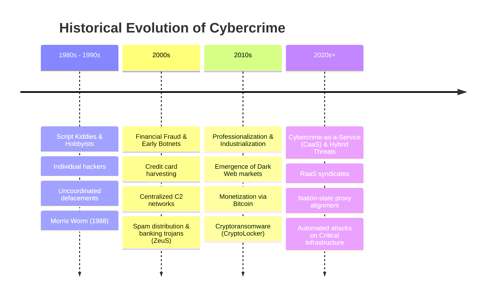
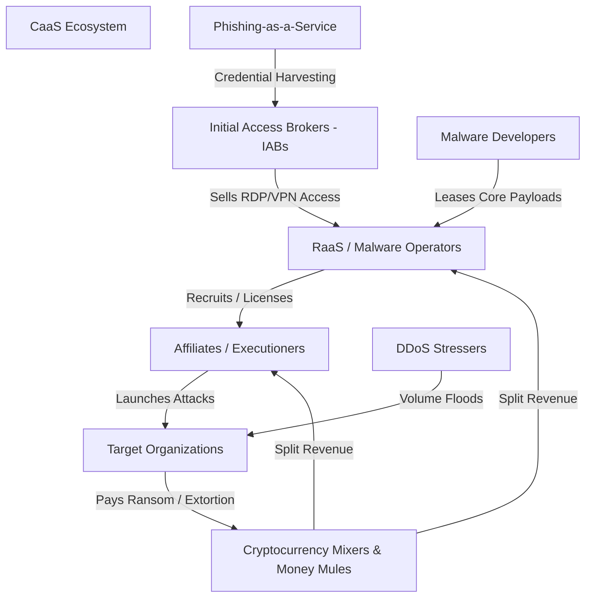
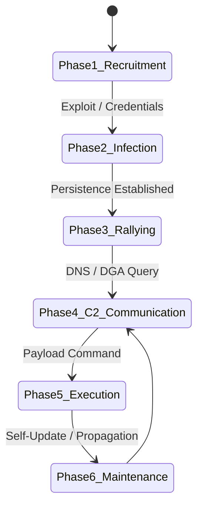
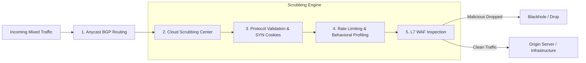
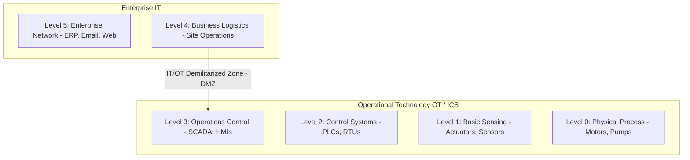
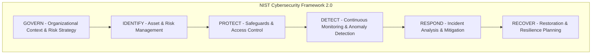

#  Cyber Crime, Botnets, DDoS Attacks & Critical Infrastructure Security

---

## 1. Prerequisites & Foundation

Before diving into advanced threat landscapes, it is essential to understand the core foundational principles of information security:

* **CIA Triad:**
* **Confidentiality:** Preventing unauthorized disclosure of data (e.g., encryption, access controls).
* **Integrity:** Safeguarding the accuracy and completeness of information (e.g., cryptographic hashing, digital signatures).
* **Availability:** Ensuring timely, reliable access to data and systems for authorized users (e.g., load balancing, DDoS mitigation, redundancy).


* **OSI/TCP-IP Network Stack:** A fundamental understanding of Network (Layer 3), Transport (Layer 4), and Application (Layer 7) protocols—specifically IPv4/IPv6, ICMP, TCP (3-way handshake), UDP, DNS, and HTTP/S.
* **Basic Operational Terminology:**
* **Vulnerability:** A flaw or weakness in system security procedures, design, implementation, or internal controls.
* **Threat:** Any circumstance or event with the potential to adversely impact organizational operations via unauthorized access, destruction, disclosure, or modification.
* **Risk:** The measure of potential loss resulting from a threat exploiting a specific vulnerability: 
$$\text{Risk} = \text{Threat} \times \text{Vulnerability} \times \text{Impact}$$


---

## 2. The Evolution of Organized Cyber Crime

Cybercrime has transitioned from isolated, hobbyist hacking aimed at notoriety to a multi-billion-dollar transnational shadow economy characterized by specialization, operational security (OpSec), and corporate-like organizational structures.



### Key Drivers of Evolution

1. **Anonymization Infrastructure:** Tor, I2P, and bulletproof hosting providers allow criminal operations to obfuscate command-and-control (C2) locations.
2. **Pseudonymous Cryptocurrency FinTech:** Bitcoin, Monero (XMR), and mixing services enable automated, cross-border, irreversible financial settlements.
3. **Specialization & Division of Labor:** Modern threat actors no longer execute entire attack lifecycles independently; they purchase modular components on underground forums.

---

## 3. Cybercrime-as-a-Service (CaaS): The Criminal Marketplace

**Cybercrime-as-a-Service (CaaS)** mirrors the legal Software-as-a-Service (SaaS) business model. It lowers the barrier to entry for novice actors by offering modular, subscription-based, or pay-per-use malicious infrastructure and software.



### 3.1 Ransomware-as-a-Service (RaaS)

RaaS operates via a revenue-sharing affiliate model:

* **Operators (Developers):** Maintain the core ransomware code, decryption portals, and negotiation platforms. They retain **10%–30%** of paid ransoms.
* **Affiliates:** Conduct initial network entry, lateral movement, data exfiltration, and execution of the payload. They retain **70%–90%** of the ransom.
* **Triple Extortion Mechanics:**
1. *Primary Extortion:* Encryption of vital operational data.
2. *Secondary Extortion:* Threatening to publish exfiltrated sensitive data on leak sites (e.g., LockBit, BlackCat).
3. *Tertiary Extortion:* Harassing customers/partners or launching concurrent DDoS attacks to force payment.


### 3.2 DDoS-for-Hire (Stresser / Booter Services)

Web platforms that commoditize Distributed Denial of Service attacks. Users purchase subscriptions specifying attack duration, amplification vectors (e.g., NTP, DNS), and target IP addresses, completely hiding the underlying botnet infrastructure.

### 3.3 Phishing Kits & Credential Markets

* **Phishing-as-a-Service (PaaS):** Pre-packaged web frameworks capable of bypassing Multi-Factor Authentication (MFA) via **Adversary-in-the-Middle (AiTM)** reverse-proxies (e.g., Evilginx2).
* **Initial Access Brokers (IABs):** Specialized actors who compromise networks via stolen credentials, unpatched vulnerabilities, or webshells, selling persistent network access to the highest bidder on dark web forums (e.g., Exploit.in, XSS).

---

## 4. Botnet Infrastructure & Lifecycle

A **Botnet** (Robot Network) is a network of compromised internet-connected devices ("bots" or "zombies") controlled remotely by a threat actor known as a **Botmaster** or **Herder**.

### 4.1 Botnet Command and Control (C2) Architectures

| Architecture Type | Description | Advantages for Attacker | Disadvantages for Attacker |
| --- | --- | --- | --- |
| **Centralized (IRC / HTTP / HTTPS)** | All bots connect directly to a single central server or small set of C2 servers. | Low latency, simple real-time command execution. | Single Point of Failure (SPOF); vulnerable to sinkholing and IP/domain blocking. |
| **Peer-to-Peer (P2P)** | Bots act as both clients and servers (servents), propagating commands through an overlay network (e.g., Kademlia DHT). | High resilience; no central server to seize or sinkhole. | High latency in command propagation; protocol reverse-engineering can expose peers. |
| **Hybrid & Fast-Flux** | Uses central control nodes hidden behind rapidly changing DNS records (Fast-Flux) or Tor hidden services. | Highly resistant to IP reputation blocking and domain takedowns. | Complex operational overhead and synchronization logic. |

### 4.2 Technical Mechanism: Fast-Flux DNS

Single-Flux DNS continuously updates `A` or `AAAA` records for a domain with short TTLs (e.g., 60 seconds), mapping a single domain name to hundreds of compromised proxy bots that route traffic back to the hidden C2 backend. Double-Flux updates both the `A` records and the `NS` (Name Server) records, adding another layer of operational obfuscation.

### 4.3 Domain Generation Algorithms (DGA)

To evade domain blacklisting, malware uses a pseudo-random algorithm seeded with a dynamic variable (e.g., current Unix timestamp or financial index) to generate hundreds of domain names daily. The C2 server registers only one or two of these domains; infected bots execute the matching algorithm to query domains sequentially until a active connection is established.

#### DGA Implementation Pseudocode

```python
import hashlib
import datetime

def generate_dga_domains(date_obj, seed_string, count=5):
    """
    Simulates a time-seeded Domain Generation Algorithm (DGA).
    """
    domains = []
    # Convert date to string format YYYY-MM-DD
    date_str = date_obj.strftime("%Y-%m-%d")
    
    for index in range(count):
        # Concatenate date, seed, and iteration index
        raw_input = f"{date_str}-{seed_string}-{index}".encode('utf-8')
        # Compute SHA-256 hash
        hash_digest = hashlib.sha256(raw_input).hexdigest()
        
        # Take first 16 chars of hash to construct domain
        domain_prefix = hash_digest[:16]
        top_level_domain = ".top" # Common dynamic TLD
        
        domains.append(f"{domain_prefix}{top_level_domain}")
        
    return domains

# Example Execution
today = datetime.date(2026, 7, 20)
malware_seed = "APT29_C2_CONFIG"
generated_list = generate_dga_domains(today, malware_seed)

for d in generated_list:
    print(f"[+] DGA Query Candidate: {d}")

```

### 4.4 Botnet Lifecycle



1. **Recruitment / Scanning:** Scanning IPv4 range for vulnerable services (e.g., open SSH, Telnet, unpatched vulnerabilities).
2. **Infection / Exploitation:** Delivering primary payload via remote code execution (RCE) or brute-forcing default credentials.
3. **Rallying:** The bot executes local persistence mechanisms, identifies its host environment, and contacts predefined C2 IP addresses or DGA domains.
4. **Command & Control (C2) Communication:** Authenticating with C2 and awaiting instructions.
5. **Execution:** Carrying out commanded tasks (e.g., launching DDoS, sending spam, executing credential dumping).
6. **Maintenance & Propagation:** Updating local malware code, removing competing malware from the host, and actively scanning for new targets.

### 4.5 Capabilities Enabled by Botnet Infrastructure

* Distributed Denial of Service (DDoS) attacks.
* Large-scale credential stuffing and brute-force campaigns.
* High-volume spam and phishing distribution.
* Proxying malicious traffic (Residential Proxy Networks).
* Distributed cryptocurrency mining (Cryptojacking).

---

## 5. DDoS Attack Taxonomy: Mechanisms & Layers

Distributed Denial of Service (DDoS) attacks aim to exhaust target resources (network bandwidth, system memory, CPU cycles, or application threads), rendering services unavailable to legitimate users.

### 5.1 Comprehensive Attack Classification Table

| Layer / Category | Specific Attack Type | Mechanism | Target Metric / Exhaustion Vector |
| --- | --- | --- | --- |
| **Volumetric (L3/L4)** | **UDP Flood** | Sending massive volumes of UDP packets to random high ports on the target. | Network Interface Card (NIC) capacity; transit link bandwidth (Gbps/Tbps). |
| **Volumetric (L3/L4)** | **ICMP Flood** | Flooding the target with ICMP Echo Request packets without waiting for replies. | Physical bandwidth and router throughput. |
| **Volumetric (L3/L4)** | **NTP / DNS / Memcached Amplification** | **Reflected Attack:** Spoofing the target's IP address as the source and sending queries to open reflectors with large responses. | Massively amplified bandwidth flood (Amplification factor up to 50,000x for Memcached). |
| **Protocol / State (L4)** | **TCP SYN Flood** | Exploiting the TCP 3-Way Handshake by sending SYN packets with spoofed IPs, filling the server's connection queue (**SYN backlog**). | Server Memory / TCP Connection State Tables (Half-Open connections). |
| **Protocol / State (L4)** | **Ping of Death / Smurf** | Sending malformed or oversized ICMP packets (or broadcasting ping with target's source IP). | OS Protocol Stack handling & buffer bounds. |
| **Application (L7)** | **HTTP GET / POST Flood** | Simulating legitimate browser traffic by making computationally expensive requests to application endpoints. | CPU, Database Connection Pools, Web Server Worker Threads. |
| **Application (L7)** | **Slowloris** | Opening hundreds of HTTP connections and sending partial HTTP headers very slowly to keep connections open continuously. | Maximum concurrent web server connection limit (`MaxClients`). |

### 5.2 Amplification Vector Mathematical Formula

Amplification factor ($AF$) measures the efficacy of a reflected DDoS vector:

$$AF = \frac{\text{Size of Reflected Response Payload (Bytes)}}{\text{Size of Attacker Request Payload (Bytes)}}$$

* **DNS Amplification:** $\approx 28 \times \text{ to } 54 \times$
* **NTP Monlist:** $\approx 556 \times$
* **Memcached (UDP 11211):** $\approx 10,000 \times \text{ to } 51,000 \times$

---

## 6. DDoS Attack Lifecycle & Mitigation Framework

Effective mitigation requires a layered defense combining edge scrubbers, rate-limiting, and signature/anomaly detection.



### 6.1 Mitigation Controls & Architecture

* **Anycast BGP Routing:** Distributes massive volumetric flood traffic across a geographically distributed mesh of data centers, preventing a single point of congestion.
* **SYN Cookies:** Mitigates SYN Floods at Layer 4 without allocating memory for connection states. The server encodes initial sequence numbers ($ISN$) cryptographically:

$$\text{ISN} = f(\text{SrcIP}, \text{SrcPort}, \text{DstIP}, \text{DstPort}, \text{SecretKey}) + \text{MSS}$$


Memory is allocated only when the client returns a valid `ACK` containing $\text{ISN} + 1$.
* **Rate Limiting & Leaky Bucket/Token Bucket Algorithms:** Controls burst rates at edge routers and proxies.
* **Web Application Firewalls (WAF):** Evaluates HTTP headers, cookie parameters, JavaScript challenges (e.g., Cloudflare JS Challenge), and CAPTCHAs to stop Layer 7 floods.

---

## 7. Hacktivism, Cyber Espionage & Advanced Persistent Threats (APTs)

Understanding threat actor profiles helps tailor defensive postures based on actor motivation, capability, and persistence.

### 7.1 Threat Actor Profiling

| Factor | Hacktivism | Advanced Persistent Threats (APTs) |
| --- | --- | --- |
| **Primary Motivation** | Political, ideological, or social expression; public humiliation. | Strategic national interest, geopolitics, IP theft, military dominance. |
| **Sponsorship** | Decentralized collectives, independent volunteers, proxy groups. | Nation-States (e.g., MSS, SVR/GRU, IRGC, Unit 61398). |
| **Targeting** | High-profile government sites, public services, media outlets. | Defense industrial base, critical infrastructure, research labs, dissidents. |
| **Operational Style** | Loud, highly visible (website defacements, public DDoS, data dumps). | Stealthy, persistent, low-and-slow execution (**Living off the Land**). |
| **Capabilities** | Off-the-shelf stressers, basic scripts, automated credential dumps. | Zero-day exploits, custom targeted malware, air-gap bridging. |

---

## 8. Case Studies of Cyber Crises & Infrastructure Attacks

Analyzing historical cyber crises provides insight into the real-world operational tactics of major threat actors.

### 8.1 Estonia Cyber Attacks (2007)

* **Context:** Geopolitical dispute between Estonia and Russia regarding the relocation of the Soviet "Bronze Soldier" war memorial in Tallinn.
* **Attack Vectors:** Multi-wave, politically motivated DDoS attacks lasting three weeks. Utilized ping floods, SYN floods, and botnet-driven HTTP request floods.
* **Impact:** Brought down national banking networks (Hansabank), government communication portals, emergency services, and media outlets. Forced Estonia to temporarily sever international internet routing.
* **Historical Significance:** **First recorded national-level cyber crisis.** Led directly to the creation of the **NATO Cooperative Cyber Defence Centre of Excellence (CCDCOE)** in Tallinn and informed the development of the *Tallinn Manual on the International Law Applicable to Cyber Operations*.

### 8.2 The Athens Affair (2004–2005)

* **Context:** Malicious monitoring of high-ranking Greek government officials (including the Prime Minister) around the 2004 Athens Olympic Games.
* **Attack Mechanism:** Rogue code (specifically, an unauthorized software patch) was illegally injected directly into the **AXE telephone exchanges** of Vodafone Greece.
* **Technical Exploitation:** The attackers activated built-in wiretapping software functionality meant for legal law enforcement interception, redirecting audio streams to rogue prepaid mobile phones without triggering system diagnostic logs.
* **Significance:** Highlighted critical risks within telecom core infrastructure and supply chain insider threats.

### 8.3 Mirai Botnet (2016)

* **Target Landscape:** Embedded Internet of Things (IoT) devices (IP cameras, home routers, DVRs).
* **Propagation Vector:** Automated, multi-threaded telnet scanning over ports 23 and 2323 using a dictionary of **61 hardcoded factory default usernames and passwords** (e.g., `admin:admin`, `root:vizion`).
* **Operational Mechanism:**
1. **Scanner Module:** Discovers vulnerable IoT devices running BusyBox.
2. **Loader / Payload Delivery:** Injects a lightweight binary compiled for various CPU architectures (ARM, MIPS, x86).
3. **Memory Execution:** Kills competing services (e.g., SSH, HTTP), erases its own executable file on disk, and runs solely in RAM to resist basic forensic analysis.


* **Impact:** Generated massive DDoS floods exceeding **1.2 Tbps**. Targeted DNS provider **Dyn**, taking down major global services including Twitter, Netflix, Reddit, and Spotify.

---

## 9. Critical Infrastructure Security & Governance

### 9.1 Definition & Scope

**Critical Infrastructure (CI)** encompasses physical and cyber systems, assets, and networks so vital to a nation that their incapacitation or destruction would have a debilitating impact on national security, national economic security, or public health and safety.

#### Core Sectors

* **Energy & Power Grid:** Generation, transmission, and distribution systems (SCADA, Smart Grids).
* **Water & Wastewater Systems:** Treatment plants, distribution pipelines, flow controls.
* **Healthcare & Public Health:** Hospital Information Systems (HIS), medical devices, pharmaceutical supply chains.
* **Financial Services:** Core banking, clearinghouses, payment gateways.
* **Transportation Systems:** Air traffic control, rail signaling, port logistics.
* **Information Technology & Telecom:** Root DNS servers, fiber backbones, cellular core networks.

### 9.2 Operational Technology (OT) vs. IT Environments



| Characteristic | Information Technology (IT) | Operational Technology (OT / ICS) |
| --- | --- | --- |
| **Primary Priority** | **Confidentiality** > Integrity > Availability | **Availability** > Integrity > Confidentiality |
| **Performance Requirements** | Tolerant of delays, retries, and latency. | Deterministic, real-time response ($\le \text{milliseconds}$). |
| **Lifecycles & Patching** | 3–5 year cycle; frequent automated patching. | 15–30 year operational lifecycle; high risk of downtime during patching. |
| **Protocols Used** | Standard IP (HTTP, TLS, SSH, Modbus/TCP). | Proprietary/Legacy (Modbus RTU, DNP3, PROFINET, BACnet). |

### 9.3 Threat Vectors Targeting Critical Infrastructure

* **Legacy Protocols:** DNP3 and Modbus legacy implementations lack native authentication, encryption, or integrity verification.
* **IT/OT Convergence:** Merging operational networks with enterprise networks to run predictive analytics exposes internal ICS to traditional IT entry vectors (e.g., spear-phishing).
* **Supply Chain Vulnerabilities:** Compromises embedded in third-party software components or hardware firmware (e.g., SolarWinds supply chain breach).

---

## 10. Governance Frameworks & Standards

Organizations managing critical systems adhere to established cybersecurity frameworks to measure and maintain structural resilience.



### 11. Core Governance Standards

1. **NIST Cybersecurity Framework (CSF) v2.0:**
Organizes security posture across six core functions: **Govern**, **Identify**, **Protect**, **Detect**, **Respond**, and **Recover**.
2. **NIST SP 800-82 (Rev. 3):**
Dedicated guide to Operational Technology (OT) and Industrial Control Systems (ICS) security.
3. **ISO/IEC 27001:**
International standard specifying requirements for an Information Security Management System (ISMS).
4. **MITRE ATT&CK for Enterprise & ICS:**
A curated knowledge base mapping adversary tactics, techniques, and procedures (TTPs) across industrial control environments.

---

## 12. Exam Tips & High-Yield Review Points

> ### 🧠 Exam Tip 1: SYN Cookies Mechanism
> 
> 
> When asked how SYN Cookies mitigate SYN Flood attacks without storing state:
> * Emphasize that the server **does not allocate memory** in the SYN backlog table upon receiving a SYN packet.
> * Explain that the server encodes state parameters directly into the **Initial Sequence Number (ISN)** of the `SYN-ACK` packet using a secret cryptographic hash key.
> * Note that state allocation occurs **only after** receiving the client's `ACK` packet, provided the sequence number correctly matches the hash validation function.
> 
> 

> ### 🧠 Exam Tip 2: DGA vs. Fast-Flux
> 
> 
> Differentiate between DGA and Fast-Flux clearly:
> * **DGA (Domain Generation Algorithm):** Changes the **Domain Name** queried by the bot to find a C2 server.
> * **Fast-Flux DNS:** Changes the **IP Addresses** associated with a single domain name rapidly using short DNS TTL values.
> 
> 

> ### 🧠 Exam Tip 3: IT vs. OT Priorities
> 
> 
> In critical infrastructure questions, highlight the contrast between security models:
> * **IT:** Confidentiality $\rightarrow$ Integrity $\rightarrow$ Availability (**CIA**)
> * **OT / SCADA:** Availability $\rightarrow$ Integrity $\rightarrow$ Confidentiality (**AIC**)
> 
> 

---

## 13. Common University Exam & Interview Questions

### 1. How does a DNS Reflection/Amplification attack work, and what network misconfigurations enable it?

* **Answer:** A DNS Amplification attack is an indirect, volumetric DDoS vector. The attacker sends DNS requests with a **spoofed source IP address** set to the target's IP address to open DNS resolvers.
* **Key Components:**
* **Open Resolvers:** Misconfigured DNS servers on the public internet that resolve recursive queries for any source IP address without restriction.
* **EDNS0 Extension:** Allows larger DNS payload sizes via UDP (up to 4096 bytes instead of the traditional 512 bytes). Requests for large records (e.g., `ANY` or `TXT`) yield a response significantly larger than the request payload.


* **Mitigation:** Disabling recursive queries on public DNS servers (closing open resolvers), implementing **Response Rate Limiting (RRL)** on DNS servers, and enforcing **Source Address Validation (BCP 38)** at ISP borders to prevent IP spoofing.

### 2. Describe the infection lifecycle of the Mirai malware. Why did IoT devices prove particularly vulnerable?

* **Answer:** Mirai scanned the IPv4 address space over open Telnet ports (23/2323) using dictionary attacks with 61 hardcoded credentials.
* **IoT Vulnerabilities:** IoT devices often lacked software update infrastructure, ran stripped-down Linux environments (BusyBox) with unauthenticated Telnet/SSH access, and relied on consumer-unchanged factory default passwords.
* **In-Memory Operation:** Once executed, Mirai wiped its local executable from disk and ran solely in volatile memory (RAM), making simple rebooting a temporary removal mechanism while leaving the device open to immediate reinfection.

### 3. Explain the operation of a Slowloris attack and why traditional Layer 4 firewalls fail to detect it.

* **Answer:** Slowloris is a Layer 7 application-layer attack that opens multiple HTTP connections to a target web server and holds them open as long as possible. It achieves this by sending partial HTTP headers periodically (e.g., `X-a: b\r\n`) without ever sending the terminating blank line (`\r\n\r\n`).
* **Why L4 Firewalls Fail:** Every connection uses legitimate TCP handshake procedures and valid Layer 4 transport traffic. Because traffic rates remain extremely low and stay well below network bandwidth thresholds, traditional L4 firewalls and network intrusion detection systems (NIDS) pass the packets through without flagging volumetric anomalies. The web server eventually exhausts its worker thread pool (`MaxClients`) waiting for headers to complete, causing denial of service for legitimate users.

---

## 14. Topic Summary

* **Organized Cybercrime:** Has evolved into an industrialized, modular economy driven by **Cybercrime-as-a-Service (CaaS)** models like RaaS, PaaS, and Initial Access Brokers.
* **Botnets:** Form the backbone of distributed cyber attacks. They rely on C2 architectures ranging from centralized IRC/HTTP models to resilient P2P overlay networks, using evasion tactics like **DGA** and **Fast-Flux DNS**.
* **DDoS Attack Spectrum:** Encompasses volumetric floods (UDP, ICMP, DNS Amplification), state-exhaustion protocol attacks (TCP SYN Flood), and resource-draining application attacks (HTTP Floods, Slowloris).
* **Historical Crises:** Events like **Estonia (2007)**, **The Athens Affair (2004)**, and **Mirai (2016)** demonstrate how cyber operations disrupt global services, impact national security, and exploit systemic weaknesses in telecom and IoT ecosystems.
* **Critical Infrastructure Security:** Protecting operational technology (OT/ICS) requires managing distinct operational priorities (**Availability over Confidentiality**) and addressing risks stemming from legacy protocols (Modbus, DNP3) and modern IT/OT convergence. Standard frameworks like **NIST CSF 2.0** and **NIST SP 800-82** provide structured guidelines to ensure resilience.