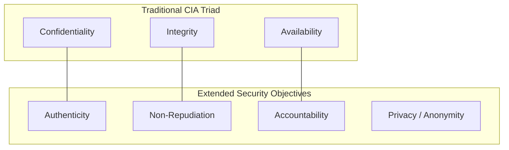
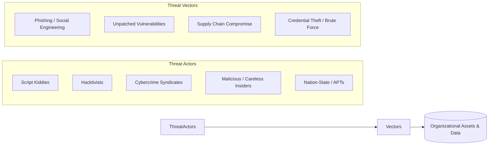
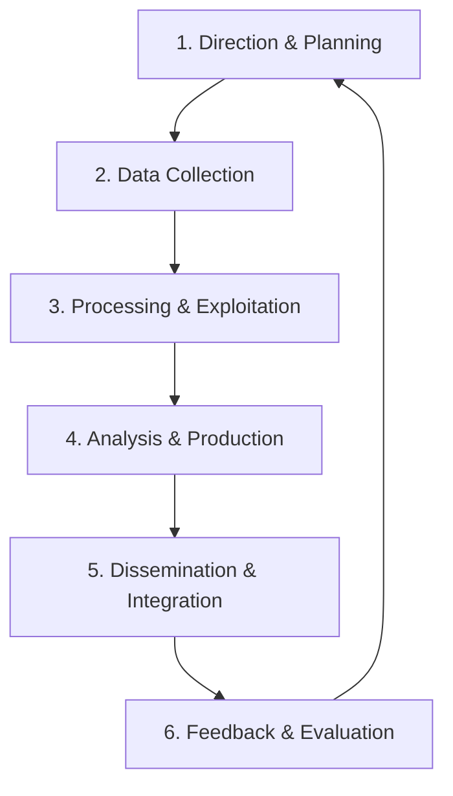
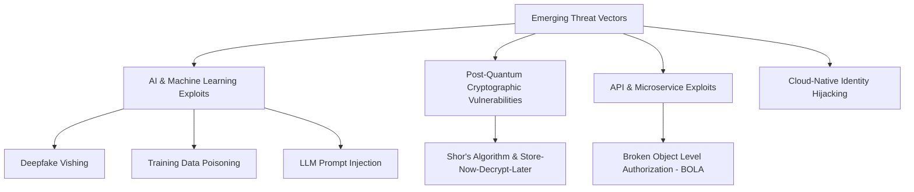
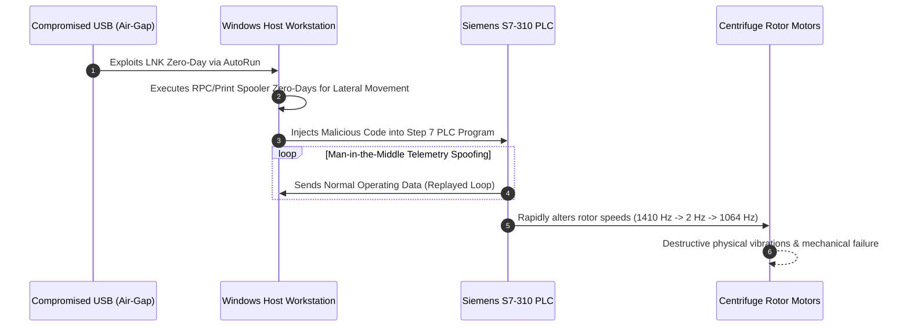
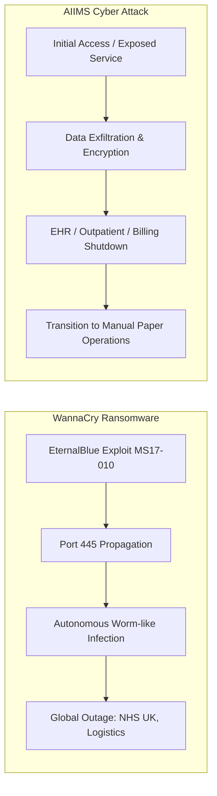
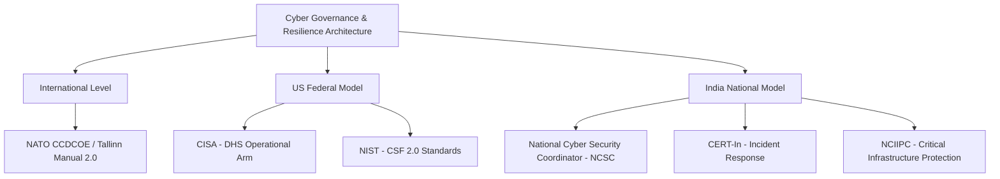

# Modern Cyber Threat Landscape, Threat Modeling & National Cyber Resilience

---

## 1. Prerequisites & Conceptual Foundation

To analyze modern security architectures and advanced threat vectors, you need a firm grasp of underlying systems concepts:

* **Identity & Access Management (IAM):** Differentiation between **Authentication** (verifying identity via passwords, MFA, tokens), **Authorization** (granting specific permissions via RBAC/ABAC), and **Accounting** (logging actions for non-repudiation).
* **System Boundaries & Attack Surfaces:** An **Attack Surface** comprises the sum total of all vulnerable points (entry vectors) where an unauthorized user can attempt to extract data or execute arbitrary code.
* **Network & Endpoint Telemetry:** Understanding basic security logging artifacts—such as Windows Event Logs (e.g., Event ID 4624 for successful logon), Sysmon, NetFlow/IPFIX, and Web Server Access Logs (Apache/NGINX).

---

## 2. Common Security Goals: The CIA Triad & Extended Objectives

Security architectures are designed to enforce a set of core security objectives. While the **CIA Triad** forms the traditional baseline, modern distributed applications require an extended model.

### 2.1 Foundational vs. Extended Security Objectives

| Objective | Operational Definition | Primary Threat / Attack Vector | Defense Mechanism |
| --- | --- | --- | --- |
| **Confidentiality** | Preserving authorized restrictions on information access and disclosure. | Sniffing, Data Exfiltration, Man-in-the-Middle (MitM). | Symmetric/Asymmetric Encryption (AES-256, RSA), TLS 1.3, Access Control Lists (ACLs). |
| **Integrity** | Safeguarding against improper information modification or destruction. | Unauthorized file modification, SQL Injection (SQLi), Tampering. | Cryptographic Hashes (SHA-256), HMACs, Digital Signatures, Immutable Storage. |
| **Availability** | Ensuring timely and reliable access to and use of information. | Volumetric DDoS, Ransomware Encryption, Hardware Failure. | High Availability (HA) Clusters, Load Balancing, Off-site Immutable Backups, Scrubbing Centers. |
| **Authenticity** | Verifying that an input, message, or transaction originates from a genuine entity. | Spoofing, Session Hijacking, Phishing. | Digital Certificates (PKI), Multi-Factor Authentication (MFA), FIDO2/WebAuthn. |
| **Non-Repudiation** | Ensuring a sender/actor cannot deny the validity of a signature or performed action. | Insider Fraud, Unauthorized Transaction Denial. | Asymmetric Cryptography (Private Key Signing), Immutable Append-Only Audit Logs. |
| **Accountability** | Tracing actions uniquely to a specific individual or process. | Shared Accounts, Privilege Escalation. | Individual User Identifiers, Centralized SIEM Logging, Session Recording. |

---

## 3. The Threat Landscape: Actors & Vectors

A **Threat Actor** is an individual or group that conducts malicious operations against digital assets. A **Threat Vector** is the specific path or technique used to exploit a security flaw.

### Threat Actor Profiling

* **Script Kiddies:** Unskilled actors using publicly available exploit scripts (e.g., Metasploit, automated scanners). Driven by curiosity or notoriety.
* **Cybercrime Syndicates:** Highly organized financial cartels operating as businesses. High sophistication, utilizing **CaaS (RaaS, IABs)** models.
* **Advanced Persistent Threats (APTs):** State-sponsored actors characterized by custom zero-day exploits, deep financial backing, stealth (**Living off the Land**), and prolonged, multi-year persistence.
* **Insiders:** Current/former employees or contractors with legitimate system access. Divided into **Malicious** (intentional exfiltration/sabotage) and **Negligent** (falling victim to social engineering).

---

## 4. Threat Modeling: Concept, Methodology & Frameworks

**Threat Modeling** is a structured procedure for identifying, structuralizing, and prioritizing potential system vulnerabilities and threats during the design phase of software or network engineering.

### 4.1 The 4-Question Framework (Adam Shostack)

1. *What are we building?* (System Architecture & Data Flow Diagrams)
2. *What can go wrong?* (Threat Identification via STRIDE)
3. *What are we going to do about it?* (Mitigations & Control Implementation)
4. *Did we do a good enough job?* (Validation, Retrospective & Testing)

---

### 4.2 Threat Modeling Frameworks Compared

| Framework | Primary Focus | Best Use Case | Core Taxonomy / Steps |
| --- | --- | --- | --- |
| **STRIDE** | Developer-centric software threat enumeration. | Application design & software development life cycle (SDLC). | **S**poofing, **T**ampering, **R**epudiation, **I**nformation Disclosure, **D**enial of Service, **E**levation of Privilege. |
| **PASTA** | Risk-centric threat modeling aligning business objectives with technical flaws. | Enterprise-level risk management & compliance integration. | 7-stage process: Objectives, Scope, Decomposition, Analysis, Vulnerability Analysis, Attack Modeling, Risk & Impact. |
| **CVSS v4.0** | Vulnerability scoring and severity measurement. | Vulnerability management and operational patching prioritization. | Base Metrics (Exploitability/Impact), Threat Metrics, Environmental Metrics (Scored 0.0 to 10.0). |
| **ATT&CK (MITRE)** | Real-world adversary behavior and TTP classification. | Post-breach detection, threat hunting, and Red/Blue Team operations. | Matrices (Enterprise, Mobile, ICS) detailing Tactics (goals) and Techniques (methods). |

#### Detailed Mapping of the STRIDE Taxonomy

| Threat Category | Security Goal Violated | Technical Definition | Example Mitigation Control |
| --- | --- | --- | --- |
| **Spoofing** | Authenticity | Impersonating an entity, process, or user. | Mutual TLS (mTLS), FIDO2 MFA, Kerberos. |
| **Tampering** | Integrity | Unauthorized modification of data in transit or at rest. | HMAC validation, Digital Signatures, File Integrity Monitoring (FIM). |
| **Repudiation** | Non-Repudiation | Denying the execution of an action due to lack of proof. | Cryptographically signed audit trails, WORM (Write Once Read Many) storage. |
| **Information Disclosure** | Confidentiality | Exposing sensitive data to unauthorized parties. | Field-level encryption, TLS 1.3, Data Loss Prevention (DLP). |
| **Denial of Service** | Availability | Exhausting system resources to disrupt service. | Rate limiting, Cloud Scrubbing, SYN Cookies, Auto-scaling. |
| **Elevation of Privilege** | Authorization | Gaining unauthorized elevated access levels. | Principle of Least Privilege (PoLP), Sudo policy hardening, RBAC. |

---

## 5. Security Analysis, Risk Assessment & Intelligence

### 5.1 The Risk Assessment Equation & Matrix

Risk is calculated as a function of the likelihood of a threat actor exploiting a vulnerability and the resulting business impact:

$$\text{Risk Score} = \text{Likelihood} \times \text{Impact}$$

#### Qualitative 3x3 Risk Assessment Matrix

| Likelihood $\downarrow$ / Impact $\rightarrow$ | Low (1) | Medium (2) | High (3) |
| --- | --- | --- | --- |
| **High (3)** | Medium (3) | High (6) | **Critical (9)** |
| **Medium (2)** | Low (2) | Medium (4) | High (6) |
| **Low (1)** | Low (1) | Low (2) | Medium (3) |

#### Quantitative Risk Analysis Metrics

* **Single Loss Expectancy (SLE):** Total monetary loss from a single risk event:

$$\text{SLE} = \text{Asset Value (AV)} \times \text{Exposure Factor (EF)}$$

* **Annualized Rate of Occurrence (ARO):** Estimated frequency of the risk event occurring per year.
* **Annualized Loss Expectancy (ALE):** Expected annual cost of a given risk:

$$\text{ALE} = \text{SLE} \times \text{ARO}$$

---

### 5.2 Threat Intelligence: The Cyber Threat Intelligence Cycle

Cyber Threat Intelligence (CTI) translates raw telemetry data into actionable defensive insights.

#### Levels of Threat Intelligence

1. **Strategic:** High-level trends, financial impact, and geopolitical motivations designed for C-level executives (e.g., threat actor profiles).
2. **Tactical:** Adversary Tactics, Techniques, and Procedures (TTPs) mapped to the MITRE ATT&CK framework for SOC managers and threat hunters.
3. **Operational:** Details on specific upcoming campaigns or tools used by threat actors.
4. **Technical:** Tactical Indicators of Compromise (IoCs) such as file hashes (SHA-256), malicious IP addresses, and C2 domain names fed directly into SIEM/SOAR platforms via STIX/TAXII protocols.

---

## 6. Emerging Threat Vectors & Advanced Paradigms

### 6.1 Adversarial Machine Learning & Generative AI Threats

* **Data Poisoning:** Injecting manipulated data into an ML model's training pipeline to introduce deliberate backdoors or bias.
* **Prompt Injection:** Tampering with instructions supplied to Large Language Models (LLMs) to bypass guardrails and access underlying system capabilities.
* **Model Inversion & Exfiltration:** Reconstructing original training data (including sensitive personal data) by observing model outputs.

### 6.2 The Quantum Threat to Modern Cryptography

* **Shor’s Algorithm:** Enables quantum computers running on sufficient qubits to compute discrete logarithms and factor large prime numbers in polynomial time. This breaks current asymmetric cryptography: **RSA**, **ECC (ECDSA/ECDH)**, and **Diffie-Hellman**.
* **Grover’s Algorithm:** Speeds up unstructured database searches, effectively halving the security strength of symmetric keys (e.g., reducing AES-128 security to 64 bits).
* **Defensive Paradigm:** Transitioning toward **Post-Quantum Cryptography (PQC)** standards approved by NIST (e.g., CRYSTALS-Dilithium, ML-KEM/CRYSTALS-Kyber) and adopting asymmetric keys with at least **AES-256**.

---

## 7. Landmark Case Studies in Cyber Warfare & Supply Chain Attacks

### 7.1 SolarWinds Orion Supply Chain Attack (2020)

* **Threat Actor:** APT29 (Cozy Bear / Nobelium), attributed to Russia's Foreign Intelligence Service (SVR).
* **Attack Type:** Software Supply Chain Compromise (**SUNBURST** backdoor).
* **Technical Mechanism:**
1. Attackers compromised the internal build pipeline of SolarWinds Orion network management software.
2. Injected a lightweight malicious backdoor (`SolarWinds.Orion.Core.BusinessLayer.dll`) directly into legitimate, digitally signed software updates.
3. Over 18,000 corporate and government organizations downloaded the trojanized update.
4. The malware remained dormant for 12–14 days before establishing C2 infrastructure using custom domain requests disguised as legitimate Orion protocol traffic.

* **Key Takeaway:** Digital signatures on code alone do not protect against build-pipeline compromises. Secure software development requires continuous source-code auditing and build-system isolation.

---

### 7.2 Stuxnet: The Dawn of Cyber Warfare (2010)

* **Target:** Iran’s Natanz Nuclear Enrichment Facility.
* **Attributed Threat Actors:** US and Israeli State Intelligence (Operation Olympic Games).
* **Operational Characteristics:**
* **Air-Gap Traversal:** Delivered via infected USB flash drives through insider/contractor systems.
* **Zero-Day Arsenal:** Utilized **four unpatched Microsoft Windows zero-day vulnerabilities** (e.g., Print Spooler, LNK shortcut execution) to propagate across local networks.
* **Rootkit Technology:** Leveraged stolen, valid digital code-signing certificates (Realtek and JMicron) to bypass Windows driver signature enforcement.
* **Targeted Payload Execution:** Specifically targeted **Siemens S7-310 and Step 7 Programmable Logic Controllers (PLCs)** linked to frequency drive converters running gas centrifuges.

---

### 7.3 WannaCry (2017) & AIIMS New Delhi (2022): Ransomware Impact

#### Technical Comparison

| Dimension | WannaCry (2017) | AIIMS New Delhi Cyber Attack (2022) |
| --- | --- | --- |
| **Malware Family** | WannaCry (Worm-Ransomware hybrid). | Targeted Human-Operated Ransomware. |
| **Infection Vector** | Exploited **MS17-010** (EternalBlue SMBv1 flaw) leaked from NSA assets. | Unpatched edge routers, exposed remote services, and weak credential policies. |
| **Propagation** | **Autonomous:** Scanned global IPv4 subnets for open SMB port 445; required no human interaction. | **Manual Lateral Movement:** Attackers enumerated Active Directory, exfiltrated data, and disabled backups. |
| **Targeting Scope** | Global, non-discriminatory campaign hitting 200,000+ computers across 150 countries. | Highly targeted attack against healthcare IT infrastructure handling critical patient records. |
| **Impact on Healthcare** | Disrupted UK National Health Service (NHS) facilities, forcing patient diversions. | Encrypted 5+ hospital servers, disrupting Online Health Authority Systems (e-Hospital) for weeks. |

---

### 7.4 Colonial Pipeline Ransomware Attack (2021)

* **Threat Actor:** DarkSide (Eastern European RaaS group).
* **Initial Access Vector:** A single compromised legacy **Virtual Private Network (VPN) password** found on a dark web credential dump. The account lacked Multi-Factor Authentication (MFA).
* **Operational Impact:** The attack targeted Colonial Pipeline's enterprise IT network. Out of caution and an inability to bill customers accurately due to infected accounting systems, the company **proactively shut down the physical operational pipeline** (5,500 miles supplying 45% of the US East Coast's fuel) for six days.
* **Key Takeaway:** Demonstrates how IT system compromises can force operational technology (OT) shutdowns due to billing dependencies and risk management concerns.

---

## 8. Homeland Security, Governance & National Cyber Resilience

Maintaining national resilience requires coordinated defensive operations across government agencies and private sector critical infrastructure operators.

### 8.1 Critical Governance Entities

1. **CISA (Cybersecurity and Infrastructure Security Agency - US):** Coordinates national vulnerability management, emergency communications, and defensive capabilities for physical and cyber critical infrastructure.
2. **CERT-In (Indian Computer Emergency Response Team):** The national nodal agency responsible for handling cybersecurity incidents, issuing advisories, and enforcing mandatory 6-hour incident reporting rules for organizations operating in India.
3. **NCIIPC (National Critical Information Infrastructure Protection Centre - India):** Designated under Section 70A of the Information Technology Act (2000) as the national agency to protect designated Critical Information Infrastructure (CII).
4. **NIST CSF v2.0:** Serves as the global standard framework for cybersecurity risk management across organizations regardless of size or sector.

---

## 9. Exam Tips & High-Yield Review Points

> ### 🧠 Exam Tip 1: STRIDE Threat Mapping
> 
> 
> University exams often ask you to map a system flaw to a specific STRIDE category:
> * **SQL Injection** $\rightarrow$ **Tampering** (Modifying data) OR **Information Disclosure** (Reading data) OR **Elevation of Privilege** (Bypassing auth).
> * **Fake SSL Certificate / ARP Spoofing** $\rightarrow$ **Spoofing**.
> * **Log Wiping / Deletion** $\rightarrow$ **Repudiation**.
> * **SYN Flood** $\rightarrow$ **Denial of Service**.
> 
> 

> ### 🧠 Exam Tip 2: Stuxnet Technical Anatomy
> 
> 
> On cyber warfare questions, emphasize that Stuxnet changed cyber security history by targeting **PLC hardware** directly:
> * It was the first publicly documented malware to alter industrial physical processes while **spoofing diagnostic feedback loop signals**, making operators think system metrics were completely normal.
> 
> 

> ### 🧠 Exam Tip 3: Quantum Cryptography Vulnerability
> 
> 
> Be precise about quantum impacts:
> * Quantum computers **completely break asymmetric encryption** (RSA, ECC, Diffie-Hellman) using **Shor's Algorithm**.
> * They do **not** completely break symmetric encryption (AES). Instead, **Grover's Algorithm** reduces effective key length by half, making **AES-256** resilient against quantum attacks.
> 
> 

---

## 10. Common University Exam & Interview Questions

### 1. Differentiate between STRIDE and PASTA threat modeling methodologies. Which would you choose for a fintech application?

* **Answer:** **STRIDE** is an application- and developer-centric threat classification taxonomy that categorizes system threats into six operational buckets based on Data Flow Diagrams (DFDs). It excels at finding specific technical software defects.
* **PASTA (Process for Attack Simulation and Threat Analysis)** is an enterprise, risk-centric, 7-step threat modeling framework. It explicitly aligns technical threats with financial impacts and compliance goals.
* **Selection for Fintech:** PASTA is typically preferred for fintech applications because financial systems operate under strict regulatory standards (PCI-DSS, GDPR) and require business impact analyses that directly connect technical exploitability to financial exposure.

### 2. How did the SolarWinds attack bypass traditional perimeter security and code-signing validation controls?

* **Answer:** SolarWinds was a software supply chain attack targeting the build pipeline rather than the end customer directly. Threat actors compromised SolarWinds' internal build environment (using malicious code dubbed *SUNSPOT*) and injected the backdoor (*SUNBURST*) into the codebase *before* compilation.
* Consequently, when SolarWinds compiled and digitally signed the update binary using its official, trusted PKI certificate, the malicious payload was included in the valid signature. Enterprise perimeters trusted the update as a legitimate software patch from a verified vendor, bypassing perimeter firewalls and traditional endpoint signature checks.

### 3. Calculate the Annualized Loss Expectancy (ALE) for an enterprise server farm if an asset valued at $500,000 has an Exposure Factor (EF) of 40% against ransomware, and the Annualized Rate of Occurrence (ARO) is estimated at 0.2 (once every 5 years).

* **Answer:**
1. Calculate Single Loss Expectancy (SLE):

$$\text{SLE} = \text{Asset Value (AV)} \times \text{Exposure Factor (EF)}$$

$$\text{SLE} = \$500,000 \times 0.40 = \$200,000$$

2. Calculate Annualized Loss Expectancy (ALE):

$$\text{ALE} = \text{SLE} \times \text{ARO}$$

$$\text{ALE} = \$200,000 \times 0.2 = \$40,000$$

* **Result:** The organization can expect an average financial loss of **$40,000 per year** from this ransomware threat, setting a rational upper budget limit for defensive controls targeting this risk.

---

## 11. Topic Summary

* **Security Objectives:** Expand beyond the foundational **CIA Triad** (Confidentiality, Integrity, Availability) to include **Authenticity**, **Non-Repudiation**, and **Accountability**.
* **Threat Modeling:** Formal frameworks like **STRIDE** and **PASTA** allow teams to systematically identify application weaknesses during design rather than reacting post-breach.
* **Risk & Intelligence:** Quantitative risk metrics ($\text{ALE} = \text{SLE} \times \text{ARO}$) allow organizations to prioritize defensive spending. **Threat Intelligence** converts operational telemetry into actionable defense across strategic, tactical, operational, and technical levels.
* **Modern Threat Vectors:** Range from AI data poisoning and prompt injection to post-quantum cryptographic risks that threaten asymmetric algorithms like RSA and ECC.
* **Real-World Case Studies:**
* **SolarWinds (2020):** Demonstrated the dangers of software supply chain compromises.
* **Stuxnet (2010):** Proved cyber attacks can cause physical destruction to critical infrastructure by targeting PLCs.
* **Colonial Pipeline (2021) & WannaCry/AIIMS:** Highlighted how ransomware affects physical supply chains and critical public services.

* **National Resilience:** National cyber resilience depends on structured governance frameworks (**NIST CSF v2.0**) and coordinated defense entities (**CISA**, **CERT-In**, **NCIIPC**).