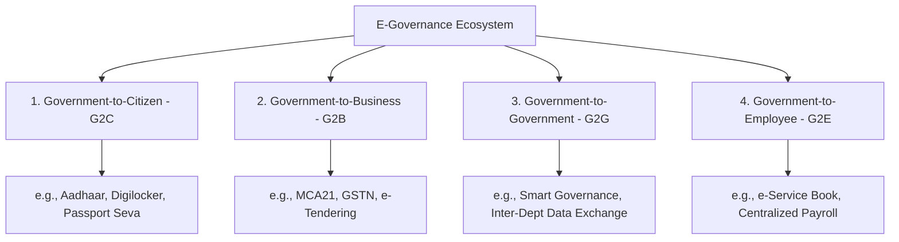
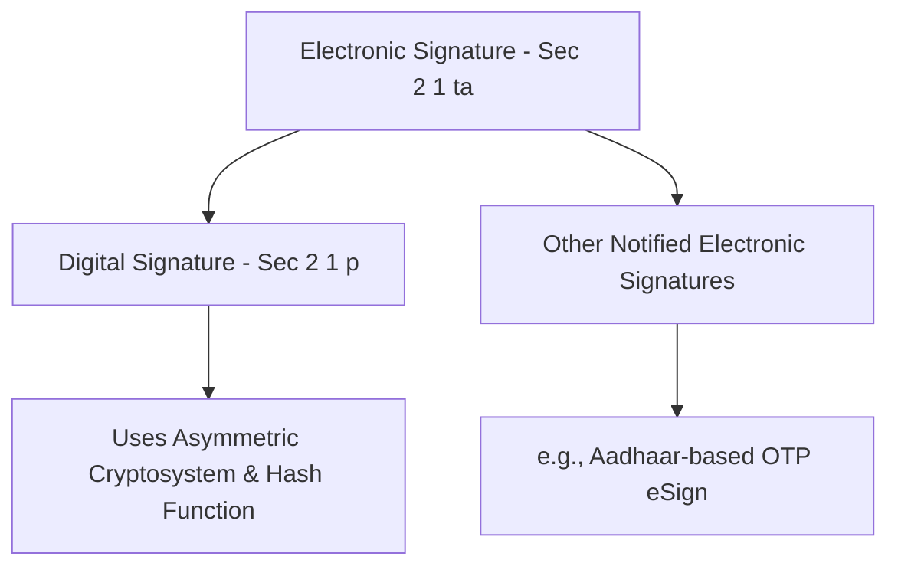
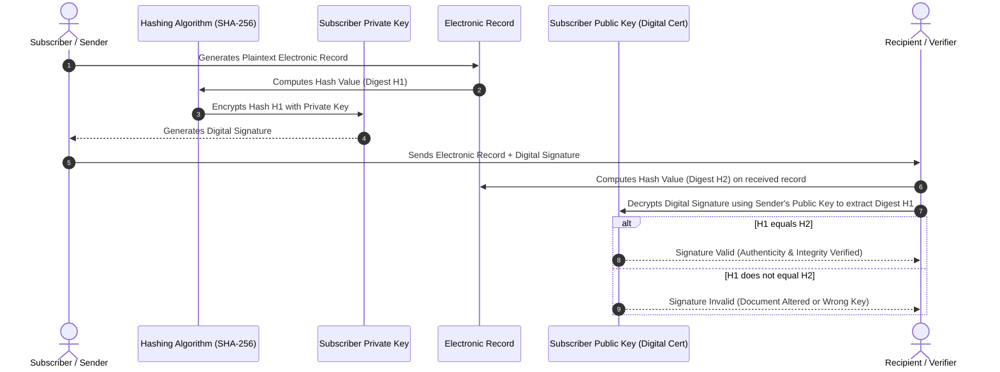
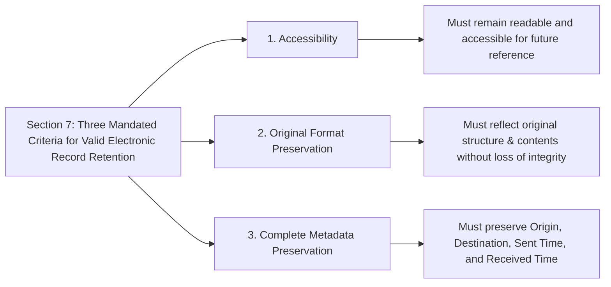
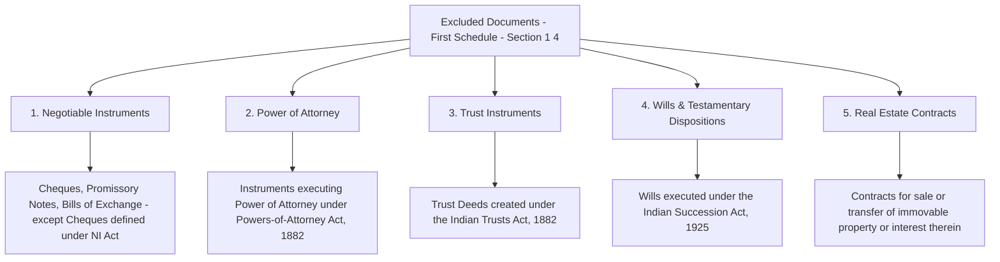
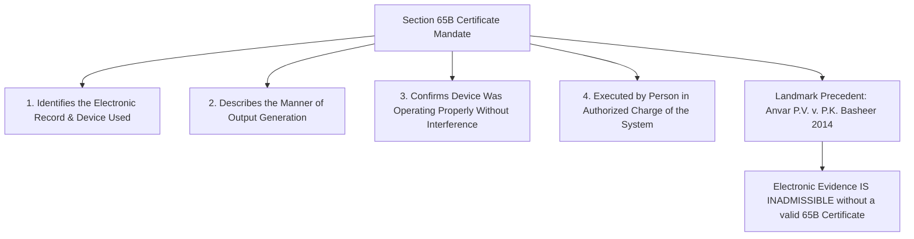

#  E-Governance & Information Technology Law in India

---

## 1. Prerequisites & Legal-Technological Foundation

Before analyzing the regulatory frameworks governing electronic governance in India, it is necessary to understand the technical and legal concepts that underpin digital transactions:

* **Public Key Infrastructure (PKI):** An asymmetric cryptographic system utilizing paired keys:
* **Private Key:** Maintained securely by the subscriber; used to generate digital signatures and decrypt incoming data.
* **Public Key:** Made publicly available via a trusted third party; used by recipients to verify digital signatures and encrypt outgoing data.


* **Hash Functions & Cryptographic Integrity:** Fixed-length output strings generated from arbitrary input data via one-way algorithms (e.g., SHA-256). Any modification to the source document fundamentally alters the resulting hash.
* **Non-Repudiation:** The legal and technical guarantee that a party to a contract or transaction cannot deny the authenticity of their signature or the creation of a document.
* **Legislative Origin of IT Act, 2000:** Drafted in response to the **UNCITRAL Model Law on Electronic Commerce (1996)**, which recommended that member states adopt uniform legal frameworks granting electronic records the same legal standing as paper documents.

---

## 2. Conceptual Foundation: E-Governance & Its Architecture

### 2.1 What is E-Governance?

**Electronic Governance (E-Governance)** is the application of Information and Communication Technologies (ICT) by government authorities to deliver public services, exchange information, execute transactions, and integrate existing systems between government bodies, citizens, businesses, and employees.



### 2.2 Operational Architecture: How E-Governance Works in Practice

Modern Indian E-Governance infrastructure operates on an integrated multi-tiered digital architecture known as the **India Stack**.

```mermaid
graph TB
    subgraph Layer 4: Consent & Access Layer
        DEPA[Data Empowerment & Protection Architecture - Account Aggregators]
    end

    subgraph Layer 3: Payment & Transaction Layer
        UPI[Unified Payments Interface - UPI]
        AePS[Aadhaar Enabled Payment System]
    end

    subgraph Layer 2: Verification & Artifact Layer
        Digilocker[DigiLocker - XML Data & Signed Documents]
        eSign[eSign Services - Remote PKI Signing]
    end

    subgraph Layer 1: Identity & Authentication Layer
        Aadhaar[Aadhaar - Biometric & OTP Authentication]
    end

    Layer 1 --> Layer 2
    Layer 2 --> Layer 3
    Layer 3 --> Layer 4

```

---

## 3. Cryptographic Framework: Digital Signatures vs. Electronic Signatures

The **Information Technology Act, 2000** differentiates between **Digital Signatures** and broader **Electronic Signatures** (introduced via the IT Amendment Act, 2008).



### 3.1 Technical & Legal Comparison

| Attribute | Digital Signature | Electronic Signature |
| --- | --- | --- |
| **Legal Definition** | Authentication of an electronic record using an asymmetric cryptosystem and hash function (**Section 2(1)(p)** & **Section 3**). | Authentication of an electronic record by a technique specified in the Second Schedule (**Section 2(1)(ta)** & **Section 3A**). |
| **Technical Mechanism** | PKI-based cryptographic key pairs (Private/Public) managed via hardware tokens (USB Dongles - e.g., Class 3 DSC). | Technology-neutral framework; includes Aadhaar-based eSign, biometric verification, or security procedure-based validation. |
| **Verification Authority** | Issued by a licensed **Certifying Authority (CA)** under the supervision of the **CCA (Controller of Certifying Authorities)**. | Verified via designated authentication service providers (ASPs) connected to identity databases (e.g., UIDAI). |
| **Security & Cryptography** | Relies directly on mathematical hashing algorithms (SHA-256) and asymmetric key encryption (RSA/ECC). | Depends on the security method notified in the Second Schedule of the IT Act. |
| **Primary Use Case** | E-Tendering, MCA company filings, Income Tax returns submission, Court e-Filings. | Instant citizen document signing, self-attestation via DigiLocker/eSign. |

### 3.2 Asymmetric Cryptographic Signing Process



---

## 4. Legal Framework: Sections 3 to 10A of the IT Act, 2000

Sections 3 through 10A form the core of Chapter III and Chapter IV of the Information Technology Act, 2000. They provide the legal foundation for e-commerce, digital transformation, and e-governance in India.

```mermaid
flowchart TD
    ITAct[IT Act, 2000: Chapter III & IV]
    
    ITAct --> Sec3[Sec 3 & 3A: Authentication & Electronic Signatures]
    ITAct --> Sec4[Sec 4: Legal Recognition of Electronic Records]
    ITAct --> Sec5[Sec 5: Legal Recognition of Electronic Signatures]
    ITAct --> Sec6[Sec 6: Use of Electronic Records in Government]
    ITAct --> Sec6A[Sec 6A: Delivery of Services by Service Provider]
    ITAct --> Sec7[Sec 7: Retention of Electronic Records]
    ITAct --> Sec7A[Sec 7A: Audit of Electronic Documents]
    ITAct --> Sec8[Sec 8: Publication in Electronic Gazette]
    ITAct --> Sec9[Sec 9: No Right to Insist on Electronic Format]
    ITAct --> Sec10[Sec 10: Power of Controller to Make Regulations]
    ITAct --> Sec10A[Sec 10A: Validity of Electronic Contracts]

```



---

### 4.1 Section-by-Section Legal Analysis

#### Section 3: Authentication of Electronic Records

* **Statutory Requirement:** Specifies that an electronic record can be authenticated by affixing a **Digital Signature** generated using an asymmetric cryptosystem and a one-way hash function.
* **Technical Mandate:** Requires that the private key and public key function as a mathematically linked pair, where the public key can verify the signature generated by the private key.

#### Section 3A: Electronic Signature (Inserted via 2008 Amendment)

* **Statutory Requirement:** Provides a technology-neutral avenue for authenticating electronic records using electronic signature techniques listed in the **Second Schedule**.
* **Conditions for Reliability:** An electronic signature is considered reliable if:
1. The signature creation data is linked exclusively to the signatory.
2. The signature creation data was under the signatory's control at the time of signing.
3. Any alteration made to the signature or document after signing is detectable.


#### Section 4: Legal Recognition of Electronic Records

* **Core Rule:** Where any law requires information or data to be in **written, typewritten, or printed form**, that requirement is satisfied if the information is rendered or made available in an **electronic form** accessible for subsequent reference.
* **Impact:** Grants electronic documents equal legal status with physical paper records across Indian law.

#### Section 5: Legal Recognition of Electronic Signatures

* **Core Rule:** Where any law requires a document to be signed by a person, that requirement is satisfied if the person affixes an **electronic signature or digital signature** in the prescribed manner.
* **Condition:** The signature must be verified by a valid Digital Signature Certificate (DSC) or an approved authentication method.

#### Section 6: Use of Electronic Records and Electronic Signatures in Government

* **Statutory Provision:** Enables government departments and public agencies to accept documents in electronic form by establishing mechanisms for:
1. Filing applications, forms, or records electronically.
2. Issuing licenses, permits, sanctions, or approvals online.
3. Processing and approving electronic payments and receipts.


#### Section 6A: Delivery of Services by Service Provider

* **Statutory Provision:** Authorizes the appropriate government to engage private service providers to set up, operate, and maintain digital infrastructure for delivering public services (e.g., Common Service Centres - CSCs, Passport Seva Kendras managed by private partners).
* **Fee Collection:** Service providers can collect and retain user fees as authorized by the government.

#### Section 7: Retention of Electronic Records

* **Statutory Mandate:** Where any law mandates that documents or records be retained for a specific duration, that requirement is satisfied if they are retained in electronic form, provided:
1. The electronic record remains accessible for subsequent reference.
2. The record is retained in its original format, or in a format that accurately reproduces the original information.
3. Details regarding the origin, destination, date, and time of transmission/receipt are preserved.




#### Section 7A: Audit of Documents Maintained in Electronic Form

* **Statutory Provision:** Provides that where an audit of documents is required by law, the requirement is satisfied by auditing the corresponding electronic records.

#### Section 8: Publication of Rules, Regulations, etc., in Electronic Gazette

* **Statutory Provision:** Where any law requires a notification, rule, or regulation to be published in the Official Gazette, publishing it in the **Electronic Gazette** satisfies the legal requirement.
* **Date of Effect:** If published in both printed and electronic forms, the date of publication is calculated from the format published first.

#### Section 9: No Right to Insist Government to Accept Documents in Electronic Form

* **Statutory Restriction:** Clarifies that Sections 6, 7, and 8 **do not grant any person an absolute right** to force a government department to accept or issue documents in electronic form unless that department explicitly mandates or transitions to electronic formats.

#### Section 10: Power of Controller to Make Regulations

* **Statutory Power:** Grants the **Controller of Certifying Authorities (CCA)** the authority to make regulations governing Digital Signatures, including cryptographic standards, certificate formats, key lengths, and operational procedures for Certifying Authorities.

#### Section 10A: Validity of Contracts Formed Through Electronic Means

* **Statutory Provision:** Affirms that contracts formed electronically (via email exchange, online click-through agreements, or automated API communications) are legally valid and enforceable:
> *"Where in a contract formation, the communication of proposals, the acceptance of proposals, the revocation of proposals and acceptances... are expressed in electronic form or by means of an electronic record, such contract shall not be deemed to be unenforceable solely on the ground that such electronic record or means was used for that purpose."*


---

## 5. Non-Applicability of the IT Act, 2000 (First Schedule)

Under **Section 1(4)** of the IT Act, 2000, the provisions governing electronic records and signatures **do not apply** to certain types of legal instruments listed in the **First Schedule**:



---

## 6. Evidentiary Value of Electronic Records: The Indian Evidence Act

The legal recognition granted by the IT Act is reinforced by specific provisions in the **Indian Evidence Act, 1872** (now aligned with the **Bharatiya Sakshya Adhiniyam, 2023 - BSA**).

### 6.1 Admissibility Requirements under Section 65B

Under **Section 65B of the Indian Evidence Act** (Section 63 of the BSA), any information contained in an electronic record printed on paper, stored, recorded, or copied in optical/magnetic media is deemed a "document" and is admissible in court proceedings **without further proof or production of the original**, subject to satisfying the requirements of a **65B Certificate**.



---

## 7. Sections at a Glance: Statutory Summary Table

| Section | Statutory Title | Practical Implementation |
| --- | --- | --- |
| **Sec 3** | Authentication of Electronic Records | Mandates PKI, SHA-256 hashing, and asymmetric keys for Digital Signatures. |
| **Sec 3A** | Electronic Signature | Provides legal standing for technology-neutral methods like Aadhaar eSign. |
| **Sec 4** | Legal Recognition of Electronic Records | Equates digital documents with physical paper records. |
| **Sec 5** | Legal Recognition of Electronic Signatures | Grants electronic signatures equal status with handwritten signatures. |
| **Sec 6** | Use of Electronic Records in Government | Enables online application filings, e-licenses, and digital payments. |
| **Sec 6A** | Delivery of Services by Service Provider | Authorizes public-private partnerships (e.g., CSCs, PSKs) to deliver public services. |
| **Sec 7** | Retention of Electronic Records | Establishes rules for storing electronic records (accessibility, integrity, metadata). |
| **Sec 7A** | Audit of Documents in Electronic Form | Equates electronic record audits with traditional paper document audits. |
| **Sec 8** | Publication in Electronic Gazette | Grants official status to notifications published in the Electronic Gazette. |
| **Sec 9** | No Right to Insist on Electronic Format | Clarifies that citizens cannot legally force government bodies to adopt digital options if not notified. |
| **Sec 10** | Power of Controller to Make Regulations | Grants the Controller (CCA) regulatory authority over PKI standards and Certifying Authorities. |
| **Sec 10A** | Validity of Electronic Contracts | Validates contracts formed via electronic means, email exchanges, or APIs. |

---

## 8. Exam Tips & High-Yield Review Points

> ### 🧠 Exam Tip 1: The Landmark Anvar P.V. Rule
> 
> 
> In exam questions on the admissibility of electronic evidence:
> * Emphasize **Section 65B(4) of the Indian Evidence Act**.
> * Cite **Anvar P.V. v. P.K. Basheer (2014) 10 SCC 473**, where the Supreme Court ruled that secondary evidence of electronic records is **completely inadmissible** unless accompanied by a valid Section 65B Certificate executed at the time of producing the evidence.
> 
> 

> ### 🧠 Exam Tip 2: First Schedule Exclusions
> 
> 
> Multiple-choice and short-answer questions often ask which documents **cannot** be executed electronically.
> * Memorize the five exclusions in the First Schedule: **Wills, Power of Attorney, Trust Deeds, Real Estate Transfer Contracts, and Negotiable Instruments** (except cheques).
> 
> 

> ### 🧠 Exam Tip 3: Section 6A vs. Section 9
> 
> 
> Be prepared to explain this contrast:
> * **Section 6A** allows the government to work with private service providers (like CSCs) to deliver public digital services.
> * **Section 9** clarifies that citizens **cannot demand** electronic service delivery from a government department unless that department has formally transitioned to digital systems.
> 
> 

---

## 9. Common University Exam & Interview Questions

### 1. Differentiate clearly between a Digital Signature and an Electronic Signature under the IT Act, 2000. Why was Section 3A introduced in 2008?

* **Answer:** A **Digital Signature** (defined under **Section 2(1)(p)** and **Section 3**) is a specific, PKI-based implementation requiring an asymmetric cryptosystem and a hash function (e.g., SHA-256). It relies on private and public key pairs issued by a Certifying Authority.
* An **Electronic Signature** (defined under **Section 2(1)(ta)** and **Section 3A**) is a broader, technology-neutral concept that includes any digital authentication method listed in the Second Schedule of the IT Act.
* **Why Section 3A was introduced:** The original 2000 Act recognized only PKI-based Digital Signatures, which required physical USB tokens (dongles) and complex key management. The 2008 Amendment introduced Section 3A to establish a technology-neutral framework, paving the way for scalable identity mechanisms such as **Aadhaar-based eSign** and biometric validation.

### 2. Can a contract for the sale of real estate be executed purely through an email exchange in India? Explain with reference to Section 10A and the First Schedule of the IT Act.

* **Answer:** **No**, a real estate sale contract executed solely via email exchange is **not legally enforceable** under the IT Act.
* **Legal Analysis:** While **Section 10A** of the IT Act, 2000 grants general legal validity to contracts formed through electronic communications (such as emails), **Section 1(4)** explicitly subjects Section 10A to the exclusions in the **First Schedule**.
* Item 5 of the First Schedule explicitly excludes *"any contract for the sale or conveyance of immovable property or any interest in such property."* Therefore, real estate transactions require physical execution, stamping, and registration under the Registration Act, 1908.

### 3. Explain the statutory requirements for the retention of electronic records under Section 7 of the IT Act, 2000.

* **Answer:** Under **Section 7** of the IT Act, 2000, where any law requires that documents or records be retained for a specified period, that requirement is fulfilled by storing them in electronic form, provided three mandatory conditions are met:
1. **Accessibility:** The information contained in the electronic record must remain accessible and usable for subsequent reference.
2. **Format Integrity:** The electronic record must be retained in its original format, or in a format that accurately presents the original information.
3. **Metadata Preservation:** Details that identify the **origin, destination, date, and time of dispatch or receipt** of the record must be preserved alongside the core document.


---

## 10. Topic Summary

* **E-Governance Models:** ICT integration across public services spans four primary operational models: **G2C**, **G2B**, **G2G**, and **G2E**, powered by foundational platforms like the **India Stack**.
* **Electronic vs. Digital Signatures:** **Digital Signatures (Section 3)** rely on asymmetric key pairs and PKI technology, whereas **Electronic Signatures (Section 3A)** offer a technology-neutral framework that includes systems like Aadhaar-based eSign.
* **Legal Recognition (Sections 4 & 5):** Equates electronic documents and signatures with paper documents and handwritten signatures across Indian law.
* **Service Delivery & Retention (Sections 6, 6A & 7):** Facilitates e-filings, public-private partnerships for service delivery, and sets rules for storing electronic records alongside required metadata.
* **Contract Validity (Section 10A):** Validates contracts formed electronically (such as email exchanges and API interactions), provided they do not involve instruments excluded under the **First Schedule** (e.g., Wills, Real Estate Contracts, Power of Attorney).
* **Evidentiary Admissibility (Section 65B):** Electronic records are admissible as primary legal evidence in Indian courts when accompanied by a valid Section 65B Certificate confirming device integrity and operational control.