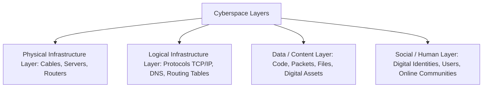
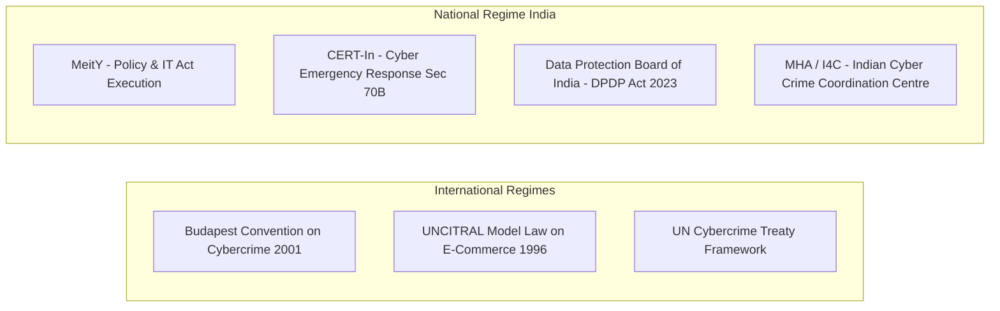
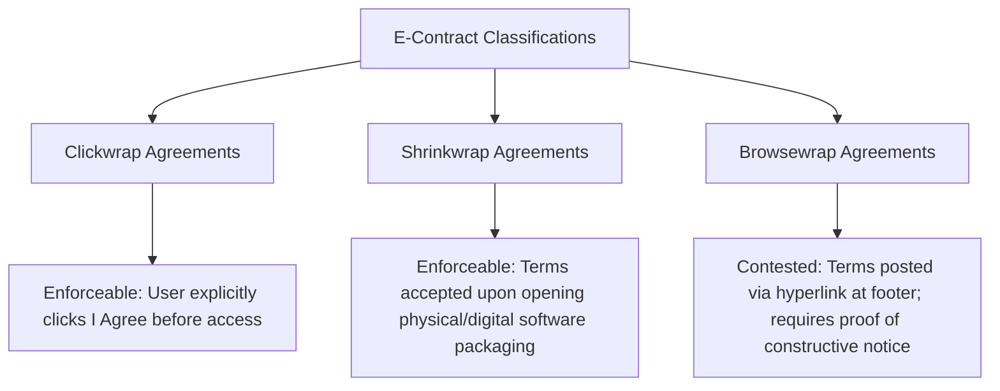
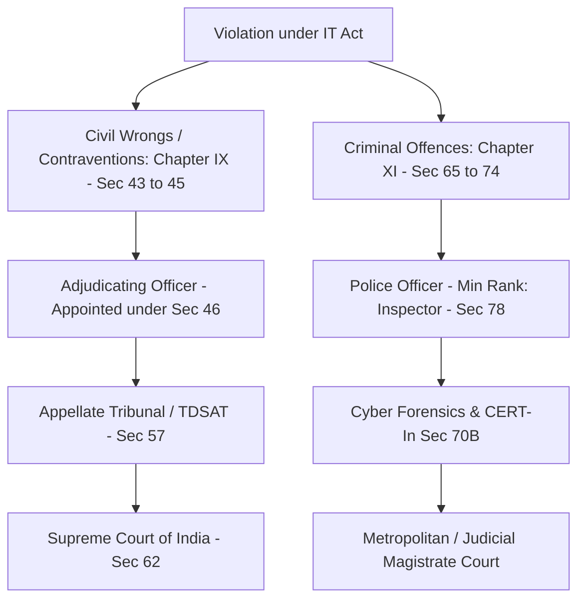
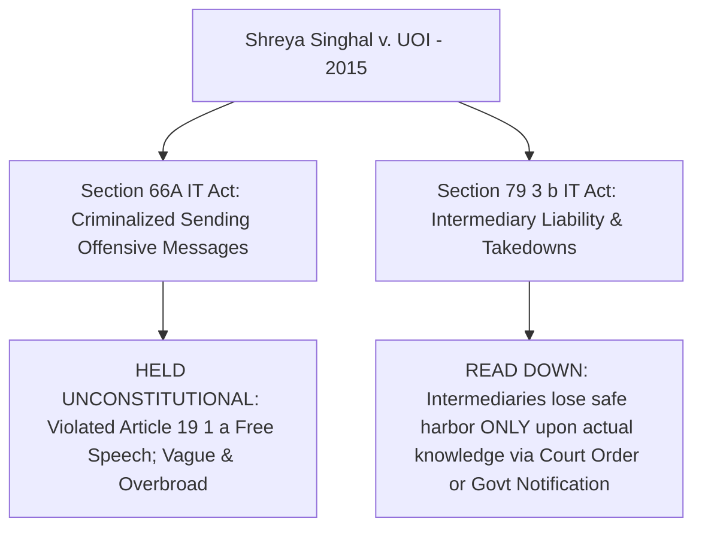
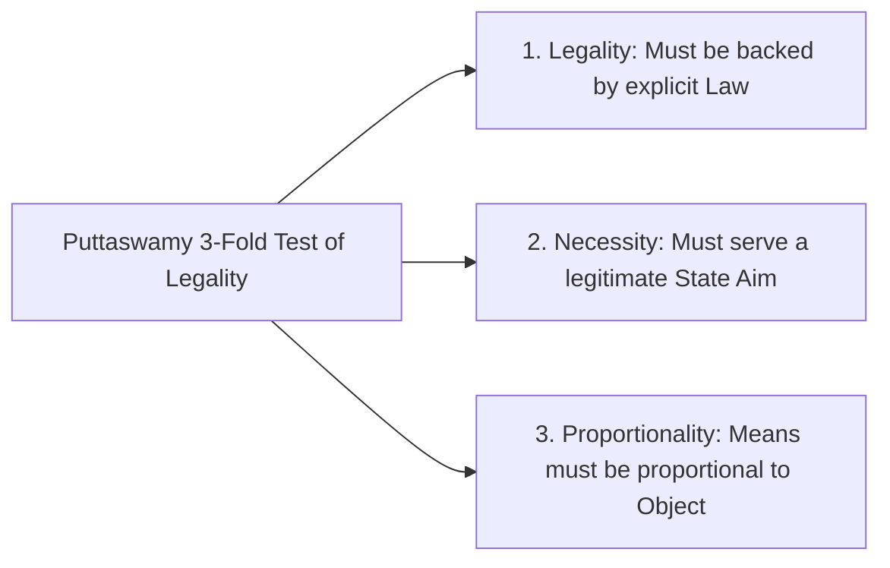
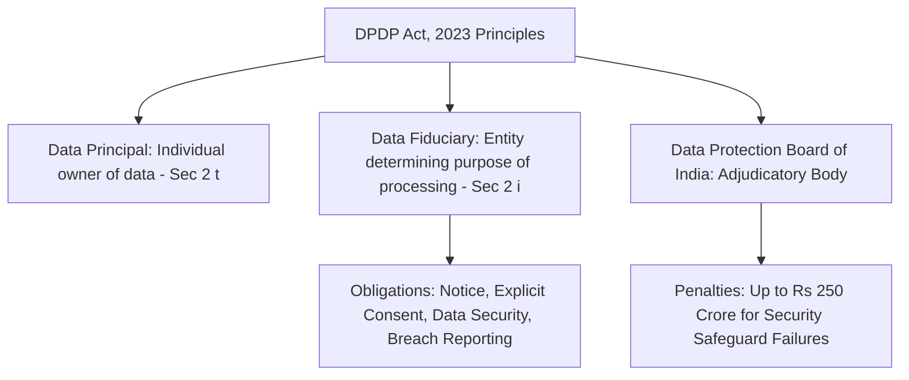

# Cyber Space, Cyber Laws & IT Act Architecture

---

## 1. Introduction to Cyber Space & Evolution

### 1.1 Conceptual Foundations

**Cyberspace** is a complex, non-physical, borderless domain formed by interconnected computer networks, software, data storage devices, and telecommunications infrastructure.

### 1.2 Technological Evolution Timeline

* **1960s–1970s (ARPANET Era):** Packet-switching networks developed for military and research purposes; absence of built-in security protocols due to high-trust environment.
* **1980s–1990s (Web 1.0 - Read-Only Era):** Public adoption of TCP/IP, launch of World Wide Web (1991). Static content, initial commercialization, creation of the UNCITRAL Model Law on Electronic Commerce (1996).
* **2000s–2010s (Web 2.0 - Read-Write Social Era):** Dynamic web apps, e-commerce boom, social platforms, cloud computing, and rise of platform intermediaries.
* **Present Era (Web 3.0 & Frontier Tech):** Decentralized ledgers (Blockchain), AI/LLMs, Synthetically Generated Information (SGI), cloud-edge infrastructure, and massive IoT networks.

---

## 2. Cyber Space & Digital Society: The Imperative for Regulation

### 2.1 Unique Characteristics Challenging Traditional Jurisprudence

1. **Anonymity & Pseudo-Anonymity:** Encryption and darknets obscure actor identities.
2. **Jurisdictional Boundarylessness:** Actions committed in Jurisdiction A pass through servers in Jurisdiction B to target victims in Jurisdiction C.
3. **Low Entry Cost & Asymmetric Harm:** A single actor with minimal resources can cause catastrophic financial or infrastructure damage (e.g., ransomware on power grids).
4. **Data Volatility:** Digital evidence can be deleted, encrypted, or modified within milliseconds.

### 2.2 National & International Regulatory Architecture

---

## 3. Scope of Cyber Laws & E-Commerce Regulation

Cyber Law spans four fundamental pillars:

1. **E-Commerce & Digital Transactions** (Validity of electronic contracts, e-signatures, taxation).
2. **Cyber Crime & Penalties** (Hacking, identity theft, cyber terrorism, deepfakes).
3. **Data Protection & Privacy** (Handling of personal data, consent, security safeguards).
4. **Intermediary Liability & Governance** (Safe harbor rules, content moderation, due diligence).

---

## 4. Online Contracts: Formation & Enforceability

### 4.1 Validity under the IT Act, 2000

Under **Section 10A of the IT Act**, contracts formed electronically (via email, online forms, or automated interactions) are legally binding and enforceable.

### 4.2 Standard Typologies of E-Contracts

### 4.3 Key Requirements for Legal Validity

To form a binding contract under **Section 10 of the Indian Contract Act, 1872**, alongside Section 10A of the IT Act:

* **Offer & Acceptance:** Clearly communicated via electronic means.
* **Free Consent:** Must not be obtained via dark patterns, coercion, or misrepresentation.
* **Consideration:** Digital payments, data exchanges, or promise of service.
* **Competency of Parties:** Verification mechanisms to ensure users are not minors.

---

## 5. E-Taxation: Digital Tax Administration in India

India has modernized its tax infrastructure to address e-commerce and digital services:

* **Equalisation Levy ("Digital Services Tax"):** Introduced to tax non-resident e-commerce operators generating revenue from Indian users without maintaining a physical presence in the country.
* **Significant Economic Presence (SEP):** Broadened the definition of "business connection" under Section 9(1)(i) of the Income Tax Act, establishing tax jurisdiction based on transaction thresholds and active Indian user numbers.
* **TDS/TCS on E-Commerce Transactions:**
* **Section 194-O (Income Tax):** Mandates e-commerce operators to deduct 1% TDS on gross sale amounts of goods/services facilitated through their platform.
* **Section 52 (CGST Act):** Requires e-commerce operators to collect Tax Collected at Source (TCS) on net taxable supplies.

---

## 6. Enforcement Mechanisms under the IT Act, 2000

The IT Act establishes a dual system of civil adjudications and criminal enforcement:

### Key Regulatory & Adjudicatory Bodies

* **Controller of Certifying Authorities (CCA) - Sec 17:** Licenses and regulates Certifying Authorities issuing Digital Signature Certificates.
* **CERT-In (Indian Computer Emergency Response Team) - Sec 70B:** The national nodal agency for responding to cybersecurity incidents, issuing threat advisories, and mandating 6-hour incident reporting.
* **Cyber Appellate Tribunal (merged with TDSAT):** Hears appeals against orders issued by Adjudicating Officers (State IT Secretaries).

---

## 7. Landmark Judicial Precedents

### 7.1 *Shreya Singhal v. Union of India* (2015) 5 SCC 1

* **Legal Impact:** Protected online speech from arbitrary arrests under Section 66A and established the "Actual Knowledge" rule under Section 79, ensuring intermediaries do not act as private censors.

---

### 7.2 Liability Case Law: Bazee.com & NASSCOM

#### *Avnish Bajaj v. State (NCT of Delhi)* (2005) - "Bazee.com Case"

* **Facts:** An explicit video clip was listed for sale on Bazee.com by a third-party user. CEO Avnish Bajaj was arrested under IPC Section 292 (Obscenity) and IT Act Section 67.
* **Ratio Decidendi:** The Delhi High Court recognized a distinction between corporate liability and strict individual criminal liability of officers without specific vicarious liability statutory clauses.
* **Legislative Consequence:** Directly motivated the **IT Amendment Act of 2008**, which overhauled **Section 79** to establish clear **"Safe Harbor" protection** for intermediaries that act as neutral conduits and fulfill statutory due diligence.

#### *NASSCOM v. Ajay Sood & Ors.* (2005) 119 DLT 596

* **Ratio Decidendi:** The Delhi High Court recognized **Phishing** as an illegal form of data theft, misrepresentation, and trademark infringement, issuing India's first injunction against internet phishing schemes.

---

### 7.3 Privacy Mandate: *Justice K.S. Puttaswamy (Retd.) v. Union of India* (2017) 10 SCC 1

* **Bench:** 9-Judge Constitution Bench (Unanimous).
* **Ratio Decidendi:** Declared the **Right to Privacy** a fundamental right under **Article 21** of the Constitution of India.

---

## 8. Emerging Regulatory Frontiers: AI, Data Protection & Sovereignty

### 8.1 Digital Personal Data Protection (DPDP) Act, 2023

Replaced the draft personal data framework to establish a clear regime governing digital personal data:

---

### 8.2 AI & Synthetically Generated Information (SGI)

* **Definition:** Digital content (audio, video, text, deepfakes) created or altered using artificial intelligence.
* **Mandatory AI Due Diligence:**
1. **Watermarking & Labelling:** Intermediaries must label AI-generated content and embed permanent metadata for traceability.
2. **Shortened Takedown Windows:** High-risk violations (e.g., non-consensual deepfake nudity, child sexual abuse material) must be taken down within **2 hours**.
3. **Strict Takedowns:** Court or government takedown orders must be complied with within **3 hours**.

---

## 9. Comprehensive Statutory Summary Matrix

| Section / Law | Topic / Core Rule | Practical / Judicial Application |
| --- | --- | --- |
| **Sec 10A IT Act** | Validity of Electronic Contracts | Ensures clickwrap, browsewrap, and e-agreements are legally enforceable. |
| **Sec 43 IT Act** | Penalty for Damage to Computer System | Civil compensation up to ₹1 Crore for unauthorized access, virus injection, or data extraction. |
| **Sec 66 IT Act** | Computer Related Offences | Criminalizes dishonest or fraudulent hacking activities (punishable with up to 3 years imprisonment). |
| **Sec 66A IT Act** | Offensive Messages Regulation | **Struck down** as unconstitutional in *Shreya Singhal (2015)*. |
| **Sec 66E IT Act** | Violation of Privacy | Criminalizes capturing, transmitting, or publishing private images without consent. |
| **Sec 67 IT Act** | Publishing Obscene Material | Criminalizes transmitting obscene content electronically; enhanced penalties for repeat offenders. |
| **Sec 70B IT Act** | CERT-In Nodal Powers | Mandates reporting of cyber incidents to CERT-In within strict statutory timelines. |
| **Sec 79 IT Act** | Intermediary Safe Harbor | Protects platforms from liability for third-party content provided they observe statutory due diligence. |
| **DPDP Act 2023** | Digital Personal Data Protection | Replaces generic rules with a dedicated regime imposing fines up to ₹250 Cr for data breaches. |

---

## 10. University Exam & Professional Practice FAQs

### 1. How did *Shreya Singhal v. Union of India* alter the intermediary liability framework under Section 79?

* **Answer:** Prior to *Shreya Singhal*, Section 79(3)(b) allowed intermediaries to lose safe harbor protection if they failed to take down content upon receiving a user complaint.
* The Supreme Court **read down** Section 79(3)(b), ruling that an intermediary is only required to remove content when it receives **"actual knowledge"** via a **Court Order** or an **authorized Government Notification**. This prevented private platforms from acting as judges of online speech.

### 2. What is the legal distinction between civil contraventions under Chapter IX and criminal offences under Chapter XI of the IT Act?

* **Civil Contraventions (Sec 43):** Adjudicated by an **Adjudicating Officer** (State IT Secretary) under administrative proceedings. Remedies focus on monetary compensation to the victim rather than imprisonment.
* **Criminal Offences (Sec 65-74):** Investigated by police officers (minimum rank of Inspector under Section 78) and tried in Criminal Courts. Penalties include fine and non-bailable/bailable imprisonment.

### 3. What are the key obligations placed on Data Fiduciaries under the DPDP Act, 2023?

* **Notice & Consent:** Must provide clear privacy notices before seeking free, informed, specific, and unambiguous consent.
* **Security Safeguards:** Must implement technical and organizational measures to prevent data breaches.
* **Breach Notification:** Mandatory duty to notify both the **Data Protection Board of India** and affected Data Principals promptly upon detecting a personal data breach.
* **Erasure:** Must delete personal data once the specified purpose for processing has been fulfilled or consent is withdrawn.

---

For a visual breakdown of how these cyber laws apply to real-world social media platforms, check out this video on the [IT Rules Amendment 2026 Takedown Framework](https://www.youtube.com/watch?v=4GXDNT-cL_Q). It explains the compliance requirements and rapid takedown rules that platforms must follow in India.