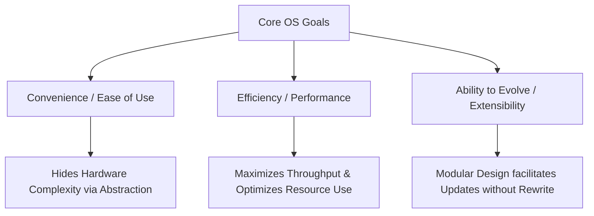
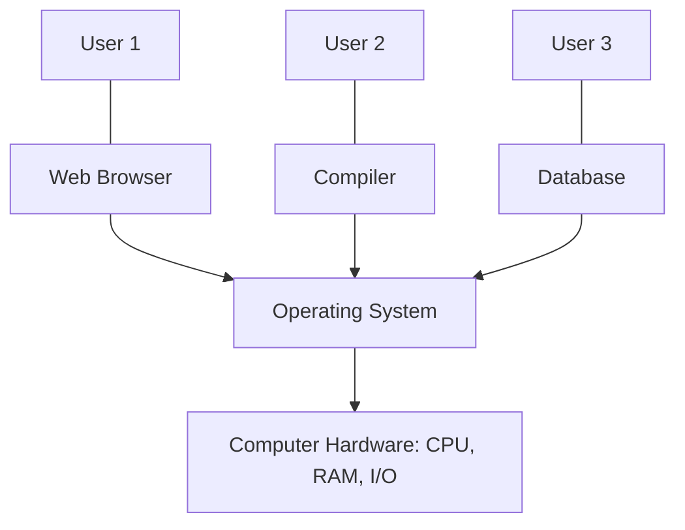

# Detailed Master's-Level Notes: Introduction to Operating Systems

---

## 1. Prerequisites & Context

To fully appreciate the role of an Operating System (OS), one must understand the fundamental **Von Neumann architecture**. A computer consists of a Central Processing Unit (CPU), memory (RAM), and Input/Output (I/O) devices. Without software, this hardware consists merely of electrical circuits. The OS acts as the primary software layer that transforms raw, complex hardware into a usable, programmable, and secure computing system.

---

## 2. What is an Operating System?

### 2.1 Definitive Definitions

An **Operating System (OS)** is a core system software program that manages a computer's hardware components and provides a clean, abstract environment for application programs to execute.

From an academic perspective:

* **Silberschatz & Galvin:** "An OS is a program that acts as an intermediary between a user of a computer and the computer hardware."
* **Tanenbaum (Modern Operating Systems):** "The OS is a resource manager that provides application programs with a clean, abstract view of the system’s resources and manages these resources efficiently and securely."

### 2.2 Conceptual & Technical Depth

The OS operates in a privileged hardware state called **Kernel Mode** (or Supervisor/Protected Mode). It abstracts the messy, low-level details of hardware registers, disk sectors, and interrupt lines, exposing instead high-level abstractions like **Files, Processes, Virtual Memory, and Sockets**.

### 2.3 The "Without an Operating System" Scenario

To understand why an OS is indispensable, consider a bare-metal machine without one:

* **Direct Hardware Manipulation:** A programmer would have to write explicit machine code to control the precise movement of the hard drive head, calculate disk sectors, and manipulate CPU registers manually.
* **Lack of Concurrency:** Only one program could run at a time. Multi-programming would be impossible because there would be no scheduler to multiplex the CPU.
* **No Security/Isolation:** A single program could accidentally or maliciously overwrite critical memory zones, damaging other data or crashing the physical hardware.
* **Inefficiency:** Every developer would have to write their own device drivers from scratch, leading to massive code duplication and fragmentation.

---

## 3. Classifications & Examples of Operating Systems

Operating systems are tailored to the environments they serve. Below is a structured taxonomy:

| OS Category | Key Characteristics | Prime Technical Examples |
| --- | --- | --- |
| **Desktop / General Purpose** | Optimized for user interaction, low latency, and multitasking. | Microsoft Windows, macOS, Linux (Ubuntu, Fedora) |
| **Mobile OS** | Optimized for power efficiency, touch interfaces, cellular connectivity, and restricted memory footprints. | Android (Linux-based), iOS (Darwin/XNU-based) |
| **Server OS** | Designed for high throughput, massive parallel processing, strict security, and network uptime. Minimal or absent GUI. | Red Hat Enterprise Linux (RHEL), Windows Server, FreeBSD |
| **Network OS (NOS)** | Embedded software running on routers and switches to route packets and manage network-specific protocols. | Cisco IOS, Juniper JunOS, Cumulus Linux |

---

## 4. Fundamental OS Goals

An operating system balances three primary goals. The priority of these goals shifts depending on whether the system is a workstation, a cloud server, or an embedded device.



### 1. Convenience (User Viewpoint)

The OS must make the computer convenient to use. It masks hardware intricacies through a **User Interface (UI)**—be it a Graphical User Interface (GUI), Command-Line Interface (CLI), or voice/touch controls.

### 2. Efficiency (System Viewpoint)

The OS must ensure that hardware resources are utilized optimally. It aims to maximize metrics like **CPU Utilization** and **Throughput**, while minimizing **Response Time** and **Turnaround Time**.

### 3. Ability to Evolve

An OS architecture must be built modularly (e.g., using layered designs or microkernels) so that developers can introduce new features, device drivers, and security patches without rewriting the core infrastructure.

---

## 5. Dual Roles: Resource Allocation & Hardware Efficiency

An OS can be structurally categorized by its two vital responsibilities: **Resource Allocator** and **Control Program**.

### 5.1 The OS as a Resource Allocator

A computer system contains various resources: CPU time, memory space, file-storage space, and I/O devices. The OS acts as a manager over these resources, adjudicating conflicting requests from multiple users and processes to ensure fair and optimal allocation.

* **Resource Sharing Paradigms:**
1. **Time Multiplexing (Temporal):** Resources are shared sequentially over time. The CPU is the classic example; different processes take turns utilizing the processor core under the direction of the scheduler.
2. **Space Multiplexing (Spatial):** Resources are divided geometrically or logically among competing entities simultaneously. Main memory (RAM) is split into distinct blocks so multiple programs can reside in memory at once.


### 5.2 Driving Hardware Efficiency

Without managed allocation, systems face bottlenecks or resource starvation. The OS prevents these inefficiencies through advanced architectural mechanics:

* **Spooling (Simultaneous Peripheral Operations On-Line):** Prevents slow I/O devices (like printers) from blocking high-speed CPU execution by intercepting data and placing it into a temporary disk buffer.
* **DMA (Direct Memory Access):** Offloads data transfer tasks from the CPU to a dedicated DMA controller, allowing the CPU to execute instructions while bulk data moves directly between I/O devices and memory.

---

## 6. Computer System Components & Architecture

A complete computer system can be divided logically into four primary components.

### 6.1 The Four Components

1. **Hardware:** Provides the basic computing resources (CPU, Memory, I/O devices).
2. **Operating System:** Controls and coordinates the use of hardware among various application programs.
3. **Application Programs:** Define the ways in which system resources are used to solve users' computing problems (Compilers, Databases, Web Browsers, Games).
4. **Users:** People, machines, or other computers attempting to solve specific problems.

### 6.2 Abstract View of System Components



---

## 7. The Core: Control Program, Kernel, and OS Architecture

### 7.1 The Control Program

As a **Control Program**, the OS manages the execution of user programs to prevent errors and improper use of the computer. It directly monitors the operations of I/O devices, handles hardware traps/exceptions, and enforces access control lists to safeguard system integrity.

### 7.2 The Kernel vs. The OS

It is a common misconception to use "Kernel" and "Operating System" interchangeably.

> **The Kernel:** The central core of the operating system. It is the single program running at all times on the computer (executing in **Kernel Mode** / Ring 0), directly interacting with physical hardware.

Everything else is either a **System Program** (ships with the OS but runs outside the kernel, e.g., command shells, file management utilities) or an **Application Program** (third-party software).

```
+--------------------------------------------------------+
|                  Application Programs                  |
+--------------------------------------------------------+
|     System Programs (Shells, Compilers, Daemons)       |  User Mode (Ring 3)
==========================[ System Call Interface ]=======
|  The Kernel (Scheduler, Memory Mgmt, VFS, Drivers)    |  Kernel Mode (Ring 0)
+--------------------------------------------------------+
|                     Physical Hardware                  |
+--------------------------------------------------------+

```

### 7.3 Primary Components of the OS Kernel

The modern kernel is composed of highly integrated subsystems:

1. **Process Manager:** Lifecycle control, context switching, and scheduling of threads/processes.
2. **Memory Manager:** Handles allocation, virtual-to-physical address translation (Paging/Segmentation), and swapping.
3. **Storage/File System Manager:** Implements logical structures on block devices (directories, file protection permissions).
4. **Device Driver Framework:** Translates abstract I/O requests into device-specific hardware commands.

---

## 8. Operating System Viewpoints

The design and function of an OS look remarkably different depending on where you stand.

### 8.1 User View (Convenience Focus)

The user cares about **ease of use**, **responsiveness**, and **performance**.

* On a PC, the OS is designed for a single user to maximize interaction, while resource utilization is secondary.
* On a mobile device, the user view prioritizes battery life, responsiveness, and seamless network handoffs.

### 8.2 System View (Resource Focus)

From the computer’s point of view, the OS is a deeply embedded mechanism focused entirely on metrics and control. It views the world as a stream of **interrupts**, **resource requests**, **process state transitions**, and **data packets**. It values stability, strict security boundaries, and high throughput over visual convenience.

---

## 9. Core Functions of the Operating System

A Master’s student must master the four foundational pillars of OS functionality.

### 9.1 Main Memory Management

Memory is a large array of bytes or words, each with its own address. It is the repository of quickly accessible data shared by the CPU and I/O devices.

* **Core Responsibilities:**
* Keeping track of which parts of memory are currently being used and by whom.
* Deciding which processes and data to move into and out of memory (Swapping/Paging).
* Allocating and deallocating memory space as dynamically requested by processes (`malloc()` / `free()`).


### 9.2 File Management

A file is a collection of related information defined by its creator. The OS abstracts the physical properties of storage storage devices to define a logical storage unit called a **File**.

* **Core Responsibilities:**
* Creating and deleting files and directories.
* Providing primitives to manipulate files and directories (read, write, open, close).
* Mapping files onto secondary storage media.
* Backing up files onto stable, non-volatile storage media.


### 9.3 I/O System Management

The I/O subsystem hides the peculiarities of specific hardware devices from the operating system kernel itself.

* **Core Components:**
* **A Memory Management Component:** Including buffering (storing data temporarily while it's being transferred), caching (holding copies of fast-access data), and spooling.
* **A General Device-Driver Interface:** Providing uniform system calls across various hardware devices.
* **Drivers:** Software components custom-built for specific hardware devices to translate abstract commands into electrical operations.


### 9.4 Secondary Storage Management

Because main memory is volatile and too small to accommodate all data and programs permanently, the computer system must provide secondary storage to back up main memory.

* **Core Responsibilities:**
* **Free-space management:** Keeping track of unallocated disk sectors.
* **Storage Allocation:** Ensuring files are written into blocks efficiently (e.g., Contiguous, Linked, or Indexed allocation like Inodes).
* **Disk Scheduling:** Deciding the order in which storage read/write requests are serviced to minimize seek time and disk head latency.


---

## 10. Summary

The Operating System is the ultimate abstraction engine of a computer system. It transforms raw hardware into an organized, secure environment by balancing its roles as a **Resource Allocator** (managing memory, CPU, and I/O) and a **Control Program** (preventing user errors and unauthorized access). The heart of the OS is the **Kernel**, operating in privileged mode, surrounded by system utilities and applications. Mastery of OS concepts requires looking beyond user-facing abstractions to understand how the system manages memory, processes, files, and hardware devices concurrently.

---

## 11. Exam Tips & High-Yield Points

* **Exam Tip 1 (The Dual Mode Transition):** Expect questions on how a system transitions from User Mode to Kernel Mode. Remember: **Hardware interrupts, software exceptions, and system calls** are the *only* mechanisms that switch execution from Ring 3 to Ring 0. The hardware switches the mode bit automatically when an interrupt vector is invoked.
* **Exam Tip 2 (Spatial vs. Temporal Multiplexing):** Be ready to classify OS resources. CPU scheduling is *time* multiplexing; Main Memory allocation is *space* multiplexing.
* **Exam Tip 3 (Kernel vs. OS):** If asked to define the difference, clearly state that the Kernel is the single program running at all times at the lowest hardware level, while the OS includes the kernel plus system programs, daemons, and shell interfaces.

---

## 12. Common Interview Questions

1. **What happens at the hardware and software level when a user program attempts to access memory outside its allocated space?**
* *Answer:* The hardware Memory Management Unit (MMU) detects a violation of the base/limit registers or page tables. It fires a hardware trap (page fault/segmentation fault exception). The CPU immediately switches to Kernel Mode and transfers control to the OS kernel trap handler, which typically terminates the offending process with a segmentation fault signal (e.g., `SIGSEGV` in Unix).


2. **Why can't a user program directly issue an I/O instruction to read a block from the hard disk?**
* *Answer:* Direct I/O modification is a privileged instruction reserved strictly for Kernel Mode to prevent user programs from bypassing security checks, corrupting file structures, or monopolizing hardware. A user program must invoke a system call (e.g., `read()`), transferring control to the kernel to perform the operation safely on its behalf.


3. **Explain the difference between a Monolithic Kernel and a Microkernel design philosophy.**
* *Answer:* A monolithic kernel runs *all* core OS services (file system, drivers, memory management, process scheduling) in a single large address space in Kernel Mode for maximum performance. A microkernel strips down the kernel to bare essentials (IPC, low-level memory mapping, scheduling) and runs other traditional services (like file systems and drivers) as user-space daemons, prioritizing stability, modularity, and security at the cost of message-passing overhead.
