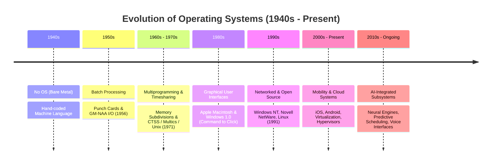
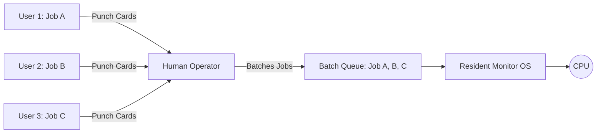
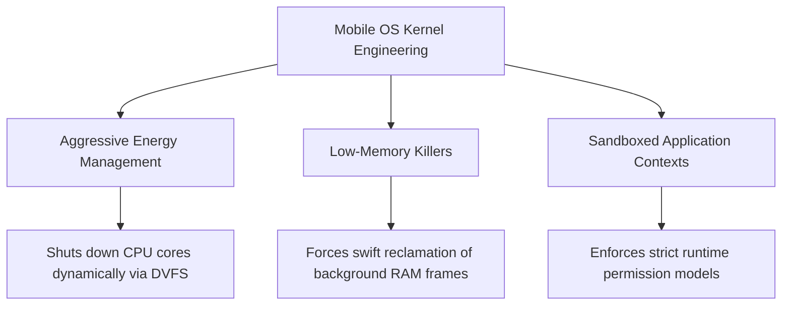

# Detailed Master's-Level Notes: The Evolution & History of Operating Systems

---

## 1. Prerequisites & The Core Analogy

To study the evolution of operating systems, we must analyze how hardware constraints dictated software abstractions. In computing, the OS acts as a **Resource Manager**, controlling components like memory, processes, storage, and I/O devices.

An academic analogy often used in textbooks (such as Silberschatz) compares the OS to a **Government**. A government does not produce anything of value on its own; rather, it creates a structured, secure framework within which citizens (user applications) can safely utilize resources (the underlying hardware infrastructure).

---

## 2. Chronological Generations vs. Technological Paradigms

The history of operating systems can be viewed through two parallel lenses: chronological timeframes (generations) and structural design paradigms. The transition from bare metal to distributed and AI-integrated cloud systems highlights a continuous effort to maximize **CPU Utilization** and improve user convenience.

### 2.1 The Timeline of Evolution



---

## 3. Deep-Dive into Technological OS Paradigms

### 3.1 The First Era: No OS (1940s) – The Bare-Metal Setup

In the earliest days of computing, hardware was completely devoid of software abstraction.

* **The Mechanics:** Users had exclusive access to the machine for a scheduled block of time. Programs were hardcoded directly onto paper tape or plugboards in machine language (binary/hexadecimal codes).
* **The Inefficiency:** There was no CPU scheduling or memory protection. If a program encountered a logic error or division-by-zero, the entire physical apparatus halted. The machine sat completely idle while the programmer manually traced memory registers.

```
[ Human Programmer ] ---> [ Hand-Coded Machine Language ] ---> [ Physical Circuits / Vacuum Tubes ]

```

---

### 3.2 The Second Era: Batch Processing Systems (1950s)

To eliminate the idle setup time between manual jobs, the concept of **Batch Processing** was introduced. The first true operational prototype was the **GM-NAA I/O**, developed in 1956 by General Motors for the IBM 704.

* **Internal Workings:** Programmers no longer interacted directly with the computer. They wrote programs on physical **punch cards** and submitted them to a human computer operator. The operator collected these decks, sorted them into batches with similar requirements (e.g., all Fortran jobs), and fed them as a continuous stream into a card reader managed by a simple piece of software called the **Resident Monitor**.



* **The Bottleneck:** The CPU remained deeply inefficient because of the huge speed disparity between mechanical I/O devices (card readers, printers) and electronic CPU execution. While reading a card, the CPU sat idle doing no useful work.

---

### 3.3 The Third Era: Multiprogramming Systems (1960s – 1970s)

Multiprogramming was a major milestone in operating system design, introducing concepts that remain central to modern kernels.

* **Internal Workings:** Instead of holding just one job, main memory (RAM) was divided into distinct partitions to hold **multiple active jobs simultaneously**. When the currently executing process had to wait for an external I/O device (a slow process), the operating system kernel intercepted this event, context-switched the CPU away from the waiting job, and handed control to another job waiting in the **Ready Queue**.

```
Monolithic Batch Memory Layout (1950s)
+------------------------------------------+
|  Resident Monitor (OS)                   |
+------------------------------------------+
|  User Job (CPU sits idle during I/O)     |
+------------------------------------------+

Multiprogramming Memory Layout (1960s)
+------------------------------------------+
|  Operating System Kernel                 |
+------------------------------------------+
|  Job 1 (Waiting for Disk I/O)            |  <-- CPU switches context to Job 2
+------------------------------------------+
|  Job 2 (Actively Executing on CPU)       |
+------------------------------------------+
|  Job 3 (Waiting in Ready Queue)          |
+------------------------------------------+

```

* **The Evolution into Timesharing:** Building directly on multiprogramming, **Timesharing (Multitasking)** systems—like the Compatible Time-Sharing System (CTSS, 1961) and Multics (1969)—introduced rapid CPU multiplexing. By using small time slices, the OS switched between processes so quickly that each user felt they had exclusive access to the machine. This era also saw the birth of **Unix (1971)**, which introduced clean architectural abstractions for processes, permissions, and files.

---

### 3.4 The Fourth Era: Personal Computers & The Introduction of GUI (1980s)

The miniaturization of silicon microprocessors led to the rise of **Personal Computers (PCs)**. Early consumer desktop OS architectures, like CP/M (1974) and PC-DOS/MS-DOS (1981), initially reverted back to single-user, single-tasking models to conserve limited memory footprints.

* **The UI Paradigm Shift:** The major innovation of this decade was the **Graphical User Interface (GUI)**, popularized by the Apple Macintosh (1984) and Microsoft Windows (1985).

```
[ Command Line Interface ] --- 'dir /a /p' ---> [ Text Output Shell ]
[ Graphical Interface ]    --- User Click  ---> [ Event Loop Handler ] ---> [ WIMP Element (Windows, Icons, Menus, Pointer) ]

```

* **Architectural Impact:** Transitioning from text-based interfaces to GUIs changed how operating systems managed execution paths. Instead of a straightforward linear command loop, the kernel had to support an **asynchronous, event-driven architecture** capable of constantly tracking pixel coordinate inputs, pointer positions, and redrawing windows in real time.

---

### 3.5 The Fifth Era: Networked Systems (1990s)

By the 1990s, connecting individual computers into local and wide-area networks became standard practice. Systems like Novell NetWare and **Windows NT** were designed specifically to handle network communication protocols directly within the kernel space.

* **Architectural Mechanics:** Operating systems integrated the **TCP/IP protocol stack** directly into their driver subsystems. Rather than viewing a machine as an isolated silo, the OS abstracted remote storage volumes and distributed file systems (like NFS or SMB), allowing users to access remote files over a network as if they were stored on local hardware. This decade also marked the launch of **Linux (1991)**, proving the viability of large-scale, open-source monolithic kernels.

---

### 3.6 The Modern Era: Mobile & Cloud Operating Systems (2000s – Present)

The mass adoption of smartphones brought about a major shift in design priorities. Modern mobile operating systems, such as **iOS** and **Android**, are highly specialized forks of robust desktop kernels (Darwin/XNU and Linux, respectively).

* **Resource Constrained Engineering:** Unlike mains-powered desktop systems, mobile operating systems must balance performance against strict hardware limits:



* **Cloud Systems:** Concurrently, server environments evolved to lean heavily on **Hypervisors** and virtualization technologies (like KVM and ESXi), allowing multiple virtual operating systems to run isolated on a single physical host.

---

### 3.7 The Horizon: Embedded AI Subsystem Integration (Ongoing)

Modern operating systems are increasingly integrating Artificial Intelligence architectures directly into their kernel frameworks and system daemons.

* **Technical Implementation:** This goes beyond simple user-facing voice software (like Siri, Google Assistant, or Alexa). At the engineering layer, modern OS kernels use machine learning models to handle low-level optimization tasks, such as **predictive thread scheduling**, proactive virtual memory page pre-fetching, and intelligent power management profiles based on user behavior patterns.

---

## 4. Comprehensive Architectural Evaluation

To understand why different OS styles persist, we can evaluate their high-level operational trade-offs.

### 4.1 Advantages vs. Disadvantages of Modern OS Architectures

| Core Advantages | Core Disadvantages / Architectural Risks |
| --- | --- |
| **Hardware Abstraction & Interactivity:** Provides standard system call interfaces and device drivers so applications can use varied hardware seamlessly. | **Single Point of Failure:** Critical kernel bugs or hardware exceptions can crash the entire system, risking data loss unless proper backups are in place. |
| **Concurrency Management:** Supports true multitasking and parallel processing through advanced CPU scheduling and thread allocation. | **Malware Vulnerability:** Operating systems are high-value targets for security exploits, rootkits, and viruses that aim to compromise privileged rings. |
| **Resource Optimization:** Manages access to physical memory, storage layouts, and I/O routing to maximize efficiency across programs. | **Resource Consumption:** The operating system itself consumes CPU cycles, RAM, and storage space, creating performance overhead for user apps. |
| **File and System Protection:** Isolates process memory zones and enforces access control permissions to keep users and data safe. | **Maintenance & Learning Curve:** Requires ongoing updates, security patching, and configuration maintenance. Drastic switches (like Windows to Linux) require significant retraining. |

---

## 5. Summary Note

The evolution of operating systems shows a shift from managing raw machine hardware to creating highly abstract, distributed, and intelligent environments. It is important to remember that **older design models have not disappeared**.

* High-speed financial trade platforms still run customized forms of real-time batch processing.
* Industrial assembly lines rely on basic, non-GUI embedded systems.
* Modern multi-user supercomputers are built directly on structural patterns established by the multiprogramming and timesharing breakthroughs of the 1970s.

---

## 6. Exam Tips & High-Yield Points

> ### 🧠 Exam Tip 1: The Core Mechanism of Multiprogramming
> 
> 
> When answering exam questions about **Multiprogramming**, focus on **CPU Utilization**. Define it clearly as the phase where the OS ensures the CPU doesn't sit idle during slow I/O operations. Be sure to note that the system relies on physical main memory partition structures to hold multiple active processes at once.

> ### 🧠 Exam Tip 2: The Evolution of Interaction
> 
> 
> Be prepared to compare Command Line Interfaces (CLIs) with Graphical User Interfaces (GUIs). Emphasize that the transition to GUIs was not just a cosmetic change; it required a fundamental shift in kernel design from a synchronous, sequential text loop to an **asynchronous, event-driven subsystem architecture**.

---

## 7. Common Interview Questions

### 1. Why couldn't true multiprogramming exist in early 1950s batch processing systems?

* **Answer:** Early batch processing relied on a simple Resident Monitor that could only hold a single job in memory at any given time. Because there was no memory segmentation or hardware-enforced protection boundaries to isolate multiple programs simultaneously, the system could not switch to another task when a job hit an I/O bottleneck. As a result, the CPU was forced to sit idle.

### 2. How does a modern mobile operating system's approach to memory allocation differ from a traditional desktop operating system when memory pressure gets too high?

* **Answer:** When free RAM is exhausted, a traditional desktop operating system writes inactive memory pages out to secondary storage via disk swapping. In contrast, a mobile operating system typically avoids aggressive swap operations to extend flash storage lifespans and save battery. Instead, it uses a specialized **Low-Memory Killer (LMK)** daemon. This system monitors process priority hierarchies and forcefully terminates inactive background applications to immediately reclaim physical memory frames for the active foreground process.

### 3. From an OS architecture perspective, what is the operational benefit of moving the TCP/IP network protocol stack inside the kernel space (as seen in modern networked systems) versus running it as an application-space utility?

* **Answer:** Running the network protocol stack inside kernel space lets the system process network packets without requiring data to pass through the user-kernel boundary during network operations. If the stack ran in user space, every incoming network packet would trigger multiple context switches and memory copy operations across privilege boundaries to move data from the network interface card driver to the user utility, and finally to the destination application. Moving the stack into the kernel minimizes context-switch overhead and improves system throughput.