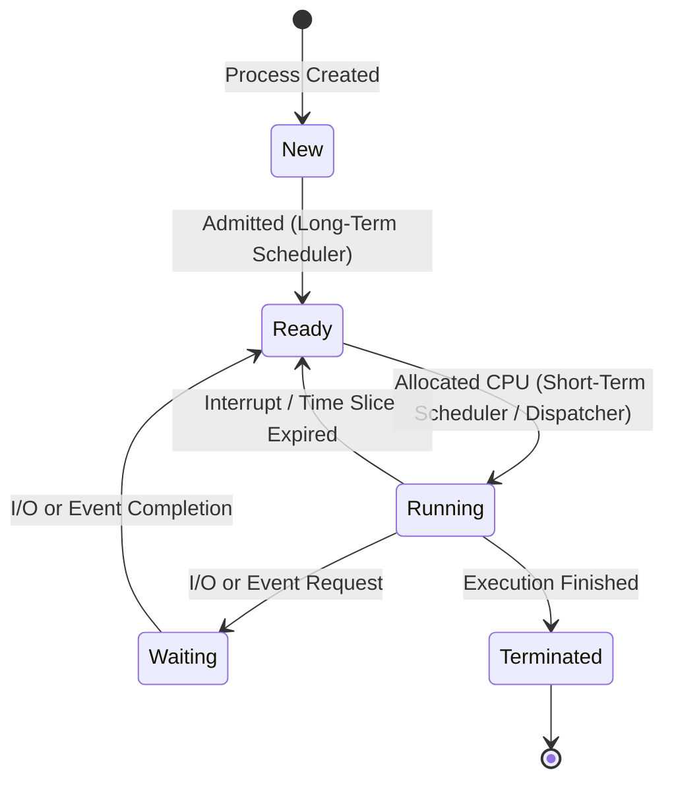
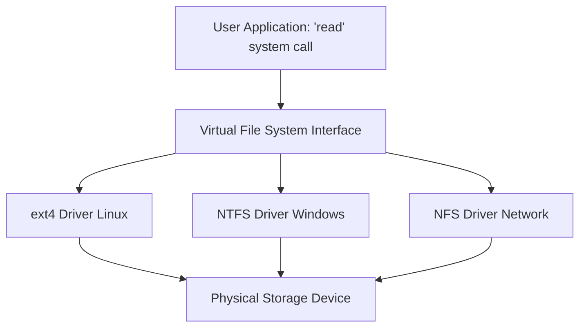
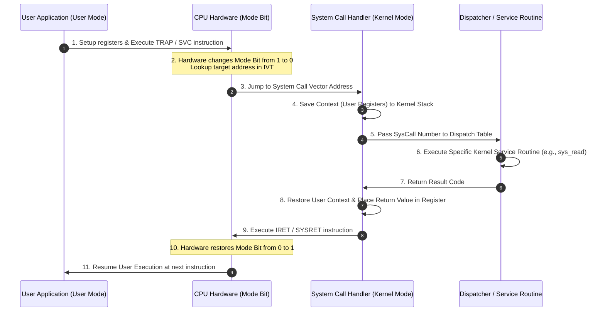
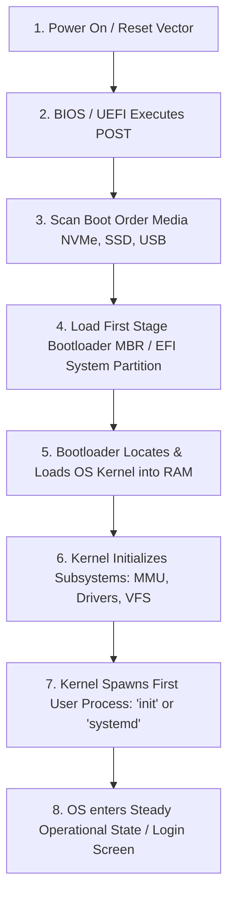

# Detailed Master's-Level Notes: OS Architectures, Management Subsystems, & Execution Dynamics

---

## 1. Prerequisites & Context

Before diving into OS structural design and runtime mechanics, it is essential to understand the concepts of **Execution Privileges (Privilege Rings)** and **Asynchronous Hardware Events**. Modern microprocessors enforce security boundaries using hardware-level operational modes (e.g., Ring 0 for Supervisor/Kernel mode and Ring 3 for User mode). The transition between these domains, coupled with the concept of **Interrupt-driven execution**, underpins how an operating system architecture coordinates hardware resources safely while serving user requests.

---

## 2. Primary Architectural Designs of an Operating System

An operating system’s architecture dictates how its core subsystems—such as the scheduler, memory manager, file systems, and device drivers—interact with one another and with the underlying hardware.

### 2.1 Monolithic Architecture

In a monolithic design, the entire operating system runs as a single, large program in a single address space within **Kernel Mode (Ring 0)**. All subsystems are bundled together; any function can call any other function directly without major communication overhead.

* **Internal Workings:** Components communicate via highly efficient, direct local function calls rather than formal message passing.
* **Examples:** Linux, MS-DOS, traditional Unix, FreeBSD.

#### Pros & Cons of Monolithic Architecture

* **Pros:**
* **Peak Performance:** Minimal execution overhead. There is no need for message passing or context switching when subsystems communicate.
* **Direct Resource Access:** Subsystems have immediate, uninhibited access to hardware registers and memory.


* **Cons:**
* **Fault Intolerance:** A single bug or null-pointer dereference in a minor device driver can corrupt kernel memory, resulting in a total system crash (**Kernel Panic** or **Blue Screen of Death**).
* **Poor Maintainability:** The codebase can become tightly coupled, making it highly complex to modify, scale, or debug.


---

### 2.2 Microkernel Architecture

The microkernel philosophy strips the kernel down to its bare essentials. Only the absolute minimum necessary to manage a system remains in Kernel Mode: primitive memory management, basic thread scheduling, and **Inter-Process Communication (IPC)**. All other traditional OS services (File Systems, Networking, Device Drivers) are moved out of Ring 0 and run as modular, isolated servers in **User Mode (Ring 3)**.

```
+-------------------------------------------------------------------------+
|  User Space (Ring 3)                                                    |
|  [App/Client] ------> [File Server] ------> [Network] ------> [Drivers] |
|        ^                     ^                                          |
|        +-----(via IPC)-------+                                          |
+-------------------------------------------------------------------------+
=============================[ Kernel Boundary ]===========================
+-------------------------------------------------------------------------+
|  Kernel Space (Ring 0)                                                  |
|  [ IPC ] <-----------------> [ Basic Scheduling ] <---> [ Primitive VM ]|
+-------------------------------------------------------------------------+

```

* **Internal Workings:** When an application needs to read a file, it does not execute a traditional monolithic system call. Instead, it sends an explicit IPC message to the User-Mode *File Server*. The Microkernel acts as an intermediary switchboard, passing the message from the client process to the server process, and then returning the result.
* **Examples:** Mach (basis of macOS/iOS core), QNX (real-time OS), Minix 3, L4.

#### Pros & Cons of Microkernel Architecture

* **Pros:**
* **High Reliability & Fault Isolation:** If the File Server or a graphic driver crashes, it does not bring down the entire system. The microkernel can safely restart that isolated user-space daemon without interrupting other tasks.
* **Extensibility & Security:** New services can be added simply by running a normal user program. The attack surface within Ring 0 is minimal.


* **Cons:**
* **Performance Overhead:** The constant switching between User Mode and Kernel Mode to facilitate IPC messages (Context Switch Overhead) creates substantial performance bottlenecks compared to monolithic designs.


---

### 2.3 Hybrid Architecture

Realizing that pure microkernels can suffer from performance penalties, modern mainstream operating systems employ a **Hybrid Architecture**. They combine the structural modularity of a microkernel with the raw performance benefits of a monolithic kernel.

* **Internal Workings:** The core architecture looks like a microkernel (highly modular, distinct component boundaries), but critical, performance-sensitive services (like the Graphics subsystem and Network stack) are pulled back inside the **Kernel Mode address space** to bypass the IPC performance penalty.
* **Examples:** Windows NT architecture (Windows 10, 11, Windows Server), macOS/iOS (XNU kernel, combining Mach microkernel elements with FreeBSD monolithic structures).

#### Pros & Cons of Hybrid Architecture

* **Pros:**
* **Balanced Design:** Achieves much of the speed of a monolithic kernel while maintaining a clean, modular abstraction layer internally.
* **Dynamic Loading:** Supports dynamically loadable kernel modules (LKMs), allowing drivers to enter kernel space only when needed.


* **Cons:**
* **Architectural Complexity:** Managing the boundary lines between what runs in user space versus kernel space makes development exceptionally complex.
* **Compromised Isolation:** Because large components (like graphics drivers in Windows) run in Ring 0, a critical failure within them can still cause a complete system crash.


---

## 3. Core Subsystem Management

### 3.1 Process & CPU Management

A **Process** is an active instance of a program in execution, containing the program code, its current activity (tracked by the Program Counter), stack, heap, and register states.

* **The CPU Scheduler:** The kernel manages multiple processes via time-multiplexing. It cycles processes through distinct execution states based on a state machine diagram:



* **Context Switching:** When swapping from Process $A$ to Process $B$, the kernel must halt execution, save the hardware register states of $A$ into its **Process Control Block (PCB)**, load the saved register states from the PCB of $B$, and point the Program Counter to $B$'s next instruction.

### 3.2 Memory Management

The memory management subsystem abstracts the limited physical RAM of a machine into a large, contiguous array of addresses available to each independent process.

* **Virtual Memory & Paging:** Modern operating systems break a process's virtual address space into uniform blocks called **Pages**, and physical RAM into blocks called **Frames**.
* **The MMU & Page Tables:** The hardware Memory Management Unit (MMU) uses an OS-maintained **Page Table** to translate virtual memory addresses generated by the CPU into physical RAM addresses on the fly. This ensures that Process $A$ cannot view or overwrite the memory frame belonging to Process $B$.

### 3.3 File System, Storage, & The Virtual File System (VFS)

Operating systems must support diverse storage devices (NVMe SSDs, mechanical HDDs, USB flash drives) and varied file layouts (NTFS, ext4, FAT32). To avoid hardcoding every file operation for every layout, the OS introduces an abstraction layer: the **Virtual File System (VFS)**.



* **How VFS Works:** The VFS defines a standard, object-oriented system contract containing uniform structural interfaces (such as `inode`, `file`, `superblock`, and `dentry`). When an application calls `read()`, the VFS translates this generic call into the specific function pointer implemented by the target underlying filesystem driver (e.g., `ext4_read_file`).

---

## 4. Execution Dynamics: How the OS Works

The lifecycle of an operation executing through an OS can be modeled as a strict, synchronous loop bridging User Space and Kernel Space via **System Calls**.

### 4.1 Step-by-Step Runtime Execution Flow



### 4.2 Deconstructing the Phases

1. **The System Call Initiation:** The user application cannot access hardware functions directly. It sets up parameters in pre-designated CPU hardware registers (identifying the specific task, like opening a file) and executes a special hardware instruction: a **Trap**, **Supervisor Call (SVC)**, or `SYSCALL`.
2. **The Hardware Mode Switch:** The CPU catches this instruction, safely changes the hardware mode bit from User Mode (1) to Kernel Mode (0), reads the **Interrupt Vector Table (IVT)** at a fixed hardware address, and jumps directly to the designated Kernel System Call Handler.
3. **The Dispatcher Execution:** The System Call Handler saves the user registers onto the process's kernel stack. It reads the system call ID number and indexes into the kernel's internal **System Call Dispatch Table** (an array of function pointers). The **Dispatcher** then invokes the precise internal function (e.g., `sys_write()`).
4. **The Safe Return:** Once the kernel finishes the work, the handler stores the operation's return code in a user-accessible register (e.g., `rax` in x86-64), cleans up the kernel stack, and executes an explicit privilege-lowering instruction like `IRET` or `SYSRET`. This resets the CPU mode bit back to User Mode (1) and hands control back to the application.

---

## 5. The Boot-Up Sequence (Bootstrapping)

When electrical power is applied to a computer system, the volatile RAM is empty, and the CPU has no operating system in memory to run. The process of bringing the system to an operational state is known as **Bootstrapping**.

### 5.1 Primary Responsibilities of the Boot Process

* Initialize, test, and configure core physical hardware components.
* Locate and read the initial execution instructions of the operating system from a non-volatile storage target.
* Set up foundational kernel structures (Page Tables, Global Descriptor Tables, Interrupt Vectors).
* Launch the first persistent user-space process to hand control over to the user.

### 5.2 Step-by-Step Boot Flowchart



### 5.3 Technical Breakdown of Boot Stages

1. **Power-On & The Reset Vector:** The power supply stabilizes and sends an electrical signal to the CPU. The CPU wakes up in a specialized hardware state (Real Mode in x86) and targets a single hardcoded memory address known as the **Reset Vector** (typically `0xFFFFFFF0`), where the motherboard's non-volatile flash firmware resides.
2. **POST (Power-On Self-Test):** The motherboard firmware—**BIOS** (Basic Input/Output System) or modern **UEFI** (Unified Extensible Firmware Interface)—runs diagnostic sweeps. It tests the system RAM integrity, inventories PCI buses, and initializes basic graphics controllers.
3. **Locating the Bootloader:** * *In legacy systems:* The BIOS reads the absolute first sector (512 bytes) of the primary bootable drive, known as the **Master Boot Record (MBR)**.
* *In modern systems:* The UEFI reads the storage partition tables (GPT) to find a dedicated FAT32-formatted drive partition named the **EFI System Partition (ESP)**.


4. **Bootloader Execution:** The small first-stage bootloader program (e.g., GRUB, Windows Boot Manager) is loaded into RAM and executed. Because it understands specific storage filesystems, it locates the main, compressed operating system kernel image (e.g., `vmlinuz`) on the disk, decompresses it, moves it into system memory, and hands execution control to the kernel.
5. **Kernel Initialization & Spawning Init:** The OS kernel initializes its multi-threaded management subsystems (such as setting up the MMU page tables and configuring device drivers). Finally, the kernel mounts the root filesystem (`/`) via the VFS and spawns the absolute first user-space process, traditionally designated as PID 1 (**`init`** or **`systemd`** on Unix/Linux, **`smss.exe`** on Windows). PID 1 runs background daemons, starts graphical login screens, and initiates steady-state operation.

---

## 6. Exam Tips & High-Yield Points

> ### 🧠 Exam Tip 1: Microkernel Performance Overhead
> 
> 
> If an exam question asks *why* microkernels are slower, focus your answer on the **double context switch**. A single user request requires switching from the Client App to the Kernel (Switch 1), Kernel to the File Server (Switch 2), File Server back to the Kernel (Switch 3), and Kernel back to the Client App (Switch 4). This message-passing architecture incurs a heavy performance penalty compared to a monolithic system's local function call.

> ### 🧠 Exam Tip 2: The Core Mechanism of the Trap
> 
> 
> Remember that a user-space application *cannot* jump directly to kernel source code addresses. Doing so triggers an instant segmentation violation. The app must execute a `TRAP` instruction, which forces the *hardware* to reference the preset Interrupt Vector Table (IVT) to find safe entry points managed exclusively by the OS.

---

## 7. Common Interview Questions

### 1. What is the fundamental difference between how a Monolithic OS and a Microkernel OS handle a catastrophic failure in a network device driver?

* **Answer:** In a Monolithic OS, because the network driver executes directly in Kernel Mode (Ring 0) and shares the same memory space as the rest of the kernel, a severe crash or memory corruption within the driver triggers a total system failure (Kernel Panic). In a Microkernel OS, the network driver runs as an isolated user-space daemon in Ring 3. If it experiences a critical failure, it terminates cleanly as an isolated process without affecting kernel space. The microkernel can detect the failure and simply restart the network daemon seamlessly.

### 2. During the system call process, what role does the Dispatch Table play, and why is it necessary for security?

* **Answer:** The Dispatch Table is an internal array of function pointers stored in secure kernel memory that maps system call identification numbers to their corresponding kernel service routines. It is crucial for security because it prevents user applications from passing arbitrary execution addresses to the kernel. By enforcing a strict lookup using indexing integers, the application can only execute predefined, validated, and secure entry points within the kernel.

### 3. Explain why the Virtual File System (VFS) layer is considered an object-oriented design pattern inside a procedural C-based kernel.

* **Answer:** The VFS acts as an abstract polymorphic interface layer. It defines generic structured models—like `struct file_operations`—which contain lists of abstract function pointers for operations such as `read`, `write`, and `open`. Each concrete filesystem implementation (like ext4, NTFS, or NFS) defines its own specific functions and binds them to these pointers at runtime. This allows the core operating system kernel to interact with completely different underlying storage paradigms using a single, unified interface.