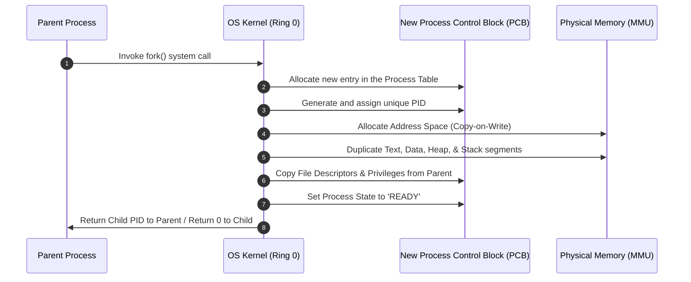
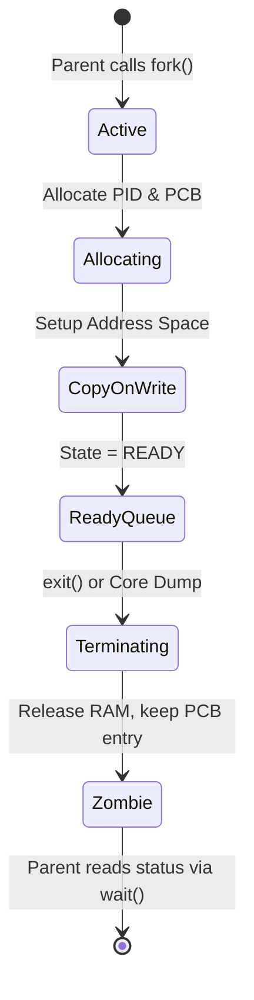
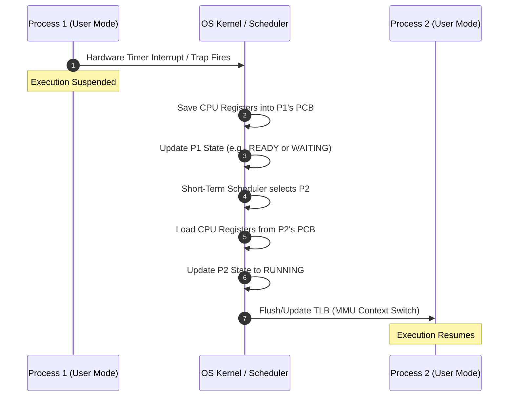

# Detailed Master's-Level Notes: OS Services & Core Process Management

---

## 1. Prerequisites & Foundational Context

To master process management, one must firmly distinguish between a **Program** and a **Process**. A program is a passive entity stored on disk (an executable file containing machine instructions), while a process is an active entity executing in main memory, possessing an assigned address space, thread context, and allocated hardware resources.

Process management is the kernel subsystem that transforms static binaries into concurrent runtime executions while enforcing isolation and security boundaries.

---

## 2. OS as a Service (OSaaS) & Modern Paradigm Shifts

### 2.1 Definitive Definition

Historically, an operating system was viewed strictly as local software bound to physical hardware. In modern cloud-native architectures, **OS as a Service (OSaaS)** abstracts the operating system layer completely from the user and the developer. The underlying kernel, resource manager, and device driver subsystems are managed by a cloud provider, exposing programmatic runtime environments or containerized microkernels via APIs.

### 2.2 Core Characteristics & Architectural Deployment

* **Containerization & Micro-Kernels:** Leveraging features like Linux namespaces and control groups (`cgroups`), multiple isolated user-space instances share a single underlying host kernel.
* **Serverless Computing:** The OS scales from zero to thousands of execution instances dynamically based on incoming event triggers.
* **Virtualization Overheads:** Rather than interacting directly with Bare-Metal hardware, the guest OS interfaces with a **Hypervisor (VMM - Virtual Machine Monitor)** via para-virtualized drivers.

---

## 3. Concurrency Evolution: Single-Tasking vs. Multitasking Systems

### 3.1 Single-Tasking Systems

Early computing architectures allowed only a single process to occupy the executable memory space at any given time.

* **Internal Working:** The CPU loads the program into a single continuous memory block. The program retains exclusive control over all registers and peripherals. No other task can execute until the running process explicitly calls the exit routine and terminates.
* **Limitation:** Massive CPU starvation during I/O operations.

### 3.2 Multitasking Systems

Multitasking delivers the illusion of concurrent execution on a single processor core by rapidly switching the execution path among multiple active processes.

* **Internal Working:** The operating system splits physical RAM into separate memory regions for different processes. The **Short-Term Scheduler** uses a hardware timer interrupt to regularly preempt the running process and switch the CPU context to another process.

---

## 4. Process Classification: CPU-Bound vs. I/O-Bound Processes

Processes exhibit varying demands on hardware subcomponents, dictating scheduling policies and throughput optimizations.

```
CPU-Bound Process Cycle:
+------------------------+      +------------------------+
|   Long CPU Burst       | ---> | Short I/O Wait Phase   |
+------------------------+      +------------------------+

I/O-Bound Process Cycle:
+------------------------+      +------------------------+
| Short CPU Burst        | ---> |  Long I/O Wait Phase   |
+------------------------+      +------------------------+

```

### 4.1 CPU-Bound Processes

* **Definition:** A process that spends the vast majority of its lifecycle executing mathematical computation, data processing, or algorithmic loops on the processor.
* **Characteristics:** Long CPU bursts, highly infrequent I/O requests.
* **Examples:** Video rendering codecs, scientific simulations, cryptographic matrix transformations, training deep learning neural networks.

### 4.2 I/O-Bound Processes

* **Definition:** A process that spends most of its runtime waiting for input/output operations to complete.
* **Characteristics:** Short CPU bursts followed by long wait periods for disk reads, network packets, or user inputs.
* **Examples:** Web servers, database management systems, text editors, file transfer tools.

---

## 5. Architectural Lifecycle: Process Creation & Deletion

### 5.1 In-Depth Steps for Process Creation

When a parent process generates a child process (e.g., using the `fork()` and `exec()` system calls in POSIX systems), the kernel performs a highly coordinated set of memory and data structure allocations.



1. **Identifier Allocation:** The kernel scans its internal process table to allocate a new unique **Process Identifier (PID)**.
2. **PCB Construction:** The kernel builds a new **Process Control Block (PCB)** to store state variables, scheduling priority, and architectural registers.
3. **Address Space Allocation:** The kernel maps an address space for the child. In optimized systems, this uses **Copy-on-Write (COW)**, sharing the parent’s physical memory frames until either process modifies data.
4. **Resource Copying:** The child inherits security tokens, environment variables, and open file descriptors from its parent.
5. **State Initialization:** The process state is set to `READY`, and the PCB is linked into the scheduler's ready queue.

### 5.2 Process Deletion (Termination)

A process terminates when it finishes its final statement and calls the `exit()` system call, or when the kernel forces its termination due to an unhandled exception (e.g., segmentation fault).

* **The Zombie State:** When a child terminates, its physical memory is reclaimed, but its basic entry remains in the kernel process table so the parent can read its exit status code. A process in this state is a **Zombie Process**.
* **The Orphan State:** If a parent process terminates before its child, the child becomes an **Orphan Process**. The init/systemd process (PID 1) automatically adopts orphan processes and collects their exit codes when they finish.



---

## 6. Runtime Dynamics: Context Switching

### 6.1 Core Mechanical Process

A **Context Switch** is the core operational routine that stops execution of an active process, saves its hardware state, and loads the saved state of a new process to resume execution.



### 6.2 The Hidden Costs of Context Switching

Context switches are pure overhead; the CPU cannot do useful work while executing the switch routine.

* **Direct Costs:** Saving and restoring CPU hardware registers, updating page table pointers.
* **Indirect Costs (The Cache Cold Problem):** Changing the address space invalidates the Translation Lookaside Buffer (TLB) and evicts data from L1/L2/L3 hardware caches. The newly scheduled process executes slowly at first as it experiences cache misses and reloads its data from physical RAM.

---

## 7. The Three Core Management Subsystems

### 7.1 CPU Scheduling Subsystem

The **Short-Term Scheduler (CPU Scheduler)** selects a process from the ready queue and allocates a CPU core to it. The system uses specific scheduling policies to optimize for different goals:

* **Non-Preemptive:** A running process keeps control of the CPU until it terminates or voluntarily blocks for I/O (e.g., First-Come First-Served).
* **Preemptive:** The kernel can interrupt and suspend a healthy running process at any time to give the CPU to a higher-priority task (e.g., Round Robin, Multi-Level Feedback Queues).

### 7.2 Inter-Process Communication (IPC) Subsystem

Processes running concurrently in the operating system must be isolated from each other to ensure security. However, they often need to pass data and coordinate with one another using specific **IPC Mechanisms**:

| IPC Mechanism | Architectural Model | Kernel Involvement | Performance Profile |
| --- | --- | --- | --- |
| **Shared Memory** | Direct mapping of the same physical memory frame into multiple process page tables. | Low (only during initial setup) | Extremely Fast (Direct memory read/write) |
| **Message Passing** | System utilities handle data copying through bounded kernel buffers (`msgsnd`, `msgrcv`). | High (Every transaction requires system calls) | Slower due to context switches |
| **Pipes / Sockets** | Byte-stream communication pathways spanning processes or network interfaces. | High | Moderate (requires data serialization) |

### 7.3 Process Synchronization Subsystem

When multiple processes share data concurrently, they can fall victim to a **Race Condition**—where the final data value depends on the exact order and timing of execution. To prevent this, the synchronization subsystem enforces **Mutual Exclusion** over the **Critical Section** (the code block that modifies shared resources).

* **Primitives:**
* **Mutex:** A simple locking mechanism that allows only one thread or process to hold the lock at a time.
* **Semaphores:** An integer-based synchronization variable managed using two atomic, thread-safe operations: `wait()` ($P$) and `signal()` ($V$).


### 7.4 Deadlock Handling Subsystem

When processes use synchronization primitives, they run the risk of a **Deadlock**—a system state where two or more processes are permanently blocked because each is holding a resource and waiting for another resource held by another process.

* **The Four Coffman Conditions (All must hold simultaneously for a deadlock to occur):**
1. **Mutual Exclusion:** Only one process can use a resource at a time.
2. **Hold and Wait:** A process holding allocated resources can request additional resources without giving up its current ones.
3. **No Preemption:** Resources cannot be forcibly taken from a process; they must be released voluntarily.
4. **Circular Wait:** A closed chain of processes exists where each process waits for a resource held by the next process in the chain.


---

## 8. Exam Tips & High-Yield Points

> ### 🧠 Exam Tip 1: The Zero-Return Ambiguity of `fork()`
> 
> 
> Expect a question tracing execution loops that include the `fork()` system call. Remember that `fork()` returns twice on success: it returns the **child's PID** to the parent process, and returns **exactly 0** inside the newly created child process. Trace conditional blocks carefully using this return distinction.

> ### 🧠 Exam Tip 2: Distinguishing Mutexes from Counting Semaphores
> 
> 
> Do not define a Mutex simply as a binary semaphore. While both enforce mutual exclusion, a **Mutex has a strict concept of ownership**: only the exact execution thread that acquired the Mutex can release it. A **Semaphore has no ownership properties**; any thread or interrupt handler can fire a `signal()` operation to increment a semaphore variable.

---

## 9. Common Interview Questions

### 1. Why does a context switch between two threads in the same process have lower overhead than a context switch between two entirely separate processes?

* **Answer:** Threads belonging to the same process share the same virtual address space, memory page tables, and file descriptors. During a thread context switch, the kernel only needs to swap out CPU hardware registers, the stack pointer, and the program counter. It does not need to change the active page tables or flush the hardware **Translation Lookaside Buffer (TLB)**. A process context switch, however, requires a full memory layout swap, invalidating the TLB cache and causing a significant performance drop as the new process reloads data.

### 2. What is a "Zombie Process," how does it form, and what problem occurs if a system accumulates too many of them?

* **Answer:** A zombie process forms when a child process completes execution and calls `exit()`, but its parent has not yet read its exit status using the `wait()` system call. The kernel reclaims the child's physical memory frames but keeps its basic entry in the internal process table. If a parent process runs a long time and fails to call `wait()`, these entries persist. Accumulating too many zombies can exhaust the kernel's fixed **PID space**, preventing the operating system from creating any new processes.

### 3. How does a Multi-Level Feedback Queue (MLFQ) scheduler distinguish between CPU-bound and I/O-bound processes without any advance knowledge of their behavior?

* **Answer:** The MLFQ scheduler analyzes process behavior dynamically over time by monitoring how it uses its allocated time slice. The scheduler maintains multiple ready queues, each with a different priority level and time slice length. When a new process arrives, it is placed in the highest-priority queue. If the process uses up its entire time slice without blocking, the scheduler classifies it as **CPU-bound** and moves it down a priority level. If the process yields the CPU early to wait for an I/O operation, the scheduler classifies it as **I/O-bound** and leaves it at a high priority level, ensuring responsive user-facing tasks.