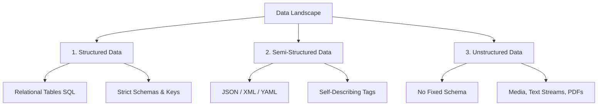
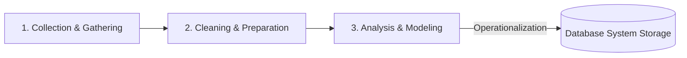
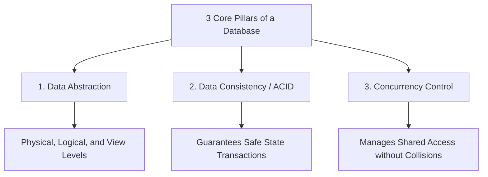

## 1. Prerequisites & Foundational Context

To understand modern Relational Database Management Systems (RDBMS), one must trace how computing paradigms shifted away from manual, physical data records. At its core, a database is an automated solution to the challenges of scaling data storage, retrieval speed, and concurrent data modification. Before diving into SQL syntax or indexing structures, we must establish a clear foundation in data theory and understand the structural limitations of early data storage systems.

---

## 2. Defining the Core: Data and Metadata

### 2.1 What is Data?

From an engineering perspective, **Data** is a formalized representation of facts, concepts, or instructions in a manner suitable for communication, interpretation, or processing by humans or automated systems. Data on its own is passive and lacks context; it becomes **Information** only when it is structured, processed, and evaluated within a meaningful framework.

### 2.2 Classifications & Types of Data

Modern systems classify data based on its structural layout, which dictates how the data can be stored and indexed:



* **Structured Data:** Highly organized information that follows a strict schema, traditionally mapped out into rows and columns (e.g., relational database tables).
* **Semi-Structured Data:** Does not conform to a rigid relational schema but contains internal markers, tags, or hierarchies to separate data elements (e.g., JSON documents, XML sheets, NoSQL key-value pairs).
* **Unstructured Data:** Information that lacks a predefined conceptual structure or data model (e.g., raw video streams, audio files, satellite imagery, unstructured PDF manuals).

### 2.3 What is Metadata?

> **Metadata** is formally defined as *data about data*. It provides the necessary context to interpret, govern, and manage raw underlying information.

Inside a relational database, metadata is stored in a centralized, protected region known as the **Data Dictionary** or **System Catalog**.

```sql
-- Conceptual Example: Querying Postgres System Metadata Catalog
SELECT column_name, data_type, is_nullable 
FROM information_schema.columns 
WHERE table_name = 'users';

```

The query above does not return user records; instead, it retrieves metadata describing the structural definitions of the table itself.

---

## 3. The Data Journey (Lifecycle Pipeline)

Data moves through a continuous lifecycle pipeline, converting raw external events into clean, actionable system states.



### 3.1 Collection and Gathering

Capturing raw signals from various edge sources (e.g., IoT sensor telemetry, application logs, web clickstreams, manual user forms) and funneling them into ingest queues.

### 3.2 Cleaning and Preparation (ETL Pipeline)

Raw data is inherently noisy and error-prone. This phase parses data structures, resolves missing values, eliminates duplicate records, validates data types, and reformats schemas into uniform structures suitable for the destination system.

### 3.3 Analysis and Modeling

Applying analytical logic, statistical functions, and indexing strategies to uncover relationships within the data, transforming information into actionable insights and operational data models.

---

## 4. Systems Architecture: Data Organization

### 4.1 The Traditional Data Hierarchy

To store data on non-volatile block storage devices (like SSDs and HDDs), operating systems and database engines organize data into a clear hierarchy:

```
[ Database Volume ]
       └── [ Table Files / Extents ]
                 └── [ Blocks / Pages ] (Typically 4KB - 8KB physical allocation units)
                           └── [ Records / Rows ]
                                     └── [ Fields / Attributes ]
                                               └── [ Bytes / Bits ]

```

### 4.2 Logical vs. Physical Data Organization

A critical challenge in database design is separating how a programmer interacts with data from how that data is physically written to storage hardware.

* **Logical Data Organization:** The user or developer’s conceptual view of the data. This includes structural elements like entity relationships, tables, columns, constraints, and views.
* **Physical Data Organization:** The low-level, hardware-facing view of the data. This involves how bits are arranged on non-volatile media, covering concepts like file system partitions, sector spacing, b-tree page storage, clustering indices, and write buffers.

---

## 5. The "Pre-Database" Problem: File-Based Systems

Before database management systems emerged, applications stored their data inside separate flat files managed directly by the operating system file infrastructure.

### 5.1 Major Limitations of Legacy File-Based Systems

#### 1. Data Redundancy and Inconsistency

Because different functional departments wrote their own isolated application programs, the same information (such as a customer's address) was duplicated across multiple files. When an address changed, one file might be updated while another was missed, leading to **Data Inconsistency**.

#### 2. Data Dependence

The physical file layouts and record structures were hardcoded directly into the application source code. If an engineer needed to expand a field size or add an attribute, every single application program interacting with that file had to be updated, recompiled, and redeployed.

#### 3. Poor Security and Access Controls

Operating system file systems provide coarse, binary access controls (read, write, execute). They cannot enforce granular, row-level security or mask specific columns based on user roles.

#### 4. Lack of Concurrency and Atomicity

If two applications attempted to update the same file simultaneously, data corruption was practically guaranteed due to a lack of coordinated locking mechanisms. Furthermore, if a system crashed mid-operation, there were no recovery logs to roll back incomplete writes, violating system atomicity.

---

## 6. The Solution: Modern Databases & The Three Pillars

### 6.1 What is a Database?

A **Database** is an organized, logically coherent collection of data designed to be inherently shared, secured, and accessed concurrently by multiple users and applications.

### 6.2 The Three Core Pillars of a Database System



1. **Data Abstraction (Data Independence):** Isolating the physical storage details from the logical business logic via clear, multi-tiered interfaces.
2. **Data Consistency (ACID Guarantees):** Ensuring that transactions execute completely or not at all, maintaining an uncorrupted state across system crashes.
3. **Concurrency Control:** Safely interleaving read and write operations from thousands of concurrent clients while keeping their data states isolated from one another.

### 6.3 Database vs. DBMS

* **The Database:** The passive collection of structured files, indexes, and logs saved to non-volatile physical storage media.
* **The DBMS (Database Management System):** The active, highly complex software suite that runs in memory to manage the database, process queries, enforce security, optimize paths, and handle low-level I/O operations.

---

## 7. The Evolution of Databases

Database technology has evolved through distinct paradigms to handle increasing data scale and structural complexity:

| Generation / Era | Data Structural Model | Key Characteristics & Mechanics | Legacy / Modern Examples |
| --- | --- | --- | --- |
| **First Gen (1960s)** | Hierarchical / Network | Data mapped as rigid trees or graph pointers. Navigating records required complex, hardcoded path logic. | IMS (IBM), IDS |
| **Second Gen (1970s-1980s)** | **Relational (RDBMS)** | Proposed by E.F. Codd. Organizes data into mathematical relations (tables). Introduces declarative **SQL**, separating logical intent from physical access paths. | Oracle, IBM DB2, PostgreSQL, MySQL |
| **Third Gen (2000s)** | NoSQL / Non-Relational | Sacrifices rigid schemas and ACID constraints for horizontal scalability and fast write speeds across distributed clusters. | MongoDB, Cassandra, Redis |
| **Modern Gen (2010s-Present)** | **NewSQL / Distributed SQL** | Combines the infinite horizontal scalability of NoSQL architectures with the strict ACID guarantees and SQL interfaces of traditional relational systems. | Google Spanner, CockroachDB |

---

## 8. Exam Tips & High-Yield Points

> ### 🧠 Exam Tip 1: The Three-Schema Architecture (ANSI-SPARC)
> 
> 
> Expect questions about how a DBMS achieves data independence. Memorize the three-tiered ANSI-SPARC layers:
> 1. **External/View Level:** What individual users and applications see.
> 2. **Conceptual/Logical Level:** The global design of the tables, relationships, and constraints.
> 3. **Internal/Physical Level:** How files, indexes, and block layouts are structured on disk.
> Data independence ensures you can modify the Internal layer without breaking the Conceptual layer, or update the Conceptual layer without breaking the External views.
> 
> 

> ### 🧠 Exam Tip 2: Data Independence vs. Data Dependence
> 
> 
> If asked to critique legacy file systems, use precise technical terms. Explain that file systems suffer from **Structural Dependence** (changing file layouts breaks application code) and **Data Dependence** (changing data access methods requires rewriting program logic). A modern DBMS solves this by handling data access internally behind an abstract query interface.

---

## 9. Common Interview Questions

### 1. What is the difference between a database schema and a database state?

* **Answer:** A **Database Schema** is the permanent logical design of the database, including its tables, columns, data types, and integrity constraints. It changes very infrequently. A **Database State** (also called a database instance) refers to the actual data snapshot inside the database at a specific moment in time. The state updates constantly as users run insert, update, and delete operations.

### 2. How does a database catalog/data dictionary differ from a standard user database table?

* **Answer:** A standard user table stores operational business data (such as orders or client names). The database catalog is an internal set of system tables that stores **Metadata**. It maps out the structure of the entire database, keeping track of table schemas, column data types, primary and foreign keys, user privileges, and index statistics. The query optimizer uses this information to determine the most efficient execution paths for incoming queries.

### 3. Why did declarative query languages like SQL succeed over procedural traversal patterns used in older hierarchical and network databases?

* **Answer:** In procedural database systems, developers had to write complex code that manually navigated physical pointers and paths to find specific records. If the underlying data structure changed, the code broke. **SQL is a declarative language**, meaning developers write code that specifies *what* data they want, rather than *how* to physically retrieve it. The DBMS handles the low-level retrieval details internally, optimizing the physical execution path dynamically without requiring changes to the application code.