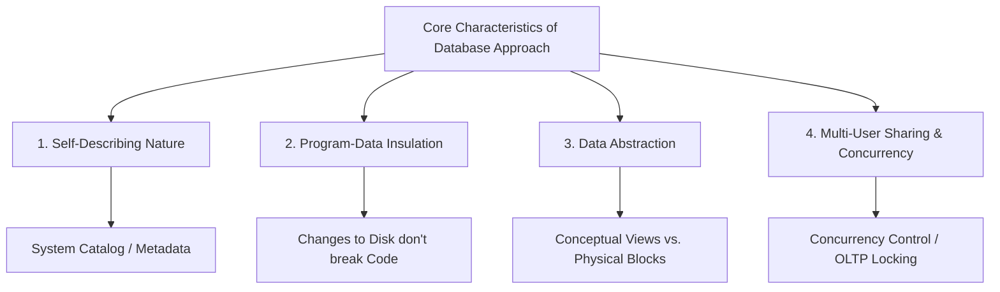
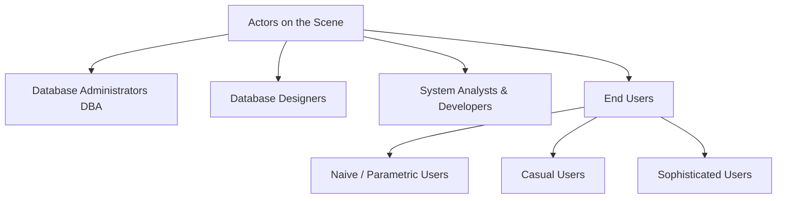

# More about Database
---

## 1. Prerequisites & The Baseline Paradigm

To evaluate the **Database Approach**, one must contrast it directly with the **File-Processing Paradigm**. In a traditional file system, data definitions are buried within individual application codes, and access is tightly coupled to physical file structures. The database approach shifts the architecture toward a centralized, self-describing repository where data definitions are managed globally by an engine, enabling controlled sharing, strict security, and structural flexibility.

---

## 2. Defining Database Examples

Modern database management systems are engineered to handle diverse operational workloads, data shapes, and transaction speeds.

| Database Category | Primary Operational Profile | Real-World Production Examples |
| --- | --- | --- |
| **Traditional Relational (OLTP)** | High-concurrency, short-lived transactional modifications requiring strict ACID guarantees. | Banking ledgers, e-commerce checkout systems, ERP inventory tracking. |
| **NoSQL Document / Key-Value** | Schemaless, horizontally scalable storage for rapid ingestion of unstructured or semi-structured data. | Social media activity feeds, real-time user session stores, content management. |
| **Analytical / Columnar (OLAP)** | Bulk data warehousing optimized for large aggregations and complex analytical queries across billions of rows. | Corporate business intelligence dashboards, clickstream analytics pipelines. |
| **Time-Series / Graph** | Highly specialized structures engineered for sequential time-tracked metrics or dense entity-relationship networks. | IoT sensor telemetry arrays, financial market feeds, social network graph maps. |

---

## 3. The Database Approach: Primary Characteristics

Textbooks like *Silberschatz* and *Elmasri/Navathe* isolate four core characteristics that distinguish the database approach from legacy file systems.

### 3.1 Self-Describing Nature of a Database System

A database system contains not only the operational data itself but also a complete definition and description of its own structure and constraints. This self-describing data is stored in the **DBMS Catalog** (or Data Dictionary), which contains **Metadata**. In a file system, the data structure is hardcoded into the application program; in a DBMS, any software tool can query the catalog to understand the structural layout dynamically.

### 3.2 Insulation Between Programs and Data (Program-Data Independence)

In file-processing environments, if the structure of a data record changes (e.g., adding a new field), every application code that accesses that file must be modified. In a database environment, the data structure is managed independently in the catalog. Applications interact with abstract logical mappings, allowing the physical or logical schema to evolve without breaking existing source code.

### 3.3 Support of Multiple Views of the Data

A database typically has many concurrent users, each requiring a different perspective or subset of the data. The DBMS provides the mechanism to generate diverse **Views**—virtual tables derived from the underlying data—tailored to specific user privileges or business roles without duplicating physical files.

### 3.4 Sharing of Data and Multi-User Transaction Processing

A core responsibility of the database approach is allowing multiple users to access and modify the same data blocks concurrently. The system implements a **Transaction Processing Subsystem** to ensure that concurrent modifications do not collide or cause data corruption, enforcing strict **ACID** properties during multi-user operations.

---

## 4. Taxonomy of Database Actors

People who interact with a database system are structurally divided into two major groups: **Actors on the Scene** (those who design, maintain, and use the database) and **Workers Behind the Scene** (those who build the DBMS software itself).

### 4.1 Actors on the Scene

#### 1. Database Administrators (DBA)

The DBA is responsible for the operational authorization, governance, and technical upkeep of the database environment.

* **Core Tasks:** Granting access privileges, monitoring system performance metrics, tuning database indexes, managing backup/recovery schedules, and ensuring enterprise data security compliance.

#### 2. Database Designers

Designers are responsible for mapping out the structural architecture of the database before it is built.

* **Core Tasks:** Identifying the data to be stored, choosing appropriate data types, defining relationships between entities, and establishing integrity constraints. They build the **Conceptual and Logical Schemas** (e.g., Entity-Relationship Diagrams).

#### 3. System Analysts and Application Programmers

* **System Analysts:** Determine the data and functional requirements of the end-users, writing the specifications that dictate application workflows.
* **Application Programmers:** Write the concrete software programs (using Java, Python, C#, etc.) that embed SQL queries to fetch, modify, and present data to end-users.

#### 4. End-Users

End-users are categorized by how they interact with the database engine:

* **Naive / Parametric Users:** The largest group of users. They interact with the database exclusively through pre-built, structured applications using clear commands (e.g., bank tellers processing a deposit, airline reservation clerks booking a ticket, or customers making a purchase online).
* **Casual Users:** Users who access the database occasionally but may require completely different information each time. They use high-level browse interfaces or simple query tools to extract data rather than rigid application menus.
* **Sophisticated Users:** Engineers, data scientists, and business analysts who thoroughly understand the capabilities of the DBMS. They write complex, raw ad-hoc queries, analytical scripts, and data models directly against the database endpoints.

### 4.2 Workers Behind the Scene

These individuals do not interact with the operational data inside a user database. Instead, they are the systems engineers who build the core infrastructure software itself:

* **DBMS System Designers and Implementers:** Engineers who write the actual DBMS software (e.g., writing the C++ code that implements PostgreSQL's storage engine, query optimizer, or concurrency control locks).
* **Tool Developers:** Engineers who build peripheral tools like GUI design interfaces, performance profilers, and data modeling tools that integrate with the DBMS.
* **Operators and Maintenance Personnel:** The system administrators and infrastructure engineers responsible for the physical hardware, distributed networking, and cloud platforms that keep the DBMS running.

---

## 5. Architectural Advantages of the DBMS Approach

Migrating from a file-processing setup to a centralized DBMS provides significant engineering advantages across application development lifecycles.

### 5.1 Controlling Data Redundancy

In legacy systems, every application maintained its own independent files, leading to duplicated records and **Data Inconsistency** (where the same customer has two different addresses in different systems). A DBMS centralizes data, minimizing duplication. If intentional redundancy is needed for performance (e.g., in a data warehouse), the DBMS manages the synchronization automatically to prevent anomalies.

### 5.2 Restricting Unauthorized Access

A DBMS provides a centralized, secure access control subsystem. The DBA can define security profiles using **Role-Based Access Control (RBAC)** or **Attribute-Based Access Control (ABAC)**. This allows the system to restrict access down to specific tables, views, columns, or rows based on user authentication tokens.

### 5.3 Providing Persistent Storage for Program Objects

Modern databases bridge the gap between object-oriented application code and relational storage engines using **Object-Relational Mapping (ORM)** or native object storage. The DBMS ensures that complex in-memory programming objects (such as a Java class instance) are mapped accurately to non-volatile disk blocks, preserving state across application restarts.

### 5.4 Providing Storage Structures for Efficient Query Processing

To speed up data retrieval, the DBMS manages complex internal storage structures on disk, such as **B+ Trees, LSM Trees, and Inverted Indexes**. Instead of scanning an entire file sequentially to find a single record, the query processor uses these indexes to locate data blocks in milliseconds, minimizing disk I/O operations.

### 5.5 Providing Backup and Recovery Subsystems

If a system failure, power outage, or hardware crash occurs mid-transaction, a file system can leave data blocks partially written or corrupted. A DBMS uses a **Write-Ahead Log (WAL)** or transaction log. If the system crashes, the recovery manager reads this log during reboot to roll back incomplete transactions or re-apply completed writes, ensuring the system returns to a clean, consistent state.

### 5.6 Providing Multiple User Interfaces

A DBMS can expose diverse interaction interfaces to accommodate its varied user base. This includes declarative language endpoints (SQL command shells), Application Programming Interfaces (ODBC/JDBC drivers), Graphical User Interfaces (admin dashboards), and natural language or form-based web portals.

### 5.7 Representing Complex Relationships Among Data

Data entities in enterprise systems are often connected by complex networks of relationships (one-to-one, one-to-many, many-to-many). A DBMS lets developers define these connections explicitly using structures like **Foreign Keys** or graph edges. The engine handles the logical overhead of connecting these entities across disk storage automatically during query execution.

### 5.8 Enforcing Integrity Constraints

The DBMS automatically enforces data quality rules at the database boundary before allowing any write operations to execute.

* **Key Constraints:** Ensuring primary keys remain completely unique.
* **Referential Integrity:** Enforcing foreign keys so a child record cannot point to a non-existent parent row.
* **Domain Constraints:** Restricting a column's data to predefined boundaries (e.g., an age column cannot accept a negative integer value).

### 5.9 Permitting Actions Using Active Rules (Triggers)

Modern databases can execute automated operational logic internally via **Triggers** and active rules. When a specific data event occurs (such as an `INSERT` or `UPDATE` operation), the database engine catches it and runs an internal stored procedure automatically to perform data auditing, update inventory counts, or validate multi-table business rules.

---

## 6. Exam Tips & High-Yield Points

> ### 🧠 Exam Tip 1: Program-Data Independence vs. Program-Operation Independence
> 
> 
> If an exam question asks you to analyze the independence properties of a DBMS, distinguish between data and operation layers.
> * **Program-Data Independence** means changing the structural format of data storage on disk does not require rewriting application logic.
> * **Program-Operation Independence** (or behavioral independence) means changing how an internal database operation is implemented (e.g., swapping an underlying sorting algorithm) does not change how the application invokes that operation.
> 
> 

> ### 🧠 Exam Tip 2: The Core Mechanism of the Write-Ahead Log (WAL)
> 
> 
> When explaining how a DBMS provides robust backup and recovery, emphasize the **Write-Ahead Logging rule**. State clearly that the database engine must write transaction log updates to non-volatile storage *before* the actual modified data pages are written to the database files on disk. This architectural sequence guarantees that if a crash occurs mid-write, the engine has a reliable record to recover or roll back the changes safely.

---

## 7. Common Interview Questions

### 1. What is the difference between a Database Administrator (DBA) and a Database Designer, and can their roles overlap?

* **Answer:** A **Database Designer** focuses on the structural strategy and logical design of the database, creating entities, relationships, constraints, and schemas before production deployment. A **Database Administrator (DBA)** focuses on operational maintenance and infrastructure, managing system performance tuning, security privileges, backups, and uptime once the database is live. In smaller organizations, these roles often overlap, but in large enterprise environments, they are kept separate to maintain operational focus and clear security boundaries.

### 2. How does the DBMS enforce referential integrity during a `DELETE` operation on a parent table, and what options do developers have to control this behavior?

* **Answer:** When a row in a parent table is deleted, the DBMS references its system catalog to see if any child tables point to that parent row via a foreign key constraint. To prevent orphan records, the engine checks the referential integrity rules defined for that relationship:
* **RESTRICT / NO ACTION:** The engine blocks the deletion and throws an error if any matching child records exist.
* **CASCADE:** The engine automatically deletes all matching child records along with the parent row.
* **SET NULL / SET DEFAULT:** The engine keeps the child rows but updates their foreign key columns to `NULL` or a predefined default value.

### 3. Why are Naive/Parametric users considered a high-risk group for database access security, and how does the database approach mitigate this risk?

* **Answer:** Naive users handle critical data transactions (like bank transfers or inventory changes) daily, but they typically lack an understanding of database security, data constraints, or system logic. If given direct access to the database terminal, they could easily introduce syntax errors or corrupt data states. The database approach mitigates this risk by completely isolating them behind **Parameterized Applications and Stored Procedures**. They interact only with a strict user interface that accepts specific inputs, validates the data at the application layer, and executes tightly controlled database transactions on their behalf, preventing direct, unvetted access to the underlying tables.