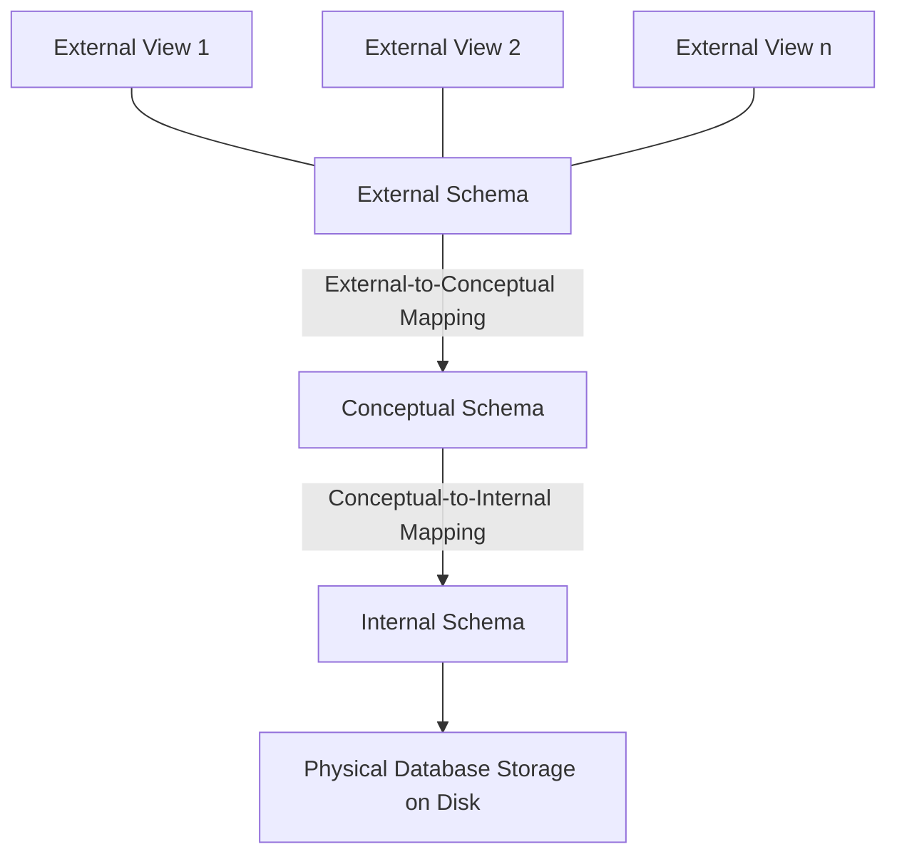
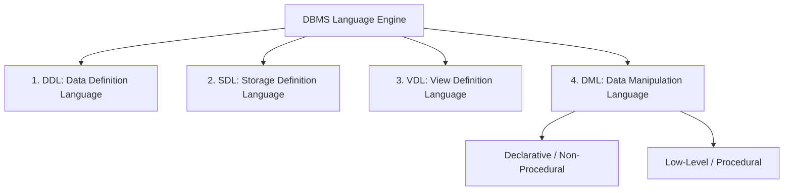
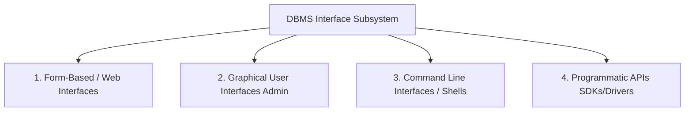

# Three-Schema Architecture & Database Languages

---

## 1. Prerequisites & Foundational Context

To understand database interfaces and architectures, one must first grasp the core concept of **Abstraction**. Hardware storage arrays operate on bytes, disk blocks, and track sectors. Conversely, application developers reason using domain-specific entities (e.g., `User`, `Transaction`).

The operating system manages physical storage, but it cannot interpret the logical connections between files. The DBMS bridges this gap using a structured multi-level mapping model, decoupling applications from raw disk layouts.

---

## 2. The Three-Schema Architecture (ANSI-SPARC)

Proposed by the American National Standards Institute (ANSI) Standards Planning and Requirements Committee (SPARC), the **Three-Schema Architecture** is the definitive structural blueprint for designing modern Database Management Systems.

### 2.1 The Three Levels of Abstraction



1. **External Level (View Level):** The top layer, closest to the end-users. It defines multiple **External Schemas** or user views. Each view describes a specific part of the database tailored to a particular user group or application context, while hiding unrelated data elements and complex structures.
2. **Conceptual Level (Logical Level):** The community view of the database. It describes the global structure of the entire database for all users using a **Conceptual Schema**. It models all entities, their attributes, relationships, operational constraints, and security profiles, while hiding physical storage mechanics.
3. **Internal Level (Physical Level):** The lowest layer of abstraction, closest to the hardware. It uses an **Internal Schema** to describe how data is physically stored on disk, mapping out file allocations, page sizes, record indices, b-tree structures, and data compression techniques.

---

## 3. Data Independence

Data Independence is the ability to modify a schema definition at one level of the database architecture without forcing updates to schemas at adjacent levels.

### 3.1 Logical Data Independence

The capacity to modify the **Conceptual Schema** without changing the **External Schemas** or application programs.

* **Internal Process:** If a DBA adds a new attribute to a table or splits a single table into two normalized relations, they update the *External-to-Conceptual Mapping*. The existing user views remain unchanged, and applications continue to run without modification.

### 3.2 Physical Data Independence

The capacity to modify the **Internal Schema** without changing the **Conceptual Schema** or application programs.

* **Internal Process:** If a DBA changes the storage media from HDDs to NVMe SSDs, splits data across partitions, or introduces a new B+ Tree index, they adjust the *Conceptual-to-Internal Mapping*. The logical structure of the tables and the application code remain completely unaffected.

---

## 4. Database Languages: Classification & Subsystems

A DBMS provides specialized sub-languages to interact with different abstraction layers within the system architecture.



### 4.1 Data Definition Language (DDL)

The DDL is used by database designers and DBAs to specify the conceptual schema, tables, domains, and integrity constraints of the database system.

* **Key Characteristics of DDL:**
* **Declarative Schema Generation:** DDL commands do not execute data operations; instead, they define the structural boundaries and data types of system objects.
* **Metadata Compilation:** When a DDL statement runs, the DDL compiler parses the syntax and writes the resulting structural rules directly into the **System Catalog / Data Dictionary**.
* **Implicit Commit:** In most enterprise databases (such as Oracle), executing a DDL command automatically triggers a transaction commit, immediately saving the structural changes.


```sql
-- DDL Operational Example
CREATE TABLE accounts (
    account_id INT PRIMARY KEY,
    balance NUMERIC(12, 2) CHECK (balance >= 0),
    created_at TIMESTAMP DEFAULT CURRENT_TIMESTAMP
);

```

### 4.2 Storage Definition Language (SDL)

In early database architectures, the **SDL** was an explicit language used to specify the internal schema of the database, defining the physical storage blocks, record placement policies, and index configurations on disk.

* **Characteristics of SDL:** It manages physical resource deployment, cluster page sizing, and file-striping architectures.
* *Note:* Modern commercial database management systems have largely phased out a separate SDL. Instead, physical storage parameters are specified using extended storage clauses directly within standard DDL commands or through internal system configurations.

```sql
-- Modern SQL containing Physical Storage Clauses (SDL Concept)
CREATE INDEX idx_user_email ON users(email)
TABLESPACE fast_ssd_pool
STORAGE (INITIAL 64K NEXT 64K);

```

### 4.3 View Definition Language (VDL)

The **VDL** is used to specify user views and control the mappings that shape the **External Schema**.

* *Note:* In modern relational platforms, the VDL is integrated directly into the DDL. Developers use standard SQL statements like `CREATE VIEW` to implement VDL logic.

```sql
-- VDL Operational Example
CREATE VIEW public_employee_directory AS
SELECT employee_id, first_name, department 
FROM employees 
WHERE status = 'Active';

```

### 4.4 Data Manipulation Language (DML)

The DML provides the tools to read, insert, update, and delete the actual data instances populated within the database structures.

#### 1. High-Level (Non-Procedural / Declarative) DML

High-level DMLs allow users to specify *what* data is required rather than explaining *how* to locate it. SQL is the most widely adopted declarative DML.

* **Why Non-Procedural?** It separates logical business requests from physical execution paths. Users do not need to understand disk layouts or table scanning operations. The internal **Query Optimizer** parses the declarative statement, analyzes index statistics, and dynamically builds an efficient execution plan at runtime.

#### 2. Query-By-Example (QBE)

QBE is a visual, graphical approach to high-level data manipulation. Instead of writing text-based code, the user inputs search parameters and criteria directly into a visual grid or form that mirrors the table schema, and the engine translates the visual query into an executable format.

#### 3. Low-Level (Procedural) DML

Procedural DMLs require developers to write explicit, step-by-step code explaining exactly how to navigate the database records. It processes data **one record at a time** (record-at-a-time syntax), using explicit programming loops to move between rows via physical pointers.

---

## 5. System Interfaces & Integration

### 5.1 The Host Language Concept

When building a production software application, a declarative database language like SQL cannot handle all application logic on its own (such as managing a UI or processing external API calls). To bridge this gap, database queries are embedded within a standard **Host Language** (such as Java, C++, Python, or Go).

The application uses specific connection libraries—like **JDBC (Java Database Connectivity)** or **ODBC (Open Database Connectivity)**—to send SQL command strings to the database engine and receive raw tabular data sets back into native application variables.

### 5.2 Types of DBMS Interfaces



1. **Form-Based Interfaces:** Designed for naive or parametric users. These interfaces present a structured web page or form layout with clear entry fields, allowing users to execute transactions (like processing an online order) without seeing the underlying queries.
2. **Graphical User Interfaces (GUIs):** Advanced administrative cockpits (e.g., pgAdmin, Oracle SQL Developer) that visually map out database schemas, table relationships, and system health metrics for DBAs and designers.
3. **Command Line Interfaces (CLIs):** Raw text terminals (e.g., `psql`, `mysql shell`) used by sophisticated users to execute ad-hoc SQL queries and administrative scripts directly against the database engine.
4. **Programmatic APIs:** The runtime data drivers (JDBC, ODBC, native SDKs) that allow application code to maintain persistent connection pools, serialize data types, and run transactions safely over network sockets.

---

## 6. Exam Tips & High-Yield Points

> ### 🧠 Exam Tip 1: The Compilation Path of DDL vs. DML
> 
> 
> If an exam question asks you to trace database execution paths, clearly distinguish between how DDL and DML commands are processed.
> * **DDL commands** pass through a DDL Compiler, which updates the **System Catalog (Metadata)** and modifies the database's structural definition.
> * **DML commands** pass through a DML Compiler and Query Optimizer, which generates an execution plan to read or modify the **User Data Files** stored on disk.
> 
> 

> ### 🧠 Exam Tip 2: Mapping Independence to the ANSI-SPARC Architecture
> 
> 
> When asked to explain the difference between Logical and Physical Data Independence, connect them directly to the ANSI-SPARC mapping layers:
> * **Logical Independence** modifies the *Conceptual Schema*, changing the *External-to-Conceptual Mapping* without affecting the top View level.
> * **Physical Independence** modifies the *Internal Schema*, changing the *Conceptual-to-Internal Mapping* without altering the logical table structures above it.
> 
> 

---

## 7. Common Interview Questions

### 1. Why does a modern RDBMS execute a non-procedural query faster than a standard developer can write a manual, procedural row-traversal loop?

* **Answer:** A developer writing a procedural loop hardcodes a specific search path based on their current assumptions. A declarative system passes the query to a dedicated **Query Optimizer**. The optimizer analyzes real-time system statistics, evaluates physical index layouts, calculates join order matrices, and estimates CPU/memory costs across hundreds of candidate execution plans. This allows the engine to pick the optimal data retrieval path dynamically based on the current data distribution, a level of efficiency that is incredibly difficult to sustain manually in procedural code.

### 2. What happens to active user views (External Schema) when a DBA normalizes a large table by splitting it into two smaller tables?

* **Answer:** Thanks to **Logical Data Independence**, the active user views do not break. The DBA updates the database's *External-to-Conceptual Mapping* by rewriting the view definition to perform an internal SQL `JOIN` across the two new tables. Because the view continues to expose the exact same column names and data types to the external application layer, the underlying structural split remains completely invisible to the end-user application.

### 3. What role does the System Catalog play during the execution of an embedded DML query within a host language?

* **Answer:** When an embedded DML query reaches the database engine, the SQL compiler reads the **System Catalog** to validate the query before execution. It checks the catalog metadata to confirm that the requested table and column names actually exist, verifies that the user credentials have the necessary read or write privileges, and confirms that the incoming data types match the column schemas. If any of these checks fail, the engine blocks execution and returns an explicit SQL error to the host language.