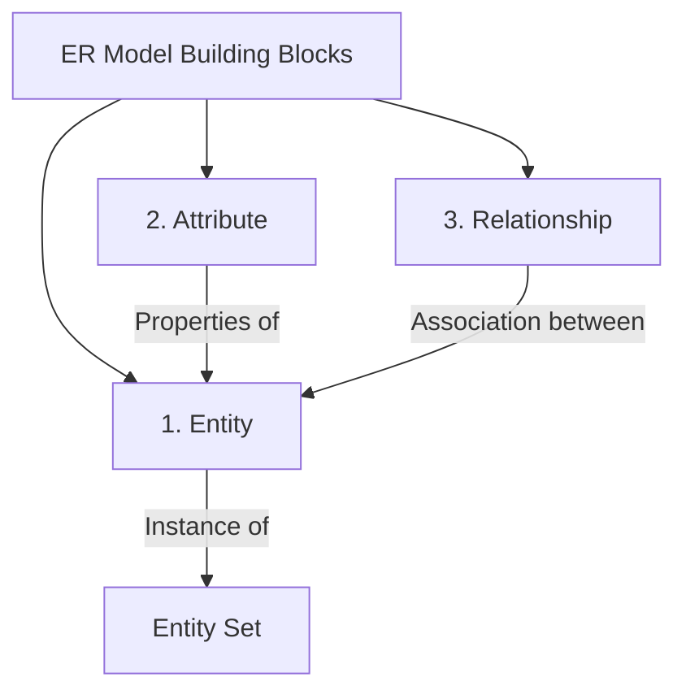
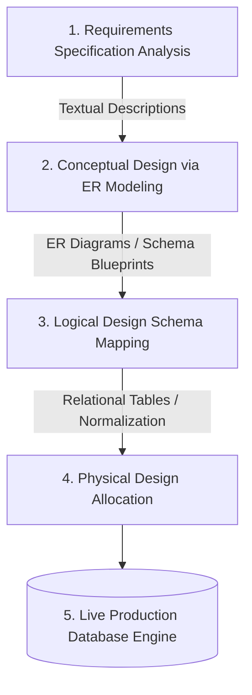
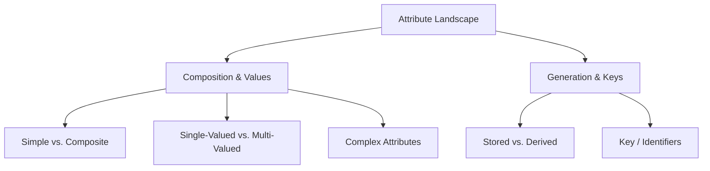
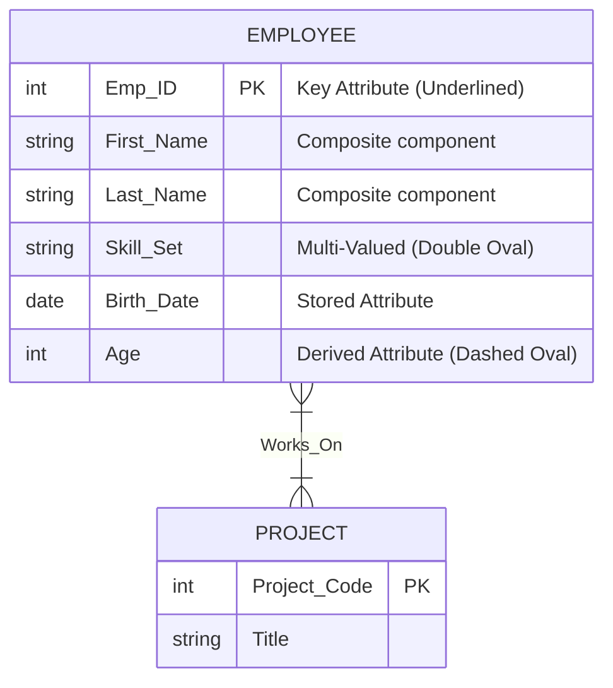

# Entity-Relationship (ER) Modeling & Attribute Taxonomy

---

## 1. Prerequisites & The Conceptual Design Phase

Before a database can be built in an RDBMS using DDL commands, it must go through a **Conceptual Design Phase**. Business requirements are often loose, textual, and unstructured. The **Entity-Relationship (ER) Model** acts as a formal bridge, translating real-world business requirements into an abstract, structured format that can be easily mapped into a relational schema (tables, keys, and constraints).

---

## 2. Core Building Blocks of the ER Model

Introduced by Peter Chen (1976), the ER model is a top-down conceptual data model that organizes information around three primary building blocks: **Entities**, **Attributes**, and **Relationships**.

### 2.1 Entity

An **Entity** is an object or concept in the real world that is distinguishable from all other objects based on its specific properties.

* *Physical/Tangible Example:* A specific employee (`Emp_#104`), a physical vehicle, or a product unit.
* *Conceptual/Intangible Example:* A bank account, a university course, or a job position.

### 2.2 Attributes

An **Attribute** is a particular property or characteristic that describes an entity. For instance, an `Employee` entity might be described by attributes such as `Employee_ID`, `Name`, `Salary`, and `Date_of_Hire`.

### 2.3 Relationships

A **Relationship** is a meaningful association or link among two or more entities. For example, an employee *Works_For* a department, where *Works_For* defines the relational link between the `Employee` entity and the `Department` entity.

---

## 3. The ER Model in the Database Design Process

The implementation of an ER model occurs at a crucial junction within the standard lifecycle of database design:

### Primary Uses of ER Diagrams (ERDs)

* **Unified Communication Tool:** Provides a clear, graphical blueprint that helps developers explain data layouts to non-technical business stakeholders.
* **Database Blueprinting:** Serves as the official structural guide that application developers reference when writing SQL commands and managing application state.
* **Schema Generation:** Simplifies the logical design phase by creating an explicit structure that can be directly converted into normalized relational tables.

---

## 4. Comprehensive Taxonomy of Attributes

To model complex business rules, attributes are categorized based on their structural layout, internal composition, and value constraints.

### 4.1 Simple (Atomic) Attributes

Attributes that cannot be broken down into smaller, independent sub-components. They contain a single atomic value.

* **Example:** `Salary` (e.g., $85,000) or `SSN`. There is no meaningful way to split these values further for database queries.

### 4.2 Composite Attributes

Attributes that can be divided into smaller, independent sub-attributes, each with its own independent meaning.

* **Example:** `Name` can be split into `First_Name`, `Middle_Initial`, and `Last_Name`. An `Address` can be divided into `Street`, `City`, `State`, and `Zip_Code`.
* **Practical Use Case:** Designing an attribute as composite allows applications to run granular queries, such as searching for all customers living in a specific `City` or sorting employees by `Last_Name`.

### 4.3 Single-Valued Attributes

Attributes that hold exactly one value for a specific entity instance.

* **Example:** `Date_of_Birth`. A person can only have one birth date.

### 4.4 Multi-Valued Attributes

Attributes that can hold a set of multiple values for a single entity instance.

* **Example:** `College_Degrees` (an employee can hold a BSc, MSc, and PhD) or `Phone_Numbers` (a user can have a home, work, and mobile number).
* **RDBMS Impact:** Relational databases require columns to hold atomic values (**First Normal Form**). During logical design, multi-valued attributes are moved into their own separate child tables linked by foreign keys.

### 4.5 Stored Attributes

Attributes that are physically saved directly to the database storage media.

* **Example:** `Date_of_Birth` or `Hire_Date`. These values are constant and serve as the source data for other calculated fields.

### 4.6 Derived Attributes

Attributes that are not stored physically on disk. Instead, their values are calculated dynamically at runtime using the data from stored attributes.

* **Example:** `Age` (calculated by finding the difference between the current date and the stored `Date_of_Birth`) or `Total_Order_Cost` (calculated by summing up line items).
* **Trade-off:** Saves physical disk space and prevents data stalls, but requires extra CPU cycles to run the calculation during query execution.

### 4.7 Complex Attributes

Formed by nesting composite and multi-valued attributes together.

* **Example:** A `Sub_Address_Phone_List` attribute that contains multiple address blocks, where each block includes a composite address alongside a set of multiple phone numbers.

### 4.8 Key Attributes (Identifiers)

An attribute (or combination of attributes) whose values are guaranteed to be completely unique for every entity instance within an entity set.

* **Example:** `Student_ID` in a university system or `Transaction_UUID` in a ledger. In an ER diagram, the name of a key attribute is emphasized with an underline.

---

## 5. ER Notation Symbols & Structural Mapping

The classic **Peter Chen Notation** uses distinct geometric shapes to map out data models:

| Geometric Shape | Represented ER Component | Operational Meaning |
| --- | --- | --- |
| **Rectangle** | Regular / Strong Entity Set | Represents a primary independent object class (e.g., `Customer`). |
| **Double Rectangle** | Weak Entity Set | An entity that cannot exist without a parent owner entity (e.g., `Dependent`). |
| **Oval** | Simple Attribute | Describes a standard property of an entity. |
| **Underlined Oval** | Key Attribute | Identifies the unique primary key descriptor. |
| **Double Oval** | Multi-Valued Attribute | Indicates a column that can hold multiple values for a single row. |
| **Dashed Oval** | Derived Attribute | Represents a calculated runtime property. |
| **Diamond** | Relationship Set | Shows the logical connection or action link between entities. |

---

## 6. Concrete Structural Examples of ER Diagrams

### 6.1 Textual Description of a Production Enterprise Scenario

Consider a corporate database tracking human resources:

1. **`Employee`** is a strong entity set.
* It possesses a key attribute: `Emp_ID`.
* It has a composite attribute: `Name` (consisting of `First_Name` and `Last_Name`).
* It has a multi-valued attribute: `Skill_Set` (an employee can have multiple skills like Python, SQL, AWS).
* It has a stored attribute: `Birth_Date`, and a derived attribute: `Age`.

2. **`Project`** is a separate strong entity set identified by `Project_Code`.
3. Employees associate with projects via a **`Works_On`** relationship diamond.

### 6.2 Rendered Architectural ER Schema Diagram

---

## 7. Exam Tips & High-Yield Points

> ### 🧠 Exam Tip 1: Mapping Multi-Valued Attributes to Tables
> 
> 
> A common university exam question asks you to convert an ER diagram containing a multi-valued attribute into a set of relational tables. **Never keep a multi-valued attribute within the main table.** If an `Employee` table has a multi-valued `Phone_Number` attribute, you must create a separate child table named `Employee_Phones(Emp_ID, Phone_Number)`. The primary key of this new table is a composite key combining both columns, ensuring the database satisfies First Normal Form (1NF).

> ### 🧠 Exam Tip 2: Identifying Weak Entities
> 
> 
> Remember that a **Weak Entity** lacks the unique key attributes needed to form a primary key on its own. It relies on a strong owner entity through an **Identifying Relationship** (drawn as a double diamond). A weak entity uses a **Partial Key / Discriminator** (drawn with a dashed underline) to distinguish between records that share the same parent owner instance.

---

## 8. Common Interview Questions

### 1. Why should we avoid storing derived attributes physically on disk, and when might we break this rule in a production system?

* **Answer:** We avoid storing derived attributes on disk to prevent data anomalies and save storage space. For example, if you store a user's `Age` as a fixed value, it becomes incorrect the moment their birthday passes, leading to inaccurate data. However, in large production data warehouses or OLAP systems, we sometimes break this rule and save derived values through **Materialization**. If calculating an aggregation across billions of rows takes too long at runtime, we pre-calculate and store the result physically, using database triggers to update it whenever the underlying source data changes.

### 2. Explain the structural difference between a composite attribute and a multi-valued attribute, and how their implementation differs in an SQL database.

* **Answer:** A **Composite Attribute** is a single property broken down into smaller, distinct sub-fields (e.g., an address split into street, city, and zip code), but an entity instance still has only one value for each sub-field. In SQL, this is implemented by simply creating normal individual columns within the main table. A **Multi-Valued Attribute** allows a single entity instance to hold an entire set of values for that property at the same time (e.g., a user with three different email addresses). In an SQL database, this cannot be done in a single row; it requires creating a separate child table linked by a foreign key to store the values safely without violating relational design rules.

### 3. What is a "Complex Attribute," and how does a data architect map it into a standard relational schema?

* **Answer:** A **Complex Attribute** is formed by nesting composite and multi-valued attributes together. For example, a `Customer` entity might have a complex attribute called `Previous_Employment_History`, which contains a collection of job entries (multi-valued), where each job entry consists of a company name, job title, and start date (composite). To map this into a standard relational schema, you must extract the entire complex structure into a separate child table. This table uses a foreign key pointing back to the parent customer record, along with distinct columns for each sub-component of the composite data.