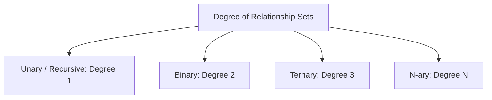
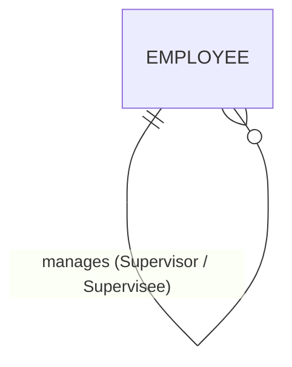
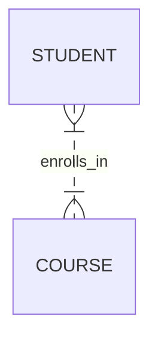
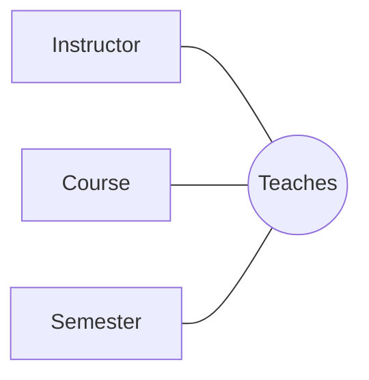
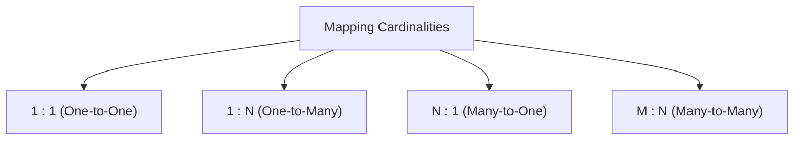
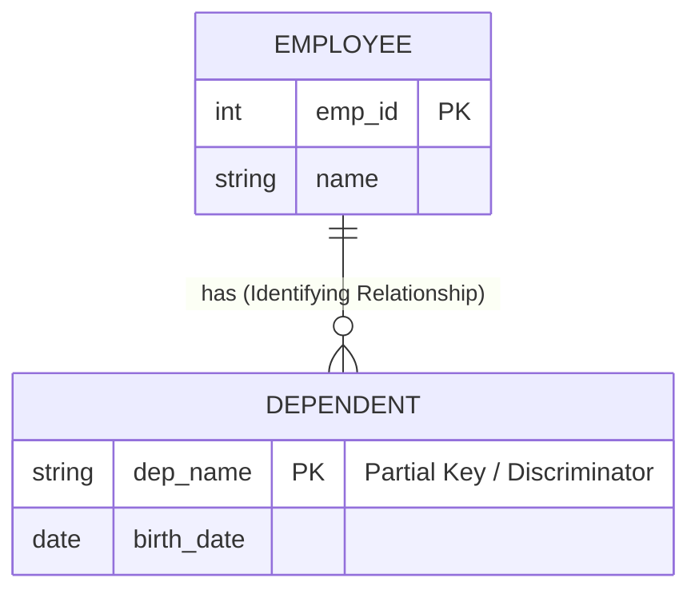
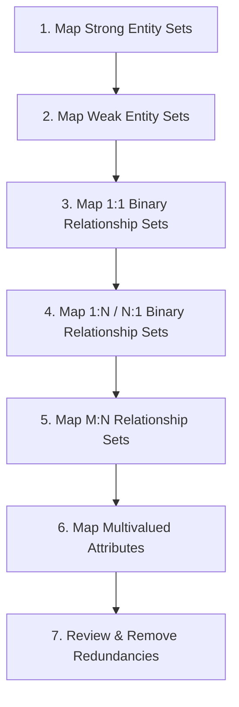
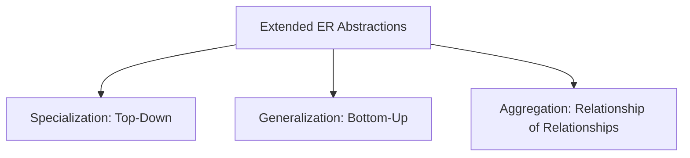
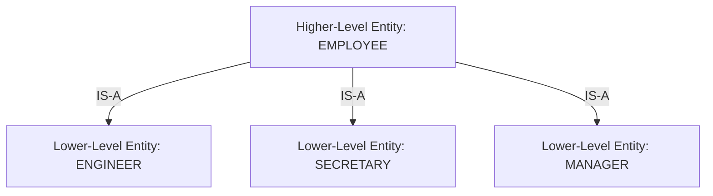
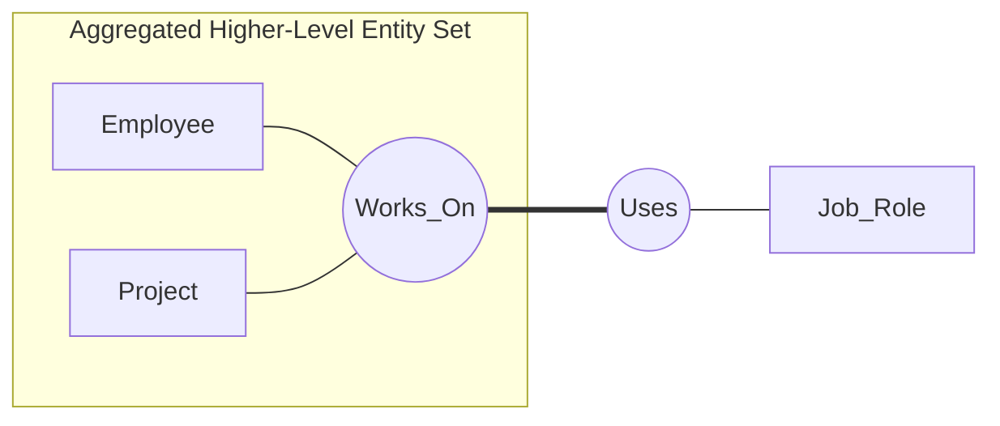

# Relational Database Management Systems (RDBMS):

---

# Topic: Advanced Entity-Relationship (ER) Modeling Mechanics, Relationship Degrees, Constraints, Mapping Rules, and Abstractions

---

## 1. Prerequisites & Fundamental Context

Before delving into the complexities of high-level database design, we must establish the formal foundational definitions that underpin the **Entity-Relationship (ER) Model**, originally introduced by Dr. Peter Chen in 1976.

```
+-----------------------------------------------------------------------------------+
|                            THE ER MODEL ABSTRACTION LAYERS                        |
+-----------------------------------------------------------------------------------+

     Real-World System Universe (Entities: Students, Courses, Instructors)
                                       │
                                       ▼  (Conceptual Modeling)
                         [ Conceptual Schema: ER Diagram ]
                                       │
                                       ▼  (Logical Mapping)
                    [ Logical Schema: Relational Tables & FKs ]
                                       │
                                       ▼  (Physical Mapping)
               [ Physical Storage: Heap Files, B+ Trees, Paging ]

```

* **Entity:** A distinguishable real-world object or concept that possesses an identity (e.g., a specific `Student` or a `Course`).
* **Entity Set ($E$):** A collection of homogeneous entities of the same type that share the same attributes (e.g., the set of all students in a university).
* **Attribute:** A property or characteristic that describes an entity (e.g., `Student_ID`, `Email`).
* **Relationship:** An association or link among two or more entities.
* **Relationship Set ($R$):** A mathematical relation over $n \ge 2$ entity sets. Formally, if $E_1, E_2, \dots, E_n$ are entity sets, then a relationship set $R$ is a subset of their Cartesian product:

$$R \subseteq E_1 \times E_2 \times \dots \times E_n = \{ (e_1, e_2, \dots, e_n) \mid e_1 \in E_1, e_2 \in E_2, \dots, e_n \in E_n \}$$

---

## 2. Degree of a Relationship Set

The **degree** of a relationship set refers to the **number of entity sets participating in the relationship set**. Understanding the degree is critical because it dictates how foreign key constraints, bridge tables, and functional dependencies are constructed during relational table mapping.



---

### 2.1 Unary (Recursive) Relationship (Degree 1)

A **Unary Relationship** occurs when an entity set participates in a relationship set with **itself**. To distinguish the distinct roles played by entities of the same set, **role indicators** (role names) must be explicitly attached to the edges in the ER diagram.



#### Mathematical Definition

$$R \subseteq E \times E$$

#### Real-World Examples

1. **Organizational Hierarchy:** An `Employee` manages another `Employee`. One instance acts as the *Supervisor*, while the other acts as the *Supervisee*.
2. **Prerequisites:** A `Course` is a prerequisite for another `Course`.

#### Relational Schema Mapping

In a relational database, a unary $1:N$ relationship is typically represented using a **self-referencing foreign key** within the same table.

```sql
CREATE TABLE Employee (
    employee_id INT PRIMARY KEY,
    first_name VARCHAR(50) NOT NULL,
    last_name VARCHAR(50) NOT NULL,
    supervisor_id INT, -- Self-referencing Foreign Key
    FOREIGN KEY (supervisor_id) REFERENCES Employee(employee_id)
        ON DELETE SET NULL
);

```

---

### 2.2 Binary Relationship (Degree 2)

A **Binary Relationship** involves exactly **two distinct entity sets**. This is the most prevalent relationship degree in real-world database systems due to its mathematical simplicity and direct mapping to relational tables.



#### Mathematical Definition

$$R \subseteq E_1 \times E_2$$

#### Real-World Examples

1. A `Student` enrolls in a `Course`.
2. A `Customer` places an `Order`.
3. An `Employee` works in a `Department`.

---

### 2.3 Ternary Relationship (Degree 3)

A **Ternary Relationship** involves **three distinct entity sets** participating simultaneously in a single composite relationship.

> **Crucial Conceptual Distinction:** A ternary relationship is **not** equivalent to three separate binary relationships. It represents an atomic $N$-way association where all three entities must coexist to form a valid relationship tuple.



#### Mathematical Definition

$$R \subseteq E_1 \times E_2 \times E_3$$

#### Real-World Example

Consider an `Instructor`, a `Course`, and a `Semester`. The ternary relationship `Teaches(Instructor, Course, Semester)` records that a specific instructor teaches a specific course during a specific semester.

```
       Instructor: Prof. Smith
              │
              ▼
   (Prof. Smith, CS101, Fall 2026) ──► Relationship Tuple
              ▲            ▲
              │            │
Course: CS101 ┘            └ Semester: Fall 2026

```

#### Why Three Binary Relationships Fail to Represent a Ternary Relationship

Suppose we decompose `Teaches(Instructor, Course, Semester)` into three binary relationships:

1. `Instructor_Course(Instructor_ID, Course_ID)`
2. `Course_Semester(Course_ID, Semester_ID)`
3. `Instructor_Semester(Instructor_ID, Semester_ID)`

If we record:

* Prof. Smith teaches CS101.
* CS101 is offered in Fall 2026.
* Prof. Smith teaches in Fall 2026.

This **does not guarantee** that Prof. Smith teaches CS101 *in Fall 2026*. He might teach CS101 in Spring 2026, and teach MATH201 in Fall 2026. Recombining the binary relations introduces **spurious tuples** (a classic loss of join dependency).

#### Relational Schema Mapping

A ternary relationship set maps directly to a standalone relational table whose primary key depends on the mapping cardinalities along its edges.

```sql
CREATE TABLE Teaches (
    instructor_id INT,
    course_id INT,
    semester_id INT,
    PRIMARY KEY (instructor_id, course_id, semester_id),
    FOREIGN KEY (instructor_id) REFERENCES Instructor(instructor_id),
    FOREIGN KEY (course_id) REFERENCES Course(course_id),
    FOREIGN KEY (semester_id) REFERENCES Semester(semester_id)
);

```

---

### 2.4 $N$-ary Relationship (Degree $N$)

An **$N$-ary Relationship** involves $N$ entity sets ($N > 3$). While mathematically valid, high-degree relationship sets increase structural complexity and are difficult to enforce using standard relational constraints.

```
                     +-----------------------+
                     |   Supply_Contract     |
                     +-----------------------+
                       /     |       |     \
                      /      |       |      \
                     v       v       v       v
                Supplier  Part  Project  Warehouse

```

#### Mathematical Definition

$$R \subseteq E_1 \times E_2 \times \dots \times E_N$$

#### Real-World Example

`Supply_Contract(Supplier, Part, Project, Warehouse)` records that a `Supplier` supplies a specific `Part` for a particular `Project` stored in a specific `Warehouse`.

#### Reduction of $N$-ary Relationships to Binary Sets

Any $N$-ary relationship set can always be converted into an equivalent set of binary relationships by introducing a new **artificial (or synthetic) entity set**, often referred to as an *identifying entity* or *junction entity*.

```
   [ N-ary Relationship ]                     [ Binary Decomposition ]

    E1       E2       E3                        E1         E2         E3
     \       |       /                           \          |          /
      \      |      /                             \         |         /
     +---------------+                           +-------------------+
     | Relationship  |                           |  Junction Entity  |
     |      R        |                           |       (E_R)       |
     +---------------+                           +-------------------+
                                                          |
                                                          |
                                                          v
                                                         E4

```

---

## 3. Structural Constraints: Mapping Cardinality and Participation

To accurately reflect enterprise business rules, an ER model enforces structural constraints on relationship sets. Structural constraints consist of two distinct mechanics: **Mapping Cardinality** and **Participation Constraints**.

```
+-----------------------------------------------------------------------------------+
|                               STRUCTURAL CONSTRAINTS                              |
+---------------------------------------------------+-------------------------------+
| Mapping Cardinality (Upper Bound)                 | Participation (Lower Bound)   |
+---------------------------------------------------+-------------------------------+
| Specifies the max number of relationship instances| Specifies if entity existence |
| an entity can participate in.                     | depends on the relationship.  |
| Types: 1:1, 1:N, N:1, M:N                         | Types: Total (1), Partial (0) |
+---------------------------------------------------+-------------------------------+

```

---

### 3.1 Mapping Cardinality (Cardinality Ratios)

Mapping cardinality defines the **maximum number** of relationship instances in which an entity from an entity set can participate.

For a binary relationship set $R$ between entity sets $A$ and $B$, the possible mapping cardinalities are:



#### 1. One-to-One ($1:1$)

An entity in $A$ is associated with at most one entity in $B$, and an entity in $B$ is associated with at most one entity in $A$.

```
Entity Set A                      Entity Set B
   [ a1 ] ──────────────────────────► [ b1 ]
   [ a2 ] ──────────────────────────► [ b2 ]
   [ a3 ]                             [ b3 ]

```

* **Real-World Example:** `Department` manages `Department_Head` (assuming a department has at most one head, and a professor heads at most one department).

#### 2. One-to-Many ($1:N$)

An entity in $A$ is associated with any number ($0$ or more) of entities in $B$. However, an entity in $B$ can be associated with at most one entity in $A$.

```
Entity Set A                      Entity Set B
   [ a1 ] ─────────┬────────────────► [ b1 ]
                   └────────────────► [ b2 ]
   [ a2 ] ──────────────────────────► [ b3 ]

```

* **Real-World Example:** `Department` employs `Employee`. A department has many employees, but each employee works for only one department.

#### 3. Many-to-One ($N:1$)

An entity in $A$ is associated with at most one entity in $B$. However, an entity in $B$ can be associated with any number ($0$ or more) of entities in $A$. (Note: $N:1$ is the logical inverse of $1:N$).

```
Entity Set A                      Entity Set B
   [ a1 ] ─────────┐
                   ├────────────────► [ b1 ]
   [ a2 ] ─────────┘
   [ a3 ] ──────────────────────────► [ b2 ]

```

* **Real-World Example:** `Student` belongs to `College`.

#### 4. Many-to-Many ($M:N$)

An entity in $A$ is associated with any number of entities in $B$, and an entity in $B$ is associated with any number of entities in $A$.

```
Entity Set A                      Entity Set B
   [ a1 ] ─────────┬────────────────► [ b1 ]
                   └───────┐
   [ a2 ] ─────────────────┼────────► [ b2 ]
                           └────────► [ b3 ]

```

* **Real-World Example:** `Student` enrolls in `Course`. A student can take multiple courses, and a course can contain multiple students.

---

### 3.2 Participation Constraints

Participation constraints specify the **minimum number** of relationship instances in which an entity must participate (the lower bound).

```
PARTICIPATION CONSTRAINTS

 Total Participation (Existence Dependency)      Partial Participation
 Symbol: Double Line (═)                          Symbol: Single Line (─)
 Minimum Cardinality = 1                          Minimum Cardinality = 0
 Every entity MUST participate.                   Entities CAN exist independently.
 
 Example:                                         Example:
 Every Loan MUST belong to a Customer.            Not every Customer has an active Loan.

```

1. **Total Participation (Existence Dependency):** Every entity in the entity set **must** participate in at least one relationship instance in $R$.
* **Notation:** Represented by a **double line** (`==`) connecting the entity set to the relationship diamond.
* **Constraint:** Minimum cardinality $= 1$.


2. **Partial Participation:** Some entities in the entity set **may not** participate in any relationship instance in $R$.
* **Notation:** Represented by a **single line** (`--`) connecting the entity set to the relationship diamond.
* **Constraint:** Minimum cardinality $= 0$.


---

### 3.3 Unified $(min, max)$ Notation

To eliminate ambiguity, modern database engineering uses the explicit $(min, max)$ structural constraint notation (introduced by Jean-Raymond Abrial).

* $min$ represents the participation constraint ($min = 0 \implies \text{partial}$, $min \ge 1 \implies \text{total}$).
* $max$ represents the mapping cardinality ($max = 1$ or $max = * \text{ / } N$).

Each entity set $E$ participating in a relationship set $R$ is tagged with a pair $(min, max)$, signifying that each entity $e \in E$ must participate in **at least $min$** and **at most $max$** relationship instances in $R$.

```
   +----------+                   +--------------+                   +----------+
   | Employee |-----(1, 1)========|  Works_For   |-----(0, N)--------| Department |
   +----------+                   +--------------+                   +----------+
   
   Interpretation:
   - Each Employee MUST work for EXACTLY 1 Department (min=1, max=1).
   - A Department can employ ZERO to MANY Employees (min=0, max=N).

```

---

## 4. Weak Entity Sets vs. Strong Entity Sets

Understanding the dichotomy between **Strong** and **Weak** entity sets is essential for enforcing database integrity and properly organizing primary keys.

```
+-----------------------------------------------------------------------------------+
|                        STRONG ENTITY SET VS WEAK ENTITY SET                       |
+------------------------------------+----------------------------------------------+
| Strong Entity Set                  | Weak Entity Set                              |
+------------------------------------+----------------------------------------------+
| Possesses a Primary Key capable of | Lacks a primary key; depends on a strong     |
| uniquely identifying each entity.  | identifying entity set for its identification|
| Exists independently in database.  | Existence dependent on identifying entity.   |
| Primary key is a simple/composite  | Key is formed by: (Parent PK + Discriminator)|
| attribute of its own set.          | Joined via an Identifying Relationship Set.  |
| Diagram: Single Rectangle [ ]      | Diagram: Double Rectangle [[ ]]              |
+------------------------------------+----------------------------------------------+

```



### Key Terminology for Weak Entities

1. **Discriminator (Partial Key):** An attribute set in a weak entity set that uniquely distinguishes entities *belonging to the same strong entity instance*. It is visually represented with an **underlined dashed line** ($\text{- - - -}$).
2. **Identifying Entity Set (Owner Entity Set):** The strong entity set upon which the weak entity set depends.
3. **Identifying Relationship:** The relationship set linking the weak entity set to its owner. Visually represented by a **double diamond** (`<< >>`).
4. **Primary Key Construction:** The primary key of a weak entity set is formed by combining the **Primary Key of the Identifying Entity Set** + the **Partial Key (Discriminator) of the Weak Entity Set**.

#### Relational Schema Translation Example

$$\text{Employee}(\underline{\text{emp\_id}}, \text{name}, \text{salary})$$

$$\text{Dependent}(\underline{\text{emp\_id}}, \underline{\text{dep\_name}}, \text{birth\_date}, \text{relationship})$$

```sql
CREATE TABLE Dependent (
    emp_id INT,
    dep_name VARCHAR(50),
    birth_date DATE,
    relationship VARCHAR(30),
    -- Composite Primary Key derived from Parent PK + Discriminator
    PRIMARY KEY (emp_id, dep_name), 
    FOREIGN KEY (emp_id) REFERENCES Employee(emp_id)
        ON DELETE CASCADE -- If parent employee is deleted, cascade delete dependents
);

```

---

## 5. ER Diagram-to-Relational Schema Mapping Algorithm

Mapping an ER Diagram into a clean, normalized relational schema follows a rigorous, step-by-step algorithm.



---

### Step 1: Map Strong Entity Sets

For each strong entity set $E$, create a relation $R$ containing all simple scalar attributes of $E$. Choose an attribute set to serve as the **Primary Key**.

```
ER: [Student (student_id, first_name, last_name, gpa)]
    │
    ▼
SQL: Student(student_id [PK], first_name, last_name, gpa)

```

---

### Step 2: Map Weak Entity Sets

For each weak entity set $W$ with owner $E$:

1. Create a relation $R_W$.
2. Include all simple attributes of $W$.
3. Add the **Primary Key attribute(s)** of the owner entity $E$ as foreign key attributes in $R_W$.
4. Set the composite primary key of $R_W$ to: $(\text{Owner Primary Key} + \text{Weak Entity Discriminator})$.

---

### Step 3: Map Binary $1:1$ Relationship Sets

Let $R$ be a $1:1$ relationship set between $A$ and $B$. Three strategies exist depending on participation:

```
  Case A: Total Participation on One Side (e.g., B is Total)
  ──► Foreign Key Approach: Add A's Primary Key into B as a Foreign Key (NOT NULL).

  Case B: Total Participation on Both Sides
  ──► Merge Approach: Combine A and B into a SINGLE relational table.

  Case C: Partial Participation on Both Sides
  ──► Separate Table Approach: Create a third table R(A_PK, B_PK).

```

---

### Step 4: Map Binary $1:N$ and $N:1$ Relationship Sets

Let $R$ be a $1:N$ relationship set from $A$ to $B$ ($A$ is on the $1$-side, $B$ is on the $N$-side).

* **Foreign Key Placement:** Take the Primary Key of $A$ (the $1$-side) and insert it as a **Foreign Key** into the relation for $B$ (the $N$-side).
* **Attributes on Relationship:** Any descriptive attributes on $R$ are placed in the relation for $B$.

> **Gold Standard Rule:** Always place the foreign key on the **MANY ($N$) side**. Do not create a separate table for a $1:N$ relationship unless it has sparse partial participation.

```
                  1                                   N
           [ Department ] <═════════════════════ [ Employee ]
            (dept_id)                             (emp_id)

                                   │
                                   ▼
          Employee(emp_id [PK], name, salary, dept_id [FK])

```

---

### Step 5: Map Binary $M:N$ Relationship Sets

For each $M:N$ relationship set $R$ between $A$ and $B$:

1. Create a **new standalone junction/bridge relation** $R$.
2. Include the Primary Key of $A$ and the Primary Key of $B$ as foreign key attributes.
3. The composite primary key of $R$ is $(\text{Primary Key of } A + \text{Primary Key of } B)$.
4. Include any descriptive attributes belonging directly to $R$.

```sql
-- Junction Table Mapping for Student M:N Course
CREATE TABLE Enrolls (
    student_id INT,
    course_id INT,
    enrollment_date DATE,
    grade VARCHAR(2),
    PRIMARY KEY (student_id, course_id),
    FOREIGN KEY (student_id) REFERENCES Student(student_id),
    FOREIGN KEY (course_id) REFERENCES Course(course_id)
);

```

---

### Step 6: Map Multivalued Attributes

For each multivalued attribute $A_{mv}$ in an entity $E$:

1. Create a new relation $R_{A_{mv}}$.
2. Include the attribute $A_{mv}$ and the Primary Key $K_E$ of $E$.
3. Foreign Key: $K_E$ references $E(K_E)$.
4. Primary Key of new relation: Composite $(K_E, A_{mv})$.

```
  Entity: Employee(emp_id, name, { phone_number })
  
  Relational Mapping:
  1. Employee(emp_id [PK], name)
  2. Employee_Phone(emp_id [FK], phone_number, PRIMARY KEY(emp_id, phone_number))

```

---

### Step 7: Review for Redundancies

Examine the schema to eliminate redundant tables. For example, if a relationship table for a $1:N$ relation was created unnecessarily, merge its attributes into the $N$-side table and drop the extra relation.

---

## 6. Advanced Database Abstractions: Generalization, Specialization, and Aggregation

When modeling complex enterprise domains (such as healthcare, banking, or logistics), standard ER constructs can become cluttered. Advanced ER abstractions provide object-oriented structural capabilities.



---

### 6.1 Specialization (Top-Down Design)

**Specialization** is a top-down design process where a higher-level entity set is broken down into lower-level specialized entity sets based on distinguishing characteristics or roles.



* **Inheritance Principle:** Lower-level entity sets **inherit** all attributes and relationship participation from their higher-level superclass entity set.
* **Local Attributes:** Lower-level entity sets define specialized attributes that apply *only* to their specific subclass (e.g., `Engineer` has `engineering_discipline`, while `Secretary` has `typing_speed`).

---

### 6.2 Generalization (Bottom-Up Design)

**Generalization** is a bottom-up design process where multiple higher-level entity sets sharing common features are synthesized into a single, broader higher-level superclass entity set.

```
  [ Car (license_plat, max_speed, num_doors) ]     [ Truck (license_plat, max_speed, payload) ]
                         │                                              │
                         └──────────────────────┬───────────────────────┘
                                                │ (Generalization Synthesis)
                                                ▼
                            [ Vehicle (license_plat, max_speed) ]
                                          ▲
                                   ┌──────┴──────┐
                                   │             │
                                 Car           Truck
                             (num_doors)     (payload)

```

---

### 6.3 Constraints on Specialization/Generalization Hierarchies

To ensure formal semantic validity, ISA hierarchies enforce two independent sets of constraints: **Disjointness Constraints** and **Completeness Constraints**.

```
+-----------------------------------------------------------------------------------+
|               HIERARCHY CONSTRAINTS (DISJOINTNESS x COMPLETENESS)                  |
+------------------------------------+----------------------------------------------+
| Disjointness Constraints           | Completeness Constraints                     |
+------------------------------------+----------------------------------------------+
| Dictates whether an entity can     | Dictates whether an entity in a superclass   |
| belong to multiple subclasses.     | MUST belong to at least one subclass.        |
|                                    |                                              |
| 1. Disjoint: Entity belongs to     | 1. Total (Mandatory): Every superclass entity|
|    at most ONE subclass.           |    MUST be a member of a subclass.           |
| 2. Overlapping: Entity can belong  | 2. Partial (Optional): Superclass entity     |
|    to MULTIPLE subclasses.         |    can exist WITHOUT joining any subclass.   |
+------------------------------------+----------------------------------------------+

```

```
                 COMPLETENESS CONSTRAINTS
                   Total (═)            Partial (─)
               +--------------------+--------------------+
  Disjoint     | Total-Disjoint     | Partial-Disjoint   |
               | (e.g., Account     | (e.g., Employee    |
DISJOINTNESS   |  is Checking OR    |  is Engineer OR    |
CONSTRAINTS    |  Savings)          |  Secretary OR none)|
               +--------------------+--------------------+
  Overlapping  | Total-Overlapping  | Partial-Overlapping|
               | (e.g., Person is   | (e.g., Item is     |
               |  Student AND/OR    |  Manufactured AND/OR|
               |  Employee)         |  Purchased)        |
               +--------------------+--------------------+

```

#### Relational Schema Mapping Strategies for Inheritance

```
Strategy 1: Superclass & Subclasses Tables (Normalized)
-------------------------------------------------------
Vehicle(vehicle_id [PK], max_speed)
Car(vehicle_id [PK/FK], num_doors)
Truck(vehicle_id [PK/FK], payload)

Strategy 2: Subclasses Only Tables (Repeated Superclass Attributes)
------------------------------------------------------------------
Car(vehicle_id [PK], max_speed, num_doors)
Truck(vehicle_id [PK], max_speed, payload)

Strategy 3: Single Consolidated Table with Nullable Columns
----------------------------------------------------------
Vehicle(vehicle_id [PK], vehicle_type, max_speed, num_doors NULL, payload NULL)

```

---

### 6.4 Aggregation

**Aggregation** is an abstraction used when a relationship set needs to participate in *another* relationship set.

Standard ER syntax forbids relationships from pointing directly to other relationships. Aggregation abstracts an entire relationship set (along with its participating entity sets) into a single **higher-level composite entity set**.



#### Real-World Example

Consider an `Employee` working on a `Project`. That interaction forms a relationship set `Works_On(Employee, Project)`. Now, suppose we need to track which `Job_Role` is assigned to that *specific employee-project pair*.

Without Aggregation, we would need a ternary relationship `Assign(Employee, Project, Job_Role)`. However, if `Works_On` already exists as an independent entity-relationship module, Aggregation wraps `[Employee --- Works_On --- Project]` into a single unit, which then enters into the binary relationship `Uses` with `Job_Role`.

#### Relational Schema Mapping of Aggregation

```sql
-- Step 1: Base Entities
CREATE TABLE Employee (emp_id INT PRIMARY KEY);
CREATE TABLE Project (project_id INT PRIMARY KEY);
CREATE TABLE Job_Role (role_id INT PRIMARY KEY);

-- Step 2: Base Relationship (Aggregated Object)
CREATE TABLE Works_On (
    emp_id INT,
    project_id INT,
    PRIMARY KEY (emp_id, project_id),
    FOREIGN KEY (emp_id) REFERENCES Employee(emp_id),
    FOREIGN KEY (project_id) REFERENCES Project(project_id)
);

-- Step 3: Relationship involving the Aggregation
CREATE TABLE Uses (
    emp_id INT,
    project_id INT,
    role_id INT,
    PRIMARY KEY (emp_id, project_id, role_id),
    -- Foreign Key references the primary key of the aggregated table!
    FOREIGN KEY (emp_id, project_id) REFERENCES Works_On(emp_id, project_id),
    FOREIGN KEY (role_id) REFERENCES Job_Role(role_id)
);

```

---

## 7. Comparative Technical Matrix

| Concept | Primary Purpose | Key Structural Notation | Relational Mapping Mechanism | Common Pitfalls |
| --- | --- | --- | --- | --- |
| **Unary Relationship** | Models recursive relationships within a single entity set. | Self-loop on entity box with explicit roles. | Single table containing a **self-referencing Foreign Key**. | Forgetting `NULL` constraints on top-level root entities (e.g., CEO has no manager). |
| **Ternary Relationship** | Connects 3 entity sets atomically. | Diamond connected to 3 entity boxes. | Dedicated table with a **composite key** referencing all 3 tables. | Incorrectly breaking it into 3 binary tables, creating lossy join anomalies. |
| **Weak Entity Set** | Represents entities without independent identity. | Double rectangle `[[ ]]`, double diamond `<< >>`, dashed underline discriminator. | Child table using $(\text{Parent PK} + \text{Discriminator})$ as the Primary Key. | Omitting `ON DELETE CASCADE`, which causes orphaned records. |
| **Specialization** | Top-down refinement into specialized subclasses. | `IS-A` triangle point pointing up to superclass. | Superclass table + subclass tables joined via shared Primary Keys. | Over-subclassing, which leads to slow multi-table `JOIN` operations. |
| **Aggregation** | Treats a relationship set as a high-level entity. | Dotted rectangle enclosing a relationship and its entities. | Junction table referencing the composite key of another relationship table. | Confusing Aggregation with ternary relationships. |

---

## 8. High-Yield Exam Questions & Critical Answers

### 🎓 Exam Question 1: Ternary Decomposition Proof

**Question:** Prove why a ternary relationship set $R(A, B, C)$ with $M:N:P$ cardinality cannot generally be decomposed into three binary relationship sets $R_1(A, B)$, $R_2(B, C)$, and $R_3(A, C)$ without introducing spurious tuples.

**Answer:**
Suppose $R \subseteq A \times B \times C$. Let $R = \{ (a_1, b_1, c_1), (a_1, b_2, c_2) \}$.
Decomposing $R$ into binary projections:

* $\pi_{AB}(R) = R_1 = \{ (a_1, b_1), (a_1, b_2) \}$
* $\pi_{BC}(R) = R_2 = \{ (b_1, c_1), (b_2, c_2) \}$
* $\pi_{AC}(R) = R_3 = \{ (a_1, c_1), (a_1, c_2) \}$

Now, reconstruct the original relationship set using natural joins:

$$R' = R_1 \bowtie R_2 \bowtie R_3$$

When joining $R_1$ and $R_2$ on $B$, and joining with $R_3$ on $A$ and $C$:
In addition to the valid tuples $(a_1, b_1, c_1)$ and $(a_1, b_2, c_2)$, the join produces **spurious tuples** such as $(a_1, b_1, c_2)$ and $(a_1, b_2, c_1)$.

Because $R' \neq R$ (i.e., $R \subset R'$), binary decomposition is **lossy**. Therefore, a ternary relationship cannot be decomposed into binary sets without losing structural information.

---

### 🎓 Exam Question 2: Foreign Key Placement in $1:N$ vs $1:1$ Relationships

**Question:** Explain why foreign keys are placed on the $N$-side in a $1:N$ relationship, and discuss foreign key placement strategy for $1:1$ relationships with partial vs. total participation.

**Answer:**

1. **$1:N$ Relationship Foreign Key Placement:**
An entity on the $N$-side is associated with **at most one** entity on the $1$-side. Placing the foreign key in the $N$-side relation ensures that each record stores a single scalar value for the foreign key, matching First Normal Form (1NF). Placing the foreign key on the $1$-side would require storing an array/multivalued list of keys, violating 1NF.
2. **$1:1$ Relationship Placement Strategy:**
* **Total Participation on One Side (e.g., $A$ is Partial, $B$ is Total):** Place the foreign key referencing $A$ inside relation $B$. Set the foreign key column to `NOT NULL`. This guarantees every record in $B$ links to an $A$, preventing `NULL` value pollution.
* **Partial Participation on Both Sides:** Create a separate relationship table $R(\underline{A\_ID}, B\_ID)$ or place the foreign key in either table, accepting `NULL`s for non-participating entities.
* **Total Participation on Both Sides:** Merge both entity sets into a single relational table to achieve optimal join performance and eliminate redundant keys.


---

## 9. Frequently Asked Technical Interview Questions

### Q1: What is the difference between a Weak Entity and a Strong Entity, and how does this affect cascading deletes?

**Answer:** A Strong Entity possesses a primary key built entirely from its own scalar attributes and exists independently. A Weak Entity lacks a primary key and relies on a parent (identifying) strong entity for both its full identification (Parent PK + Discriminator) and its existence.

In relational databases, weak entity tables **must** define their foreign key constraint referencing the parent table with `ON DELETE CASCADE`. If a parent record is deleted, its weak dependent records no longer have a valid identity and must be automatically purged to maintain referential integrity.

---

### Q2: How do you choose between using an $N$-ary Relationship versus Aggregation when modeling a system?

**Answer:**

* Use an **$N$-ary Relationship** when all $N$ entities participate **simultaneously in a single atomic action**. For example, `Purchase(Customer, Store, Item, Payment_Method)` describes an event where all four entities must coexist for the transaction to make sense.
* Use **Aggregation** when an association between entities **already exists as a standalone relationship** and *that relationship itself* needs to form additional relationships with other entities later. Aggregation preserves modularity and avoids inflating relationship degrees unnecessarily.

---

### Q3: How do Disjoint-Total constraints in Generalization map to SQL tables?

**Answer:** A Disjoint-Total constraint means every superclass instance **must** belong to **exactly one** subclass.

* **Option 1 (Normalized):** Create a base superclass table and child tables for each subclass. Enforce total participation using application logic or transactional triggers.
* **Option 2 (Single Table):** Merge all attributes into a single table with a `type` discriminator column. Set a `CHECK (type IN ('SubclassA', 'SubclassB'))` constraint and mark non-shared subclass columns as nullable. This provides optimal read performance by avoiding `JOIN` operations.

---

## 10. Topic Summary

```
                      SUMMARY MAP: ER MODELING MECHANICS
                      
                        ┌────────────────────────┐
                        │ Entity-Relationship    │
                        │ Structural Mechanics   │
                        └───────────┬────────────┘
                                    │
       ┌────────────────────────────┼────────────────────────────┐
       ▼                            ▼                            ▼
[ Relationship Degrees ]   [ Structural Constraints ]  [ Database Abstractions ]
• Unary (Self-FK)          • Mapping Cardinality       • Specialization (Top-down)
• Binary (1:1, 1:N, M:N)     (1:1, 1:N, M:N)           • Generalization (Bottom-up)
• Ternary (Composite PK)   • Participation             • Constraints:
• N-ary (Junction Entity)    (Total ═ vs Partial ─)      (Disjoint/Overlapping,
                           • (min, max) Bounds          Total/Partial)
                           • Weak Entities             • Aggregation
                             (Parent PK + Discriminator)  (Relationship of Relationships)

```

1. **Relationship Degrees:** Dictate the number of participating entity sets ($1, 2, 3, \dots, N$). Higher-degree relationships ($N \ge 3$) cannot generally be decomposed into binary sets without introducing lossy joins.
2. **Cardinality & Participation:** Mapping cardinalities ($1:1, 1:N, M:N$) dictate where foreign keys are placed or where junction tables are required. Participation constraints ($0$ vs $1$) dictate `NULL` vs `NOT NULL` rules.
3. **Weak Entities:** Depend on an owner entity set for identity. Their primary key is composite: $(\text{Owner PK} + \text{Discriminator})$.
4. **ER-to-Relational Mapping:** Follows a strict deterministic workflow. Strong entities map to base tables, $1:N$ relationships push foreign keys to the $N$-side, and $M:N$ relationships require standalone junction tables.
5. **Advanced Abstractions:** Specialization (top-down) and Generalization (bottom-up) introduce `IS-A` inheritance hierarchies constrained by disjointness and completeness rules. Aggregation elevates a relationship set into a composite entity capable of entering further relationships.

---