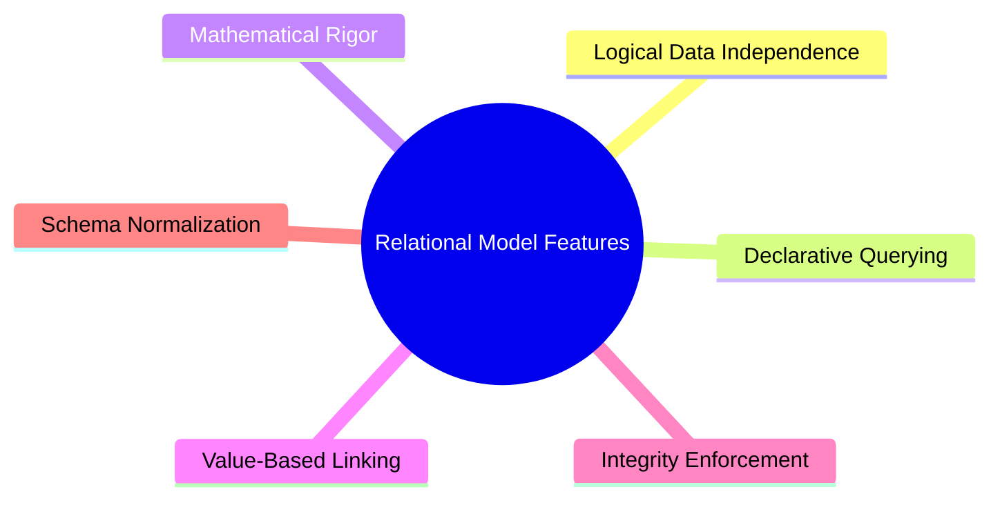
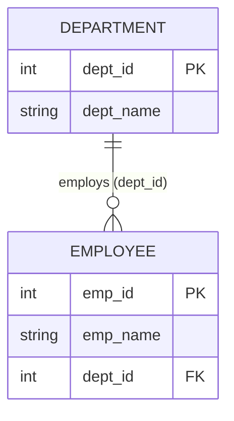
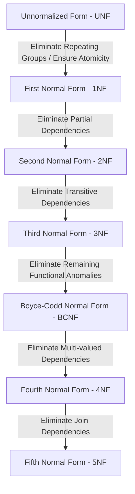
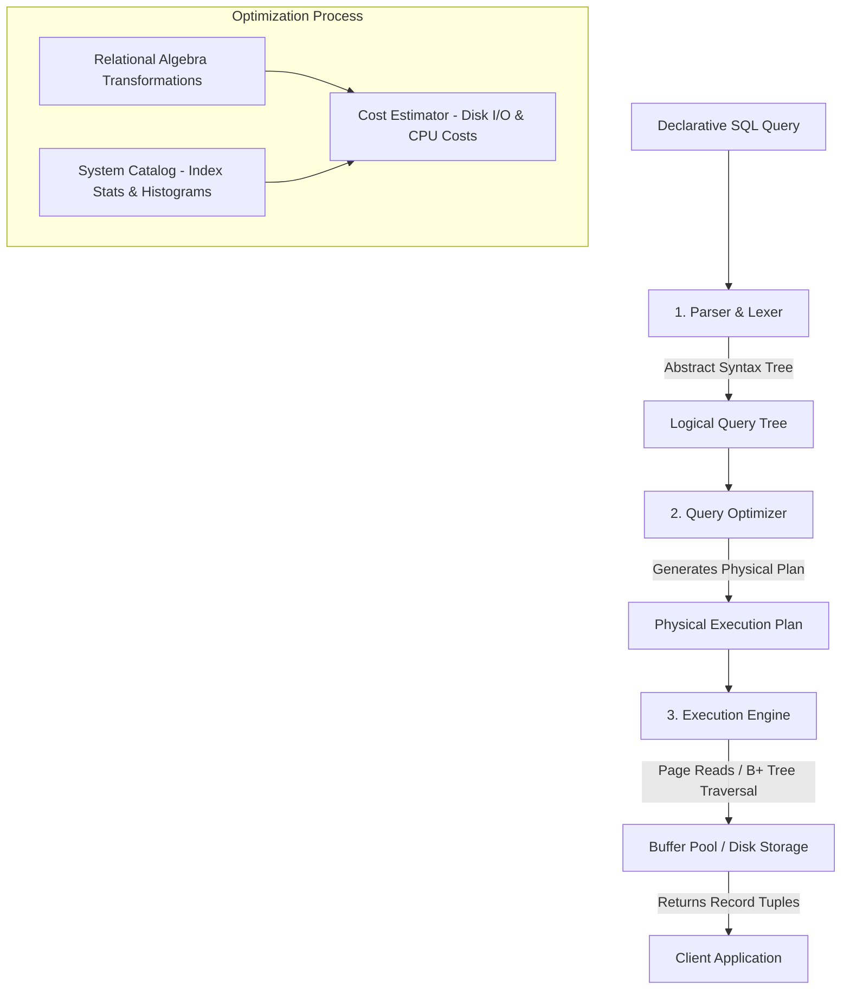

# Relational Database Management Systems (RDBMS):

---

# Topic: Introduction to the Relational Model, Core Features, Architectural Paradigms, and Structural Foundations

---

## 1. Prerequisites & Historical Context

To appreciate the design of the **Relational Model**, we must examine the limitations of the database systems that preceded it in the 1960s—specifically, the **Hierarchical Model** (e.g., IBM's IMS) and the **Network Model** (e.g., CODASYL).

```
+-----------------------------------------------------------------------------------+
|                        EVOLUTION OF DATABASE PARADIGMS                            |
+-----------------------------------------------------------------------------------+

   [ Hierarchical Model ]            [ Network Model ]            [ Relational Model ]
    (Tree Structure)                  (Graph Structure)            (Tabular / Set-Based)
    
         ( Root )                         ( Record A )                  +---+---+---+
        /        \                       /          \                   | A | B | C |
    (Child 1)  (Child 2)           ( Record B ) ── ( Record C )         +---+---+---+
       |                                                                |   |   |   |
    (Grandchild)                   * Complex Pointers                   +---+---+---+
    * Rigid Parent-Child           * Difficult Querying                 * Logical/Physical
    * Structural Dependency                                               Data Independence

```

### Limitations of Legacy Paradigms

1. **Structural Dependency:** Applications were tightly coupled with the physical memory storage layout and explicit disk pointer addresses. A change in the physical storage layout required rewriting application code.
2. **Navigational Querying:** Developers had to write complex code to manually navigate pointer paths (e.g., `Get Next Within Parent`) to retrieve records.
3. **Complex Many-to-Many Relationships:** Representing $M:N$ relationships in hierarchical trees caused extreme data duplication or required complicated pointer networks.

### The Codd Revolution (1970)

Dr. Edgar Frank "Ted" Codd, a mathematician at IBM, published the seminal paper:

> *"A Relational Model of Data for Large Shared Data Banks"* (Communications of the ACM, June 1970).

Codd applied mathematical **Set Theory** and **First-Order Predicate Logic** to database systems. He proposed abstracting physical disk storage completely behind a simple, tabular interface: **the Relation**.

---

## 2. What is the Relational Model?

The **Relational Model** is a conceptual framework that represents all data in a database as a collection of two-dimensional tables called **Relations**. In this model, both data entities and the associations between them are represented using tabular structures.

```
                                  RELATION SCHEMA
           Relation Name: STUDENT
           
  Attributes (Columns) ──►  student_id  │  first_name  │  gpa
                           ─────────────┼──────────────┼──────
  Tuples (Rows)        ──►     101      │    Alice     │  3.8
                       ──►     102      │    Bob       │  3.5

```

### Formal Mathematical Definition

Mathematically, let $D_1, D_2, \dots, D_n$ be $n$ **Domains** (atomic sets of permissible values).

A **Relation Schema** $R$ is defined as:

$$R = (A_1: D_1, A_2: D_2, \dots, A_n: D_n)$$

where $A_1, A_2, \dots, A_n$ are distinct attribute names mapping to their respective domains $D_i$.

A **Relation Instance** $r(R)$ is a finite subset of the Cartesian Product of the attribute domains:

$$r(R) \subseteq D_1 \times D_2 \times \dots \times D_n = \{ (d_1, d_2, \dots, d_n) \mid d_i \in D_i \}$$

Each element $(d_1, d_2, \dots, d_n)$ in $r(R)$ is called an $n$-tuple (or **Row**).

---

## 3. Fundamental Terminology Mapping

A common point of confusion for beginners is the dual terminology used across **Mathematical Theory**, **Relational Specifications**, and **Commercial SQL Implementation**.

```
+-----------------------------------------------------------------------------------+
|                            TERMINOLOGY SYNONYM MATRIX                              |
+-----------------------------------+-----------------------+-----------------------+
| Formal Relational Term (Codd)     | SQL / Database Term   | Physical File Term    |
+-----------------------------------+-----------------------+-----------------------+
| Relation                          | Table                 | File                  |
| Tuple                             | Row                   | Record                |
| Attribute                         | Column                | Field                 |
| Domain                            | Data Type / Constraints| Permissible Set       |
| Degree (or Arity)                 | Column Count          | Field Count           |
| Cardinality                       | Row Count             | Record Count          |
| Relation Intension (Schema)       | Table Definition/DDL  | File Structure        |
| Relation Extension (Instance)     | Table Data/DML State  | File Contents         |
+-----------------------------------+-----------------------+-----------------------+

```

---

## 4. Key Features and Characteristics of the Relational Model



### 1. High Logical Data Independence

Applications interact with the database through logical structures (tables and views). The database engine can alter physical storage mechanisms (such as indexes, page sizes, or file organization) without breaking application source code.

### 2. Value-Based Linking (Pointerless Architecture)

Unlike hierarchical or network databases that use explicit physical disk pointers, the relational model links records **exclusively via data values** shared between relations (e.g., matching a `dept_id` in a `Student` table to a `dept_id` in a `Department` table).

### 3. Declarative Data Processing

Users specify **what** data they want rather than **how** to retrieve it using declarative languages like SQL. The database optimizer calculates the underlying navigational execution plan.

### 4. Mathematical Grounding

Because relations are mathematical sets, query operations are based on formal algebraic operators (**Relational Algebra** and **Relational Calculus**), guaranteeing predictable, consistent results.

### 5. Strict Schema Mechanics (Types and Domains)

Every attribute within a relation is bound to an **Atomic Domain**. Multivalued attributes, nested records, and complex composite types are disallowed in pure relational design.

---

## 5. Simplicity of the Relational Model

The core strength of the relational model lies in its conceptual **simplicity**.

```
                       UNIFORM TABULAR ABSTRACTION
                       
  Data Entity: EMPLOYEE                  Relationship: WORKS_IN
  +--------+-------+                     +--------+---------+
  | emp_id | name  |                     | emp_id | dept_id |
  +--------+-------+                     +--------+---------+
  |  1001  | Alice |                     |  1001  |    D1   |
  |  1002  | Bob   |                     |  1002  |    D2   |
  +--------+-------+                     +--------+---------+
  
  System Metadata: SYS_TABLES
  +------------+------------+
  | table_name | col_count  |  <── Even system metadata is stored 
  +------------+------------+      in standard relational tables!
  | EMPLOYEE   |     2      |
  +------------+------------+

```

### Why Simplicity Transformed Computing

1. **Single Uniform Construct:** Users and developers need to learn only one structural concept: **the table**. Entities, relationships, and even system metadata (data dictionaries/catalogs) are stored uniformly as tables.
2. **Minimal Cognitive Load:** Query authors do not need to memorize memory layouts, tree hierarchies, or memory pointer addresses.
3. **Standardized Operations:** Operations across tables simplify down to set-theoretic manipulation: selection (filtering rows), projection (filtering columns), and joining (combining tables).

---

## 6. Linking Relations: Primary Keys, Foreign Keys, and Referential Integrity

Linking relations without physical pointers relies on **Key Constraints**.



### Key Definitions

```
TYPES OF KEYS

 Super Key (SK):
 Any set of attributes that uniquely identifies a tuple within a relation.
 
 Candidate Key (CK):
 A Minimal Super Key (no proper subset is itself a super key).
 
 Primary Key (PK):
 The specific Candidate Key chosen by the DB designer to uniquely identify tuples.
 
 Foreign Key (FK):
 An attribute set in a relation that matches the Candidate Key of another relation.

```

1. **Super Key:** A set of attributes $S \subseteq R$ such that no two distinct tuples $t_1, t_2 \in r(R)$ have $t_1[S] = t_2[S]$.
2. **Candidate Key:** A super key $K$ such that no proper subset $K' \subset K$ is a super key (irreducibility property).
3. **Primary Key:** The chosen candidate key used to enforce tuple uniqueness across a table.
4. **Foreign Key:** An attribute set $FK$ in relation $R_2$ that references a candidate key $PK$ of relation $R_1$.

### Referential Integrity Mechanics

Formally, if relation $R_2$ contains a foreign key $FK$ referencing primary key $PK$ of relation $R_1$:

$$\forall t_2 \in r(R_2), \quad \text{either } t_2[FK] = \text{NULL} \quad \text{or} \quad \exists t_1 \in r(R_1) \text{ such that } t_2[FK] = t_1[PK]$$

#### Declarative Implementation

```sql
CREATE TABLE Department (
    dept_id INT PRIMARY KEY,
    dept_name VARCHAR(50) NOT NULL
);

CREATE TABLE Employee (
    emp_id INT PRIMARY KEY,
    emp_name VARCHAR(50) NOT NULL,
    dept_id INT,
    -- Value-based Linking via Foreign Key
    CONSTRAINT fk_emp_dept FOREIGN KEY (dept_id) 
        REFERENCES Department(dept_id)
        ON DELETE SET NULL
        ON UPDATE CASCADE
);

```

---

## 7. Normalization: Concept, Purpose, and Anomaly Prevention

**Normalization** is a formal, step-by-step mathematical process used to analyze and refine relation schemas based on **Functional Dependencies (FDs)** and primary keys.

### Primary Purpose of Normalization

1. **Eliminate Data Redundancy:** Store each fact in exactly one place.
2. **Prevent Update Anomalies:** Ensure database modifications do not create inconsistent states.
3. **Minimize NULL Values:** Structure relations to avoid sparse storage allocations.

---

### Understanding Data Anomalies

To understand why normalization is necessary, consider an un-normalized flat table:

$$\text{Emp\_Dept\_Bad}(\underline{\text{emp\_id}}, \text{emp\_name}, \text{dept\_id}, \text{dept\_name}, \text{dept\_location})$$

| emp_id | emp_name | dept_id | dept_name | dept_location |
| --- | --- | --- | --- | --- |
| 101 | Alice | D01 | Engineering | Building A |
| 102 | Bob | D01 | Engineering | Building A |
| 103 | Charlie | D02 | Marketing | Building B |

```
                               DATA ANOMALIES
                               
  1. Insertion Anomaly:
     Cannot add a new Department (e.g., D03 - Legal) until at least ONE Employee 
     is hired into it (because emp_id is the Primary Key and cannot be NULL).

  2. Deletion Anomaly:
     If employee 103 (Charlie) is deleted, we lose ALL historical knowledge 
     that Department D02 (Marketing) exists in Building B.

  3. Update Anomaly:
     If Department D01 moves to Building C, we must update EVERY employee row 
     belonging to D01. Missing a single row causes data inconsistency.

```

---

### The Normal Form Spectrum



| Normal Form | Core Requirement | Mathematical / Functional Dependency Condition |
| --- | --- | --- |
| **1NF** | Atomic Values | All attribute values must be atomic scalar values; no repeating groups or nested arrays. |
| **2NF** | Full Functional Dependency | Must be in 1NF **AND** no non-prime attribute is partially dependent on any candidate key ($X \to Y$ where $X \subset \text{Candidate Key}$). |
| **3NF** | No Transitive Dependency | Must be in 2NF **AND** for every non-trivial dependency $X \to A$, either $X$ is a Super Key or $A$ is a Prime Attribute. |
| **BCNF** | Strict Super Key Determinants | Must be in 3NF **AND** for every non-trivial dependency $X \to A$, $X$ **must be a Super Key**. |

---

## 8. Declarative Data Processing and Relational Engines

How does a database process declarative SQL queries? Unlike procedural languages where the programmer specifies step-by-step loop constructs, an RDBMS engine translates declarative queries into physical execution plans.



### Steps in Query Execution

1. **Parsing & Semantic Analysis:** The parser validates the SQL syntax and verifies against the system catalog that referenced tables and columns exist.
2. **Logical Query Optimization:** The engine converts the SQL query into an equivalent **Relational Algebra Tree** and applies transformation rules (e.g., pushing predicates down to filter rows before performing joins).
3. **Physical Query Optimization:** The optimizer evaluates different execution strategies (e.g., choosing between a *Nested Loop Join*, *Hash Join*, or *Sort-Merge Join*) using system statistics and cost models.
4. **Code Generation / Execution:** The engine executes the physical plan, pulling data pages into the **Buffer Pool** and returning the target result set.

---

## 9. Comparative Technical Matrix

| Dimension | Hierarchical Model | Network Model | Relational Model |
| --- | --- | --- | --- |
| **Data Structure** | Inverted Tree | Directed Graph | Mathematical Tables (Sets) |
| **Linkage Mechanism** | Physical Parent-Child Pointers | Physical Network Set Pointers | **Value-based Keys** (FK to PK) |
| **Query Style** | Navigational (Procedural) | Navigational (Procedural) | **Declarative** (Non-procedural) |
| **Data Independence** | Low | Low | **High** |
| **Redundancy Control** | Poor | Moderate | **High** (via Normalization) |
| **Structural Flexibility** | Rigid | Complex | **Highly Flexible** |

---

## 10. High-Yield Exam Questions & Critical Answers

### 🎓 Exam Question 1: Mathematical Definition of a Relation & Set Constraints

**Question:** Define a Relation formally using Set Theory. Explain why duplicate rows and ordered rows are disallowed in pure relational instances.

**Answer:**
A relation schema $R(A_1, A_2, \dots, A_n)$ is defined over domains $D_1, D_2, \dots, D_n$. A relation instance $r(R)$ is a finite subset of the Cartesian product of these domains:

$$r(R) \subseteq D_1 \times D_2 \times \dots \times D_n$$

Because a relation instance $r(R)$ is formally defined as a **mathematical set**:

1. **No Duplicate Tuples:** By definition, a mathematical set contains distinct elements ($e_i \neq e_j$). Therefore, no two rows in a relation instance can be identical.
2. **Unordered Tuples:** Mathematical sets are unordered collections ($\{a, b\} = \{b, a\}$). The physical sequence in which rows are stored on disk does not affect the logical identity or processing of the relation.
3. **Unordered Attributes:** The attributes of a relation schema form a set of named domain pairs, meaning column position has no mathematical significance.

---

### 🎓 Exam Question 2: Proving Update Anomalies in Un-normalized Relations

**Question:** Given a relation $R(\text{Student\_ID}, \text{Course\_ID}, \text{Instructor\_Name}, \text{Instructor\_Office})$, where $\text{Course\_ID} \to \text{Instructor\_Name}$ and $\text{Instructor\_Name} \to \text{Instructor\_Office}$, prove how update anomalies occur and show how normalization to 3NF resolves them.

**Answer:**

1. **Anomaly Demonstration:**
* **Dependency Analysis:** The primary key of $R$ is $(\text{Student\_ID}, \text{Course\_ID})$. The dependency $\text{Course\_ID} \to \text{Instructor\_Name}$ is a **partial dependency** (violates 2NF). The dependency $\text{Instructor\_Name} \to \text{Instructor\_Office}$ is a **transitive dependency** (violates 3NF).
* **Update Anomaly:** If Instructor "Dr. Smith" moves to a new office, every row corresponding to every student taking any course taught by Dr. Smith must be updated. If a database update modifies 5 out of 6 rows, the database enters an inconsistent state where Dr. Smith appears in two offices simultaneously.


2. **Resolution via Normalization to 3NF:**
Decompose $R$ into three target relations:

$$\text{Student\_Enrollment}(\underline{\text{Student\_ID}}, \underline{\text{Course\_ID}})$$

$$\text{Course\_Instructor}(\underline{\text{Course\_ID}}, \text{Instructor\_Name})$$

$$\text{Instructor\_Location}(\underline{\text{Instructor\_Name}}, \text{Instructor\_Office})$$

Now, if Dr. Smith changes offices, exactly **one row** in $\text{Instructor\_Location}$ is modified, eliminating the anomaly.

---

## 11. Frequently Asked Technical Interview Questions

### Q1: What is the difference between Logical Data Independence and Physical Data Independence?

**Answer:**

* **Physical Data Independence:** The capability to modify the physical storage structures (e.g., switching from heap files to B+ Trees, changing page sizes, or adding indexes) without altering the logical schema or requiring changes to user applications.
* **Logical Data Independence:** The capability to modify the logical schema (e.g., adding a column, splitting a table, or altering constraints) without requiring changes to existing application programs that interact with unmodified parts of the database (typically achieved using database **Views**).

---

### Q2: Why are physical pointers avoided in the Relational Model?

**Answer:** Physical pointers store explicit disk memory addresses (e.g., block number and offset). If a database reorganization moves a record to a new disk page (e.g., due to page splitting or updates), every explicit pointer referencing that location breaks, requiring costly global pointer updates.

The relational model eliminates physical pointers by using **value-based linking** (Foreign Keys matching Primary Keys). The physical storage engine can move data freely; the logical link remains valid as long as the key values match.

---

### Q3: Does SQL strictly follow Codd's Relational Model?

**Answer:** No. SQL deviates from pure relational theory in several key ways:

1. **Duplicate Rows:** SQL tables allow duplicate rows unless a `PRIMARY KEY` or `UNIQUE` constraint is explicitly declared, violating mathematical set properties (making an SQL table a *multiset* or *bag* rather than a set).
2. **Null Values:** SQL implements 3-valued logic (True, False, Unknown) using `NULL`, whereas pure relational theory uses predicate calculus where facts are either true or false.
3. **Column Ordering:** SQL preserves physical column position during queries (`SELECT *`), whereas pure relational attributes are unordered sets.

---

## 12. Topic Summary

```
                  SUMMARY MAP: RELATIONAL MODEL FOUNDATIONS
                  
                     ┌───────────────────────────────┐
                     │ Relational Model Architecture │
                     └───────────────┬───────────────┘
                                     │
      ┌──────────────────────────────┼──────────────────────────────┐
      ▼                              ▼                              ▼
[ Core Features ]           [ Schema Linking ]            [ Data Processing ]
• Value-Based Linking       • Primary Keys (Uniqueness)   • Normalization (1NF -> BCNF)
• Declarative Queries       • Foreign Keys (Referential)  • Prevents Redundancy & Anomalies
• Math Set Theory           • Eliminates Disk Pointers    • Declarative SQL to Physical
• High Data Independence      for Structural Flexibility    Query Trees & Execution Plans

```

1. **Set-Theoretic Foundation:** The relational model constructs databases from mathematical sets (**Relations**) composed of atomic tuples (**Rows**) and attributes (**Columns**).
2. **Decoupled Architecture:** Eliminates physical pointer networks in favor of **value-based linking** via primary and foreign keys, providing logical and physical data independence.
3. **Anomalies & Normalization:** Un-normalized tables suffer from insertion, deletion, and update anomalies. Systematic normalization (1NF through BCNF) eliminates structural redundancies based on functional dependencies.
4. **Declarative Engine:** Users write non-procedural SQL queries. The database engine parses, optimizes, and executes them via cost-based query execution plans.

---