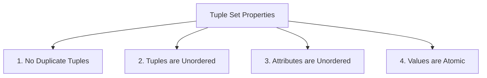
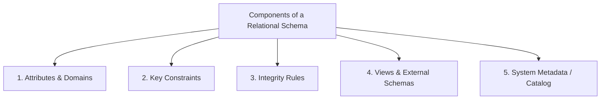

# Relational Database Management Systems (RDBMS):

---

# Topic: Formal Mechanics of Relational Schemas, Relation Instances, and Database Schemas

---

## 1. Prerequisites & Mathematical Context

To understand relational schemas, we must first look at the mathematical foundation established by Dr. E.F. Codd in 1970. The relational model is built directly on top of **First-Order Predicate Logic** and **Set Theory**.

```
+-----------------------------------------------------------------------------------+
|                           THE FORMAL MATHEMATICAL STACK                           |
+-----------------------------------------------------------------------------------+

                          [ First-Order Predicate Logic ]
                                        │
                                        ▼
                            [ Set Theory & Domains ]
                                        │
                                        ▼
                            [ Relation Schema (R) ]
                                        │
                                        ▼
                        [ Relation Instance (r) over R ]

```

### 1.1 Mathematical Domains

A **Domain** ($D$) is a non-empty, finite or countably infinite set of atomic values. *Atomicity* implies that every value in $D$ is indivisible as far as the relational model is concerned.

* **Domain Examples:**
* $\text{Domain of Age} = \{ x \in \mathbb{N} \mid 0 \le x \le 120 \}$
* $\text{Domain of Email} = \{ \text{valid ASCII strings matching email regex} \}$


### 1.2 The NULL Value

A special marker, $\text{NULL}$, belongs to every domain unless explicitly restricted by a integrity constraint (`NOT NULL`). $\text{NULL}$ represents a value that is either **unknown**, **missing**, or **inapplicable**. It does not equal zero ($0$) or an empty string (`""`).

---

## 2. Relation Schema

A **Relation Schema** (often termed the *Intension* or *Logical Structure* of a relation) is a static, time-invariant structural blueprint that defines the name, attributes, domain constraints, and integrity rules of a table.

```
+-----------------------------------------------------------------------------------+
|                            RELATION SCHEMA ANATOMY                                |
+-----------------------------------------------------------------------------------+

     Schema Name: STUDENT
     
     Attributes:  ( student_id : INTEGER,  name : VARCHAR(50),  gpa : FLOAT )
                     │            │         │         │          │      │
                     └─────┬──────┘         └────┬────┘          └───┬──┘
                           │                     │                   │
                  [ Name-Domain Pair ]   [ Name-Domain Pair ]  [ Name-Domain Pair ]

```

### 2.1 Formal Definition

A **Relation Schema** $R$ is denoted by:

$$R(A_1: D_1, A_2: D_2, \dots, A_n: D_n)$$

Where:

* $R$ is the name of the relation (e.g., `STUDENT`).
* $A_1, A_2, \dots, A_n$ are distinct **Attributes** (column names) that act as roles or interpretations for the underlying domains.
* $D_1, D_2, \dots, D_n$ are the respective **Domains** of the attributes, denoted by $\text{dom}(A_i) = D_i$.

When domains are implicitly understood from the context, a relation schema is simplified to:

$$R(A_1, A_2, \dots, A_n)$$

### 2.2 Structural Properties of a Relation Schema

1. **Degree (or Arity):** The total number of attributes $n$ in the schema $R$.
2. **Fixed Structural Definition:** The schema does not change during normal transaction execution; it changes only via Data Definition Language (`DDL`) operations (e.g., `ALTER TABLE`).
3. **Attribute Uniqueness:** Attribute names within the same schema must be distinct ($A_i \neq A_j$ for $i \neq j$). However, two different relation schemas may share identical attribute names.

---

## 3. Relation Instance

A **Relation Instance** (often termed the *Extension* or *State* of a relation) is a dynamic, time-variant collection of tuples that conforms to its underlying Relation Schema at a specific point in time.

```
                  RELATION INSTANCE: r(STUDENT) AT TIME t_1
                  
     student_id (INT)  │     name (VARCHAR)    │      gpa (FLOAT)
   ────────────────────┼───────────────────────┼──────────────────────
           101         │        "Alice"        │          3.9          ──► Tuple 1
           102         │         "Bob"         │          3.5          ──► Tuple 2
           103         │        "Charlie"      │          3.7          ──► Tuple 3

```

### 3.1 Formal Definition

Given a Relation Schema $R(A_1, A_2, \dots, A_n)$ with domains $D_1, D_2, \dots, D_n$, a **Relation Instance** $r(R)$ is a finite subset of the Cartesian Product of those domains:

$$r(R) \subseteq D_1 \times D_2 \times \dots \times D_n = \prod_{i=1}^{n} D_i = \{ (d_1, d_2, \dots, d_n) \mid d_i \in D_i \}$$

Each element $t = (d_1, d_2, \dots, d_n)$ in $r(R)$ is an **$n$-tuple** (or row).

Formally, a tuple $t$ can be defined as a mapping from the set of attribute names $\{A_1, A_2, \dots, A_n\}$ to their corresponding domain values:

$$t[A_i] \in \text{dom}(A_i)$$

### 3.2 Formal Mathematical Properties of Relation Instances



1. **No Duplicate Tuples:** Because $r(R)$ is defined as a mathematical **Set**, no two tuples can be identical:

$$\forall t_1, t_2 \in r(R), \quad t_1 \neq t_2$$


2. **Unordered Rows:** Sets have no inherent order. The sequence of tuples in $r(R)$ carries no logical meaning:

$$\{t_1, t_2, t_3\} \equiv \{t_3, t_1, t_2\}$$


3. **Unordered Attributes:** An attribute value is accessed by its attribute name $t[A_i]$, not by its positional index.
4. **Atomic Values:** Every component $t[A_i]$ in a tuple is a single, indivisible scalar value from $\text{dom}(A_i)$.

---

## 4. Intension vs. Extension: Structural Comparison

```
+-----------------------------------------------------------------------------------+
|                           INTENSION VS EXTENSION METAPHOR                         |
+-----------------------------------------------------------------------------------+

     INTENSION (Relation Schema)                   EXTENSION (Relation Instance)
     
     +-------------------------------+             +-------------------------------+
     | CREATE TABLE Student (        |             |  101  |  "Alice"  |  3.9      |
     |   student_id INT PRIMARY KEY, |             +-------------------------------+
     |   name VARCHAR(50),           |   =======>  |  102  |   "Bob"   |  3.5      |
     |   gpa FLOAT                   |             +-------------------------------+
     | );                            |             |  103  | "Charlie" |  3.7      |
     +-------------------------------+             +-------------------------------+
     
     * Static structural rule                      * Dynamic state of data
     * Changes via DDL (rare)                      * Changes via DML (frequent)

```

| Dimension | Relation Schema (Intension) | Relation Instance (Extension) |
| --- | --- | --- |
| **Concept** | The structural definition/blueprint of the table. | The actual data contents stored at a given time. |
| **Time Behavior** | **Static:** Invariant unless altered by database administrators. | **Dynamic:** Changes continuously via `INSERT`, `UPDATE`, and `DELETE`. |
| **Defined Via** | Data Definition Language (`DDL`). | Data Manipulation Language (`DML`). |
| **Mathematical Analogy** | The declaration of a Type/Class. | An Instance/Object instantiated in memory. |
| **Cardinality Impact** | Determines the **Degree** ($n = \text{number of columns}$). | Determines the **Cardinality** ($m = \vert{}r(R)\vert{} = \text{number of rows}$). |

---

## 5. Relational Database Schema and Relational Database Instance

A single relation rarely exists in isolation. Real-world systems model entire domains through a collection of interconnected relations.

```mermaid
graph TD
    subgraph Relational Database Schema S
        S1[R1: STUDENT Schema]
        S2[R2: COURSE Schema]
        S3[R3: ENROLLMENT Schema]
        
        S3 -->|FK: student_id| S1
        S3 -->|FK: course_id| S2
    end

    subgraph Integrity Constraints IC
        IC1[Primary Key Rules]
        IC2[Foreign Key Rules]
        IC3[Check Constraints]
    end

    Relational Database Schema S --> Integrity Constraints IC

```

### 5.1 Relational Database Schema ($\mathcal{S}$)

A **Relational Database Schema** $\mathcal{S}$ is a set of Relation Schemas together with a set of global Integrity Constraints ($\mathcal{IC}$):

$$\mathcal{S} = (\{R_1, R_2, \dots, R_m\}, \mathcal{IC})$$

Where:

* $\{R_1, R_2, \dots, R_m\}$ is the collection of relation schemas constituting the database.
* $\mathcal{IC}$ is the set of global constraints (such as referential integrity rules, foreign keys, and enterprise assertions).

### 5.2 Relational Database Instance ($\mathcal{db}$)

A **Relational Database Instance** $\mathcal{db}$ (or Database State) over a database schema $\mathcal{S} = \{R_1, R_2, \dots, R_m\}$ is a set of corresponding relation instances:

$$\mathcal{db} = \{r_1, r_2, \dots, r_m\}$$

such that each relation instance $r_i$ conforms to its schema $R_i$ and satisfies all integrity constraints in $\mathcal{IC}$.

A database instance is termed **Valid** if and only if it satisfies all constraints defined in $\mathcal{IC}$ simultaneously.

---

## 6. Detailed Components of a Schema

A complete relational schema contains several fundamental components that define how data is structured, validated, and linked.



### Component 1: Attributes and Domains

* **Attribute Name:** The symbolic label assigned to a column.
* **Domain Specification:** The explicit data type (`INT`, `VARCHAR`, `TIMESTAMP`, `DECIMAL`) and range boundaries governing allowed values.

---

### Component 2: Key Constraints

Key constraints enforce uniquely identifiable records across the database.

```
                      KEY CONSTRAINT HIERARCHY
                      
             Super Key (SK) - Any unique attribute combination
                  │
                  ▼
          Candidate Key (CK) - Minimal Super Key (no redundant attributes)
                  │
                  ├──► Primary Key (PK) - Explicitly chosen Candidate Key
                  │
                  └──► Alternate Key (AK) - Unchosen Candidate Keys

```

* **Super Key ($SK$):** An attribute set $K \subseteq R$ such that no two distinct tuples in $r(R)$ share identical values for $K$:

$$\forall t_1, t_2 \in r(R), \quad t_1 \neq t_2 \implies t_1[SK] \neq t_2[SK]$$


* **Candidate Key ($CK$):** A minimal super key. An attribute set $CK$ is a candidate key if:
1. $CK$ is a Super Key.
2. Removing any attribute $A$ from $CK$ leaves a set that is *not* a super key (Irreducibility).


* **Primary Key ($PK$):** The specific candidate key chosen by the database architect to uniquely identify tuples.
* **Foreign Key ($FK$):** An attribute set in relation $R_2$ that references a candidate key in relation $R_1$, establishing an inter-relational link.

---

### Component 3: Domain and Integrity Constraints

Database engines enforce constraints at the schema level to maintain data correctness:

1. **Domain Constraint:** Restricts attribute values to the set defined by its domain:

$$t[A_i] \in \text{dom}(A_i) \quad \cup \quad \{\text{NULL}\}$$


2. **Entity Integrity Constraint:** No primary key attribute value can be $\text{NULL}$:

$$\forall A \in PK(R), \quad t[A] \neq \text{NULL}$$


3. **Referential Integrity Constraint:** Ensures that a value in a foreign key column must either match an existing primary key value in the referenced relation or be completely $\text{NULL}$:

$$\forall t_2 \in r_2(R_2), \quad t_2[FK] \neq \text{NULL} \implies \exists t_1 \in r_1(R_1) \text{ such that } t_2[FK] = t_1[PK]$$


4. **User-Defined Constraints (Business Rules):** Expressed using `CHECK` clauses or triggers (e.g., `CHECK (salary > 0)`).

---

### Component 4: Views and External Schemas

A **View** is a virtual relation derived dynamically from one or more base relations via a stored query. Views provide **Logical Data Independence** by hiding underlying base table structural changes from end-user applications.

```sql
CREATE VIEW HighGPAStudents AS
SELECT student_id, name, gpa
FROM Student
WHERE gpa >= 3.8;

```

---

### Component 5: Data Dictionary (System Catalog)

The **Data Dictionary** (or System Catalog) is the internal subsystem where the RDBMS stores metadata describing every schema, table, column, key, and user privilege in the database.

> In an RDBMS, system metadata is stored in **standard relational tables** that can be queried using standard `SELECT` statements (e.g., `information_schema.tables`).

---

## 7. Concrete SQL Implementation Example

Here is a complete SQL script demonstrating a **Database Schema** containing two relation schemas (`Department` and `Employee`), complete with integrity constraints, keys, and foreign key rules:

```sql
-- 1. Relation Schema: Department
CREATE TABLE Department (
    dept_id INT NOT NULL,
    dept_name VARCHAR(100) NOT NULL,
    budget DECIMAL(12, 2) DEFAULT 0.00,
    
    -- Primary Key Constraint
    CONSTRAINT pk_department PRIMARY KEY (dept_id),
    
    -- Candidate Key / Unique Constraint
    CONSTRAINT unq_dept_name UNIQUE (dept_name),
    
    -- User-Defined Constraint
    CONSTRAINT chk_budget CHECK (budget >= 0.00)
);

-- 2. Relation Schema: Employee
CREATE TABLE Employee (
    emp_id INT NOT NULL,
    first_name VARCHAR(50) NOT NULL,
    last_name VARCHAR(50) NOT NULL,
    salary DECIMAL(10, 2) NOT NULL,
    dept_id INT, -- Foreign Key attribute linking to Department
    
    -- Primary Key Constraint
    CONSTRAINT pk_employee PRIMARY KEY (emp_id),
    
    -- User-Defined Integrity Constraint
    CONSTRAINT chk_salary CHECK (salary >= 30000.00),
    
    -- Referential Integrity Constraint (Foreign Key)
    CONSTRAINT fk_emp_dept FOREIGN KEY (dept_id)
        REFERENCES Department(dept_id)
        ON DELETE SET NULL
        ON UPDATE CASCADE
);

```

---

## 8. Comparative Technical Matrix

| Dimension | Attribute | Tuple | Relation Schema | Relation Instance | Database Schema |
| --- | --- | --- | --- | --- | --- |
| **Formal Definition** | Named role over a domain $A_i$. | Ordered $n$-tuple element of $D_1 \times \dots \times D_n$. | Structural specification $R(A_1, \dots, A_n)$. | Set of tuples $r(R) \subseteq \prod D_i$. | Set of schemas $(\{R_i\}, \mathcal{IC})$. |
| **Relational Term** | Column | Row | Table Definition | Table State | Database Blueprint |
| **Temporal Nature** | Static | Dynamic | Static | Dynamic | Static |
| **Mathematical Class** | Set Element | Vector / Mapping | Relation Type | Set of Vectors | Set of Relation Types |
| **DDL / DML Focus** | `ALTER TABLE` | `INSERT`/`UPDATE` | `CREATE TABLE` | Query State | `CREATE DATABASE` |

---

## 9. High-Yield Exam Questions & Critical Answers

### 🎓 Exam Question 1: Formal Proof of Super Key Cardinality

**Question:** Let $R(A_1, A_2, A_3, A_4)$ be a relation schema where $K = \{A_1, A_2\}$ is a Candidate Key. Calculate the total number of possible Super Keys that can be formed from the attributes of $R$. Derive the general formula for a schema with $n$ total attributes and a Candidate Key composed of $k$ attributes.

**Answer:**

1. **Definition of Super Key:** Any superset of a Candidate Key is a Super Key.
2. **Analysis for Schema $R$:**
* The candidate key is $K = \{A_1, A_2\}$, which has $k = 2$ attributes.
* The remaining attributes in $R$ are $\{A_3, A_4\}$, which has $n - k = 4 - 2 = 2$ attributes.
* A super key must contain all attributes in $K$ plus any subset of the remaining attributes $\{A_3, A_4\}$.
* The number of subsets of a set of size $n - k$ is $2^{n-k}$.
* Therefore, for schema $R$, the total number of super keys is $2^{4-2} = 2^2 = 4$.
* The 4 super keys are: $\{A_1, A_2\}$, $\{A_1, A_2, A_3\}$, $\{A_1, A_2, A_4\}$, and $\{A_1, A_2, A_3, A_4\}$.


3. **General Formula:** For a relation schema with $n$ total attributes and a single candidate key of size $k$, the total number of super keys $S_{count}$ is given by:

$$S_{count} = 2^{n - k}$$

---

### 🎓 Exam Question 2: Why SQL Tables Allow Duplicates while Relation Instances Do Not

**Question:** Explain mathematically why a Relation Instance in pure relational theory prohibits duplicate tuples, whereas SQL tables permit duplicate rows. Discuss the practical implications of this divergence.

**Answer:**

1. **Mathematical Reason:** In formal relational theory, a relation instance $r(R)$ is defined as a **mathematical set**. By definition, sets do not contain duplicate elements ($a \in S$ and $a \in S$ resolves to a single element $a$). Therefore, two identical tuples cannot exist in $r(R)$.
2. **SQL Reality:** SQL tables are implementation constructs based on **multisets** (or bags). SQL permits duplicate rows unless a `PRIMARY KEY` or `UNIQUE` constraint is explicitly specified.
3. **Practical Implications:**
* **Performance:** Checking for and removing duplicate rows during every `INSERT` operation requires building an index or running a costly uniqueness check. SQL allows duplicates by default to optimize insertion speed.
* **Relational Operators:** Operations like projection (`SELECT column_name FROM table`) retain duplicate values in SQL unless the user explicitly invokes the set operator `DISTINCT` (`SELECT DISTINCT column_name FROM table`).


---

## 10. Frequently Asked Technical Interview Questions

### Q1: What is the difference between a Candidate Key, a Primary Key, and a Super Key?

**Answer:**

* A **Super Key** is any set of attributes that uniquely identifies a row in a table. It may contain redundant attributes that are not strictly necessary for uniqueness.
* A **Candidate Key** is a *minimal* Super Key—meaning if you remove any attribute from it, it loses the ability to uniquely identify the row. A table can have multiple Candidate Keys.
* The **Primary Key** is the specific Candidate Key chosen by the database designer to act as the official identifier for the table's records.

---

### Q2: How does the database engine handle Referential Integrity when a referenced Primary Key is updated or deleted?

**Answer:** When a Primary Key record referenced by a Foreign Key is modified or deleted, the engine evaluates the rule specified in the Foreign Key definition:

* `ON DELETE / UPDATE CASCADE`: Automatically deletes or updates the matching child rows in the foreign key table.
* `ON DELETE / UPDATE SET NULL`: Sets the foreign key column values in child rows to `NULL`.
* `ON DELETE / UPDATE RESTRICT / NO ACTION`: Blocks the operation and raises a foreign key violation error.
* `ON DELETE / UPDATE SET DEFAULT`: Sets the foreign key column values in child rows to their defined default value.

---

### Q3: What is the difference between Schema Intension and State Extension during database execution?

**Answer:** The **Schema Intension** is the compile-time structural contract defined using DDL (e.g., table structure, data types, constraints). It remains constant during day-to-day operations. The **State Extension** is the runtime collection of data stored in memory or on disk. It changes continuously as applications execute DML statements (`INSERT`, `UPDATE`, `DELETE`).

---

## 11. Topic Summary

```
                SUMMARY MAP: RELATIONAL SCHEMA MECHANICS
                
                  ┌──────────────────────────────────┐
                  | Relational Database Architecture |
                  └─────────────────┬────────────────┘
                                    │
    ┌───────────────────────────────┼───────────────────────────────┐
    ▼                               ▼                               ▼
[ Relation Schema (R) ]   [ Relation Instance (r) ]   [ Schema Components ]
• Static Intension        • Dynamic Extension         • Domains & Attributes
• Structure & Types       • Set of Tuples             • Keys (SK, CK, PK, FK)
• Defined via DDL         • Defined via DML           • Integrity Constraints
• Immutable during transactions • Time-variant State   • System Metadata Catalog

```

1. **Relation Schema ($R$):** The static structural blueprint ($R(A_1, A_2, \dots, A_n)$) that defines attribute names, domain mappings, and integrity rules.
2. **Relation Instance ($r$):** The dynamic, time-variant mathematical set of tuples ($r(R) \subseteq D_1 \times \dots \times D_n$) stored at a given moment.
3. **Database Schema ($\mathcal{S}$):** A collection of relation schemas $(\{R_1, \dots, R_m\}, \mathcal{IC})$ bound together by global integrity constraints.
4. **Core Components:** Attributes, Domains, Keys (Super, Candidate, Primary, Foreign), Integrity Rules (Entity, Referential, Domain), and the System Catalog.

---