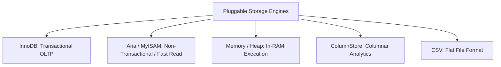
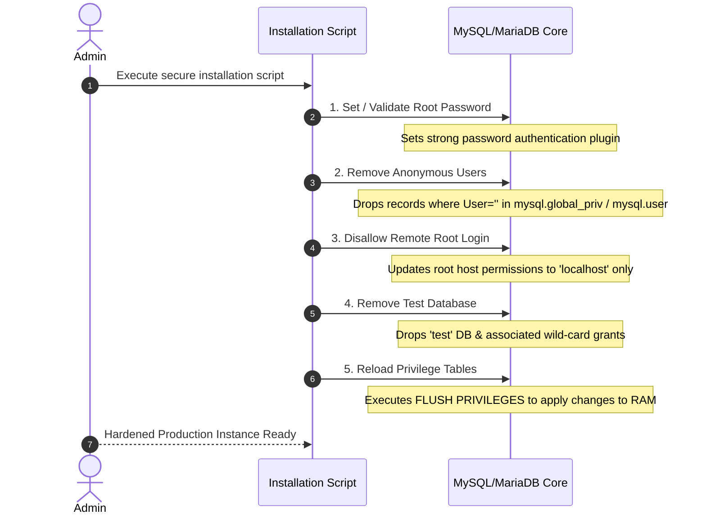

# MySQL & MariaDB

---

## 1. Introduction & Foundational Concepts

### What is MySQL?

**MySQL** is an open-source **Relational Database Management System (RDBMS)** built on **Structured Query Language (SQL)**. It organizes data into tables consisting of rows (tuples) and columns (attributes), enforcing value-based constraints (Primary Keys, Foreign Keys) to maintain relational integrity across schemas.

```
                    +--------------------------------+
                    |        Client Application      |
                    +--------------------------------+
                                    │
                                SQL Queries
                                    │
                                    ▼
┌───────────────────────────────────────────────────────────────────────┐
│                           MySQL / MariaDB                             │
│                                                                       │
│  ┌─────────────────────────────────────────────────────────────────┐  │
│  │                    SQL Parser & Optimizer                       │  │
│  └─────────────────────────────────────────────────────────────────┘  │
│                                   │                                   │
│                     Pluggable Storage Engine API                      │
│                                   │                                   │
│     ┌──────────────┬──────────────┼──────────────┬──────────────┐     │
│     ▼              ▼              ▼              ▼              ▼     │
│  [InnoDB]     [Aria/MyISAM]  [ColumnStore]    [Memory]      [CSV]     │
└───────────────────────────────────────────────────────────────────────┘

```

---

### Origin of MySQL

* **1995:** Created by Swedish company **MySQL AB**, founded by **Michael "Monty" Widenius**, **David Axmark**, and **Allan Larsson**.
* **Naming:** Named after Monty Widenius's eldest daughter, **My**. The prefix `My` combined with `SQL` gave the database its name.
* **Corporate Acquisitions:**
* **2008:** Sun Microsystems acquired MySQL AB for $1 Billion.
* **2010:** Oracle Corporation acquired Sun Microsystems, bringing MySQL under Oracle ownership.


---

### Current Status of MySQL

MySQL is developed, maintained, and commercially supported by **Oracle Corporation**. It employs a **dual-licensing model**:

1. **MySQL Community Server:** Free, open-source software under the **GNU General Public License (GPL v2)**.
2. **MySQL Enterprise Edition:** Proprietary commercial software featuring advanced security (Dynamic Data Masking, Firewall), monitoring, and enterprise support.

Oracle uses an **LTS (Long-Term Support) and Innovation** release model:

* **LTS Releases:** Production-focused streams receiving 8 years of support (e.g., MySQL 8.4 LTS, MySQL 9.7 LTS).
* **Innovation Releases:** Feature-driven releases using a calendar versioning scheme (`YY.M.P`, such as MySQL 26.7.0 Innovation) to introduce new capabilities quarterly.

---

### What is MariaDB?

**MariaDB** is an open-source relational database engine created in 2009 by Monty Widenius and original MySQL core developers following Oracle's acquisition of Sun Microsystems.

* **Motivation:** Built to preserve a fully open-source, community-driven alternative to MySQL under the GPL v2 license, mitigating concerns over commercial lock-in.
* **Naming:** Named after Monty Widenius’s youngest daughter, **Maria**.
* **Governance:** Developed by the **MariaDB Foundation** (community standard) and commercially backed by **MariaDB plc / MariaDB Corporation**.

---

### MySQL vs. MariaDB: Architectural Divergence

While MariaDB originally started as a drop-in replacement for MySQL, the two databases have diverged significantly over time.

| Architectural Feature | MySQL | MariaDB |
| --- | --- | --- |
| **Primary Storage Engine** | **InnoDB** (Oracle proprietary enhancements) | **InnoDB** + **Aria** (Crash-safe MyISAM replacement) |
| **Analytical Engine** | **HeatWave** (Commercial Cloud Only) | **ColumnStore** (Open-source columnar engine) |
| **Replication Tech** | Group Replication, InnoDB Cluster | Galera Cluster, Multi-source Replication |
| **Thread Handling** | Standard 1-thread-per-connection (Thread Pool in Community 26.7+) | Built-in **Dynamic Thread Pool** |
| **JSON Implementation** | Native binary JSON type (`JSON_STORAGE`) | Text-based JSON with JSON path functions |
| **Licensing** | GPL v2 (Community) / Proprietary (Enterprise) | Strictly GPL v2 (Server) |

---

## 2. Client-Server Architecture Mechanics

MySQL and MariaDB operate on a **Multi-Threaded Client-Server Architecture**.

```
[ Client Applications ] ──( TCP/IP / Unix Socket / Named Pipe )──► [ Network Listener ]
                                                                        │
                                                                 Thread Pool / Handshake
                                                                        │
                                                                        ▼
                                                             [ SQL Parser & Optimizer ]
                                                                        │
                                                                        ▼
                                                             [ Execution Engine ]
                                                                        │
                                                           Pluggable Engine API
                                                                        │
                                                                        ▼
                                                             [ InnoDB / Aria Engines ]

```

### Process Flow

1. **Client Layer:** Applications connect to the database server using protocol drivers (`libmysqlclient`, JDBC, ODBC, Python `mysql-connector`).
2. **Server Layer (`mysqld` / `mariadbd` daemon):**
* **Connection Manager:** Listens on network ports (Default: **3306**), authenticates user credentials, and manages TLS handshake layers.
* **Thread Pool:** Assigns a thread to handle queries for the client connection.
* **Parser & Lexer:** Converts raw SQL into an **Abstract Syntax Tree (AST)**.
* **Optimizer:** Evaluates execution paths using cost models, index statistics, and table statistics to pick the optimal query plan.
* **Execution Engine:** Executes the optimized plan by issuing low-level API calls to the storage engine layer.


---

## 3. Core Architectural Engine Features

### 1. ACID Compliance

Both database systems enforce **ACID guarantees** primarily via the **InnoDB Storage Engine**:

```
                              ACID GUARANTEES IN INNODB
                              
   ATOMICITY             CONSISTENCY           ISOLATION            DURABILITY
 ┌─────────────┐       ┌──────────────┐      ┌────────────┐       ┌─────────────┐
 │ Undo Logs   │       │ Foreign Keys │      │ MVCC &     │       │ Redo Logs   │
 │ Rollback    │       │ Unique Keys  │      │ Row Locks  │       │ Doublewrite │
 └─────────────┘       └──────────────┘      └────────────┘       └─────────────┘

```

* **Atomicity:** All statements within a transaction succeed or fail as a single unit. Handled via **Undo Logs** (rolling back modifications on failure).
* **Consistency:** The database transitions from one valid state to another, enforcing constraints (Primary Key, Foreign Key, `CHECK`). Handled via system checks and **Doublewrite Buffers** (preventing partial page writes).
* **Isolation:** Ensures concurrent transactions execute without data corruption. Handled via **Multi-Version Concurrency Control (MVCC)** and locking modes (Read Committed, Repeatable Read, Serializable).
* **Durability:** Committed transactions persist even during severe system crashes. Handled via **Redo Logs (`ib_logfile`)** and flush-to-disk policies (`innodb_flush_log_at_trx_commit = 1`).

---

### 2. Pluggable Storage Engine Architecture

The database storage engine layer is decoupled from the SQL parsing engine via an API. Different engines can be selected per table.

```sql
CREATE TABLE transaction_history (
    tx_id INT PRIMARY KEY,
    amount DECIMAL(10,2)
) ENGINE = InnoDB; -- Engine specified at DDL execution

```

#### Major Storage Engines Overview



1. **InnoDB:** The default, general-purpose transactional engine. Features row-level locking, MVCC, foreign key enforcement, and crash recovery.
2. **Aria (MariaDB) / MyISAM (MySQL):** Non-transactional engines optimized for heavy read operations. Use table-level locking. Aria adds crash-safety features.
3. **Memory (HEAP):** Stores tables in RAM using hash indexes for high-speed temporary caching. Data is lost upon server restart.
4. **ColumnStore (MariaDB):** Columnar storage engine designed for distributed real-time analytical workloads (OLAP).
5. **CSV:** Stores records directly on disk as plain text comma-separated files.

---

## 4. Technical Specifications, Limits, and Data Types

### Data Type Support Matrix

| Category | Supported Fields / Types | Technical Notes |
| --- | --- | --- |
| **Numeric** | `TINYINT`, `SMALLINT`, `MEDIUMINT`, `INT`, `BIGINT`, `DECIMAL`, `FLOAT`, `DOUBLE` | `DECIMAL` provides exact fixed-point precision for financial data. |
| **String** | `VARCHAR`, `CHAR`, `TEXT` (`TINY`, `MEDIUM`, `LONG`), `BLOB` | `VARCHAR` max length is 65,535 bytes (shared across row). |
| **Date / Time** | `DATE`, `TIME`, `DATETIME`, `TIMESTAMP`, `YEAR` | `TIMESTAMP` uses 32-bit Unix epoch (converts to UTC). |
| **JSON** | `JSON` | Native validation, auto-indexing via generated virtual columns. |
| **Spatial** | `GEOMETRY`, `POINT`, `LINESTRING`, `POLYGON` | Implements OpenGIS specifications using R-Tree spatial indexes. |
| **Vectors** | `VECTOR` | Supported for AI embeddings and similarity searches. |

---

### Database and Table Physical Limits

| Component | Maximum Limits | Determinant Factors |
| --- | --- | --- |
| **Max Databases** | **Unlimited** (Practical limits set by OS file descriptor boundaries) | File system inode count. |
| **Max Tables per DB** | **Unlimited** (Up to ~4 Billion in InnoDB) | Operating system directory file count limits. |
| **Max Table Size** | **64 Terabytes** (InnoDB) | Constrained by InnoDB 16KB page space bounds ($2^{32} \times 16\text{KB}$). |
| **Max Row Size** | **65,535 Bytes** | Shared limit across scalar columns (excludes off-page `BLOB`/`TEXT` pointers). |
| **Max Columns per Table** | **1,017 Columns** (InnoDB) | Hard limit enforced by the internal engine table tuple definition. |
| **Max Index Columns** | **16 Columns** per composite index | Index key length cap (typically 3072 bytes). |

---

## 5. Specialized Enterprise Paradigms: "MariaDB Edge"

**MariaDB Edge** (and small-footprint deployments) targets distributed IoT, mobile edge nodes, and hybrid cloud environments.

```
┌────────────────────────────────────────────────────────────────────────┐
│                        CENTRAL CLOUD PLATFORM                          │
│                   [ MariaDB Enterprise Cluster ]                       │
└──────────────────────────────────▲─────────────────────────────────────┘
                                   │
                      Asynchronous Replication / MaxScale
                                   │
┌──────────────────────────────────▼─────────────────────────────────────┐
│                           EDGE NODES                                   │
│  ┌───────────────────────┐                 ┌───────────────────────┐   │
│  │ Micro-MariaDB Instance │                 │ Micro-MariaDB Instance │   │
│  │ (Embedded / Gateway)   │                 │ (Embedded / Gateway)   │   │
│  └───────────────────────┘                 └───────────────────────┘   │
└────────────────────────────────────────────────────────────────────────┘

```

### Architectural Principles

* **Low Memory Footprint:** Runs in environments constrained to <512MB RAM using lightweight buffer tuning (`innodb_buffer_pool_size`).
* **Offline-First Resilience:** Local edge devices execute read/write transactions locally during network loss and reconcile state asynchronously upon reconnection.
* **Hybrid Workload Support:** Supports real-time local processing alongside light transactional workloads directly on local hardware.

---

## 6. Security Hardening: The Initial Security Script

During installation, operators execute the hardening script (`mariadb-secure-installation` or `mysql_secure_installation`). The script runs critical security tasks to protect fresh installations:



### Key Hardening Steps Executed by the Script

1. **Set/Enforce Superuser Password Security:**
* Sets a password for the `root` administrative account using secure authentication plugins (`caching_sha2_password` or `unix_socket`).


2. **Remove Anonymous User Accounts:**
* Drops default anonymous accounts (`User=''`), preventing unauthenticated local access.


3. **Disallow Remote Root Logins:**
* Updates host boundaries for `root` to `localhost` only, requiring administrative traffic to route through secure local sockets or SSH tunnels.


4. **Remove Test Database and Access Rules:**
* Drops the default `test` database and associated wildcard privileges (`GRANT ALL ON test_%`), removing public access vectors.


5. **Flush Privilege Tables:**
* Issues `FLUSH PRIVILEGES` to reload memory-cached grant tables directly from system catalogs (`mysql.user`, `mysql.db`).


---

## 7. Comparative Summary Matrix

| Metric / Dimension | MySQL | MariaDB |
| --- | --- | --- |
| **Primary Maintainer** | Oracle Corporation | MariaDB Foundation / MariaDB plc |
| **Open Source Philosophy** | Core GPL v2 / Proprietary Enterprise Extensions | Fully Open Source GPL v2 |
| **Default Engine** | InnoDB | InnoDB |
| **Non-Transactional Engine** | MyISAM | Aria |
| **ACID Engine Mechanics** | Undo/Redo Logs + Doublewrite | Undo/Redo Logs + Doublewrite |
| **Replication Methods** | Group Replication, Asynchronous, Semi-sync | Galera Cluster, Multi-source, Asynchronous |
| **Primary Max Table Size** | 64 TB | 64 TB |
| **Initial Security Script** | `mysql_secure_installation` | `mariadb-secure-installation` |

---