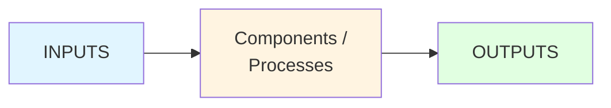
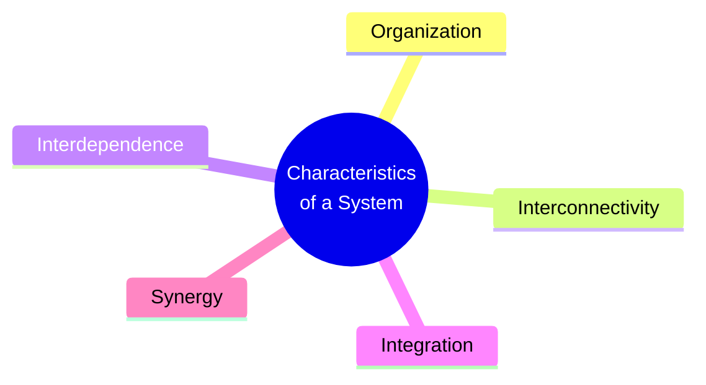
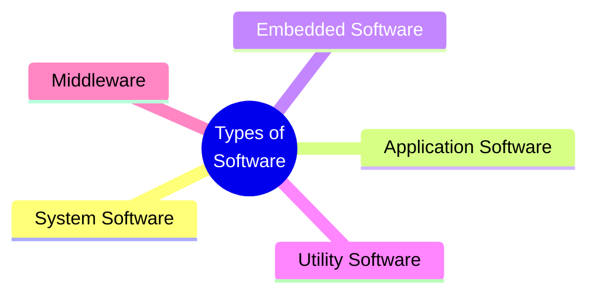
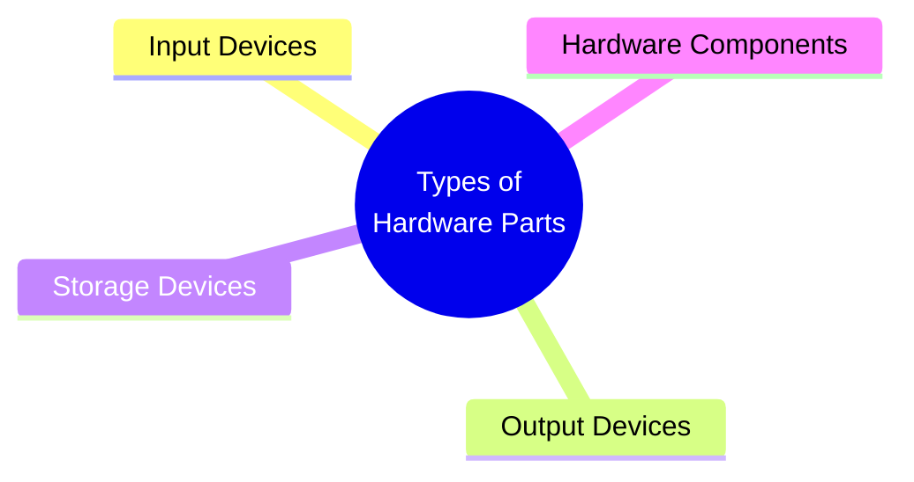
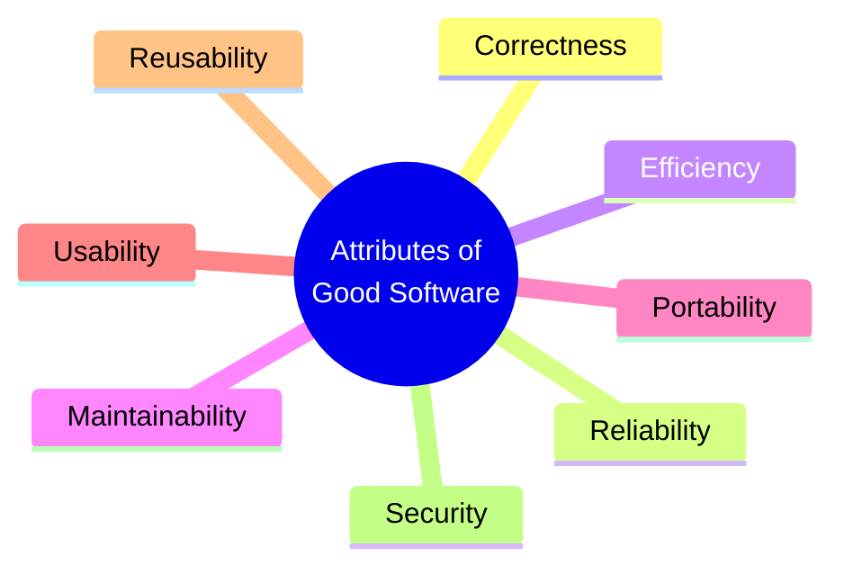
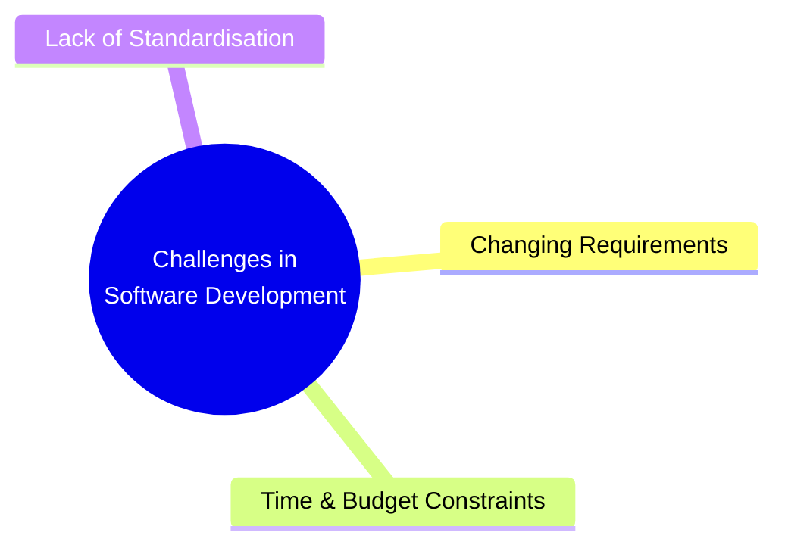
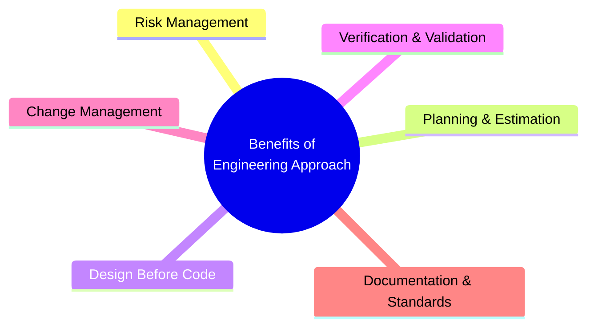
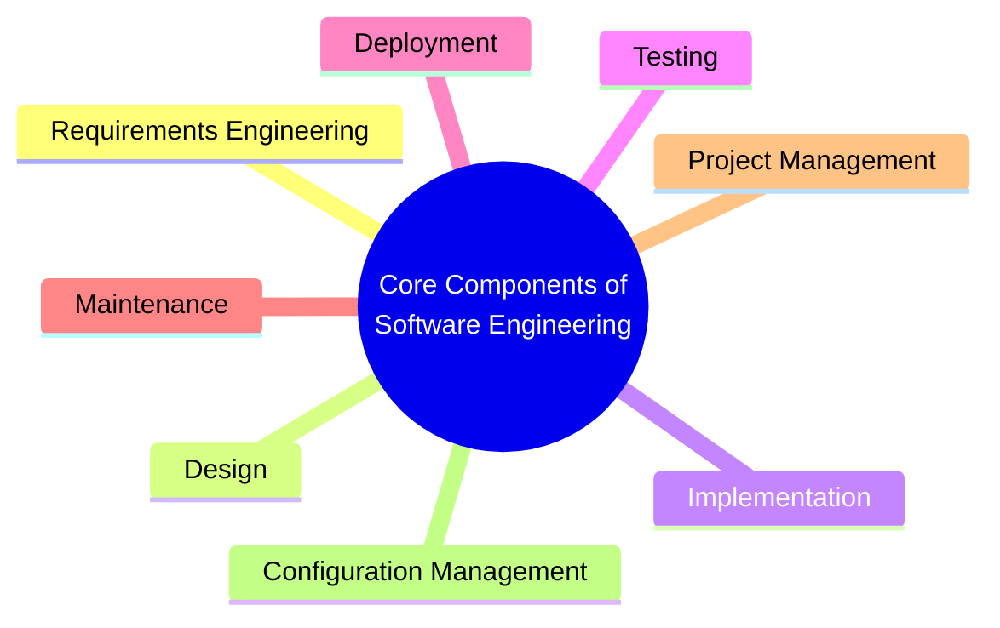
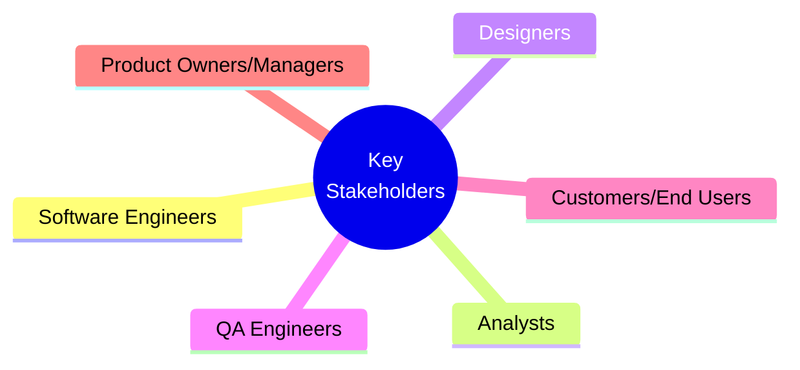
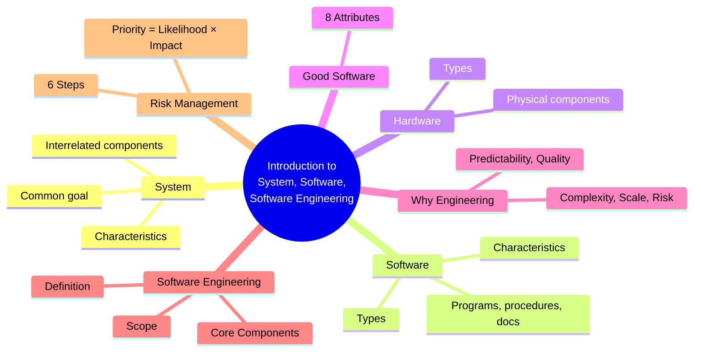

# Introduction to System, Software, and Software Engineering — Master's-Level Notes

> **Course Context:** Software Engineering (Agile Practices)
> **Topic:** Introduction to System Concepts, Software, Software Engineering, and Risk Management
> **Prerequisites:** None — this is a foundational topic.

---

## 1. What is a System?

### 1.1 Definition

> A **system** is a **set of interrelated components working together toward a common goal**.

**Key Characteristics:**
- It can be **physical**, **conceptual**, or a **combination of both**.
- A **component** is a **distinct part of a system** that performs a **specific function** and **interacts with other parts** of the system.

### 1.2 Basic System Model



> **Key Insight:** Every system takes **inputs**, processes them through **components**, and produces **outputs**.

---

## 2. Characteristics of a System

Systems exhibit **five key characteristics**:



| **#** | **Characteristic** | **Description** |
|---|---|---|
| **1** | **Organization** | Every system is organized with **structure and order**. |
| **2** | **Interconnectivity** | All components are **connected and affect one another** — like in an OS kernel, shell, process management, memory management, file system, and user interface. |
| **3** | **Interdependence** | No component functions in isolation; **changes in one affect others**. |
| **4** | **Integration** | All parts work together **in harmony**. |
| **5** | **Synergy** | The whole system achieves **more than the sum of its parts**. |

> **Exam Tip:** A common exam question is *"List and explain the characteristics of a system."* — Memorize the **five characteristics** and give an example (e.g., OS kernel).

---

## 3. What is Software?

### 3.1 Definition

> **Software** is a general term for **digital programs, scripts, and code**.

> More formally, **software** is a **collection of programs, procedures, and associated documentation** concerned with the **operation of a data processing system**.

### 3.2 Types of Software



| **#** | **Type** | **Description** | **Examples** |
|---|---|---|---|
| **1** | **System Software** | Manages hardware, provides platform for applications | OS, device drivers |
| **2** | **Application Software** | Performs specific tasks for users | Word processors, browsers |
| **3** | **Embedded Software** | Built into hardware devices | Firmware, IoT software |
| **4** | **Utility Software** | Maintains and optimizes the system | Antivirus, disk cleaners |
| **5** | **Middleware** | Connects different software applications | APIs, message brokers |

### 3.3 Characteristics of Software

| **#** | **Characteristic** | **Description** |
|---|---|---|
| **1** | **Intangibility** | Cannot be touched or seen directly; exists only in **logical form**. |
| **2** | **Complexity** | Software systems are **highly complex** due to varied user needs and evolving technologies. |
| **3** | **Evolvability (Changeability)** | Software must **change frequently** due to user requirements, bugs, market demand. *Example: Microsoft Word evolved; BlackBerry phone phased out.* |
| **4** | **Invisibility** | Unlike mechanical systems, software processes are often **not visible or intuitive**. |
| **5** | **Reusability** | Code can be **reused across projects** with minor changes. |
| **6** | **No Manufacturing** | Development is mainly **logical and creative**; no physical production line. |

> **Exam Tip:** A common question is *"What are the characteristics of software?"* — Contrast with hardware: **intangible vs tangible**, **logical vs physical**.

---

## 4. What is Hardware?

### 4.1 Definition

> In a computer, **hardware** refers to the **physical, tangible components** that make up the machine.

- These are the parts you can **see and touch**, like the **keyboard, monitor, and CPU**.

### 4.2 Types of Hardware Parts



| **#** | **Type** | **Examples** |
|---|---|---|
| **1** | **Input Devices** | Keyboard, mouse, scanner |
| **2** | **Output Devices** | Monitor, printer, speakers |
| **3** | **Storage Devices** | Hard drive, SSD, USB |
| **4** | **Hardware Components** | CPU, motherboard, RAM |

---

## 5. Attributes of Good Software

> Good software exhibits **eight key attributes**:

| **#** | **Attribute** | **Explanation** |
|---|---|---|
| **1** | **Correctness** | The software meets all **functional requirements**. |
| **2** | **Reliability** | The software performs **consistently** under expected conditions. |
| **3** | **Efficiency** | The software uses resources (CPU, memory) **effectively**. |
| **4** | **Maintainability** | Easy to **update, fix, or enhance** after delivery. |
| **5** | **Portability** | Can operate across **various environments or platforms**. |
| **6** | **Usability** | Easy to **learn and use** by the target audience. |
| **7** | **Reusability** | Software components can be **reused in other systems**. |
| **8** | **Security** | **Protects data and operations** from unauthorized access or failures. |



> **Exam Tip:** A common question is *"What are the attributes of good software?"* — Memorize all **eight attributes** with brief explanations.

---

## 6. Why Treat Software Like Engineering?

### 6.1 Reasons

| **#** | **Reason** | **Description** |
|---|---|---|
| **1** | **Complexity** | Software systems today are **large**, often consisting of **millions of lines of code**. |
| **2** | **Scale** | They support **global operations** (e.g., Google, Amazon) with **millions of users**. |
| **3** | **Cost & Risk** | Software failure can result in **loss of money, lives, or reputation**. |
| **4** | **Predictability** | Like bridges or airplanes, software needs **consistent results**, especially in safety-critical domains. |
| **5** | **Quality Assurance** | Engineering ensures defects are **minimized** via **systematic verification and validation**. |
| **6** | **Maintainability** | Engineered systems are easier to **evolve, maintain, and scale**. |

### 6.2 Traditional Engineering vs Software Engineering

| **Traditional Engineering** | **Software Engineering** |
|---|---|
| e.g., Bridge | e.g., Banking System |
| Blueprint | Software Design |
| Materials | Code & Components |
| Construction | Development |
| Quality Inspection | Testing |
| Maintenance | Updates & Bug Fixes |
| Safety Standards | Coding Standards |
| Project Manager | Scrum Master / Project Manager |

> **Key Insight:** Software engineering borrows **principles and practices** from traditional engineering — **design before construction**, **quality inspection**, **maintenance**, and **standards**.

---

## 7. Challenges in Software Development

> Software development faces **three major challenges**:



| **#** | **Challenge** | **Description** |
|---|---|---|
| **1** | **Changing Requirements** | Requirements evolve during development |
| **2** | **Time and Budget Constraints** | Limited resources and deadlines |
| **3** | **Lack of Standardisation** | No universal standards across all projects |

---

## 8. Why Ad Hoc Development Fails

> **Ad hoc development** (without a formal process) fails because:

| **#** | **Reason** | **Description** |
|---|---|---|
| **1** | **No formal process or methodology** | No structured approach |
| **2** | **Minimal planning** | Lack of foresight |
| **3** | **Limited documentation** | Knowledge not captured |
| **4** | **No version control or traceability** | Changes untracked |
| **5** | **Decisions driven by individuals, not systems** | Inconsistent, subjective |

> **Key Insight:** Ad hoc development leads to **unpredictable results**, **poor quality**, and **project failure**.

---

## 9. Benefits of an Engineering Approach

| **#** | **Engineering Principle** | **Benefit** |
|---|---|---|
| **1** | **Risk Management** | Identify and mitigate technical, schedule, and market risks early |
| **2** | **Planning & Estimation** | Realistic timelines and budgets based on models, not intuition |
| **3** | **Design Before Code** | Better modularity, performance, and reusability |
| **4** | **Verification & Validation** | Early defect detection and fewer post-deployment bugs |
| **5** | **Change Management** | Controlled incorporation of new requirements |
| **6** | **Documentation & Standards** | Easier onboarding, support, and auditing |



---

## 10. Definition of Software Engineering

> **Software engineering** is the application of a **systematic, disciplined, quantifiable approach** to the **development, operation, and maintenance of software**.

**Key Words:**
- **Systematic** — structured, methodical
- **Disciplined** — following rules and standards
- **Quantifiable** — measurable, metrics-driven

---

## 11. Core Components of Software Engineering



| **#** | **Component** | **Description** |
|---|---|---|
| **1** | **Requirements Engineering** | Identifying, analyzing, documenting, and managing software needs. |
| **2** | **Design** | Creating architectural and detailed designs for software components. |
| **3** | **Implementation (Coding)** | Translating designs into functional programs using programming languages. |
| **4** | **Testing** | Verifying and validating the software works as intended. |
| **5** | **Deployment** | Delivering the product to users (e.g., installation, release). |
| **6** | **Maintenance** | Post-deployment fixes, enhancements, and updates. |
| **7** | **Project Management** | Planning, scheduling, budgeting, and tracking the project lifecycle. |
| **8** | **Configuration Management** | Managing changes to code, documents, and other artifacts. |

> **Exam Tip:** A common question is *"What are the core components of software engineering?"* — Memorize all **eight components**.

---

## 12. Scope of Software Engineering: Activities

| **#** | **Activity** | **Description** |
|---|---|---|
| **1** | **Software Process Models** | e.g., Waterfall, Agile |
| **2** | **Project Planning and Estimation** | Timelines, budgets, resources |
| **3** | **Risk Management** | Identifying and mitigating risks |
| **4** | **Team Coordination and Communication** | Collaboration, meetings |
| **5** | **Quality Assurance** | Testing, reviews, standards |
| **6** | **User Documentation and Training** | Manuals, guides, onboarding |
| **7** | **Customer Support** | Post-deployment assistance |

---

## 13. Scope of Software Engineering: Key Stakeholders



| **#** | **Stakeholder** | **Role** |
|---|---|---|
| **1** | **Software Engineers** | Build the software |
| **2** | **Analysts** | Gather and analyze requirements |
| **3** | **Designers** | Design architecture and UI |
| **4** | **QA Engineers** | Test and ensure quality |
| **5** | **Customers/End Users** | Use the software, provide feedback |
| **6** | **Product Owners/Managers** | Prioritize features, manage stakeholders |

---

## 14. Risk Management

### 14.1 Definition

> A **risk** is a **potential problem that might affect the success of a project**.

### 14.2 Steps Involved in Risk Management

```mermaid
flowchart TD
    A[1. Risk Identification] --> B[2. Risk Analysis]
    B --> C[3. Risk Prioritization]
    C --> D[4. Risk Mitigation /<br/>Contingency Planning]
    D --> E[5. Risk Monitoring]
    E --> F[6. Risk Control/Response<br/>(Contingency)]
    F --> A
    
    style A fill:#e1f5ff
    style B fill:#fff4e1
    style C fill:#ffe1e1
    style D fill:#e1ffe1
    style E fill:#f0e1ff
    style F fill:#ffcccc
```

| **#** | **Step** | **What It Involves** |
|---|---|---|
| **1** | **Risk Identification** | Spotting possible risks before they happen |
| **2** | **Risk Analysis** | Assessing each risk's **likelihood** and **impact** |
| **3** | **Risk Prioritization** | Ranking risks so that the most critical ones are addressed first |
| **4** | **Risk Mitigation / Contingency Planning** | Defining actions to prevent the risk / reduce its impact |
| **5** | **Risk Monitoring** | Continuously watching for risks throughout the project and updating plans as needed |
| **6** | **Risk Control/Response (Contingency)** | Executing the response plan when a risk materializes |

### 14.3 Key Terms / Steps

| **Term** | **Definition** |
|---|---|
| **Risk Assessment Likelihood** | Chance that a risk will occur during the project. |
| **Risk Assessment Impact** | Severity of the consequences if the risk actually happens. |
| **Risk Assessment Priority** | How urgently a risk needs to be addressed, based on both likelihood and impact. |
| **Risk Mitigation** | Actions taken to reduce the likelihood or impact of a risk. |
| **Risk Contingency** | Backup plan or response if a risk actually occurs. |

### 14.4 Risk Management Examples

| **Risk Description** | **Likelihood** | **Impact** | **Priority (L×I)** | **Mitigation Plan** | **Contingency Plan** |
|---|---|---|---|---|---|
| Key developer may leave mid-project | High (4) | High (5) | 20 – Critical | Cross-train backup, improve retention, document code | Reassign to backup, hire contractor, adjust timeline |
| Server crash during peak sale period | Medium (3) | High (5) | 15 – High | Conduct load testing, use monitoring tools, upgrade infrastructure | Failover to backup server, notify users, prioritize recovery |
| Requirements change late in development | High (4) | Medium (3) | 12 – High | Frequent client reviews, freeze scope early, use change control process | Log change, re-estimate impact, adjust sprint plans |

> **Exam Tip:** A common question is *"Explain the steps in Risk Management with examples."* — Use the table above and calculate **Priority = Likelihood × Impact**.

---

## 15. Advantages and Disadvantages of Software Engineering

### 15.1 Advantages

| **Advantage** | **Description** |
|---|---|
| **Structured Approach** | Systematic, disciplined process |
| **Predictability** | Realistic timelines and budgets |
| **Quality Assurance** | Early defect detection, fewer post-deployment bugs |
| **Risk Management** | Proactive identification and mitigation |
| **Maintainability** | Easier to evolve, maintain, and scale |
| **Documentation** | Easier onboarding, support, and auditing |

### 15.2 Disadvantages / Challenges

| **Challenge** | **Description** |
|---|---|
| **Changing Requirements** | Requirements evolve during development |
| **Time & Budget Constraints** | Limited resources and deadlines |
| **Lack of Standardisation** | No universal standards |
| **Complexity** | Large systems are hard to manage |
| **Ad hoc Development** | Without process, projects fail |

---

## 16. Real-World Examples and Analogies

### 16.1 Analogy: Building a Bridge vs. Building Software

- **Bridge** = Physical, tangible, designed with blueprints, inspected for quality, maintained over time.
- **Software** = Logical, intangible, designed with models, tested for quality, maintained over time.

> Both require **engineering discipline** — design before construction, quality inspection, and maintenance.

### 16.2 Real-World Use Cases

| **System** | **Type** | **Characteristics** |
|---|---|---|
| **Operating System** | System Software | Interconnectivity (kernel, shell, memory management) |
| **Banking System** | Application Software | Complexity, security, reliability |
| **IoT Device** | Embedded Software | Evolvability, reusability |
| **Google Search** | Large-scale System | Scale, complexity, predictability |

---

## 17. Exam Tips

> **📝 Exam Tips — Commonly Asked Questions:**

1. **Define a system.** What are its characteristics?
2. **What is software?** What are its types?
3. **List and explain the characteristics of software.**
4. **What is hardware?** What are its types?
5. **What are the attributes of good software?**
6. **Why treat software like engineering?**
7. **Compare traditional engineering with software engineering.**
8. **What are the challenges in software development?**
9. **Why does ad hoc development fail?**
10. **What are the benefits of an engineering approach?**
11. **Define software engineering.** What are its core components?
12. **What is the scope of software engineering?** (Activities + Stakeholders)
13. **What is risk management?** Explain its steps.
14. **What is the difference between risk mitigation and risk contingency?**
15. **Calculate risk priority** (Likelihood × Impact).

> **⚠️ Tricky Concepts:**
> - **System** = set of interrelated components working toward a common goal.
> - **Software** = programs + procedures + documentation.
> - **Software characteristics:** Intangibility, Complexity, Evolvability, Invisibility, Reusability, No Manufacturing.
> - **Good software attributes:** Correctness, Reliability, Efficiency, Maintainability, Portability, Usability, Reusability, Security.
> - **Software Engineering** = systematic, disciplined, quantifiable approach.
> - **Risk Priority = Likelihood × Impact.**
> - **Risk Mitigation** = reduce likelihood/impact; **Risk Contingency** = backup plan.

---

## 18. Common Interview Questions

1. **What is a system?**
   - *Answer:* A set of interrelated components working together toward a common goal.

2. **What are the characteristics of a system?**
   - *Answer:* Organization, Interconnectivity, Interdependence, Integration, Synergy.

3. **What is software?**
   - *Answer:* A collection of programs, procedures, and associated documentation concerned with the operation of a data processing system.

4. **What are the types of software?**
   - *Answer:* System, Application, Embedded, Utility, Middleware.

5. **What are the characteristics of software?**
   - *Answer:* Intangibility, Complexity, Evolvability, Invisibility, Reusability, No Manufacturing.

6. **What are the attributes of good software?**
   - *Answer:* Correctness, Reliability, Efficiency, Maintainability, Portability, Usability, Reusability, Security.

7. **Why treat software like engineering?**
   - *Answer:* Complexity, Scale, Cost & Risk, Predictability, Quality Assurance, Maintainability.

8. **What is software engineering?**
   - *Answer:* The application of a systematic, disciplined, quantifiable approach to the development, operation, and maintenance of software.

9. **What are the core components of software engineering?**
   - *Answer:* Requirements Engineering, Design, Implementation, Testing, Deployment, Maintenance, Project Management, Configuration Management.

10. **What is risk management?**
    - *Answer:* The process of identifying, analyzing, prioritizing, mitigating, monitoring, and controlling risks.

11. **What is the difference between risk mitigation and risk contingency?**
    - *Answer:* Mitigation = actions to reduce likelihood/impact; Contingency = backup plan if risk occurs.

12. **How is risk priority calculated?**
    - *Answer:* Priority = Likelihood × Impact.

13. **Why does ad hoc development fail?**
    - *Answer:* No formal process, minimal planning, limited documentation, no version control, decisions driven by individuals.

14. **What are the benefits of an engineering approach?**
    - *Answer:* Risk management, planning & estimation, design before code, verification & validation, change management, documentation & standards.

15. **Who are the key stakeholders in software engineering?**
    - *Answer:* Software Engineers, Analysts, Designers, QA Engineers, Customers/End Users, Product Owners/Managers.

---

## 19. Summary

### Key Takeaways



### One-Page Recap

- **System** = set of interrelated components working toward a common goal.
- **Characteristics of System:** Organization, Interconnectivity, Interdependence, Integration, Synergy.
- **Software** = programs + procedures + documentation.
- **Types of Software:** System, Application, Embedded, Utility, Middleware.
- **Characteristics of Software:** Intangibility, Complexity, Evolvability, Invisibility, Reusability, No Manufacturing.
- **Hardware** = physical, tangible components.
- **Good Software Attributes:** Correctness, Reliability, Efficiency, Maintainability, Portability, Usability, Reusability, Security.
- **Why Treat Software Like Engineering:** Complexity, Scale, Cost & Risk, Predictability, Quality Assurance, Maintainability.
- **Software Engineering** = systematic, disciplined, quantifiable approach.
- **Core Components:** Requirements, Design, Implementation, Testing, Deployment, Maintenance, Project Management, Configuration Management.
- **Scope:** Process Models, Planning, Risk Management, Team Coordination, Quality Assurance, Documentation, Customer Support.
- **Stakeholders:** Software Engineers, Analysts, Designers, QA Engineers, Customers, Product Owners.
- **Risk Management:** 6 steps — Identification, Analysis, Prioritization, Mitigation, Monitoring, Control.
- **Risk Priority** = Likelihood × Impact.
- **Mitigation** = reduce likelihood/impact; **Contingency** = backup plan.

> **Final Exam Tip:** Always connect software engineering back to its **engineering roots** — systematic, disciplined, quantifiable approach. Software is not just "coding" — it's **engineering**.

---

## 20. References & Further Reading

- **Software Engineering** — Ian Sommerville
- **Software Engineering: A Practitioner's Approach** — Roger Pressman
- **The Mythical Man-Month** — Fred Brooks
- **Agile Estimating and Planning** — Mike Cohn
- **Scrum Guide** — Ken Schwaber & Jeff Sutherland
- **Official Docs:** IEEE, ACM, Agile Alliance

---

*End of Notes — Introduction to System, Software, and Software Engineering*