# Software Process Models — Master's-Level Notes

> **Course Context:** Software Engineering (Agile Practices)
> **Topic:** Review of Software Process Models — Evolution, Waterfall, V-Model, Incremental, Prototyping, and Spiral Models
> **Prerequisites:** Basic understanding of software development lifecycle (SDLC), software engineering fundamentals, and project management concepts.

---

## 1. Evolution of Software Development

### 1.1 The Six Stages of Evolution

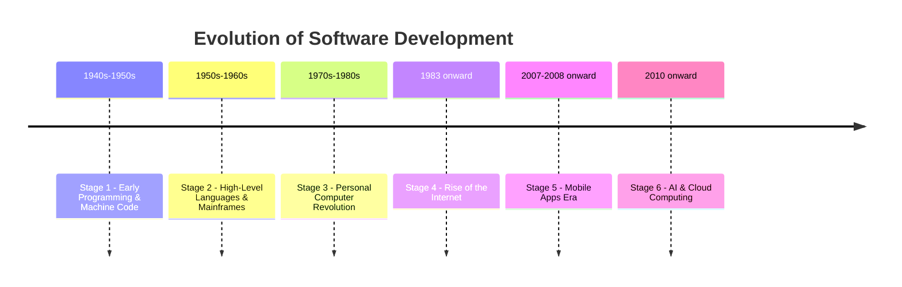

### 1.2 Detailed Evolution Table

| **Stage** | **Era / Name** | **Time Period** | **Key Highlights** |
|---|---|---|---|
| **1** | **Early Programming & Machine Code** | 1940s–1950s | Software written in binary/assembly; punched cards; hardware-focused development. |
| **2** | **High-Level Languages & Mainframes** | 1950s–1960s | FORTRAN, COBOL introduced; software costs rise; business use expands. IBM's IMS (Information Management System) — first database — was developed. |
| **3** | **Personal Computer (PC) Revolution** | 1970s–1980s | PCs like Apple I and IBM PC launched; software became personal and accessible. |
| **4** | **Rise of the Internet** | 1983 onward | TCP/IP adopted; DNS introduced; networks connected globally. Computers stopped being isolated machines and started talking to each other across the globe — the world began shrinking. |
| **5** | **Mobile Apps Era** | 2007–2008 onward | iPhone and App Stores launched; mobile apps became central to daily life. |
| **6** | **AI & Cloud Computing** | 2010 onward | Cloud platforms (AWS, Azure) scaled software; AI entered mainstream use. |

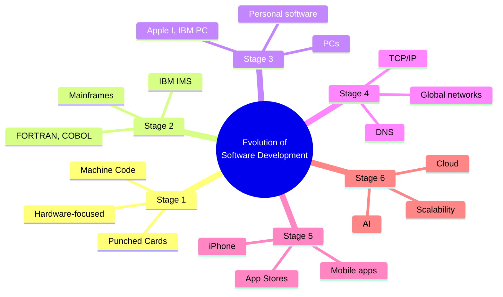

> **Exam Tip:** A common question is *"Trace the evolution of software development."* — Remember the **six stages** and their key highlights.

---

## 2. Software Process Model

### 2.1 Definition

> A **software process model** is a **standardized framework** that defines the **sequence and flow of tasks, activities, and milestones** in software development.

### 2.2 Why Use a Process Model?

| **#** | **Reason** | **Description** |
|---|---|---|
| **1** | **Structure and Predictability** | Provides a clear framework for development |
| **2** | **Project Planning & Risk Management** | Enhances planning and risk mitigation |
| **3** | **Roles & Responsibilities** | Defines who does what and when |
| **4** | **Quality Assurance** | Ensures quality at every phase |
| **5** | **Communication** | Facilitates communication among team members |

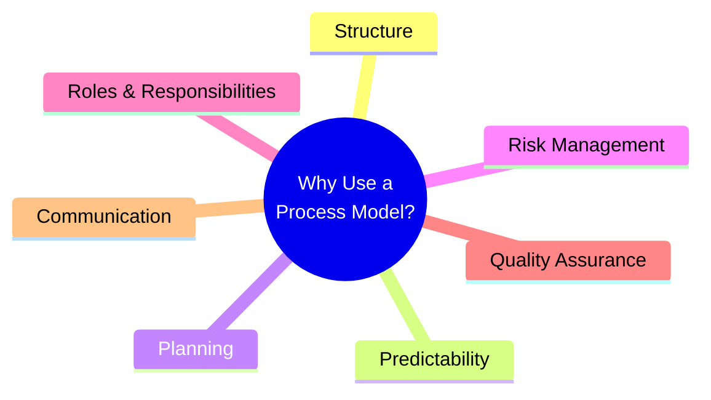

---

## 3. Major Traditional Software Process Models

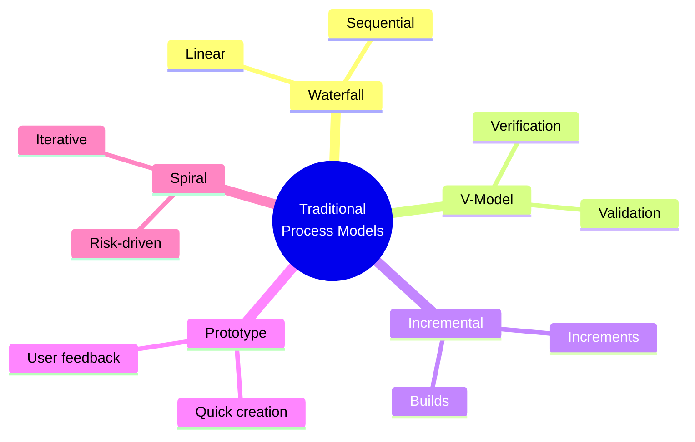

---

## 4. Waterfall Model

### 4.1 Overview

> The **Waterfall Model** is a **linear, sequential approach** where **each phase must be completed before the next begins**.

### 4.2 Phases

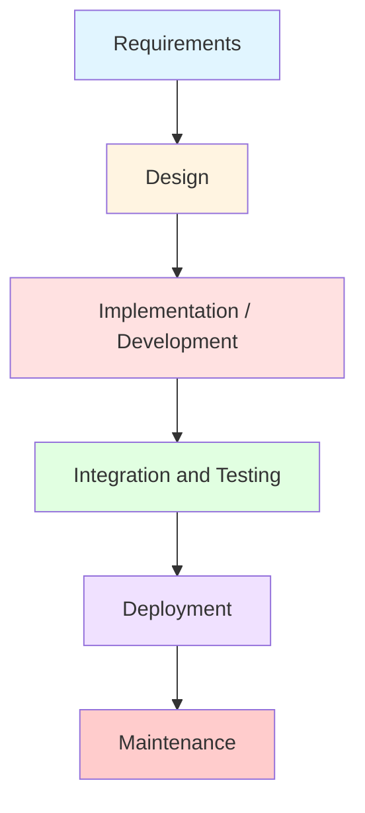

| **Phase** | **What Happens** |
|---|---|
| **1. Requirements** | Collect and document everything the client needs |
| **2. Design** | Create architecture and blueprints |
| **3. Implementation** | Write code based on the design |
| **4. Testing** | Find and fix bugs before release |
| **5. Deployment** | Deliver software to the user |
| **6. Maintenance** | Fix issues or make updates post-delivery |

### 4.3 When to Use Waterfall

- ✅ Requirements are **very clear and fixed**.
- ✅ Project is **short and simple**.
- ✅ Clients **don't expect frequent changes**.

### 4.4 Limitations

- ❌ **No going back** if a requirement changes.
- ❌ **Testing comes late**, so bugs might appear late.
- ❌ **Poor fit for agile or evolving projects**.

> **Exam Tip:** A common question is *"When should you use Waterfall? What are its limitations?"* — Memorize the three use cases and three limitations.

---

## 5. V-Model (Verification and Validation)

### 5.1 Overview

> The **V-Model** is an **extension of Waterfall with parallel testing activities**. It splits the software development process into **two separate phases**: **Verification** and **Validation**.

- **Each development stage has a corresponding testing stage.**

### 5.2 V-Model Diagram

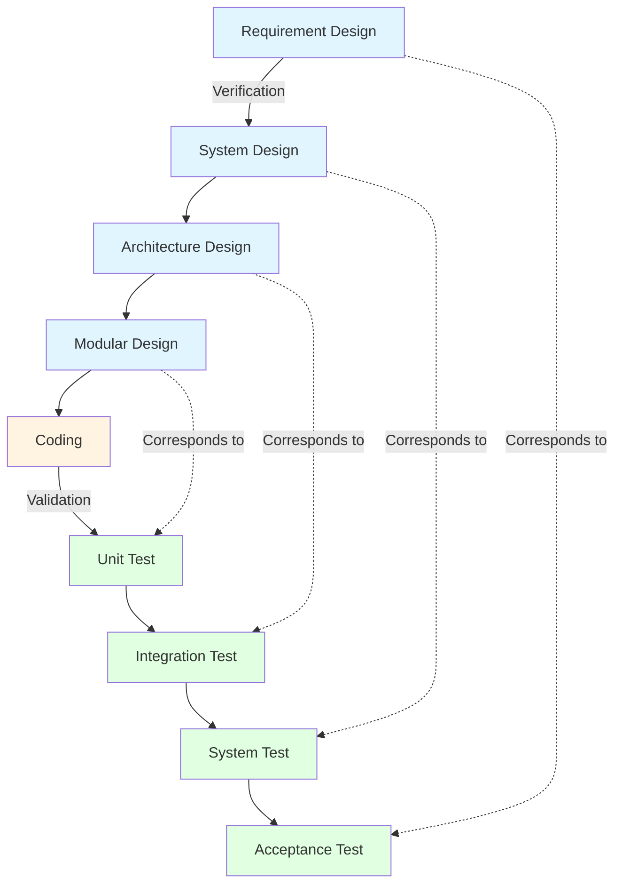

### 5.3 When V-Model Works Well / Avoid It

| **Model Works Well When...** | **Avoid It When...** |
|---|---|
| Requirements are clear and fixed | Requirements are evolving |
| Project lifecycle is long and heavily documented | Project is fast-moving or exploratory |
| System failure has high consequences | Rapid user feedback and iteration is key |

### 5.4 Verification and Validation in Each Step

| **Development Stage (Verification)** | **Verification Activities** | **Corresponding Testing Stage (Validation)** | **Validation Activities** |
|---|---|---|---|
| **1. Requirements Analysis** | Requirements reviews, Stakeholder interviews, Requirement traceability checks | **Acceptance Testing** | User acceptance testing (UAT), Functional testing, Real-world scenario validation |
| **2. System Design** | Design structure, interfaces, Design document reviews, Architectural analysis, Interface definition validation | **System Testing** | End-to-end testing, System behavior validation, Security and performance testing |
| **3. High-Level Design** (Architecture: modules, interfaces, relations) | Walkthroughs of design diagrams, Interface consistency checks, Design audits | **Integration Testing** | Module interaction testing, API testing, Data flow validation between components |
| **4. Low-Level Design** (Module Design — component level logic) | Pseudocode and algorithm reviews, Logic verification, Peer reviews | **Unit Testing** | Function-level testing, Exception and boundary testing, Internal logic validation |
| **5. Implementation (Coding)** | Code reviews, Static code analysis, Compiler checks, Style guide enforcement | **— (No direct test mapping)** | — (Forms the basis for all testing) |

### 5.5 Traceability

> **Every requirement should be traceable throughout the software development lifecycle.**

**Traceability helps to ensure:**
- Every requirement is **developed**.
- Every requirement is **tested**.
- No requirement is **forgotten**.

**Example:**

| **Requirement** | **Design** | **Coding** | **Testing** |
|---|---|---|---|
| User should be able to reset password using registered email. | Password Reset Module | Forgot Password functionality implemented. | Verify password reset link is sent to registered email. |

### 5.6 Advantages of V-Model Over Waterfall

| **Waterfall Model** | **V-Model Advantage** |
|---|---|
| Testing begins after coding is completed. | Verification and validation activities are planned throughout the lifecycle. |
| Little emphasis on verifying intermediate deliverables. | Each development phase is verified before moving to the next phase. |
| Requirements and testing are loosely connected. | Every requirement has a corresponding test case (traceability). |
| Defects are often discovered late. | Early verification helps detect defects before coding begins. |
| Testing team usually becomes involved late. | Test planning starts alongside development activities. |
| Difficult to ensure complete requirement coverage. | Improved test coverage through traceability. |
| Errors in requirements/design may be noticed during testing. | Requirements and design are reviewed and verified early, reducing costly rework. |
| Suitable for projects with stable requirements. | Better suited for projects where quality and correctness are critical. |

> **Exam Tip:** A common question is *"Compare V-Model with Waterfall."* — Focus on **early testing**, **traceability**, and **verification at each stage**.

---

## 6. Incremental Model

### 6.1 Overview

> The **Incremental Model** breaks down the entire project into **smaller parts called builds**.

- Product is designed, implemented, and tested in **small, manageable parts (increments/builds)**.
- **Each increment adds functional capabilities.**

### 6.2 Incremental Model Diagram

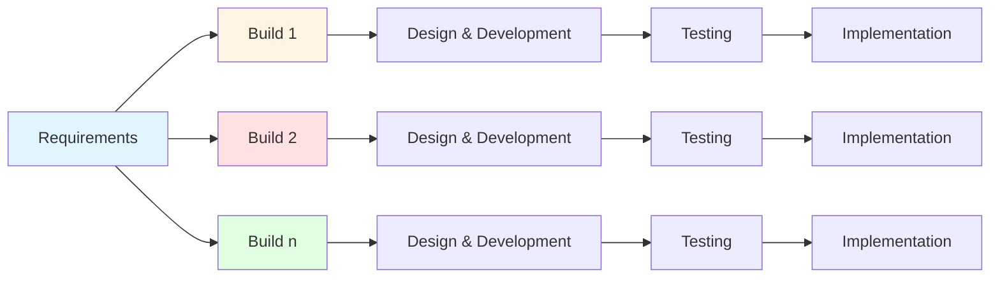

### 6.3 How It Works

| **Phase** | **Explanation** |
|---|---|
| **Requirement Analysis** | Full system requirements are divided into parts (increments). |
| **Design for Increment 1** | Design begins only for the first functional part. |
| **Implementation & Testing of Increment 1** | First working product is built and tested. |
| **Repeat for Other Increments** | Design, build, and test next increments. Each builds upon the previous. |
| **Final Integration** | All increments are integrated into the full system. |

### 6.4 When to Use Incremental Model

> You know the **overall requirements**, but you **don't want to (or cannot) deliver the entire system in one go**.

| **Scenario** | **Why It Works** |
|---|---|
| **Online shopping portal** | Start with product browsing, then add payment, then order tracking. |
| **HR management system** | Begin with employee data, then add payroll, then performance tracking. |

### 6.5 When NOT to Use Incremental Model

> When the **system cannot be meaningfully divided**.

| **Scenario** | **Why Not Suitable** |
|---|---|
| **Safety-critical systems** | Full verification needed before release (medical or aviation software). |
| **Systems with tightly coupled components** | Hard to isolate functionality into increments. |
| **Projects with unclear or unstable architecture** | Incremental design won't be effective. |

> **Exam Tip:** A common question is *"When would you use the Incremental Model? When would you avoid it?"* — Remember the **shopping portal** and **HR system** examples.

---

## 7. Prototype Model

### 7.1 Overview

> **Quick creation of a working prototype for user feedback.** The final system is developed after refining the prototype.

### 7.2 Prototype Model Diagram

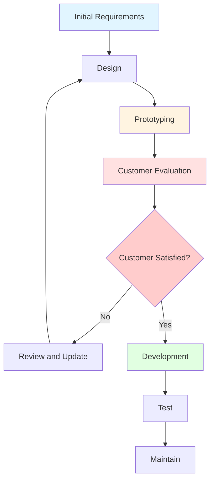

### 7.3 Steps in Prototype Model

| **Step** | **Explanation** |
|---|---|
| **1. Requirements Gathering** | Initial basic requirements are collected. |
| **2. Quick Design** | A simple design focusing on key inputs and outputs is prepared. |
| **3. Build Prototype** | A basic working version of the product is developed (UI or limited features). |
| **4. Customer Evaluation** | Users test and give feedback on the prototype. |
| **5. Refinement** | Based on feedback, the prototype is modified or replaced. |
| **6. Final Product Development** | Once requirements are clear, full-scale system is built using a suitable model. |

### 7.4 Types of Prototypes

| **Type** | **Purpose** |
|---|---|
| **Throwaway (Rapid)** | Built quickly, discarded after gathering requirements. |
| **Evolutionary** | Gradually refined and becomes part of the final system. |
| **Incremental** | Multiple functional prototypes developed and integrated. |
| **Extreme** | Very high-fidelity, often used in UX-heavy applications. |

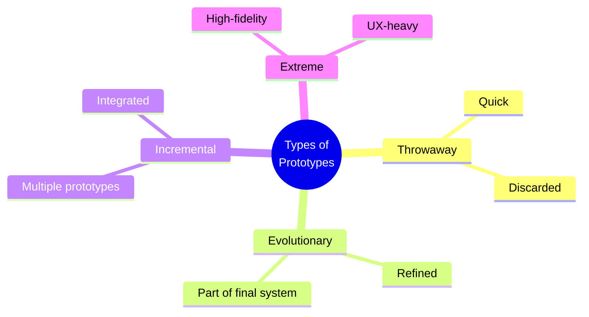

> **Exam Tip:** A common question is *"Explain the Prototype Model with its types."* — Remember the **four types**: Throwaway, Evolutionary, Incremental, Extreme.

---

## 8. Spiral Model

### 8.1 Overview

> The **Spiral Model** is a **risk-driven process model** that combines **iterative development** with **systematic risk assessment**.

- Each **loop (spiral)** represents **one iteration** and consists of **four main phases**.

### 8.2 Phases in Each Spiral

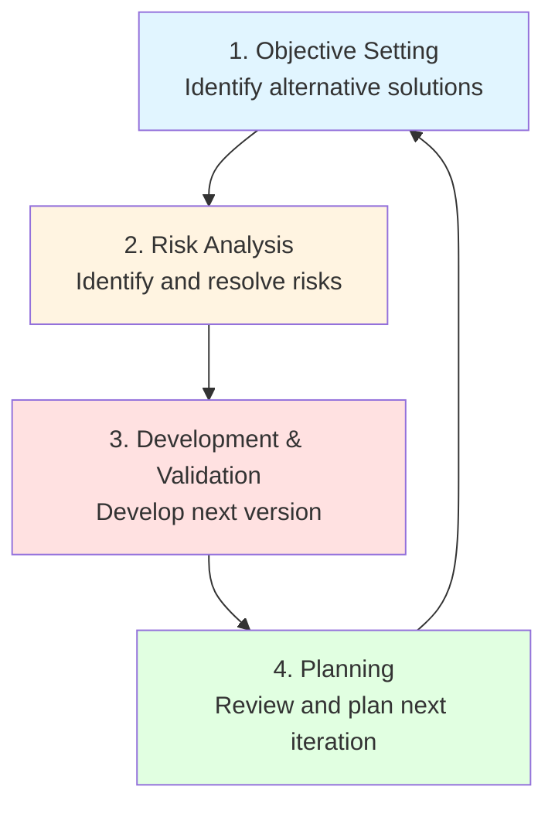

| **Phase** | **Description** |
|---|---|
| **1. Objective Setting** | Determine objectives and identify alternative solutions |
| **2. Risk Analysis** | Identify and resolve risks |
| **3. Development & Validation** | Develop next version of the product |
| **4. Planning** | Review and plan for the next phase |

### 8.3 Spiral Model Diagram

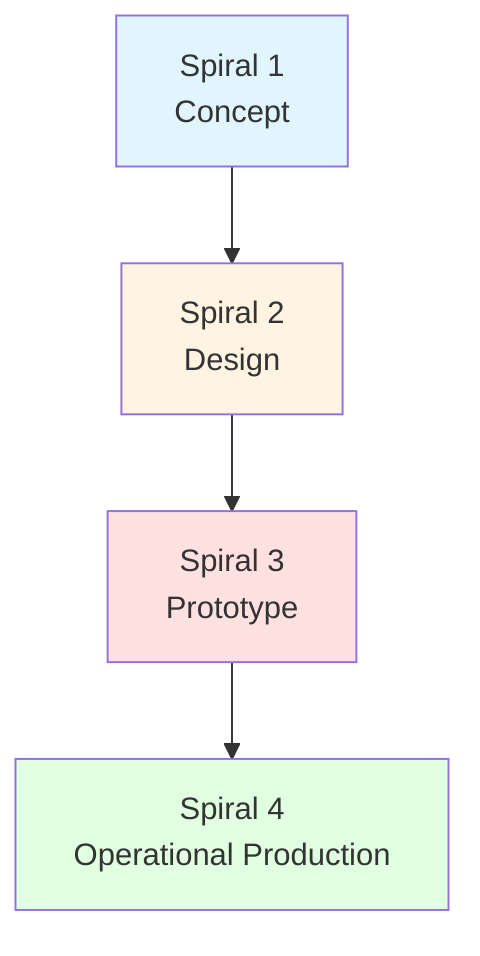

### 8.4 Each Spiral Focuses on a Different Level of Product Maturity

| **Spiral** | **Focus** | **Description** |
|---|---|---|
| **Spiral 1 (Concept Spiral)** | **Feasibility** | Outlining requirements and ensuring the project is mathematically or conceptually possible. |
| **Spiral 2 (Design Spiral)** | **Software Architecture** | Figuring out how components will interact and resolving performance or structural risks. |
| **Spiral 3 (Prototype Spiral)** | **Functional Prototype** | Building a functional, stripped-down version of the core feature to test in real-world conditions. |
| **Spiral 4 (Operational Production Spiral)** | **Final Engineering** | Rigorous testing, security compliance, and deployment. |

### 8.5 Example: AI-Powered Automated Stock Trading System for a Bank

| **Spiral** | **Objective** | **Risk Identification** | **Development/Prototype** | **Review & Next Plan** |
|---|---|---|---|---|
| **Spiral 1: Feasibility & Algorithmic Risk** | Determine if the core AI trading algorithm can make profitable decisions based on historical data. | The algorithm might hallucinate, misinterpret market signals, or execute losing trades. | Build a throwaway mathematical prototype in Python. Run it against historical data from the past 10 years. No real money, no real network connectivity. | Evaluate the profit/loss ratio. If successful, plan the infrastructure for live data. |
| **Spiral 2: Operational & Latency Risk** | Connect the system to live, real-time stock market data feeds. | Market data feeds might drop, or network latency might cause the system to buy stocks at the wrong prices. | Build an evolutionary prototype connected to a simulated live market feed ("paper trading"). Implement strict timeout handlers and network redundancy controls. | Check if the system handles high-volume traffic spikes without crashing. |
| **Spiral 3: Security & Compliance Risk** | Integrate actual financial transactions and meet strict banking regulatory compliance rules. | Data breaches, unauthorized access to funds, or violation of trading laws. | Implement encryption, multi-factor authentication. Run formal security audits. | Ensure legal and cybersecurity teams sign off on the safety parameters. |
| **Spiral 4: Final Release** | Deploy the fully operational system to production. | Deployment downtime or unexpected production environment mismatches. | Develop the final software engineering product with full CI/CD deployment pipelines, exhaustive integration testing, and live dashboards. | Hand over the system to the operations team for long-term maintenance. |

### 8.6 Key Feature: Risk Management

> **Risk analysis is at the core of the model.** Each spiral includes identifying and mitigating technical, cost, or schedule risks.

**Key Point:**
> **Resources are not committed unless risks are well understood.**

### 8.7 When to Use Spiral Model

| **Project Type** | **Why Suitable?** |
|---|---|
| **Large, high-risk systems** | Risk management prevents costly failures. |
| **Mission-critical applications** | Encourages early validation and testing. |
| **Development of new technologies** | Allows exploratory prototyping. |

### 8.8 Advantages of Spiral Model

| **#** | **Advantage** | **Description** |
|---|---|---|
| **1** | **Early Risk Identification** | Proactive risk management |
| **2** | **Continuous Customer Feedback** | Improves system quality |
| **3** | **Supports Changing Requirements** | Incremental development |
| **4** | **Prototypes Visualize Progress** | Reduces ambiguity |

> **Exam Tip:** A common question is *"Explain the Spiral Model with its phases and advantages."* — Focus on **risk management** and the **four spirals**.

---

## 9. Comparison of Process Models

| **Criteria** | **Waterfall** | **V-Model** | **Incremental** | **Prototype** | **Spiral** |
|---|---|---|---|---|---|
| **Approach** | Linear, sequential | Verification & Validation | Builds/Increments | Quick prototype | Risk-driven, iterative |
| **Requirements** | Fixed upfront | Fixed upfront | Prioritized | Unclear, refined | Evolving |
| **Risk Handling** | Poor | Moderate | Good | Good | Excellent |
| **Customer Involvement** | Low | Low | Moderate | High | Moderate-High |
| **Delivery** | Single final | Single final | Multiple increments | Prototype then final | Iterative releases |
| **Testing** | Late | Early (parallel) | Continuous | Continuous | Continuous |
| **Documentation** | Heavy | Heavy | Moderate | Light | Moderate |
| **Change Handling** | Difficult | Difficult | Easy | Easy | Easy |
| **Best For** | Stable requirements | Safety-critical | Early delivery | Unclear requirements | High-risk, large projects |

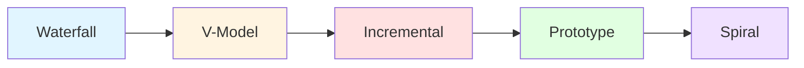

---

## 10. Advantages and Disadvantages

### 10.1 Waterfall

| **Advantages** | **Disadvantages** |
|---|---|
| Simple, easy to understand | Poor adaptability |
| Clear milestones | Late testing |
| Good for stable requirements | Heavy documentation |
| Easy to manage | Customer sees software late |

### 10.2 V-Model

| **Advantages** | **Disadvantages** |
|---|---|
| Early testing | Rigid |
| Rigorous verification | Expensive |
| Good for safety-critical | Poor adaptability |
| Clear traceability | Heavy documentation |

### 10.3 Incremental

| **Advantages** | **Disadvantages** |
|---|---|
| Early delivery | Integration challenges |
| Manageable risk | Requires good planning |
| Incremental value | May need rework |
| Customer feedback early | Architecture must support increments |

### 10.4 Prototype

| **Advantages** | **Disadvantages** |
|---|---|
| Clarifies requirements | Prototype may be mistaken for final |
| High customer involvement | Scope creep |
| Early feedback | May lead to unrealistic expectations |
| Good for unclear requirements | Documentation may be neglected |

### 10.5 Spiral

| **Advantages** | **Disadvantages** |
|---|---|
| Excellent risk management | Complex |
| Iterative | Expensive |
| Good for large projects | Requires risk expertise |
| Early feedback | Not for small projects |

---

## 11. Real-World Examples and Analogies

### 11.1 Analogy: Building a House

| **Model** | **Analogy** |
|---|---|
| **Waterfall** | Building a house from a fixed blueprint — no changes until the end |
| **V-Model** | Building a house with inspections at every stage |
| **Incremental** | Building one room at a time, each usable |
| **Prototype** | Building a model house first, then the real one |
| **Spiral** | Building a house with risk analysis at each phase |

### 11.2 Real-World Use Cases

| **Model** | **Best For** | **Example** |
|---|---|---|
| **Waterfall** | Stable, well-understood projects | Government contracts, construction software |
| **V-Model** | Safety-critical systems | Medical devices, aviation software |
| **Incremental** | Early delivery needed | Enterprise software, ERP systems |
| **Prototype** | Unclear requirements | UI/UX design, innovative products |
| **Spiral** | High-risk, large projects | Defense systems, aerospace |

---

## 12. Exam Tips

> **📝 Exam Tips — Commonly Asked Questions:**

1. **Trace the evolution of software development.**
2. **Define a software process model.** Why use one?
3. **Explain the Waterfall Model** with phases, use cases, and limitations.
4. **Explain the V-Model** with verification and validation phases.
5. **Compare V-Model with Waterfall.**
6. **What is traceability?** Give an example.
7. **Explain the Incremental Model** with phases and use cases.
8. **When would you use the Incremental Model? When would you avoid it?**
9. **Explain the Prototype Model** with steps and types.
10. **Explain the Spiral Model** with phases and advantages.
11. **What is the key feature of the Spiral Model?** (Risk management)
12. **Compare all five process models.**

> **⚠️ Tricky Concepts:**
> - **Waterfall = sequential; V-Model = parallel testing; Incremental = builds; Prototype = feedback; Spiral = risk-driven.**
> - **V-Model is an extension of Waterfall** — not a separate model.
> - **Traceability** links requirements to design, code, and tests.
> - **Spiral Model is risk-driven** — resources not committed unless risks are understood.
> - **Incremental Model cannot be used** for tightly coupled or safety-critical systems.
> - **Prototype types:** Throwaway, Evolutionary, Incremental, Extreme.

---

## 13. Common Interview Questions

1. **What is a software process model?**
   - *Answer:* A standardized framework defining the sequence and flow of tasks, activities, and milestones in software development.

2. **Why do we need process models?**
   - *Answer:* For structure, predictability, planning, risk management, roles, quality assurance, and communication.

3. **Explain the Waterfall Model.**
   - *Answer:* Linear, sequential approach — Requirements → Design → Implementation → Testing → Deployment → Maintenance.

4. **When would you use Waterfall?**
   - *Answer:* Stable requirements, short/simple projects, clients don't expect frequent changes.

5. **What is the V-Model?**
   - *Answer:* An extension of Waterfall with parallel testing activities — verification and validation phases.

6. **What is traceability?**
   - *Answer:* The ability to link every requirement to its design, implementation, and test case.

7. **Explain the Incremental Model.**
   - *Answer:* Breaks the project into smaller builds — each increment adds functional capabilities.

8. **When would you avoid the Incremental Model?**
   - *Answer:* Safety-critical systems, tightly coupled components, unclear architecture.

9. **Explain the Prototype Model.**
   - *Answer:* Quick creation of a working prototype for user feedback, then final system development.

10. **What are the types of prototypes?**
    - *Answer:* Throwaway, Evolutionary, Incremental, Extreme.

11. **Explain the Spiral Model.**
    - *Answer:* Risk-driven, iterative model with four phases per spiral: Objective setting, Risk analysis, Development & validation, Planning.

12. **What is the key feature of the Spiral Model?**
    - *Answer:* Risk management — risk analysis is at the core; resources not committed unless risks are understood.

13. **Compare Waterfall and V-Model.**
    - *Answer:* Waterfall = late testing, no traceability; V-Model = early testing, traceability, verification at each stage.

14. **Compare Incremental and Prototype models.**
    - *Answer:* Incremental = builds/increments, known requirements; Prototype = quick prototype, unclear requirements.

15. **When would you use the Spiral Model?**
    - *Answer:* Large, high-risk systems, mission-critical applications, development of new technologies.

---

## 14. Summary

### Key Takeaways

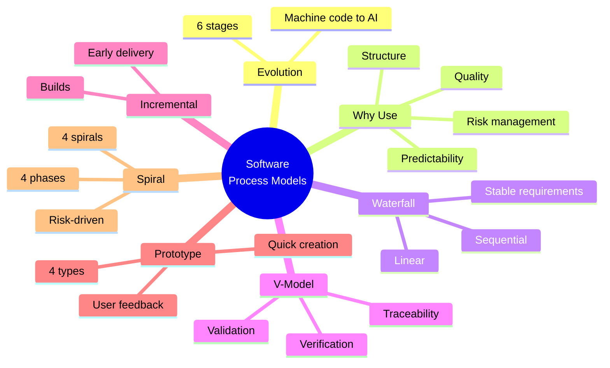

### One-Page Recap

- **Evolution:** 6 stages from machine code (1940s) to AI & Cloud (2010+).
- **Process Model:** Standardized framework for tasks, activities, milestones.
- **Why Use:** Structure, predictability, planning, risk management, roles, quality, communication.
- **Waterfall:** Linear, sequential — Requirements → Design → Implementation → Testing → Deployment → Maintenance.
- **V-Model:** Extension of Waterfall with parallel testing — Verification & Validation, Traceability.
- **Incremental:** Breaks project into builds — each increment adds capabilities.
- **Prototype:** Quick creation for user feedback — types: Throwaway, Evolutionary, Incremental, Extreme.
- **Spiral:** Risk-driven, iterative — 4 phases per spiral: Objective setting, Risk analysis, Development & validation, Planning. 4 spirals: Concept, Design, Prototype, Operational Production.
- **Comparison:** Each model has strengths and weaknesses — choose based on project characteristics.

> **Final Exam Tip:** Always connect each model back to its **core purpose** — Waterfall for stability, V-Model for verification, Incremental for early delivery, Prototype for unclear requirements, Spiral for risk management.

---

## 15. References & Further Reading

- **Software Engineering** — Ian Sommerville
- **Software Engineering: A Practitioner's Approach** — Roger Pressman
- **Agile Estimating and Planning** — Mike Cohn
- **The Agile Samurai** — Jonathan Rasmusson
- **Scrum Guide** — Ken Schwaber & Jeff Sutherland
- **Official Docs:** Agile Alliance, Scrum Alliance, Scrum.org

---

*End of Notes — Software Process Models*