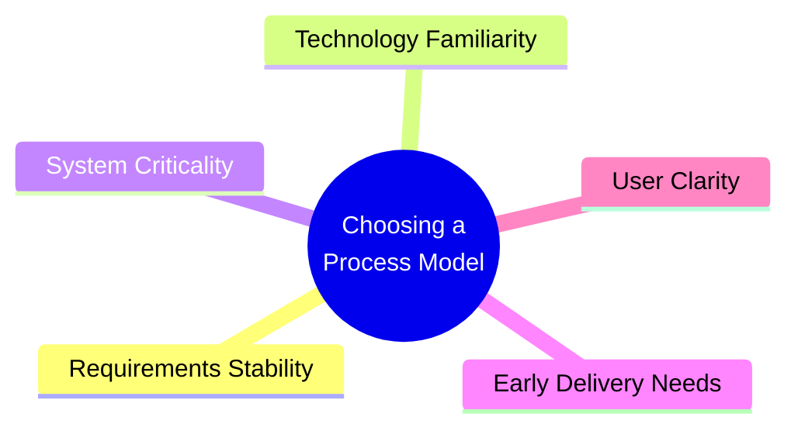
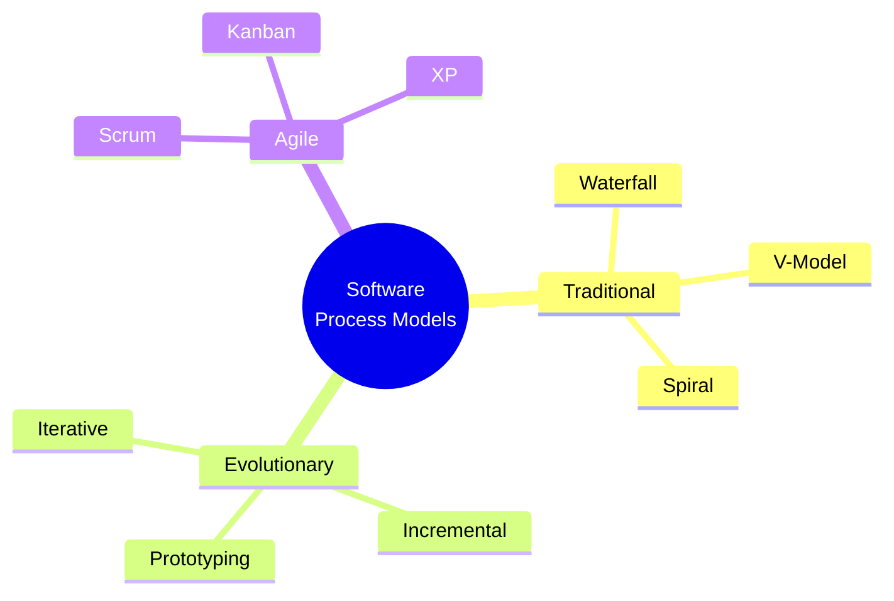
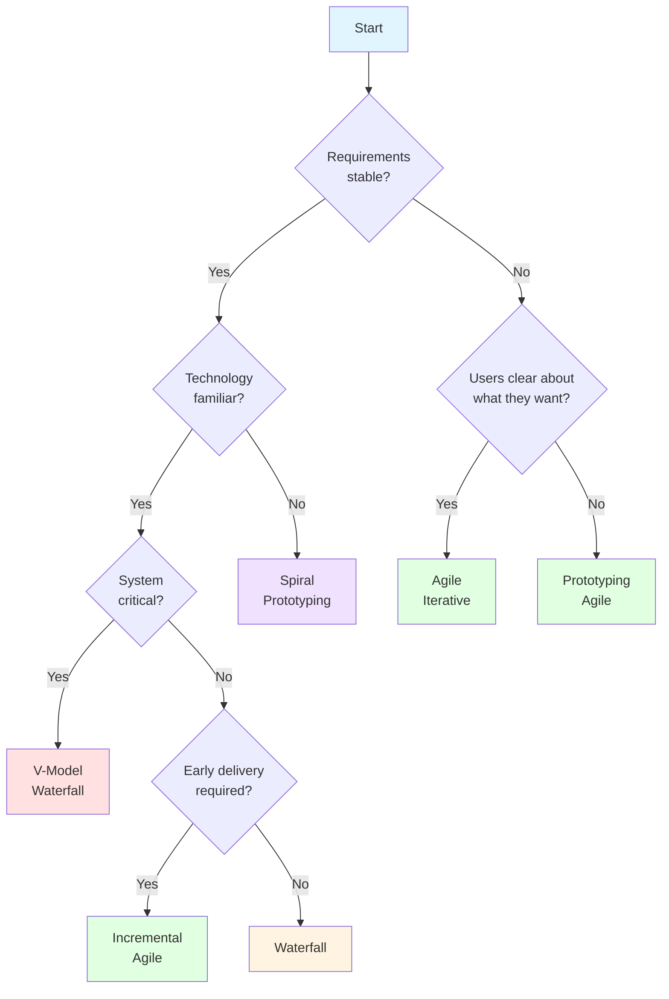
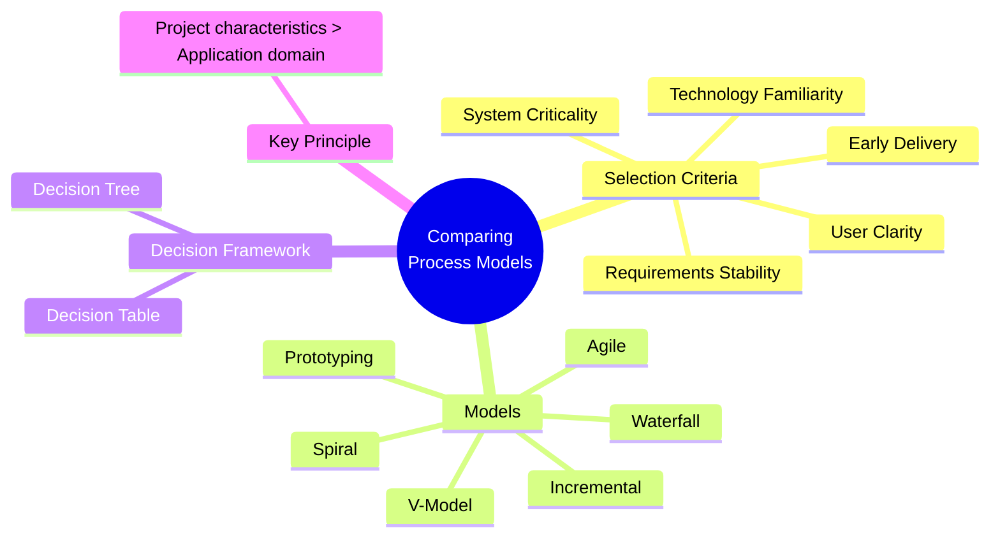

# Comparing Software Process Models — Master's-Level Notes

> **Course Context:** Software Engineering (Agile Practices)
> **Topic:** Comparing Software Process Models — Selection Criteria, Project Characteristics, and Model Comparison
> **Prerequisites:** Basic understanding of software development lifecycle (SDLC), Waterfall, V-Model, Spiral, Prototyping, Incremental, and Agile models.

---

## 1. Introduction: Why Compare Process Models?

### 1.1 The Core Principle

> **Don't choose a process model by looking at the application domain. Choose it by looking at the project's characteristics.**

**Key Insight:**
- The **application domain** (e.g., banking, healthcare, e-commerce) does **not** determine the process model.
- The **project's characteristics** (requirements stability, technology familiarity, criticality, delivery needs, user clarity) determine the best model.

> **Exam Tip:** A common exam question is *"How do you choose a software process model?"* — Answer must emphasize **project characteristics over application domain**.

---

## 2. Key Questions for Model Selection

The PDF presents **five critical questions** to guide process model selection:

| **#** | **Question** | **Why It Matters** | **Implication** |
|---|---|---|---|
| **1** | **Are the requirements stable?** | If yes, planning is easier. | Stable requirements → Waterfall/V-Model; Unstable → Agile/Iterative |
| **2** | **Is the technology familiar?** | If no, there is technical risk. | Familiar → Waterfall; Unfamiliar → Spiral/Prototyping/Agile |
| **3** | **Is the system safety/business critical?** | If yes, testing becomes more important. | Critical → V-Model/Waterfall with rigorous testing; Non-critical → Agile |
| **4** | **Is early delivery required?** | If yes, build in parts. | Early delivery → Incremental/Agile; No rush → Waterfall |
| **5** | **Are users clear about what they want?** | If no, prototype first. | Clear → Waterfall; Unclear → Prototyping/Agile |

### 2.1 Detailed Explanation of Each Question

#### Question 1: Are the requirements stable?

| **Answer** | **Implication** | **Recommended Models** |
|---|---|---|
| **Yes** | Planning is easier; requirements won't change much | Waterfall, V-Model |
| **No** | Requirements will evolve; need flexibility | Agile, Iterative, Incremental |

**Why It Matters:**
- Stable requirements allow **detailed upfront planning**.
- Unstable requirements require **adaptive planning** and **frequent feedback**.

#### Question 2: Is the technology familiar?

| **Answer** | **Implication** | **Recommended Models** |
|---|---|---|
| **Yes** | Low technical risk; can plan confidently | Waterfall, V-Model |
| **No** | High technical risk; need exploration | Spiral, Prototyping, Agile |

**Why It Matters:**
- Familiar technology reduces **technical risk**.
- Unfamiliar technology requires **risk-driven approaches** (Spiral) or **iterative learning** (Agile).

#### Question 3: Is the system safety/business critical?

| **Answer** | **Implication** | **Recommended Models** |
|---|---|---|
| **Yes** | Testing becomes more important; rigorous verification needed | V-Model, Waterfall with formal testing |
| **No** | Testing can be lighter; focus on speed | Agile, Incremental |

**Why It Matters:**
- Safety-critical systems (e.g., medical devices, aviation) require **extensive testing and documentation**.
- Business-critical systems require **reliability and validation**.

#### Question 4: Is early delivery required?

| **Answer** | **Implication** | **Recommended Models** |
|---|---|---|
| **Yes** | Build in parts; deliver incrementally | Incremental, Agile |
| **No** | Can wait for complete delivery | Waterfall |

**Why It Matters:**
- Early delivery provides **faster ROI** and **early feedback**.
- Incremental/Agile models support **partial delivery**.

#### Question 5: Are users clear about what they want?

| **Answer** | **Implication** | **Recommended Models** |
|---|---|---|
| **Yes** | Requirements can be captured upfront | Waterfall, V-Model |
| **No** | Need to explore and refine requirements | Prototyping, Agile |

**Why It Matters:**
- Clear requirements reduce **uncertainty**.
- Unclear requirements require **prototyping** or **iterative refinement**.

---

## 3. Comparison of Software Process Models

### 3.1 Overview of Major Models

### 3.2 Detailed Comparison Table

| **Criteria** | **Waterfall** | **V-Model** | **Spiral** | **Prototyping** | **Incremental** | **Agile** |
|---|---|---|---|---|---|---|
| **Requirements** | Fixed upfront | Fixed upfront | Evolving | Unclear, refined via prototypes | Prioritized, evolving | Evolving, adaptive |
| **Planning** | Detailed upfront | Detailed upfront | Risk-driven | Iterative | Incremental | Continuous |
| **Risk Handling** | Poor | Moderate | Excellent | Good | Good | Excellent |
| **Customer Involvement** | Low | Low | Moderate | High | Moderate | High |
| **Delivery** | Single final | Single final | Iterative | Prototype then final | Multiple increments | Continuous |
| **Testing** | Late | Early (verification & validation) | Continuous | Continuous | Continuous | Continuous |
| **Documentation** | Heavy | Heavy | Moderate | Light | Moderate | Light |
| **Change Handling** | Difficult | Difficult | Moderate | Easy | Easy | Easy |
| **Best For** | Stable requirements | Safety-critical | High-risk, large | Unclear requirements | Early delivery | Changing requirements |
| **Team Size** | Large | Large | Large | Small-Medium | Medium | Small-Medium |
| **Cost** | High if changes | High | High | Moderate | Moderate | Low-Moderate |

### 3.3 Model-by-Model Analysis

#### Waterfall Model

| **Aspect** | **Description** |
|---|---|
| **Approach** | Sequential phases: Requirements → Design → Implementation → Testing → Deployment |
| **Strengths** | Simple, easy to understand, good for stable requirements |
| **Weaknesses** | Poor adaptability, late testing, heavy documentation |
| **Best For** | Projects with stable, well-understood requirements |
| **Worst For** | Projects with changing requirements |

#### V-Model

| **Aspect** | **Description** |
|---|---|
| **Approach** | Verification and validation phases mapped to each development stage |
| **Strengths** | Early testing, rigorous verification, good for safety-critical systems |
| **Weaknesses** | Rigid, expensive, poor adaptability |
| **Best For** | Safety-critical, regulated systems |
| **Worst For** | Projects with evolving requirements |

#### Spiral Model

| **Aspect** | **Description** |
|---|---|
| **Approach** | Risk-driven, iterative cycles (spirals) with risk analysis at each stage |
| **Strengths** | Excellent risk management, iterative, good for large projects |
| **Weaknesses** | Complex, expensive, requires risk expertise |
| **Best For** | High-risk, large-scale projects |
| **Worst For** | Small, low-risk projects |

#### Prototyping Model

| **Aspect** | **Description** |
|---|---|
| **Approach** | Build a prototype first to clarify requirements, then build the final system |
| **Strengths** | Good for unclear requirements, high customer involvement |
| **Weaknesses** | Prototype may be mistaken for final product, scope creep |
| **Best For** | Projects with unclear requirements |
| **Worst For** | Projects with well-defined requirements |

#### Incremental Model

| **Aspect** | **Description** |
|---|---|
| **Approach** | Deliver software in small functional parts (increments) |
| **Strengths** | Early delivery, manageable risk, incremental value |
| **Weaknesses** | Requires good planning, integration challenges |
| **Best For** | Projects requiring early delivery |
| **Worst For** | Projects where integration is complex |

#### Agile Model

| **Aspect** | **Description** |
|---|---|
| **Approach** | Iterative, incremental, adaptive, customer-centric |
| **Strengths** | Flexibility, continuous feedback, early delivery, reduced risk |
| **Weaknesses** | Requires discipline, customer availability, scaling challenges |
| **Best For** | Projects with changing requirements |
| **Worst For** | Projects with fixed, stable requirements |

---

## 4. Decision Framework for Model Selection

### 4.1 Decision Tree

### 4.2 Decision Table

| **Requirements** | **Technology** | **Criticality** | **Early Delivery** | **User Clarity** | **Recommended Model** |
|---|---|---|---|---|---|
| Stable | Familiar | Critical | No | Clear | **V-Model / Waterfall** |
| Stable | Familiar | Non-critical | Yes | Clear | **Incremental** |
| Stable | Familiar | Non-critical | No | Clear | **Waterfall** |
| Stable | Unfamiliar | Any | Any | Any | **Spiral** |
| Unstable | Any | Any | Any | Clear | **Agile** |
| Unstable | Any | Any | Any | Unclear | **Prototyping / Agile** |

---

## 5. Advantages and Disadvantages of Each Model

### 5.1 Waterfall

| **Advantages** | **Disadvantages** |
|---|---|
| Simple, easy to understand | Poor adaptability |
| Clear milestones | Late testing |
| Good for stable requirements | Heavy documentation |
| Easy to manage | Customer sees software late |

### 5.2 V-Model

| **Advantages** | **Disadvantages** |
|---|---|
| Early testing | Rigid |
| Rigorous verification | Expensive |
| Good for safety-critical | Poor adaptability |
| Clear traceability | Heavy documentation |

### 5.3 Spiral

| **Advantages** | **Disadvantages** |
|---|---|
| Excellent risk management | Complex |
| Iterative | Expensive |
| Good for large projects | Requires risk expertise |
| Early feedback | Not for small projects |

### 5.4 Prototyping

| **Advantages** | **Disadvantages** |
|---|---|
| Clarifies requirements | Prototype may be mistaken for final |
| High customer involvement | Scope creep |
| Early feedback | May lead to unrealistic expectations |
| Good for unclear requirements | Documentation may be neglected |

### 5.5 Incremental

| **Advantages** | **Disadvantages** |
|---|---|
| Early delivery | Integration challenges |
| Manageable risk | Requires good planning |
| Incremental value | May need rework |
| Customer feedback early | Architecture must support increments |

### 5.6 Agile

| **Advantages** | **Disadvantages** |
|---|---|
| Flexibility | Requires discipline |
| Continuous feedback | Customer availability needed |
| Early delivery | Scaling challenges |
| Reduced risk | Documentation balance |
| Customer satisfaction | Estimation difficulty |

---

## 6. Real-World Examples and Analogies

### 6.1 Analogy: Building a House

| **Model** | **Analogy** |
|---|---|
| **Waterfall** | Building a house from a fixed blueprint — no changes until the end |
| **V-Model** | Building a house with inspections at every stage |
| **Spiral** | Building a house with risk analysis at each phase |
| **Prototyping** | Building a model house first, then the real one |
| **Incremental** | Building one room at a time, each usable |
| **Agile** | Renovating a house room by room, adapting as needs change |

### 6.2 Real-World Use Cases

| **Model** | **Best For** | **Example** |
|---|---|---|
| **Waterfall** | Stable, well-understood projects | Government contracts, construction software |
| **V-Model** | Safety-critical systems | Medical devices, aviation software |
| **Spiral** | High-risk, large projects | Defense systems, aerospace |
| **Prototyping** | Unclear requirements | UI/UX design, innovative products |
| **Incremental** | Early delivery needed | Enterprise software, ERP systems |
| **Agile** | Changing requirements | Startups, mobile apps, web applications |

---

## 7. Exam Tips

> **📝 Exam Tips — Commonly Asked Questions:**

1. **How do you choose a software process model?**
2. **Why is the application domain less important than project characteristics?**
3. **What are the five key questions for model selection?**
4. **Compare Waterfall, V-Model, and Spiral.**
5. **Compare Agile and Waterfall.**
6. **When would you use Prototyping?**
7. **When would you use Incremental?**
8. **When would you use Agile?**
9. **What are the advantages and disadvantages of each model?**
10. **Draw a decision tree for model selection.**
11. **What is the role of risk in model selection?**
12. **How does requirements stability affect model choice?**

> **⚠️ Tricky Concepts:**
> - **Application domain ≠ Model choice** — project characteristics determine the model.
> - **Stable requirements → Waterfall/V-Model; Unstable → Agile.**
> - **Unfamiliar technology → Spiral/Prototyping.**
> - **Safety-critical → V-Model.**
> - **Early delivery → Incremental/Agile.**
> - **Unclear requirements → Prototyping/Agile.**
> - **No single model is "best"** — it depends on context.

---

## 8. Common Interview Questions

1. **How do you choose a software process model?**
   - *Answer:* Based on project characteristics — requirements stability, technology familiarity, criticality, early delivery needs, and user clarity.

2. **Why is the application domain not the primary factor?**
   - *Answer:* Because the same domain can have different project characteristics (e.g., a banking app with stable vs. changing requirements).

3. **When would you choose Waterfall?**
   - *Answer:* Stable requirements, familiar technology, non-critical system, no early delivery needed, clear user requirements.

4. **When would you choose Agile?**
   - *Answer:* Changing requirements, unclear user needs, early delivery needed, high customer involvement.

5. **When would you choose Spiral?**
   - *Answer:* High-risk, large-scale projects with unfamiliar technology.

6. **When would you choose V-Model?**
   - *Answer:* Safety-critical systems requiring rigorous verification and validation.

7. **When would you choose Prototyping?**
   - *Answer:* When users are unclear about what they want.

8. **When would you choose Incremental?**
   - *Answer:* When early delivery is required and requirements are stable enough to plan increments.

9. **What is the role of risk in model selection?**
   - *Answer:* High risk requires risk-driven models like Spiral; low risk allows simpler models like Waterfall.

10. **Compare Waterfall and Agile.**
    - *Answer:* Waterfall = sequential, fixed requirements, late testing; Agile = iterative, evolving requirements, continuous testing.

---

## 9. Summary

### Key Takeaways

### One-Page Recap

- **Don't choose a model by application domain** — choose by **project characteristics**.
- **Five key questions:**
  1. Are requirements stable?
  2. Is technology familiar?
  3. Is the system safety/business critical?
  4. Is early delivery required?
  5. Are users clear about what they want?
- **Waterfall:** Stable requirements, familiar tech, no early delivery.
- **V-Model:** Safety-critical, rigorous testing.
- **Spiral:** High-risk, large projects.
- **Prototyping:** Unclear requirements.
- **Incremental:** Early delivery needed.
- **Agile:** Changing requirements, continuous feedback.
- **No single model is best** — context determines choice.

> **Final Exam Tip:** Always justify your model choice with **specific project characteristics**. Don't just say "Agile is good" — explain **why** it fits the requirements stability, technology, criticality, delivery needs, and user clarity.

---

## 10. References & Further Reading

- **Software Engineering** — Ian Sommerville
- **Software Engineering: A Practitioner's Approach** — Roger Pressman
- **Agile Estimating and Planning** — Mike Cohn
- **The Agile Samurai** — Jonathan Rasmusson
- **Scrum Guide** — Ken Schwaber & Jeff Sutherland
- **Official Docs:** Agile Alliance, Scrum Alliance, Scrum.org

---

*End of Notes — Comparing Software Process Models*