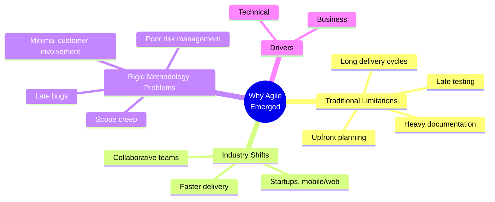
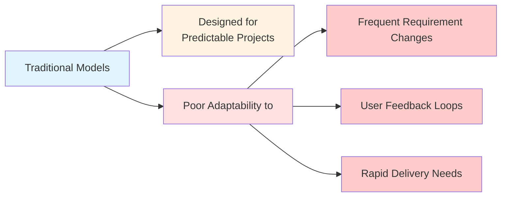
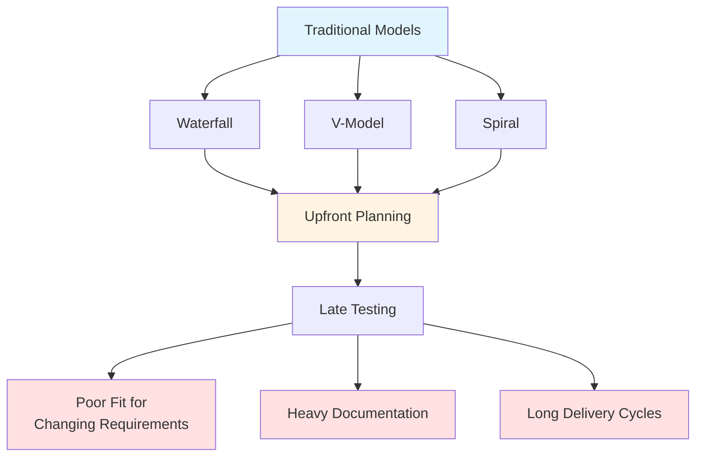
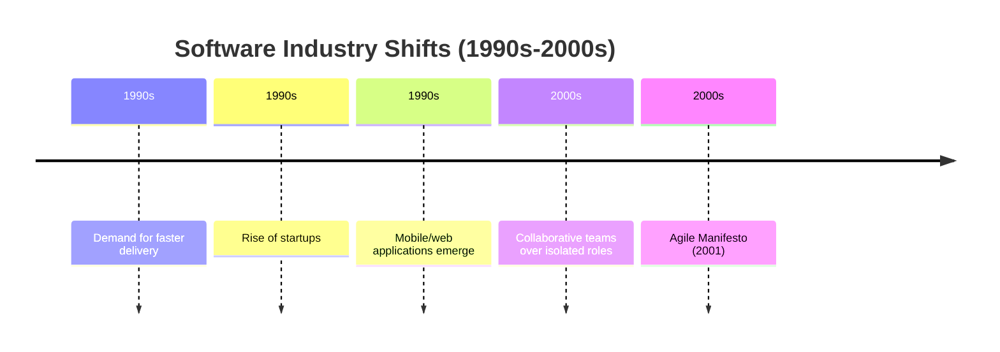
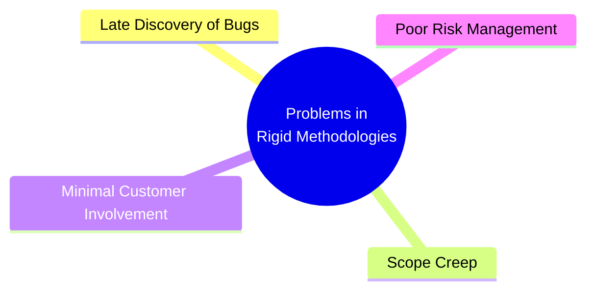
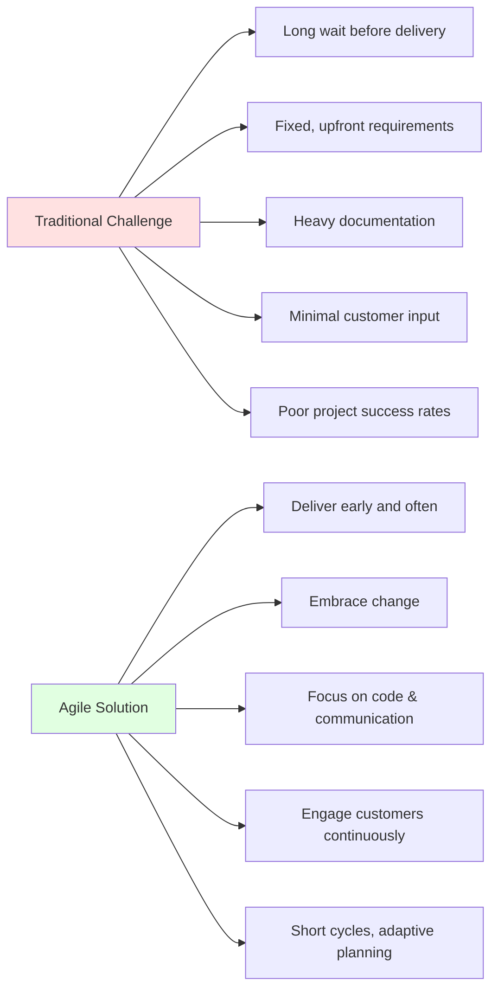
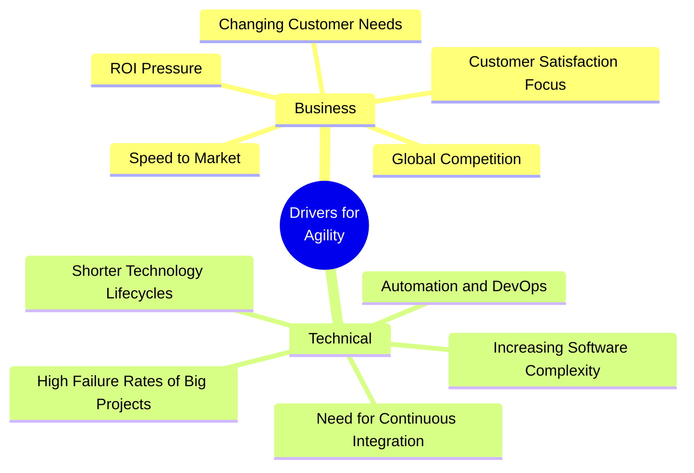
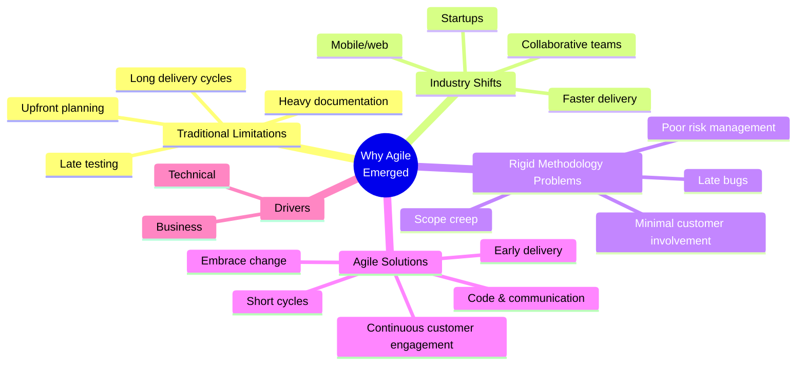

# Why Agile Emerged — Master's-Level Notes

> **Course Context:** Software Engineering (Agile Practices)
> **Topic:** Why Agile Emerged — Limitations of Traditional Models, Industry Shifts, Business & Technical Drivers
> **Prerequisites:** Basic understanding of software development lifecycle (SDLC), traditional Waterfall/V-Model/Spiral models, and introductory software engineering concepts.

---

## 1. Introduction: The Need for Agile

> The emergence of Agile was not accidental — it was a **response to the limitations of traditional software development models** and the **changing demands of the software industry**.

**Key Questions This Topic Answers:**
- Why did traditional models face limitations?
- What problems did rigid methodologies cause?
- What shifts in the software industry drove the need for Agile?
- What are the business and technical drivers for agility?

---

## 2. Why Traditional Models Faced Limitations

### 2.1 The Root Cause

> Traditional models were **designed for predictable, well-defined projects**.

**Key Characteristics:**
- Assumed **stable requirements**
- Relied on **upfront planning**
- Expected **minimal changes** during development

### 2.2 Poor Adaptability To:

| **Challenge** | **Description** |
|---|---|
| **Frequent changes in requirements** | Traditional models struggle when requirements evolve |
| **User feedback loops** | Feedback is often delayed until the end |
| **Rapid delivery needs** | Long cycles prevent quick releases |

> **Exam Tip:** A common question is *"Why did traditional models face limitations?"* — Answer must mention **predictability assumption**, **poor adaptability**, and the **three challenges above**.

---

## 3. Limitations of Traditional Models

### 3.1 Traditional Models Overview

> **Waterfall, V-model, and Spiral** focus on **upfront planning** and **late testing**.

| **Model** | **Key Characteristic** |
|---|---|
| **Waterfall** | Sequential phases — requirements → design → implementation → testing → deployment |
| **V-Model** | Verification and validation phases mapped to each development stage |
| **Spiral** | Risk-driven, iterative, but still heavy on upfront planning |

### 3.2 Key Limitations

| **Limitation** | **Description** |
|---|---|
| **Poor fit for rapidly changing requirements** | Models assume requirements are stable |
| **Heavy documentation** | Extensive documents delay development |
| **Long delivery cycles** | Customers wait months or years for working software |

> **Key Insight:** Traditional models work well when requirements are **stable and well-understood** — but fail when they change frequently.

---

## 4. Software Industry Shifts (1990s–2000s)

### 4.1 Major Shifts

> The software industry underwent **significant changes** in the 1990s–2000s that exposed the limitations of traditional models.

| **Shift** | **Description** |
|---|---|
| **Demand for faster delivery** | Businesses needed software quicker to stay competitive |
| **Rise of startups** | Startups needed to iterate fast and pivot quickly |
| **Mobile/web applications** | New platforms required rapid development and frequent updates |
| **Collaborative teams over isolated roles** | Teams needed to work together, not in silos |

### 4.2 Impact on Development

| **Before** | **After** |
|---|---|
| Slow, sequential development | Fast, iterative development |
| Isolated roles (analysts, developers, testers) | Collaborative, cross-functional teams |
| Desktop applications | Mobile/web applications |
| Long release cycles | Frequent releases |

> **Exam Tip:** A common question is *"What industry shifts led to the rise of Agile?"* — Answer must mention **faster delivery**, **startups**, **mobile/web**, and **collaborative teams**.

---

## 5. Common Problems in Rigid Methodologies

> Rigid methodologies (Waterfall, V-Model, etc.) led to **several common problems**:

| **#** | **Problem** | **Description** |
|---|---|---|
| **1** | **Late discovery of bugs** | Testing happens late, so bugs are found after significant investment |
| **2** | **Scope creep due to inflexible processes** | Changes are hard to accommodate, leading to uncontrolled scope expansion |
| **3** | **Minimal customer involvement** | Customers are involved mainly at the beginning and end |
| **4** | **Poor risk management** | Risks are identified late, when they're expensive to mitigate |

### 5.1 Detailed Explanation

| **Problem** | **Why It Happens** | **Impact** |
|---|---|---|
| **Late discovery of bugs** | Testing is a phase at the end | Expensive fixes, delays, lower quality |
| **Scope creep** | Inflexible processes can't handle changes | Uncontrolled expansion, missed deadlines |
| **Minimal customer involvement** | Customers only see the software at the end | Misalignment with needs, dissatisfaction |
| **Poor risk management** | Risks are identified late | Costly mitigation, project failure |

> **Exam Tip:** A common question is *"What are the common problems in rigid methodologies?"* — Memorize the **four problems** above.

---

## 6. Why Agile Emerged

### 6.1 The Need for Agile

> Agile emerged to address the **need for**:
> - **Iterative delivery**
> - **Flexibility for change**
> - **Continuous customer feedback**
> - **Emphasis on working software over documentation**

### 6.2 Traditional Challenge vs Agile Solution

| **Traditional Challenge** | **Agile Solution** |
|---|---|
| Long wait before delivery | Deliver working software **early and often** |
| Fixed, upfront requirements | **Embrace change** throughout development |
| Heavy documentation | Focus on **code and communication** |
| Minimal customer input | **Engage customers continuously** |
| Poor project success rates | Use **short cycles and adaptive planning** |

> **Key Insight:** Agile directly addresses each traditional challenge with a corresponding solution.

---

## 7. Business and Technical Drivers for Agility

### 7.1 Overview

> The push for Agile came from both **business** and **technical** drivers.

### 7.2 Detailed Drivers

| **#** | **Driver** | **Explanation** |
|---|---|---|
| **1** | **Speed to Market** | Businesses need to deliver products quickly to stay ahead of competitors. |
| **2** | **Changing Customer Needs** | Customers often change their requirements during the project lifecycle. |
| **3** | **Global Competition** | Companies face pressure to innovate rapidly and adapt faster than rivals. |
| **4** | **Customer Satisfaction Focus** | Businesses are increasingly judged by how well they meet user expectations. |
| **5** | **ROI Pressure** | Agile allows partial delivery earlier, helping generate revenue faster. |
| **6** | **Increasing Software Complexity** | Large, interconnected systems require frequent updates and flexible planning. |
| **7** | **Need for Continuous Integration** | Modern development requires frequent builds, testing, and deployment cycles. |
| **8** | **Shorter Technology Lifecycles** | Tech stacks evolve rapidly — Agile supports adaptability. |
| **9** | **High Failure Rates of Big Projects** | Waterfall projects often failed to deliver usable software; Agile breaks work into manageable pieces. |
| **10** | **Automation and DevOps** | Agile fits naturally with automated testing, continuous delivery, and DevOps. |

### 7.3 Categorizing the Drivers

| **Category** | **Drivers** |
|---|---|
| **Business Drivers** | Speed to Market, Changing Customer Needs, Global Competition, Customer Satisfaction Focus, ROI Pressure |
| **Technical Drivers** | Increasing Software Complexity, Need for Continuous Integration, Shorter Technology Lifecycles, High Failure Rates of Big Projects, Automation and DevOps |

> **Exam Tip:** A common question is *"List the business and technical drivers for agility."* — Memorize the **10 drivers** and categorize them correctly.

---

## 8. Learning Objectives (From the PDF)

> By the end of this topic, you should be able to:

| **#** | **Objective** |
|---|---|
| **1** | **Understand the limitations of traditional software development models.** |
| **2** | **Identify the context and challenges that led to the rise of Agile.** |
| **3** | **Recognize the business and technical drivers for agility.** |

---

## 9. Advantages and Disadvantages of Agile (vs Traditional)

### 9.1 Advantages of Agile

| **Advantage** | **Description** |
|---|---|
| **Faster Delivery** | Working software delivered early and often |
| **Flexibility** | Embraces changing requirements |
| **Customer Collaboration** | Continuous customer involvement |
| **Reduced Risk** | Early detection of issues |
| **Improved Quality** | Continuous testing and feedback |
| **Better ROI** | Partial delivery generates revenue earlier |
| **Adaptability** | Responds to changing market conditions |

### 9.2 Disadvantages / Challenges of Agile

| **Challenge** | **Description** |
|---|---|
| **Cultural Shift** | Requires change from traditional models |
| **Customer Availability** | Requires active customer involvement |
| **Documentation Balance** | Finding the right level of documentation |
| **Scaling Challenges** | Hard to scale to large organizations |
| **Discipline Required** | Agile looks informal but requires strong discipline |

---

## 10. Real-World Examples and Analogies

### 10.1 Analogy: Building a House vs. Renovating a House

- **Traditional (Waterfall)** = Building a house from a fixed blueprint — no changes allowed until the end.
- **Agile** = Renovating a house room by room — adapting as the family's needs change.

### 10.2 Real-World Examples of Traditional Model Failures

| **Project** | **Why It Failed** | **Lesson** |
|---|---|---|
| **Standish Group CHAOS Report** | High failure rates of big projects | Traditional models often fail |
| **Healthcare.gov (initial launch)** | Waterfall approach, late testing | Agile would have caught issues earlier |
| **Various government IT projects** | Fixed requirements, heavy documentation | Agile's flexibility is needed |

> **Key Insight:** The **Standish Group CHAOS Report** consistently shows high failure rates for traditional projects — a key driver for Agile adoption.

---

## 11. Exam Tips

> **📝 Exam Tips — Commonly Asked Questions:**

1. **Why did traditional models face limitations?**
2. **What are the limitations of Waterfall, V-Model, and Spiral?**
3. **What software industry shifts (1990s–2000s) led to Agile?**
4. **What are the common problems in rigid methodologies?**
5. **Why did Agile emerge?** What problems does it solve?
6. **Compare traditional challenges with Agile solutions.**
7. **List and explain the business drivers for agility.**
8. **List and explain the technical drivers for agility.**
9. **What are the learning objectives for this topic?**
10. **How does Agile address the limitations of traditional models?**
11. **What is the Standish Group CHAOS Report?** Why is it relevant?
12. **Explain the difference between traditional and Agile approaches.**

> **⚠️ Tricky Concepts:**
> - **Traditional models are not "bad"** — they're just **designed for predictable projects**.
> - **Agile emerged from both business and technical drivers.**
> - **Speed to Market** is a business driver; **Continuous Integration** is a technical driver.
> - **ROI Pressure** = Agile allows partial delivery earlier.
> - **High Failure Rates of Big Projects** = Waterfall projects often failed to deliver usable software.
> - **Automation and DevOps** = Agile fits naturally with these practices.

---

## 12. Common Interview Questions

1. **Why did Agile emerge?**
   - *Answer:* To address the limitations of traditional models (upfront planning, late testing, heavy documentation) and meet the demands of a rapidly changing software industry.

2. **What are the limitations of traditional models?**
   - *Answer:* Poor fit for changing requirements, heavy documentation, long delivery cycles, late testing.

3. **What industry shifts led to Agile?**
   - *Answer:* Demand for faster delivery, rise of startups, mobile/web applications, collaborative teams.

4. **What are the common problems in rigid methodologies?**
   - *Answer:* Late discovery of bugs, scope creep, minimal customer involvement, poor risk management.

5. **What are the business drivers for agility?**
   - *Answer:* Speed to Market, Changing Customer Needs, Global Competition, Customer Satisfaction Focus, ROI Pressure.

6. **What are the technical drivers for agility?**
   - *Answer:* Increasing Software Complexity, Need for Continuous Integration, Shorter Technology Lifecycles, High Failure Rates of Big Projects, Automation and DevOps.

7. **How does Agile address traditional challenges?**
   - *Answer:* Deliver early and often, embrace change, focus on code and communication, engage customers continuously, use short cycles and adaptive planning.

8. **What is the Standish Group CHAOS Report?**
   - *Answer:* A report that consistently shows high failure rates for traditional projects — a key driver for Agile adoption.

9. **Why is Speed to Market important?**
   - *Answer:* Businesses need to deliver products quickly to stay ahead of competitors.

10. **How does Agile improve ROI?**
    - *Answer:* Agile allows partial delivery earlier, helping generate revenue faster.

---

## 13. Summary

### Key Takeaways

### One-Page Recap

- **Traditional models** were designed for **predictable, well-defined projects**.
- **Limitations:** Poor adaptability to changing requirements, user feedback, rapid delivery.
- **Waterfall, V-Model, Spiral** focus on **upfront planning** and **late testing**.
- **Industry Shifts (1990s–2000s):** Faster delivery, startups, mobile/web, collaborative teams.
- **Problems in Rigid Methodologies:** Late bugs, scope creep, minimal customer involvement, poor risk management.
- **Why Agile Emerged:** Need for iterative delivery, flexibility, continuous feedback, working software.
- **Traditional Challenge vs Agile Solution:**
  - Long wait → Deliver early and often
  - Fixed requirements → Embrace change
  - Heavy documentation → Focus on code and communication
  - Minimal customer input → Engage customers continuously
  - Poor success rates → Short cycles, adaptive planning
- **Business Drivers:** Speed to Market, Changing Customer Needs, Global Competition, Customer Satisfaction Focus, ROI Pressure.
- **Technical Drivers:** Increasing Software Complexity, Need for Continuous Integration, Shorter Technology Lifecycles, High Failure Rates of Big Projects, Automation and DevOps.

> **Final Exam Tip:** Always connect the emergence of Agile back to the **limitations of traditional models** and the **business/technical drivers**. Agile didn't appear randomly — it was a **response to real problems** in the software industry.

---

## 14. References & Further Reading

- **Agile Manifesto** — agilemanifesto.org
- **The Standish Group CHAOS Report** — standishgroup.com
- **Agile Estimating and Planning** — Mike Cohn
- **User Stories Applied** — Mike Cohn
- **Scrum Guide** — Ken Schwaber & Jeff Sutherland
- **The Agile Samurai** — Jonathan Rasmusson
- **Official Docs:** Agile Alliance, Scrum Alliance, Scrum.org

---

*End of Notes — Why Agile Emerged*