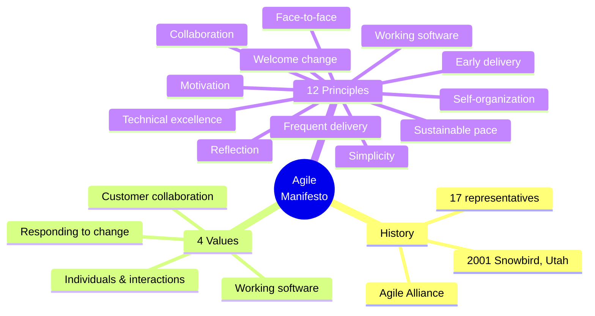
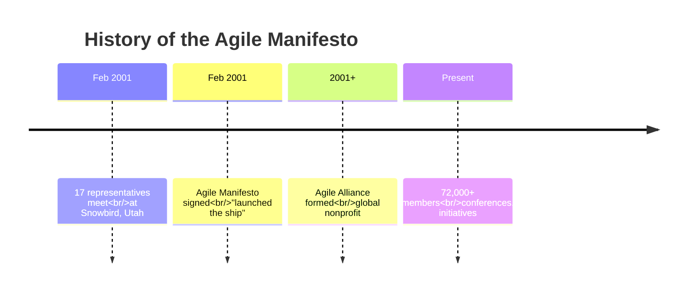
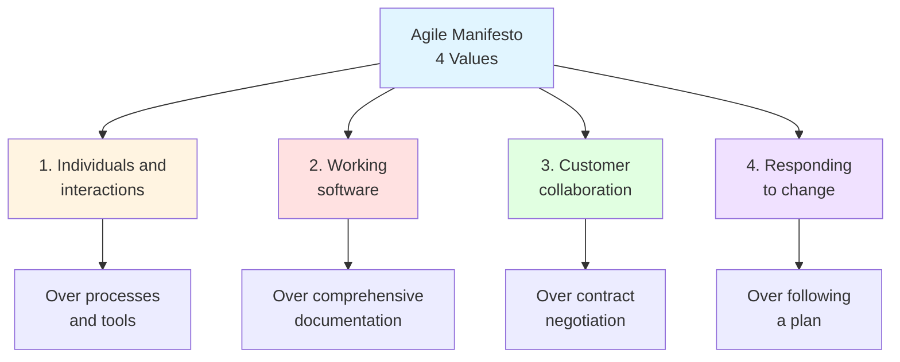
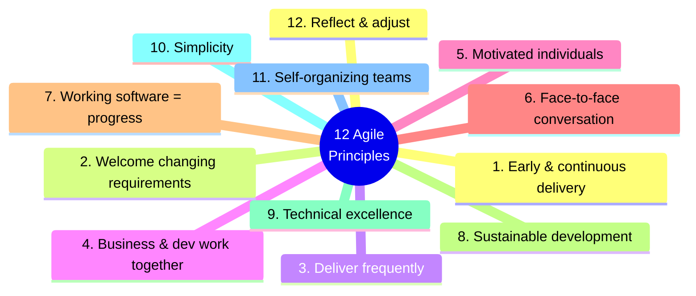
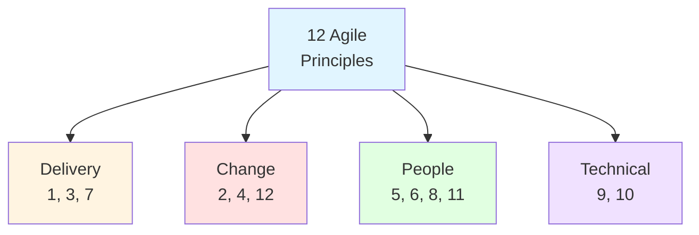
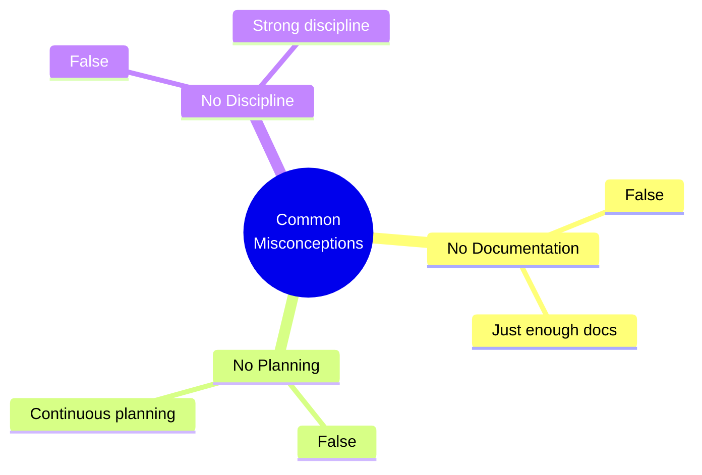
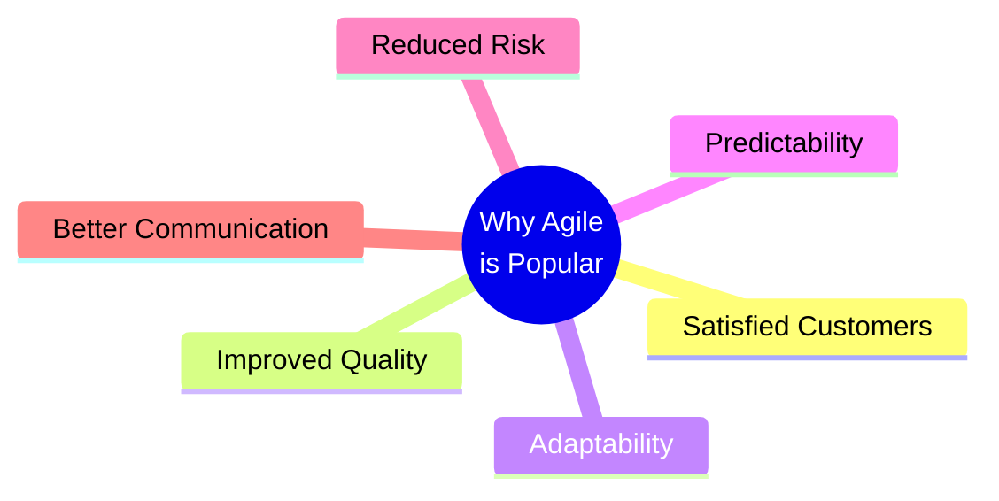
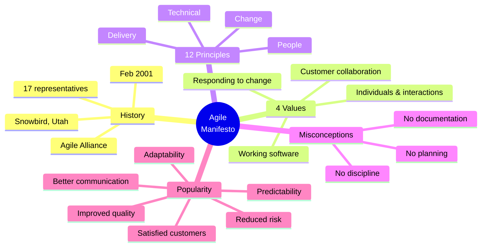

# The Agile Manifesto — Master's-Level Notes

> **Course Context:** Software Engineering (Agile Practices)
> **Topic:** The Agile Manifesto — History, Four Values, Twelve Principles, Misconceptions, and Importance
> **Prerequisites:** Basic understanding of software development lifecycle (SDLC), traditional Waterfall model, and introductory Agile concepts.

---

## 1. Introduction to the Agile Manifesto

### 1.1 What Makes Agile Different?

> Agile, as a movement, is **different from any approach to software development that came before it**, because it **started with ideas, values, and principles** that embody a **mindset**.

### 1.2 Definition

> The **Agile Manifesto** is a **foundational document** for Agile software development, outlining **four core values** and **twelve principles** that guide an **iterative, flexible approach** to project management.

**Official Name:** **Manifesto for Agile Software Development**

**Purpose:**
- Provide an **effective model** for teams to successfully adopt the **philosophy of Agile project management**
- Use it to **improve their work process**

---

## 2. History of the Agile Manifesto

### 2.1 The Founding Event

| **Detail** | **Description** |
|---|---|
| **Date** | **February 2001** |
| **Location** | **Snowbird, Utah** (a ski resort) |
| **Attendees** | **17 representatives** from various programming and development backgrounds |
| **Purpose** | Discuss Agile methodologies and find a solution to the older processes with which they had become frustrated |

**Key Insight:**
> It is believed that by signing the manifesto, the authors **"launched the ship"** for Agile software development.

### 2.2 The Agile Alliance

- This group of people became known as the **Agile Alliance**.
- After the Agile Manifesto was released, the alliance grew to form a **global nonprofit organization**.
- It now has a community of more than **72,000 members**.
- The Agile Alliance hosts **regular conferences** and organizes **initiatives** to support local groups.

> **Exam Tip:** Remember the **date (February 2001)**, **location (Snowbird, Utah)**, and **number of attendees (17)**. These are commonly asked in exams.

---

## 3. The Four Agile Values

The Agile Manifesto is built on **four core values**:

### 3.1 Value 1: Individuals and Interactions Over Processes and Tools

> **The first value gets straight to the core of Agile methodology: the focus is on the people.**

**Key Points:**
- You can use the **best processes and tools** available to support your projects, but they will only work if your **people are doing their best work**.
- **Your team is your most valuable resource.**
- **Communication plays a key role** — when people interact with each other regularly and share their ideas, they build **better products**.

**Quote from Jim Highsmith (Agile Manifesto author):**
> He wrote about the importance of the **"mushy stuff"** — meaning **prioritizing people over processes**. Rather than simply proclaiming that people are the most important factor, he advises that software developers **actually act as if people are the most important factor**.

### 3.2 Value 2: Working Software Over Comprehensive Documentation

> **Before Agile practices were fully implemented, teams would spend hours creating exhaustive documents** with technical specifications, requirements, and more.

**The Problem:**
- These lists would be prepared **before developers started to write the code**.
- The whole process was **delayed** as the documentation took so long to compile.

**The Agile Philosophy:**
- **Streamline these documents** and condense the information into **user stories**.
- These stories equip the developer with **all the details they need** to start working on the software and get it ready for release.
- The idea is to **accelerate the launch process** and **make product tweaks in the early stages**, improving the software in future iterations.

### 3.3 Value 3: Customer Collaboration Over Contract Negotiation

> **The third value highlights the importance of customer collaboration.**

**Traditional Approach (Contract Negotiation):**
- Involving **outlining product requirements** with the customer **before commencing the project**
- Then **renegotiating these deliverables** at a later stage
- **Problem:** The customer is **not engaged throughout the development cycle**, so teams **lose out on user feedback** that could enhance the product.

**Agile Approach (Customer Collaboration):**
- **Bring your customers into the development process**
- **Ask for their opinions regularly** and take their suggestions on board
- **Delve into their specific needs** while the software is still being built
- Developers gain **valuable insights** to create the **ultimate user experience**

### 3.4 Value 4: Responding to Change Over Following a Plan

> **Traditional methodologies advocated for as little change as possible**, recognizing that significant alterations could cost time and money.

**Traditional Approach:**
- The aim was to create a **comprehensive plan** that followed a **structured, linear path** and **avoided obstacles** where possible.

**Agile Approach:**
- The Agile mentality **turns this rigid method on its head**, arguing that **change can benefit the software development process**.
- When you **embrace change**, you open yourself up to **new possibilities and ways to improve**.
- Agile teams work in **short, iterative cycles**, meaning they can **react quickly** and **implement changes on a continuous basis**.
- This ultimately leads to **better products**.

### 3.5 The Four Agile Values — Summary Table

| **Agile Values** | **Replaces This Traditional Focus** |
|---|---|
| **Individuals and interactions** | Over processes and tools |
| **Working software** | Over comprehensive documentation |
| **Customer collaboration** | Over contract negotiation |
| **Responding to change** | Over following a plan |

### 3.6 Interpretation of Each Value

| **Agile Values** | **Interpretation** |
|---|---|
| **Individuals and interactions** | **People First:** Effective communication trumps perfect tools. |
| **Working software** | **Working Software:** Deliver value continuously. |
| **Customer collaboration** | **Customer Collaboration:** Involve users frequently. |
| **Responding to change** | **Change-Friendly:** Agile welcomes new insights at any time. |

### 3.7 Agile Values Applied to Real-Life Scenarios

| **Scenario** | **Agile Value** |
|---|---|
| The team's project management tool is down, but the developers and testers keep things moving by syncing in person and using a shared whiteboard. | **#1 – Individuals and interactions over processes and tools** |
| The team spends less time writing lengthy test documents and more time running and fixing tests to get a working prototype delivered. | **#2 – Working software over comprehensive documentation** |
| A product owner joins daily stand-ups and gives regular feedback, adjusting priorities every week based on customer needs. | **#3 – Customer collaboration over contract negotiation** |
| During User Acceptance Testing (UAT), the client requests a small change to the dashboard layout that wasn't in the original scope. | **#4 – Responding to change over following a plan** |

> **Exam Tip:** A common exam question is *"Explain the four Agile values with real-world examples."* Use the scenarios above to illustrate each value.

---

## 4. Overview of the 12 Agile Principles

> These four values form the **basis of Agile software development**, highlighting key priority areas for teams to focus their energies on.

> The core values are supported by the **12 Agile Manifesto principles**.

**Key Distinction:**
- **Agile Values** = **What we believe**
- **Agile Principles** = **How we act on those beliefs**

---

## 5. The 12 Agile Principles — Detailed Explanation

| **#** | **Agile Principle** | **Explanation** | **Real-World Example & Benefit** |
|---|---|---|---|
| **1** | **Early and continuous delivery of valuable software** | Deliver working software frequently to provide value early and often. | An e-commerce platform releases basic checkout first, then adds filters and payment options in later iterations — allowing customers to start using it early. |
| **2** | **Welcome changing requirements, even late in development** | Embrace change to provide competitive advantage. | A ride-sharing app adds QR-based driver identification mid-sprint based on recent fraud news — delivering safety and trust quickly. |
| **3** | **Deliver working software frequently (every 1–4 weeks)** | Deliver usable increments regularly. | A team updates a mobile app weekly with bug fixes and new features, based on app store feedback, keeping users happy and engaged. |
| **4** | **Business people and developers must work together daily** | Constant communication ensures alignment. | A fintech team includes the product manager in daily stand-ups, enabling instant clarification and faster feature refinement. |
| **5** | **Build projects around motivated individuals** | Empower the team, trust them to get the job done. | A company lets developers choose tools/languages for a feature — they feel ownership and deliver better, faster solutions. |
| **6** | **Face-to-face conversation is the best form of communication** | Real-time, personal communication improves understanding. | Design and dev teams do quick whiteboard sessions instead of long email chains — cutting misunderstandings and rework. |
| **7** | **Working software is the primary measure of progress** | Deliverable code matters more than plans. | A dashboard team skips formal reports and shows progress via running features every sprint demo — clients can see and test results instantly. |
| **8** | **Agile processes promote sustainable development** | Pace should be consistent to avoid burnout. | A dev team commits to realistic sprint goals rather than overloading — reducing overtime and ensuring steady, healthy progress. |
| **9** | **Continuous attention to technical excellence** | Clean code and solid design boost agility. | A team enforces code reviews and refactoring, resulting in fewer bugs and faster onboarding of new developers. |
| **10** | **Simplicity — the art of maximizing the amount of work not done — is essential** | Focus on what's necessary; avoid feature bloat. | Instead of building 10 filters, a travel app adds just two based on user data — reducing effort and improving user experience. |
| **11** | **Best architectures, requirements, and designs emerge from self-organizing teams** | Teams should manage themselves and make decisions. | A team experiments with UI layout and chooses the best option based on feedback, without waiting for top-down approval. |
| **12** | **Reflect regularly and adjust behavior accordingly (retrospective)** | Teams should continuously improve. | After a failed release, a team reflects in a sprint retrospective, identifies process gaps, and reduces delivery bugs in future sprints. |

### 5.1 Principle Categories (for Memory)

> **Exam Tip:** A common exam question is *"List and explain any 5 of the 12 Agile principles with examples."* Use the table above — pick principles from different categories for variety.

---

## 6. Common Misconceptions About Agile

The PDF highlights **three common misconceptions**:

### 6.1 Misconception 1: "Agile means no documentation"

> **In Fact:** Agile values **useful documentation** — just not excessive or wasteful.

**Key Points:**
- Agile **reduces unnecessary paperwork** but does **not eliminate documentation**.
- It focuses on **"just enough" documentation** that adds value, like:
  - **User stories**
  - **Acceptance criteria**
  - **Definition of Done**

### 6.2 Misconception 2: "Agile means no planning"

> **In Fact:** Agile involves **continuous and adaptive planning** at multiple levels.

**Agile Includes Planning Such As:**
- **Product Roadmap Planning**
- **Release Planning**
- **Sprint Planning**
- **Daily Planning (Stand-ups)**

**Key Points:**
- Agile **doesn't skip planning** — it just doesn't pretend plans will never change.
- Agile encourages **more frequent and responsive planning** than traditional models.

### 6.3 Misconception 3: "Agile means no discipline"

> **In Fact:** Agile requires **strong discipline and team accountability**.

**Agile Teams Follow:**
- **Defined roles** (Product Owner, Scrum Master, etc.)
- **Regular cadences** (sprints, stand-ups, retrospectives)
- **Technical practices** (TDD, continuous integration, refactoring)

**Key Insight:**
> Agile looks **informal** — but behind the scenes, it's **highly structured**.

> **Exam Tip:** A common exam question is *"What are the common misconceptions about Agile? How would you address them?"* Use the three misconceptions above with their corrections.

---

## 7. Why is the Agile Manifesto Important?

> The Agile Manifesto is a **valuable resource** for software development teams as it equips them with a **flexible framework** to guide their **project management processes** and uphold **Agile best practices**.

**Key Benefits:**
- Provides a **shared set of values and principles**
- Guides teams in **adopting Agile**
- Helps teams **improve their work process**
- Serves as a **foundational document** for all Agile methodologies (Scrum, Kanban, XP, etc.)

---

## 8. Why is Agile So Popular?

The PDF highlights **six key reasons** for Agile's popularity:

| **#** | **Reason** | **Description** |
|---|---|---|
| **1** | **Satisfied Customers** | Continuous feedback and collaboration lead to products that meet customer needs. |
| **2** | **Improved Quality** | Continuous attention to technical excellence and testing improves quality. |
| **3** | **Adaptability** | Agile welcomes change and adapts to evolving requirements. |
| **4** | **Predictability** | Short iterations and regular releases create predictable delivery. |
| **5** | **Reduced Risk** | Early and continuous delivery catches problems early. |
| **6** | **Better Communication** | Face-to-face communication and daily collaboration improve understanding. |

---

## 9. Advantages and Disadvantages of the Agile Manifesto

### 9.1 Advantages

| **Advantage** | **Description** |
|---|---|
| **People-First** | Focus on individuals and interactions |
| **Continuous Value** | Working software delivered early and often |
| **Customer-Centric** | Customer collaboration throughout |
| **Change-Friendly** | Responding to change is welcomed |
| **Improved Quality** | Continuous attention to technical excellence |
| **Reduced Risk** | Early delivery catches problems early |
| **Better Communication** | Face-to-face and daily collaboration |
| **Sustainable Pace** | Avoids burnout, maintains productivity |

### 9.2 Disadvantages / Challenges

| **Challenge** | **Description** |
|---|---|
| **Cultural Shift** | Requires change from traditional models |
| **Customer Availability** | Requires active customer involvement |
| **Documentation Balance** | Finding the right level of documentation |
| **Scaling Challenges** | Hard to scale to large organizations |
| **Discipline Required** | Agile looks informal but requires strong discipline |
| **Misconceptions** | Common misunderstandings about Agile |

---

## 10. Real-World Examples and Analogies

### 10.1 Analogy: Building a House

- **Traditional (Waterfall)** = Building the entire house from a fixed blueprint — no changes allowed until the end.
- **Agile** = Building one room, getting feedback, improving it, then moving to the next — adapting as the family's needs change.

### 10.2 Real-World Use Cases

| **Company** | **Agile Value/Principle** | **Result** |
|---|---|---|
| **Spotify** | Individuals and interactions | Autonomous squads |
| **Amazon** | Working software | Deploy every 11.7 seconds |
| **Netflix** | Responding to change | Thousands of deployments/day |
| **Google** | Customer collaboration | High reliability, innovation |
| **Startups** | Early and continuous delivery | Fast time to market |

---

## 11. Exam Tips

> **📝 Exam Tips — Commonly Asked Questions:**

1. **What is the Agile Manifesto?** When and where was it created?
2. **Who were the attendees?** How many were there?
3. **List and explain the four Agile values.**
4. **List and explain any 5 of the 12 Agile principles.**
5. **What is the difference between Agile values and Agile principles?**
6. **What are the common misconceptions about Agile?** How would you address them?
7. **Why is the Agile Manifesto important?**
8. **Why is Agile so popular?**
9. **Give real-world examples of each Agile value.**
10. **Explain the Agile principle "Simplicity is essential."**
11. **What does "Responding to change over following a plan" mean?**
12. **How does Agile handle documentation?**

> **⚠️ Tricky Concepts:**
> - **Agile values are NOT absolute** — they are preferences (e.g., "working software over comprehensive documentation" — not "no documentation").
> - **Agile ≠ No documentation, no planning, or no discipline.**
> - **Values = What we believe; Principles = How we act.**
> - **The Agile Manifesto was created in February 2001** at Snowbird, Utah.
> - **17 people** attended the founding meeting.
> - **Agile Alliance** grew from this group — now 72,000+ members.
> - **Principle 10 (Simplicity)** = "maximizing the amount of work not done."

---

## 12. Common Interview Questions

1. **What is the Agile Manifesto?**
   - *Answer:* A foundational document for Agile software development, outlining four core values and twelve principles.

2. **When and where was the Agile Manifesto created?**
   - *Answer:* February 2001, at Snowbird, Utah.

3. **Who were the authors of the Agile Manifesto?**
   - *Answer:* 17 representatives from various programming and development backgrounds — later known as the Agile Alliance.

4. **What are the four Agile values?**
   - *Answer:* Individuals and interactions over processes and tools; Working software over comprehensive documentation; Customer collaboration over contract negotiation; Responding to change over following a plan.

5. **What is the difference between Agile values and principles?**
   - *Answer:* Values = What we believe; Principles = How we act on those beliefs.

6. **What are the 12 Agile principles?**
   - *Answer:* Early and continuous delivery; Welcome changing requirements; Deliver frequently; Business and dev work together; Motivated individuals; Face-to-face conversation; Working software as progress; Sustainable development; Technical excellence; Simplicity; Self-organizing teams; Reflect and adjust.

7. **What does "Individuals and interactions over processes and tools" mean?**
   - *Answer:* People are more important than processes — effective communication trumps perfect tools.

8. **What does "Working software over comprehensive documentation" mean?**
   - *Answer:* Working software is more valuable than exhaustive documentation, but necessary documentation is still important.

9. **What does "Customer collaboration over contract negotiation" mean?**
   - *Answer:* Involve customers throughout development rather than just negotiating requirements upfront.

10. **What does "Responding to change over following a plan" mean?**
    - *Answer:* Embrace change and adapt plans as needed rather than sticking rigidly to a fixed plan.

11. **What are the common misconceptions about Agile?**
    - *Answer:* Agile ≠ No documentation; Agile ≠ No planning; Agile ≠ No discipline.

12. **Why is Agile so popular?**
    - *Answer:* Satisfied customers, improved quality, adaptability, predictability, reduced risk, better communication.

---

## 13. Summary

### Key Takeaways

### One-Page Recap

- **Agile Manifesto** = foundational document with **4 values** and **12 principles**.
- **Created:** February 2001, Snowbird, Utah, by **17 representatives**.
- **Agile Alliance** grew from this group — now **72,000+ members**.
- **4 Values:**
  1. Individuals and interactions over processes and tools
  2. Working software over comprehensive documentation
  3. Customer collaboration over contract negotiation
  4. Responding to change over following a plan
- **12 Principles:** Early delivery, welcome change, frequent delivery, collaboration, motivation, face-to-face, working software, sustainable pace, technical excellence, simplicity, self-organization, reflection.
- **Values = What we believe; Principles = How we act.**
- **Misconceptions:** Agile ≠ No documentation, no planning, no discipline.
- **Why Popular:** Satisfied customers, improved quality, adaptability, predictability, reduced risk, better communication.

> **Final Exam Tip:** Always connect the Agile Manifesto back to its **core idea: people-first, working software, customer collaboration, and responding to change**. The values and principles are the **foundation of all Agile methodologies** (Scrum, Kanban, XP, etc.).

---

## 14. References & Further Reading

- **Agile Manifesto** — agilemanifesto.org
- **Agile Alliance** — agilealliance.org
- **Agile Estimating and Planning** — Mike Cohn
- **User Stories Applied** — Mike Cohn
- **Scrum Guide** — Ken Schwaber & Jeff Sutherland
- **The Agile Samurai** — Jonathan Rasmusson
- **Official Docs:** Agile Alliance, Scrum Alliance, Scrum.org

---

*End of Notes — The Agile Manifesto*