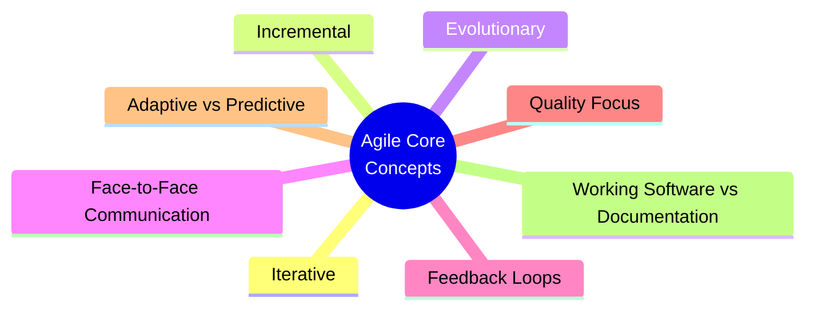
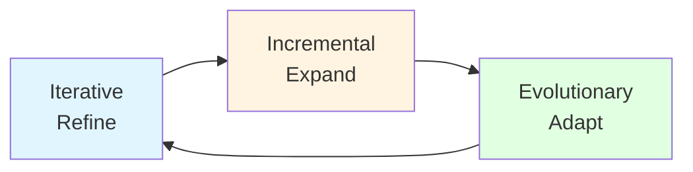
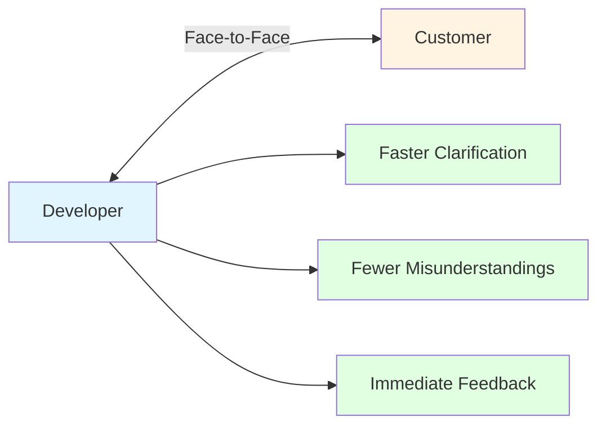
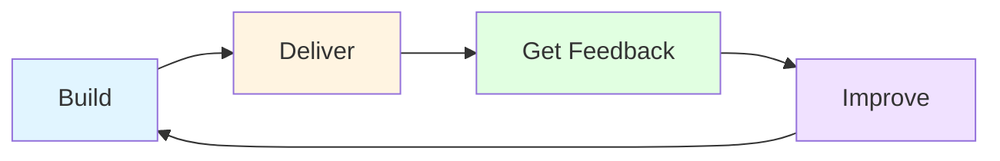
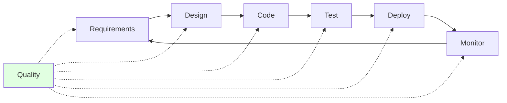
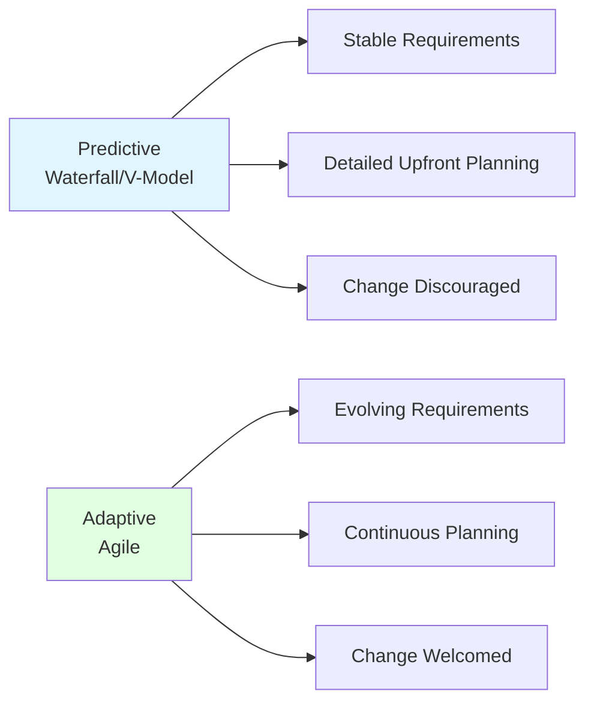
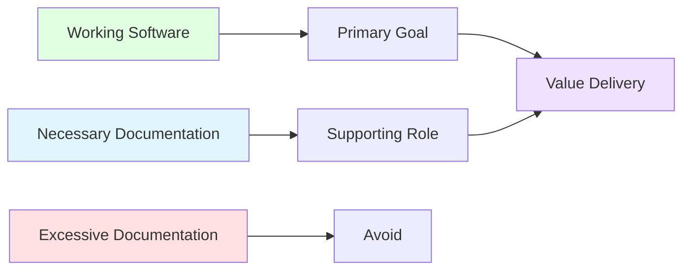
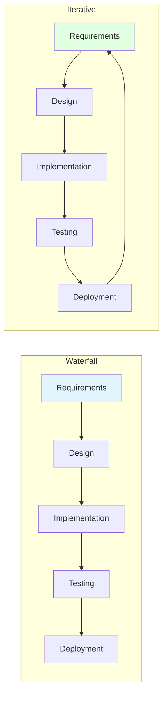
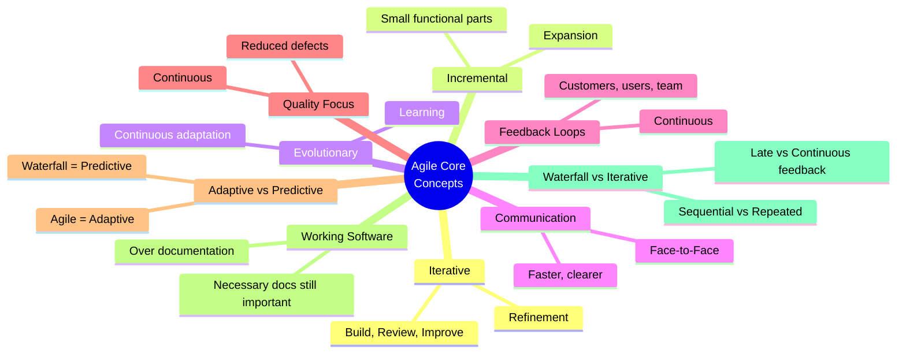

# Agile Core Concepts — Master's-Level Notes

> **Course Context:** Software Engineering (Agile Practices)
> **Topic:** Agile Foundations and Core Concepts — Iterative/Incremental/Evolutionary Development, Communication, Feedback, Quality, Adaptive vs Predictive, Documentation, and Waterfall Comparison
> **Prerequisites:** Basic understanding of software development lifecycle (SDLC), traditional Waterfall model, and introductory Agile concepts.

---

## 1. Introduction: Agile Foundations

### 1.1 Values and Principles

> Agile is based on a set of **values** and **principles**.
> - **Values** tell us **what is important**.
> - **Principles** guide **how we should behave**.

### 1.2 Key Concepts That Define Agile Software Development

| **#** | **Core Concept** | **Description** |
|---|---|---|
| **1** | **Small, Repeated Cycles** | Agile develops software through small, repeated cycles. |
| **2** | **Smaller Functional Parts** | Software can be delivered in smaller functional parts instead of waiting for the complete system. |
| **3** | **Evolving Requirements** | Requirements may evolve as users provide feedback. |
| **4** | **Direct Communication** | Improves collaboration and reduces misunderstandings. |
| **5** | **Continuous Feedback** | Helps improve software quality. |
| **6** | **Adaptive Approach** | Agile follows an adaptive approach, whereas traditional models are generally predictive. |
| **7** | **Working Software > Documentation** | Agile values working software more than excessive documentation, while still recognizing the importance of necessary documentation. |



---

## 2. Iterative, Incremental, and Evolutionary Development

> Agile software development **does not attempt to build the entire system in one attempt**. Instead, the software is developed **gradually**, allowing **learning and improvement** throughout the project.

### 2.1 Iterative Development

> **Iterative development** means **building, reviewing, and improving the same software repeatedly**.

**Key Characteristics:**
- Each cycle **improves the product** based on **feedback** or **newly discovered requirements**.
- Focuses on **refinement**.

**Example:**
> A shopping application is developed with a basic search feature. After users try it, the search interface is improved in the next iteration.

**Key Idea:**
```
Build → Review → Improve → Repeat
```

### 2.2 Incremental Development

> **Incremental development** means **delivering the software in small functional parts**, where each part **adds new capabilities**.

**Key Characteristics:**
- Each version is **usable**.
- Focuses on **expansion**.

**Example:**
| **Version** | **Features** |
|---|---|
| Version 1 | Login, Registration |
| Version 2 | Product Search |
| Version 3 | Shopping Cart |

**Key Idea:**
> Deliver useful software early and continue adding features.

### 2.3 Evolutionary Development

> **Evolutionary development** means the software **continuously changes** as users provide feedback and new needs arise.

**Key Characteristics:**
- Instead of assuming all requirements are known at the beginning, the software **evolves throughout development**.
- Focuses on **learning and evolution**.

**Example:**
> A food delivery application initially provides ordering functionality. Later, users request **live order tracking** and **online payments**, which become part of future versions.

### 2.4 Comparison: Iterative vs Incremental vs Evolutionary

| **Iterative** | **Incremental** | **Evolutionary** |
|---|---|---|
| Improves existing features | Adds new features | Continuously adapts to changing needs |
| Focuses on refinement | Focuses on expansion | Focuses on learning and evolution |



> **Exam Tip:** A common exam question is *"Differentiate between iterative, incremental, and evolutionary development."* Use the table above — focus on **refinement vs expansion vs adaptation**.

---

## 3. Face-to-Face Communication

### 3.1 The Agile Principle

> One of the Agile Principles states that **direct communication is the most effective way of sharing information**.

**Key Idea:**
- Instead of relying only on **documents or emails**, Agile encourages team members and customers to **communicate directly** whenever possible.

### 3.2 Benefits

| **Benefit** | **Description** |
|---|---|
| **Faster clarification of doubts** | Immediate answers, no waiting for email replies |
| **Fewer misunderstandings** | Tone, context, and nuance are clearer in person |
| **Faster decision making** | No back-and-forth chains |
| **Better collaboration** | Builds trust and relationships |
| **Immediate feedback** | Real-time input and adjustment |

**Example:**
> Instead of exchanging multiple emails to clarify a requirement, a developer discusses it **directly with the customer**, and the issue is resolved immediately.



---

## 4. Feedback Loops

### 4.1 The Agile Approach

> Agile promotes obtaining **feedback throughout development** rather than **waiting until the entire software is completed**.

**Feedback May Come From:**
- **Customers**
- **End users**
- **Team members**

**Key Idea:**
- Each round of feedback helps **improve the next version** of the software.

### 4.2 Benefits

| **Benefit** | **Description** |
|---|---|
| **Problems identified earlier** | Issues caught before they become expensive |
| **Changes incorporated easily** | Feedback drives adaptation |
| **Customer satisfaction improves** | Customers feel heard and valued |
| **Final product better meets user needs** | Built with continuous input |



---

## 5. Quality Focus in Agile

### 5.1 The Agile Approach

> In Agile, **quality is considered throughout the development process**.

**Key Idea:**
- Instead of **building the entire system first and checking quality only at the end**, quality is **continuously maintained** during development.
- This helps **reduce defects** and **improve the reliability** of the software.

### 5.2 Benefits

| **Benefit** | **Description** |
|---|---|
| **Better software quality** | Continuous attention to quality |
| **Fewer errors** | Early detection and prevention |
| **Reduced rework** | Fixing issues when they're small |
| **Higher customer confidence** | Reliable software builds trust |



> **Key Insight:** Quality is **not a phase** — it's a **continuous concern** in Agile.

---

## 6. Adaptive vs Predictive Approaches

### 6.1 Overview

> Software development approaches can be broadly classified as **Predictive** or **Adaptive**.

### 6.2 Predictive Approach

> The project is **planned in detail before development begins**.

**Examples:** Waterfall Model, V-Model

**Characteristics:**
- **Stable requirements**
- **Detailed planning**
- **Changes are minimized**
- **Development follows the original plan**

### 6.3 Adaptive Approach

> **Planning and development evolve** as the project progresses.

**Example:** Agile

**Characteristics:**
- **Requirements may change**
- **Customer feedback is encouraged**
- **Planning is continuously refined**
- **Changes are expected and accepted**

### 6.4 Comparison: Predictive vs Adaptive

| **Predictive** | **Adaptive** |
|---|---|
| Requirements fixed early | Requirements may evolve |
| Detailed upfront planning | Planning evolves throughout the project |
| Change is discouraged | Change is welcomed |
| Suitable for stable projects | Suitable for changing projects |



> **Exam Tip:** A common question is *"Compare predictive and adaptive approaches."* Remember: **Predictive = plan-driven; Adaptive = change-driven.**

---

## 7. Working Software vs Documentation

### 7.1 The Agile Value

> One of the Agile Values states: **"Working software over comprehensive documentation."**

**Important Clarification:**
> This **does not mean documentation is unnecessary**.

**It means:**
- Documentation should **support software development** rather than becoming the **primary objective**.

### 7.2 Good Documentation Should

| **Purpose** | **Description** |
|---|---|
| **Explain important information** | Critical details for understanding |
| **Help developers understand the system** | Onboarding, knowledge transfer |
| **Assist future maintenance** | Long-term support and evolution |

### 7.3 What Agile Believes

> **Build useful software. Maintain necessary documentation. Avoid creating documents that provide little practical value.**



---

## 8. Iterative Development vs Waterfall

### 8.1 Waterfall Model

| **Characteristic** | **Description** |
|---|---|
| **Development Style** | Sequential phases |
| **Requirements** | Expected to remain stable |
| **Customer Feedback** | Customers usually see the software near the end of the project |
| **Change Cost** | Changes become increasingly expensive as the project progresses |

### 8.2 Iterative Development

| **Characteristic** | **Description** |
|---|---|
| **Development Style** | Repeated cycles |
| **Customer Feedback** | Customers can review intermediate versions |
| **Improvement** | Improvements are made after every cycle |
| **Change Handling** | Changes can be accommodated throughout development |

### 8.3 Comparison: Waterfall vs Iterative

| **Waterfall** | **Iterative** |
|---|---|
| Sequential development | Repeated development cycles |
| Single final delivery | Multiple improved versions |
| Late customer feedback | Continuous customer feedback |
| Difficult to accommodate changes | Easier to accommodate changes |



> **Exam Tip:** A common exam question is *"Compare Waterfall and Iterative development."* Focus on **sequential vs repeated**, **single vs multiple deliveries**, and **late vs continuous feedback**.

---

## 9. Advantages and Disadvantages of Agile Core Concepts

### 9.1 Advantages

| **Advantage** | **Description** |
|---|---|
| **Flexibility** | Adapts to changing requirements |
| **Early Value Delivery** | Working software delivered early and often |
| **Continuous Feedback** | Improves quality and customer satisfaction |
| **Better Collaboration** | Face-to-face communication |
| **Quality Focus** | Continuous attention to quality |
| **Reduced Risk** | Small cycles catch problems early |
| **Customer Satisfaction** | Customers see progress and provide input |

### 9.2 Disadvantages / Challenges

| **Challenge** | **Description** |
|---|---|
| **Requires Discipline** | Teams must follow Agile practices |
| **Cultural Shift** | Requires change from traditional models |
| **Documentation Balance** | Finding the right level of documentation |
| **Customer Availability** | Requires active customer involvement |
| **Scaling Challenges** | Hard to scale to large organizations |
| **Estimation Difficulty** | Relative estimation can be challenging |

---

## 10. Real-World Examples and Analogies

### 10.1 Analogy: Building a House

- **Waterfall** = Building the entire house from a fixed blueprint — no changes allowed until the end.
- **Iterative** = Building one room, getting feedback, improving it, then moving to the next.
- **Incremental** = Adding rooms one by one — each room is usable as soon as it's done.
- **Evolutionary** = The house evolves as the family's needs change — adding a nursery, then a home office.

### 10.2 Real-World Use Cases

| **Company** | **Agile Practice** | **Result** |
|---|---|---|
| **Spotify** | Iterative, incremental delivery | Autonomous squads, continuous improvement |
| **Amazon** | Continuous feedback, adaptive planning | Deploy every 11.7 seconds |
| **Netflix** | Evolutionary development | Thousands of deployments/day |
| **Google** | Quality focus, feedback loops | High reliability, innovation |
| **Startups** | Adaptive approach | Fast time to market |

---

## 11. Exam Tips

> **📝 Exam Tips — Commonly Asked Questions:**

1. **Define Agile.** What are its core concepts?
2. **Differentiate between iterative, incremental, and evolutionary development.**
3. **What is face-to-face communication?** Why is it important in Agile?
4. **What are feedback loops?** Why are they important?
5. **How does Agile focus on quality?**
6. **Compare predictive and adaptive approaches.**
7. **What does "working software over comprehensive documentation" mean?**
8. **Compare Waterfall and Iterative development.**
9. **What are the benefits of iterative development?**
10. **Why does Agile value working software over documentation?**
11. **What is the role of customer feedback in Agile?**
12. **How does Agile handle changing requirements?**

> **⚠️ Tricky Concepts:**
> - **Iterative ≠ Incremental** — iterative refines, incremental expands.
> - **Evolutionary** = continuous adaptation.
> - **Agile does NOT mean no documentation** — it means **necessary** documentation.
> - **Predictive = plan-driven; Adaptive = change-driven.**
> - **Waterfall = sequential; Iterative = repeated cycles.**
> - **Feedback loops** are continuous, not one-time.
> - **Quality is continuous** in Agile, not a phase.

---

## 12. Common Interview Questions

1. **What is Agile?**
   - *Answer:* A set of values and principles for developing software through small, repeated cycles with continuous feedback and adaptation.

2. **What is the difference between iterative and incremental development?**
   - *Answer:* Iterative = repeatedly improving the same software; Incremental = delivering in small functional parts.

3. **What is evolutionary development?**
   - *Answer:* Software continuously changes as users provide feedback and new needs arise.

4. **Why does Agile value face-to-face communication?**
   - *Answer:* It's the most effective way to share information — faster clarification, fewer misunderstandings, immediate feedback.

5. **What are feedback loops in Agile?**
   - *Answer:* Continuous cycles of getting feedback from customers, users, and team members to improve the next version.

6. **How does Agile ensure quality?**
   - *Answer:* Quality is continuously maintained throughout development, not checked only at the end.

7. **What is the difference between predictive and adaptive approaches?**
   - *Answer:* Predictive = detailed upfront planning, stable requirements; Adaptive = evolving planning, changing requirements.

8. **What does "working software over comprehensive documentation" mean?**
   - *Answer:* Documentation should support development, not become the primary objective. Necessary documentation is still important.

9. **Compare Waterfall and Iterative development.**
   - *Answer:* Waterfall = sequential, single delivery, late feedback; Iterative = repeated cycles, multiple deliveries, continuous feedback.

10. **Why is Agile better for changing requirements?**
    - *Answer:* Agile's iterative, adaptive approach accommodates changes throughout development, unlike Waterfall's fixed plan.

---

## 13. Summary

### Key Takeaways



### One-Page Recap

- **Agile** = values + principles + core concepts.
- **Iterative** = build, review, improve, repeat (refinement).
- **Incremental** = deliver in small functional parts (expansion).
- **Evolutionary** = continuously adapt to changing needs (learning).
- **Face-to-Face Communication** = most effective way to share information.
- **Feedback Loops** = continuous feedback from customers, users, team.
- **Quality Focus** = quality maintained throughout, not just at the end.
- **Adaptive vs Predictive** = Agile is adaptive; Waterfall is predictive.
- **Working Software > Documentation** = necessary docs still important.
- **Waterfall vs Iterative** = sequential vs repeated; single vs multiple deliveries; late vs continuous feedback.

> **Final Exam Tip:** Always connect Agile core concepts back to the **Agile Manifesto values and principles** — iterative delivery, customer collaboration, responding to change, and working software.

---

## 14. References & Further Reading

- **Agile Manifesto** — agilemanifesto.org
- **Agile Estimating and Planning** — Mike Cohn
- **User Stories Applied** — Mike Cohn
- **Scrum Guide** — Ken Schwaber & Jeff Sutherland
- **The Agile Samurai** — Jonathan Rasmusson
- **Official Docs:** Agile Alliance, Scrum Alliance, Scrum.org

---

*End of Notes — Agile Core Concepts*