# Scrum — Master's-Level Notes

> **Course Context:** Software Engineering (Agile Practices)
> **Topic:** Scrum Framework — History, Values, Roles, Artifacts, Events, and Process
> **Prerequisites:** Basic understanding of Agile methodology, software development lifecycle, and team collaboration concepts.

---

## 1. Introduction to Scrum

### 1.1 What is Scrum?

> **Scrum** is a **framework within the Agile methodology**. It is a **lightweight framework** for developing **complex products**.

**Core Idea:**
- Deliver **usable product increments** in **short cycles (Sprints)**
- **Inspect** results
- **Adapt** based on feedback

**Key Characteristics:**
- Uses **time-boxed cycles** called **Sprints** to deliver incremental improvements
- Emphasizes **regular feedback** through **Sprint Reviews**
- **Most popular Agile framework** in the world

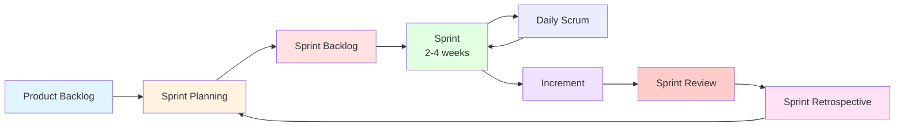

---

## 2. History of Scrum

### 2.1 Timeline

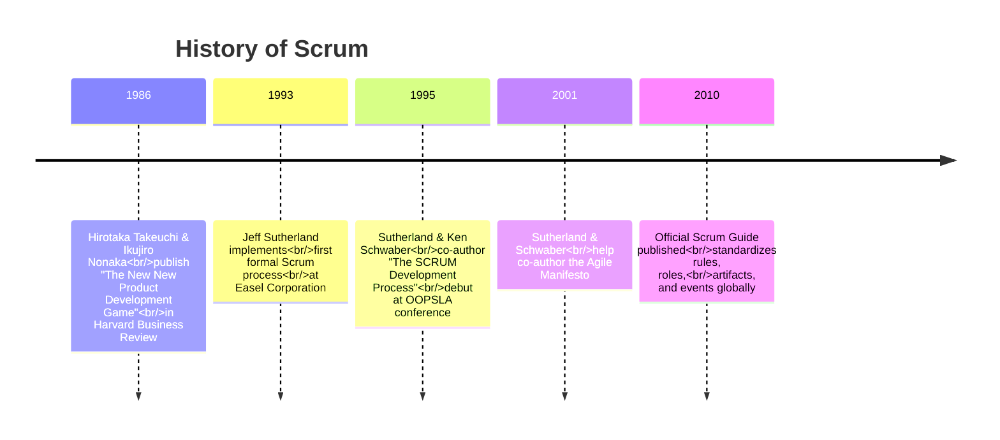

### 2.2 Key Milestones

| **Year** | **Event** | **Description** |
|---|---|---|
| **1986** | **The Rugby Inspiration** | Hirotaka Takeuchi and Ikujiro Nonaka write "The New New Product Development Game" in Harvard Business Review. They introduce a fast, cross-functional **"rugby" approach** where teams move together as a single unit. |
| **1993** | **First Practical Implementation** | Jeff Sutherland implements the first formal Scrum process for software at **Easel Corporation**. |
| **1995** | **Public Formalization** | Jeff Sutherland and Ken Schwaber co-author **"The SCRUM Development Process."** They debut the framework publicly at the **OOPSLA conference**. |
| **2001** | **The Agile Manifesto** | Sutherland and Schwaber help co-author the foundational **Agile Manifesto**. Scrum becomes the most dominant framework used to execute Agile principles. |
| **2010** | **The Definitive Rulebook** | The official **Scrum Guide** is published for the first time. It standardizes the rules, roles, artifacts, and events globally. |

> **Exam Tip:** Remember the key names: **Takeuchi & Nonaka (1986)**, **Jeff Sutherland (1993)**, **Ken Schwaber (1995)**, **Agile Manifesto (2001)**, **Scrum Guide (2010)**.

---

## 3. Scrum Values

Scrum introduces **5 values** to guide behavior and teamwork:

| **Scrum Value** | **What It Means in Practice** |
|---|---|
| **Commitment** | Team members are committed to the team's goals and to doing their part to reach them. |
| **Focus** | Everyone focuses on the work of the Sprint and the goals of the Scrum Team. |
| **Openness** | Scrum Team members and stakeholders agree to be open about work and challenges. Everyone shares **Problems, Progress, Risks**. |
| **Respect** | Team members respect each other's skills, backgrounds, and contributions. |
| **Courage** | Scrum Team members have the courage to do the right thing and work through tough problems. The team members should have courage to **Admit mistakes, Raise risks, Say requirements changed, Reject poor quality**. |

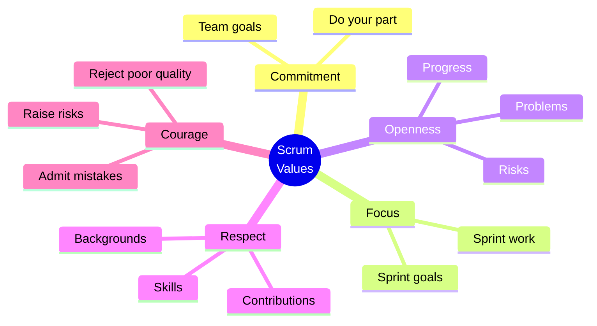

---

## 4. Scrum Roles

Scrum defines **three roles**:

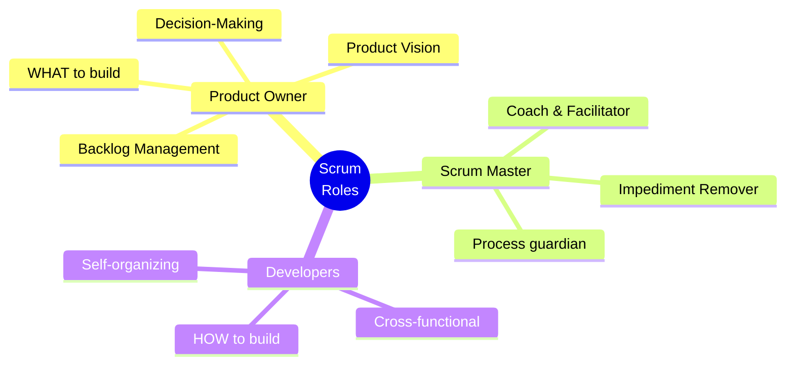

### 4.1 Who Decides WHAT to Build? — Product Owner

> The **Product Owner** is the **strategic leader of the product**.

**Key Characteristics:**
- Decides **what** gets built and **in what order**, but **not how** it is built.
- A **bridge between stakeholders and the Scrum Team**, making tough prioritization decisions to keep the product vision on track.
- Ensures every iteration (Sprint) delivers **value aligned with customer needs** and organizational goals.

**Key Responsibilities:**

| **Responsibility** | **Details** |
|---|---|
| **Product Vision & Goal** | Develops and communicates the product vision and long-term objectives. Acts as the **voice of the customer** and represents stakeholder needs. |
| **Product Backlog Management** | Creates and clearly communicates backlog items. Orders backlog items by **priority and value**. Ensures backlog is **transparent, visible, and understood**. |
| **Decision-Making** | Decides what features or changes are included in the product. Balances stakeholder requests with strategic product goals. Provides timely guidance to the Scrum Team. |

### 4.2 Who Decides HOW to Build? — Developers

> In Scrum, the **Developers** own the **"how"** — they transform the Product Owner's vision into reality using their expertise.

**Key Characteristics:**
- **Builders and problem-solvers** — they don't just "code what's told"
- Actively **interpret the vision, design solutions, and ensure quality**
- Make the abstract product vision **tangible and usable**

**Key Principles:**

| **Principle** | **Description** |
|---|---|
| **One Team, Shared Accountability** | Architecture, database, UI, coding, and testing are not split into silos — they're all handled by the Developers. |
| **Self-organization** | The team decides the best way to accomplish the work, often with members specializing in certain areas but still collaborating. |
| **Incremental Delivery** | Every Sprint produces a **tested, usable increment** that reflects both design and implementation. |

**Cross-functional Team:**
> A **cross-functional team** is a **self-managing group** that possesses **all the necessary skills** — such as development, design, testing, and business analysis — to turn a concept into a finished, usable product **without relying on anyone outside the team**.

| **Characteristic** | **Description** |
|---|---|
| **All-inclusive Skills** | A single team contains everyone required to complete a task (front-end, back-end, UX, QA). |
| **Shared Responsibility** | Members collaborate closely to achieve a common Sprint Goal. |
| **T-Shaped Professionals** | Members have **deep expertise in one area** (vertical bar) but **broad understanding of others** (horizontal bar) to help teammates. |

**Example:**
> The Product Owner defines the backlog item: **"Secure Login."**
> The Developers break it down into **architecture, DB, UI, coding, and testing** tasks.
> Within the Sprint, they **self-organize** to complete all tasks.
> By Sprint Review, a **tested, usable login feature** is demoed.

### 4.3 Who Ensures Scrum is Followed? — Scrum Master

> The **Scrum Master** is the **steward of the Scrum framework**.

**Key Characteristics:**
- **Doesn't decide what or how to build**
- Ensures the team follows **Scrum principles**
- Enables the Product Owner and Developers to **focus on delivering value**

**Role of the Scrum Master:**

| **Role** | **Description** |
|---|---|
| **Guardian of Scrum Principles** | Makes sure the team is applying Scrum correctly, not slipping back into old habits like waterfall or command-and-control. |
| **Coach & Facilitator** | Helps the team and the organization understand Scrum theory, practices, rules, and values. |
| **Impediment Remover** | Works to eliminate obstacles that slow down the team. |
| **Neutral Role** | Unlike the Product Owner (who owns **what** to build) and Developers (who own **how** to build), the Scrum Master owns the **process**. |

**Responsibilities:**

| **Responsibility** | **Description** |
|---|---|
| **Guides Sprint Events** | Planning, Daily Scrum, Review, Retrospective — so they stay effective. |
| **Coaches the Product Owner** | On backlog management and stakeholder collaboration. |
| **Supports Developers** | In self-organization and continuous improvement. |
| **Works with the Organization** | To adopt Scrum and agile thinking. |

**About the Scrum Master:**
> The Scrum Master is **not the boss** of the team. They're more like a **coach, servant leader, and process guide**. Their job is to help the team follow Scrum, remove blockers, and improve continuously.

**They ensure that:**
- **Scrum ceremonies happen** (planning, daily stand-up, review, retrospective)
- The team **understands Agile principles**
- The environment **supports self-organization and collaboration**

**Scrum Master Responsibilities Table:**

| **Area** | **Responsibility** |
|---|---|
| **Facilitation** | Organize and moderate Scrum ceremonies (daily stand-up, planning, review, etc.) |
| **Coaching** | Guide team members, Product Owner, and stakeholders on Agile best practices |
| **Removing blockers** | Help remove any impediments slowing the team (technical, organizational, etc.) |
| **Team protection** | Shield the team from distractions and scope creep during a sprint |
| **Improvement** | Foster continuous improvement via retrospectives and metrics (velocity, etc.) |
| **Communication** | Help the team and stakeholders stay aligned and transparent |

### 4.4 Summary of Scrum Roles

| **Role** | **Owns** | **Key Question** |
|---|---|---|
| **Product Owner** | **WHAT** to build | What is the most valuable thing to build next? |
| **Scrum Master** | **PROCESS** | Is the team following Scrum effectively? |
| **Developers** | **HOW** to build | How do we deliver a quality increment? |

---

## 5. Scrum Artifacts

Scrum defines **three artifacts**:

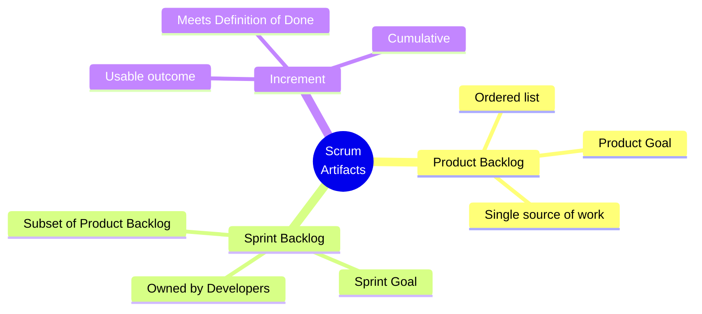

### 5.1 Product Backlog

> The **Product Backlog** is an **ordered list of everything that might be needed in the product**, serving as the **single source of work** for the Scrum Team. It acts as a **living roadmap** that adapts to feedback and change.

**Key Characteristics:**

| **Characteristic** | **Description** |
|---|---|
| **Dynamic** | It's never complete; items are added, refined, or removed as the product and environment change. |
| **Ordered** | Items are prioritized by **value, risk, and necessity**. The most important items appear at the top. |
| **Transparent** | Everyone can see what's planned, what's next, and why. |
| **Owned by the Product Owner** | They are accountable for its content, availability, and ordering. |

**Product Goal:**
> The **long-term objective** for the product. It describes **where the product is headed** and provides **direction across multiple Sprints**.

- The Product Owner is accountable for setting the Product Goal, in collaboration with stakeholders and the Scrum Team.
- It's part of the Product Backlog — the **Product Goal sits at the top**, guiding backlog items.
- The Product Goal keeps the team aligned with the big picture.

**Example Product Goal:**
> "Enable students to learn online with personalized dashboards."

**Sample Product Backlog:**

| **Order** | **Item Type** | **Description** |
|---|---|---|
| 1 | Feature | Secure Login |
| 2 | Feature | Course catalog with search and filter options |
| 3 | Bug Fix | Correct broken link in the "Help" section |
| 4 | Feature | Video player with playback speed control |
| 5 | Technical Work | Database optimization for faster course loading |
| 6 | Research/Spike | Investigate integration with external certification providers |
| 7 | Feature | Discussion forum for students |
| 8 | Bug Fix | Fix alignment issue on mobile dashboard |
| 9 | Feature | Progress tracking dashboard for learners |
| 10 | Technical Work | Implement automated testing framework |

### 5.2 Sprint Backlog

> The **Sprint Backlog** is a **subset of the Product Backlog**, listing the items **selected for the Sprint**, plus a **plan for delivering them**.

**Key Characteristics:**
- **Developers own it** — they decide how much work they can commit to and how they'll do it.
- Provides **transparency** about what the team is working on right now.

**Sprint Goal:**
> The Scrum Team together defines **what is the goal of the Sprint** to answer: **"Why are we doing this Sprint?"**

- Sets the **short-term target** for a single Sprint.
- During Sprint Planning:
  - Product Owner proposes the priority items
  - Developers assess capacity and feasibility
  - Together, they agree on a Sprint Goal

**Example Sprint Goal:**
> "Deliver secure login so users can safely access the platform."

### 5.3 Increment

> An **Increment** is the **usable product outcome** created during a Sprint. It must meet the **Definition of Done (DoD)** to be considered complete.

**Key Insight:**
> Without meeting DoD, it's **not a true Increment** — it's just unfinished work. The Increment is the **proof of progress** in Scrum. It's not just code or partial work — it's a **usable, quality outcome** that demonstrates value and moves the product closer to its goal.

**Key Characteristics:**

| **Characteristic** | **Description** |
|---|---|
| **Usable** | Adds value and can be put into production. |
| **Cumulative** | Builds on all previous Increments, moving closer to the Product Goal. |
| **Transparent** | Shows stakeholders what has actually been delivered, not just planned. |
| **Multiple per Sprint** | Developers may create several Increments, but they all add up to one inspected Increment at the Sprint Review. |

**Important Note:**
> An Increment, **even if not released**, should be in a **releasable state**. Every Sprint must produce software that **could be released**. Whether it is released depends on **business needs, market timing, customer readiness, or strategic decisions**. The **Product Owner decides** whether releasing now creates value.

---

## 6. Scrum Events

> **Scrum Events** are **structured, time-boxed meetings** that help the Scrum Team **plan their work, monitor progress, inspect the product, and continuously improve** both the product and the way they work.

> In Scrum, we don't do meetings for the sake of meeting. We use Events to **eliminate wasted time, create predictability, and inspect our work**.

### 6.1 Overview of Scrum Events

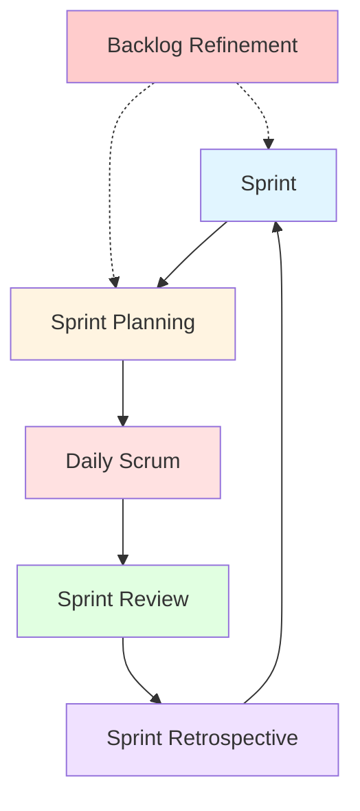

| **Event** | **Time-box** | **Purpose** | **Attendees** |
|---|---|---|---|
| **Sprint** | 2–4 weeks | Create a usable, valuable increment | Scrum Team |
| **Sprint Planning** | 8 hours (for 4-week Sprint) | Plan what to build and how | Scrum Team |
| **Daily Scrum** | 15 minutes | Daily checkpoint, alignment | Developers (SM ensures, PO may attend) |
| **Sprint Review** | 4 hours (for 4-week Sprint) | Inspect outcome, get feedback | Scrum Team + Stakeholders |
| **Sprint Retrospective** | 3 hours (for 4-week Sprint) | Improve process and teamwork | Scrum Team only |
| **Backlog Refinement** | Ongoing | Review, refine, prioritize backlog items | Scrum Team |

---

### 6.2 The Sprint

> A **Sprint** is a **fixed-length event** (usually **2–4 weeks**) where the Scrum Team creates a **usable, valuable product increment**.

**Key Characteristics:**

| **Characteristic** | **Description** |
|---|---|
| **Time-boxed** | Never extended once started. |
| **Continuous** | Starts immediately after the previous Sprint ends. |
| **Contains all work** | All work needed to achieve the Sprint Goal. |
| **Heartbeat of Scrum** | The Sprint is the core cycle — everything else (Planning, Daily Scrum, Review, Retrospective) happens inside it. |
| **Predictability** | Fixed length creates consistency; stakeholders know when to expect progress. |
| **Inspection & Adaptation** | At the end of each Sprint, the increment is reviewed, and the team reflects on how to improve. |

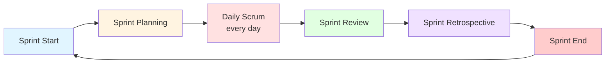

---

### 6.3 Sprint Planning: How Much Work Do We Do?

> The decision about **how much work to do in a Sprint** is made **collaboratively by the Developers** during Sprint Planning.

**Key Insight:**
> The **Developers themselves decide** how much work to take on in a Sprint. They own the entire technical journey — **architecture, database, UI, coding, and testing** — and commit only to what they believe they can deliver as a **usable increment**.

**How It's Decided:**

| **Step** | **Description** |
|---|---|
| **1. Product Owner presents priorities** | They share the highest-value items from the Product Backlog (the **what**). |
| **2. Developers assess capacity** | They look at their availability (holidays, other commitments). They consider **past velocity** (how much work they usually complete in a Sprint). |
| **3. Developers break down work** | Each backlog item is decomposed into tasks: architecture decisions, database design, UI design, coding, and testing. They estimate effort for each task. |
| **4. Developers commit to a realistic amount** | Based on their capacity and estimates, they decide how many backlog items they can complete while meeting the **Definition of Done** (including design, code, and testing). The **Sprint Goal** is then agreed upon. |

**Sprint Planning Example: Secure Login Feature:**

| **Step** | **Action** | **Details** |
|---|---|---|
| **Step 1: Product Owner Presents** | PO says: "The top priority for this Sprint is Secure Login." | They explain the business value: users need safe access before other features matter. |
| **Step 2: Developers Break Down Work** | The Developers discuss and split the backlog item into tasks. | **Architecture:** Decide authentication flow (email + password, optional 2FA). **Database:** Create Users table, add Sessions table, index email. **UI/UX:** Design login page, add "Forgot Password" link, error messages. **Coding:** Implement /login, /logout, /register. **Testing:** Write unit tests for hashing, integration tests for login flow, exploratory tests. |
| **Step 3: Estimate Effort** | Developers estimate each task. | e.g., 2 days for backend endpoints, 1 day for UI, 1 day for DB design, 2 days for testing. **Total estimated effort: ~6 days of work.** |
| **Step 4: Check Capacity** | Team of 3 Developers, each available ~8 days this Sprint → total capacity ~24 days. | Secure Login (6 days) fits comfortably, so they can also commit to a smaller second item (e.g., "Fix Help Section link"). |
| **Step 5: Commit to Sprint Goal** | Sprint Goal: "Deliver a secure login system so users can safely access the platform." | Developers commit to Secure Login + one small bug fix. |

---

### 6.4 Daily Scrum

> The **Daily Scrum** is the team's **daily checkpoint**. It is **time-boxed to 15 minutes**, held **every day of the Sprint**.

**Purpose:**
- Keeps everyone **aligned**
- Surfaces **obstacles early**
- Ensures the **Sprint Goal stays achievable**

**Key Insight:**
> It's **not a status report** to the Scrum Master or Product Owner — it's a **planning session for the Developers themselves**.

**Who Attends:**
- **Only Developers** are required
- **Scrum Master** ensures it happens
- **Product Owner** may attend but doesn't drive it

**What is Done in Daily Scrum:**
- It helps to come up with a **shared plan for that day** that keeps the team aligned and adaptive.

**Each Developer shares:**
1. What they did **yesterday** to help achieve the Sprint Goal.
2. What they plan to do **today**.
3. Any **impediments** they face.

The team then **adjusts their plan** if needed.

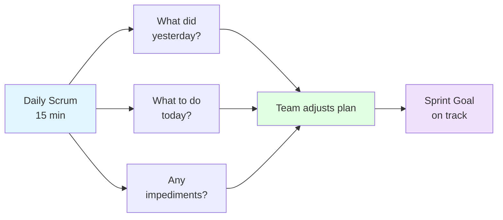

---

### 6.5 Sprint Review

> The purpose of the **Sprint Review** is to **inspect the outcome of the Sprint** and **determine future adaptations**.

**Key Characteristics:**

| **Characteristic** | **Description** |
|---|---|
| **Attendees** | Scrum Team and **stakeholders**. |
| **Purpose** | The Scrum Team presents the results of their work to key stakeholders and **progress toward the Product Goal** is discussed. |
| **Goal** | Get **feedback** on the increment, discuss **what's next**, and **adjust priorities**. |

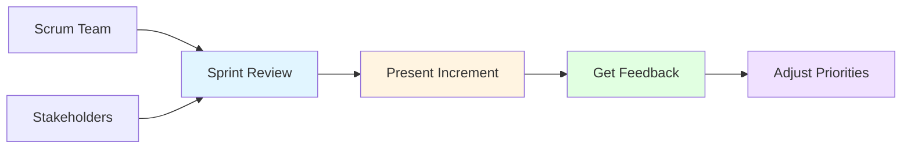

---

### 6.6 Sprint Retrospective

> The purpose of the **Sprint Retrospective** is to **plan ways to increase quality and effectiveness**.

**Key Characteristics:**

| **Characteristic** | **Description** |
|---|---|
| **Attendees** | **Scrum Team members only**. |
| **Focus** | The Scrum Team inspects how the last Sprint went with regards to **individuals, interactions, processes, tools, and their Definition of Done**. |
| **Action** | The Scrum Team identifies the **most helpful changes** to improve its effectiveness. |
| **Purpose** | **Continuous improvement** of teamwork, tools, and processes. |

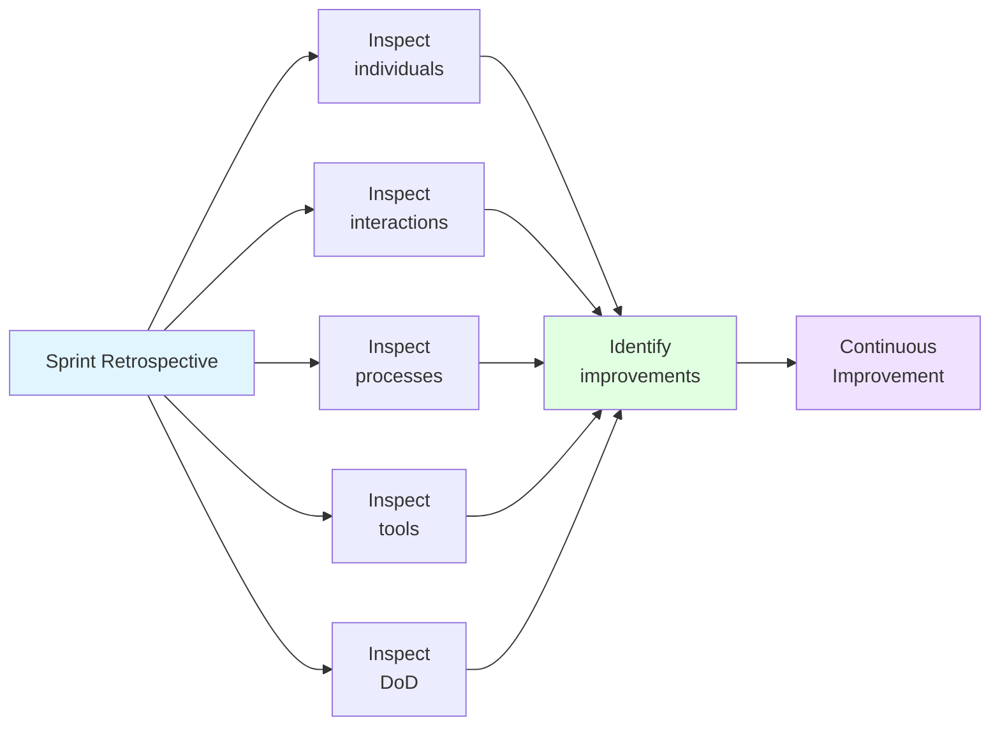

---

### 6.7 Backlog Refinement

> **Backlog Refinement** is the process of **reviewing, refining, and prioritizing items** in a Product Backlog to ensure they are **ready for upcoming Sprints**.

**Key Characteristics:**
- **Ongoing activity** — not a formal Scrum event
- Ensures the backlog is **healthy and ready**
- Involves the **Product Owner and Developers**

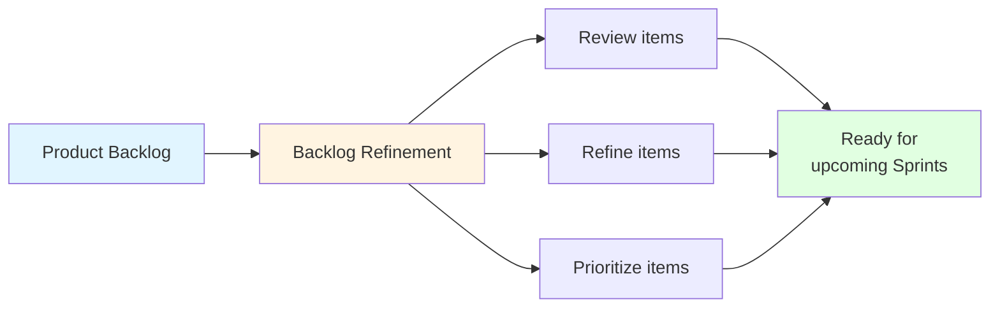

---

## 7. How the Scrum Process Works

> The Scrum framework relies on a system of **continuous improvement**. In Scrum, you recognize you might **not know anything at the start of a Sprint** — and you can **adjust your processes and needs** as needed based on the information you gain during the Sprint process.

### 7.1 Scrum Process Flow

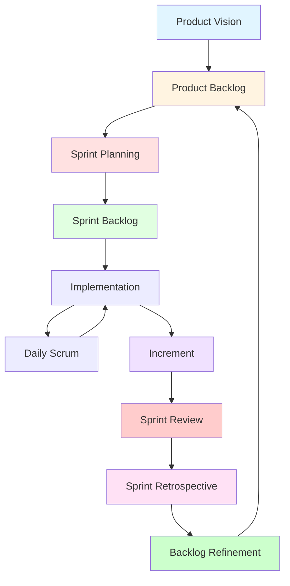

### 7.2 The Scrum Cycle

| **Phase** | **Description** |
|---|---|
| **Product Vision** | The long-term goal of the product. |
| **Product Backlog** | Ordered list of everything that might be needed. |
| **Sprint Planning** | Team plans what to build and how. |
| **Sprint Backlog** | Subset of Product Backlog for the Sprint. |
| **Implementation** | Developers build the increment. |
| **Daily Scrum** | Daily 15-minute checkpoint. |
| **Increment** | Usable product outcome meeting DoD. |
| **Sprint Review** | Inspect outcome, get feedback. |
| **Sprint Retrospective** | Improve process and teamwork. |
| **Backlog Refinement** | Review, refine, prioritize backlog items. |

---

## 8. Advantages and Disadvantages of Scrum

### 8.1 Advantages

| **Advantage** | **Description** |
|---|---|
| **Flexibility** | Adapts to changing requirements. |
| **Transparency** | Everyone sees what's happening. |
| **Frequent Feedback** | Sprint Reviews provide regular feedback. |
| **Continuous Improvement** | Retrospectives drive improvement. |
| **Team Empowerment** | Self-organizing teams. |
| **Predictable Delivery** | Fixed-length Sprints create rhythm. |
| **Early Value Delivery** | High-priority features delivered first. |
| **Risk Reduction** | Small increments reduce risk. |

### 8.2 Disadvantages / Challenges

| **Challenge** | **Description** |
|---|---|
| **Requires Discipline** | Teams must follow Scrum rules. |
| **Cultural Shift** | Requires change from traditional models. |
| **Role Confusion** | New roles (PO, SM) can be misunderstood. |
| **Meeting Overhead** | Ceremonies can feel like too many meetings. |
| **Not for All Projects** | Best for complex, evolving products. |
| **Scaling Challenges** | Hard to scale to large organizations without frameworks like LeSS/SAFe. |
| **Estimation Difficulty** | Story points are relative, not absolute. |

---

## 9. Real-World Examples and Analogies

### 9.1 Analogy: Rugby Team

- **Scrum** = A **rugby team** — everyone moves together as a single unit, adapting to the game in real-time.
- **Product Owner** = Team captain — decides the strategy (what to build).
- **Scrum Master** = Coach — ensures the team follows the rules and improves.
- **Developers** = Players — execute the strategy (how to build).
- **Sprint** = A **match** — a fixed period of intense, focused effort.
- **Daily Scrum** = **Huddle** — quick alignment before the next play.
- **Sprint Review** = **Post-match analysis** — what worked, what didn't.
- **Retrospective** = **Training session** — how to improve for the next match.

### 9.2 Real-World Use Cases

| **Company** | **Scrum Practice** | **Result** |
|---|---|---|
| **Spotify** | Scrum + Kanban (Scrumban) | Autonomous squads |
| **Google** | Scrum + XP | Innovation, high quality |
| **Amazon** | Scrum + Kanban | Continuous delivery |
| **Microsoft** | Scrum | Large-scale product development |
| **Startups** | Scrum | Fast time to market |

---

## 10. Exam Tips

> **📝 Exam Tips — Commonly Asked Questions:**

1. **Define Scrum.** What is its core idea?
2. **Trace the history of Scrum** from 1986 to 2010.
3. **List and explain the 5 Scrum Values.**
4. **Who decides WHAT to build?** Explain the Product Owner role.
5. **Who decides HOW to build?** Explain the Developers role.
6. **Who ensures Scrum is followed?** Explain the Scrum Master role.
7. **What are the 3 Scrum Artifacts?** Explain each.
8. **What is the Product Goal?** What is the Sprint Goal?
9. **What is the Definition of Done (DoD)?** Why is it important?
10. **List and explain the Scrum Events.**
11. **What is the Daily Scrum?** What are its 3 questions?
12. **What is the difference between Sprint Review and Sprint Retrospective?**
13. **Explain the Scrum process flow.**
14. **What is Backlog Refinement?**
15. **Compare Scrum roles** — PO, SM, Developers.

> **⚠️ Tricky Concepts:**
> - **Product Owner decides WHAT; Developers decide HOW; Scrum Master owns the PROCESS.**
> - **Daily Scrum is NOT a status report** — it's a planning session for Developers.
> - **Sprint Review** = inspect product + get feedback (stakeholders attend).
> - **Sprint Retrospective** = inspect process + improve (Scrum Team only).
> - **Increment must meet DoD** — otherwise it's just unfinished work.
> - **Sprint is time-boxed** — never extended.
> - **Scrum Master is NOT the boss** — servant leader, coach, facilitator.
> - **T-shaped professionals** — deep in one area, broad in others.
> - **Product Goal** sits at the top of the Product Backlog.

---

## 11. Common Interview Questions

1. **What is Scrum?**
   - *Answer:* A lightweight Agile framework for developing complex products, delivering usable increments in short cycles (Sprints).

2. **What are the 3 Scrum roles?**
   - *Answer:* Product Owner, Scrum Master, Developers.

3. **What is the difference between Product Owner and Scrum Master?**
   - *Answer:* PO owns WHAT to build; SM owns the PROCESS and ensures Scrum is followed.

4. **What are the 3 Scrum artifacts?**
   - *Answer:* Product Backlog, Sprint Backlog, Increment.

5. **What is the difference between Product Backlog and Sprint Backlog?**
   - *Answer:* Product Backlog = everything that might be needed; Sprint Backlog = subset selected for the Sprint.

6. **What is the Daily Scrum?**
   - *Answer:* A 15-minute daily checkpoint for Developers to align on progress and impediments.

7. **What is the difference between Sprint Review and Sprint Retrospective?**
   - *Answer:* Review = inspect product with stakeholders; Retrospective = inspect process with Scrum Team only.

8. **What is the Definition of Done (DoD)?**
   - *Answer:* A shared understanding of what it means for work to be complete; the Increment must meet DoD.

9. **What is a Sprint?**
   - *Answer:* A fixed-length event (2–4 weeks) where the Scrum Team creates a usable, valuable increment.

10. **What are the 5 Scrum Values?**
    - *Answer:* Commitment, Focus, Openness, Respect, Courage.

11. **What is Backlog Refinement?**
    - *Answer:* The ongoing process of reviewing, refining, and prioritizing backlog items for upcoming Sprints.

12. **What is a cross-functional team?**
    - *Answer:* A self-managing group with all necessary skills to turn a concept into a finished product.

13. **What is a T-shaped professional?**
    - *Answer:* Someone with deep expertise in one area but broad understanding of others.

14. **What is the Product Goal?**
    - *Answer:* The long-term objective for the product, sitting at the top of the Product Backlog.

15. **What is the Sprint Goal?**
    - *Answer:* The short-term target for a single Sprint, agreed upon during Sprint Planning.

---

## 12. Summary

### Key Takeaways

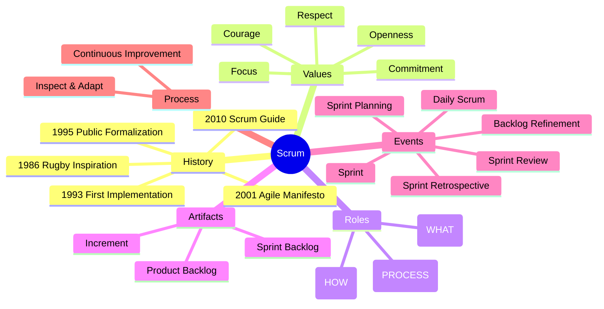

### One-Page Recap

- **Scrum** = lightweight Agile framework for complex products.
- **History:** 1986 (Takeuchi & Nonaka) → 1993 (Sutherland) → 1995 (Schwaber) → 2001 (Agile Manifesto) → 2010 (Scrum Guide).
- **5 Values:** Commitment, Focus, Openness, Respect, Courage.
- **3 Roles:** Product Owner (WHAT), Scrum Master (PROCESS), Developers (HOW).
- **3 Artifacts:** Product Backlog, Sprint Backlog, Increment.
- **Events:** Sprint, Sprint Planning, Daily Scrum, Sprint Review, Sprint Retrospective, Backlog Refinement.
- **Product Goal** = long-term objective; **Sprint Goal** = short-term target.
- **Definition of Done** = shared understanding of complete work.
- **Daily Scrum** = 15-min daily checkpoint (3 questions).
- **Sprint Review** = inspect product + get feedback (stakeholders).
- **Sprint Retrospective** = inspect process + improve (Scrum Team only).
- **Continuous Improvement** = heart of Scrum.

> **Final Exam Tip:** Always connect Scrum back to its **core idea: deliver usable increments in short cycles, inspect results, and adapt**. Scrum is about **empiricism, self-organization, and continuous improvement**.

---

## 13. References & Further Reading

- **The Scrum Guide** — Ken Schwaber & Jeff Sutherland
- **Scrum: The Art of Doing Twice the Work in Half the Time** — Jeff Sutherland
- **Agile Estimating and Planning** — Mike Cohn
- **User Stories Applied** — Mike Cohn
- **The Agile Manifesto** — agilemanifesto.org
- **Official Docs:** Scrum.org, Scrum Alliance, Agile Alliance

---

*End of Notes — Scrum*