# Kanban — Master's-Level Notes

> **Course Context:** Software Engineering (Agile Practices)
> **Topic:** Kanban — Visual Workflow Management, Core Practices, WIP Limits, Flow, and Scrum vs Kanban
> **Prerequisites:** Basic understanding of Agile methodology, Scrum (sprints, backlog), and software development lifecycle. Familiarity with Lean principles (waste, flow, pull) is helpful.

---

## 1. Introduction to Kanban

### 1.1 Definition

> **Kanban** is a **visual workflow management method** that helps teams **optimize delivery** by:
> - **Visualizing tasks**
> - **Limiting work in progress (WIP)**
> - **Focusing on flow efficiency**

**Key Characteristics:**
- **Very simple to use**
- Can **maintain compatibility with the existing organizational setting**
- Designed for teams where **work arrives continuously** and **priorities change frequently**

### 1.2 Kanban as an Agile Management Method

> Kanban is an **Agile management method** built on a philosophy of **continuous improvement**, where work items are **"pulled"** from a product backlog into a **steady flow of work**.

**How It's Applied:**
- Using **Kanban boards** — a form of **visual project management**
- **Tasks** (represented as **cards**) move through **stages of work** (represented as **columns**)
- The team can see **where work is in real-time**

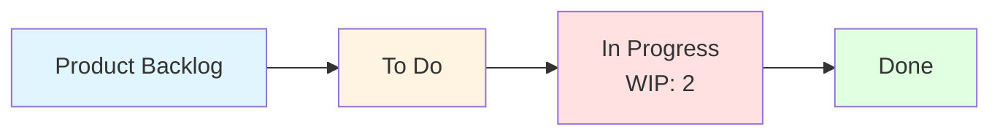

---

## 2. Core Practices of Kanban

Kanban is built on **six core practices**:

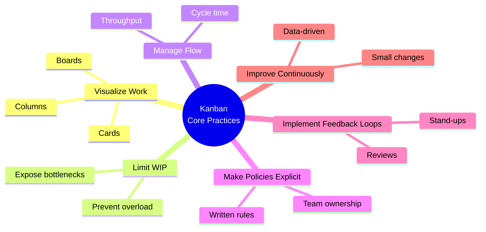

| **#** | **Core Practice** | **Description** |
|---|---|---|
| **1** | **Visualize Work** | Use boards and cards to see all work in real-time |
| **2** | **Limit WIP** | Prevent overload and bottlenecks by capping work-in-progress |
| **3** | **Manage Flow** | Track cycle time and throughput to ensure smooth flow |
| **4** | **Make Policies Explicit** | Document clear rules for how work moves |
| **5** | **Implement Feedback Loops** | Regular reviews, stand-ups (if desired) |
| **6** | **Improve Continuously** | Small, evolutionary changes (Kaizen) |

> **Exam Tip:** Memorize the **six core practices**. A common exam question is *"List and explain the core practices of Kanban."*

---

## 3. Kanban Board: Visual Workflow

### 3.1 What is a Kanban Board?

> The **Kanban board** is a **physical or virtual board** that maps out your project's workflow and how tasks move through it from **beginning to completion**.

**Key Functions:**
- Tracks each **work item** as it progresses through various **Kanban stages**
- Ensures the workflow is **standardized**
- Team members can easily see **where each task is** in the overall scheme

### 3.2 Basic Kanban Board

The most basic Kanban board has **three workflows**:

| **Column** | **Description** |
|---|---|
| **To Do** | Work that is ready to be started |
| **Work In Progress (WIP)** | Work currently being done |
| **Complete** | Work that is finished |

### 3.3 Board Notes

- **Columns can be added or changed** to suit the project
- **Columns represent states** of a work item
- **Columns emphasize where the task is**
- **Columns help track flow & bottlenecks**

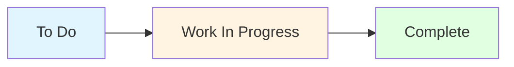

---

## 4. Kanban Cards

### 4.1 What is a Card?

> A **Kanban card** represents a **single piece of work** flowing through the system.

### 4.2 Key Characteristics

| **Characteristic** | **Description** |
|---|---|
| **High Visibility** | Anyone looking at the board can see exactly what work exists without opening a spreadsheet |
| **Information Hub** | A card holds all critical context on its face or back |

### 4.3 Card Contents

| **Element** | **Description** | **Example** |
|---|---|---|
| **Title** | Clear, plain description of the work | "Google login option" |
| **Assignee** | The specific team member currently working on it | "John" |
| **Metadata** | Due dates, priority levels, or linked bugs | "High priority, due Friday" |

> **The Card is the WHAT** (the value being delivered).

---

## 5. Kanban Columns

### 5.1 What is a Column?

> **Columns** represent the **distinct workflow steps** a card must pass through from start to finish.

### 5.2 Key Characteristics

| **Characteristic** | **Description** |
|---|---|
| **Process Mapping** | They map out your team's specific operational value stream |
| **Left to Right Flow** | Work always enters on the far left (Backlog) and exits on the far right (Done) |
| **State of Play** | They instantly reveal the current status of the entire project at a single glance |

> **The Column is the WHERE** (the phase of delivery).

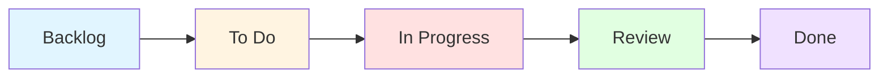

---

## 6. WIP Limits

### 6.1 What is WIP?

> **WIP** stands for **Work-in-Progress**. It refers to any task that the team has **started but has not yet completely finished**.

### 6.2 The Kanban Rule

> A **WIP limit** is a **strict cap** on the maximum number of task cards allowed in a column at one time.

**Example:** If a column has a WIP limit of **2**, you **cannot** drag a third card into it **under any circumstance**.

### 6.3 Benefits of WIP Limits

| **Benefit** | **Description** |
|---|---|
| **Eliminates Multitasking** | Forcing people to focus on one thing means tasks get finished much faster |
| **Exposes Bottlenecks** | It instantly highlights where work is getting stuck in your system |
| **Forces Collaboration** | If a teammate's column is full, you cannot pass them more work — you must stop and help them clear it |

> **The WIP Limit is the HOW MANY** (the maximum capacity allowed in a phase to prevent traffic jams).

### 6.4 Visual Representation

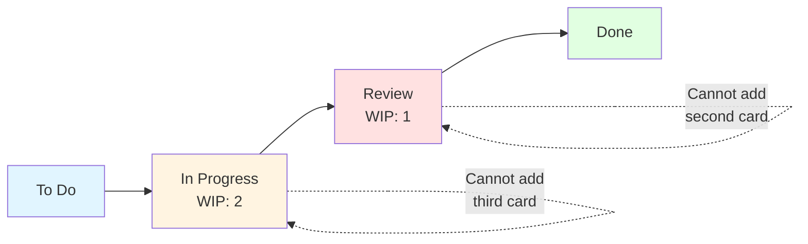

---

## 7. Explicit Policies

### 7.1 Definition

> An **explicit policy** is a **clear, written agreement** that defines **how work is managed and moved** on a Kanban board.

### 7.2 Key Characteristics

| **Characteristic** | **Description** |
|---|---|
| **No Guesswork** | Removes hidden assumptions about when a task is truly ready |
| **Team Ownership** | The rules are written, changed, and owned by the whole team, not just managers |
| **Public Visibility** | They are usually written directly at the bottom of each column on the board |

> **Explicit Policies are the HOW** (the agreed-upon rules for when work can move to the next phase).

### 7.3 Example Policies

| **Transition** | **Policy** |
|---|---|
| **Backlog to Ready** | Items must be ranked in absolute priority order by the Product Owner or Request Manager |
| **Ready to In Progress** | A team member pulls the highest card from the top of the "Ready" list only when active "In Progress" capacity opens up |
| **In Progress to Done** | The item must meet the comprehensive Definition of Done (e.g., automated test coverage, security compliance, peer review, and deployment verification) |

---

## 8. Manage Flow

### 8.1 Definition

> **Managing flow** means **actively steering the work** across the board to ensure it **never gets stuck**.

### 8.2 Example Scenario

**The Blockage:**
- A developer finishes "Set up email verification" and wants to move it to Testing.
- But the **Testing column is full (WIP Limit: 1)** because the tester is still busy with "Testing the checkout button."

**The Flow Decision:**
- The developer **cannot start "Google login option"** because that would break the In Progress WIP limit.

**The Action:**
- To keep the workflow moving (managing flow), the developer **pauses coding** and **unblocks the pipeline** by **pairing with the tester** to help finish "Testing the checkout button."

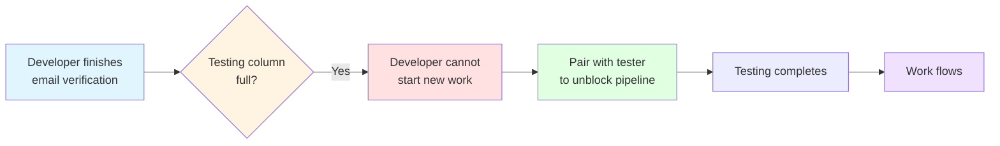

---

## 9. Feedback Loops

### 9.1 Definition

> **Feedback loops** are the **scheduled huddles** where the team looks at the board to **coordinate their next moves**.

### 9.2 Types of Feedback Loops

| **Meeting** | **Frequency** | **Purpose** |
|---|---|---|
| **Kanban Meeting (Daily Feedback Loop)** | Daily, 10 minutes | Team stands in front of the board and asks: "What is blocking the checkout button from hitting Done today, and how can we get it across the line?" |
| **Replenishment Meeting** | Weekly/Bi-Weekly | Product Owner meets with the team to look at the Product Backlog and decide what to pull next |

### 9.3 Kanban Meeting — Example

- **The Conversation:** They don't say "Here is what I did yesterday." Instead, they look **from right to left** and ask: *"What is blocking the checkout button from hitting Done today, and how can we get it across the line?"*
- **The Result:** Immediate tactical adjustments to keep cards moving.

### 9.4 Replenishment Meeting — Example

- **The Conversation:** *"Now that the login infrastructure tables are Done, what are the next two highest-priority profile features we should pull into the 'To Do' column next week?"*
- **The Result:** They select "User profile dashboard" and "Edit account details page," ensuring the team never runs out of prioritized work.

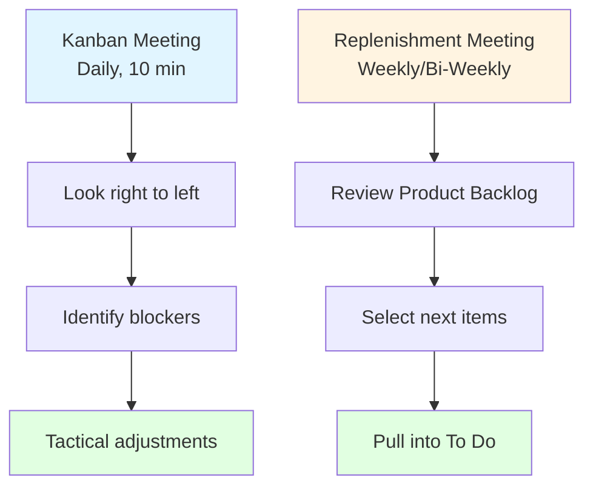

---

## 10. Continuous Improvement (Kaizen)

### 10.1 Definition

> In Kanban, continuous improvement is often called **Kaizen** (a Japanese philosophy meaning **"change for the better"**).

### 10.2 Key Characteristics

| **Characteristic** | **Description** |
|---|---|
| **Small, Steady Changes** | Instead of making massive, disruptive changes all at once, the team makes small, incremental adjustments every week |
| **Data-Driven** | The team does not guess how to improve; they use the board's metrics (like **Lead Time** and **Bottlenecks**) to make scientific decisions |

> **Key Insight:** Kanban uses **Cards and Columns** to visualize work, enforces **WIP Limits and Explicit Policies** to manage capacity, optimizes **Flow** through regular **Feedback Loops**, and uses **data** to **Improve Continuously**.

---

## 11. Swimlanes

### 11.1 Definition

> **Swimlanes** split the board **horizontally** (left to right). They are **rows** used to **categorize or separate different types of work** running through those same stages.

### 11.2 Example: Handling a Crisis

While working on the Login and Profile project, suddenly a **major crisis** happens.

You use **swimlanes** to organize the chaos on the **exact same board**:

| **Swimlane** | **Purpose** | **Example** |
|---|---|---|
| **Top Row (Expedite Swimlane)** | Reserved strictly for **critical emergencies**. Bypasses regular rules, and everyone stops to fix it. | If the live login page crashes, that card goes here |
| **Middle Row (Standard Work Swimlane)** | Where **regular project features** flow sequentially | Google login option, User profile dashboard |
| **Bottom Row (Bugs/Maintenance Swimlane)** | A separate row just to track **minor cosmetic fixes** | Fix alignment of login button |

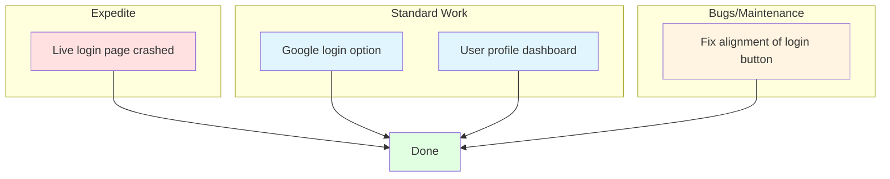

---

## 12. History of Kanban

### 12.1 Origins

> Kanban originated in the **late 1940s in Japan**.

**Timeline:**

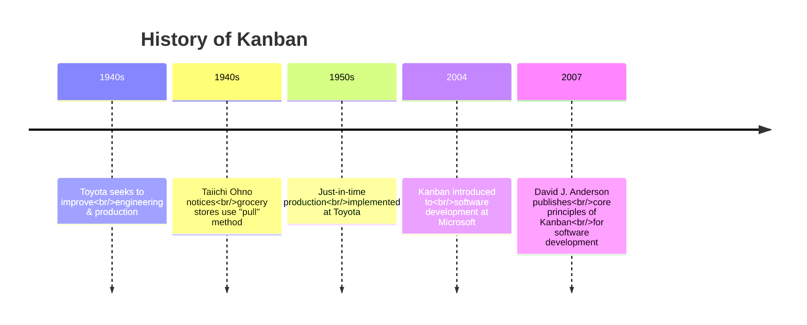

### 12.2 Key Milestones

| **Year** | **Event** |
|---|---|
| **Late 1940s** | Kanban originated in Japan for manufacturing |
| **1940s** | Toyota engineer **Taiichi Ohno** noticed grocery stores used a **"pull" method** — stocking items based on expected customer demand |
| **1950s** | Ohno was inspired by this technique, which was later developed into **"just-in-time" production** and implemented at Toyota |
| **2004** | Kanban was first introduced to **software development at Microsoft** |
| **2007** | **David J. Anderson** published the core principles of Kanban for software development, aligning them with the **Agile Manifesto** principles |

> **Key Insight:** Kanban's **pull system** comes from **grocery stores** — stock only what's needed, when it's needed.

---

## 13. Scrumban — Kanban as an Evolution

### 13.1 Scrum → Kanban Evolution

> Teams **very frequently move from Scrum to Kanban** when their project matures.

**Why?**
- **The Agile Mindset is Already There:** Scrum teams are already self-organized, work in small increments, and use a prioritized backlog.
- **The Evolution:** A mature Scrum team often finds that **2-week sprint boundaries hold them back**. If they finish early, they want to **continuously pull new work**. Moving to Kanban is a natural next step to achieve **continuous delivery**.

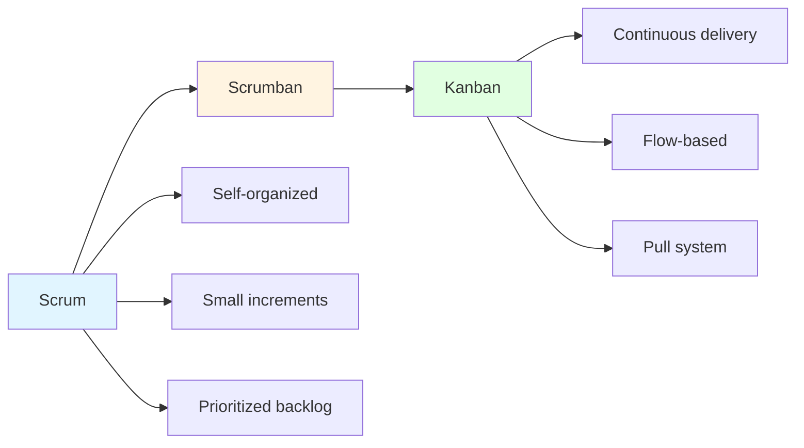

### 13.2 Kanban as an Introduction (Traditional → Kanban)

> **Scrum is a revolutionary change framework.** It demands you change your roles, your meetings, and your timeline immediately on day one.

> **Kanban is an evolutionary change framework.** It respects your current traditional structure and allows you to improve gradually without triggering organizational resistance.

| **Aspect** | **Scrum** | **Kanban** |
|---|---|---|
| **Change Type** | Revolutionary | Evolutionary |
| **Adoption** | Immediate, day one | Gradual, respects current structure |
| **Resistance** | Can trigger organizational resistance | Non-disruptive, Trojan horse for agility |

---

## 14. Kanban Evolution Example (Months 1–3)

### 14.1 Month 1: The "As-Is" Traditional Workflow

| **Backlog** | **Requirements Phase** | **Design Phase** | **Development Phase** | **Testing Phase** | **UAT / Deployment** |
|---|---|---|---|---|---|
| User profile dashboard | Dark mode theme | Google login option | Coding the password reset function | Testing the checkout button | Privacy policy page updated |
| Edit account details page | Export data to Excel | Set up email verification | Testing login screen alignment | Activity log history | Testing database tables |
| Delete account option | | | | | |

**Explicit Policies:**
- **Requirements to Design:** The Business Analyst must upload a signed-off Functional Specification Document.
- **Design to Development:** The UI Designer must attach a finalized high-fidelity mockup image file.
- **Development to Testing:** The Developer must declare their code finished and deploy it to the QA environment.
- **Testing to UAT:** The Tester must verify all test cases pass without any critical defects.

### 14.2 Month 2: Introducing Agile WIP Limits

| **Backlog** | **Backlog Queue (Ready)** | **Development (WIP Limit: 2)** | **Testing (WIP Limit: 1)** | **UAT / Deployment** |
|---|---|---|---|---|
| Dark mode theme | User profile dashboard | Coding the password reset function | Testing the checkout button | Created database tables |
| Export data to Excel | Edit account details page | Set up email verification | | Designed login interface |
| Activity log history | Delete account option | | | |

**Explicit Policies:**
- **WIP Enforcement:** No team member can pull a card into a column if that column is already at its maximum WIP limit.
- **Development to Testing:** Code must pass automated unit tests and receive a peer review before it can be queued for testing.
- **Silo-Breaking Rule:** If the Testing column hits its limit of 1, developers must stop coding new items and assist the tester with testing or fixing active bugs.

### 14.3 Month 3: The Evolved Agile Kanban Board

| **Product Backlog** | **To Do** | **In Progress (WIP Limit: 2)** | **Done** |
|---|---|---|---|
| Activity log history | User profile dashboard | Coding the password reset function | Created database tables |
| Delete account option | Edit account details page | Testing the checkout button | Designed login interface |
| Dark mode theme | Set up email verification | | |
| Export data to Excel | Google login option | | |

**Explicit Policies:**
- **Backlog to Ready:** Items must be ranked in absolute priority order by the Product Owner or Request Manager.
- **Ready to In Progress:** A team member pulls the highest card from the top of the "Ready" list only when active "In Progress" capacity opens up.
- **In Progress to Done:** The item must meet the comprehensive Definition of Done (e.g., automated test coverage, security compliance, peer review, and deployment verification).

> **Evolution Summary:** Month 1 (Traditional) → Month 2 (WIP Limits Introduced) → Month 3 (Evolved Agile Kanban Board)

---

## 15. Scrum Board vs Kanban Board

### 15.1 Scrum Board Example

| **Sprint 1** | | |
|---|---|---|
| **To Do** | **In Progress** | **Done** |
| Set up the email verification service | Coding the password reset function | Create database tables for new users |
| Google login option | Testing the checkout button | Design the login screen interface |

**Product Backlog:**
- Dark mode theme
- Export data to Excel
- User profile dashboard
- Edit account details page
- Activity log history
- Delete account option

### 15.2 Kanban Board Example

| **Product Backlog** | **To Do** | **In Progress (WIP = 2)** | **Done** |
|---|---|---|---|
| Dark mode theme | Set up the email verification service | Coding the password reset function | Create database tables for new users |
| Export data to Excel | Google login option | Testing the checkout button | Design the login screen interface |
| User profile dashboard | | | |
| Edit account details page | | | |
| Activity log history | | | |
| Delete account option | | | |

### 15.3 Key Differences

| **Aspect** | **Scrum Board** | **Kanban Board** |
|---|---|---|
| **Timebox** | Sprints (2–4 weeks) | Continuous flow |
| **WIP Limits** | Implicit (via sprint planning) | Explicit (strict caps) |
| **Backlog** | Sprint Backlog + Product Backlog | Product Backlog + To Do |
| **Changes** | Discouraged mid-sprint | Allowed anytime |
| **Roles** | PO, SM, Dev Team | Not strictly defined |
| **Metrics** | Velocity, Burndown | Cycle Time, Lead Time, Throughput |

---

## 16. When to Choose Scrum vs Kanban

### 16.1 Choose Scrum When: You Need Structure & Stability

> Scrum works best in **complex, product-focused environments** where the team needs **protection from constant outside interruptions**.

| **Scenario** | **Why Scrum** |
|---|---|
| **Planned Product Releases** | You are building a new product from scratch and can map out milestones weeks in advance |
| **Priorities Stay Fixed for 2 Weeks** | The business can promise not to change its mind mid-sprint |
| **Cross-functional Learning Needed** | The team is new to Agile and needs rigid guardrails, structured meetings, and clear roles (Scrum Master/Product Owner) to learn how to self-organize |

### 16.2 Choose Kanban When: You Need Speed & Extreme Flexibility

> Kanban works best in **fast-paced, high-change environments** where **priorities shift day-to-day**.

| **Scenario** | **Why Kanban** |
|---|---|
| **Continuous, Flow-Based Delivery** | Work comes in randomly and must be handled immediately (e.g., IT support helpdesk, operational maintenance, marketing creative team) |
| **Priorities Change Volatility** | If a critical bug drops or an executive changes focus at 10:00 AM, the team needs to pivot instantly without waiting for a 2-week sprint to end |
| **Mature Agile Teams** | The team is already disciplined, works well together without a manager, and wants to remove the overhead of constant estimation and heavy meetings |
| **The Organization is Too Rigid for Scrum** | Traditional companies with deeply entrenched hierarchies often suffer from "Agile resistance." Kanban acts as a **Trojan horse for agility** because it is non-disruptive |

### 16.3 Comparison Diagram

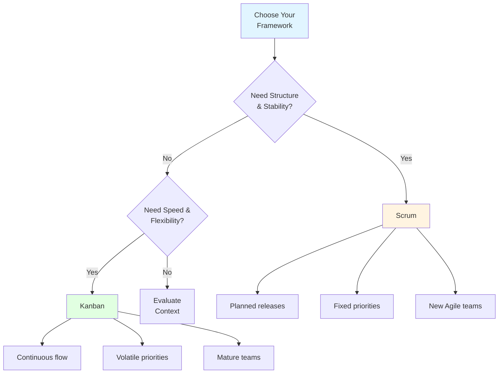

---

## 17. Real-World Use Cases for Kanban

| **Scenario** | **Why Kanban Works** |
|---|---|
| **Maintenance or Support Teams** | Continuous flow of incoming issues or bugs — Kanban helps prioritize and resolve efficiently |
| **DevOps and Release Teams** | Track pipelines, deployments, and automation work |
| **Agile Teams with Unpredictable Work** | When it's hard to plan fixed sprints (unlike Scrum), Kanban provides flexibility |
| **Startups Pivoting Frequently** | Ad-hoc work, changing priorities, need for speed |

---

## 18. Sample Kanban Boards

### 18.1 IT Support / Helpdesk Kanban Board

| **Incoming Queue** | **Triage & Rank** | **Active Troubleshooting (WIP Limit: 3)** | **Awaiting Vendor/User** | **Closed / Resolved** |
|---|---|---|---|---|
| Laptop battery dead | Reset corporate password | [CRITICAL] WiFi down in Conference Room B | SAP Login access issue (Waiting on user response) | Formatted external hard drive |
| VPN connection failing | Request for new monitor | | | Installed anti-virus on payroll laptop |
| Printer jam on Floor 3 | | | | |

**Explicit Policies:**
- **Incoming Queue to Triage:** Every ticket must be categorized by severity (Critical, High, Medium, Low) within 15 minutes of landing on the board.
- **Active Troubleshooting to Awaiting:** A card moves here only if the team cannot proceed without external input (e.g., waiting for the user to pick up the phone or a software vendor to release a patch).
- **Closed / Resolved:** The user must explicitly sign off or confirm via email that their problem is fixed before the card can hit the final column.

### 18.2 DevOps / Infrastructure Kanban Board

| **Request Backlog** | **Ready for Scripting** | **Automated Build & Test (WIP Limit: 2)** | **Security & Peer Review (WIP Limit: 1)** | **Live / Deployed** |
|---|---|---|---|---|
| Scale up database for Black Friday traffic | Set up SSL certificate for staging site | Automate backup routine for user database | Review firewall access rules for payment API | Deployed production server for Sprint 1 launch |
| Audit AWS access logs | Configure Docker container for login app | Upgrade Kubernetes cluster nodes | | |

**Explicit Policies:**
- **Request Backlog to Ready:** Requirements must outline the specific cloud infrastructure components needed (e.g., memory, region, security compliance rules).
- **Build & Test to Security Review:** The automation code must compile without errors, pass all automated smoke tests, and be pushed to the staging environment.
- **WIP Limit Enforcement:** Security review has a strict WIP limit of 1. If a firewall configuration is being reviewed, engineers cannot pass another card forward. They must jump in to finish the review so the pipeline doesn't freeze.

---

## 19. Advantages and Disadvantages of Kanban

### 19.1 Advantages

| **Advantage** | **Description** |
|---|---|
| **Flexibility** | Changes can be made anytime |
| **Visual** | Everyone sees the work in real-time |
| **WIP Limits** | Prevent overload and expose bottlenecks |
| **Continuous Delivery** | No sprint boundaries — work flows continuously |
| **Easy to Adopt** | Non-disruptive, evolutionary change |
| **Data-Driven** | Metrics like cycle time and lead time guide improvement |
| **Forces Collaboration** | WIP limits encourage team members to help each other |
| **Reduces Multitasking** | Focus on finishing work before starting new work |

### 19.2 Disadvantages / Challenges

| **Challenge** | **Description** |
|---|---|
| **No Fixed Cadence** | Can lack the rhythm of Scrum |
| **Less Structure** | Not ideal for teams new to Agile |
| **WIP Limits Require Discipline** | Teams may resist strict caps |
| **Metrics Require Maturity** | Cycle time and lead time need to be tracked consistently |
| **Not for Feature-Rich Products** | Scrum is better for planned, feature-rich development |
| **Can Become Chaotic** | Without explicit policies, the board can become messy |

---

## 20. Real-World Examples and Analogies

### 20.1 Analogy: Supermarket Checkout

- **Kanban** = A **supermarket checkout** — customers (work items) flow through lanes (columns)
- **WIP Limit** = Only 2 customers allowed at the counter at once
- **Pull System** = The next customer is served only when the previous one leaves
- **Explicit Policies** = "Only 10 items or fewer" rule
- **Feedback Loop** = The cashier calls for backup when the queue gets too long

### 20.2 Real-World Use Cases

| **Company** | **Kanban Practice** | **Result** |
|---|---|---|
| **Microsoft** | First software Kanban (2004) | Improved flow, reduced cycle time |
| **Toyota** | Original Kanban (1940s) | Just-in-time production |
| **Spotify** | Kanban boards for teams | Autonomous, flow-based work |
| **Netflix** | Kanban + DevOps | Continuous delivery |
| **IT Support Teams** | Helpdesk Kanban | Faster ticket resolution |

---

## 21. Exam Tips

> **📝 Exam Tips — Commonly Asked Questions:**

1. **Define Kanban.** What are its core practices?
2. **Explain the Kanban board.** What are cards and columns?
3. **What is a WIP limit?** What are its benefits?
4. **What are explicit policies?** Give examples.
5. **What is "managing flow"?** Give an example.
6. **What are feedback loops in Kanban?** Describe the daily and replenishment meetings.
7. **What is Kaizen?** How does it relate to Kanban?
8. **What are swimlanes?** Give examples (Expedite, Standard, Bugs).
9. **Explain the history of Kanban** from Toyota to software.
10. **What is Scrumban?** When do teams move from Scrum to Kanban?
11. **Compare Scrum and Kanban** across key criteria.
12. **When should you choose Scrum vs Kanban?**
13. **What are real-world use cases for Kanban?**
14. **Draw and explain an IT Support Kanban board.**
15. **Draw and explain a DevOps Kanban board.**

> **⚠️ Tricky Concepts:**
> - **Kanban is not a methodology** — it's a **visual workflow management method**.
> - **WIP limits are strict caps** — you cannot exceed them.
> - **Cards = WHAT; Columns = WHERE; WIP Limits = HOW MANY; Policies = HOW.**
> - **Swimlanes** split the board **horizontally** (rows).
> - **Scrum is revolutionary; Kanban is evolutionary.**
> - **Kanban is a Trojan horse for agility** — non-disruptive.
> - **Kaizen = continuous improvement** — small, data-driven changes.

---

## 22. Common Interview Questions

1. **What is Kanban?**
   - *Answer:* A visual workflow management method that optimizes delivery by visualizing tasks, limiting WIP, and focusing on flow efficiency.

2. **What are the core practices of Kanban?**
   - *Answer:* Visualize work, limit WIP, manage flow, make policies explicit, implement feedback loops, improve continuously.

3. **What is a WIP limit? Why is it important?**
   - *Answer:* A strict cap on the number of cards in a column. It prevents overload, exposes bottlenecks, and forces collaboration.

4. **What is the difference between Scrum and Kanban?**
   - *Answer:* Scrum is timeboxed, role-based, and iterative; Kanban is flow-based, flexible, and visual with WIP limits.

5. **What are swimlanes?**
   - *Answer:* Horizontal rows on a Kanban board used to categorize different types of work (e.g., Expedite, Standard, Bugs).

6. **What is Scrumban?**
   - *Answer:* A hybrid of Scrum and Kanban — uses Scrum's structure with Kanban's flow and WIP limits.

7. **When should you choose Kanban over Scrum?**
   - *Answer:* When work is continuous and unpredictable, priorities change frequently, or the team is mature and wants to remove sprint overhead.

8. **What is Kaizen?**
   - *Answer:* Continuous improvement — small, incremental, data-driven changes.

9. **What is the history of Kanban?**
   - *Answer:* Originated in Toyota (1940s), introduced to software at Microsoft (2004), core principles published by David J. Anderson (2007).

10. **How does Kanban handle a crisis?**
    - *Answer:* Using an **Expedite swimlane** — critical emergencies bypass regular rules and everyone stops to fix them.

---

## 23. Summary

### Key Takeaways

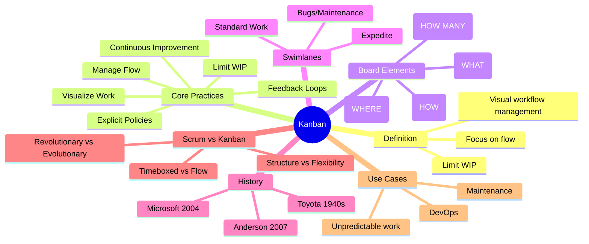

### One-Page Recap

- **Kanban** = visual workflow management method — visualize tasks, limit WIP, focus on flow.
- **Core Practices:** Visualize Work, Limit WIP, Manage Flow, Explicit Policies, Feedback Loops, Continuous Improvement.
- **Board Elements:** Cards (WHAT), Columns (WHERE), WIP Limits (HOW MANY), Policies (HOW).
- **WIP Limits:** Strict caps — prevent overload, expose bottlenecks, force collaboration.
- **Explicit Policies:** Written rules for when work moves.
- **Manage Flow:** Actively steer work to prevent blockages.
- **Feedback Loops:** Daily Kanban meeting + Replenishment meeting.
- **Kaizen:** Continuous improvement — small, data-driven changes.
- **Swimlanes:** Horizontal rows — Expedite, Standard Work, Bugs/Maintenance.
- **History:** Toyota (1940s) → Microsoft (2004) → Anderson (2007).
- **Scrum vs Kanban:** Scrum = revolutionary, timeboxed; Kanban = evolutionary, flow-based.
- **When to Choose Kanban:** Continuous flow, volatile priorities, mature teams, rigid organizations.
- **Real-World Use Cases:** Maintenance, support, DevOps, unpredictable work.

> **Final Exam Tip:** Always connect Kanban back to its **core philosophy: continuous improvement through visualization, WIP limits, and flow**. Kanban is **evolutionary** — it respects your current process and improves it gradually.

---

## 24. References & Further Reading

- **Kanban: Successful Evolutionary Change for Your Technology Business** — David J. Anderson
- **Kanban from the Inside** — Mike Burrows
- **Toyota Production System** — Taiichi Ohno
- **The Toyota Way** — Dr. Jeffrey K. Liker
- **Scrumban** — Corey Ladas
- **Official Docs:** Kanban University, Lean Kanban, Agile Alliance

---

*End of Notes — Kanban*