# Extreme Programming (XP) — Master's-Level Notes

> **Course Context:** Software Engineering (Agile Practices)
> **Topic:** Extreme Programming (XP) — Technical Practices, Team Practices, Life Cycle, Roles, and Principles
> **Prerequisites:** Basic understanding of Agile methodology, Scrum, user stories, TDD, CI/CD, and software testing fundamentals.

---

## 1. Introduction to Extreme Programming (XP)

### 1.1 The Problem XP Solves

Programmers often complain that:
- **Users don't know what they want** and frequently change their minds.
- This is a common theme in programmer culture and forums.

**Scrum addresses this** by:
- Involving users early
- Delivering working software frequently to adapt to changing needs
- Allowing flexible project goals to deliver maximum value

**However**, constant code changes can lead to:
- **Bugs**
- **Fragile and unstable codebase**

> **This is one of the problems that XP sets out to solve.**

### 1.2 Definition

> **Extreme Programming (XP)** is an Agile methodology that aims to **do the right things in software development to their extreme end**.

**Examples of "Extreme" Thinking:**

| **If This Is Good...** | **Then Let's Do It Extremely...** | **Leads To** |
|---|---|---|
| Code review is good | Review code all the time, continuously | **Pair Programming** |
| Testing code before deployment is good | Test it before we even write it | **Test-Driven Development (TDD)** |
| Releasing software in short/quick time frames is good | Release it multiple times a day | **Continuous Integration (CI)** |

### 1.3 XP's Relationship with Scrum

> **Scrum says:** "Deliver a usable increment each sprint."
>
> **XP shows:** How to ensure that increment is **high-quality and reliable**.

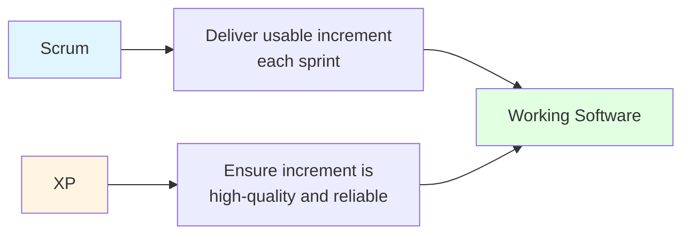

---

## 2. XP Technical Practices

> **Extreme Programming (XP) introduces strict, daily technical habits** designed to **eliminate technical debt** and **ensure code quality**.

> **XP focuses on technical discipline** to ensure that the code built is **clean, safe, fast, and built to last**.

### 2.1 Overview of Technical Practices

| **Technical Practice** | **Description** |
|---|---|
| **Test-Driven Development (TDD)** | Write tests before code to guide development. |
| **Pair Programming** | Two developers work together on the same code. |
| **Continuous Integration (CI)** | Code is integrated and tested frequently. |
| **Refactoring** | Improve internal structure without changing behavior. |
| **Simple Design** | Build only what is necessary now. |
| **Collective Code Ownership** | Anyone can modify any part of the code. |

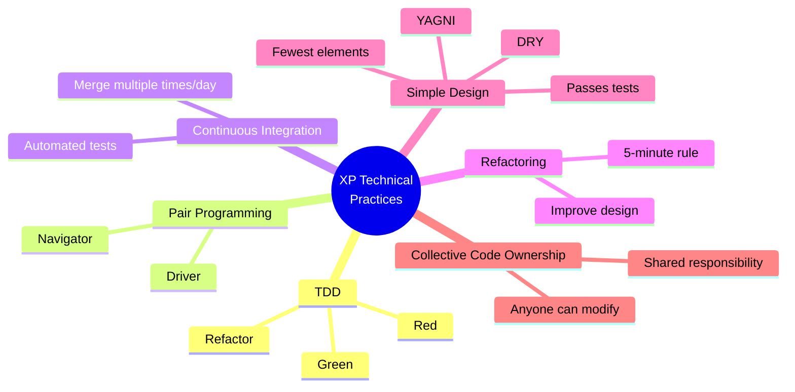

---

### 2.2 Pair Programming

> **Pair programming** involves **two programmers working together on the same code**.

**Roles:**

| **Role** | **Responsibility** |
|---|---|
| **Driver** | Codes — the person typing |
| **Navigator** | Reviews the code in real-time, checking for security and architectural errors |

**Key Characteristics:**
- Promotes **real-time code review** and **knowledge sharing**
- Leads to **fewer defects** and **improved code quality**
- **They switch roles frequently**

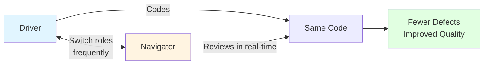

---

### 2.3 Test-Driven Development (TDD)

> **TDD** is a practice where developers:
> 1. Write a **failing automated test first**
> 2. Then write **just enough code** to make that test pass
> 3. Finally **clean up the code**

**TDD Follows Three Stages: Red → Green → Refactor**

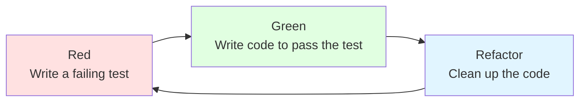

| **Stage** | **Description** |
|---|---|
| **Red** | Write a failing test (the test fails because the code doesn't exist yet) |
| **Green** | Write just enough code to make the test pass |
| **Refactor** | Clean up the code without changing its behavior |

> **Exam Tip:** TDD is **test-first**, not test-after. The test drives the design.

---

### 2.4 Continuous Integration (CI)

> **Continuous Integration** is the practice where developers **merge their code into the shared main codebase multiple times a day**.

**Key Points:**
- **Automated scripts test the code instantly** to ensure nothing broke.
- Prevents integration problems.
- Enables rapid feedback.

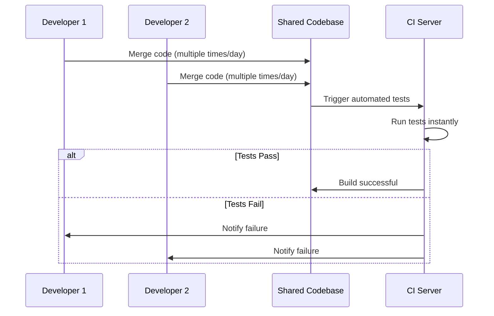

---

### 2.5 Refactoring

> **Refactoring** is the process of **improving the design of existing code without changing its functionality**.

**In XP:**
- Refactoring is done **continuously** to improve the system's structure.
- Developers follow **The "5-minute rule"**: If developers spend more than **five minutes** trying to understand a code, then they need to **refactor it**.
- Promotes **code simplicity** and **maintainability** by encouraging developers to **address complexity as it arises**.

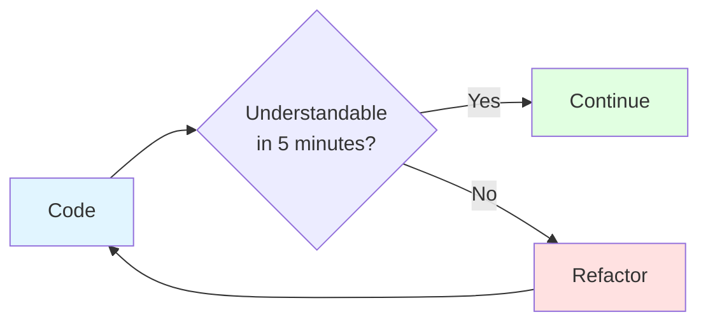

> **Key Insight:** Refactoring doesn't change **what** the code does — it changes **how** it does it.

---

### 2.6 Simple Design

> **Simple Design** is a core technical practice based on a very straightforward rule: **Only build what you need for today, and make that code as clean and simple as possible.**

#### The 4 Rules of Simple Design

| **Rule** | **Description** |
|---|---|
| **Passes all tests** | The code must work correctly and pass all automated tests. |
| **Reveals intent (Clear/Readable)** | The code must be easy to read and understand by any other developer. No overly clever, cryptic shortcuts. |
| **Contains no duplicate code (DRY)** | Never copy and paste code blocks. If the same logic is used in two places, extract it into a single shared function. |
| **Uses the fewest possible elements** | Minimize classes, methods, and lines of code. |

#### Two Acronyms of XP

| **Acronym** | **Full Form** | **Meaning** |
|---|---|---|
| **YAGNI** | "You Aren't Gonna Need It" | Stop coding for hypothetical future requirements. If the Product Owner hasn't explicitly prioritized it for today, You Aren't Gonna Need It. |
| **DRY** | "Don't Repeat Yourself" | Duplicate code is the number one cause of bugs. If you copy-paste logic, and that logic has a bug, you now have a bug in two places. Keep it centralized and unique. |

```mermaid
mindmap
  root((Simple<br/>Design))
    4 Rules
      Passes all tests
      Reveals intent
      No duplicate code (DRY)
      Fewest elements
    Acronyms
      YAGNI
      DRY
```

> **Exam Tip:** Memorize the **4 rules of Simple Design** and the **two acronyms (YAGNI, DRY)**. These are commonly asked in exams.

---

### 2.7 Collective Code Ownership

> **Collective Code Ownership** is an XP practice where the **entire team shares equal responsibility for the entire codebase**.

**Key Principle:**
- Under collective ownership, **any developer can change, fix, or improve any line of code** on the project **at any time**.

#### How It Works in Practice (Example)

**Scenario:** A developer is working on a "User profile dashboard" feature. While coding, they notice a sloppy bug or a security flaw in the database code that handles user registration.

| **Model** | **Behavior** | **Result** |
|---|---|---|
| **Traditional Model** | The developer leaves it alone or enters a ticket for "X" because it is "X's code." | The bug sits there for weeks. |
| **XP Collective Ownership Model** | The developer fixes the bug on the spot, runs the automated test suite to ensure nothing broke, and checks the fix into the shared repository. They don't need to ask for permission. | Bug fixed immediately. |

#### Benefits of Collective Code Ownership

| **Benefit** | **Description** |
|---|---|
| **Eliminates "Key-Person Dependency"** | The project never grinds to a halt if a specific developer goes on holiday, quits, or gets sick. |
| **Spreads Knowledge Naturally** | Because everyone works across all areas of the software, the entire team learns the whole system architecture, raising the skill level of the whole team. |
| **Continuous Refactoring** | If code belongs to everyone, anyone who sees messy, hard-to-read code feels empowered to clean it up (Simple Design), preventing the software from rotting. |

#### Why Collective Ownership Works (The Safety Net)

Collective ownership only works because it relies on the other XP practices:

| **Practice** | **How It Helps** |
|---|---|
| **Pair Programming** | Since two people are always sitting at the keyboard, one person can't quietly write bad code or ruin a feature. A second pair of eyes is always reviewing it. |
| **Test-Driven Development (TDD)** | If a developer changes a line of code in an unfamiliar part of the system, they immediately run the automated test suite. If they broke something, the tests turn **Red** instantly, alerting them to revert or fix the change before anyone notices. |

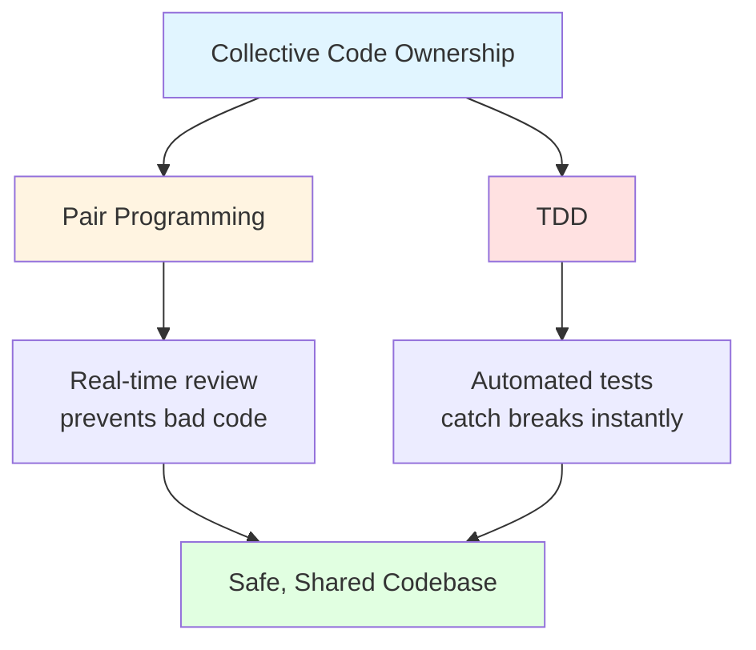

---

## 3. XP Team Practices

> In Extreme Programming (XP), **Team Practices** are the **social rules, habits, and communication circles** that keep a **self-organizing team healthy, aligned, and working at a sustainable pace**.

> Just like technical practices protect the **code** from rotting, team practices protect the **people** from burnout and miscommunication.

### 3.1 Overview of Team Practices

| **Team Practice** | **Description** |
|---|---|
| **Sustainable Pace (40-hour week)** | Avoid burnout by maintaining a consistent, healthy work pace. |
| **On-Site Customer** | Customer representative is always available to the team. |
| **Coding Standards** | Team follows a uniform coding style. |
| **Planning Game** | Developers and customers decide what to build next. |
| **Small Releases** | Release working software frequently. |

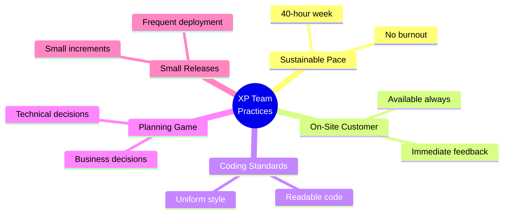

---

### 3.2 Sustainable Pace (No Burnout)

> **Sustainable Pace** is the XP practice of maintaining a **consistent workload** that the team can **sustain over the long term**, ensuring **high productivity, good software quality, and avoiding developer burnout**.

**It Means:**
- Developers should normally work around a **standard work week**.
- **Overtime should be rare, not routine.**
- If overtime is needed for **one week**, it should **not continue week after week**.
- The practice does **not** say "never work extra" — rather, **continuous overtime indicates a problem with planning or estimation**.

> **Key Insight:** Sustainable pace is about **long-term productivity**, not short-term heroics.

---

### 3.3 On-Site Customer

> **On-Site Customer** is the XP practice of having a **customer or customer representative available to the development team throughout the project** to **clarify requirements, set priorities, and provide immediate feedback**.

**Key Points:**
- The practice indicates that a **business expert should sit in the exact same room with the developers**.
- **Speeds up decision-making** — no long email chains, no written speculation.
- Results in the team building software **exactly what the business wants, with zero delay**.

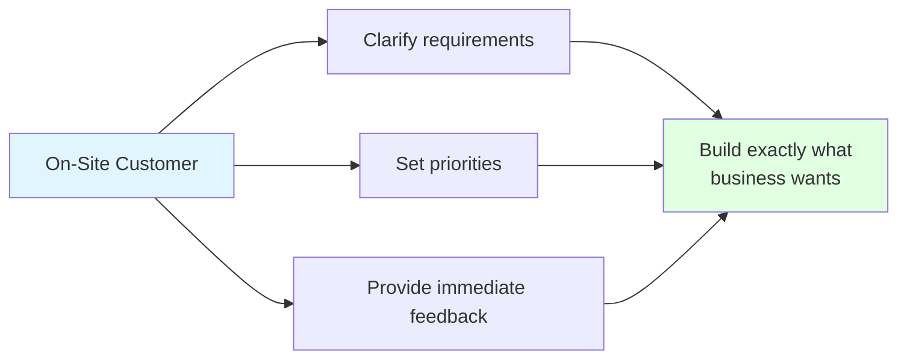

---

### 3.4 Coding Standards

> **Coding Standards** is the XP practice of following a **common set of rules and conventions** for writing code so that it is **consistent, readable, and maintainable** by the entire team.

**Without Coding Standards:**
- Developers use different naming conventions.
- Code formatting varies.
- Some write comments; others don't.
- Different coding practices make maintenance difficult.

**Coding Standards Support Several XP Practices:**

| **Practice** | **How Coding Standards Help** |
|---|---|
| **Pair Programming** | Two developers can easily understand each other's code. |
| **Collective Code Ownership** | Any developer can modify any part of the code because it follows a consistent style. |
| **Refactoring** | Improving code is easier when the structure is consistent. |
| **Continuous Integration** | Code from different developers integrates more smoothly. |

> **Key Insight:** Coding Standards ensure that the code looks like it was written by **one developer**, even though **many people contributed**.

---

### 3.5 Planning Game

> The **Planning Game** is a **joint planning session** where **Business (Customers)** and **Technology (Developers)** collaborate to plan the next release or iteration.

**Key Characteristics:**
- The **customer prioritizes features** based on business value.
- **Developers estimate effort** and commit to delivering only the amount of work they can **realistically complete** in an iteration.

**Decision Types:**

| **Business Decisions** | **Technical Decisions** |
|---|---|
| Scope | Estimates |
| Priority | Technology Choices |
| Release Dates | Team Capacity |
| Budget | |

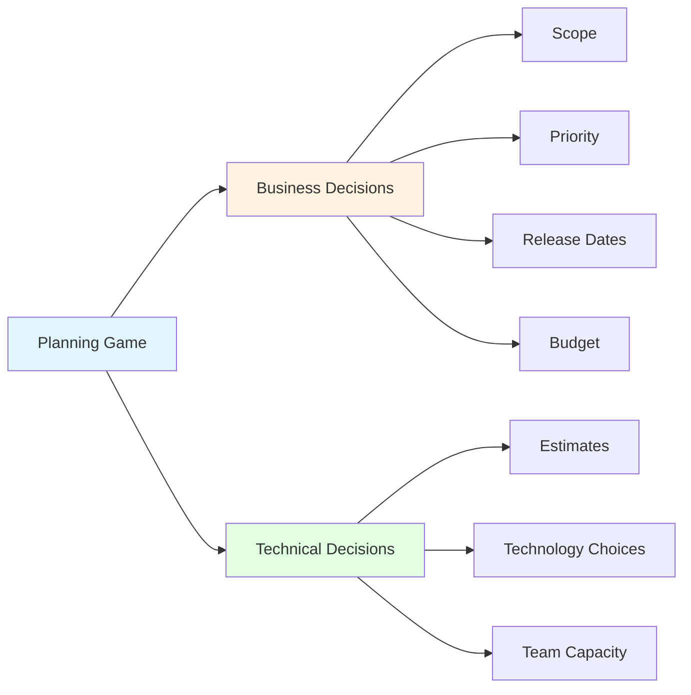

---

### 3.6 Small Releases

> **Small Releases** is the practice of **deploying working software into production as frequently as possible**, in the **smallest viable increments**.

**Benefits:**

| **Benefit** | **Description** |
|---|---|
| **Frequent Updates** | Deploy features individually as soon as they are tested and ready. |
| **Easy Fixes** | If a bug slips through, the team knows exactly which small update caused it, making rollback or patching instant. |
| **Value Today** | Users get access to helpful tools immediately, rather than waiting for a distant grand launch. |

> **Key Insight:** Small releases reduce risk and deliver value faster.

---

## 4. XP Life Cycle

### 4.1 Overview

> **XP Life Cycle** is the step-by-step process through which software moves from **initial idea to production**.

**Phases:**

| **Phase** | **Description** |
|---|---|
| **Exploration** | Customers write initial user stories. Developers run technical experiments ("Spikes") to test architectural limits. |
| **Planning** | The team plays the Planning Game to set the budget, timeline, and scope for the first release target. |
| **Iterations to Release** | Short, 1-to-2-week cycles where developers use TDD, Pair Programming, and Simple Design to turn cards into working code. |

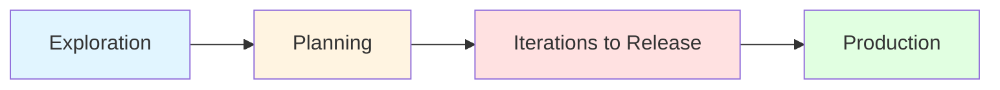

### 4.2 XP Lifecycle Diagram

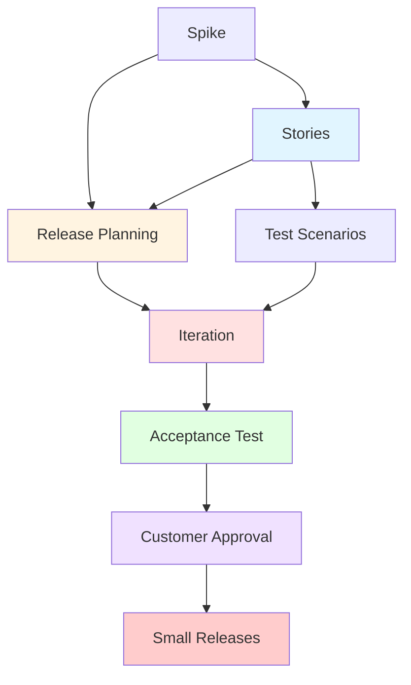

> **Note:** The PDF diagram shows **Stories**, **Requirements**, **Test Scenarios**, **Release Planning**, **Iteration**, **Acceptance Test**, **Customer Approval**, and **Small Releases** — with **Spike** feeding into estimates and release planning.

### 4.3 Step-by-Step XP Life Cycle

| **Step** | **Description** |
|---|---|
| **Step 1: Inception of User Stories** | The lifecycle begins when the business customer defines requirements as plain-English feature cards called **User Stories**. |
| **Step 2: Risk Reduction via Spikes** | If a story introduces unknown technical risks, developers break away to build a quick, throwaway code experiment called a **Spike**. |
| **Step 3: Creating Honest Estimates** | The technical insights gained from the spike allow developers to calculate **accurate time and cost estimates** for the user stories. |
| **Step 4: Formulating the Release Plan** | Business and technical teams collaborate during **Release Planning** to match feature costs against the budget and establish the release roadmap. |
| **Step 5: Defining the Test Scenarios** | Simultaneously, the customer outlines the **exact business rules and test scenarios** that the feature must satisfy to be considered complete. |
| **Step 6: Executing the Iteration Loop** | The release plan feeds stories into short, **1-to-2-week active coding cycles** where developers use **Test-Driven Development and Pair Programming** to build the software. |
| **Step 7: Validating via Acceptance Tests** | The functional code exiting the iteration loop is immediately run against the **customer's predefined test scenarios** to verify its behavior. |
| **Step 8: Securing Customer Approval** | The **on-site business customer** reviews the passing test results and provides **final, formal sign-off** on the completed feature. |
| **Step 9: Deploying the Small Release** | The approved, verified increment is immediately **deployed live into production**, successfully completing the lifecycle loop and delivering **instant value to users**. |

---

## 5. Spike — Features and Details

### 5.1 Definition

> A **Spike** is a **short, time-boxed exploration or research activity** used to:
> - Investigate a technical problem
> - Explore a design approach
> - Answer a tough question **before estimating or implementing a feature**

### 5.2 Characteristics

| **Aspect** | **Details** |
|---|---|
| **Time-boxed** | Usually a few hours or max **1–2 days** |
| **Outcome** | Gained knowledge, better estimate, clarified story |
| **Coding Involved** | Yes (throwaway), or could just be research |
| **Produces** | Notes, diagrams, quick prototypes, or clarified user stories |

> **Exam Tip:** A Spike is **not** production code — it's a **throwaway experiment** to reduce uncertainty.

---

## 6. Slack in XP

### 6.1 Definition

> **Slack** in XP is **planned flexibility** that helps teams stay agile, maintain quality, and deal with surprises without stress.

### 6.2 When Slack is Introduced

- **During iteration planning** — specifically when the team selects and estimates user stories for the upcoming iteration.
- In the iteration plan, a portion of that capacity (e.g., **10–20%**) is left for **slack stories**.

### 6.3 Slack Stories

**Slack stories are lower-priority, optional tasks like:**
- Refactoring
- Writing additional tests
- Improving infrastructure
- Learning or technical spikes

**Key Point:** The slack stories **can be skipped if needed** if urgent work comes up.

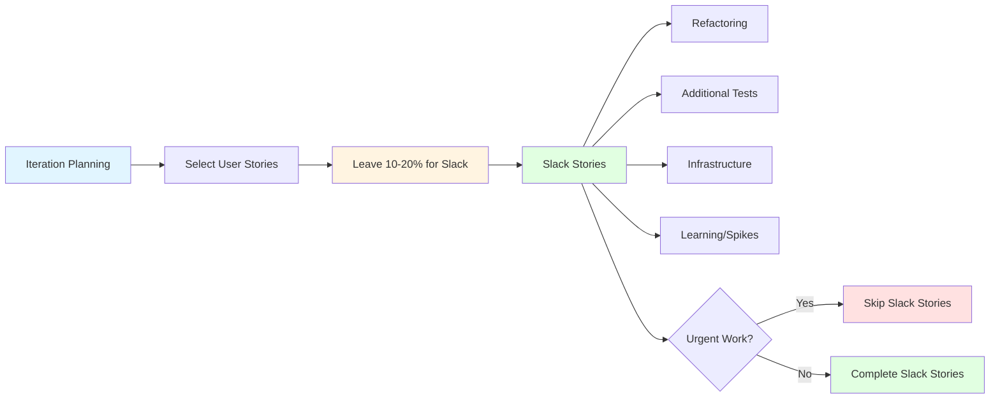

---

## 7. Key Roles and Responsibilities

XP defines **four key roles**:

| **Role** | **Responsibilities** |
|---|---|
| **Customer** | On-site to answer questions, prioritize user stories, or collaborate with acceptance testing. |
| **Programmers** | Estimate the effort needed to complete tasks and stories, write automated tests, and implement the stories. |
| **Coach** | Ensures team members follow the practices, turn them into habits, and don't revert to old ways. **Having a coach isn't required.** |
| **Tracker** | Tracks the team's progress metrics and talks with every team member to identify roadblocks and figure out solutions. Calculates metrics like **velocity and burndown charts**, or uses a digital Scrum/Kanban board that calculates them automatically. |

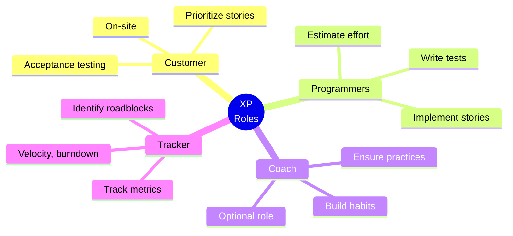

---

## 8. XP Values and Principles

### 8.1 XP Principles

XP is built on **fourteen core principles**:

| **#** | **Principle** | **Description** |
|---|---|---|
| **1** | **Humanity** | Remember that software is built by people, and there's a balance between the needs of each team member and the project's needs. |
| **2** | **Economics** | Somebody is always paying for a software project and everybody has to keep the budget in mind. |
| **3** | **Mutual Benefit** | Search for practices that benefit the individual, the team, and the customer together. |
| **4** | **Self Similarity** | The pattern of a monthly cycle is the same as a weekly cycle and the same as a daily cycle. |
| **5** | **Improvement** | Do your best today, and stay aware of what you need to do to get better tomorrow. |
| **6** | **Diversity** | Lots of different opinions and perspectives work together to come up with better solutions. |
| **7** | **Reflection** | Good teams stay aware of what's working and what isn't in their software process. |
| **8** | **Flow** | Constant delivery means a continuous flow of development work, not distinct phases. |
| **9** | **Opportunity** | Each problem the team encounters is a chance to learn something new about software development. |
| **10** | **Redundancy** | Even though it can seem wasteful at first blush, redundancy avoids big quality problems. |
| **11** | **Failure** | You can learn a lot from failing. It's OK to try things that don't work. |
| **12** | **Quality** | You can't deliver faster by accepting a lower quality product. |
| **13** | **Accepted Responsibility** | If someone is responsible for something, they need to have the authority to get it done. |
| **14** | **Baby Steps** | Take small steps in the right direction rather than making wholesale changes when adopting new practices. |

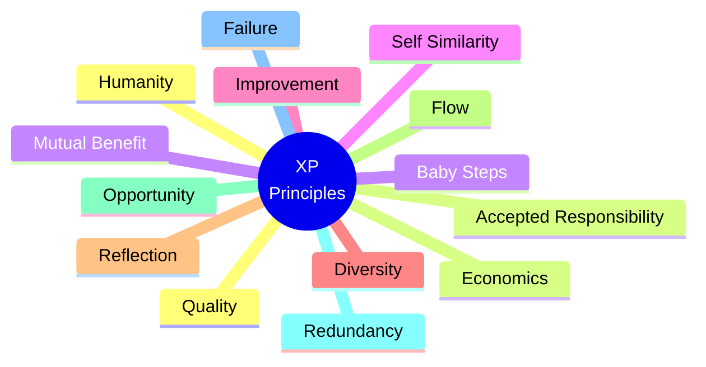

> **Exam Tip:** Memorize the **14 XP principles**. A common exam question is *"List and explain any 5 XP principles."*

---

## 9. When to Use XP

XP is best suited for teams that:

1. **Manage a smaller team.**
2. **Are in constant contact with your customers.**
3. **Have an adaptable team** that can embrace change (without hard feelings).
4. **Are well versed in the technical aspects of coding.**

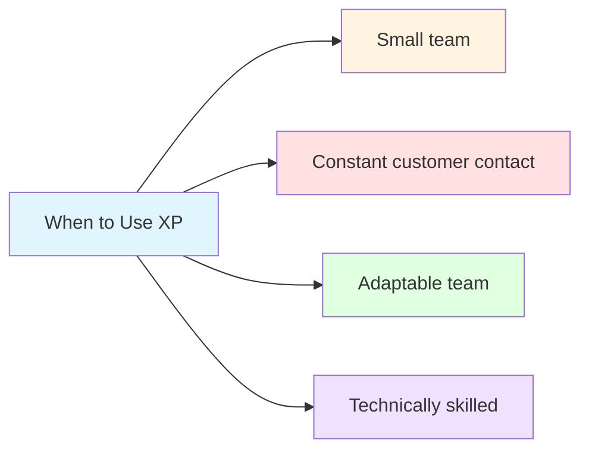

---

## 10. Advantages and Disadvantages of XP

### 10.1 Advantages

| **Advantage** | **Description** |
|---|---|
| **High Code Quality** | TDD, Pair Programming, Refactoring ensure clean, reliable code |
| **Frequent Feedback** | On-Site Customer and Small Releases enable rapid feedback |
| **Adaptability** | Short iterations and Simple Design allow quick response to change |
| **Knowledge Sharing** | Pair Programming and Collective Ownership spread knowledge |
| **Reduced Risk** | Small Releases and Continuous Integration reduce integration risk |
| **Sustainable Pace** | Prevents burnout, maintains long-term productivity |
| **Technical Excellence** | Focus on engineering practices eliminates technical debt |

### 10.2 Disadvantages / Challenges

| **Challenge** | **Description** |
|---|---|
| **Steep Learning Curve** | Requires discipline in coding practices |
| **Customer Availability** | Requires on-site customer — not always possible |
| **Team Size** | Best for small teams — doesn't scale easily |
| **Resistance to Pair Programming** | Some developers dislike working in pairs |
| **Cultural Shift** | Requires change in mindset and habits |
| **Not for All Projects** | Best for R&D, startups, fast-changing requirements |

---

## 11. Real-World Examples and Analogies

### 11.1 Analogy: Race Car Team

- **XP** = A **race car team** — precision engineering, constant tuning, real-time feedback, every second counts
- **Pair Programming** = Driver and co-driver working together
- **TDD** = Testing every component before the race
- **Continuous Integration** = Constant pit stops to check and adjust
- **Refactoring** = Tuning the engine for optimal performance
- **Simple Design** = Only adding what's needed for the race
- **Collective Ownership** = Any mechanic can work on any part of the car

### 11.2 Real-World Use Cases

| **Company** | **XP Practice** | **Result** |
|---|---|---|
| **Chrysler** | XP (C3 Project) | First large-scale XP project |
| **Google** | TDD, Pair Programming | High-quality code, innovation |
| **Netflix** | Continuous Integration | Thousands of deployments/day |
| **Spotify** | Small Releases, CI | Autonomous squads |
| **Startups** | XP | Fast adaptation, quality focus |

---

## 12. Exam Tips

> **📝 Exam Tips — Commonly Asked Questions:**

1. **Define Extreme Programming (XP).** How does it differ from Scrum?
2. **List and explain the XP Technical Practices.**
3. **Explain Pair Programming.** What are the roles?
4. **What is TDD?** Explain the Red-Green-Refactor cycle.
5. **What is Continuous Integration?**
6. **What is Refactoring?** What is the 5-minute rule?
7. **What is Simple Design?** List the 4 rules.
8. **What is Collective Code Ownership?** What are its benefits?
9. **List and explain the XP Team Practices.**
10. **What is the Planning Game?**
11. **Explain the XP Life Cycle** with steps.
12. **What is a Spike?** What is Slack?
13. **List the key roles in XP.**
14. **List and explain any 5 XP principles.**
15. **When should XP be used?**

> **⚠️ Tricky Concepts:**
> - **XP is not just about coding** — it has team practices too.
> - **TDD is test-first**, not test-after.
> - **Pair Programming** has two roles: Driver and Navigator.
> - **Collective Ownership** works because of **Pair Programming and TDD**.
> - **Spike** is throwaway code for learning, not production.
> - **Slack** is planned flexibility (10–20% capacity).
> - **YAGNI** = You Aren't Gonna Need It; **DRY** = Don't Repeat Yourself.
> - **Sustainable Pace** = 40-hour week, no continuous overtime.
> - **On-Site Customer** = Business expert in the same room.

---

## 13. Common Interview Questions

1. **What is Extreme Programming?**
   - *Answer:* An Agile methodology that applies good practices to their extreme end (e.g., continuous code review → Pair Programming, test-before-deploy → TDD).

2. **How does XP differ from Scrum?**
   - *Answer:* Scrum focuses on project management (roles, ceremonies); XP focuses on engineering practices (TDD, Pair Programming, CI).

3. **What is Pair Programming? What are its benefits?**
   - *Answer:* Two developers work together — Driver codes, Navigator reviews. Benefits: real-time code review, knowledge sharing, fewer defects.

4. **What is TDD?**
   - *Answer:* Test-Driven Development — write a failing test first, then code to pass it, then refactor. Red → Green → Refactor.

5. **What is Collective Code Ownership?**
   - *Answer:* Entire team shares responsibility for the codebase; anyone can modify any part at any time.

6. **What is a Spike?**
   - *Answer:* A short, time-boxed research activity to investigate a technical problem or reduce uncertainty.

7. **What is Slack in XP?**
   - *Answer:* Planned flexibility (10–20% capacity) for lower-priority tasks like refactoring or learning.

8. **What are the 4 rules of Simple Design?**
   - *Answer:* Passes all tests, reveals intent, no duplicate code (DRY), fewest possible elements.

9. **What is the Planning Game?**
   - *Answer:* A joint planning session where customers prioritize features and developers estimate effort.

10. **When should XP be used?**
    - *Answer:* Small teams, constant customer contact, adaptable team, technically skilled developers.

---

## 14. Summary

### Key Takeaways

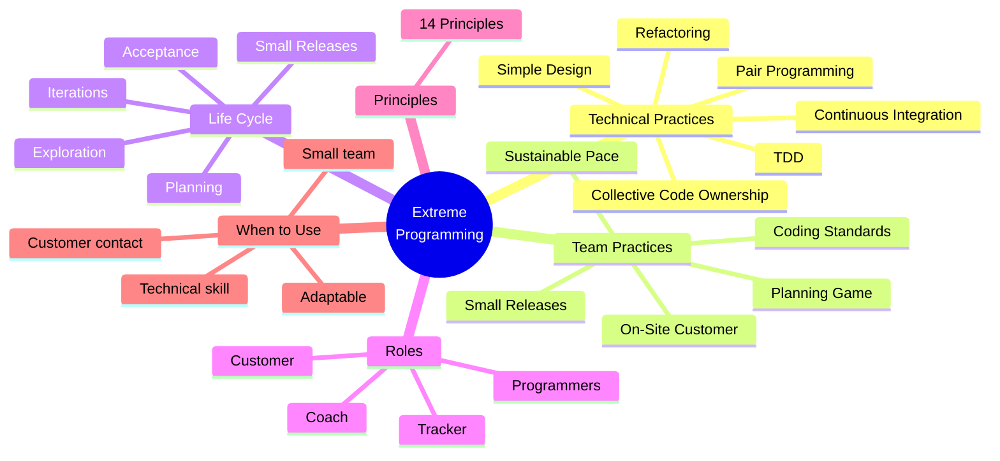

### One-Page Recap

- **XP** = Agile methodology that applies good practices to their extreme end.
- **Technical Practices:** TDD, Pair Programming, CI, Refactoring, Simple Design, Collective Code Ownership.
- **TDD Cycle:** Red → Green → Refactor.
- **Pair Programming:** Driver + Navigator, switch roles frequently.
- **Simple Design:** 4 rules + YAGNI + DRY.
- **Collective Ownership:** Anyone can modify any code; works because of Pair Programming and TDD.
- **Team Practices:** Sustainable Pace, On-Site Customer, Coding Standards, Planning Game, Small Releases.
- **XP Life Cycle:** Exploration → Planning → Iterations → Acceptance → Small Releases.
- **Spike:** Time-boxed research to reduce uncertainty.
- **Slack:** 10–20% planned flexibility.
- **Roles:** Customer, Programmers, Coach (optional), Tracker.
- **14 XP Principles:** Humanity, Economics, Mutual Benefit, Self Similarity, Improvement, Diversity, Reflection, Flow, Opportunity, Redundancy, Failure, Quality, Accepted Responsibility, Baby Steps.
- **When to Use XP:** Small team, constant customer contact, adaptable, technically skilled.

> **Final Exam Tip:** Always connect XP back to its **core goal: technical excellence and adaptability**. XP is about **engineering discipline** — it shows **how** to ensure high-quality, reliable software in an Agile context.

---

## 15. References & Further Reading

- **Extreme Programming Explained** — Kent Beck
- **Planning Extreme Programming** — Kent Beck, Martin Fowler
- **Test-Driven Development: By Example** — Kent Beck
- **Refactoring: Improving the Design of Existing Code** — Martin Fowler
- **Pair Programming Illuminated** — Laurie Williams, Robert Kessler
- **Official Docs:** Agile Alliance, ExtremeProgramming.org

---

*End of Notes — Extreme Programming (XP)*