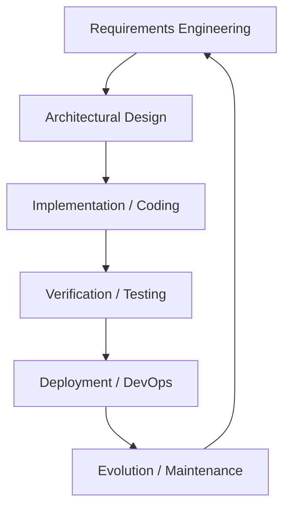
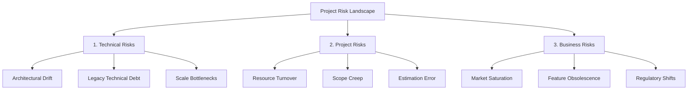
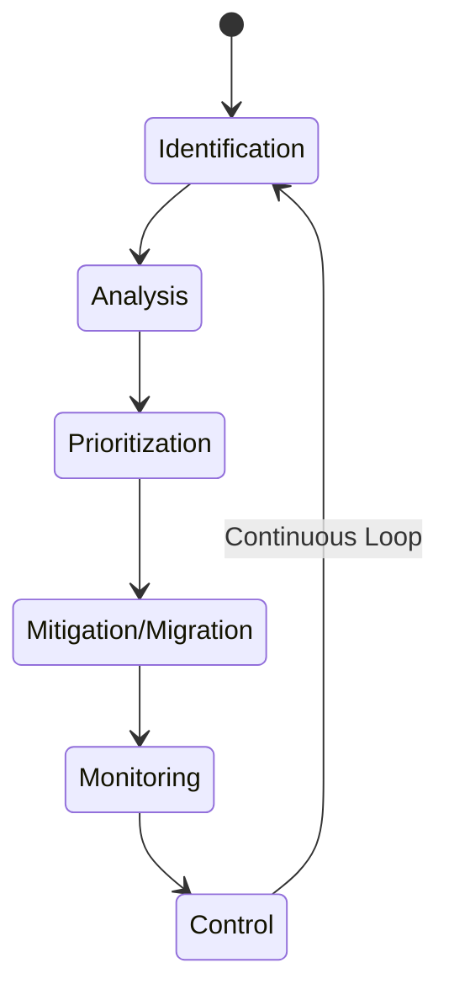

# Detailed Master's-Level Notes: Software Engineering Foundations & Risk Management in Agile

---

## 1. Prerequisites & Foundational Context

To critically analyze modern Agile methodologies, a Master's student must first understand the foundational socio-technical paradigms of Software Engineering. Software engineering differs from traditional engineering due to its **radical mutability** and **absence of physical constraints**. Historically, development shifted from ad-hoc, unconstrained programming to highly rigid, bureaucratic models, before finally arriving at modern empirical, iterative frameworks (Agile).

Understanding this evolutionary trajectory and the ever-present dimension of **Risk** is critical before exploring specific Agile execution patterns (like Scrum, XP, or Kanban).

---

## 2. Software Development: An Advanced Architectural Perspective

### 2.1 Definitive Definition

**Software Development** is a systematic, disciplined, and quantifiable engineering process focused on the conception, design, implementation, verification, and maintenance of complex software systems.

From an academic perspective, it is the process of translating a fuzzy, real-world problem space into an explicit, algorithmic solution space within a highly volatile environment.

### 2.2 Core Characteristics & Features

* **Intangibility:** Software lacks physical substance, making progress tracking difficult without formal metrics.
* **Complexity:** The state space of modern software systems scales non-linearly, making complete exhaustive testing mathematically impossible.
* **Malleability:** Software can be modified easily at any time, which often leads to architectural drift if not governed properly.
* **Evolutionary Nature:** Software deteriorates through maintenance cycles (**Software Entropy**) rather than wearing out physically.

### 2.3 The Core Subsystems of the Development Lifecycle

Regardless of whether a team follows an Agile or plan-driven approach, every software system cycles through these structural domains:

---

## 3. Taxonomy of Engineering Risks

A **Risk** is an uncertain event or condition that, if it occurs, has a negative effect on at least one project objective (such as scope, schedule, cost, or quality). In software engineering, risks are classified into three distinct structural vectors.

### 3.1 Technical Risks

Technical risks directly threaten the quality, performance, and structural integrity of the software product. They stem from architectural choices, implementation constraints, and technological dependencies.

* **Architectural Infeasibility:** The selected technology stack cannot support non-functional requirements (such as latency, throughput, or concurrent connection limits).
* **Technical Debt accumulation:** Rigid, poorly factored codebases that slow down the velocity of future iterations.
* **Integration Clashes:** Incompatibilities between third-party APIs, distributed microservices, or legacy components.

### 3.2 Project Risks

Project risks threaten the operational schedule, budgetary constraints, and resource pipelines of the development lifecycle.

* **Estimation Failure:** Underestimating the effort required for complex features, leading to missed deadlines.
* **Resource Fluctuation:** The sudden loss of specialized personnel (low bus factor), disrupting development continuity.
* **Scope Creep:** Unmanaged, continuous expansion of requirements without corresponding adjustments to time and budget.

### 3.3 Business Risks

Business risks threaten the commercial viability, market fit, and organizational value of the software product, even if the technical delivery is flawless.

* **Market Misalignment (Building the Wrong Product):** Delivering a system that matches the original specification but no longer meets shifting user needs.
* **Regulatory/Compliance Violations:** Sudden changes in legal frameworks (e.g., GDPR, HIPAA, AI acts) that render the software's architecture illegal or non-compliant.
* **Economic/Funding Cuts:** Shifting corporate strategies that reduce or eliminate project funding.

---

## 4. The Risk Management Lifecycle

Managing risk requires a systematic, closed-loop control system. Agile frameworks address this by shortening the feedback loop, transforming implicit risks into explicit backlog items.

### 4.1 Steps Involved in Risk Management

#### 1. Risk Identification

The proactive process of uncovering potential threats to the project.

* **Mechanisms:** Brainstorming sessions, historical project post-mortems, checklist evaluations, and Agile spike solutions (focused research iterations).
* **Artifact:** The **Risk Register**, a living document tracking all identified threats.

#### 2. Risk Analysis

Quantifying the characteristics of each identified risk.

* **The Mathematical Model:** 
$$\text{Risk Exposure (RE)} = \text{Probability of Occurrence (P)} \times \text{Impact Loss (L)}$$

* **Application:** Probability is measured from $0.0$ to $1.0$, while Impact is quantified using a financial or operational scale (e.g., $1$ to $10$).

#### 3. Risk Prioritization

Sorting the risk register using calculated risk exposure values to ensure the team addresses the most critical items first.

| Probability \ Impact | Low (1-3) | Medium (4-7) | High (8-10) |
| --- | --- | --- | --- |
| **High (0.7 - 1.0)** | Medium Priority | High Priority | **Critical Priority (Address First)** |
| **Medium (0.4 - 0.6)** | Low Priority | Medium Priority | High Priority |
| **Low (0.0 - 0.3)** | Negligible | Low Priority | Medium Priority |

#### 4. Risk Mitigation / Migration (Risk Handling)

Developing strategic engineering and operational plans to manage risks.

* **Mitigation:** Taking proactive steps to reduce the probability or impact of a risk (e.g., building a small prototype to evaluate an unfamiliar database).
* **Migration (Transfer):** Shifting the risk responsibility to an external entity (e.g., outsourcing infrastructure operations to an enterprise cloud provider via an SLA).
* **Avoidance:** Changing project requirements entirely to eliminate the risk vector.
* **Acceptance:** Acknowledging the risk and maintaining a contingency budget, used when the cost of mitigation outweighs the potential loss.

#### 5. Risk Monitoring

Continuously tracking the risk landscape throughout the project lifecycle.

* **Agile Integration:** Teams evaluate risks during daily stand-ups, iteration reviews, and sprint retrospectives, noting changes in probability or impact as the system evolves.

#### 6. Risk Control

Executing the contingency plans developed during the mitigation phase when a monitored risk crosses a predefined threshold. This step also involves updating the risk register with new insights learned from the event.

---

## 5. The Evolution of Software Development

Software processes have evolved to find better ways of managing uncertainty and scale over time.

### 5.1 The Pioneering Days (1940s - 1950s)

* **The Paradigm:** Ad-hoc, low-level binary hacking. Programs were tied to specific physical computer hardware.
* **Process Model:** None. Software development followed a "Code-and-Fix" cycle, where developers wrote code and debugged it until it worked, without any formal design phase.

### 5.2 The Start of High-Level Languages (1950s - 1960s)

* **The Paradigm:** The arrival of languages like Fortran, LISP, and COBOL decoupled software logic from physical hardware layouts.
* **Process Model:** The introduction of reusable code libraries and structured algorithms. However, this growth in system size and complexity triggered the **"Software Crisis"** of the late 1960s, where projects routinely ran over budget, missed deadlines, and delivered unreliable software.

### 5.3 The Personal Computer Era (1970s - 1980s)

* **The Paradigm:** Silicon microprocessors put computing power directly into the hands of consumers, creating a mass market for software.
* **Process Model:** To manage this scale, engineering teams adopted highly structured, bureaucratic models from traditional manufacturing, such as the rigid **Waterfall Model**.

### 5.4 The Rise of the Internet (1990s)

* **The Paradigm:** Universal network connectivity changed how software was delivered and updated, making long, multi-year release cycles unviable.
* **Process Model:** This fast-paced environment sparked the **Agile Revolution**. Lightweight, iterative methodologies like Scrum, Extreme Programming (XP), and Feature-Driven Development (FDD) emerged to challenge slow, plan-driven processes.

### 5.5 The Mobile Age (2000s - 2010s)

* **The Paradigm:** Smartphones introduced highly distributed, cloud-connected mobile applications that required low power consumption and rapid feature rollouts.
* **Process Model:** Continuous Integration and Continuous Deployment (**CI/CD**) became standard practice, allowing teams to deliver weekly or daily updates to application stores.

### 5.6 AI and Cloud Computing (2020s - Ongoing)

* **The Paradigm:** Modern applications rely on highly scalable cloud infrastructure, microservice architectures, and embedded machine learning models.
* **Process Model:** Engineering teams use **DevOps** and **GitOps** alongside Agile practices. Development cycles are data-driven, leveraging automated infrastructure provisioning, feature flags, and AI-assisted pair programming to manage constant changes safely.

---

## 6. Software Process Models & The Case for Structured Processes

### 6.1 What is a Software Process Model?

A **Software Process Model** is an abstract representation of a software engineering lifecycle. It defines the structured sequence of phases, deliverables, roles, and validation gates used to guide a project from inception to delivery.

### 6.2 Why Use a Process Model?

Without an explicit process model, software projects quickly fall victim to coordination issues and technical debt. Key reasons for adopting a formal model include:

* **Predictability & Planning:** Provides a reliable framework for estimating costs, scheduling deliverables, and assigning resources across the team.
* **Quality Assurance:** Integrates testing and validation gates into the development lifecycle, ensuring quality issues are caught early rather than at the end of the project.
* **Visibility & Transparency:** Gives stakeholders clear, measurable milestones to track progress accurately.
* **Risk Management:** Establishes regular checkpoints to identify, assess, and mitigate risks before they impact the project schedule.

---

## 7. Exam Tips & High-Yield Points

> ### 🧠 Exam Tip 1: Calculating Risk Exposure (RE)
> 
> 
> If an exam question asks you to analyze or prioritize a set of project risks, use the formal formula: $RE = P \times L$. Create a clear table showing your probability and loss ratings, calculate the final exposure score for each item, and sort them in descending order to demonstrate a systematic approach to prioritization.

> ### 🧠 Exam Tip 2: Plan-Driven vs. Empirical Process Models
> 
> 
> Be prepared to contrast traditional plan-driven models (like Waterfall) with empirical Agile models. Focus your answer on how they handle requirements stability: Waterfall treats change as a failure of early planning phases, whereas Agile accepts changing requirements as a natural reality, managing them through regular iterative feedback loops.

---

## 8. Common Interview Questions

### 1. How does an Agile team handle risk management differently than a traditional Waterfall project team?

* **Answer:** In a traditional Waterfall project, risk management is often handled as a front-heavy planning exercise where teams build an extensive risk register before development begins. In contrast, Agile teams integrate risk management directly into their regular delivery loops. By building small, working increments every sprint, teams get early feedback that mitigates business risk. They use technical spikes to address architectural uncertainties early, and evaluate shifting project risks during regular sprint retrospectives and daily stand-ups.

### 2. Imagine your team is using a new, unproven cloud database for a high-throughput transaction system. What type of risk is this, and how would you handle it?

* **Answer:** This is a classic **Technical Risk** involving architectural feasibility and performance stability. To manage it, I would use an Agile mitigation strategy called a **Technical Spike**. Before committing the core application architecture to this database, I would dedicate a short, time-boxed effort to build a simple prototype. This lets us run realistic load tests, evaluate throughput limits, and understand the database's behavior under pressure, giving us the hard data needed to validate or pivot our architectural choices.

### 3. Why did the rise of the Internet in the 1990s accelerate the decline of traditional, plan-driven software development processes?

* **Answer:** Traditional plan-driven processes like Waterfall were designed for software delivered on physical media, where changing or patching a product after release was slow and expensive. The internet removed these physical delivery constraints, creating a fast-moving market where requirements changed rapidly. In this new landscape, spending months or years on upfront documentation often meant delivering a product that was already obsolete. Teams needed more flexible, iterative processes—which led to the Agile movement—allowing them to release updates quickly and adapt to changing user needs in real time.