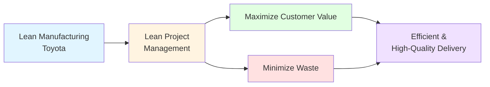
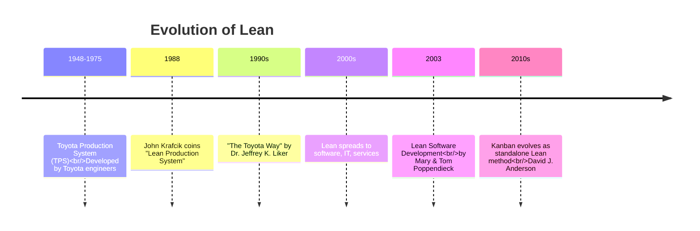
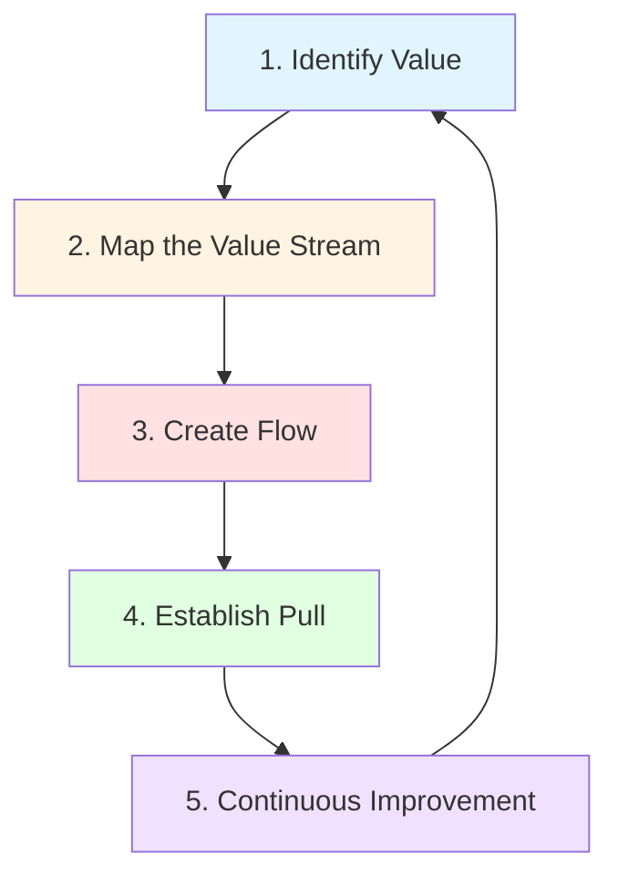
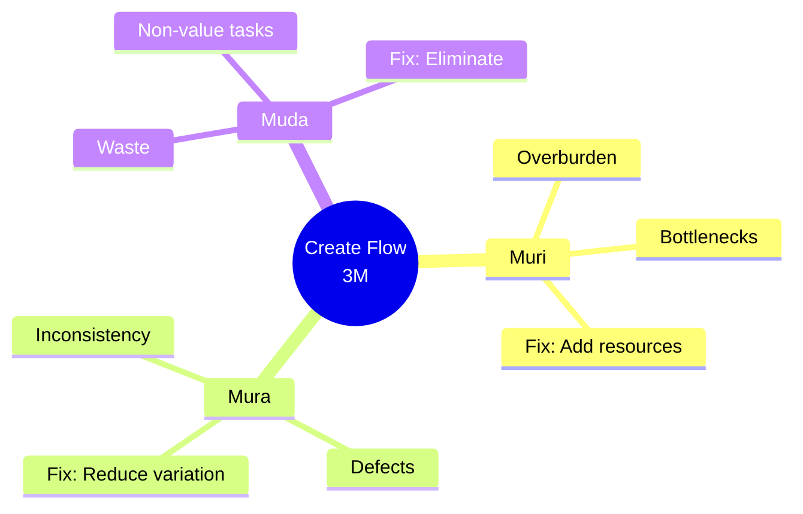
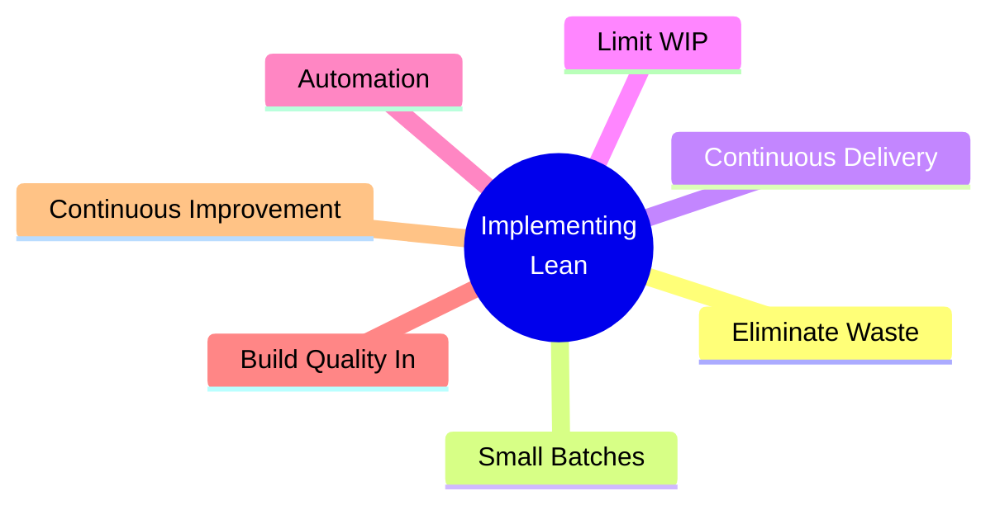
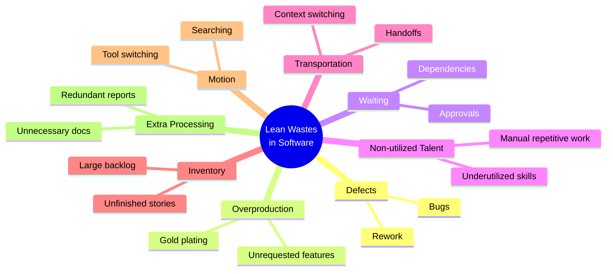
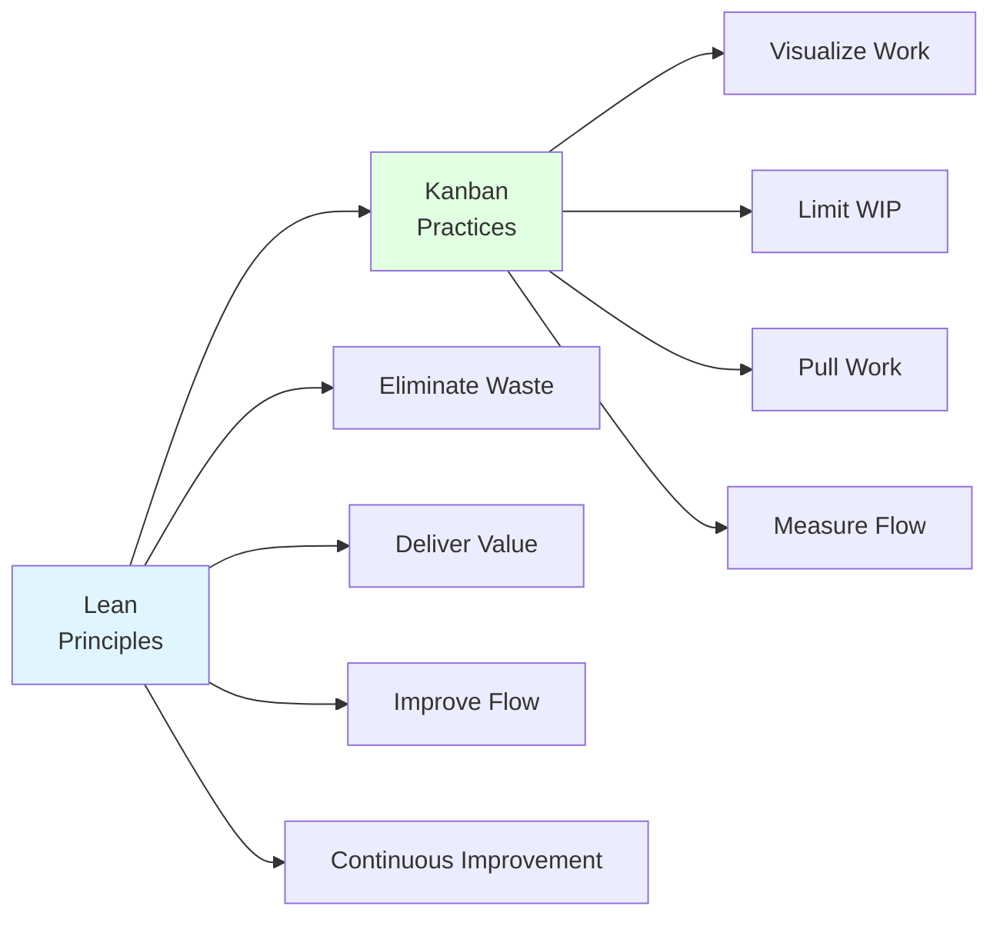
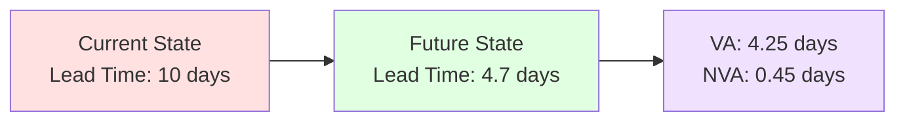
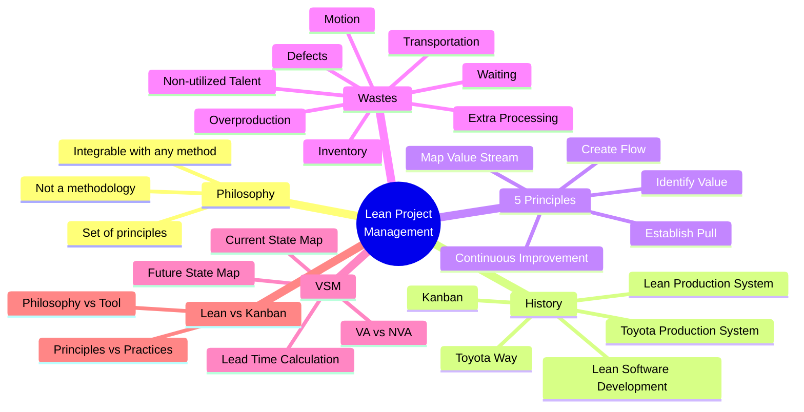

# Lean Project Management — Master's-Level Notes

> **Course Context:** Software Engineering (Agile Practices)
> **Topic:** Lean Project Management, Lean Principles, Lean Wastes, Value Stream Mapping (VSM), and Lean vs Kanban
> **Prerequisites:** Basic understanding of Agile methodology, Scrum, Kanban, and software development lifecycle. Familiarity with the concept of value and waste in production systems is helpful.

---

## 1. Introduction to Lean

### 1.1 What Lean Is (and Isn't)

> **Lean is NOT a methodology** like Scrum or Waterfall.

> **Lean IS a set of principles** to apply to a system.

**Key Characteristics:**
- Can be integrated into **manufacturing, software development, and start-ups**
- Can be incorporated into **project management** regardless of the methodology being used — be it **Scrum, Waterfall, Agile, or something else entirely**

### 1.2 Definition of Lean Project Management

> **Lean Project Management** is an approach to project management that emphasizes **maximizing value for the customer** while **minimizing waste** throughout the project lifecycle.

**Key Points:**
- Applies the principles and practices of **Lean manufacturing** (developed by **Toyota**) to the context of **project delivery**
- Lean processes are oriented around **adding value** to the customer or the project's end goal
- **Anything that doesn't do this is considered waste**



---

## 2. History of Lean Project Management

### 2.1 Timeline of Lean Evolution



### 2.2 Toyota Production System (TPS)

- **Developed in Japan between 1948–1975** by engineers at Toyota.
- **Aimed to improve manufacturing efficiency.**
- **Focused on enhancing supplier and customer interactions.**
- **Core objective: Eliminate waste in production.**

### 2.3 Dr. Jeffrey K. Liker — "The Toyota Way"

- **Documented and explained TPS** in his book **"The Toyota Way"**.
- **Outlined principles of lean management.**
- **Demonstrated how TPS concepts apply across industries.**
- **Emphasized lean's ability to eliminate various types of corporate waste.**

### 2.4 John Krafcik — "Lean Production System"

- **Introduced the term "Lean Production System" in 1988.**
- Based on his **master's thesis at MIT**.
- Published article titled **"Triumph of the Lean Production System"**.

### 2.5 Lean Spreads to Software (2000s)

- **Lean Software Development** by **Mary & Tom Poppendieck** adapts Lean to tech projects.

### 2.6 Modern Day: Kanban

- **Kanban evolves into a standalone Lean managed method** for Agile & software teams (**David J. Anderson**).
- **Visual boards, WIP limits, and flow-based work management** become common in IT and software.

---

## 3. The 5 Principles of Lean Project Management

Lean is built on **five core principles**:



### 3.1 Principle 1: Identify Value

> The first principle of Lean is to **identify what adds value** to the final product or the end goal.

**Key Actions:**
- Contrast to a team just working to complete a project
- **Really knowing the customers**
- Looking to **solve their problems and needs**

**Key Question:** *What does the customer truly value?*

### 3.2 Principle 2: Map the Value Stream

> After clarifying the project's value or end goal, the next step is to **identify the steps to create it**.

**Steps are categorized into three types:**

| **Category** | **Description** | **Example** |
|---|---|---|
| **A Process that Adds Value** | Steps integral to achieving the project's ultimate objective | Coding a feature, testing |
| **A Necessary Process that Adds No Value** | Clerical or administrative work that may not directly impact the end goal but cannot be taken away | Compliance documentation, approvals |
| **An Unnecessary Process that Adds No Value** | Things that don't impact the project and could be "cut away" without anyone missing a beat | Excessive documentation, long meetings |

**Final Step:** **Eliminate anything in the third category** (unnecessary, non-value-adding processes).

### 3.3 Principle 3: Create Flow

> After identifying what adds value and what doesn't, the next step is about **putting processes into place**.

**The Toyota Way does this with 3 principles:**

| **Japanese Term** | **Meaning** | **Description** | **Action** |
|---|---|---|---|
| **Muri** | Overburden | Find places in the workflow with **bottlenecks** | Fix by adding labor, purchasing equipment, or creating a more efficient process |
| **Mura** | Inconsistency | Identify places where **defects or inconsistencies** occur | Reduce them |
| **Muda** | Waste | **Eliminate pointless or time-consuming things** | Remove tasks that don't add value to the customer or product goal |



### 3.4 Principle 4: Establish Pull

> **Establishing pull** means **pulling work from the previous process stage as work is completed**.

**Key Idea:** A **pull system** means that you **make things as they're needed** — not before.

**Contrast with Push System:**
- **Push:** Work is assigned regardless of capacity (can lead to overload)
- **Pull:** Work is pulled only when there's capacity (prevents overload)

### 3.5 Principle 5: Continuous Improvement

> In Toyota, this idea is known as **"Kaizen"** — a combination of the words **"change"** and **"good"**.

**Key Characteristics:**
- A Lean system looks at its **current processes** and strives for **continuous improvements**
- **Nothing is ever deemed "best"** — but rather **"better"**
- Improving means **looking at the root cause of problems** so you can **keep them from happening over and over again**

> **Kaizen = Change + Good = Continuous Improvement**

### 3.6 How the 5 Principles Work Together

> The 5 principles of Lean work together to create a system that's not only **efficient**, but **high quality** as well.

---

## 4. Ways to Implement Lean

Lean can be implemented through **seven key practices**:



| **Practice** | **Description** |
|---|---|
| **Eliminate Waste** | Remove anything that doesn't add value |
| **Small Batches** | Work in small increments to reduce risk and increase feedback |
| **Continuous Delivery** | Deliver value frequently and reliably |
| **Limit WIP** | Limit Work-in-Progress to improve flow |
| **Automation** | Automate repetitive tasks to reduce errors and save time |
| **Build Quality In** | Prevent defects rather than fixing them later |
| **Continuous Improvement** | Always look for ways to improve (Kaizen) |

---

## 5. Lean Wastes

### 5.1 The 8 Wastes (Software Context)

| **Waste** | **Software Example** |
|---|---|
| **Defects** | Bugs requiring rework |
| **Overproduction** | Building features nobody requested |
| **Waiting** | Waiting for approvals |
| **Non-utilized talent** | Skilled developer doing repetitive manual work |
| **Transportation** | Excessive handoffs between teams |
| **Inventory** | Large backlog of unfinished stories |
| **Motion** | Searching for documents/code |
| **Extra processing** | Unnecessary reports/documentation |

### 5.2 Waste Categories Diagram



> **Exam Tip:** Memorize the **8 wastes** with software examples. A common exam question is *"List the 8 Lean wastes with software examples."*

---

## 6. Relationship Between Lean and Kanban

### 6.1 Complementary Roles

| **Lean** | **Kanban** |
|---|---|
| Answers: **"What principles should we follow?"** | Answers: **"How do we apply those principles?"** |
| Eliminate waste | Visualize work |
| Deliver customer value | Limit Work in Progress (WIP) |
| Improve flow | Pull work when capacity is available |
| Continuously improve | Measure and improve flow |



### 6.2 Lean vs Kanban — Detailed Comparison

| **Feature** | **Lean Project Management** | **Kanban** |
|---|---|---|
| **Scope** | Project/organization-wide | Team/task-level |
| **Focus** | Eliminate waste, optimize value | Managing and improving workflow |
| **Tool vs. Philosophy** | Management philosophy | Tool/method within Lean |
| **Duration** | Long-term continuous improvement | Ongoing workflow management |
| **Metrics** | Lead time, throughput, value | WIP, cycle time, cumulative flow |

> **Key Insight:** Lean is the **philosophy**; Kanban is a **tool/method** to apply Lean principles.

---

## 7. Value Stream Mapping (VSM)

### 7.1 Definition

> **Value Stream Mapping (VSM)** is a Lean management technique used to **visualize, analyze, and improve** the flow of **materials, information, and work** required to deliver a product or service to a customer.

**Key Characteristics:**
- It's essentially a **detailed flowchart** that documents every step in a process
- Highlights both **value-adding and non-value-adding activities** (or "waste")
- Helps organizations understand **how value is created and delivered**
- Identifies **bottlenecks, inefficiencies, and waste**
- Strategizes ways to **optimize the process** for better results

### 7.2 VSM Example: Login Module for Web Application

The PDF provides a **detailed VSM example** for a small software team developing a login module.

#### Current State Map

| **#** | **Step** | **Type** | **Time (Days)** | **VA/NVA** |
|---|---|---|---|---|
| 1 | PO writes feature requirements | Process | 1 | VA |
| 2 | Wait for final approval | Wait | 1 | NVA |
| 3 | Developer sets up environment | Process | 0.5 | VA |
| 4 | Wait for DB access | Wait | 0.5 | NVA |
| 5 | Developer codes login feature | Process | 2 | VA |
| 6 | Wait for code review | Wait | 1 | NVA |
| 7 | Peer reviews code | Process | 0.5 | VA |
| 8 | Developer fixes review comments | Process | 0.5 | VA |
| 9 | Wait for CI/CD pipeline to deploy | Wait | 0.25 | NVA |
| 10 | QA tests login functionality | Process | 1 | VA |
| 11 | QA finds bug, dev fixes it | Process | 1 | VA |
| 12 | Wait for re-testing | Wait | 0.25 | NVA |
| 13 | QA retests and closes ticket | Process | 0.25 | VA |

#### Calculations

```
Value-Added Time (VA) = 6.75 days
Non-Value-Added Time (NVA) = 3 days
Total Lead Time = 6.75 + 3 = 9.75 days (≈ 10 days)
```

#### Visual Representation

```mermaid
flowchart LR
    A[PO writes<br/>requirements<br/>1d VA] --> B[Wait for<br/>approval<br/>1d NVA]
    B --> C[Dev sets up<br/>environment<br/>0.5d VA]
    C --> D[Wait for<br/>DB access<br/>0.5d NVA]
    D --> E[Dev codes<br/>login<br/>2d VA]
    E --> F[Wait for<br/>code review<br/>1d NVA]
    F --> G[Peer<br/>reviews<br/>0.5d VA]
    G --> H[Fix review<br/>comments<br/>0.5d VA]
    H --> I[Wait for<br/>CI/CD<br/>0.25d NVA]
    I --> J[QA tests<br/>1d VA]
    J --> K[Fix bug<br/>1d VA]
    K --> L[Wait for<br/>re-test<br/>0.25d NVA]
    L --> M[QA retests<br/>0.25d VA]
    
    style A fill:#e1ffe1
    style B fill:#ffe1e1
    style C fill:#e1ffe1
    style D fill:#ffe1e1
    style E fill:#e1ffe1
    style F fill:#ffe1e1
    style G fill:#e1ffe1
    style H fill:#e1ffe1
    style I fill:#ffe1e1
    style J fill:#e1ffe1
    style K fill:#e1ffe1
    style L fill:#ffe1e1
    style M fill:#e1ffe1
```



> **Legend:** Green = Value-Adding (VA); Red = Non-Value-Adding (NVA)

### 7.3 Post-VSM: Steps for Improvement

After creating the current state map, the team should:

1. **Analyze the Current State Map**
2. **Engage the Team in Discussion**
3. **Define the Future State Map**
4. **Create a Lean Action Plan**
5. **Implement and Monitor Improvements**

### 7.4 Future State Map

After improvements, the process is optimized:

| **#** | **Improved Step** | **Type** | **Time (Days)** | **VA/NVA** | **What Changed** |
|---|---|---|---|---|---|
| 1 | PO writes refined requirements quickly | Process | 0.5 | VA | Faster, leaner writing |
| 2 | Immediate approval via automated workflow | Wait | 0.25 | NVA | Delays minimized |
| 3 | Dev preps environment (pre-configured) | Process | 0.25 | VA | Automation used |
| 4 | DB access provisioned earlier | Wait | 0.1 | NVA | Proactive access setup |
| 5 | Dev codes login | Process | 1.5 | VA | Efficient pairing |
| 6 | Peer review next day | Process | 0.5 | VA | Immediate reviews |
| 7 | Fix review comments | Process | 0.25 | VA | Better quality |
| 8 | CI/CD auto-deploy | Wait | 0.1 | NVA | No wait time manually |
| 9 | QA tests + fixes minor issues | Process | 1 | VA | Integrated effort |
| 10 | QA closes ticket | Process | 0.25 | VA | Final step |

#### Improved Calculations

```
Value-Added Time (VA) = 4.25 days
Non-Value-Added Time (NVA) = 0.45 days
Total Lead Time = 4.7 days (down from 10 days)
```

#### Visual Representation of Improvement



### 7.5 Key Improvements

| **Improvement** | **Impact** |
|---|---|
| Faster requirements writing | Reduced from 1 day to 0.5 days |
| Automated approval workflow | Reduced from 1 day to 0.25 days |
| Pre-configured environments | Reduced from 0.5 days to 0.25 days |
| Proactive DB access | Reduced from 0.5 days to 0.1 days |
| Efficient pairing | Reduced from 2 days to 1.5 days |
| Immediate peer reviews | Reduced from 1 day to 0.5 days |
| Better quality fixes | Reduced from 0.5 days to 0.25 days |
| Automated CI/CD | Reduced from 0.25 days to 0.1 days |
| Integrated QA effort | Reduced from 1 day to 1 day |
| Faster ticket closure | Reduced from 0.25 days to 0.25 days |

> **Result:** Lead time reduced from **10 days to 4.7 days** — a **53% improvement**.

---

## 8. Advantages and Disadvantages of Lean

### 8.1 Advantages

| **Advantage** | **Description** |
|---|---|
| **Customer Focus** | Maximizes value for the customer |
| **Waste Reduction** | Eliminates non-value-adding activities |
| **Improved Flow** | Smoother, faster processes |
| **Continuous Improvement** | Kaizen mindset drives ongoing betterment |
| **Quality** | Builds quality in rather than inspecting it |
| **Flexibility** | Can be integrated with any methodology |
| **Team Empowerment** | Encourages problem-solving at all levels |

### 8.2 Disadvantages / Challenges

| **Challenge** | **Description** |
|---|---|
| **Cultural Shift** | Requires mindset change across the organization |
| **Initial Investment** | Training and process redesign take time |
| **Resistance to Change** | Teams may resist abandoning familiar practices |
| **Measurement Complexity** | Identifying value and waste can be subjective |
| **Long-Term Commitment** | Continuous improvement is ongoing, not a one-time fix |
| **Not a Quick Fix** | Results may take time to materialize |

---

## 9. Real-World Examples and Analogies

### 9.1 Analogy: A Restaurant Kitchen

- **Value** = A delicious meal delivered to the customer
- **Value Stream** = Order → Cook → Plate → Serve
- **Waste** = Waiting for ingredients, overcooking, redoing orders
- **Flow** = Smooth coordination between chef, sous-chef, and waiter
- **Pull** = Cooking only when an order is placed (not before)
- **Kaizen** = Continuously improving recipes and processes

### 9.2 Real-World Use Cases

| **Company** | **Lean Practice** | **Result** |
|---|---|---|
| **Toyota** | TPS, Kaizen | Global leader in efficiency |
| **Amazon** | Small batches, continuous delivery | Deploy every 11.7 seconds |
| **Spotify** | Flow-based work, WIP limits | Autonomous squads |
| **Netflix** | Continuous improvement | Thousands of deployments/day |
| **Toyota** | Value Stream Mapping | Identified and eliminated waste |

---

## 10. Exam Tips

> **📝 Exam Tips — Commonly Asked Questions:**

1. **Define Lean Project Management.** How does it differ from Scrum?
2. **List and explain the 5 principles of Lean.**
3. **What are the 8 Lean wastes?** Give software examples.
4. **Explain Muri, Mura, and Muda.**
5. **What is Value Stream Mapping (VSM)?** How is it used?
6. **Calculate VA, NVA, and Lead Time** from a VSM table.
7. **What is the relationship between Lean and Kanban?**
8. **Compare Lean and Kanban.**
9. **What is Kaizen?** How does it relate to continuous improvement?
10. **What is a pull system?** How does it differ from push?
11. **What are the ways to implement Lean?**
12. **Explain the history of Lean** from TPS to modern software.

> **⚠️ Tricky Concepts:**
> - **Lean is a philosophy, not a methodology.**
> - **Kanban is a tool within Lean**, not a separate philosophy.
> - **Muri = Overburden, Mura = Inconsistency, Muda = Waste.**
> - **VSM has both VA and NVA steps** — only NVA should be eliminated (but some NVA is necessary).
> - **Kaizen = Change + Good = Continuous Improvement.**
> - **Pull = Make things as needed**, not before.

---

## 11. Common Interview Questions

1. **What is Lean Project Management?**
   - *Answer:* An approach that maximizes customer value while minimizing waste, applying Toyota's Lean principles to project delivery.

2. **What are the 5 principles of Lean?**
   - *Answer:* Identify Value, Map the Value Stream, Create Flow, Establish Pull, Continuous Improvement.

3. **What are the 8 wastes in Lean?**
   - *Answer:* Defects, Overproduction, Waiting, Non-utilized talent, Transportation, Inventory, Motion, Extra processing.

4. **What is Value Stream Mapping?**
   - *Answer:* A Lean technique to visualize, analyze, and improve the flow of work, highlighting value-adding and non-value-adding activities.

5. **How do you calculate Lead Time in VSM?**
   - *Answer:* Lead Time = Value-Added Time (VA) + Non-Value-Added Time (NVA).

6. **What is the difference between Lean and Kanban?**
   - *Answer:* Lean is the philosophy (principles); Kanban is a tool/method to apply those principles.

7. **What is Kaizen?**
   - *Answer:* Continuous improvement — a Japanese term combining "change" and "good."

8. **What is a pull system?**
   - *Answer:* A system where work is pulled only when there's capacity, as opposed to pushed regardless of capacity.

9. **What is Muri, Mura, Muda?**
   - *Answer:* Muri = Overburden, Mura = Inconsistency, Muda = Waste — the three enemies of flow.

10. **How does Lean apply to software development?**
    - *Answer:* Through eliminating waste (bugs, waiting, overproduction), small batches, continuous delivery, limiting WIP, automation, building quality in, and continuous improvement.

---

## 12. Summary

### Key Takeaways



### One-Page Recap

- **Lean** = philosophy, not methodology.
- **Lean Project Management** = maximize customer value, minimize waste.
- **History:** TPS (Toyota) → Toyota Way (Liker) → Lean Production (Krafcik) → Lean Software Development (Poppendieck) → Kanban (Anderson).
- **5 Principles:** Identify Value, Map Value Stream, Create Flow, Establish Pull, Continuous Improvement.
- **3M:** Muri (Overburden), Mura (Inconsistency), Muda (Waste).
- **8 Wastes:** Defects, Overproduction, Waiting, Non-utilized talent, Transportation, Inventory, Motion, Extra processing.
- **Ways to Implement:** Eliminate Waste, Small Batches, Continuous Delivery, Limit WIP, Automation, Build Quality In, Continuous Improvement.
- **VSM:** Visualize flow, identify waste, calculate VA/NVA/Lead Time.
- **Lean vs Kanban:** Lean = philosophy; Kanban = tool.
- **Kaizen:** Continuous improvement — always "better," never "best."

> **Final Exam Tip:** Always connect Lean back to its **Toyota origins** and its **core goal: maximizing customer value while minimizing waste**. Lean is about **flow, pull, and continuous improvement** — and it can be applied to **any methodology**.

---

## 13. References & Further Reading

- **The Toyota Way** — Dr. Jeffrey K. Liker
- **Lean Software Development** — Mary & Tom Poppendieck
- **Implementing Lean Software Development** — Mary & Tom Poppendieck
- **Kanban: Successful Evolutionary Change** — David J. Anderson
- **Value Stream Mapping** — Karen Martin & Mike Osterling
- **The Machine That Changed the World** — Womack, Jones, Roos
- **Official Docs:** Lean Enterprise Institute, Lean.org, Toyota Production System

---

*End of Notes — Lean Project Management*