# Scaling Agile — Master's-Level Notes

> **Course Context:** Software Engineering (Agile Practices)
> **Topic:** Scaling Agile — LeSS, LeSS Huge, SAFe, ARTs, and PI Planning
> **Prerequisites:** Solid understanding of Scrum (roles, ceremonies, artifacts), Agile principles, and basic knowledge of Kanban/XP. Familiarity with the concept of Product Backlog and Sprint execution is essential.

---

## 1. Introduction: Why Scale Agile?

Agile was originally designed for **small, co-located teams** (5–9 people). But modern software products are often built by **dozens or hundreds of developers** across multiple teams, time zones, and domains.

> **The challenge:** How do you keep Agile's core values — collaboration, transparency, continuous improvement — when you have 20+ teams working on one product?

**Scaling Agile** frameworks attempt to answer this. The two most prominent are:

1. **LeSS (Large-Scale Scrum)** — "Scrum applied to many teams working together on one product."
2. **SAFe (Scaled Agile Framework)** — A comprehensive knowledge base for enterprise-scale Agile.

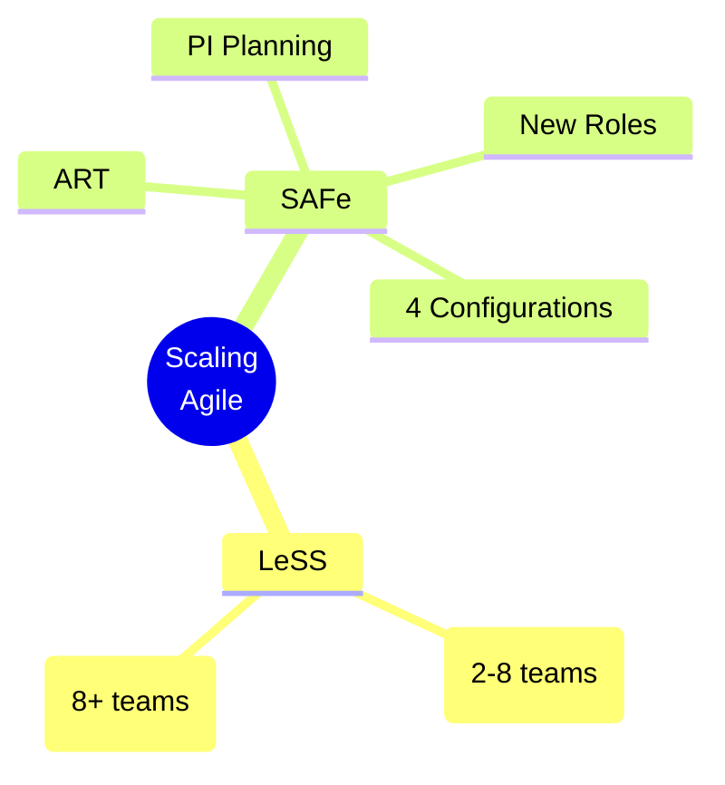

---

## 2. LeSS — Large-Scale Scrum

### 2.1 Definition

> **LeSS (Large-Scale Scrum)** is **Scrum applied to many teams working together on one product**.

**Key Idea:** Don't invent a new methodology — **scale Scrum by applying its principles, rules, elements, and purpose** in a large-scale context, as simply as possible.

### 2.2 LeSS Frameworks

LeSS has **two frameworks** based on team count:

| **Framework** | **Team Size** | **Description** |
|---|---|---|
| **LeSS** | 2–8 Teams | Basic scaling for smaller multi-team products |
| **LeSS Huge** | 8+ Teams | Scaled extension for very large products |

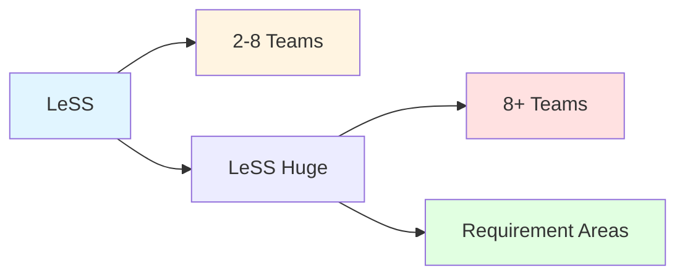

---

## 3. LeSS Framework Structure

LeSS is organized into **four concentric layers**:

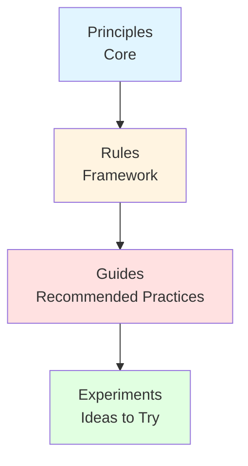

| **Layer** | **Description** |
|---|---|
| **Principles** | Core values and mindset (the "heart" of LeSS) |
| **Rules** | The framework itself — mandatory elements |
| **Guides** | Recommended practices — "optional but recommended" |
| **Experiments** | Ideas to try — not universally recommended |

> **Note:** The PDF image shows a diagram with **Experiments** on the outer ring, **Guides** in the middle, and **Rules** with **Principles** at the center (with a heart symbol).

---

## 4. LeSS Principles

LeSS is built on **ten core principles**:

### 4.1 Large-Scale Scrum is Scrum

> Apply the **principles, rules, elements, and purpose of Scrum** in a large-scale context, as simply as possible.

**Key Insight:** Don't add complexity — **scale Scrum by keeping it simple**.

### 4.2 Transparency

> Create an environment where **everyone can see what's happening**, how things are progressing, and what challenges exist — **without hidden agendas or surprises**.

**Benefits:**
- Better collaboration
- Quicker problem-solving
- More effective product development

### 4.3 More with Less

> Doing **more with less** by **reducing unnecessary complexity and overhead**, rather than simply cutting costs or resources.

**Key Insight:** It's about **efficiency**, not austerity.

### 4.4 Whole-Product Focus

> **One Product Backlog, one Product Owner, one shippable product, one Sprint** — regardless if 3 or 33 teams.

**Why:** Customers want **valuable functionality in a cohesive product**, not technical components in separate parts.

### 4.5 Customer-Centric

> Focus on **learning the customer's real problems** and solving those.

**Actions:**
- Identify **value and waste** in the eyes of paying customers
- Reduce **wait time** from their perspective
- Increase and strengthen **feedback loops** with real customers

### 4.6 Continuous Improvement Towards Perfection

> Enhance processes, products, and organizational structures with the ultimate goal of achieving a **perfect value stream**.

**Key Insight:** It's **not about reaching a fixed, final state** of perfection, but rather about **consistently striving towards it** through incremental changes and a mindset of continuous improvement.

**Action:** Do **endless humble and radical improvement experiments** toward that goal.

### 4.7 Lean Thinking

> Create an organizational system which emphasizes **maximizing customer value while minimizing waste** throughout the entire product development process.

**Key Insight:** It's **not just a set of tools**, but a **way of thinking** about how work is organized and performed to deliver value efficiently and effectively.

### 4.8 Systems Thinking

> See, understand, and **optimize the whole system** (not parts), and use systems modeling to explore system dynamics.

**Avoid:**
- Local sub-optimizations
- Focusing on efficiency of individuals or individual teams

**Key Insight:** Customers care about the **overall concept-to-cash cycle time and flow**, not individual steps. **Locally optimizing a part almost always sub-optimizes the whole.**

### 4.9 Empirical Process Control

> Continually **inspect and adapt** the product, processes, behaviors, organizational design, and practices to evolve in **situationally-appropriate ways**.

### 4.10 Queuing Theory

> Promotes **faster feedback, reduced delays, and smoother flow** of work across many teams.

**How to Achieve:**
- Avoid **overloaded teams**
- Reduce **batch sizes**
- Manage **Work-in-Progress (WIP)**
- Minimize **handoffs and queues between teams**

### 4.11 Summary Table of LeSS Principles

| **Principle** | **Core Idea** |
|---|---|
| **Large-Scale Scrum is Scrum** | Scale Scrum simply |
| **Transparency** | Everyone sees everything |
| **More with Less** | Reduce complexity, not resources |
| **Whole-Product Focus** | One backlog, one PO, one product |
| **Customer-Centric** | Solve real customer problems |
| **Continuous Improvement** | Strive for perfection, not reach it |
| **Lean Thinking** | Maximize value, minimize waste |
| **Systems Thinking** | Optimize the whole, not parts |
| **Empirical Process Control** | Inspect and adapt |
| **Queuing Theory** | Faster feedback, smoother flow |

---

## 5. LeSS Framework (2–8 Teams)

### 5.1 Overview

The **LeSS Framework** extends Scrum to **multiple teams working on a single product** while maintaining **simplicity and lean principles**.

### 5.2 Key Elements

| **Element** | **Description** |
|---|---|
| **Product Owner** | **Shared across all teams** — manages a **single Product Backlog** representing the unified work for the entire product |
| **Sprint Planning** | Conducted in **two parts** (see below) |
| **Teams** | Organized as **cross-functional feature teams**, supported by Scrum Masters |
| **Coordination** | Happens **directly** among teams — **no added management layers** |
| **Product Backlog Refinement** | All teams gather to **refine the product backlog** |
| **Daily Scrum** | Each team holds its own Daily Scrum |
| **Sprint Review** | All teams come together for a **joint Sprint Review** with stakeholders |
| **Retrospectives** | Team-level Retrospectives + an **Overall Retrospective** involving representatives from all teams, Scrum Masters, and the Product Owner |

### 5.3 Sprint Planning in LeSS

Sprint Planning is conducted in **two parts**:

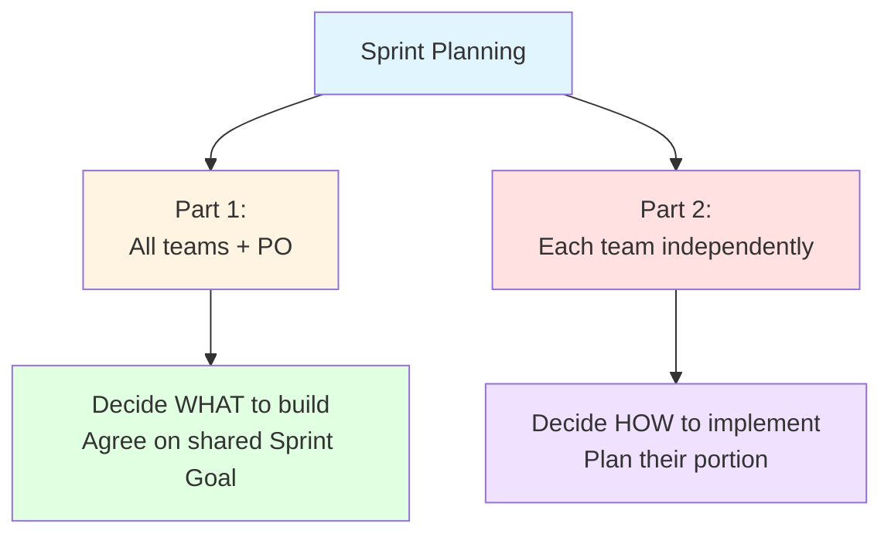

| **Part** | **Who** | **What** |
|---|---|---|
| **Part 1** | All teams + Product Owner | Decide **what to build**; agree on a **shared Sprint Goal** |
| **Part 2** | Each team independently | Plan **how** they will implement their portion of the work |

### 5.4 LeSS Framework Diagram (Conceptual)

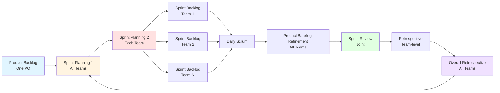

### 5.5 Key Benefits of LeSS

- **Whole-product view**
- **Fast feedback**
- **Reduced coordination overhead**
- **Continuous improvement**
- **Stays true to core Scrum principles**

---

## 6. LeSS Huge Framework (8+ Teams)

### 6.1 Overview

The **LeSS Huge Framework** is a **scaled extension of LeSS**, designed for **more than 8 teams** working on the **same large product**.

### 6.2 Key Innovation: Requirement Areas

To manage scale while maintaining agility, LeSS Huge introduces the concept of **Requirement Areas**.

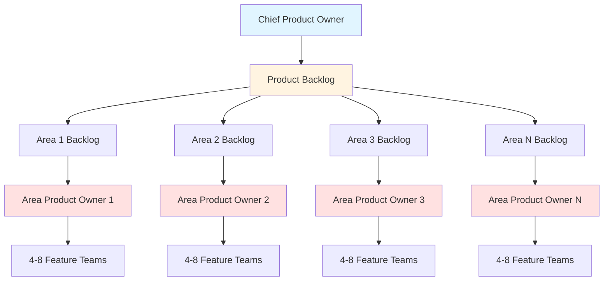

### 6.3 Key Elements

| **Element** | **Description** |
|---|---|
| **Product Owner** | **One Chief Product Owner** responsible for the overall Product Backlog |
| **Area Product Owner (APO)** | Each area has an APO who maintains a **dedicated backlog** for their area |
| **Requirement Areas** | The product backlog is **divided into sections** corresponding to different areas |
| **Teams** | Within each area, **4–8 cross-functional feature teams** operate with support from Scrum Masters |
| **Sprint** | **Single Sprint for all teams** — just like basic LeSS |
| **Sprint Planning** | Done in **two parts** — Part 1 involves all APOs and relevant teams; Part 2 is conducted independently by teams |
| **Coordination** | Happens **both within and across areas** |
| **Daily Scrum** | Teams hold Daily Scrums |
| **Product Backlog Refinement** | Collaborative, cross-team |
| **Sprint Review** | **Shared Sprint Review** to inspect the combined Potentially Shippable Product Increment |
| **Retrospectives** | Team-level + **Overall Retrospective** involving representatives from different areas, Scrum Masters, and APOs |

### 6.4 LeSS Huge Workflow

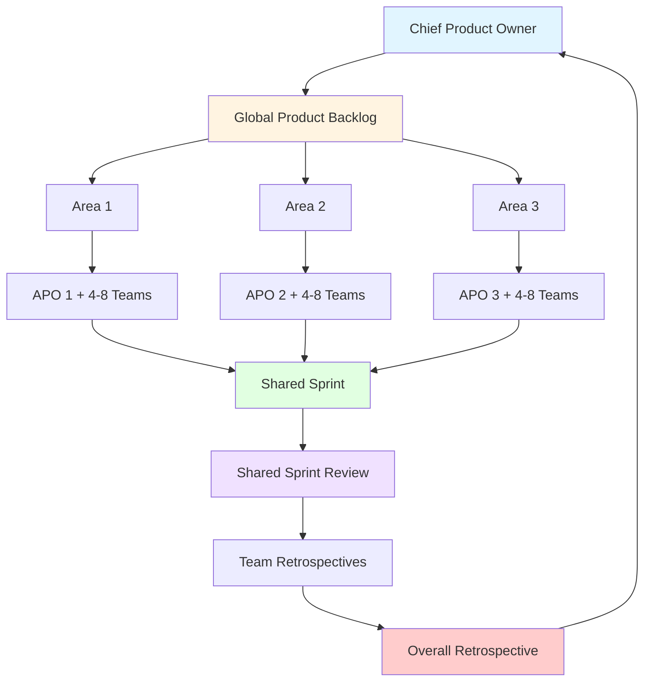

### 6.5 LeSS Huge — Key Insight

> **LeSS Huge retains the simplicity of Scrum principles** while **distributing ownership and decision-making** through well-structured roles and transparent practices.

---

## 7. LeSS Guides

### 7.1 Definition

> **LeSS Guides** are **recommended practices** that align closely with LeSS principles and are considered **good practices based on real-world experience**.

**Characteristics:**
- **"Optional but recommended"**
- Help teams apply LeSS more effectively
- Generally beneficial, but should still be **adapted based on context**

### 7.2 Examples

| **Guide** | **Description** |
|---|---|
| **One Definition of Done** | Have one DoD across all teams |
| **Rotate Scrum Masters** | Rotate Scrum Masters between teams |
| **Cross-functional Feature Teams** | Create cross-functional feature teams |

---

## 8. LeSS Experiments

### 8.1 Definition

> **LeSS Experiments** are **ideas to try out**.

**Characteristics:**
- May work well in some environments but **aren't universally recommended**
- Test **boundaries of LeSS application**
- **Not required** or even always advisable
- Some may **contradict traditional Scrum/Agile thinking — intentionally**
- Help teams **explore, learn, and improve** based on their context

### 8.2 Examples

| **Experiment** | **Description** |
|---|---|
| **No Sprint Planning 1** | Let teams pull directly |
| **Rotate Product Areas** | Have teams change product areas every few months |
| **Eliminate PO Role** | Eliminate the Product Owner role for one Sprint |

> **Exam Tip:** Know the difference between **Guides** (recommended) and **Experiments** (optional, boundary-testing). Guides are "good practices"; Experiments are "ideas to try."

---

## 9. Sample LeSS and LeSS Huge Projects

The PDF provides a detailed comparison of **LeSS** vs **LeSS Huge** using a **Digital Banking Platform** example.

| **Element** | **LeSS (2–8 teams)** | **LeSS Huge (8+ teams, multiple requirement areas)** |
|---|---|---|
| **Product** | Digital Banking Platform (web + mobile + backend services) | Same Digital Banking Platform, but supporting multi-country rollouts, AI features, etc. |
| **Scope** | Initial rollout: core banking features (accounts, transfers, UI, APIs) | Full platform: scaled for different regions, compliance, analytics, marketing dashboards, chatbot AI |
| **Product Owner** | 1 PO managing one prioritized Product Backlog | 1 Chief Product Owner + 3–4 Area Product Owners for different Requirement Areas |
| **Teams (Cross-functional)** | 6 Teams each delivering end-to-end features (frontend, backend, integration) | 20+ Teams grouped into Requirement Areas, each Area with 4–8 teams |
| **Team Examples** | Team A: "User Authentication" — UI, API, database Team B: "Fund Transfer" — mobile + API + transaction ledger Team C: "Dashboard UI" + hooks into API | Area 1: Authentication & Security — login, encryption, biometric auth, fraud detection Area 2: Payments & Transactions — UPI, RTGS, scheduling, reversal, retry logic Area 3: Customer Experience — UI design, personalization, feedback, onboarding workflows |
| **Backlog** | One Product Backlog shared by all teams | Each Area has an Area Backlog created from a global Product Backlog |
| **Planning & Execution** | Common Sprint Planning and Review for all teams | Area-level planning + Overall Product Backlog Refinement for coordination across Areas |
| **Integration** | All teams contribute to a shared codebase — integrated continuously | Integration is handled via shared infrastructure, DevOps pipelines, and multi-area coordination |

### 9.1 Visual Comparison

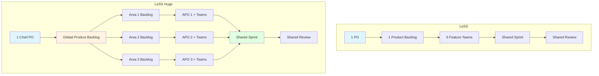

---

## 10. SAFe — Scaled Agile Framework

### 10.1 Definition

> The **Scaled Agile Framework (SAFe)** is a **knowledge base** of:
> - Organizational and workflow principles
> - Practices and competencies
>
> ...designed to help organizations implement an **Agile model at enterprise scale**.

**Key Attraction:** SAFe's support for **budgeting, compliance, and multiple value streams** makes it attractive for **highly regulated or complex environments**.

> **Reference Video:** [SAFe Overview](https://youtu.be/aW2m-BtCJyE?si=r3Itnr9vy3HKw1ns)

### 10.2 SAFe is Built From

SAFe combines:

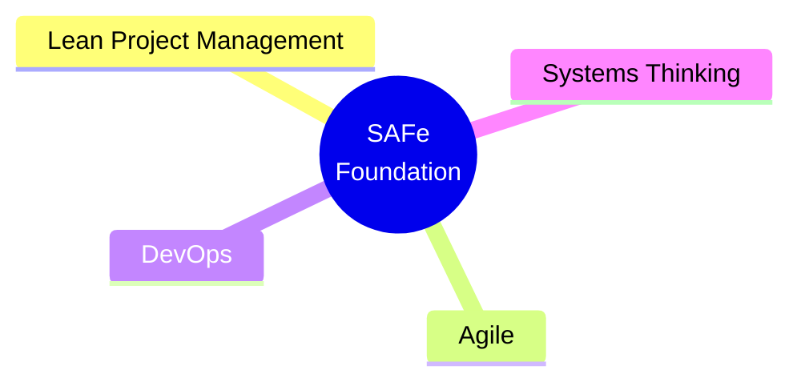

These are combined into a **single scalable model**.

---

## 11. SAFe Principles

SAFe is built on **ten core principles**:

| **#** | **Principle** | **Description** |
|---|---|---|
| **1** | **Take an Economic View** | Base decisions on Lean economics: cost of delay, lead time, and value delivery. |
| **2** | **Apply Systems Thinking** | Optimize the whole system (not just parts); include people, processes, and external systems. |
| **3** | **Assume Variability; Preserve Options** | Keep design and requirements flexible to enable better decisions later (set-based design). |
| **4** | **Build Incrementally with Fast, Integrated Learning Cycles** | Use short iterations to get feedback, reduce risk, and validate assumptions early. |
| **5** | **Base Milestones on Objective Evaluation of Working Systems** | Progress is measured by actual system increments, not documents or phase completion. |
| **6** | **Visualize and Limit WIP, Reduce Batch Sizes, Manage Queue Lengths** | Apply flow principles from Lean/queueing theory to improve speed and quality. |
| **7** | **Apply Cadence, Synchronize with Cross-Domain Planning** | Use regular, time-based cycles and align teams through PI (Program Increment) planning. |
| **8** | **Unlock the Intrinsic Motivation of Knowledge Workers** | Empower teams, reduce command-and-control, and focus on purpose and mastery. |
| **9** | **Decentralize Decision-Making** | Push decisions to the lowest responsible level to improve responsiveness. |
| **10** | **Organize Around Value** | Align teams and ARTs (Agile Release Trains) to deliver end-to-end value quickly and continuously. |

---

## 12. Key SAFe Concepts: ART and Program Increment

### 12.1 Agile Release Train (ART)

> An **Agile Release Train (ART)** is a feature of SAFe. It is a **long-term, dedicated cross-functional team** that works toward a **singular goal**.

**Characteristics:**
- Made up of **multiple Agile teams**
- Works on a **fixed schedule**
- Shares the **vision, product backlog, and roadmap** defined by SAFe

### 12.2 Program Increment (PI)

> A **Program Increment (PI)** is a **timeboxed planning and execution cycle** (usually **8–12 weeks**).

**Includes:**
- **PI Planning**
- **Iterations**
- **System Demos**
- **Inspect & Adapt workshops**

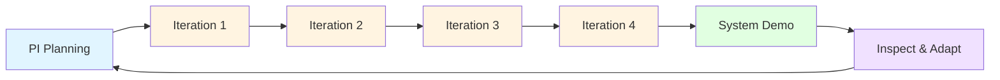

### 12.3 ART and PI Relationship

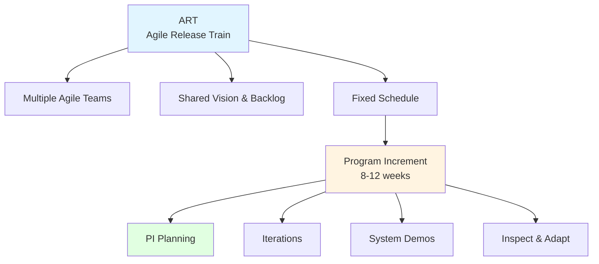

---

## 13. New Roles in SAFe

SAFe introduces **new roles** beyond Scrum:

| **Scrum Role** | **SAFe Role** | **Works Across** | **Responsibility** |
|---|---|---|---|
| Product Owner | **Product Manager** | All Product Owners | Prioritizes **Features** for the entire Agile Release Train (ART) |
| Scrum Master | **Release Train Engineer (RTE)** | All Scrum Masters | Coordinates the ART, removes cross-team impediments, facilitates PI Planning |
| Developers | **System Architect/Engineering** | All development teams | Provides overall **technical architecture** and technical guidance |
| Stakeholders | **Business Owners** | Product Managers and ART | Represent business interests, set strategic priorities, evaluate delivered business value |

### 13.1 Role Comparison Diagram

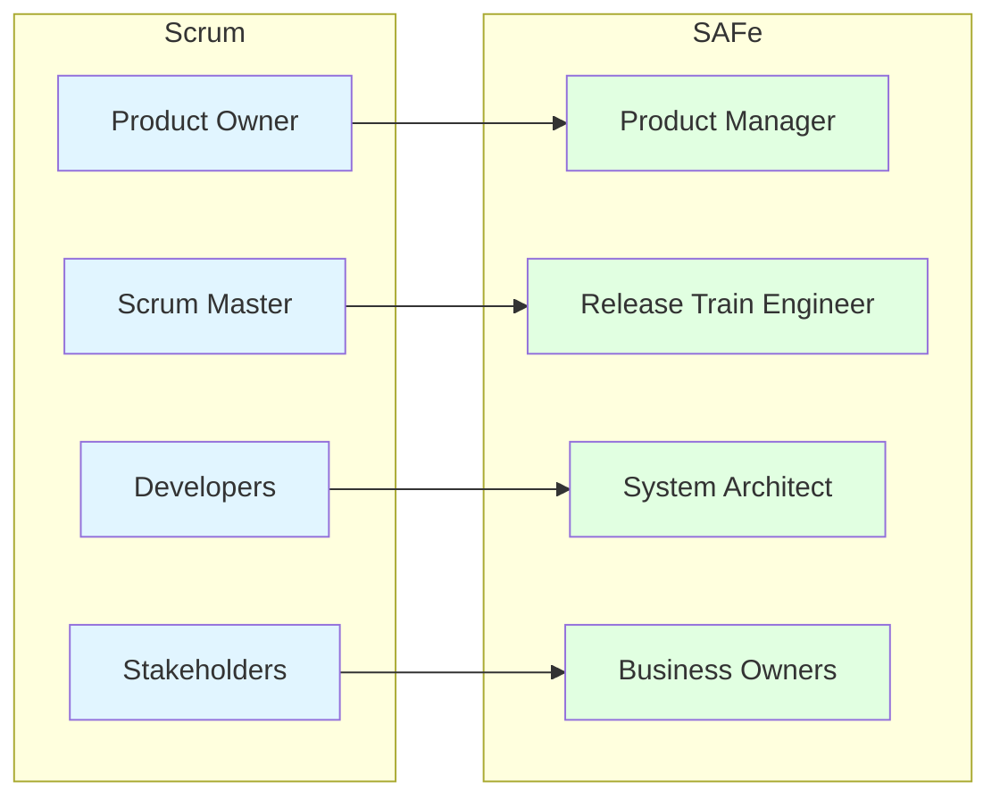

---

## 14. SAFe in Practice: Banking Transformation Example

The PDF provides a **real-world example** of a bank undergoing **Digital Transformation of Retail Banking**.

### 14.1 Multiple ARTs in the Program

| **ART Name** | **Focus Area** |
|---|---|
| **Digital Banking Experience ART** | Mobile + Web Retail App |
| **Core Banking Integration ART** | Links front-end to legacy core banking systems |
| **Compliance & Risk ART** | Regulatory features, reporting, fraud prevention |
| **Customer Insights ART** | Analytics, dashboards, AI-based recommendations |
| **DevOps Enablement ART** | CI/CD pipelines, infrastructure automation |

### 14.2 Teams Within Digital Banking ART

| **Team Name** | **Focus Area** | **Sample Responsibilities** |
|---|---|---|
| **Account Access Team** | Login, Authentication | Secure login, Face ID, 2FA |
| **Fund Transfer Team** | Payments, Transfers | IMPS, NEFT, UPI, internal transfers |
| **BillPay Team** | Utility Payments | Electricity, water, DTH bill integration |
| **Mobile UX Team** | UI/UX for mobile | UI designs, accessibility, mobile testing |
| **Notification Team** | Alerts & Messages | Transaction SMS, push notifications |
| **Help & Support Team** | In-app support | Chatbots, FAQs, ticketing integration |
| **Security Team** | Risk & Fraud | Suspicious activity detection, KYC rules |
| **Integration Team** | APIs and Core Banking | Middleware to core system, test harnesses |

### 14.3 Visual Representation

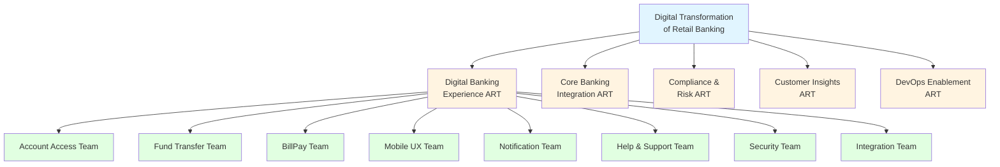

---

## 15. SAFe Configurations

> **Note:** The PDF mentions that **SAFe has 4 different configurations** (Page 22). The specific configurations are not detailed in the provided text, but standard SAFe configurations are:

| **Configuration** | **Description** |
|---|---|
| **Essential SAFe** | The foundation — ART, PI Planning, basic roles |
| **Large Solution SAFe** | For multiple ARTs working on a large solution |
| **Portfolio SAFe** | For portfolio management and strategic alignment |
| **Full SAFe** | The most comprehensive — includes all levels |

*(Note: These are standard SAFe configurations; the PDF's specific list may vary.)*

---

## 16. LeSS vs SAFe — Comparison

| **Aspect** | **LeSS** | **SAFe** |
|---|---|---|
| **Philosophy** | "Scrum applied to many teams" | Comprehensive enterprise Agile framework |
| **Complexity** | Minimal — keep it simple | Comprehensive — many roles, artifacts, ceremonies |
| **Team Size** | 2–8 teams (LeSS), 8+ (LeSS Huge) | Scales to hundreds of teams |
| **Product Owner** | One PO (LeSS), Chief PO + APOs (LeSS Huge) | Product Manager + Product Owners |
| **Planning** | Two-part Sprint Planning | PI Planning (8–12 weeks) |
| **New Roles** | Area Product Owners (LeSS Huge) | RTE, System Architect, Business Owners |
| **Best For** | Organizations wanting simple scaling | Highly regulated, complex enterprises |
| **Principles** | 10 LeSS principles | 10 SAFe principles |
| **Configurations** | LeSS, LeSS Huge | Essential, Large Solution, Portfolio, Full |

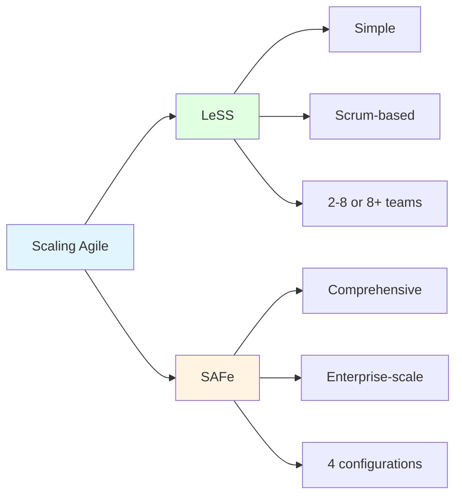

---

## 17. Advantages and Disadvantages

### 17.1 LeSS

| **Advantages** | **Disadvantages** |
|---|---|
| ✅ Simple — stays true to Scrum | ❌ Requires organizational change |
| ✅ Minimal overhead | ❌ Not suitable for very large enterprises |
| ✅ Whole-product focus | ❌ Requires disciplined teams |
| ✅ Transparency and empiricism | ❌ Coordination can be challenging |
| ✅ LeSS Huge scales to 8+ teams | ❌ Limited support for budgeting/compliance |

### 17.2 SAFe

| **Advantages** | **Disadvantages** |
|---|---|
| ✅ Comprehensive — covers all levels | ❌ Complex — heavy process overhead |
| ✅ Supports budgeting, compliance | ❌ Can be bureaucratic |
| ✅ PI Planning aligns many teams | ❌ Steep learning curve |
| ✅ New roles for enterprise scale | ❌ May dilute Agile values |
| ✅ Widely adopted in enterprises | ❌ Expensive to implement |

---

## 18. Real-World Examples and Analogies

### 18.1 Analogy: Orchestra vs. Jazz Band

- **Scrum (single team)** = **Jazz band** — small, improvisational, tight collaboration
- **LeSS** = **Chamber orchestra** — multiple sections, one conductor (PO), coordinated but flexible
- **SAFe** = **Symphony orchestra** — many sections, multiple conductors (RTE, PM), structured, scheduled

### 18.2 Real-World Use Cases

| **Company** | **Framework** | **Why** |
|---|---|---|
| **Nokia** | LeSS | Large-scale product development, simplicity |
| **BMW** | LeSS | Automotive software, cross-functional teams |
| **Spotify** | Custom (Squads/Tribes) | Inspired by LeSS/SAFe |
| **Bank of America** | SAFe | Regulated environment, compliance needs |
| **Cisco** | SAFe | Enterprise-scale, multiple ARTs |
| **Air France** | SAFe | Large-scale transformation |

---

## 19. Exam Tips

> **📝 Exam Tips — Commonly Asked Questions:**

1. **Define LeSS.** How does it differ from Scrum?
2. **What are the two LeSS frameworks?** Explain each.
3. **List and explain the 10 LeSS principles.**
4. **What is the difference between LeSS and LeSS Huge?**
5. **Explain Sprint Planning in LeSS** (two parts).
6. **What are LeSS Guides?** Give examples.
7. **What are LeSS Experiments?** How do they differ from Guides?
8. **Define SAFe.** What is it built from?
9. **List and explain the 10 SAFe principles.**
10. **What is an ART?** What is a Program Increment?
11. **What are the new roles in SAFe?** Compare with Scrum roles.
12. **Compare LeSS and SAFe.**

> **⚠️ Tricky Concepts:**
> - **LeSS is Scrum** — not a new methodology.
> - **LeSS Huge introduces Requirement Areas** — LeSS does not.
> - **LeSS Guides are recommended; Experiments are optional.**
> - **SAFe has 4 configurations** — Essential, Large Solution, Portfolio, Full.
> - **ART is a team of teams** — not a single team.
> - **PI Planning is 8–12 weeks** — not a sprint.
> - **SAFe adds roles** — RTE, System Architect, Business Owners.

---

## 20. Common Interview Questions

1. **What is LeSS? How does it scale Scrum?**
   - *Answer:* LeSS is Scrum applied to many teams working on one product, keeping Scrum principles intact.

2. **What is the difference between LeSS and LeSS Huge?**
   - *Answer:* LeSS is for 2–8 teams; LeSS Huge is for 8+ teams and introduces Requirement Areas and Area Product Owners.

3. **What is an Agile Release Train (ART)?**
   - *Answer:* A long-term, dedicated cross-functional team of teams working toward a singular goal on a fixed schedule.

4. **What is PI Planning?**
   - *Answer:* A timeboxed planning event (8–12 weeks) that aligns all teams in an ART.

5. **What are the new roles in SAFe?**
   - *Answer:* Product Manager, Release Train Engineer (RTE), System Architect, Business Owners.

6. **How does SAFe handle compliance and budgeting?**
   - *Answer:* Through Portfolio SAFe, Lean budgeting, and value stream alignment.

7. **What is the role of the Chief Product Owner in LeSS Huge?**
   - *Answer:* Manages the global Product Backlog and coordinates Area Product Owners.

8. **What are LeSS Guides? Give an example.**
   - *Answer:* Recommended practices like one Definition of Done across all teams, rotating Scrum Masters.

9. **What are LeSS Experiments? Give an example.**
   - *Answer:* Ideas to try, like eliminating Sprint Planning 1 or rotating product areas.

10. **Compare LeSS and SAFe.**
    - *Answer:* LeSS is simple and Scrum-based; SAFe is comprehensive and enterprise-focused with more roles and configurations.

---

## 21. Summary

### Key Takeaways

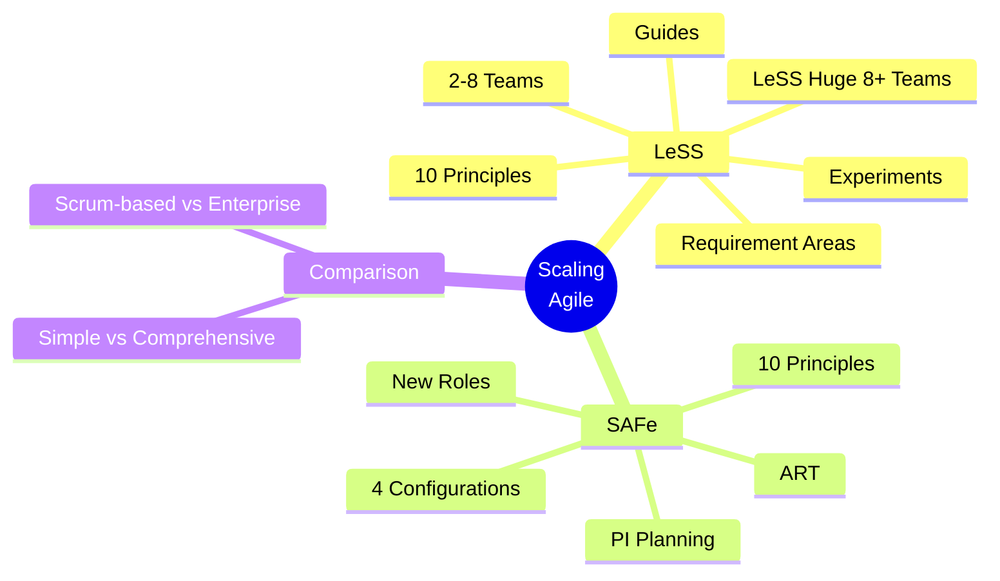

### One-Page Recap

- **Scaling Agile** = applying Agile to multiple teams.
- **LeSS** = Scrum for many teams (2–8), one PO, one backlog, one product.
- **LeSS Huge** = 8+ teams, Requirement Areas, Area Product Owners.
- **LeSS Principles (10):** Scrum is Scrum, Transparency, More with Less, Whole-Product, Customer-Centric, Continuous Improvement, Lean, Systems Thinking, Empirical Process Control, Queuing Theory.
- **LeSS Framework:** Two-part Sprint Planning, cross-functional feature teams, joint Sprint Review, Overall Retrospective.
- **LeSS Guides** = recommended practices; **LeSS Experiments** = ideas to try.
- **SAFe** = comprehensive enterprise Agile framework built on Lean, Agile, DevOps, Systems Thinking.
- **SAFe Principles (10):** Economic View, Systems Thinking, Variability, Incremental Learning, Objective Milestones, WIP Limits, Cadence, Intrinsic Motivation, Decentralized Decisions, Organize Around Value.
- **ART** = Agile Release Train; **PI** = Program Increment (8–12 weeks).
- **SAFe Roles:** Product Manager, RTE, System Architect, Business Owners.
- **SAFe Configurations:** Essential, Large Solution, Portfolio, Full.

> **Final Exam Tip:** Always connect scaling frameworks back to **core Agile/Scrum principles**. Scaling is about **applying Agile at scale without losing its essence** — whether through LeSS's simplicity or SAFe's comprehensive structure.

---

## 22. References & Further Reading

- **LeSS Official Site** — less.works
- **Scaling Lean & Agile Development** — Craig Larman, Bas Vodde
- **Large-Scale Scrum: More with LeSS** — Craig Larman, Bas Vodde
- **SAFe Official Site** — scaledagileframework.com
- **SAFe 5.0 Distilled** — Richard Knaster, Dean Leffingwell
- **Agile Estimating and Planning** — Mike Cohn
- **Scrum Guide** — Ken Schwaber & Jeff Sutherland
- **SAFe Video** — [https://youtu.be/aW2m-BtCJyE](https://youtu.be/aW2m-BtCJyE)

---

*End of Notes — Scaling Agile (LeSS, LeSS Huge, SAFe)*