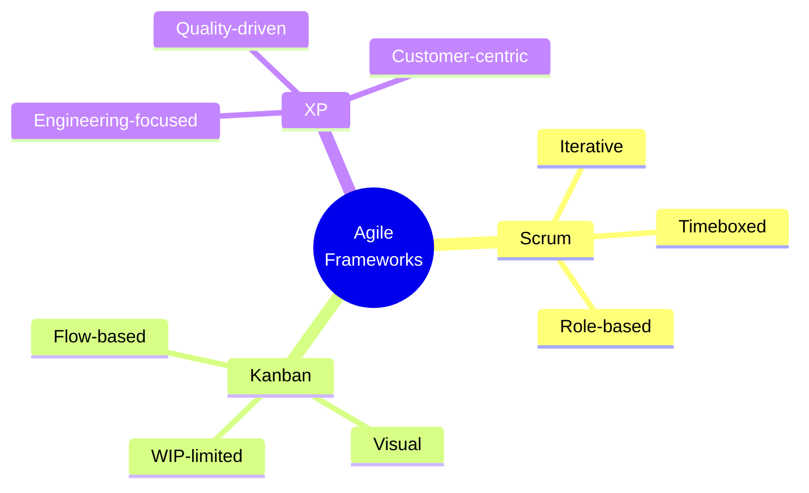
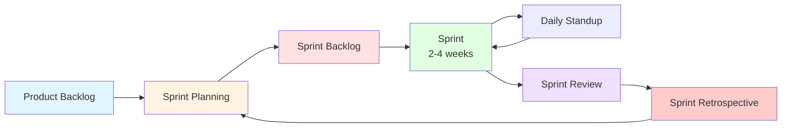
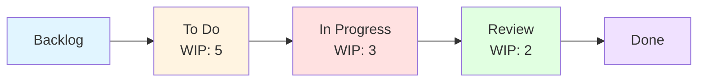
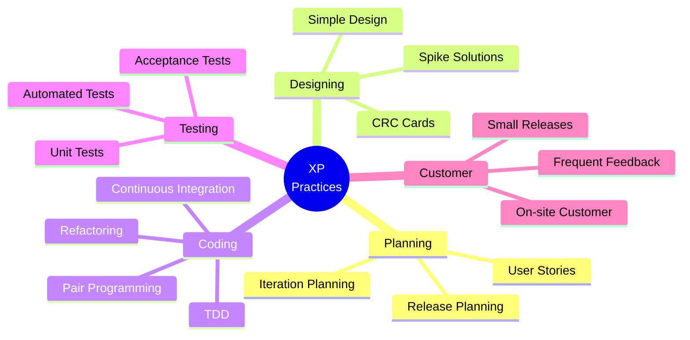
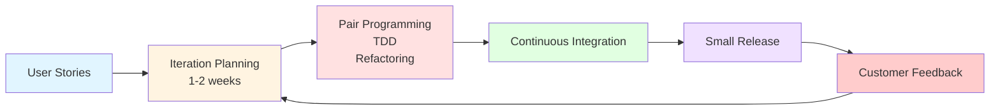
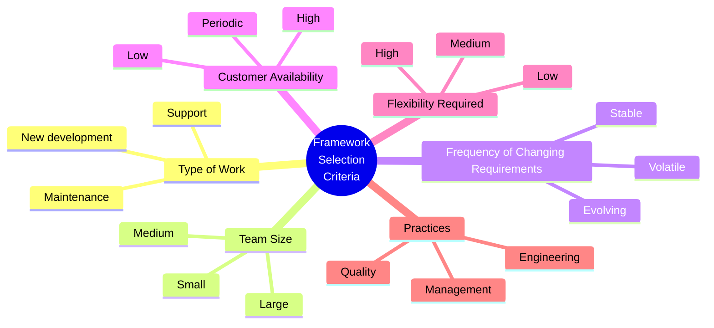
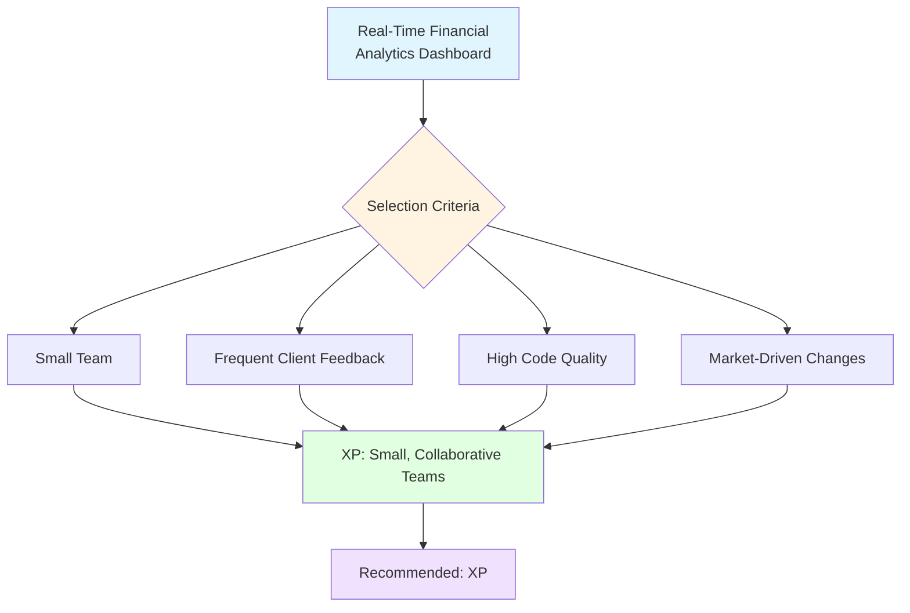
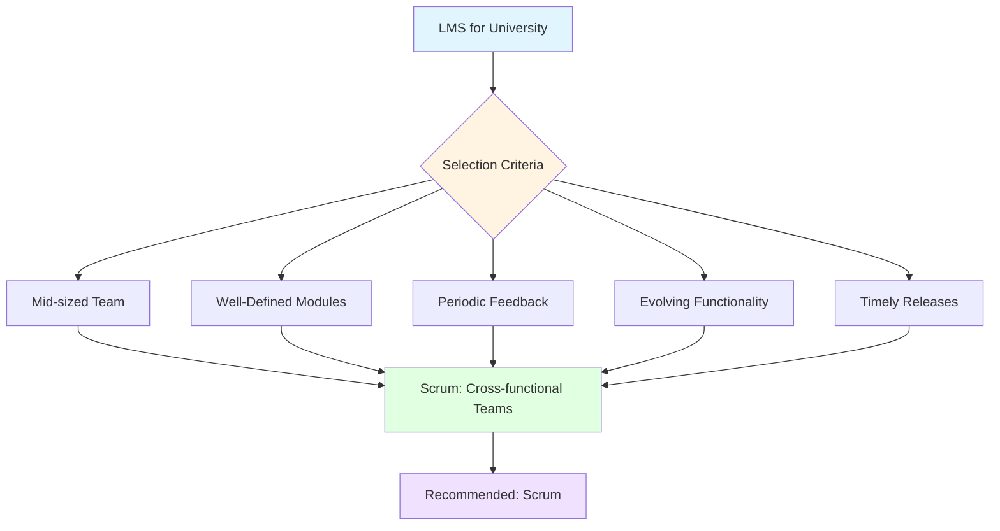
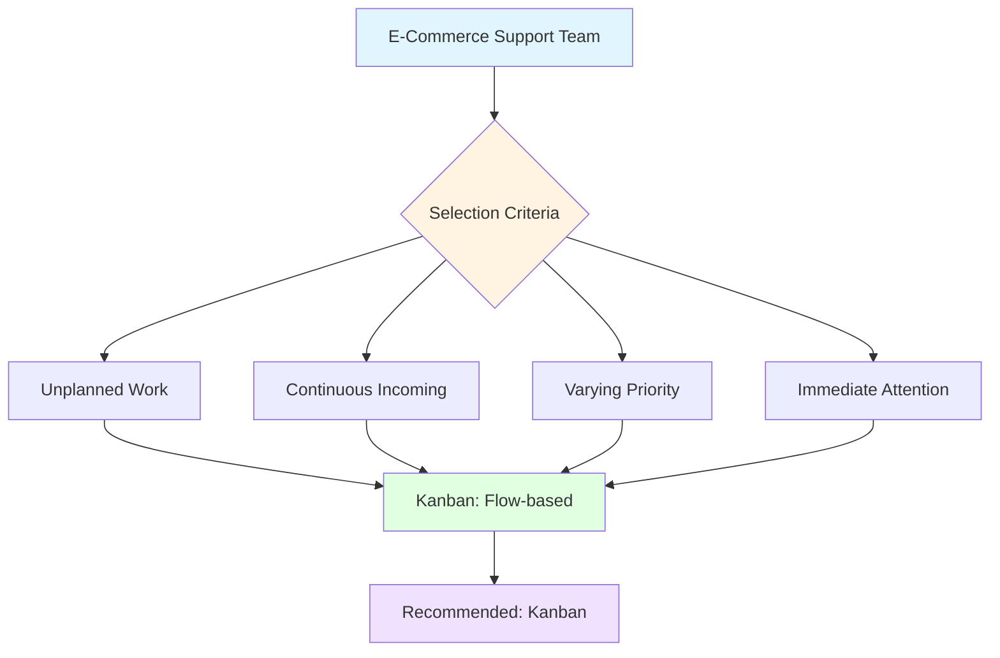
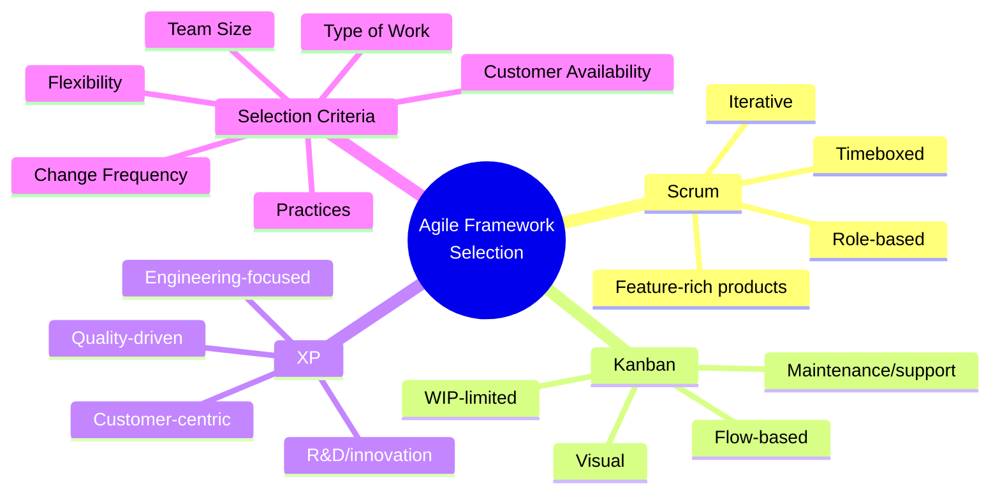

# Comparing Scrum, Kanban, and XP — Master's-Level Notes

> **Course Context:** Software Engineering (Agile Practices)
> **Topic:** Comparison of Agile Frameworks (Scrum, Kanban, XP) and Framework Selection Criteria
> **Prerequisites:** Basic understanding of Agile methodology, Scrum roles/ceremonies, Kanban boards, XP practices (TDD, Pair Programming), and software development lifecycle.

---

## 1. Introduction: Why Compare Agile Frameworks?

Agile is an **umbrella term** — it's a philosophy, not a single methodology. Underneath it sit several **frameworks**, each with different strengths:

- **Scrum** — structured, iterative, role-based
- **Kanban** — flow-based, flexible, visual
- **XP (Extreme Programming)** — engineering-focused, quality-driven

> **Key Insight:** There is **no "best" framework** — the right choice depends on the **context**: type of work, team size, requirement volatility, customer availability, and required flexibility.

---

## 2. The Three Frameworks at a Glance

### 2.1 Scrum — Overview

- **Type:** Iterative, incremental framework
- **Structure:** Fixed-length sprints (2–4 weeks)
- **Roles:** Product Owner, Scrum Master, Development Team
- **Ceremonies:** Sprint Planning, Daily Standup, Sprint Review, Retrospective
- **Artifacts:** Product Backlog, Sprint Backlog, Increment

### 2.2 Kanban — Overview

- **Type:** Flow-based, continuous delivery
- **Structure:** No fixed iterations — continuous flow
- **Roles:** Not strictly defined (optional)
- **Practices:** Visual board, WIP limits, pull system, flow metrics
- **Artifacts:** Kanban board, cards

### 2.3 XP (Extreme Programming) — Overview

- **Type:** Engineering-practice-heavy, iterative
- **Structure:** Very short iterations (1–2 weeks)
- **Roles:** Customer, Coach, Programmers, Testers, Tracker
- **Practices:** TDD, Pair Programming, Refactoring, CI, Small Releases, On-site Customer
- **Artifacts:** User stories, acceptance tests

---

## 3. Detailed Comparison Table (Master Table)

| **Criteria / Context** | **Scrum** | **Kanban** | **Extreme Programming (XP)** |
|---|---|---|---|
| **Best Suited For** | Planned development working on iterative feature delivery | Continuous flow of work, support & maintenance teams | Rapid high-quality development with frequent requirement changes, emphasis on engineering practices |
| **Change Handling Mid-Cycle** | Limited — changes discouraged during sprint | Excellent — changes can be made anytime | Excellent — short iterations + customer feedback |
| **Customer Involvement** | Regular, mostly through Product Owner | Optional, not strictly defined | High — customer is part of the team |
| **Iteration Timebox** | Fixed (usually 2–4 weeks) | No fixed timebox, continuous | Very short (1–2 weeks) |
| **Feedback Loop** | At end of sprint (demo/review) | As work progresses | Continuous — after each small delivery |
| **Work-in-Progress (WIP) Control** | Managed via Sprint Planning | Strictly controlled through WIP limits | Controlled via small stories + iteration planning |
| **Ease of Adaptation** | Medium — structure requires some discipline | High — very flexible | Low — focused on adaptability and technical excellence |
| **Team Size Suitability / Structure** | Small to medium teams / Cross-functional, self-organizing | Flexible team size / manage incoming load together | Small, highly collaborative teams |
| **Project Type Suitability** | New feature-rich products with clear sprint goals | Maintenance, support, flow-based environments | Startups, R&D, fast-changing or innovation-driven teams |
| **Learning Curve / Structure** | Moderate — requires roles and ceremonies | Easy — minimal roles/processes | Steep — requires discipline in coding practices |
| **Key Practices** | Sprint Planning, Backlog Grooming, Daily Standups, Sprint Reviews and Retrospectives, DoD | Visual Boards, WIP Limits, Continuous Delivery, Prioritization of work can be picked up early | TDD, Pair Programming, Refactoring, Customer Involvement, CI |

---

## 4. Deep Dive: Scrum

### 4.1 Key Characteristics

- **Iterative & Incremental** — work delivered in fixed-length sprints
- **Timeboxed** — sprints are 2–4 weeks (fixed duration)
- **Role-based** — PO, SM, Dev Team
- **Ceremony-driven** — planning, standup, review, retro
- **Backlog-driven** — prioritized product backlog

### 4.2 When to Choose Scrum

Scrum is highly effective for projects with:

- ✅ **Clearly defined deliverables**, yet evolving requirements
- ✅ **Well-defined product vision** with prioritized backlog
- ✅ **Client available** for sprint review
- ✅ **Possible to plan iterative delivery**

> **Scrum provides clear roles, regular planning, and continuous inspection**, making it suitable for managing a feature-rich software project. Scrum promotes **collaboration, transparency, and timely delivery**.

### 4.3 Scrum Workflow

---

## 5. Deep Dive: Kanban

### 5.1 Key Characteristics

- **Flow-based** — no fixed iterations
- **Visual** — Kanban board with columns
- **WIP-limited** — strict Work-in-Progress limits
- **Pull system** — team pulls work when capacity allows
- **Continuous delivery** — no sprint boundaries

### 5.2 When to Choose Kanban

Kanban is best suited where:

- ✅ **Requests arrive continuously and unpredictably**
- ✅ **Business priorities change frequently**
- ✅ **Require immediate attention**

> **Kanban allows the team to pull tasks based on capacity** without the rigid time-boxing of sprints. The varying volume of incoming work is effectively managed using **visual workflow**. Kanban helps **identify bottlenecks** and **improves workflow efficiency**.

### 5.3 Kanban Board Example

> **Note:** WIP limits prevent overloading. If "In Progress" is full, no new work is pulled until something moves to "Review."

---

## 6. Deep Dive: Extreme Programming (XP)

### 6.1 Key Characteristics

- **Engineering-focused** — heavy emphasis on technical practices
- **Short iterations** — 1–2 weeks
- **Customer-centric** — customer is part of the team
- **Quality-driven** — TDD, pair programming, refactoring
- **Continuous feedback** — after each small delivery

### 6.2 When to Choose XP

XP is well suited when the project expects:

- ✅ **Frequent client feedback** which can be easily adapted
- ✅ **Accommodate changing priorities** without excessive disruption
- ✅ **Customer is available** for frequent feedback and discussions

> **XP is ideal for projects requiring both technical excellence and high adaptability.** XP provides the tools to maintain code correctness while adapting frequently to client feedback.

### 6.3 Core XP Practices

### 6.4 XP Workflow

---

## 7. Criteria for Selecting an Agile Framework

When choosing an Agile methodology, consider these **six criteria**:

### 7.1 Detailed Criteria

| **Criteria** | **Description** | **Key Question** |
|---|---|---|
| **Type of Work** | Nature of the software and development activities | Is it new development, maintenance, or support? |
| **Team Size** | Whether the framework suits a small, medium, or large team | How many people are on the team? |
| **Frequency of Changing Requirements** | How often requirements or priorities change | Are requirements stable or volatile? |
| **Customer Availability** | How closely and frequently customers can interact with the team | Can the customer be on-site or available regularly? |
| **Flexibility Required** | How easily the team needs to respond to changing priorities | Does the business need rapid pivots? |
| **Practices** | Whether the framework provides practices suitable for the project's needs, particularly supporting quality and feedback | What engineering/quality practices are needed? |

---

## 8. Scenario-Based Framework Selection

The PDF presents **three scenarios** to apply the selection criteria. Let's analyze each.

### 8.1 Scenario 1: Real-Time Financial Analytics Dashboard

> **Scenario:** A **small team** working on a **real-time financial analytics dashboard** that must handle **frequent client feedback** and ensure **high code quality**.

#### Step 1: Identify Criteria

| **Criteria** | **Scenario Details** |
|---|---|
| **Type of Work** | New development, real-time analytics, high accuracy |
| **Team Size** | Small team |
| **Frequency of Changing Requirements** | Frequent changes (market-driven) |
| **Customer Availability** | Frequent client feedback required |
| **Flexibility Required** | High (market changes) |
| **Practices** | High code quality needed (TDD, pair programming) |

#### Step 2: Compare Frameworks

| **Criteria** | **Scrum** | **Kanban** | **XP** |
|---|---|---|---|
| **Type of Work** | Feature-rich products | Maintenance/support | R&D, innovation |
| **Team Size** | Small-medium | Flexible | Small |
| **Change Frequency** | Limited mid-sprint | Excellent | Excellent |
| **Customer Availability** | Through PO | Optional | High (part of team) |
| **Flexibility** | Medium | High | High |
| **Quality Practices** | DoD | Not specified | TDD, Pair Programming, CI, Refactoring |

#### Step 3: Recommendation

> **✅ Recommended: Extreme Programming (XP)**

**Reason for Choosing XP:**
- XP is ideal for projects requiring both **technical excellence** and **high adaptability**.
- In a **financial analytics system**, the stakes for **code accuracy are high**.
- Client needs may **evolve with market changes**.
- XP provides the tools to maintain **code correctness** while **adapting frequently** to client feedback.

**Key XP Practices Supporting This Project:**

| **Practice** | **How It Helps** |
|---|---|
| **Small team** | XP is designed around close collaboration among developers, customers, and stakeholders. Pair programming encourages continuous communication and knowledge sharing. |
| **Frequent client feedback** | XP promotes strong customer involvement. Requirements are represented as user stories, prioritized by customer needs, developed in short iterations. Client provides feedback frequently rather than waiting until the end. |
| **High code quality** | XP provides engineering practices specifically aimed at maintaining software quality: **TDD, Pair Programming, Continuous Integration, Refactoring**. |

---

### 8.2 Scenario 2: Learning Management System (LMS) for a University

> **Scenario:** A **mid-sized team** building a **Learning Management System (LMS)** for a university with **well-defined modules** (e.g., courses, assignments, grading). The client provides **periodic feedback** and expects **timely releases with evolving functionality**.

#### Step 1: Identify Criteria

| **Criteria** | **Scenario Details** |
|---|---|
| **Type of Work** | New development, feature-rich, well-defined modules |
| **Team Size** | Mid-sized team |
| **Frequency of Changing Requirements** | Evolving functionality |
| **Customer Availability** | Periodic feedback |
| **Flexibility Required** | Medium (well-defined modules but evolving) |
| **Practices** | Standard development practices |

#### Step 2: Compare Frameworks

| **Criteria** | **Scrum** | **Kanban** | **XP** |
|---|---|---|---|
| **Type of Work** | Feature-rich products ✅ | Maintenance/support | R&D, innovation |
| **Team Size** | Small-medium ✅ | Flexible | Small |
| **Change Frequency** | Evolving requirements ✅ | Continuous changes | Frequent changes |
| **Customer Availability** | Periodic feedback ✅ | Optional | High (on-site) |
| **Flexibility** | Medium ✅ | High | High |
| **Practices** | Standard ✅ | Minimal | Engineering-heavy |

#### Step 3: Recommendation

> **✅ Recommended: Scrum**

**Reason for Choosing Scrum:**
- Scrum is highly effective for projects with **clearly defined deliverables**, yet **evolving requirements**.
- **Well-defined product vision** with prioritized backlog.
- **Client is available** for sprint review (periodic feedback).
- It is possible to **plan iterative delivery**.

**Scrum provides:**
- Clear roles
- Regular planning
- Continuous inspection
- Collaboration, transparency, and timely delivery

---

### 8.3 Scenario 3: Customer Support Team for E-Commerce Platform

> **Scenario:** A **customer support team** managing **bug fixes and enhancement requests** for an **existing e-commerce platform**. The team deals with **unplanned, continuous incoming work of varying priority**.

#### Step 1: Identify Criteria

| **Criteria** | **Scenario Details** |
|---|---|
| **Type of Work** | Maintenance, support, bug fixes |
| **Team Size** | Flexible |
| **Frequency of Changing Requirements** | Continuous, unpredictable |
| **Customer Availability** | Not strictly defined |
| **Flexibility Required** | High (varying priorities) |
| **Practices** | Visual workflow, WIP management |

#### Step 2: Compare Frameworks

| **Criteria** | **Scrum** | **Kanban** | **XP** |
|---|---|---|---|
| **Type of Work** | New features | Maintenance/support ✅ | R&D, innovation |
| **Team Size** | Small-medium | Flexible ✅ | Small |
| **Change Frequency** | Limited mid-sprint ❌ | Excellent ✅ | Excellent |
| **Customer Availability** | Through PO | Optional ✅ | High |
| **Flexibility** | Medium ❌ | High ✅ | High |
| **Practices** | Sprint-based ❌ | Visual, WIP limits ✅ | Engineering-heavy |

#### Step 3: Recommendation

> **✅ Recommended: Kanban**

**Reason for Choosing Kanban:**
- Kanban is best suited where **requests arrive continuously and unpredictably**.
- **Business priorities change frequently** and require **immediate attention**.
- Kanban allows the team to **pull tasks based on capacity** without the rigid time-boxing of sprints.
- The **varying volume of incoming work** is effectively managed using **visual workflow**.
- Kanban helps **identify bottlenecks** and **improves workflow efficiency**.

---

## 9. Summary of Recommendations

| **Scenario** | **Recommended Framework** | **Key Reason** |
|---|---|---|
| Real-time financial analytics dashboard | **XP** | High code quality + frequent client feedback |
| LMS for university | **Scrum** | Well-defined modules + evolving functionality + periodic feedback |
| E-commerce support team | **Kanban** | Continuous, unpredictable work + varying priority |

---

## 10. Advantages and Disadvantages

### 10.1 Scrum

| **Advantages** | **Disadvantages** |
|---|---|
| ✅ Clear roles and ceremonies | ❌ Changes discouraged mid-sprint |
| ✅ Regular inspection and adaptation | ❌ Requires discipline |
| ✅ Transparency and collaboration | ❌ Can be ceremony-heavy |
| ✅ Predictable delivery cadence | ❌ Not ideal for continuous flow |

### 10.2 Kanban

| **Advantages** | **Disadvantages** |
|---|---|
| ✅ Highly flexible | ❌ No fixed cadence |
| ✅ Visual workflow | ❌ Less structure |
| ✅ WIP limits prevent overload | ❌ Requires discipline in WIP limits |
| ✅ Continuous delivery | ❌ Not ideal for feature-rich products |
| ✅ Easy to adopt | ❌ Metrics require maturity |

### 10.3 XP

| **Advantages** | **Disadvantages** |
|---|---|
| ✅ High code quality | ❌ Steep learning curve |
| ✅ Frequent customer feedback | ❌ Requires disciplined team |
| ✅ Adaptable to change | ❌ Customer must be available |
| ✅ Engineering excellence | ❌ Not ideal for large teams |
| ✅ Continuous integration | ❌ Can be intense |

---

## 11. Real-World Examples and Analogies

### 11.1 Analogy: Transportation

- **Scrum** = **Train schedule** — fixed departures, planned routes
- **Kanban** = **Taxi service** — on-demand, flexible routes
- **XP** = **Race car** — high performance, precision engineering, constant tuning

### 11.2 Real-World Use Cases

| **Company** | **Framework** | **Why** |
|---|---|---|
| **Spotify** | Scrum + Kanban (Scrumban) | Feature development + continuous flow |
| **Netflix** | Kanban + DevOps | Continuous delivery, maintenance |
| **Google** | XP + Scrum | Engineering excellence, innovation |
| **Amazon** | Kanban + Scrum | Continuous flow, feature development |
| **Startups** | XP | Fast-changing requirements, quality focus |

---

## 12. Exam Tips

> **📝 Exam Tips — Commonly Asked Questions:**

1. **Compare Scrum, Kanban, and XP** across key criteria (change handling, customer involvement, iteration timebox, WIP control).
2. **What criteria should be considered** when selecting an Agile methodology?
3. **Given a scenario, recommend** the best framework and justify.
4. **What are the key practices** of Scrum, Kanban, and XP?
5. **When is Kanban preferred** over Scrum?
6. **When is XP preferred** over Scrum?
7. **How does change handling differ** between Scrum, Kanban, and XP?
8. **What is the role of the customer** in each framework?
9. **How does WIP control differ** across the three frameworks?
10. **What is the learning curve** for each framework?

> **⚠️ Tricky Concepts:**
> - **Scrum discourages mid-sprint changes**; Kanban and XP embrace them.
> - **Kanban has no fixed timebox**; Scrum and XP do.
> - **XP requires on-site customer**; Scrum uses PO; Kanban doesn't require.
> - **Kanban is best for maintenance/support**; Scrum for feature-rich products; XP for high-quality, fast-changing projects.
> - **WIP limits are Kanban-specific**; Scrum manages WIP via sprint planning.

---

## 13. Common Interview Questions

1. **What is the difference between Scrum and Kanban?**
   - *Answer:* Scrum is timeboxed, role-based, and iterative; Kanban is flow-based, flexible, and visual with WIP limits.

2. **When would you choose XP over Scrum?**
   - *Answer:* When high code quality and frequent customer feedback are critical (e.g., financial systems, R&D).

3. **What is the role of WIP limits in Kanban?**
   - *Answer:* Prevent overload, identify bottlenecks, improve flow.

4. **How does Scrum handle changing requirements?**
   - *Answer:* Changes are discouraged mid-sprint but can be added to the backlog for future sprints.

5. **What are the key XP practices?**
   - *Answer:* TDD, Pair Programming, Refactoring, CI, Small Releases, On-site Customer.

6. **Can you combine frameworks?**
   - *Answer:* Yes — e.g., Scrumban (Scrum + Kanban), or XP practices within Scrum.

7. **What is the best framework for a maintenance team?**
   - *Answer:* Kanban — continuous flow, unpredictable work.

8. **What is the best framework for a startup with changing requirements?**
   - *Answer:* XP — high adaptability, quality focus.

9. **How do you select an Agile framework?**
   - *Answer:* Based on type of work, team size, change frequency, customer availability, flexibility, and practices.

10. **What is Scrumban?**
    - *Answer:* A hybrid of Scrum and Kanban — uses Scrum's structure with Kanban's flow and WIP limits.

---

## 14. Summary

### Key Takeaways

### One-Page Recap

- **Agile** = umbrella philosophy; **Scrum, Kanban, XP** = specific frameworks.
- **Scrum** = iterative, timeboxed, role-based; best for feature-rich products.
- **Kanban** = flow-based, visual, WIP-limited; best for maintenance/support.
- **XP** = engineering-focused, quality-driven; best for R&D/fast-changing projects.
- **Selection criteria:** Type of work, team size, change frequency, customer availability, flexibility, practices.
- **Scenario 1 (Financial dashboard):** XP — high quality + frequent feedback.
- **Scenario 2 (LMS):** Scrum — well-defined modules + evolving functionality.
- **Scenario 3 (E-commerce support):** Kanban — continuous, unpredictable work.
- **No "best" framework** — context determines choice.

> **Final Exam Tip:** Always justify your framework recommendation with **specific criteria** from the scenario. Don't just say "Scrum is good" — explain **why** it fits the type of work, team, and customer involvement.

---

## 15. References & Further Reading

- **Scrum Guide** — Ken Schwaber & Jeff Sutherland
- **Kanban: Successful Evolutionary Change** — David J. Anderson
- **Extreme Programming Explained** — Kent Beck
- **Agile Estimating and Planning** — Mike Cohn
- **Scrumban** — Corey Ladas
- **Official Docs:** Scrum.org, Agile Alliance, Scrum Alliance, Kanban University

---

*End of Notes — Comparing Scrum, Kanban, and XP*