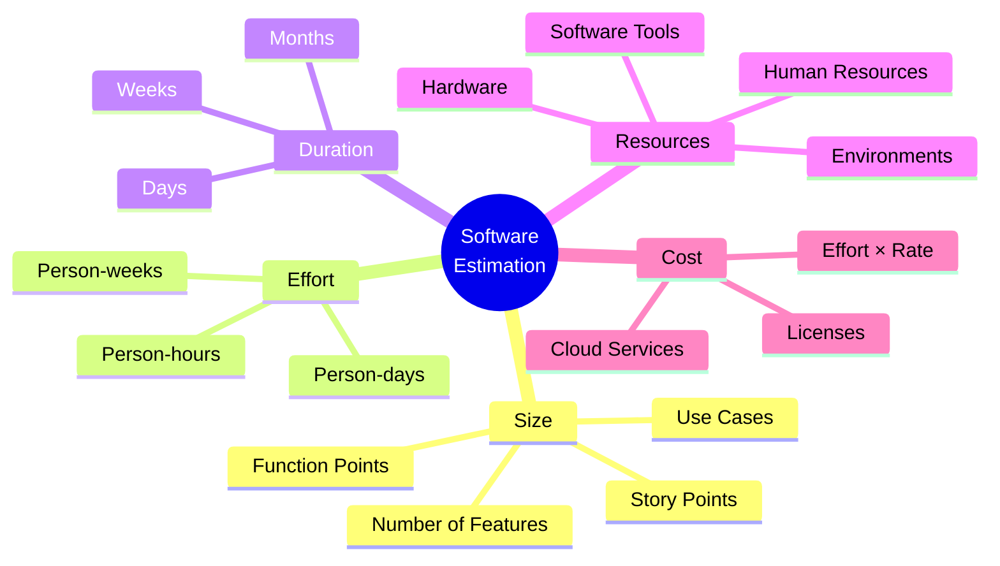
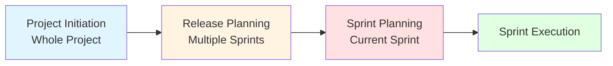
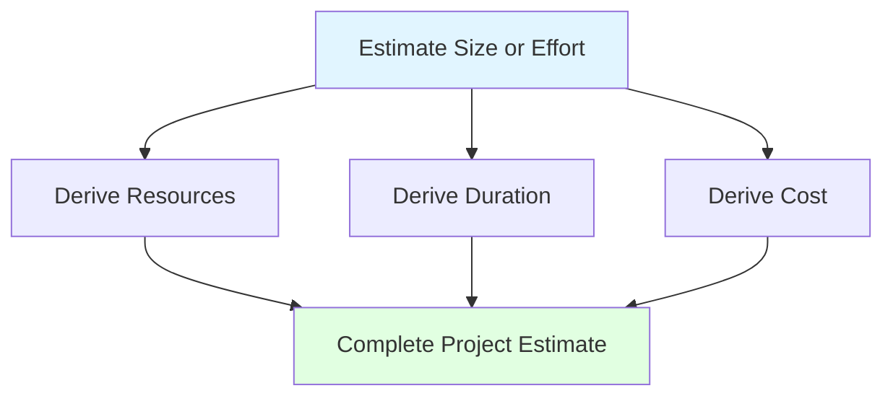
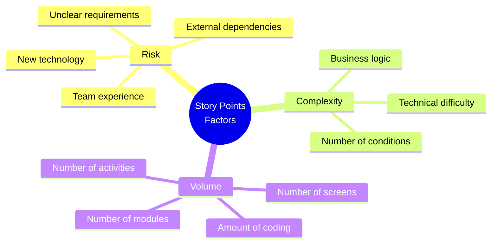
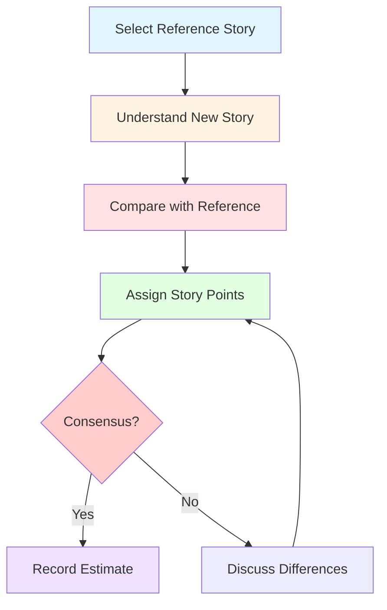
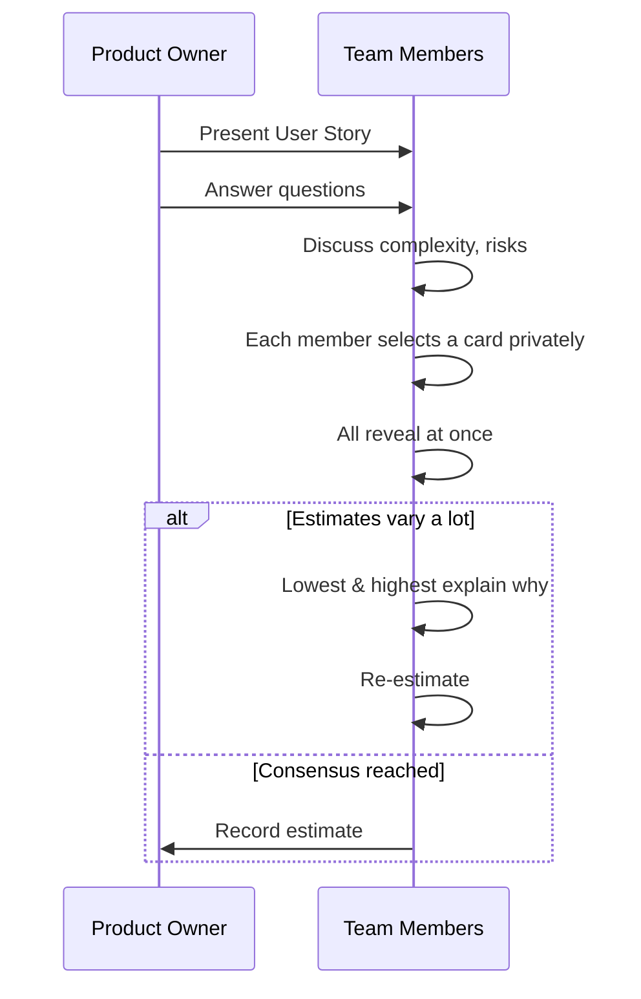
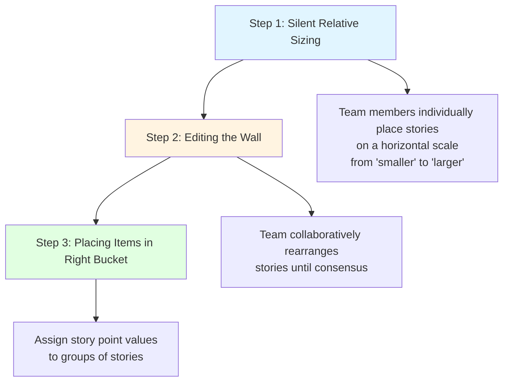
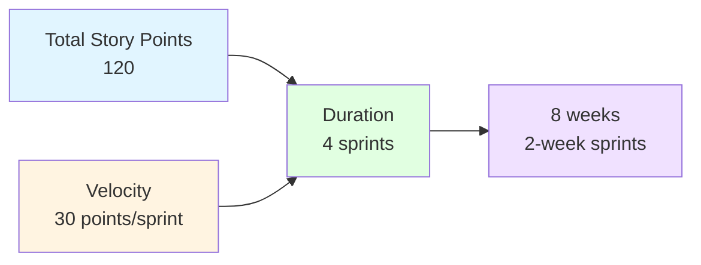
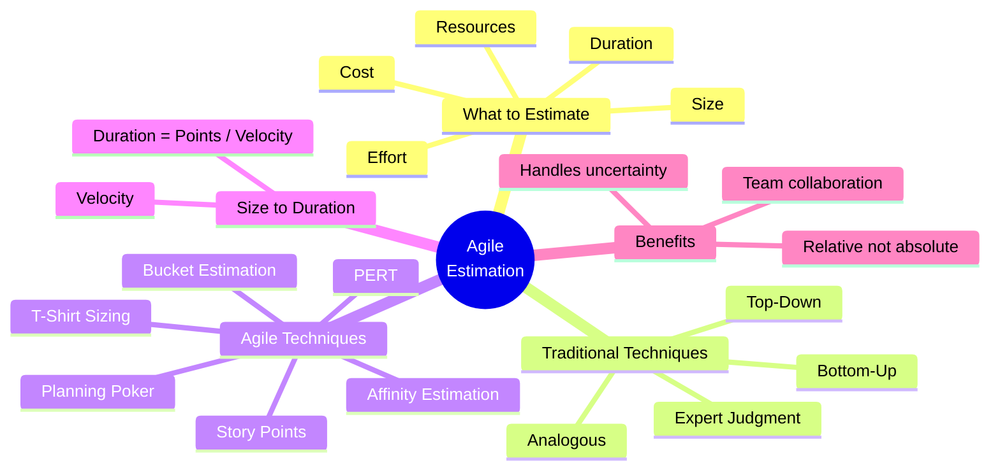

# Software Estimation in Agile — Master's-Level Notes

> **Course Context:** Software Engineering (Agile Practices)
> **Topic:** Software Estimation, Story Points, Planning Poker, Affinity Estimation, T-Shirt Sizing, PERT, and Size-to-Duration Conversion
> **Prerequisites:** Basic understanding of Agile methodology, Scrum framework (sprints, product backlog, velocity), user stories, and release planning.

---

## 1. Introduction: Why Estimation Matters

### 1.1 The Stakeholder Questions

Before any project starts, **stakeholders want answers** to:

1. **How much will it cost?**
2. **How long will it take?**
3. **How many developers are needed?**
4. **When can we deliver it?**

> **Estimation helps provide those answers.**

### 1.2 Definition

> **Software estimation** is the process of **predicting the size, effort, time, cost, and resources** required to complete a software project.

### 1.3 Why Estimation is Important

| **Stakeholder** | **Why Estimation is Needed** |
|---|---|
| **Client** | Budget approval, delivery expectations |
| **Project Managers** | Planning resources and schedules |
| **Developers** | Understanding workload |
| **Company** | Pricing the project and profitability |
| **Test Team** | Planning testing effort |
| **Management** | Monitoring project progress |

---

## 2. What Do We Estimate?

Software estimation involves **five key dimensions**:



### 2.1 Estimate — Size

> **How big is the software?**

**Measured using:**
- **Story Points** (Agile)
- **Function Points** (Traditional)
- **Number of Features**
- **Use Cases**

### 2.2 Estimate — Effort

> **How much work is required?**

**Usually measured in:**
- **Person-hours**
- **Person-days**
- **Person-weeks**

### 2.3 Estimate — Duration (Schedule)

> **How long will the project take?**

- The **total calendar time** required to complete the project.
- Takes into consideration **available resources** and **estimated effort**.
- Measured in **days / weeks / months**.

### 2.4 Estimate — Resources

> **Who / What resources are needed?**

**Resources** = People, tools, equipment, and infrastructure required to complete a project.

**May include:**
- **Human Resources** (Developers, Testers, Business Analysts)
- **Hardware and Infrastructure**
- **Software Tools and Licenses**
- **Development & Testing Environments**

### 2.5 Estimate — Cost

> **How much money is required?**

- Cost estimates the **financial investment** needed.
- Cost depends on **effort, resource rates, and other project expenses**.

**Example Calculation (from PDF):**

```
Effort = 100 person-hours
Developer Rate = ₹1,500/hour
Cloud Services = ₹20,000
Software Licenses = ₹10,000

Estimated Cost = (100 × 1,500) + 20,000 + 10,000
               = ₹1,50,000 + ₹20,000 + ₹10,000
               = ₹1,80,000
```

---

## 3. When Do We Estimate?

| **Stage** | **Purpose** | **Scope** |
|---|---|---|
| **Project Initiation** | Plan the entire project (size, cost, duration, resources) | Whole project |
| **Release Planning** | Estimate features for an upcoming release | Multiple Sprints |
| **Sprint/Iteration Planning** | Select and estimate work for the next Sprint | Current Sprint |



---

## 4. The Estimation Process

> **Key Principle:** Estimation techniques generally estimate **one primary quantity** — either **software size** or **required effort**. The remaining estimates (**resources, duration, cost**) are generally **derived** from these initial estimates.



**Example Flow:**
1. Estimate **size** (story points).
2. Determine **velocity** (points per sprint).
3. Calculate **duration** = size ÷ velocity.
4. Derive **cost** = effort × rate + other expenses.

---

## 5. Estimation Techniques — Overview

| **Technique** | **Usually Estimates** |
|---|---|
| **Story Point** | Size |
| **Planning Poker** | Size |
| **T-Shirt Sizing** | Relative Size |
| **Affinity Estimation** | Relative Size |
| **Function Points** | Size |
| **Use Case Points** | Size |
| **Expert Judgment** | Effort or Duration |
| **Analogous Estimation** | Effort or Duration |
| **Three Point (PERT)** | Effort or Duration |
| **Bottom-Up** | Effort |
| **Top-Down** | Effort |

---

## 6. Traditional Software Estimation Techniques

| **Technique** | **Basic Idea** | **Best Used When** |
|---|---|---|
| **Expert Judgment** | Experienced professionals estimate based on their knowledge and past experience. | Experienced team members are available. |
| **Analogous Estimation** | Estimate based on the effort or size of a **similar completed project**. | Similar historical projects exist. |
| **Top-Down Estimation** | Estimate the project as a whole and then **distribute** the estimate among modules or tasks. | High-level planning in the early stages. |
| **Bottom-Up Estimation** | Break the project into **smaller tasks**, estimate each task, then **add them together**. | Detailed requirements are available. |

### 6.1 Challenges of Traditional Estimation Techniques

Traditional estimation techniques often:

- ❌ **Estimate in hours or days**, which are **difficult to predict accurately**.
- ❌ **Depend heavily on individual experience** and judgment.
- ❌ **Become inaccurate when requirements change frequently**.
- ❌ **Encourage teams to commit to exact time estimates too early**.

> **Agile addresses these challenges** by using **relative estimation**, where work items are **compared with one another** instead of predicting exact time.

---

## 7. Agile Estimation Technique: Story Points

### 7.1 The Problem with Hours

**Example:**

| **Feature** | **Hours (Person A)** | **Hours (Person B)** |
|---|---|---|
| Login | 3 | 6 |
| Payment | 10 | 18 |
| AI Feature | 15 | 20 |

> **The problem with hours:** It depends on the **person estimating** it. If the person changes (beginner / professional / different domain), the estimated hours will change.

**Agile wants to estimate the work, not the person who is doing it.**

### 7.2 Relative Sizing

Instead of absolute hours, Agile uses **relative sizes**:

- **Login** → Small
- **Payment** → Larger
- **AI Feature** → Much Larger

**Assigning numbers:**

| **Feature** | **Relative Size** |
|---|---|
| Login | 1 |
| Payment | 3 |
| AI Feature | 5 |

> **This is what we do in Agile Estimation** — instead of estimating time, we **compare one user story with another** and assign a **relative size**. The numbers used to represent this relative size are called **Story Points**.

### 7.3 Example Story Point Table

| **User Story** | **Story Points** |
|---|---|
| Login | 2 |
| Registration | 3 |
| Profile | 5 |
| Payment | 8 |
| Recommendation Engine | 13 |

### 7.4 Definition of Story Points

> A **Story Point** is a **relative measure** of the **size of a user story** based on its **complexity, effort, uncertainty, and risk** — **not on the time required** to complete it.

**Key Question:**
> *"Compared to Login, how much bigger is Payment?"*

### 7.5 Story Point Scale

Agile teams use a **numerical scale** to represent relative size.

**Most commonly used scale — Fibonacci sequence:**
```
1, 2, 3, 5, 8, 13, 21, ...
```

**Why not linear (1, 2, 3, 4, 5...)?**
- It's **hard for humans to distinguish** between a 9-point and a 10-point task.
- **Gaps between numbers get wider** as tasks get bigger.
- This reflects the **increasing uncertainty and complexity** of larger work items.

**Common Scales:**

| **Scale** | **Values** |
|---|---|
| **Fibonacci** | 1, 2, 3, 5, 8, 13, 21 |
| **Modified Fibonacci** | 0, 1, 2, 3, 5, 8, 13 |
| **T-shirt Sizing** | XS, S, M, L, XL |

### 7.6 Story Point Values and Examples

| **Point Value** | **Meaning** | **Example Task** |
|---|---|---|
| **1 Point** | Tiny trivial task. No risk. | Changing a text label on a webpage. |
| **2 Points** | Small, well-understood task. | Creating a simple login form validation. |
| **3 Points** | Medium task with standard complexity. | Building a new user profile page. |
| **5 Points** | Large task with some unknowns. | Integrating a basic third-party payment API. |
| **8 Points** | Very large complex task. | Overhauling the entire database schema. |
| **13+ Points** | Too big. Needs to be broken down. | Building a complete reporting dashboard from scratch. |

### 7.7 Three Factors Affecting Story Points

The Story Points method accounts for **three factors**:



| **Factor** | **Description** | **Includes** |
|---|---|---|
| **Risk** | How much is unknown? | New technology, unclear requirements, external systems/dependencies, team's earlier experience |
| **Complexity** | How difficult is the work? | Technical difficulty, business logic complexity, number of conditions |
| **Volume** | How much work needs to be done? | Number of screens, modules, amount of coding, number of activities |

> **Important:** Story points are **relative** — meaning their **relative value and ratios** to each other are what matter, **not their actual numerical value**.

### 7.8 Steps in Story Point Estimation

1. **Select a Reference Story (Baseline)** — other stories are compared against this.
2. **Understand the User Story**.
3. **The team compares** the new story with the reference story:
   - Is this story more or less complex?
   - Does it require more or fewer activities?
   - Are there more unknowns?
4. **As a team**, collectively assign story points to the user story.
5. **Discuss** if there are differences in opinions.



---

## 8. Agile Estimation Technique: Planning Poker

### 8.1 Definition

> **Planning Poker** is a **consensus-based technique** used by Agile teams to estimate the effort or size of user stories using a **deck of cards** — each card shows a number representing the size estimate.

**Card Values (Fibonacci sequence):**
```
0, 1, 2, 3, 5, 8, 13, 20, 40, 100, ? (uncertain), ∞ (too big)
```

### 8.2 Steps Involved



1. **Present the User Story:** The Product Owner explains the user story and answers team questions.
2. **Discuss:** The team briefly discusses complexity, risks, and what's involved.
3. **Each Member Selects a Card:** Privately, everyone selects a card that reflects their estimate.
4. **All Reveal at Once:** Everyone reveals their chosen card at the same time.
5. **Discuss Differences:** If estimates vary a lot, the **lowest and highest estimators explain why**.
6. **Re-estimate:** After discussion, another round of voting is done until **consensus is reached**.

### 8.3 Why Planning Poker Works

- **Prevents anchoring bias** — everyone estimates independently first.
- **Encourages collaborative discussion**.
- **Leverages collective intelligence**.
- **Builds team consensus**.

---

## 9. Affinity Estimation

### 9.1 Definition

> **Affinity Estimation** is a technique used by Agile teams who want to estimate a **large number of user stories** in story points in a **faster and easier way**.

**Best For:**
- Projects that have **just started**.
- A backlog that has **not been estimated**.
- Preparation for **release planning**.

### 9.2 Three Steps of Affinity Estimation



### Step 1: Silent Relative Sizing

- Done on a **horizontal scale**.
- The two extreme sides are marked **"smaller"** and **"larger"**.
- Every team member is provided a **subset of backlog items** by the Product Owner.
- **Without any discussion or consultation** with other team members, every team member estimates their story individually.
- Places it in **increasing order** on the wall/scale based on their individual estimation.

### Step 2: Editing the Wall

- The **collaborative process** where team members **rearrange user stories** on a wall or board based on their **relative size** until **consensus is reached**.

### Step 3: Placing Items in the Right Bucket

- Once the ordering is finalized, the team **assigns story point values** (e.g., 1, 2, 3, 5, 8, 13) to the **groups of stories**.

---

## 10. Agile Estimation Technique: Buckets

### 10.1 Definition

> **Bucket Estimation** (also called **Bucket Theory**) involves grouping user stories into **predefined buckets**, each representing a **story point value**.

### 10.2 Example (from PDF)

| **Bucket (Story Points)** | **User Stories** |
|---|---|
| **0** | Splash screen |
| **1** | Login using 4-digit password, Log out, Auto logout |
| **5** | Sync Down, Select option |
| **8** | Search catalogue |
| **50** | Admin sign in with 4-digit PIN, Admin sign in username |
| **70** | Admin sign out |
| **100** | Admin view list of all flavours, Admin move the store locations, Admin add a store location bakery, Admin active flavour, Admin deactivate store location, Admin using username |
| **200** | Search catalogue, Admin sign out, Admin sign in username |

> **Note:** The PDF image shows a visual representation of the **Bucket Theory** with columns labeled 0, 1, 5, 8, 50, 70, 100, 200, and user stories placed in each bucket.

### 10.3 How It Works

1. **Define buckets** (e.g., 0, 1, 5, 8, 50, 70, 100, 200).
2. **Place user stories** into the appropriate bucket based on relative size.
3. **Each bucket represents** a story point value.
4. **Faster than individual estimation** for large backlogs.

---

## 11. Agile Estimation Technique: T-Shirt Sizing

### 11.1 Definition

> **T-shirt sizing** is a **relative estimation technique** used in Agile projects to estimate the **effort, complexity, or size** of work items using **easy-to-understand size labels** — similar to clothing sizes.

### 11.2 Typical Sizes

```
XS (Extra Small)
S  (Small)
M  (Medium)
L  (Large)
XL (Extra Large)
```

### 11.3 Visual Representation (from PDF)

The PDF shows a visual with four columns:

| **Small** | **Medium** | **Large** | **Extra Large** |
|---|---|---|---|
| Stories: 1, 1, 1, 2, 3, 3, 5 | Stories: 5, 8, 5, 8, 5 | Stories: 13, 13, 20, 13, L | Stories: 40, 40, 100, 13, XL |

> **Note:** The image shows t-shirt sizes with corresponding story point values (1, 2, 3, 5, 8, 13, 20, 40, 100) placed under each size category.

### 11.4 When to Use T-Shirt Sizing

- **Early estimation** when detailed information is lacking.
- **Quick sizing** for large backlogs.
- **Non-technical stakeholders** can understand easily.
- **Roadmap planning** at a high level.

---

## 12. Three-Point (PERT) Estimation

### 12.1 Definition

> **Three-Point Estimation** (also called **PERT** — Program Evaluation and Review Technique) is a technique used when a user story is **highly uncertain**.

**Note:** This technique is **not an Agile-native technique** like Planning Poker or Story Points. It is a **traditional technique** that is still useful in Agile.

### 12.2 Three Values Required

For each activity, create three estimates:

| **Estimate** | **Symbol** | **Description** |
|---|---|---|
| **Optimistic** | O | Best-case scenario (everything goes well) |
| **Most Likely** | M | Most realistic scenario |
| **Pessimistic** | P | Worst-case scenario (everything goes wrong) |

### 12.3 Calculation Methods

**Method 1: Triangular Average**
```
E = (O + M + P) / 3
```
Weights each input **equally**.

**Example:**
```
O = 2 story points
M = 3 story points
P = 4 story points

E = (2 + 3 + 4) / 3 = 9 / 3 = 3 story points
```

**Method 2: PERT (Beta Distribution)**
```
E = (O + 4M + P) / 6
```
**Biases towards the most likely scenario.**

**Example:**
```
O = 2, M = 3, P = 4

E = (2 + 4×3 + 4) / 6 = (2 + 12 + 4) / 6 = 18 / 6 = 3 story points
```

### 12.4 Comparison

| **Method** | **Formula** | **Weighting** |
|---|---|---|
| **Triangular Average** | E = (O + M + P) / 3 | Equal weights |
| **PERT (Beta)** | E = (O + 4M + P) / 6 | Biased toward most likely |

```mermaid
flowchart LR
    A[O = 2] --> D[Triangular: (2+3+4)/3 = 3]
    B[M = 3] --> D
    C[P = 4] --> D
    
    A --> E[PERT: (2+12+4)/6 = 3]
    B --> E
    C --> E
    
    style D fill:#e1f5ff
    style E fill:#e1ffe1
```

---

## 13. Size to Duration in Agile

### 13.1 The Bridge: Velocity

> **Velocity** bridges the gap between **abstract story points** and **real-world project timelines**.

**Steps:**

1. Agile teams **estimate the size** (in story points).
2. Check the team's **historical data** to see how many points they can finish in a set timeframe.
3. This is called **velocity**.

### 13.2 Formula

```
Duration (in sprints) = Total Story Points ÷ Velocity
```

### 13.3 Example

```
Total feature backlog = 120 story points
Team velocity = 30 points per sprint

Duration = 120 ÷ 30 = 4 sprints

If sprints are 2 weeks long:
Duration = 4 × 2 = 8 weeks
```

### 13.4 Visual Representation



---

## 14. Comparison of Agile Estimation Techniques

| **Technique** | **Type** | **Speed** | **Accuracy** | **Best For** |
|---|---|---|---|---|
| **Story Points** | Relative | Medium | High | General Agile estimation |
| **Planning Poker** | Consensus | Slow | Very High | Team alignment, important stories |
| **Affinity Estimation** | Relative | Fast | Medium | Large backlogs, early projects |
| **Bucket Estimation** | Relative | Fast | Medium | Quick categorization |
| **T-Shirt Sizing** | Relative | Very Fast | Low-Medium | Early estimation, non-technical stakeholders |
| **PERT (Three-Point)** | Absolute | Medium | High | High-uncertainty stories |

---

## 15. Advantages and Disadvantages

### 15.1 Story Points

| **Advantages** | **Disadvantages** |
|---|---|
| ✅ Relative, not time-dependent | ❌ Abstract — hard for stakeholders |
| ✅ Accounts for complexity, risk, volume | ❌ Team-specific — not comparable across teams |
| ✅ Encourages team discussion | ❌ Can be misunderstood as time |
| ✅ Stable over time | ❌ Requires baseline story |

### 15.2 Planning Poker

| **Advantages** | **Disadvantages** |
|---|---|
| ✅ Consensus-based | ❌ Time-consuming |
| ✅ Prevents anchoring bias | ❌ Requires full team presence |
| ✅ Encourages discussion | ❌ Can be dominated by vocal members |
| ✅ Fun and engaging | ❌ Not ideal for very large backlogs |

### 15.3 Affinity Estimation

| **Advantages** | **Disadvantages** |
|---|---|
| ✅ Fast for large backlogs | ❌ Less precise |
| ✅ Collaborative | ❌ Requires physical/virtual wall |
| ✅ Silent first round reduces bias | ❌ Can be chaotic |

### 15.4 T-Shirt Sizing

| **Advantages** | **Disadvantages** |
|---|---|
| ✅ Very easy to understand | ❌ Less precise |
| ✅ Fast | ❌ Not suitable for sprint planning |
| ✅ Good for roadmaps | ❌ No numerical value for velocity |

### 15.5 PERT

| **Advantages** | **Disadvantages** |
|---|---|
| ✅ Accounts for uncertainty | ❌ Requires three estimates |
| ✅ More realistic | ❌ Not Agile-native |
| ✅ Good for high-risk stories | ❌ Can be time-consuming |

---

## 16. Real-World Examples and Analogies

### 16.1 Analogy: Moving Houses

- **Story Points** = How big is the move? (Studio apartment = 1 point, 4-bedroom house = 13 points)
- **Velocity** = How many boxes can you move per day?
- **Duration** = Total boxes ÷ Boxes per day
- **Planning Poker** = Family members independently estimate move size, then discuss
- **T-Shirt Sizing** = Small move, Medium move, Large move

### 16.2 Real-World Use Cases

| **Company** | **Estimation Approach** | **Result** |
|---|---|---|
| **Spotify** | Story Points + Planning Poker | Consistent sprint planning |
| **SAFe Enterprises** | PI Planning with story points | Quarterly release trains |
| **Startups** | T-Shirt Sizing | Fast roadmap planning |
| **Google** | Hybrid (story points + PERT) | High-uncertainty projects |

---

## 17. Exam Tips

> **📝 Exam Tips — Commonly Asked Questions:**

1. **Define software estimation.** What are the five things we estimate?
2. **Why is estimation important?** Who benefits and how?
3. **What is a Story Point?** How does it differ from hours?
4. **Explain the Fibonacci scale.** Why not linear numbering?
5. **What are the three factors affecting story points?** (Risk, Complexity, Volume)
6. **Describe Planning Poker.** What are its steps?
7. **What is Affinity Estimation?** Explain its three steps.
8. **What is T-Shirt Sizing?** When is it used?
9. **Explain Three-Point (PERT) Estimation.** Give both formulas.
10. **How do you convert size to duration?** (Velocity formula)
11. **Compare traditional vs Agile estimation techniques.**
12. **What are the challenges of traditional estimation?**

> **⚠️ Tricky Concepts:**
> - **Story Points are relative**, not absolute time.
> - **Velocity** is team-specific and varies over time.
> - **Planning Poker** uses **consensus**, not averages.
> - **PERT** is **not Agile-native** — it's a traditional technique.
> - **T-Shirt Sizing** is for **early estimation**, not sprint planning.
> - **Affinity Estimation** is for **large backlogs**, not individual stories.
> - **Fibonacci scale** reflects **increasing uncertainty** for larger items.

---

## 18. Common Interview Questions

1. **What is the difference between story points and hours?**
   - *Answer:* Story points measure relative size (complexity, risk, volume); hours measure absolute time (person-dependent).

2. **Why do Agile teams use Fibonacci numbers?**
   - *Answer:* Reflects increasing uncertainty; humans can't distinguish 9 vs 10 points reliably.

3. **How do you estimate a story that's too big?**
   - *Answer:* Break it down into smaller stories (13+ points = needs splitting).

4. **What is velocity? How is it used?**
   - *Answer:* Average story points completed per sprint; used to forecast duration.

5. **What is Planning Poker?**
   - *Answer:* Consensus-based estimation using cards with Fibonacci values.

6. **How do you handle estimation disagreements?**
   - *Answer:* Discuss differences, lowest and highest explain reasoning, re-vote until consensus.

7. **What is Affinity Estimation?**
   - *Answer:* Fast relative estimation for large backlogs using silent sizing, wall editing, and bucketing.

8. **When would you use PERT?**
   - *Answer:* For highly uncertain stories where three-point estimation adds value.

9. **What is the formula for PERT?**
   - *Answer:* E = (O + 4M + P) / 6 (Beta) or E = (O + M + P) / 3 (Triangular).

10. **How do you convert story points to duration?**
    - *Answer:* Duration = Total Story Points ÷ Velocity.

---

## 19. Summary

### Key Takeaways



### One-Page Recap

- **Estimation** = predicting size, effort, time, cost, resources.
- **Five estimates:** Size, Effort, Duration, Resources, Cost.
- **When:** Project Initiation, Release Planning, Sprint Planning.
- **Traditional techniques:** Expert Judgment, Analogous, Top-Down, Bottom-Up.
- **Challenges:** Hours are person-dependent, inaccurate with change.
- **Agile solution:** Relative estimation using **Story Points**.
- **Story Points** = relative measure of complexity, effort, uncertainty, risk.
- **Fibonacci scale:** 1, 2, 3, 5, 8, 13, 21...
- **Three factors:** Risk, Complexity, Volume.
- **Planning Poker:** Consensus-based card estimation.
- **Affinity Estimation:** Silent sizing → wall editing → bucketing.
- **T-Shirt Sizing:** XS, S, M, L, XL for early estimation.
- **PERT:** Three-point estimation — (O + M + P)/3 or (O + 4M + P)/6.
- **Size to Duration:** Duration = Total Story Points ÷ Velocity.

> **Final Exam Tip:** Always connect estimation back to **Agile principles** — relative sizing, team collaboration, and embracing uncertainty. Estimation is a **team activity**, not an individual one.

---

## 20. References & Further Reading

- **Agile Estimating and Planning** — Mike Cohn
- **User Stories Applied** — Mike Cohn
- **Scrum Guide** — Ken Schwaber & Jeff Sutherland
- **Planning Poker** — Mountain Goat Software
- **SAFe Framework** — Scaled Agile, Inc.
- **PERT** — Project Management Institute (PMI)
- **Official Docs:** Scrum.org, Agile Alliance, Scrum Alliance

---

*End of Notes — Software Estimation in Agile*