# Agile Release Planning — Master's-Level Notes

> **Course Context:** Software Engineering (Agile Practices)
> **Topic:** Agile Release Planning, Estimation, Prioritization, and Release Management
> **Prerequisites:** Basic understanding of Agile methodology, Scrum framework (sprints, product backlog, velocity), user stories, and story points. Familiarity with the Product Owner and Scrum Master roles is helpful.

---

## 1. Introduction to Agile Release Planning

### 1.1 Definition

> **Agile Release Planning** is the process of **mapping out how and when features (or functionality) will be released and delivered to users** in a **frequent, iterative, and low-risk way**.

It acts as a **project's map**, providing **context and direction** on:
- Product goals
- Vision
- Expectations

### 1.2 Contrast with Traditional Release Management

| **Aspect** | **Traditional Release Management** | **Agile Release Planning** |
|---|---|---|
| **Release Frequency** | Large, infrequent releases | Frequent, iterative releases |
| **Planning Style** | Upfront, detailed | Adaptive, rolling-wave |
| **Risk** | Higher (big bang releases) | Lower (small, incremental) |
| **Feedback** | Late | Continuous |
| **Flexibility** | Rigid | Flexible to change |

### 1.3 The Foundation Principle

> *"The foundation of a successful project is a well-laid plan."*

An Agile release plan is **not a rigid contract** — it's a **living document** that evolves with customer feedback and actual team velocity.

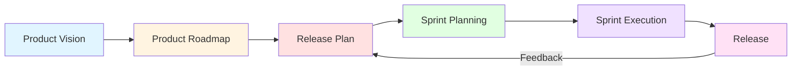

---

## 2. Purpose and Scope of Release Planning

### 2.1 Purpose

| **Purpose** | **Description** |
|---|---|
| **Align Delivery with Business Goals** | Ensures product delivery matches business objectives and stakeholder expectations |
| **Define Features and Timing** | Specifies what features will be delivered and when across one or more sprints |
| **Provide High-Level Plan** | Supports product roadmaps and customer commitments |

### 2.2 Scope

| **Scope Element** | **Description** |
|---|---|
| **Multiple Sprints** | Encompasses multiple sprints (unlike sprint planning which focuses on one) |
| **Feature Delivery Over Time** | Focuses on feature delivery, not task-level details |
| **Time Horizon** | Answers: *What is feasible to release in the next 2–6 months?* |

> **Key Distinction:** Release planning is **strategic and tactical** (weeks to months), while sprint planning is **operational** (days to weeks).

---

## 3. Release Planning vs Sprint Planning

| **Aspect** | **Release Planning** | **Sprint Planning** |
|---|---|---|
| **Focus** | Long-term feature delivery goals | Short-term goals (next sprint) |
| **Time Horizon** | Typically 1–3 months (or multiple sprints) | 1–4 weeks (duration of one sprint) |
| **Output** | A release plan with prioritized features | A sprint backlog with tasks |
| **Based On** | Vision, roadmap, backlog prioritization | Sprint goal and team's velocity |
| **Attendees** | Product Owner, Scrum Master, Team, Stakeholders | Scrum Team (Product Owner + Dev Team) |
| **Frequency** | Quarterly or per release cycle | Every sprint |
| **Level of Detail** | High-level features | Task-level details |

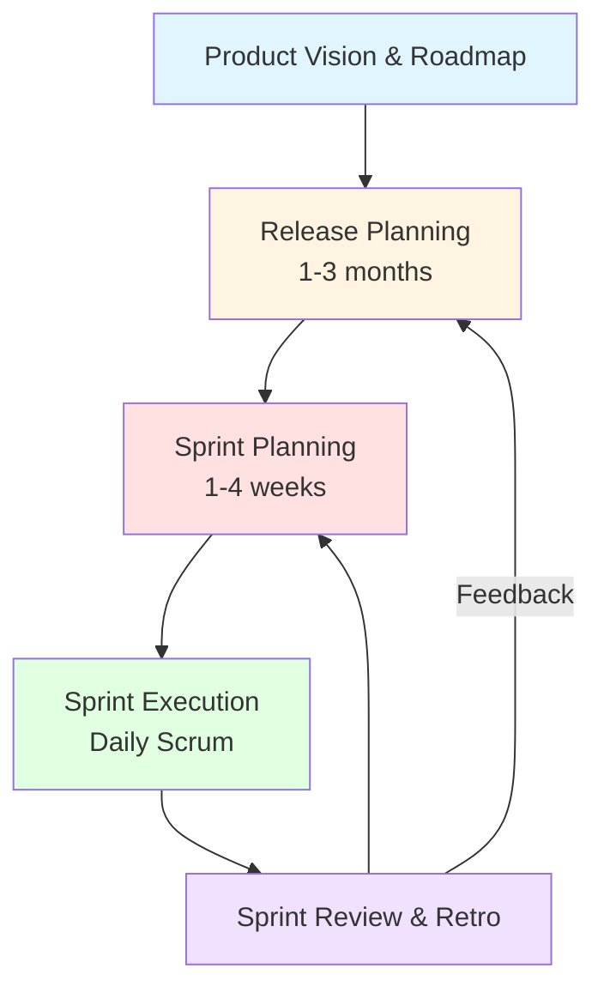

---

## 4. Inputs to Release Planning

Release planning requires **three critical inputs**:

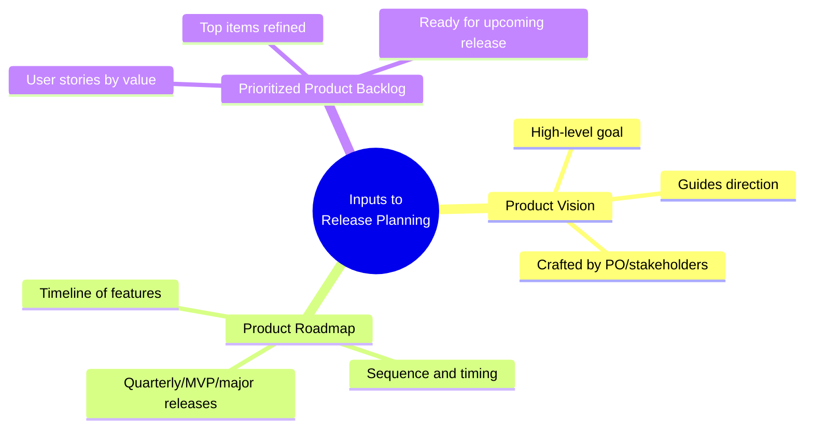

### 4.1 Product Vision

> The **high-level goal** of the product or its next version.

**Characteristics:**
- Guides the **overall direction** of the release.
- Usually crafted by the **Product Owner** or **stakeholders**.
- Answers: *Why are we building this? What problem does it solve?*

**Example Vision Statement:**
> "To become the most user-friendly project management tool for remote teams, enabling seamless collaboration regardless of time zones."

### 4.2 Product Roadmap

> A **timeline of planned features or milestones**.

**Characteristics:**
- Gives **sequence and timing** for delivering capabilities.
- May show:
  - **Quarterly plans** (Q1, Q2, Q3, Q4)
  - **MVP versions** (MVP, v1.0, v2.0)
  - **Major releases** (Release 1, Release 2)

**Example Roadmap:**

| **Quarter** | **Theme** | **Key Features** |
|---|---|---|
| Q1 | Foundation | User authentication, basic CRUD |
| Q2 | Collaboration | Real-time editing, comments |
| Q3 | Analytics | Dashboards, reports |
| Q4 | Mobile | iOS/Android apps |

### 4.3 Prioritized Product Backlog

> **User stories/features prioritized by value and urgency**.

**Characteristics:**
- Items at the **top are more refined** and likely to be included in the upcoming release.
- Prioritization methods include:
  - **MoSCoW** (Must, Should, Could, Won't)
  - **WSJF** (Weighted Shortest Job First)
  - **Kano Model**
  - **Value vs. Effort Matrix**

---

## 5. MoSCoW Prioritization Method

### 5.1 Overview

> The **MoSCoW method** segments features based on **Must-haves, Should-haves, Could-haves, and Won't-haves**.

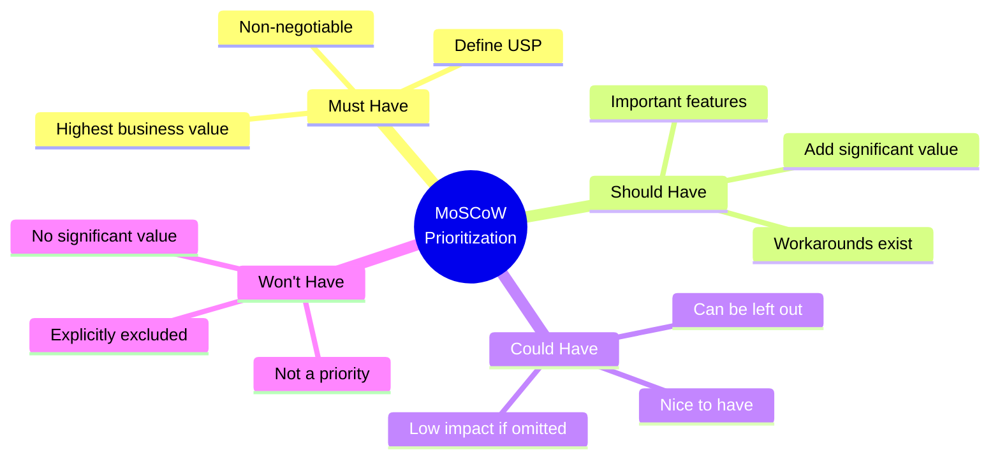

### 5.2 Detailed Breakdown

| **Category** | **Description** | **Example** |
|---|---|---|
| **Must Have (Mo)** | Features with the **highest business value** that define your **USP (Unique Selling Proposition)**. Non-negotiable for release. | User login, payment processing |
| **Should Have (S)** | **Important features** that can add **significant value**. Workarounds may exist but are painful. | Password reset, email notifications |
| **Could Have (Co)** | **Nice to have** features but can be **left out** if needed. Low impact if omitted. | Dark mode, social sharing |
| **Won't Have (W)** | Features that are **not a priority** and add **no significant value**. Explicitly excluded from this release. | Voice commands, VR support |

### 5.3 MVP Development with MoSCoW

> The **BA (Business Analyst)** assembles the requirements as **'must-haves'** to the backlog and sections them as the requirements for **MVP Development**.

- The **MVP backlog** might also contain a few items from the **'should haves'** list.
- This ensures the product is **sufficiently competitive** in the market.

**MVP Formula:**
```
MVP = All Must-Haves + Selected Should-Haves
```

> **Exam Tip:** A common question is *"How is MoSCoW used in release planning?"* — Answer: It prioritizes backlog items into four categories, with Must-Haves forming the MVP, and Should-Haves adding competitive edge.

---

## 6. Estimating and Setting Release Goals

### 6.1 Estimating Size

**Techniques:**

| **Technique** | **Description** | **When to Use** |
|---|---|---|
| **Story Points** | Relative measure of complexity, effort, and uncertainty | Most common in Agile |
| **T-shirt Sizing** | XS, S, M, L, XL | Early estimation, quick sizing |
| **Planning Poker** | Team consensus using cards | Detailed estimation, team alignment |

**Key Principle:** Ensure the **team agrees** on the complexity/effort for each item.

### 6.2 Determining Team Velocity

> **Velocity** = Average number of **story points completed per sprint**.

**Sources:**
- **Historical data** (from previous sprints)
- **Trial sprint** (for new teams)

**Formula:**
```
Velocity = Total Story Points Completed / Number of Sprints
```

**Example:**
```
Sprint 1: 20 points
Sprint 2: 25 points
Sprint 3: 22 points
Sprint 4: 23 points

Velocity = (20 + 25 + 22 + 23) / 4 = 22.5 points/sprint
```

### 6.3 Setting Release Goals

**Steps:**

1. **Choose a time frame** for the release (e.g., 3 sprints).
2. **Multiply velocity × number of sprints** = total deliverable story points.
3. **Use this to determine** which items from backlog can fit in the release.

**Formula:**
```
Release Capacity = Velocity × Number of Sprints
```

**Example:**
```
Velocity = 22.5 points/sprint
Release Duration = 3 sprints

Release Capacity = 22.5 × 3 = 67.5 story points
```

**Backlog Selection:**

| **Priority** | **Story** | **Points** | **Cumulative** | **Included?** |
|---|---|---|---|---|
| Must | Login | 8 | 8 | ✅ |
| Must | Payment | 13 | 21 | ✅ |
| Must | Dashboard | 13 | 34 | ✅ |
| Should | Notifications | 8 | 42 | ✅ |
| Should | Search | 13 | 55 | ✅ |
| Could | Dark Mode | 5 | 60 | ✅ |
| Could | Social Share | 8 | 68 | ✅ (partial) |
| Won't | VR Support | 21 | 89 | ❌ |

> **Exam Tip:** A common question is *"How do you calculate release capacity?"* — Answer: **Velocity × Number of Sprints**.

---

## 7. Types of Release Planning

Agile release planning comes in **three main types**:

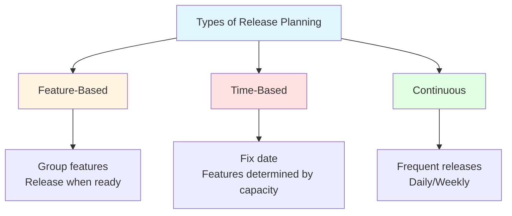

### 7.1 Feature-Based Release Planning

> **Definition:** Grouping **related features** and releasing them **together as a package** when they are ready.

**Characteristics:**
- Release is **not based on strict sprint schedule**.
- Prioritizes **business value**.
- Allows for **flexibility in development timelines**.

**When to Use:**
- Features are interdependent.
- Business value is tied to feature completeness.
- Market timing is less critical than feature readiness.

**Example:**
> A banking app releases "Mobile Check Deposit" only when the feature is fully complete — including image capture, OCR, fraud detection, and backend integration.

### 7.2 Time-Based Release Planning

> **Definition:** The **release date is fixed**, and the **features included** are determined by **how much can be delivered within that timeframe**.

**Characteristics:**
- **Fixed deadline** (e.g., quarterly release, annual release).
- **Scope is variable** — features are dropped if not ready.
- **Predictable** for stakeholders and customers.

**When to Use:**
- Regulatory deadlines.
- Marketing campaigns.
- Customer commitments.
- Hardware/software integration.

**Example:**
> A tax software company must release updates by **January 1** every year, regardless of how many features are ready.

### 7.3 Continuous Release Planning

> **Definition:** Software or product updates are released to users **frequently**, often **daily or weekly**, rather than in large, infrequent batches.

**Characteristics:**
- Associated with **Agile and DevOps practices**.
- Emphasizes **continuous delivery** and **feedback loops**.
- Improves product and user experience iteratively.

**When to Use:**
- SaaS products.
- Web applications.
- Mobile apps with frequent updates.

**Example:**
> **Netflix** deploys updates thousands of times per day. **Amazon** deploys every 11.7 seconds on average.

### 7.4 Comparison of Release Planning Types

| **Aspect** | **Feature-Based** | **Time-Based** | **Continuous** |
|---|---|---|---|
| **Release Trigger** | Feature readiness | Fixed date | Continuous |
| **Scope** | Fixed | Variable | Variable |
| **Schedule** | Flexible | Fixed | Continuous |
| **Risk** | Medium | Medium | Low |
| **Feedback** | After release | After release | Continuous |
| **Best For** | Complex features | Deadlines | SaaS/Web |

---

## 8. Sample Product Roadmap

A **Product Roadmap** is a **strategic visual summary** of how the product will evolve over time.

### 8.1 Example Roadmap Template

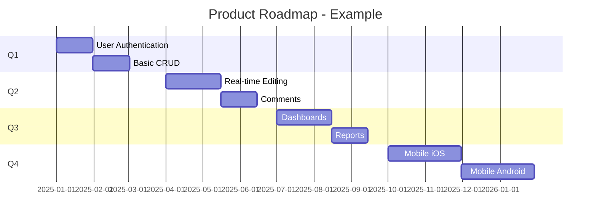

### 8.2 Roadmap Components

| **Component** | **Description** |
|---|---|
| **Themes** | High-level strategic goals (e.g., "Collaboration") |
| **Timeframes** | Quarters, months, or release cycles |
| **Features** | Key capabilities planned |
| **Milestones** | Major releases or MVP versions |
| **Dependencies** | Relationships between features |

---

## 9. Example Release Plan

### 9.1 Single-Team Release Plan

| **Sprint** | **Sprint Goal** | **Features** | **Story Points** |
|---|---|---|---|
| Sprint 1 | Foundation | Login, Registration | 20 |
| Sprint 2 | Core Features | Dashboard, Profile | 22 |
| Sprint 3 | Collaboration | Comments, Sharing | 25 |
| **Release 1** | **MVP** | **All above** | **67** |

### 9.2 Multi-Team Release Plan

The original PDF shows a **Multi-Team Release Plan Example** with:

- **Product Backlog** (left side) containing:
  - **Architectural User Stories** (blue)
  - **Functional User Stories** (green)
- **Two Teams** (Team 1 and Team 2) working in parallel.
- **Six Sprints** (Sprint 1 to Sprint 6).
- **Two Releases** (after Sprint 3 and after Sprint 6).
- **Dependencies** (arrows showing architectural stories must complete before functional stories).

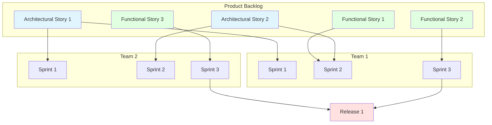

> **Note:** The diagram in the PDF shows **architectural stories** (blue) must be completed before **functional stories** (green) can be built — this is a **dependency**. The arrows indicate these dependencies.

**Key Observations:**
- **Architectural stories** come first (foundation).
- **Functional stories** follow.
- **Dependencies** are explicitly tracked.
- **Releases** happen after multiple sprints.
- **Multiple teams** coordinate on the same product backlog.

---

## 10. Release Management in Agile

### 10.1 Definition

> **Release Management** in Agile environments ensures that software is delivered **consistently, predictably, and safely** across multiple releases.

It acts as a **control mechanism** that:
- **Coordinates** and **streamlines** the movement of:
  - New features
  - Bug fixes
  - Improvements
- From **development** to **production**.

### 10.2 How Release Planning Works

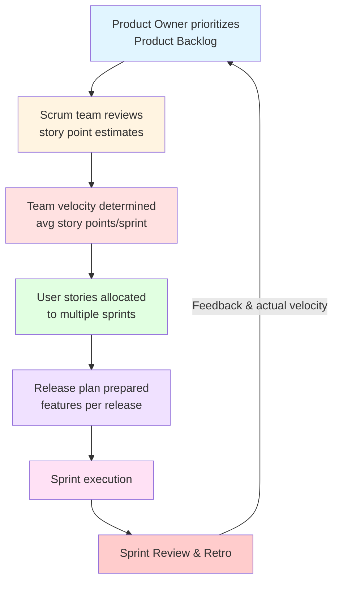

### 10.3 Step-by-Step Process

1. **Product Owner prioritizes** the Product Backlog based on **business value**.
2. **Scrum team reviews** the **story point estimates**.
3. **Team velocity** (average story points completed per sprint) is determined.
4. **User stories are allocated** to multiple sprints according to the team's **capacity**.
5. **A release plan is prepared** indicating the features to be delivered in each release.
6. **After every sprint**, the release plan is **reviewed and updated** based on:
   - Customer feedback
   - Actual velocity

### 10.4 Benefits of Release Management

| **Benefit** | **Description** |
|---|---|
| **Delivers High-Priority Features Early** | Business value is prioritized |
| **Provides Predictable Release Schedules** | Stakeholders know what to expect |
| **Accommodates Changing Requirements** | Agile flexibility built-in |
| **Enables Continuous Customer Feedback** | Regular releases = regular feedback |

> **Exam Tip:** A common question is *"How does release management ensure stable and timely software delivery?"* — Answer: It coordinates features, bug fixes, and improvements from development to production, using prioritized backlogs and velocity-based planning.

---

## 11. Role of Estimation in Release Planning

### 11.1 What is Agile Estimation?

> **Agile estimation** is the process of estimating the **effort required** to implement **user stories**.

The team estimates work using **Story Points**, which measure:
- **Relative complexity**
- **Effort**
- **Uncertainty**

**Not** the actual time required.

### 11.2 Estimation Process

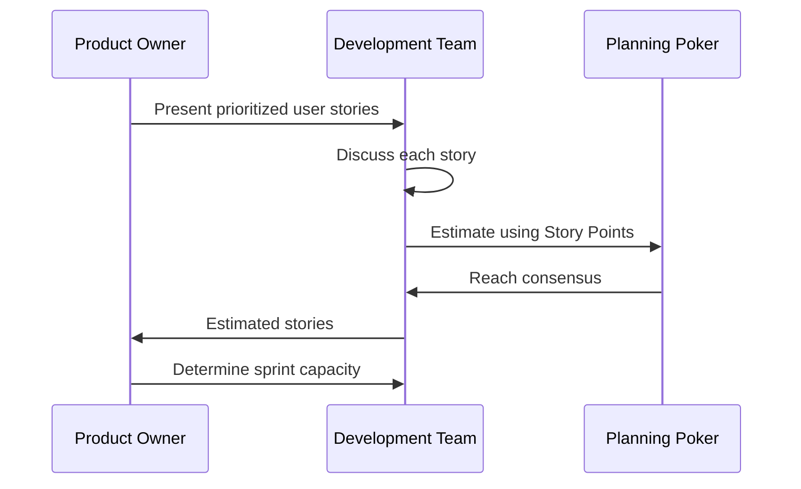

**Steps:**

1. **Product Owner presents** the prioritized user stories from the Product Backlog.
2. **Development team discusses** each user story to understand its requirements.
3. **Team estimates** each story using **Story Points**.
4. **Techniques such as Planning Poker** may be used to reach a consensus.
5. **Estimated stories** help determine how much work can be completed in each sprint.

### 11.3 Benefits of Estimation

| **Benefit** | **Description** |
|---|---|
| **Improves Sprint Planning** | Accurate estimates lead to better sprint goals |
| **Encourages Team Collaboration** | Discussion and consensus-building |
| **Produces More Realistic Estimates** | Collective wisdom beats individual guessing |
| **Helps Predict Future Project Velocity** | Historical data improves forecasting |

### 11.4 Planning Poker — Deep Dive

> **Planning Poker** is a **consensus-based estimation technique** using a deck of cards with Fibonacci-like numbers (0, 1, 2, 3, 5, 8, 13, 21, 34, 55, 89, ?, ☕).

**Process:**

1. Each team member gets a deck of cards.
2. Product Owner reads a user story.
3. Team discusses the story.
4. Each member **secretly selects** a card.
5. All cards are **revealed simultaneously**.
6. If estimates differ, the **highest and lowest** explain their reasoning.
7. Team **re-votes** until consensus is reached.

**Why It Works:**
- Prevents **anchoring bias**.
- Encourages **collaborative discussion**.
- Leverages **collective intelligence**.

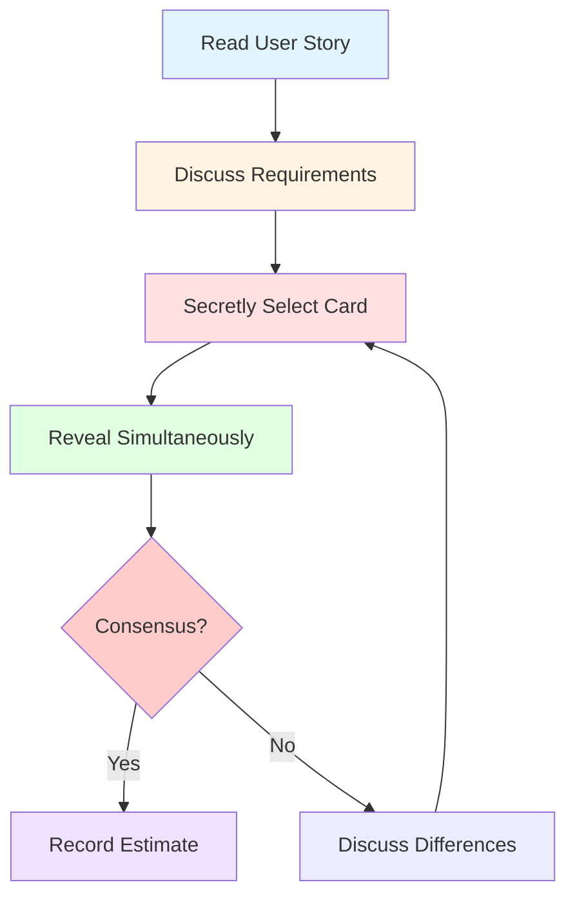

---

## 12. Advantages and Disadvantages of Agile Release Planning

### 12.1 Advantages

| **Advantage** | **Description** |
|---|---|
| **Alignment with Business Goals** | Ensures delivery matches strategic objectives |
| **Predictable Releases** | Stakeholders know what to expect |
| **Flexibility** | Accommodates changing requirements |
| **Early Value Delivery** | High-priority features released first |
| **Continuous Feedback** | Regular releases enable feedback loops |
| **Risk Reduction** | Small, incremental releases reduce risk |
| **Team Collaboration** | Estimation and planning involve whole team |

### 12.2 Disadvantages / Challenges

| **Challenge** | **Description** |
|---|---|
| **Estimation Uncertainty** | Story points are relative, not absolute |
| **Velocity Variability** | Team velocity fluctuates |
| **Scope Creep** | Changing requirements can disrupt plans |
| **Stakeholder Expectations** | Fixed dates vs. variable scope tension |
| **Coordination Overhead** | Multi-team planning is complex |
| **Dependency Management** | Cross-team dependencies are hard to track |

---

## 13. Real-World Examples and Analogies

### 13.1 Analogy: Road Trip Planning

- **Product Vision** = Destination (e.g., "Visit the Grand Canyon")
- **Product Roadmap** = Route plan (which highways, which cities)
- **Release Plan** = Itinerary (Day 1: Drive to City A, Day 2: Drive to City B)
- **Sprint Planning** = Daily driving plan (Today: Drive 300 miles)
- **Velocity** = Average miles per day
- **Release Capacity** = How far you can go in the planned time

### 13.2 Real-World Use Cases

| **Company** | **Release Planning Approach** | **Result** |
|---|---|---|
| **Spotify** | Squads & Tribes with continuous release | Frequent, autonomous releases |
| **Netflix** | Continuous deployment | Thousands of deployments/day |
| **Amazon** | Two-pizza teams with continuous delivery | Deploy every 11.7 seconds |
| **SAFe Enterprises** | Program Increment (PI) Planning | Quarterly release trains |
| **Startups** | MVP-focused, feature-based | Fast time to market |

---

## 14. Exam Tips

> **📝 Exam Tips — Commonly Asked Questions:**

1. **Define Agile Release Planning.** How does it differ from traditional release management?
2. **What are the inputs to release planning?** Explain each.
3. **Explain the MoSCoW prioritization method** with examples.
4. **How do you calculate release capacity?** (Velocity × Sprints)
5. **Compare Release Planning vs Sprint Planning.**
6. **What are the three types of release planning?** Explain each.
7. **How is velocity determined?** Why is it important?
8. **Describe the estimation process in Agile.** What is Planning Poker?
9. **What is the role of the Product Owner in release planning?**
10. **How does release management ensure stable and timely delivery?**
11. **What are the benefits of Agile release planning?**
12. **Explain the multi-team release plan** with dependencies.

> **⚠️ Tricky Concepts:**
> - **Release Planning ≠ Sprint Planning** — different time horizons.
> - **Velocity is an average**, not a guarantee.
> - **MoSCoW Must-Haves** form the MVP; Should-Haves add competitiveness.
> - **Feature-based** = release when ready; **Time-based** = fixed date, variable scope.
> - **Continuous release** = frequent, small batches (DevOps-aligned).
> - **Story Points** measure **relative** complexity, not time.

---

## 15. Common Interview Questions

1. **What is Agile Release Planning?**
   - *Answer:* A method for delivering software features frequently, iteratively, and with low risk, mapping how and when features will be released.

2. **How do you prioritize a product backlog?**
   - *Answer:* Using MoSCoW, WSJF, Kano model, or value vs. effort matrix.

3. **What is the difference between a release plan and a sprint backlog?**
   - *Answer:* Release plan = high-level, multiple sprints; sprint backlog = detailed, one sprint.

4. **How do you handle changing requirements in release planning?**
   - *Answer:* Review and update the plan after each sprint based on feedback and actual velocity.

5. **What is velocity? How is it calculated?**
   - *Answer:* Average story points completed per sprint; calculated from historical data.

6. **What is Planning Poker?**
   - *Answer:* A consensus-based estimation technique using cards to estimate story points.

7. **What is the role of the Product Owner in release planning?**
   - *Answer:* Prioritizes the backlog based on business value, defines vision, and communicates with stakeholders.

8. **How do you manage dependencies in multi-team release planning?**
   - *Answer:* Identify dependencies early, use architectural stories first, coordinate via Scrum of Scrums or PI Planning.

9. **What is an MVP?**
   - *Answer:* Minimum Viable Product — the smallest release that delivers value, typically all Must-Haves plus selected Should-Haves.

10. **What are the benefits of continuous release planning?**
    - *Answer:* Faster feedback, lower risk, improved product, DevOps alignment.

---

## 16. Summary

### Key Takeaways

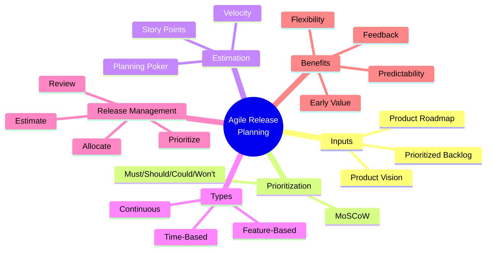

### One-Page Recap

- **Agile Release Planning** = mapping how/when features will be released.
- **Inputs:** Product Vision, Product Roadmap, Prioritized Product Backlog.
- **MoSCoW:** Must (MVP), Should (competitive), Could (nice), Won't (excluded).
- **Estimation:** Story Points, T-shirt Sizing, Planning Poker.
- **Velocity:** Average story points completed per sprint.
- **Release Capacity:** Velocity × Number of Sprints.
- **Types:** Feature-Based (ready), Time-Based (fixed date), Continuous (frequent).
- **Release Management:** PO prioritizes → team estimates → velocity → allocate → plan → review.
- **Benefits:** Early value, predictable releases, flexibility, continuous feedback.
- **Multi-team planning:** Architectural stories first, dependencies tracked, releases after multiple sprints.

> **Final Exam Tip:** Always connect release planning back to **Agile principles** — iterative delivery, customer collaboration, and responding to change. Release planning is the **bridge** between product vision and sprint execution.

---

## 17. References & Further Reading

- **Agile Estimating and Planning** — Mike Cohn
- **User Stories Applied** — Mike Cohn
- **Scrum Guide** — Ken Schwaber & Jeff Sutherland
- **SAFe Framework** — Scaled Agile, Inc.
- **Planning Poker** — Mountain Goat Software
- **MoSCoW Method** — DSDM Consortium
- **Official Docs:** Scrum.org, Agile Alliance, Scrum Alliance

---

*End of Notes — Agile Release Planning*