# Configuration Management & Version Control

> **Course Context:** Software Engineering (Agile Practices)
> **Topic:** Configuration Management, Version Control Systems, Branching Strategies, and Agile Integration
> **Prerequisites:** Basic understanding of SDLC, Agile methodology, and collaborative software development. Familiarity with command-line interfaces is helpful but not required.

---

## 1. Introduction to Configuration Management (CM)

### 1.1 Definition

> **Configuration Management (CM)** is the process of **identifying, organizing, controlling, and tracking** software artifacts such as **source code, configuration files, documentation, and test scripts** throughout the project lifecycle.

**Key Verbs in CM:**
- **Identify** — know what artifacts exist
- **Organize** — structure them logically
- **Control** — manage changes systematically
- **Track** — maintain history and traceability

### 1.2 Why Configuration Management Matters

In any software project, especially Agile ones:
- Multiple developers work simultaneously
- Files change frequently
- Environments (dev, test, prod) must stay consistent
- Audits and compliance may require traceability
- Bugs need to be traced back to specific changes

Without CM, teams face:
- ❌ Version conflicts
- ❌ Lost changes
- ❌ Inconsistent environments
- ❌ Inability to reproduce bugs
- ❌ No audit trail

---

## 2. How Configuration Management is Done

Configuration Management is implemented through **four core practices**:

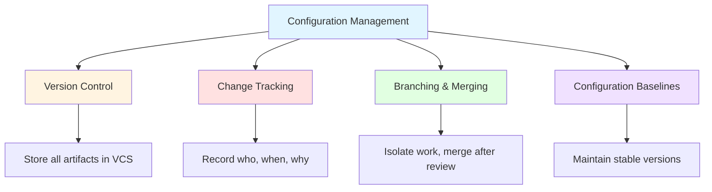

### 2.1 Version Control

- All project artifacts are stored in a **Version Control System (VCS)** (e.g., **Git**).
- Enables **multiple developers to work simultaneously** without overwriting each other's changes.

### 2.2 Change Tracking

- Every code change is recorded with:
  - **Who** made the change
  - **When** it was made
  - **Why** it was made
- Ensures **complete traceability**.

### 2.3 Branching and Merging

- Developers work on **separate branches** for new features or bug fixes.
- Branches are **merged into the main branch** after **review and testing**.

### 2.4 Configuration Baselines

- **Stable versions** of the software are maintained.
- Allows the team to **reproduce or restore** previous releases if required.

> **Exam Tip:** A common question is *"What are the four key practices of Configuration Management?"* — Answer: **Version Control, Change Tracking, Branching & Merging, and Configuration Baselines**.

---

## 3. Version Control — Fundamentals

### 3.1 What is Version Control?

> **Version control** refers to the process of **tracking and managing changes** to digital assets over time.

**Key Idea:** Every change is recorded, so you can:
- See what changed
- See who changed it
- Revert to previous versions
- Work on multiple versions simultaneously

### 3.2 What is a Version Control System (VCS)?

> A **Version Control System (VCS)** is a **tool** used in software development and collaborative projects to **track and manage changes** to **source code, documents, and other files**.

**Examples:** Git, SVN (Subversion), Mercurial, CVS, Perforce

### 3.3 Importance in Agile Environments

In an **Agile environment**, where teams:
- Work in **short iterations**
- **Frequently integrate changes**

...VCS is **essential** for:

| **Purpose** | **Description** |
|---|---|
| **Maintaining Code Integrity** | Ensures code isn't lost or corrupted |
| **Facilitating Collaboration** | Multiple developers work together |
| **Enabling CI/CD** | Triggers automated builds and deployments |
| **Preventing Version Conflicts** | Detects and resolves overlapping edits |
| **Maintaining Consistency** | Keeps dev, test, and prod environments aligned |
| **Supporting Teamwork** | Provides a shared source of truth |

---

## 4. What Version Control Does

Version Control provides **six key capabilities**:

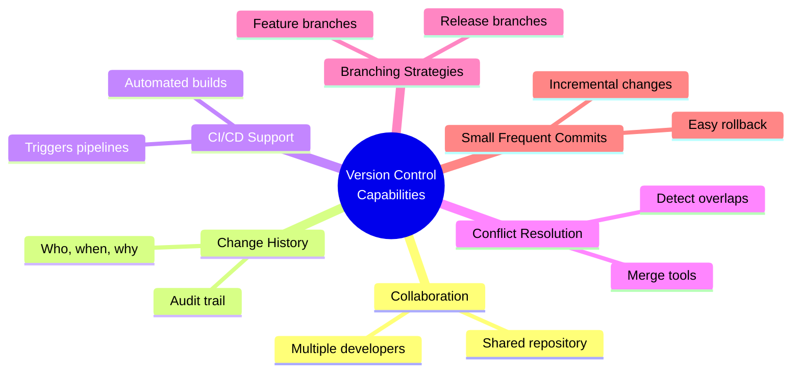

### 4.1 Collaboration
- Multiple developers can work on the same project simultaneously.
- Changes are merged systematically.

### 4.2 Change History and Audit Trail
- Every change is recorded.
- Full traceability of who, when, and why.

### 4.3 Support for CI/CD
- VCS acts as the **trigger** for CI/CD pipelines.
- A push to the repository can automatically start a build.

### 4.4 Conflict Resolution
- Detects overlapping edits.
- Provides tools to resolve differences.

### 4.5 Branching Strategies
- Enables parallel development.
- Supports feature isolation, release preparation, and hotfixes.

### 4.6 Small, Frequent Commits
- Encourages incremental progress.
- Makes it easier to identify and fix bugs.

---

## 5. Benefits of a Version Control System

| **Benefit** | **Description** |
|---|---|
| **Single Source of Truth** | All team members work from the same codebase |
| **Full File History & Visibility** | Complete record of all changes over time |
| **Concurrent Development** | Multiple developers work simultaneously |
| **Better Team Collaboration** | Shared repository, clear ownership |
| **Supports Automation** | Integrates with CI/CD, testing, deployment |

> **Analogy:** Think of a VCS as a **time machine** for your code — you can go back to any point in history, see what changed, and restore any version.

---

## 6. How Version Control Systems Work

### 6.1 The VCS Workflow

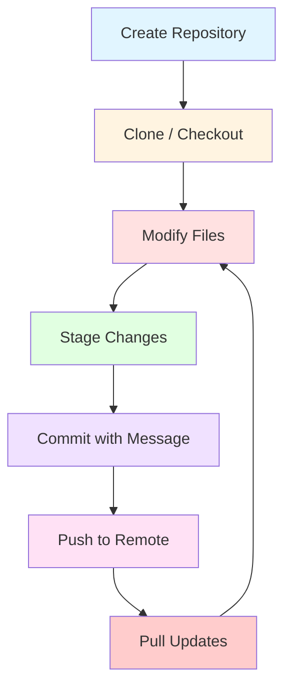

### 6.2 Step-by-Step Explanation

| **Step** | **Action** | **Description** |
|---|---|---|
| **1** | **Create a Repository** | The main branch where the main codebase is maintained. This is the **input to your CI/CD pipeline** (though CI/CD itself is not part of VCS). |
| **2** | **Create Local Copy (Clone/Checkout)** | Developers create a local copy of the repository on their machines to work independently. |
| **3** | **Modify Files** | Fix a bug or add a new feature. |
| **4** | **Stage Changes** | Prepare changes in your working directory to be included in the next commit. The **staging area** (also called the **index**) acts as an intermediate layer between your working directory and the VCS repository. |
| **5** | **Commit with Message** | A **snapshot** of staged changes is saved to the **local repository**, along with a message explaining what changed. |
| **6** | **Push to Remote** | Pushing sends your **local commits** to the **remote repository**. Note: This is **not necessarily to the main branch** — it could be a **feature branch**. |

> **Note:** The original PDF repeats the "Push to remote" step multiple times (likely a formatting artifact). The key point is: **push sends local commits to the remote repository**, which could be any branch.

### 6.3 The Three States of Git (Bonus Depth)

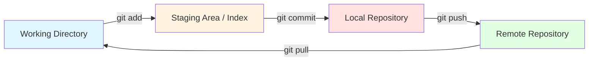

| **State** | **Description** |
|---|---|
| **Working Directory** | Where you edit files |
| **Staging Area (Index)** | Where changes are prepared for commit |
| **Local Repository** | Where commits are stored locally |
| **Remote Repository** | Shared repository (e.g., GitHub, GitLab) |

---

## 7. Resolving Conflicts

### 7.1 What is a Conflict?

> When **multiple people work on the same files** in a VCS, they might make changes to the **same part of the file**. These **overlapping edits** are called **conflicts**.

### 7.2 How VCS Handles Conflicts

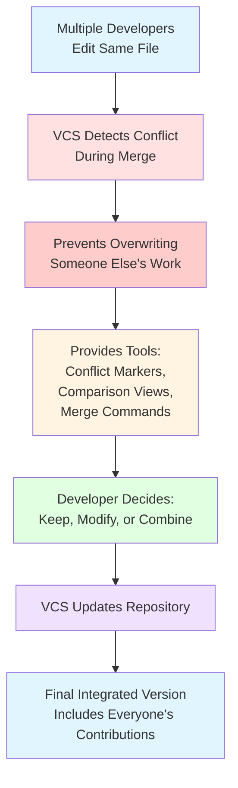

### 7.3 Key Points

- VCS **detects conflicts automatically** when merging changes.
- It **prevents accidentally overwriting** someone else's work.
- It gives tools:
  - **Conflict markers** (e.g., `<<<<<<<`, `=======`, `>>>>>>>`)
  - **Comparison views** (diff tools)
  - **Merge commands**
- Allows you to decide **which changes to keep, modify, or combine**.
- After resolution, the VCS **updates the repository** so the final integrated version includes **everyone's contributions** in a consistent way.

### 7.4 Example Conflict Markers (Git)

```text
<<<<<<< HEAD
This is the change from the current branch.
=======
This is the change from the incoming branch.
>>>>>>> feature-branch
```

> **Exam Tip:** Conflict resolution is a **manual** process — VCS detects and provides tools, but a human decides the final outcome.

---

## 8. Backup and Recovery

### 8.1 How VCS Provides Backup

| **Feature** | **Description** |
|---|---|
| **Automatic Backup** | Every time you **commit**, the VCS stores a **complete snapshot** of your files. |
| **History Tracking** | VCS tracks code changes and maintains a **history** of changes made. |
| **Bug Recovery** | If a bug is introduced, developers can **quickly revert** to a previous version **before the bug was introduced**, minimizing impact on the live system. |
| **Built-in Redundancy** | Many VCS solutions offer **built-in backup mechanisms** and **redundancy features** — even if one copy of the repository is lost, another copy is available. |
| **Disaster Recovery** | If files are **accidentally deleted or corrupted**, you can **restore them from a previous commit**. |

### 8.2 Backup and Recovery Workflow

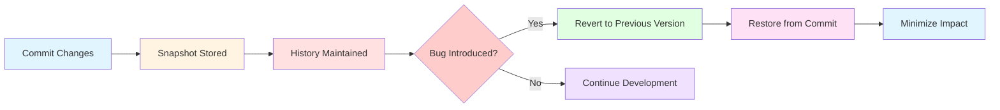

> **Analogy:** VCS is like a **save point in a video game** — you can always go back to a previous safe state if something goes wrong.

---

## 9. Branching

### 9.1 What is Branching?

> **Branching** is the process of creating **independent copies** of the codebase, allowing developers to work on **different features or bug fixes simultaneously** without interfering with each other or the main codebase.

- Creates a **parallel copy** of your project.
- You can make changes, add features, or fix bugs **without affecting the main project** until you decide to **merge** them back.

### 9.2 Why Branching Matters

- **Isolation** — work on features without breaking main code
- **Parallel Development** — multiple features at once
- **Experimentation** — try new ideas safely
- **Release Preparation** — stabilize code before release
- **Hotfixes** — fix production issues quickly

---

## 10. Branching Strategies in Agile

### 10.1 Overview of Branch Types

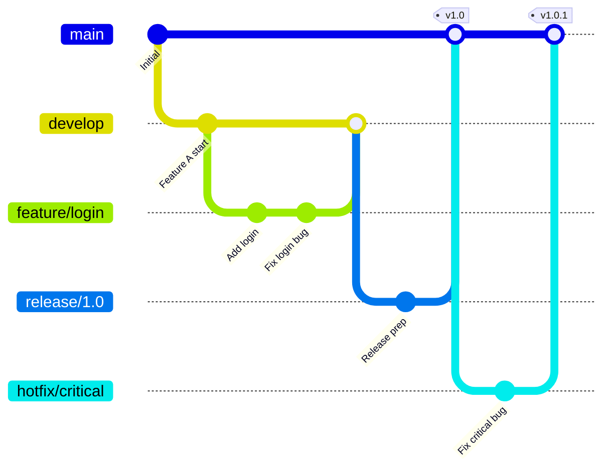

### 10.2 Main Branch (main/master)

> The **main branch**, also known as **main** or **master**, is the **cornerstone** of your Git repository.

**Characteristics:**
- Should **always contain** the most **stable and production-ready code**.
- Any changes merged into main are **thoroughly tested and approved**.
- Serves as the **single source of truth for deployment**.

**Best Practices:**
- Never commit directly to main (in team settings).
- Use pull requests / merge requests for changes.
- Protect the branch (require reviews, passing tests).

### 10.3 Release Branches

> When you're **preparing a new release**, a **release branch** is created.

**Purpose:**
- Allows the team to **finalize the product**.
- Address **last-minute bugs**.
- **Polish the codebase**.

**Workflow:**
1. Create release branch from main (or develop).
2. Fix bugs, update version numbers, update docs.
3. Once ready, **merge back into main**.
4. **Tag with a version number** (e.g., `v1.0.0`).

**Benefits:**
- **Tracking** the product's evolution.
- Easy to **revert to previous stable versions** if needed.

### 10.4 Feature Branches

> **Feature branches** are used to develop **new features, enhancements, or experiments**.

**Characteristics:**
- **Short-lived** branches.
- Branch off from the **main** (or **develop**) branch.
- Allow engineers to work on **specific features in isolation**.
- **Reduce risk of conflicts** with production code.

**Workflow:**
1. Create feature branch from main/develop.
2. Develop and commit changes.
3. Open pull request.
4. Review, test, merge back.

**Naming Convention Examples:**
- `feature/user-authentication`
- `feature/payment-gateway`
- `feature/dark-mode`

### 10.5 Development Branch

> The **development branch** acts as an **integration branch** where **feature branches converge**.

**Purpose:**
- Allows for **continuous integration and testing**.
- Ensures all new features **work well together** before being released.

**Workflow:**
1. Feature branches merge into **develop**.
2. Develop is tested as a whole.
3. When stable, develop merges into **main** (or release branch).

**Note:** Not all teams use a develop branch (e.g., GitHub Flow uses only main + feature branches). But in **Git Flow**, develop is central.

### 10.6 Hotfix Branches

> **Hotfix branches** are crucial for addressing **critical issues in the production environment**.

**When to Use:**
- Urgent bug or vulnerability discovered in production.
- Cannot wait for the next release cycle.

**Workflow:**
1. Create hotfix branch from **main**.
2. Implement the necessary fixes.
3. **Thoroughly test**.
4. Merge back into **main** (and possibly **develop**).
5. **Deploy to production**.
6. Tag with a new version number (e.g., `v1.0.1`).

**Naming Convention:**
- `hotfix/critical-security-patch`
- `hotfix/payment-failure`

### 10.7 How the Branches Converge

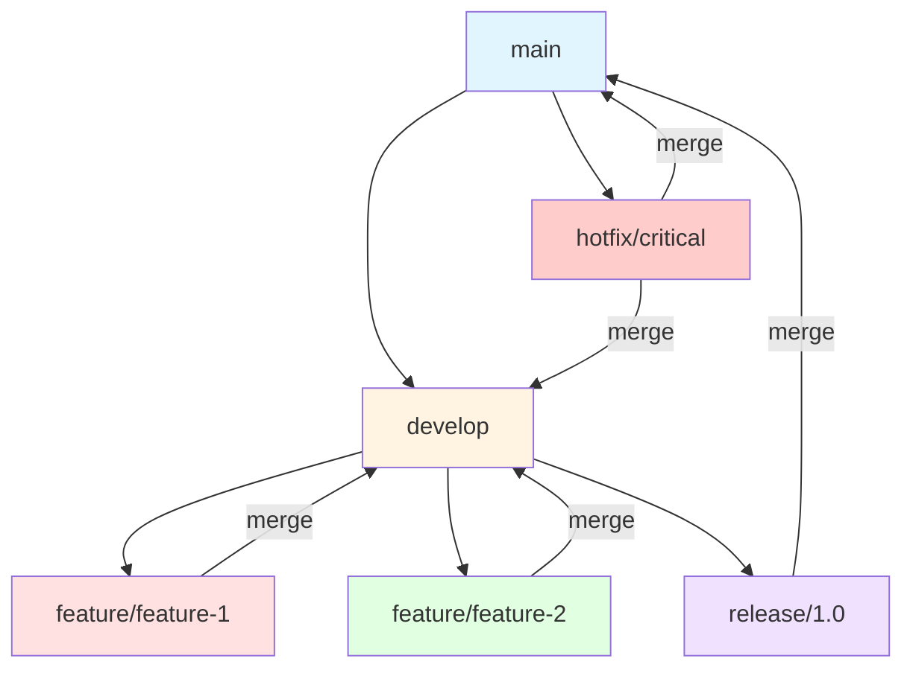

### 10.8 Branch Comparison Table

| **Branch Type** | **Purpose** | **Lifespan** | **Branches From** | **Merges Into** |
|---|---|---|---|---|
| **Main/Master** | Production-ready code | Permanent | — | — |
| **Develop** | Integration of features | Permanent | Main | Main (via release) |
| **Feature** | New features/experiments | Short-lived | Develop/Main | Develop |
| **Release** | Release preparation | Medium | Develop | Main + Develop |
| **Hotfix** | Critical production fixes | Short-lived | Main | Main + Develop |

> **Exam Tip:** Know the difference between **Git Flow** (main, develop, feature, release, hotfix) and **GitHub Flow** (main + feature branches only). Agile teams often prefer simpler flows.

---

## 11. Best Practices for Frequent Commits

| **Best Practice** | **Description** |
|---|---|
| **Commit Small, Focused Changes** | Each commit should represent **one logical change**. Avoid mixing unrelated changes. |
| **Commit Early and Often** | Don't wait until a feature is complete. Commit incrementally. |
| **Write Clear Commit Messages** | Explain **what** and **why** (not just "fixed bug"). Use imperative mood: "Add login validation" not "Added login validation". |
| **Ensure Builds Remain Green** | Never commit code that **breaks the build**. Run tests locally before committing. |

### 11.1 Good vs Bad Commit Messages

| **Bad** | **Good** |
|---|---|
| "fixed stuff" | "Fix null pointer exception in user login" |
| "update" | "Update README with installation instructions" |
| "asdfgh" | "Add unit tests for payment service" |
| "WIP" | "Refactor database connection pooling" |

### 11.2 Commit Message Convention (Conventional Commits)

```text
<type>(<scope>): <description>

[optional body]

[optional footer]
```

**Types:**
- `feat` — new feature
- `fix` — bug fix
- `docs` — documentation
- `style` — formatting
- `refactor` — code restructuring
- `test` — adding tests
- `chore` — maintenance

**Example:**
```text
feat(auth): add OAuth2 login support

Implements Google and GitHub OAuth2 providers.
Closes #123.
```

---

## 12. Critical Artifacts Under Version Control

Not just code — **everything** that matters should be versioned:

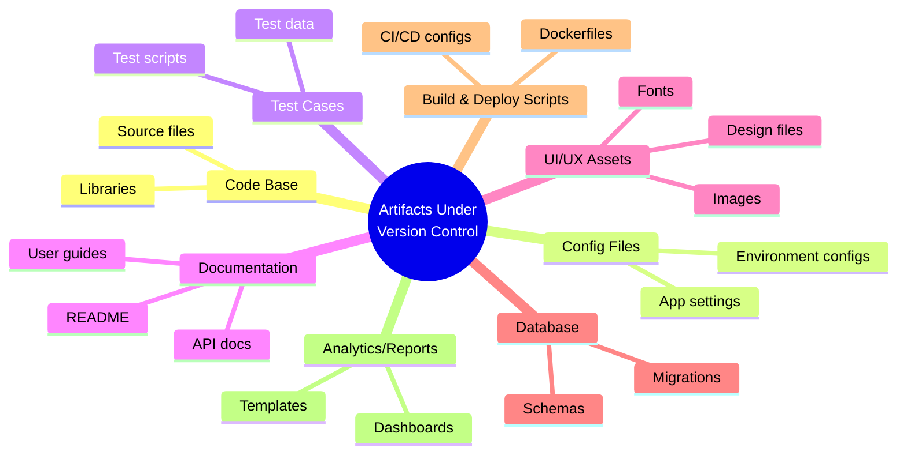

| **Artifact** | **Examples** |
|---|---|
| **Code Base** | `.java`, `.py`, `.js`, `.html`, `.css` files |
| **Config Files** | `.env`, `application.yml`, `config.json` |
| **Test Cases / Scripts / Data** | JUnit tests, Selenium scripts, test fixtures |
| **Documentation** | `README.md`, API docs, user manuals |
| **UI/UX Assets** | Images, fonts, design mockups |
| **Database Schemas & Migrations** | SQL files, Flyway/Liquibase migrations |
| **Build & Deployment Scripts** | `Jenkinsfile`, `Dockerfile`, `docker-compose.yml` |
| **Analytics/Report Templates** | Dashboard configs, report templates |

> **Exam Tip:** A common question is *"What artifacts should be under version control?"* — Remember: **everything needed to build, test, deploy, and document the project**.

---

## 13. Application of Configuration Management During Project Execution

### 13.1 What CM Does in Agile Projects

> CM is the practice of **systematically identifying, controlling, tracking, and maintaining changes** to project artifacts.

In an **Agile project**, CM ensures:
- The team works with the **correct and latest versions** of artifacts.
- Changes can be **traced**.
- Changes can be **rolled back** if required.

### 13.2 How Agile Teams Apply CM

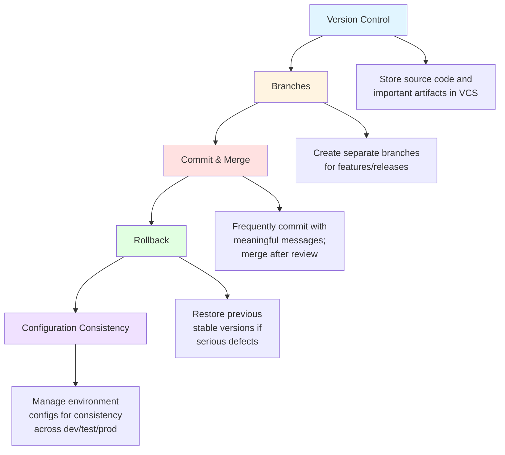

### 13.3 Detailed Practices

| **Practice** | **Description** |
|---|---|
| **Version Control** | Store source code and other important artifacts in a version-control system. |
| **Branches** | Create separate branches for features/releases instead of directly modifying the main codebase. |
| **Commit and Merge** | Frequently commit changes with meaningful messages; merge completed work into the shared/main branch after review. |
| **Rollback** | Previous stable versions can be restored if a change introduces serious defects. |
| **Configuration Consistency** | Environment/configuration files are managed so that development, testing, and production environments remain consistent. |

### 13.4 CM in the Agile Lifecycle

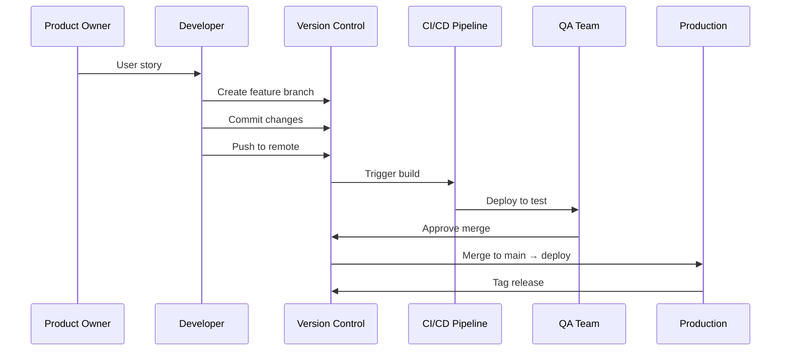

---

## 14. Advantages and Disadvantages of Version Control

### 14.1 Advantages

| **Advantage** | **Description** |
|---|---|
| **Full History** | Every change is recorded and reversible |
| **Collaboration** | Multiple developers work simultaneously |
| **Branching** | Parallel development without interference |
| **Backup & Recovery** | Restore previous versions easily |
| **Traceability** | Audit trail of who, when, why |
| **CI/CD Integration** | Triggers automated pipelines |
| **Conflict Resolution** | Tools to handle overlapping edits |
| **Code Integrity** | Prevents accidental overwrites |

### 14.2 Disadvantages / Challenges

| **Challenge** | **Description** |
|---|---|
| **Learning Curve** | Git commands can be complex for beginners |
| **Merge Conflicts** | Can be time-consuming to resolve |
| **Repository Size** | Large repos can become slow |
| **Binary Files** | Poor handling of large binaries |
| **Discipline Required** | Requires consistent commit practices |
| **Security Risks** | Accidental commits of secrets/credentials |

---

## 15. Real-World Examples and Analogies

### 15.1 Analogy: Google Docs vs. Version Control

- **Without VCS:** Like emailing Word documents back and forth — `report_v1.docx`, `report_v2_final.docx`, `report_v2_final_edited.docx`. Chaos!
- **With VCS:** Like Google Docs — everyone works on the same document, changes are tracked, and you can see revision history.

### 15.2 Real-World Use Cases

| **Company** | **VCS Usage** | **Result** |
|---|---|---|
| **Google** | Monorepo (single massive Git repo) | Billions of lines of code, thousands of developers |
| **Microsoft** | Git (largest Git repo: Windows) | 300GB+ repo, custom tooling |
| **Facebook** | Mercurial (custom fork) | Massive scale, fast operations |
| **Netflix** | Git + Spinnaker | Thousands of deployments/day |
| **Linux Kernel** | Git (created by Linus Torvalds) | Distributed development worldwide |

---

## 16. Exam Tips

> **📝 Exam Tips — Commonly Asked Questions:**

1. **Define Configuration Management.** What are its four key practices?
2. **What is a Version Control System?** Why is it important in Agile?
3. **Explain the VCS workflow** (create repo → clone → modify → stage → commit → push).
4. **What are the benefits of version control?**
5. **How does VCS handle conflicts?** What tools does it provide?
6. **Explain branching.** What are the different types of branches?
7. **Compare main, develop, feature, release, and hotfix branches.**
8. **What are the best practices for frequent commits?**
9. **List critical artifacts under version control.**
10. **How is Configuration Management applied in Agile projects?**
11. **Explain backup and recovery in VCS.**
12. **What is the difference between staging area and repository?**

> **⚠️ Tricky Concepts:**
> - **Version Control** is a **process**; **VCS** is a **tool**.
> - **Staging area** is an intermediate layer — not the same as the working directory or repository.
> - **Push** sends to remote; **commit** saves locally.
> - **Feature branches** are short-lived; **main** is permanent.
> - **Hotfix branches** come from **main**, not develop.
> - **CM ≠ VCS** — VCS is just one part of Configuration Management.

---

## 17. Common Interview Questions

1. **What is the difference between Git and GitHub?**
   - *Answer:* Git is a distributed VCS; GitHub is a cloud-based hosting service for Git repositories.

2. **Explain the Git workflow.**
   - *Answer:* Working directory → staging area → local repository → remote repository.

3. **What is a merge conflict? How do you resolve it?**
   - *Answer:* Overlapping edits; resolve by editing files, choosing changes, and committing.

4. **What is the difference between `git pull` and `git fetch`?**
   - *Answer:* `fetch` downloads changes without merging; `pull` downloads and merges.

5. **What is a pull request?**
   - *Answer:* A request to merge changes from one branch to another, often with review.

6. **What is Git Flow?**
   - *Answer:* A branching model with main, develop, feature, release, and hotfix branches.

7. **How do you revert a commit?**
   - *Answer:* `git revert` (creates new commit) or `git reset` (moves HEAD).

8. **What is the difference between `git merge` and `git rebase`?**
   - *Answer:* Merge preserves history; rebase rewrites history for a linear timeline.

9. **How do you handle secrets in version control?**
   - *Answer:* Never commit secrets; use `.gitignore`, environment variables, and secret managers.

10. **What is a monorepo?**
    - *Answer:* A single repository containing multiple projects/services.

---

## 18. Summary

### Key Takeaways

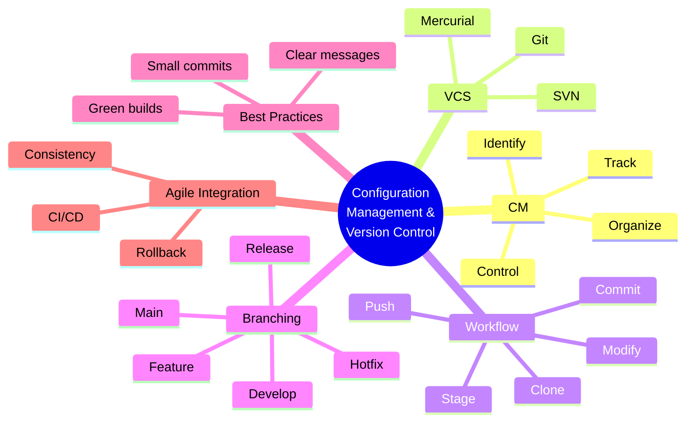

### One-Page Recap

- **Configuration Management (CM)** = identifying, organizing, controlling, tracking artifacts.
- **Four CM practices:** Version Control, Change Tracking, Branching & Merging, Configuration Baselines.
- **VCS** = tool to track and manage changes (e.g., Git).
- **Workflow:** Create repo → Clone → Modify → Stage → Commit → Push.
- **Conflicts** = overlapping edits; VCS detects and provides tools.
- **Backup & Recovery** = every commit is a snapshot; revert anytime.
- **Branching** = parallel development; types: main, develop, feature, release, hotfix.
- **Best Practices** = small commits, clear messages, green builds.
- **Artifacts under VCS** = code, configs, tests, docs, UI assets, DB schemas, scripts.
- **Agile CM** = version control, branches, commit/merge, rollback, consistency.

> **Final Exam Tip:** Always connect CM and VCS back to **Agile principles** — iterative development, collaboration, and continuous delivery. VCS is the **backbone** of Agile and DevOps.

---

## 19. References & Further Reading

- **Pro Git** — Scott Chacon, Ben Straub (free online)
- **Version Control with Git** — Jon Loeliger, Matthew McCullough
- **Git Flow** — Vincent Driessen (nvie.com)
- **GitHub Flow** — GitHub Guides
- **Trunk-Based Development** — trunkbaseddevelopment.com
- **Official Docs:** Git SCM, GitHub, GitLab, Atlassian Git Tutorials
- **Agile Manifesto** — agilemanifesto.org

---

*End of Notes — Configuration Management & Version Control*