# DevOps & CI/CD
> **Course Context:** Software Engineering (Agile Practices)
> **Topic:** DevOps, CI/CD, DevSecOps, and Infrastructure as Code
> **Prerequisites:** Basic understanding of SDLC, Agile methodology (Scrum/XP), version control (Git), software testing fundamentals, and software deployment concepts.

---

## 1. Introduction: The Problem Before DevOps

### 1.1 Traditional IT Model (Pre-DevOps)

In the **traditional IT model**, software development and IT operations functioned as **separate silos**:

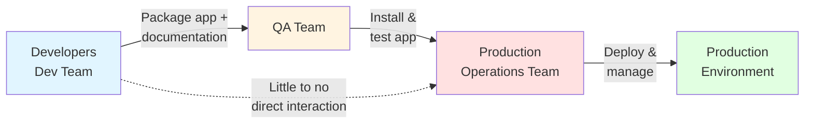

**Workflow in Traditional Model:**
1. **Developers** write code, package the application with documentation.
2. They **hand off** the package to the **QA team**.
3. **QA teams** install and test the application.
4. They **hand off** to **production operations teams**.
5. **Operations teams** deploy and manage the software — with **little-to-no direct interaction** with developers.

### 1.2 Responsibilities of Operations Teams

Operations teams were primarily responsible for:

| Responsibility | Description |
|---|---|
| **Infrastructure Provisioning** | Setting up servers, networks, storage |
| **Software Deployment & Releases** | Pushing code to production |
| **Monitoring & Logging** | Tracking system health and performance |
| **Configuration Management** | Managing server configs and environments |
| **Incident Response & On-Call** | Handling outages and emergencies |

### 1.3 Problems with the Traditional Model

- **Siloed teams** → poor communication
- **Slow releases** → months between deployments
- **"Works on my machine"** syndrome → environment mismatches
- **Blame culture** → Dev blames Ops and vice versa
- **Manual, error-prone processes** → human mistakes in deployment
- **Late feedback** → bugs found late, costly to fix

> **Exam Tip:** A classic question is *"Why did DevOps emerge?"* — Answer must mention **silo breakdown**, **faster delivery**, **automation**, and **shared responsibility**.

---

## 2. What is DevOps?

### 2.1 Definition

> **DevOps** is a **culture** and **set of practices** that brings together **development (Dev)** and **operations (Ops)** teams to **shorten the software development lifecycle** and deliver **high-quality software continuously**.

- **Dev** = Development (coding, building, testing)
- **Ops** = Operations (deployment, infrastructure, monitoring)

### 2.2 DevOps Aims

1. **Break down silos** between development and operations.
2. **Enable faster and more frequent releases.**
3. **Improve overall quality and reliability** of software.
4. **Empower teams** to respond to customer needs more effectively.

### 2.3 DevOps as a Philosophy

DevOps is:
- ✅ A **cultural philosophy**
- ✅ A **set of practices**
- ❌ NOT just a tool or technology

**Key Focus Areas:**
- **Continuous delivery**
- **Faster time to market**
- **Automation and integration** from development to deployment

### 2.4 DevOps Builds on Agile & Lean

DevOps is built **on top of Agile and Lean practices**:
- **Incremental development**
- **Rapid delivery**
- **Culture of accountability**
- **Improved collaboration**
- **Empathy and joint responsibility** for business outcomes

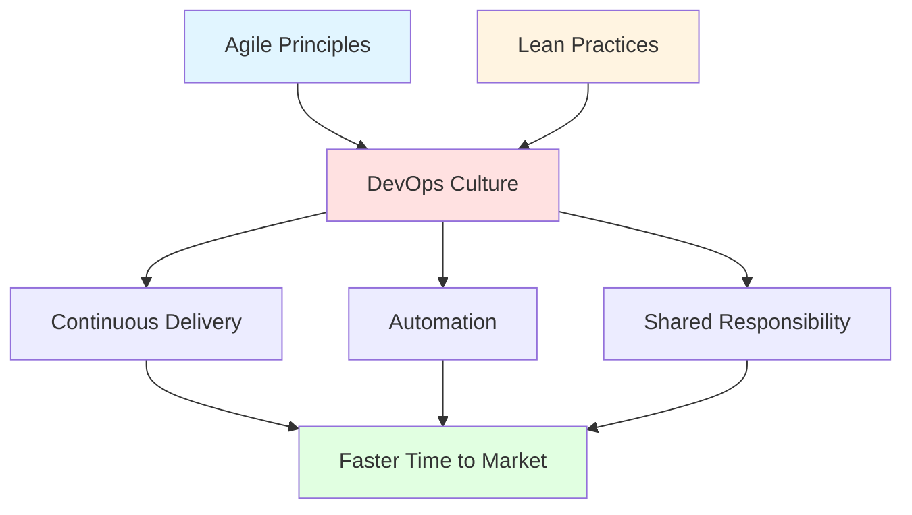

---

## 3. DevOps Fundamentals

| **Topic** | **Description** |
|---|---|
| **Version Control** | Fundamental practice of tracking and managing every change made to source code and other files. Closely related to **Source Code Management (SCM)**. |
| **Agile** | Iterative, incremental, and lean approaches to streamline and accelerate project delivery. |
| **Continuous Integration (CI)** | Regularly integrating all code changes into the main branch, **automatically testing** each change, and **automatically kicking off a build**. |
| **Continuous Delivery (CD)** | Works with CI to automate **infrastructure provisioning** and **application release** processes. Commonly referred to together as **CI/CD**. |
| **Shift Left** | Shifting **security and testing** much earlier in the development process — speeds up development while improving code quality. |

---

## 4. How DevOps Works

### 4.1 The DevOps Workflow

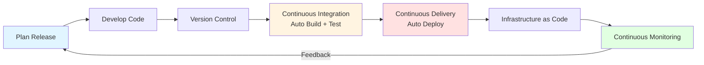

**Steps:**
1. **Plan the release** — Developers, operations, and stakeholders collaborate early.
2. **Developers write code** and use **version control systems**.
3. **Changes integrated continuously** using automated builds and tests (**CI**).
4. **Applications deployed automatically** through **Continuous Delivery (CD)**.
5. **Infrastructure managed as code** for consistency and repeatability (**IaC**).
6. **Systems monitored continuously** to gather feedback and improve future releases.

### 4.2 DevOps Model

An **organizational and cultural approach** that combines development and operations teams into a **unified structure**.

**Two Key Concepts:**

- **Delivery Pipeline:** Represents the different stages software goes through before release to production.
- **Continuous Feedback Loop:** Learning from real-world performance and using that feedback to improve future releases.

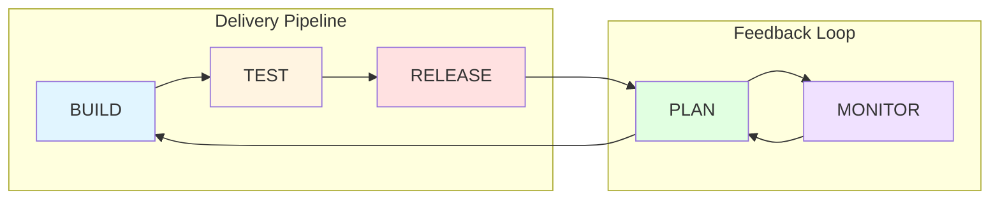

> **Note:** The image in the original PDF shows a computer (your computer) on the left, a delivery pipeline (Build → Test → Release) going right to customers, and a feedback loop (Plan ← Monitor) returning to the computer.

---

## 5. DevOps Life Cycle

The **step-by-step, iterative process** through which software moves from **initial idea to production and monitoring**.

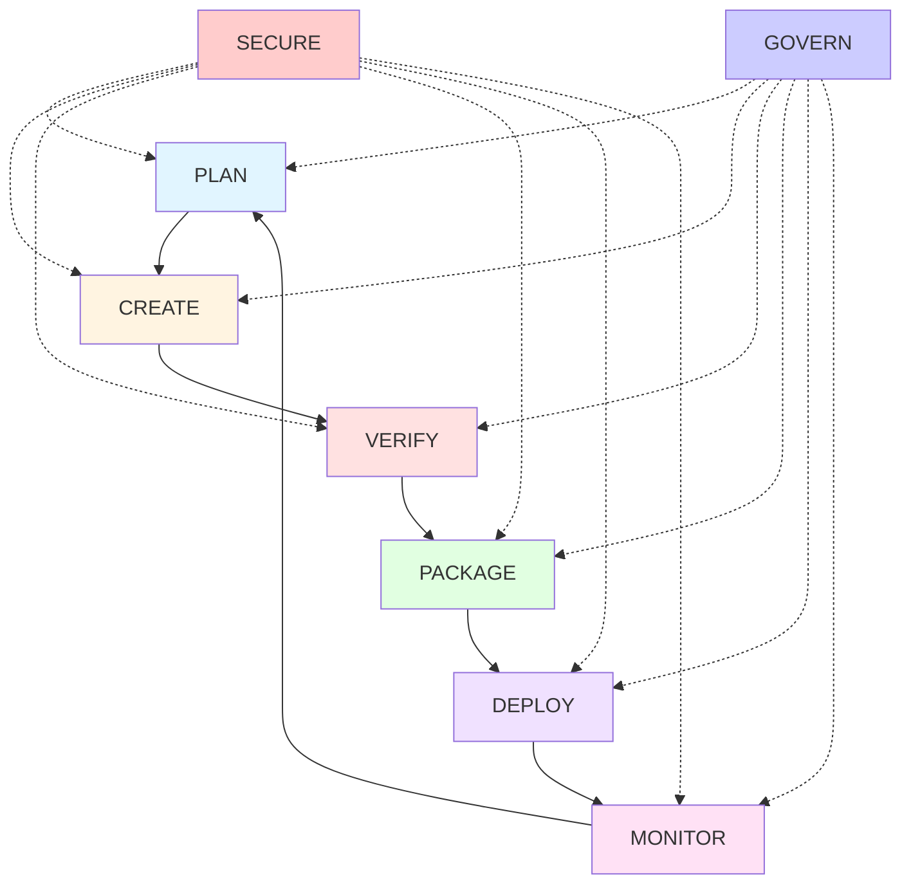

| **Stage** | **Explanation** |
|---|---|
| **Plan** | Define what needs to be built based on business needs. |
| **Create** | Write the actual code for the planned features. |
| **Verify** | Test the code to ensure it works correctly. |
| **Package** | Bundle the code into a deployable format (e.g., zip, container). |
| **Deploy** | Release the packaged code to production or test environments. |
| **Monitor** | Track how the application performs and fix issues. |
| **Secure** | Ensure security is built into **every stage**. |
| **Govern** | Ensure policies and compliance rules are followed. |

> **Exam Tip:** Notice that **Secure** and **Govern** are **cross-cutting concerns** — they apply to **all** stages, not just one. This is a common trick question.

---

## 6. Automation is Essential in DevOps

### 6.1 Why Automation?

In DevOps, the goal is to deliver **high-quality software faster and more reliably**.

**If we rely on manual steps:**
- Hand-deploying code
- Manually configuring servers
- Running tests by hand

**We introduce:**
- ❌ Delays
- ❌ Errors
- ❌ Inconsistencies

### 6.2 Benefits of Automation

| Benefit | Description |
|---|---|
| **Repeatability** | Every build, test, deployment, and infrastructure setup is identical. |
| **Consistency** | Same results every time, across environments. |
| **Speed** | Faster releases, smaller changes, more frequent deployments. |
| **Fewer Bugs** | Early detection, faster feedback from users. |
| **Scalability** | Set up 10 servers in seconds with identical configuration. |
| **Reduced Human Error** | Eliminates manual mistakes. |
| **Innovation Focus** | Frees teams from repetitive tasks. |

> **Key Insight:** Automation in DevOps is **not just about speed** — it's about **reducing human error, improving consistency, and freeing teams to focus on innovation**.

### 6.3 Guiding Questions (DevOps Thinking)

1. If developers commit code daily, how can we ensure it's safe to release **without slowing them down**?
2. What happens if we **delay integration** until the end of the month?
3. How do we make sure our app works the **same way** in dev, test, and production?
4. If we can deploy in **minutes instead of hours**, what advantage does that give the business?

---

## 7. CI/CD — Continuous Integration & Continuous Delivery

### 7.1 Relationship Between DevOps and CI/CD

- **CI/CD is a core practice within DevOps.**
- **DevOps** promotes collaboration and automation.
- **CI/CD tools and workflows** make that possible.
- Both aim for **rapid and safe software delivery**.
- CI/CD **reduces manual effort**, aligning with DevOps automation goals.
- CI/CD **bridges the gap** between Dev and Ops.

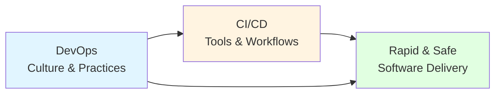

### 7.2 Continuous Integration (CI)

> **Definition:** CI is a software development practice where developers **frequently merge** their code changes into a **central repository**. **Automated builds and tests** are then run on these changes.

**Goals:**
- Detect and fix **integration issues early**
- Improve **software quality**
- Reduce **integration problems**
- Accelerate **delivery of new features**

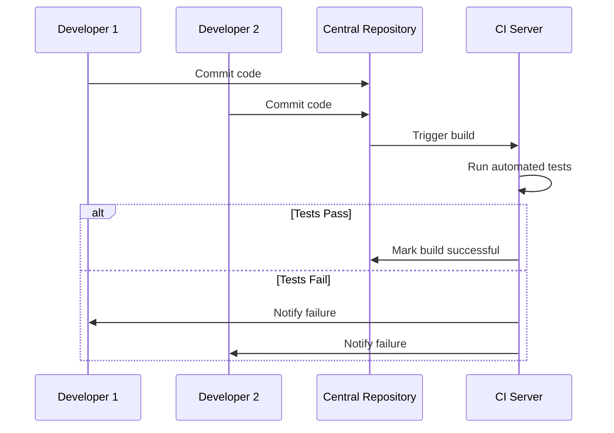

### 7.3 Continuous Delivery (CD)

> **Definition:** CD works **in conjunction with CI** to automate **infrastructure provisioning** and **application release** processes.

**Key Points:**
- Once code is **tested and built** (CI), CD takes over.
- Ensures the software is **packaged with everything it needs** to deploy to **any environment at any time**.
- Software is **always ready to deploy to production**.
- Deployments can be **triggered manually** or move to **continuous deployment** (automated).

### 7.4 Continuous Deployment

> **Definition:** A strategy where **code changes are released automatically** into the **production environment**.

**Key Points:**
- **Eliminates human intervention** for deployments.
- Teams **set criteria** for releases ahead of time.
- When criteria are **met and validated**, code is **deployed automatically**.
- Organizations become **more nimble**, getting features to users **faster**.

### 7.5 Important Relationship (Exam Critical!)

> **⚠️ Important:**
> - You **CAN** do **Continuous Integration** without Continuous Delivery or Deployment.
> - You **CANNOT** do **Continuous Delivery/Deployment** without **CI** in place.
>
> **Why?** It would be extremely difficult to deploy to production at any time if you aren't practicing CI fundamentals:
> - Integrating code to a shared repo
> - Automating testing and builds
> - Doing it all in **small batches daily**

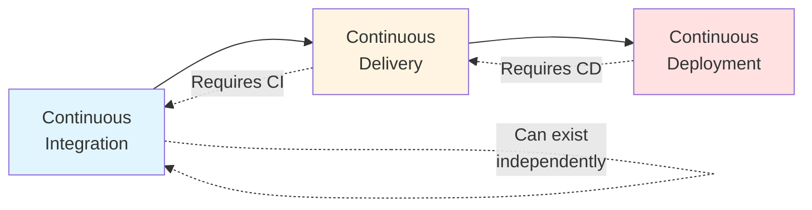

### 7.6 CI vs CD vs Continuous Deployment — Comparison

| **Aspect** | **Continuous Integration** | **Continuous Delivery** | **Continuous Deployment** |
|---|---|---|---|
| **Focus** | Merging & testing code | Preparing release-ready builds | Auto-releasing to production |
| **Automation Level** | Build + Test | Build + Test + Staging | Build + Test + Staging + Production |
| **Manual Step** | N/A | Manual approval for production | None |
| **Prerequisite** | Version control | CI | CI + CD |
| **Release Frequency** | Multiple times/day | On-demand | Every passing change |
| **Risk** | Low | Medium | Higher (but mitigated) |

---

## 8. CI/CD Pipeline

### 8.1 Definition

> A **CI/CD pipeline** is a **series of automated steps** that streamline the software development process, from **code changes to deployment**.

**Consists of 3 connected methodologies:**
1. Continuous Integration
2. Continuous Delivery
3. Continuous Deployment

### 8.2 Stages of CI/CD Pipeline

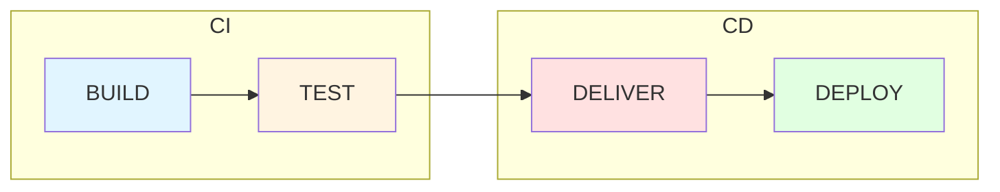

### 8.3 Stage 1: Build (CI Phase)

- **Part of Continuous Integration (CI).**
- Once code is pushed to a **version control system** (e.g., Git), the **CI server automatically compiles/builds** the code.
- Confirms that **integrated code** from multiple developers **can compile** and is ready for further validation.

**Example:**
> After a developer pushes a new feature to the repository, **Jenkins** or **GitHub Actions** triggers a build using **Maven** or **npm** to generate a deployable `.jar` or `.zip` file.

### 8.4 Stage 2: Test

- **Automated unit tests, integration tests, or API tests** run on the build output.
- Ensures the application **behaves correctly** and that **new code hasn't broken existing functionality**.
- **Failures stop the pipeline here.**

**Example:**
> After building a web app, **Jest** and **Selenium** test suites are run to check UI and backend API functionality.

### 8.5 Stage 3: Deliver (Continuous Delivery Phase)

- A **successfully tested build** is **packaged and delivered** to a **staging or pre-production environment**.
- Ready for **manual approval**.
- Confirms the app works in a **production-like environment**.
- Gives **stakeholders a chance to validate changes**.

**Example:**
> A **Docker image** is pushed to a **staging Kubernetes cluster** for final user acceptance testing.

### 8.6 Stage 4: Deploy (Continuous Deployment)

- **Automatically deploys** code to **production** after successful delivery — **without manual approval**.
- Enables **fast, low-risk, frequent releases**.
- **Eliminates delays** between development and deployment.

**Example:**
> Once staging tests pass, the app is **auto-deployed to AWS** using a **rolling deployment strategy** with **zero downtime**.

### 8.7 Full CI/CD Pipeline Flow

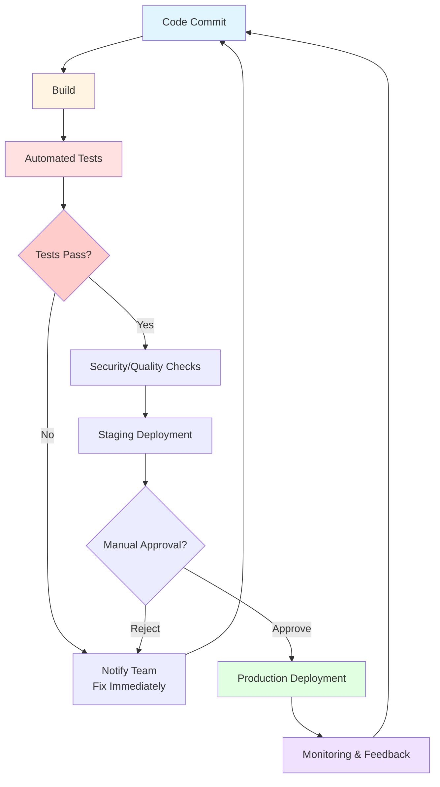

---

## 9. Common Tools Used in CI/CD Pipeline

| **Stage** | **Tools** | **Example** |
|---|---|---|
| **Build** | Git, Jenkins, Maven, Gradle, npm | After a developer pushes a new feature, **Jenkins** or **GitHub Actions** triggers a build using **Maven** or **npm** to generate a deployable `.jar` or `.zip`. |
| **Test** | JUnit, TestNG, Selenium, SonarQube | **Jenkins** runs automated unit tests using **JUnit** and performs UI tests with **Selenium**. **SonarQube** analyzes code quality and checks for bugs or code smells. |
| **Deliver** | Docker, GitHub Actions, JFrog Artifactory, Nexus | Once tests pass, the application is packaged into a **Docker container** and uploaded to **JFrog Artifactory** for storage, ready to be deployed. |
| **Deploy** | Kubernetes, Ansible, ArgoCD, Jenkins | **Ansible** automates configuration of staging servers. **Jenkins** or **ArgoCD** then deploys the Docker image to a **Kubernetes cluster** for production. |

### 9.1 Tool Categories

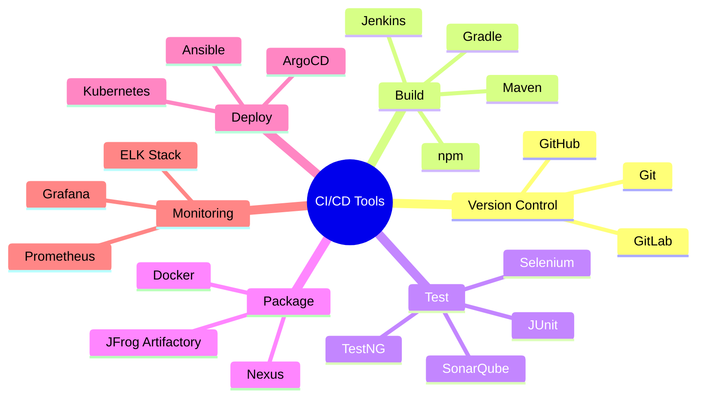

---

## 10. Application of CI/CD During Project Execution

### 10.1 Applying Continuous Integration

During **Project Execution**, CI can be implemented by:

1. **Developer commits code** to the repository.
2. **CI server automatically detects** the change.
3. **Automate application build** for every commit.
4. **Automated unit and integration tests** are executed.
5. **Set up notifications** — team is notified if build or tests fail.
6. **Defects fixed immediately** before additional changes are integrated.

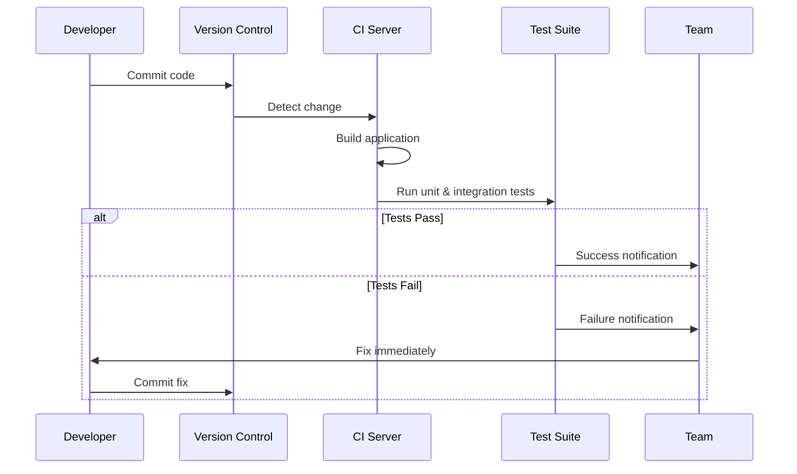

### 10.2 Applying Continuous Delivery

After successful CI checks, the application moves through an **automated delivery pipeline**:

- **Continuous Delivery:** A tested build is **automatically prepared** and made **ready for release**.
- **Continuous Deployment:** Configure the CD tool to take the **verified build artifact** and **push it to the hosting environment automatically**.

**Typical Agile Pipeline:**
```
Code Commit → Build → Automated Tests → Security/Quality Checks → Staging → Production
```

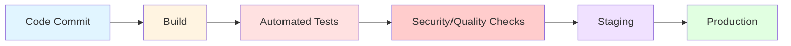

---

## 11. CI/CD Security — DevSecOps

### 11.1 What is CI/CD Security?

> **CI/CD security** focuses on **practices, processes, and technologies** that implement and manage **security and compliance measures** across the CI/CD pipeline.

**Background:**
- Security might **not keep up** with rapid releases as developers adopted Agile and DevOps practices.
- This spurred the evolution of **DevSecOps**.
- **DevSecOps** = **Dev**elopment + **Sec**urity + **Op**erations.
- DevSecOps **automates integrating security tools and practices** as they emerge within CI and CD pipelines.

### 11.2 How DevSecOps Functions

Security is **built into every stage** of the DevOps pipeline rather than being a **final step** at the end.

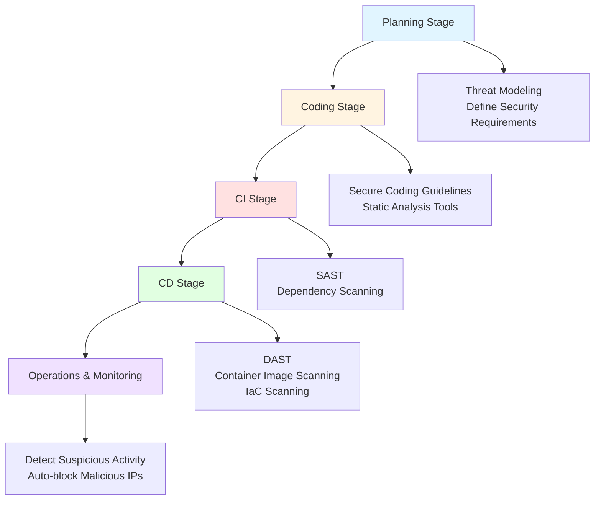

### 11.3 DevSecOps Activities by Stage

| **Stage** | **Activities** |
|---|---|
| **Planning** | • **Threat modeling** → identify potential risks early in design<br/>• **Define security requirements** alongside functional requirements |
| **Coding** | • **Secure coding guidelines** → train developers to avoid common vulnerabilities (SQL injection, XSS, etc.)<br/>• **Run static analysis tools** (e.g., SonarQube, ESLint security rules) before code is even committed |
| **CI (Continuous Integration)** | • **Static Application Security Testing (SAST)** → scans source code for vulnerabilities during build<br/>• **Dependency scanning** → checks third-party libraries for known security flaws |
| **CD (Continuous Delivery/Deployment)** | • **Dynamic Application Security Testing (DAST)** → tests the running app for security issues<br/>• **Container image scanning** → looks for vulnerabilities in Docker images before deploying<br/>• **Infrastructure as Code (IaC) scanning** → checks Terraform, Kubernetes YAML, etc., for insecure configurations |
| **Operations & Monitoring** | • Detects suspicious activity in live environments<br/>• Identify failed login attempts, unusual API calls<br/>• Auto-block malicious IPs or isolate compromised services |

> **Exam Tip:** Know the difference between **SAST** (static, source code) and **DAST** (dynamic, running app). SAST = white-box, DAST = black-box.

### 11.4 SAST vs DAST

| **Aspect** | **SAST** | **DAST** |
|---|---|---|
| **Full Form** | Static Application Security Testing | Dynamic Application Security Testing |
| **What it tests** | Source code | Running application |
| **When** | During build (CI) | During delivery/deployment (CD) |
| **Approach** | White-box | Black-box |
| **Finds** | Code-level vulnerabilities | Runtime vulnerabilities |
| **Examples** | SonarQube, Checkmarx | OWASP ZAP, Burp Suite |

---

## 12. Infrastructure as Code (IaC)

### 12.1 Definition

> **Infrastructure as Code (IaC)** is a DevOps practice that **automates the provisioning and management** of IT infrastructure by using **configuration files** rather than **manual processes**.

- IaC treats **infrastructure as software**.
- Teams use IaC to **version, test, and deploy infrastructure** using the **same practices** they use for application code.

### 12.2 Traditional vs IaC Approach

| **Aspect** | **Traditional Manual Configuration** | **Infrastructure as Code** |
|---|---|---|
| **Setup** | Individual server setup | Configuration files |
| **Management** | Console-based management | Version-controlled files |
| **Changes** | Often undocumented | Tracked, reviewed, rollback-able |
| **Speed** | Slow, error-prone | Fast, repeatable |
| **Consistency** | Inconsistent | Consistent |
| **Scalability** | Manual scaling | Automated scaling |

### 12.3 How IaC Works

In practicing IaC, teams:
1. **Define infrastructure requirements** in configuration files.
2. Specify resources needed — **servers, networks, databases, security policies**.
3. Specify **how to configure** them.
4. These files **live in version control systems**.
5. Provides **tracking, review, and rollback capabilities**.

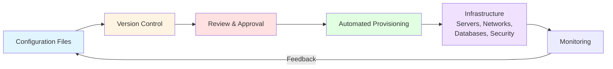

### 12.4 Benefits of IaC

- ✅ **Bypasses traditional manual configuration** (cumbersome, error-prone)
- ✅ **Eliminates undocumented changes**
- ✅ **Version control** for infrastructure
- ✅ **Review and rollback** capabilities
- ✅ **Consistency** across environments
- ✅ **Faster provisioning**
- ✅ **Scalability**

### 12.5 IaC Example (Terraform Pseudocode)

```hcl
# Example: Terraform configuration for AWS EC2 instance
resource "aws_instance" "web_server" {
  ami           = "ami-0c55b159cbfafe1f0"
  instance_type = "t2.micro"
  
  tags = {
    Name = "WebServer"
    Environment = "Production"
  }
}

# Example: Kubernetes YAML for deployment
apiVersion: apps/v1
kind: Deployment
metadata:
  name: my-app
spec:
  replicas: 3
  selector:
    matchLabels:
      app: my-app
  template:
    metadata:
      labels:
        app: my-app
    spec:
      containers:
      - name: my-app
        image: my-app:latest
        ports:
        - containerPort: 8080
```

### 12.6 Popular IaC Tools

| **Tool** | **Type** | **Use Case** |
|---|---|---|
| **Terraform** | Declarative | Multi-cloud provisioning |
| **Ansible** | Procedural | Configuration management |
| **Puppet** | Declarative | Configuration management |
| **Chef** | Procedural | Configuration management |
| **CloudFormation** | Declarative | AWS-specific provisioning |
| **Pulumi** | Declarative | Multi-cloud with general-purpose languages |

---

## 13. Advantages and Disadvantages of DevOps

### 13.1 Advantages

| **Advantage** | **Description** |
|---|---|
| **Faster Delivery** | Shortened development lifecycle, frequent releases |
| **Improved Quality** | Automated testing, early bug detection |
| **Better Collaboration** | Breaks down silos, shared responsibility |
| **Increased Efficiency** | Automation reduces manual work |
| **Scalability** | Easy to scale infrastructure and teams |
| **Reliability** | Consistent environments, monitoring |
| **Customer Satisfaction** | Faster feedback, quicker feature delivery |
| **Reduced Costs** | Less downtime, fewer manual errors |

### 13.2 Disadvantages / Challenges

| **Challenge** | **Description** |
|---|---|
| **Cultural Resistance** | Teams may resist change from traditional silos |
| **Tool Complexity** | Many tools to learn and integrate |
| **Initial Investment** | High setup cost (time, money, training) |
| **Security Concerns** | Rapid releases can introduce vulnerabilities |
| **Legacy Systems** | Hard to integrate with old infrastructure |
| **Skill Gap** | Requires broad skill set (Dev + Ops + Security) |
| **Monitoring Overhead** | Continuous monitoring needed |

---

## 14. Real-World Examples and Analogies

### 14.1 Analogy: Restaurant Kitchen

- **Traditional Model:** Chef cooks, waiter serves, manager handles complaints — no communication. Orders get cold, mistakes happen.
- **DevOps Model:** Chef, waiter, and manager work together. Orders are taken, cooked, served, and feedback is used to improve — all in a continuous loop.

### 14.2 Real-World Use Cases

| **Company** | **DevOps Practice** | **Result** |
|---|---|---|
| **Netflix** | Chaos Engineering, CI/CD | Thousands of deployments per day |
| **Amazon** | Continuous Deployment | Deploys every 11.7 seconds on average |
| **Etsy** | Continuous Deployment | 50+ deployments per day |
| **Facebook** | CI/CD, Feature Flags | Multiple deployments per day |
| **Google** | SRE, DevOps | High reliability, rapid releases |

---

## 15. Exam Tips

> **📝 Exam Tips — Commonly Asked Questions:**

1. **Define DevOps.** Why is it considered a culture rather than just a tool?
2. **Explain the traditional IT model** and why DevOps emerged as a solution.
3. **Differentiate between CI, Continuous Delivery, and Continuous Deployment.** (Very common!)
4. **Can you have CD without CI?** Explain why or why not.
5. **List and explain the stages of a CI/CD pipeline.**
6. **What is DevSecOps?** How does it differ from DevOps?
7. **Explain SAST vs DAST** with examples.
8. **What is Infrastructure as Code?** List its benefits.
9. **Describe the DevOps lifecycle** with a diagram.
10. **What are the key responsibilities of Operations teams** in the traditional model?
11. **Why is automation essential in DevOps?**
12. **Name common tools** used in each stage of the CI/CD pipeline.

> **⚠️ Tricky Concepts:**
> - **CI without CD is possible; CD without CI is NOT.**
> - **DevSecOps** is not a separate practice — it's DevOps with security integrated.
> - **Continuous Delivery** ≠ **Continuous Deployment** (manual approval vs automated).
> - **IaC** treats infrastructure as **software** — versioned, tested, deployed.
> - **Shift Left** means moving testing/security **earlier** in the lifecycle.

---

## 16. Common Interview Questions

1. **What is the difference between DevOps and Agile?**
   - *Answer:* Agile focuses on software development (iterative, incremental). DevOps extends Agile to include operations, emphasizing collaboration, automation, and continuous delivery.

2. **How does CI/CD improve software quality?**
   - *Answer:* Automated testing catches bugs early, frequent integration reduces merge conflicts, and continuous feedback enables rapid fixes.

3. **What is the role of version control in DevOps?**
   - *Answer:* Version control is the foundation — it tracks changes, enables collaboration, and triggers CI/CD pipelines.

4. **Explain the concept of "Shift Left" in DevOps.**
   - *Answer:* Moving testing and security earlier in the development process to catch issues when they're cheaper and easier to fix.

5. **What is the difference between a build and a release?**
   - *Answer:* A **build** is the compiled code artifact. A **release** is the process of making that build available to users.

6. **How do you handle secrets in a CI/CD pipeline?**
   - *Answer:* Use secret management tools (HashiCorp Vault, AWS Secrets Manager), environment variables, and never hardcode secrets in code.

7. **What is blue-green deployment?**
   - *Answer:* A deployment strategy with two identical environments (blue and green). Traffic is switched from one to the other, enabling zero-downtime releases and easy rollback.

8. **What is canary deployment?**
   - *Answer:* Releasing to a small subset of users first, then gradually rolling out to everyone if no issues arise.

9. **How does IaC help with disaster recovery?**
   - *Answer:* Infrastructure can be re-provisioned quickly from configuration files, reducing recovery time.

10. **What metrics are used to measure DevOps success?**
    - *Answer:* DORA metrics — Deployment Frequency, Lead Time for Changes, Mean Time to Recovery (MTTR), Change Failure Rate.

---

## 17. Summary

### Key Takeaways

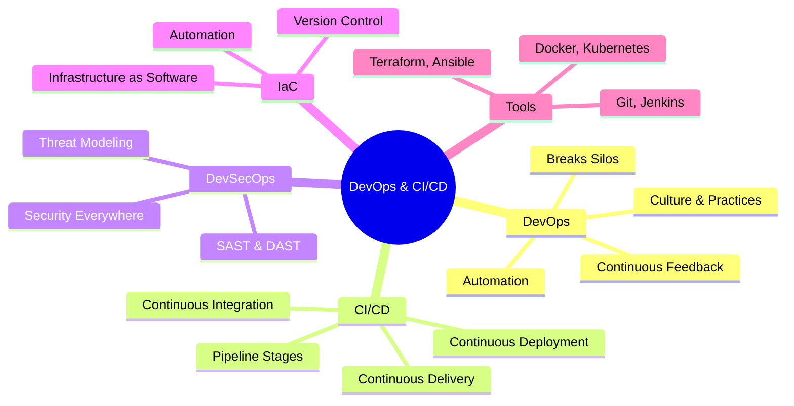

### One-Page Recap

- **DevOps** = **Dev** + **Ops** — a culture of collaboration, automation, and continuous delivery.
- **Traditional model** had silos → slow, error-prone releases.
- **CI** = frequent code integration + automated builds/tests.
- **CD (Delivery)** = always ready to deploy, manual approval.
- **CD (Deployment)** = fully automated release to production.
- **CI/CD Pipeline** = Build → Test → Deliver → Deploy.
- **DevSecOps** = security integrated into every stage (SAST, DAST, scanning).
- **IaC** = infrastructure managed as code (versioned, tested, repeatable).
- **Automation** is the backbone of DevOps — reduces errors, speeds delivery.
- **Tools** vary by stage: Git, Jenkins, Maven, JUnit, Selenium, Docker, Kubernetes, Ansible, Terraform.

> **Final Exam Tip:** Always connect DevOps back to **Agile principles** — iterative development, customer collaboration, and responding to change. DevOps is the **operational extension of Agile**.

---

## 18. References & Further Reading

- **The DevOps Handbook** — Gene Kim, Jez Humble