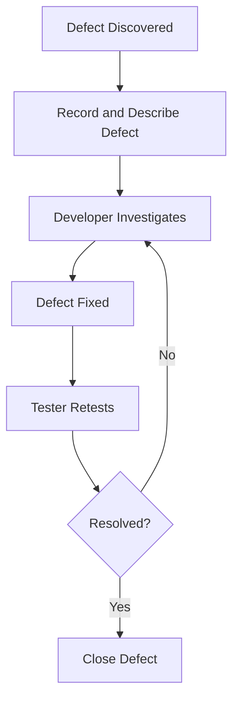
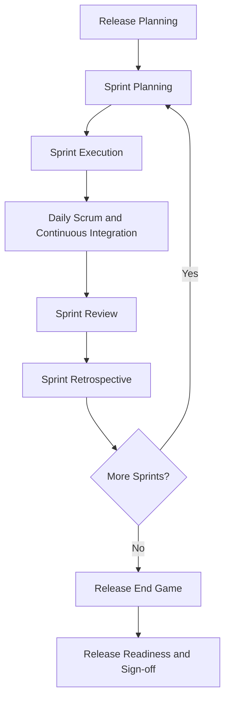
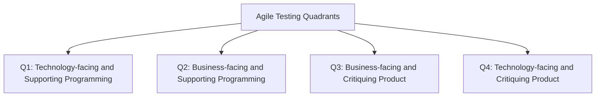
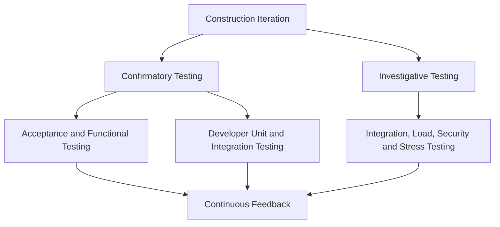
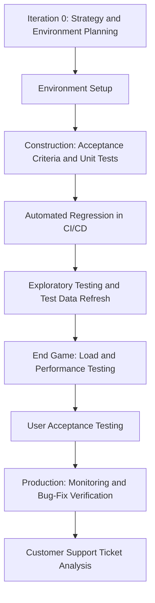

# Agile Testing Introduction
> **Source:** `18 - Agile Testing Introduction.pdf`  
> **Coverage:** 21 pages  
> **Purpose:** Exam preparation, assignments, interviews, and revision.

---

## 1. Introduction to Agile Testing

### Definition

**Agile testing** is the approach and set of practices used to test software within an Agile development environment.

The central idea is that testing is **not a separate phase performed only after development**. Instead, testing is integrated throughout the software development lifecycle and happens alongside development.

### Core Characteristics

- **Iterative:** Work is completed in short cycles.
- **Continuous:** Testing occurs throughout development.
- **Collaborative:** Developers, testers, business analysts, product owners, and stakeholders work toward shared quality goals.
- **Customer-focused:** Testing checks whether the product satisfies customer requirements.
- **Feedback-driven:** Findings are communicated quickly so that changes can be made early.
- **Adaptable:** Testing responds to changing requirements and evolving product increments.

### Why Agile Testing Matters

Agile testing helps teams:

1. Deliver workable product increments quickly.
2. Detect defects earlier.
3. Improve design and implementation through repeated feedback.
4. Confirm alignment between code and customer requirements.
5. Improve customer satisfaction through continuous validation.

---

## 2. Main Principles of Agile Testing

The PDF identifies the following principles.

| Principle | Explanation |
|---|---|
| Shortened Feedback Iteration | Feedback is collected in short cycles so that problems can be corrected early. |
| Concurrent Development and Testing | Development and testing occur together rather than in isolated phases. |
| Involvement of All Team Members | Quality is a shared responsibility across the Agile team. |
| Lightweight Documentation | Documentation is useful and focused, avoiding unnecessary overhead. |
| Clean Code | Code should remain understandable, maintainable, and easy to test. |
| Continuous Feedback Loop | Test results and stakeholder feedback continuously influence development. |
| Customer Involvement and Satisfaction | Customers and stakeholders help validate whether the product meets expectations. |

### Exam Point

Agile testing changes the question from:

> “When does testing start?”

to:

> “How can the team continuously build quality into every increment?”

---

## 3. Main Testing Activities in Agile

### 3.1 Requirement Analysis

Testers collaborate with business analysts and product owners to understand the requirements of a new feature.

Activities include:

- Understanding the intended business behavior.
- Identifying ambiguities and missing details.
- Clarifying acceptance criteria.
- Recognizing risks and edge cases.

### 3.2 Test Design

Testers design test cases and scenarios for the feature.

This may include:

- Positive test cases.
- Negative test cases.
- Boundary-value scenarios.
- Business-rule validation.
- Integration scenarios.
- Acceptance scenarios.

### 3.3 Test Execution

Testers execute the planned tests and report defects.

Execution can involve:

- Manual testing.
- Automated testing.
- Functional testing.
- Integration testing.
- Regression testing.
- Exploratory testing.

### 3.4 Defect Management

Testers work with developers to identify, communicate, track, and verify defects.

A typical defect workflow is:

### 3.5 Release Management

Testers contribute to planning and executing releases.

Their responsibilities may include:

- Checking release readiness.
- Supporting final regression testing.
- Reporting outstanding defects.
- Supporting acceptance and release decisions.
- Contributing to final test reports.

---

## 4. Agile Testing Life Cycle

### Definition

The **Agile Testing Life Cycle** describes how testing activities are organized and performed within Agile work.

It is:

- Iterative.
- Performed alongside development.
- Connected to Agile sprints.
- Focused on when and how testing activities fit into the sprint workflow.

It should be understood as both a timeline and a set of recurring testing activities.

### Agile Testing Life Cycle in Scrum

| Scrum Stage | Testing Stage | Main Activities |
|---|---|---|
| Release Planning | Impact Assessment | Define scope, objectives, high-level test strategy, and acceptance criteria. |
| Sprint Planning | Test Planning | Break user stories into test conditions, identify risks, and prepare acceptance scenarios. |
| Sprint Execution | Test Design and Implementation | Create test cases, prepare test data, configure environments, and automate where possible. |
| Daily Scrum and Continuous Integration | Daily Test Execution | Run functional, integration, regression, and exploratory tests. Feed defects back immediately. |
| Sprint Review | Test Review / Final Sprint Execution | Demonstrate tested features, confirm acceptance criteria, and gather feedback. |
| Sprint Retrospective | Test Closure for Sprint | Wrap up documentation, record lessons learned, and update the test repository. |
| Release End Game | Release Readiness | Perform full regression, performance, security, and UAT; prepare reports, sign-off, and defect triage. |

### Process Diagram

### Important Observation

Testing is not postponed until the end of a sprint. Test design, execution, defect feedback, and automation occur during development.

---

## 5. Agile Testing Quadrants

### Definition

Agile Testing Quadrants are a visual framework for organizing different types of quality assurance tests.

They distinguish testing according to:

1. **Business-facing versus technology-facing** concerns.
2. Testing that **supports programming** versus testing that **critiques or evaluates the product**.

The four quadrants are Q1, Q2, Q3, and Q4.

### Quadrant Overview

| Quadrant | Orientation | Main Purpose | Typical Tests |
|---|---|---|---|
| Q1 | Technology-facing, supports programming | Provide rapid feedback about code and components | Unit tests, component tests, code review, API testing, smoke tests, TDD, integration testing |
| Q2 | Business-facing, supports programming | Validate business behavior and support product construction | Functional testing, regression testing, end-to-end flow testing, business logic testing, usability checks |
| Q3 | Business-facing, critiques the product | Obtain feedback about usability, suitability, and real-world behavior | Exploratory testing, usability testing, UAT, complex scenario testing, accessibility testing, alpha/beta testing |
| Q4 | Technology-facing, critiques the product | Evaluate quality attributes and technical risks | Performance testing, security testing, reliability/recovery testing, interoperability testing, installation verification, compatibility testing |

> **Note:** The PDF lists some activities in quadrant examples that may vary by organizational interpretation. Use the classification shown in the source for exam preparation.

### 5.1 Q1 — Unit and Component Testing

Q1 tests are usually repeated and automated.

They provide ongoing feedback to developers about code quality.

Examples:

- Unit testing.
- Component testing.
- Code review.
- API testing.
- Smoke testing.
- Test-driven development.
- Integration testing.

### 5.2 Q2 — Business-Facing Tests Supporting Construction

Q2 combines manual and automated tests.

These tests are customer-focused but also help the team build the application correctly.

Examples:

- Functional testing.
- Regression testing.
- End-to-end flow testing.
- Business logic testing.
- Usability checks.

### 5.3 Q3 — Business-Facing Tests That Critique the Product

Q3 tests are often manual and involve experienced QA professionals or end users.

The goal is to discover problems and gather feedback about whether the product is fit for purpose.

Examples:

- Exploratory testing.
- In-depth usability testing.
- User Acceptance Testing.
- Complex scenario testing.
- Accessibility testing.
- Alpha and beta testing.

### 5.4 Q4 — Technology-Facing Tests That Critique the Product

Q4 focuses on technical quality attributes and system risks.

Examples:

- Performance testing.
- Security testing.
- Reliability and disaster-recovery testing.
- Interoperability testing.
- Installation and infrastructure/deployment verification.
- Compatibility testing.

### Quadrant Diagram

---

## 6. Agile Testing Strategy

### Definition

The Agile Testing Strategy described in the PDF is a **time-phased approach** that plans testing activities across the entire Agile project lifecycle, not only inside one sprint.

The source identifies four broad phases:

1. Iteration 0.
2. Construction.
3. End Game.
4. Production.

### Purpose

The strategy helps the team decide:

- When testing activities should occur.
- What type of testing is needed at each stage.
- Which resources and environments must be prepared.
- How testing evolves from setup to production monitoring.

---

## 7. Iteration 0

### Definition

Iteration 0 is the initial preparation stage of Agile testing.

It establishes the foundation required for effective testing later.

### Main Activities

- Set up the testing environment.
- Assemble the testing team.
- Prepare necessary resources.
- Verify the business case.
- Verify boundary conditions.
- Confirm project scope.
- Summarize key requirements and use cases.
- Conduct initial project valuation.
- Perform risk assessment.

### Why Iteration 0 Is Important

Without adequate preparation, later testing may be slowed by:

- Missing environments.
- Unclear scope.
- Incomplete requirements.
- Unidentified risks.
- Lack of test resources.

---

## 8. Construction Iteration

### Definition

The Construction Iteration is the core phase in which most Agile testing activities occur.

Testing is continuous and integrated with construction. It is not postponed until the end.

The PDF divides construction testing into two broad categories:

1. Confirmatory Testing.
2. Investigative Testing.

### 8.1 Confirmatory Testing

Confirmatory testing checks whether the system meets stakeholder requirements.

It includes:

#### Agile Acceptance Testing

- Combines acceptance testing and functional testing.
- May be performed by the development team and stakeholders.
- Checks whether features satisfy business needs.

#### Developer Testing

- Includes unit testing.
- Includes integration testing.
- Validates application code and database schema.

### 8.2 Investigative Testing

Investigative testing searches for potential problems that confirmatory testing may miss.

It includes:

- Integration testing.
- Load testing.
- Security testing.
- Stress testing.

Its purpose is to uncover deeper issues and improve robustness.

### Construction Model

---

## 9. Release — End Game

### Definition

The Release or End Game is the transition phase in which the team concentrates on full-system testing and release preparation.

### Main Activities

- Perform rigorous system testing.
- Address defect stories.
- Finalize system documentation.
- Train end users.
- Support operational teams.
- Support product-release marketing.
- Establish backup and restoration procedures.
- Conduct release readiness activities.

### Key Idea

The End Game is not the first time testing happens. It is a phase of broader final validation and release preparation after continuous testing during construction.

---

## 10. Production

### Definition

Production is the final phase in the strategy described in the PDF.

The product is completed, refined, and prepared for deployment and end-user use.

### Main Activities

- Address identified defects and issues.
- Finalize the product.
- Prepare for deployment.
- Ensure the product is operational.
- Confirm readiness for end users.

The broader activity list also identifies post-production monitoring and bug-fix verification as production-related work.

---

## 11. Test Types, Primary Phases, and Quadrants

| Test Type | Primary Phase | Reason / Timing | Quadrant |
|---|---|---|---|
| Unit Testing | Construction | Performed as code is developed to validate individual modules. | Q1 |
| Integration Testing | Construction | Performed continuously after unit testing to verify modules work together. | Q1 |
| System Testing | Construction | Performed when a full build or major increment is available. | Q1/Q2 |
| Regression Testing | Construction and End Game | Repeated after changes and critical before release. | Q1/Q2 |
| Performance Testing | Construction and sometimes End Game | Begins after significant functionality exists; final tuning may occur near release. | Q4 |
| Security Testing | Construction and sometimes End Game | Initial checks begin after major flows are implemented; deeper testing may occur near release. | Q4 |
| Usability Testing | Construction | Can begin with prototypes and continue as the UI changes. | Q3 |
| Exploratory Testing | Construction | Unscripted testing used to explore software and identify issues. | Q3 |
| Compatibility Testing | Construction and sometimes End Game | Checks cross-platform and browser support; final pass may occur before release. | Q4 |
| Acceptance Testing / UAT | End Game | Validates the system against business requirements near release. | Q3 |
| Alpha/Beta Testing | End Game / Production | Alpha occurs before release; beta occurs with limited users in production. | Source lists Q4 |
| Installation Testing | End Game | Checks smooth deployment before handover. | Q4 |
| Recovery/Failover Testing | End Game / Production | Simulated near release and monitored in live environments. | Q4 |

> **Source caution:** The PDF places Alpha/Beta Testing under Q4 in its table, although earlier quadrant descriptions associate alpha/beta testing with Q3. Preserve this distinction as a source inconsistency rather than silently resolving it.

---

## 12. Typical Ordering of Agile Testing Activities

The PDF asks learners to arrange activities in the order in which they typically happen, while recognizing overlap.

### Phase-Based Ordering

#### Iteration 0

1. Test Strategy and Environment Planning.
2. Test Environment Setup and Configuration.

#### Construction Iteration

3. Defining Acceptance Criteria for User Stories.
4. Creating Unit Tests.
5. Integrating Automated Regression Tests into CI/CD.
6. Exploratory Testing on Incremental Builds.
7. Test Data Refresh.

#### Release — End Game

8. Load and Performance Testing on the Release Candidate.
9. User Acceptance Testing.

#### Production

10. Post-Production Monitoring and Bug-Fix Verification.
11. Customer Support Ticket Analysis.

### Important Note

These activities do not always occur in a rigid, linear order. Agile testing contains overlap and repetition. For example:

- Acceptance criteria can be refined during development.
- Regression automation can run repeatedly in CI/CD.
- Exploratory testing can occur on multiple increments.
- Test data may be refreshed whenever needed.
- Monitoring and support analysis continue after release.

### Timeline Diagram

---

## 13. Classification of Activities into Q1–Q4

The PDF classifies the following activities.

### Q1 — Technology-Facing and Supporting Programming

- Unit testing for core business logic.
- Testing REST API contracts.
- Pairing with developers for test automation scripting.

### Q2 — Business-Facing and Supporting Programming

- Automated regression testing.
- Prototyping and testing wireframes with stakeholders.
- Functional test automation.

### Q3 — Business-Facing and Critiquing the Product

- User Acceptance Testing with real scenarios.
- Exploratory testing to identify unknown risks.
- Beta testing with pilot users.

### Q4 — Technology-Facing and Critiquing the Product

- Security penetration testing.
- Load and performance testing.
- Compatibility and cross-browser testing.

### Classification Table

| Activity | Quadrant | Reason |
|---|---|---|
| Unit testing for core business logic | Q1 | Gives rapid technical feedback on code. |
| REST API contract testing | Q1 | Supports technical correctness of interfaces. |
| Pairing with developers for automation scripting | Q1 | Supports programming and automation. |
| Automated regression testing | Q2 | Supports business behavior validation and construction. |
| Wireframe prototyping with stakeholders | Q2 | Business-facing activity that supports building the product. |
| Functional test automation | Q2 | Checks expected business functionality. |
| UAT with real scenarios | Q3 | Critiques product suitability from a business/user perspective. |
| Exploratory testing | Q3 | Investigates unknown risks and product behavior. |
| Beta testing with pilot users | Q3 | Collects user-oriented product feedback. |
| Security penetration testing | Q4 | Evaluates technical security risks. |
| Load and performance testing | Q4 | Evaluates technical performance characteristics. |
| Compatibility testing | Q4 | Evaluates technical behavior across environments. |

---

## 14. Relationship Between Life Cycle, Quadrants, and Strategy

The PDF highlights three important aspects.

### 14.1 Life Cycle

The **life cycle** describes the steps testers follow while working in Agile.

It focuses on the flow of testing activities through Scrum events and sprint work.

### 14.2 Quadrants

The **quadrants** describe the categories of testing that should be included.

They help ensure that teams consider:

- Code-level quality.
- Business functionality.
- User experience and suitability.
- Technical quality attributes.

### 14.3 Strategy

The **strategy** describes when testing happens across the entire project:

> Iteration 0 → Construction → End Game → Production

### Comparison Table

| Concept | Main Question Answered |
|---|---|
| Agile Testing Life Cycle | What testing activities happen during Agile work and sprint events? |
| Agile Testing Quadrants | What categories of tests should be considered? |
| Agile Testing Strategy | When should testing activities occur across the project lifecycle? |

---

## 15. Practical Example: Agile Testing for an Online Shopping Feature

Consider a feature: **“A customer can add an item to a shopping cart.”**

### Iteration 0

- Prepare the test environment.
- Identify dependencies such as product inventory and payment services.
- Review project scope and risks.

### Construction

- Define acceptance criteria.
- Write unit tests for cart quantity and price calculations.
- Test API contracts.
- Perform functional tests for adding and removing items.
- Run regression tests in CI/CD.
- Perform exploratory testing for unusual quantities and unavailable products.

### End Game

- Run full regression testing.
- Perform load testing for high shopping traffic.
- Execute UAT with realistic customer scenarios.
- Validate deployment and installation procedures.

### Production

- Monitor cart-related failures.
- Analyze customer support tickets.
- Verify fixes in subsequent releases.

---

## 16. Advantages of Agile Testing

The PDF emphasizes integration, iteration, collaboration, and continuous feedback. Based on those stated characteristics, the practical advantages include:

1. **Early defect detection:** Problems can be found close to the time they are introduced.
2. **Rapid feedback:** Developers receive information quickly.
3. **Improved collaboration:** Quality becomes a shared team responsibility.
4. **Better customer alignment:** Acceptance criteria and stakeholder feedback guide development.
5. **Adaptability:** Testing can respond to changing requirements.
6. **Continuous quality improvement:** Repeated testing and retrospectives support learning.
7. **Reduced release surprises:** Continuous validation can reduce the number of issues discovered only at the end.

---

## 17. Challenges and Considerations

The source does not provide a dedicated list of disadvantages, but the described process implies several practical considerations:

- Test environments must be available early.
- Automation requires maintenance.
- Teams need close communication.
- Changing requirements may require test updates.
- Test data must be managed and refreshed.
- Performance and security testing should not be postponed excessively.
- Release readiness requires coordination across technical and business stakeholders.

These are practical implications of the Agile approach, not a separately enumerated list in the PDF.

---

## 18. Common Exam Questions

### Short-Answer Questions

1. Define Agile testing.
2. Why is Agile testing not considered a separate phase?
3. List the main principles of Agile testing.
4. Explain requirement analysis in Agile testing.
5. What is the purpose of defect management?
6. Define the Agile Testing Life Cycle.
7. What happens during sprint planning from a testing perspective?
8. What are Agile Testing Quadrants?
9. Differentiate Q1 and Q4.
10. What is Iteration 0?
11. Explain confirmatory and investigative testing.
12. What is the purpose of the Release End Game?
13. What testing activities occur in Production?
14. Differentiate Agile testing life cycle, quadrants, and strategy.

### Long-Answer Questions

1. Explain the Agile Testing Life Cycle in Scrum with a suitable diagram.
2. Describe the four Agile Testing Quadrants with examples.
3. Explain the Agile Testing Strategy from Iteration 0 to Production.
4. Discuss confirmatory and investigative testing during Construction Iteration.
5. Explain how testing activities are distributed across the Agile project lifecycle.
6. Classify different testing activities into Q1, Q2, Q3, and Q4.
7. Describe the relationship between Agile testing principles and customer satisfaction.
8. Explain the typical order of Agile testing activities and why overlap occurs.

---

## 19. Interview Questions and Answer Points

### Q1. How is Agile testing different from traditional testing?

**Answer points:**

- Agile testing is integrated throughout development.
- It is iterative and continuous.
- Testers collaborate closely with developers and stakeholders.
- Feedback is delivered rapidly.
- Traditional approaches may separate development and testing into distinct phases, depending on the model.

### Q2. Why are acceptance criteria important?

They define the conditions that a feature must satisfy and help testers create test conditions and acceptance scenarios.

### Q3. Why is regression testing performed repeatedly?

Because changes to the codebase can affect existing behavior. Repeated regression testing checks that previously working features remain functional.

### Q4. What is the purpose of the Agile Testing Quadrants?

They help teams organize testing across technical/business perspectives and construction/critique purposes.

### Q5. What is the difference between confirmatory and investigative testing?

- Confirmatory testing checks whether the system meets known requirements.
- Investigative testing explores potential issues that may not be found by predefined checks.

### Q6. Why should performance and security testing begin before the final release?

The source places initial performance and security work in Construction, with deeper or final testing sometimes occurring in End Game. Starting earlier provides time to identify and address technical risks.

---

## 20. Quick Revision Sheet

### Agile Testing in One Sentence

Agile testing is iterative, collaborative, continuous testing integrated with Agile development to provide fast feedback and ensure customer-focused quality.

### Principles

- Short feedback iterations.
- Concurrent development and testing.
- Whole-team involvement.
- Lightweight documentation.
- Clean code.
- Continuous feedback.
- Customer involvement and satisfaction.

### Main Activities

- Requirement analysis.
- Test design.
- Test execution.
- Defect management.
- Release management.

### Scrum Testing Flow

Release Planning → Sprint Planning → Sprint Execution → Daily Testing/CI → Sprint Review → Retrospective → Release End Game.

### Quadrants

- **Q1:** Technology-facing, supports programming.
- **Q2:** Business-facing, supports programming.
- **Q3:** Business-facing, critiques the product.
- **Q4:** Technology-facing, critiques the product.

### Strategy

Iteration 0 → Construction → End Game → Production.

### Construction Categories

- Confirmatory testing.
- Investigative testing.

---

## 21. Source-Based Cautions

1. The PDF classifies Alpha/Beta Testing as Q4 in the test-type table, while the earlier quadrant list places Alpha/Beta Testing under Q3. This is an inconsistency in the source.
2. Some testing categories can overlap in real Agile teams. For example, regression testing may be automated, manual, business-facing, or technical depending on the specific test.
3. The PDF provides concise descriptions. Explanatory examples in these notes are included to make the concepts easier to understand and apply; they should not be mistaken for additional statements explicitly present in the slides.

---

## 22. Final Summary

Agile testing integrates quality activities throughout the Agile lifecycle instead of treating testing as a final stage. Its main principles emphasize short feedback cycles, concurrent development and testing, whole-team responsibility, lightweight documentation, clean code, continuous feedback, and customer satisfaction.

The Agile Testing Life Cycle explains testing activities within Scrum events. Agile Testing Quadrants organize tests into four categories based on business/technology orientation and whether they support programming or critique the product. The Agile Testing Strategy organizes testing across the project timeline: Iteration 0, Construction, End Game, and Production.

A strong Agile testing approach therefore combines:

- Early preparation.
- Continuous developer and tester collaboration.
- Automated and manual testing.
- Confirmatory and investigative testing.
- Business and technical validation.
- Release readiness activities.
- Production monitoring and feedback.
