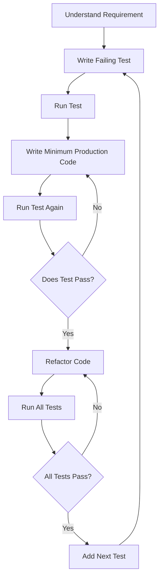
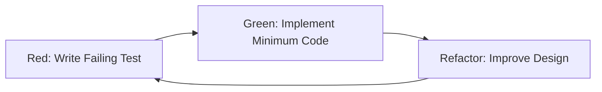
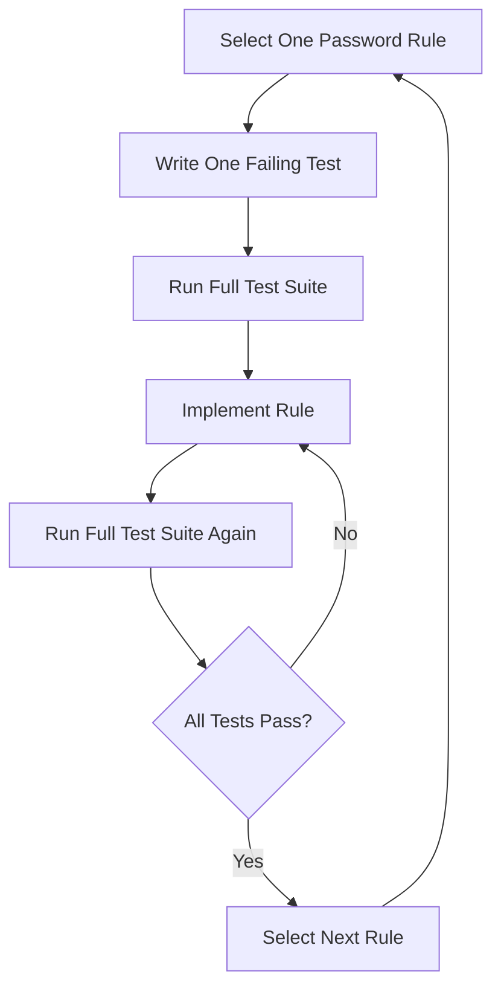
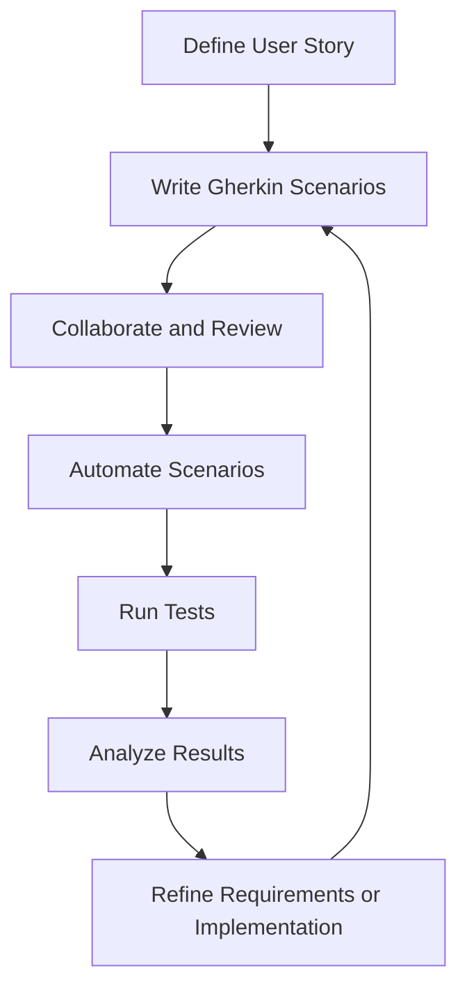
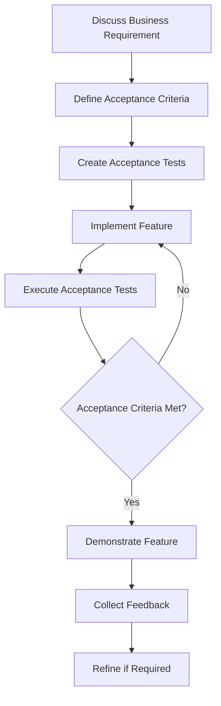
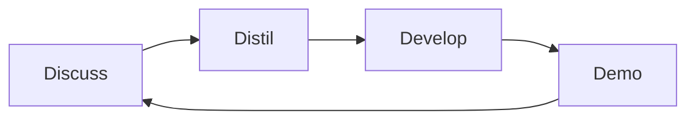
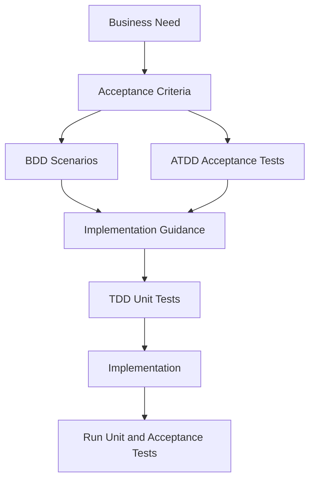
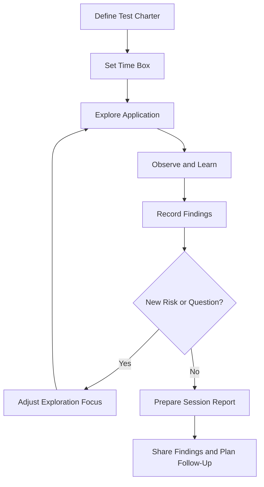

# Agile Testing Methodologies
## Comprehensive Master's-Level Notes

> **Source:** 19 - Agile Testing Methodologies.pdf  
> **Coverage:** 43 pages  
> **Purpose:** Master's-level exam preparation, assignments, interviews, and future reference.
>
> **Source-handling note:** These notes follow the terminology, examples, workflows, and comparisons presented in the PDF. Additional explanations are included to improve conceptual understanding and are not presented as direct quotations from the source.

---

# Table of Contents

1. [Introduction to Agile Testing](#1-introduction-to-agile-testing)
2. [Test-Driven Development (TDD)](#2-test-driven-development-tdd)
3. [TDD Process: Red-Green-Refactor](#3-tdd-process-red-green-refactor)
4. [Benefits and Limitations of TDD](#4-benefits-and-limitations-of-tdd)
5. [TDD Example: Calculator](#5-tdd-example-calculator)
6. [TDD Frameworks](#6-tdd-frameworks)
7. [TDD Example: Password Creation](#7-tdd-example-password-creation)
8. [Behavior-Driven Development (BDD)](#8-behavior-driven-development-bdd)
9. [BDD Process and Gherkin](#9-bdd-process-and-gherkin)
10. [BDD Example: Café Ordering System](#10-bdd-example-café-ordering-system)
11. [Acceptance Test-Driven Development (ATDD)](#11-acceptance-test-driven-development-atdd)
12. [ATDD Cycle](#12-atdd-cycle)
13. [ATDD Example: Shopping Cart](#13-atdd-example-shopping-cart)
14. [TDD vs BDD vs ATDD](#14-tdd-vs-bdd-vs-atdd)
15. [Exploratory Testing](#15-exploratory-testing)
16. [Types of Exploratory Testing](#16-types-of-exploratory-testing)
17. [When to Use Exploratory Testing](#17-when-to-use-exploratory-testing)
18. [Benefits and Principles of Exploratory Testing](#18-benefits-and-principles-of-exploratory-testing)
19. [Latest Testing Evolution](#19-latest-testing-evolution)
20. [Exam Preparation](#20-exam-preparation)
21. [Interview Questions](#21-interview-questions)
22. [Summary](#22-summary)

---

# 1. Introduction to Agile Testing

## 1.1 What Is Agile Testing?

**Agile testing** is a testing approach aligned with Agile software development. Testing is performed continuously and collaboratively throughout development rather than being postponed until the end of the project.

Agile testing emphasizes:

- Continuous feedback.
- Early defect detection.
- Collaboration between developers, testers, and business stakeholders.
- Adaptability to changing requirements.
- Frequent validation of working software.
- Customer and business value.

The methodologies covered in the PDF include:

- Test-Driven Development (TDD)
- Behavior-Driven Development (BDD)
- Acceptance Test-Driven Development (ATDD)
- Exploratory Testing

## 1.2 Testing Approaches Covered

| Methodology | Main Focus |
|---|---|
| TDD | Code correctness through tests written before implementation |
| BDD | Expected system behavior expressed in understandable scenarios |
| ATDD | Business acceptance criteria defined collaboratively before coding |
| Exploratory Testing | Discovering defects through active, flexible exploration |

## 1.3 Prerequisites

Before studying these methodologies, understand:

- Unit testing.
- Integration testing.
- Functional testing.
- Acceptance testing.
- User stories.
- Acceptance criteria.
- Regression testing.
- Test automation.
- Definition of Done.

### Unit Testing

Testing an individual unit or component of code, such as a function or class.

### Integration Testing

Testing whether multiple components work correctly together.

### Acceptance Testing

Testing whether the software satisfies business or user requirements.

### Regression Testing

Re-running tests to verify that existing functionality has not been broken by changes.

---

# 2. Test-Driven Development (TDD)

## 2.1 Definition

**Test-Driven Development (TDD)** is a software development process in which tests are written before the actual production code.

The developer first defines expected behavior through a failing test, writes the minimum code required to pass it, and then improves the code while ensuring the tests continue to pass.

## 2.2 Core Idea

Traditional development often follows:

```text
Write Code -> Write Tests -> Run Tests
```

TDD follows:

```text
Write Test -> Write Code -> Refactor
```

The test drives the design and implementation of the code.

## 2.3 Objectives of TDD

TDD aims to:

- Verify code correctness.
- Detect defects early.
- Encourage simple designs.
- Provide fast feedback.
- Improve maintainability.
- Create a safety net for refactoring.
- Make expected behavior explicit.

## 2.4 How TDD Works



---

# 3. TDD Process: Red-Green-Refactor

The TDD process follows a repetitive cycle known as **Red-Green-Refactor**.

## 3.1 Red Phase

In the Red phase:

1. The developer writes a test for desired behavior.
2. The test is executed.
3. The test fails because the feature has not yet been implemented or does not work correctly.

The failing test confirms that the test is actually checking behavior that is not yet available.

> **Red = Write a test that fails.**

## 3.2 Green Phase

In the Green phase:

1. The developer writes the minimum code necessary to satisfy the test.
2. The test is executed again.
3. The implementation is adjusted until the test passes.

The goal is not to build a perfect implementation immediately. The immediate goal is to make the failing test pass with a simple solution.

> **Green = Make the test pass.**

## 3.3 Refactor Phase

In the Refactor phase:

1. The developer examines the working code.
2. Redundant or unnecessarily complex code is improved.
3. The code structure is optimized.
4. Tests are executed again to ensure behavior remains correct.

Refactoring should change the internal structure without changing the externally expected behavior.

> **Refactor = Improve the code while preserving behavior.**

## 3.4 Complete Cycle



## 3.5 Why the Cycle Repeats

TDD is incremental. Developers generally add one behavior or test at a time.

After a test passes:

- A new requirement is selected.
- A new failing test is written.
- The implementation is extended.
- Existing tests are executed to detect regression.
- The code is refactored when appropriate.

---

# 4. Benefits and Limitations of TDD

## 4.1 Benefits

The PDF identifies the following benefits:

### 1. Ensures Code Correctness

Tests verify that the implementation behaves according to defined expectations.

### 2. Encourages Simpler Design

Because developers implement only enough code to satisfy the current test, unnecessary functionality may be avoided.

### 3. Early Bug Detection

Defects can be detected shortly after the relevant code is introduced.

### 4. Improves Maintainability

A well-maintained test suite can make future changes safer and easier to validate.

### 5. Boosts Developer Confidence

Passing tests provide feedback that existing behavior still works.

### 6. Facilitates Better Documentation

Tests can describe expected behavior and serve as executable examples.

### 7. Provides a Faster Feedback Loop

Developers receive feedback soon after making a change.

## 4.2 Limitations and Disadvantages

The PDF identifies:

- Complex tests for complex systems.
- Overemphasis on unit tests.
- Potential for incomplete tests.

### Complex Tests for Complex Systems

Some systems have complicated dependencies, external services, asynchronous behavior, or difficult-to-isolate components. Writing effective unit tests can become challenging.

### Overemphasis on Unit Tests

TDD often focuses on unit-level correctness. Passing unit tests does not guarantee that:

- Components integrate correctly.
- The complete workflow works.
- The user experience is acceptable.
- Business requirements are satisfied.
- Performance and security requirements are met.

### Incomplete Tests

A test suite may not cover all possible behaviors, edge cases, or failure conditions.

> **Important:** High test coverage does not automatically guarantee high software quality. The quality of test assertions and scenario selection also matters.

## 4.3 Benefits vs. Limitations

| Benefits | Limitations |
|---|---|
| Early feedback | Tests may be difficult to write for complex systems |
| Supports simpler design | May focus too heavily on unit behavior |
| Helps regression detection | Tests may omit important scenarios |
| Improves confidence | Requires ongoing test maintenance |
| Supports refactoring | Does not replace integration or acceptance testing |

---

# 5. TDD Example: Calculator

The PDF uses a calculator example involving an `add` function and additional operations.

## 5.1 TDD Steps

1. Write a test for the `add` function.
2. Run the test; it fails initially.
3. Implement the `add` function.
4. Run the test again.
5. If the test fails, update the implementation.
6. Once the test passes, check for redundancy and possible optimization.
7. Add tests for additional operations such as:
   - Subtract.
   - Multiply.
   - Divide.
8. Repeat the Red-Green-Refactor cycle.

## 5.2 Python Example Using pytest

### Step 1: Write the Test First

```python
def test_add():
    assert add(2, 3) == 5
```

At this point, if `add()` has not been defined, the test will fail.

### Step 2: Implement the Minimum Code

```python
def add(a, b):
    return a + b
```

### Step 3: Run the Test

```bash
pytest
```

The test should pass if the implementation is correct and the test environment is configured properly.

### Step 4: Add More Tests

```python
def test_add_positive_numbers():
    assert add(2, 3) == 5


def test_add_negative_numbers():
    assert add(-2, -3) == -5


def test_add_zero():
    assert add(0, 5) == 5
```

## 5.3 Additional Calculator Operations

```python
def subtract(a, b):
    return a - b


def multiply(a, b):
    return a * b


def divide(a, b):
    if b == 0:
        raise ValueError("Cannot divide by zero")
    return a / b
```

The division-by-zero behavior should also be tested.

```python
import pytest


def test_divide_by_zero():
    with pytest.raises(ValueError):
        divide(10, 0)
```

> **Source alignment:** The PDF describes the calculator workflow. The code examples above provide an expanded illustration of how the workflow can be implemented in Python using pytest.

---

# 6. TDD Frameworks

The PDF lists the following frameworks:

| Framework | Ecosystem / Language | Usage |
|---|---|---|
| csUnit | .NET | Open-source unit testing framework |
| NUnit | .NET | Unit testing for .NET projects |
| PyUnit | Python | Python unit testing |
| DocTest | Python | Testing examples embedded in documentation |
| JUnit | Java | Widely used Java testing framework |
| TestNG | Java | Java testing framework with features beyond traditional JUnit usage |

## 6.1 Python Testing

The PDF mentions PyUnit and DocTest.

Modern Python projects may also use pytest, which supports simple test functions, fixtures, parameterization, and plugin-based extensions.

## 6.2 Java Testing

The PDF lists:

- JUnit.
- TestNG.

These frameworks support automated testing in Java projects.

## 6.3 .NET Testing

The PDF lists:

- csUnit.
- NUnit.

These frameworks are used for unit testing in .NET environments.

---

# 7. TDD Example: User Password Creation

The PDF presents a password creation requirement.

## 7.1 User Story

> As a user, I want my password to meet security requirements so that my account is protected.

## 7.2 Acceptance Criteria

The password must:

- Contain at least 8 characters.
- Contain at least 1 digit.
- Contain at least 1 uppercase letter.
- Contain at least 1 special character.

The PDF also mentions error messages, validation hints, and how requirements are shown on the page.

## 7.3 Tests to Write

The development process can include tests for:

1. Password length of at least 8 characters.
2. At least one uppercase letter.
3. At least one lowercase letter.
4. At least one number.
5. At least one special character.
6. A valid password satisfying all rules.
7. A password failing each rule individually.
8. The correct error message for each invalid condition.

## 7.4 Password Validation Test Matrix

| Test Case | Example | Expected Result |
|---|---|---|
| Too short | `Ab1!` | Rejected |
| No uppercase | `password1!` | Rejected |
| No lowercase | `PASSWORD1!` | Rejected |
| No digit | `Password!` | Rejected |
| No special character | `Password1` | Rejected |
| Valid password | `Password1!` | Accepted |

The exact password policy must be defined by the application's requirements. The examples above illustrate the rules described in the PDF.

## 7.5 Incremental TDD Workflow

After each rule is developed:

1. Write one new failing test.
2. Run the full test suite.
3. Confirm that the new test initially fails.
4. Confirm that previous tests still pass.
5. Write the implementation for the new rule.
6. Run the entire test suite again.
7. Continue with the next rule.



## 7.6 Regression Testing

Running all earlier tests after adding a new rule helps detect regression.

**Regression** occurs when a change unintentionally breaks functionality that previously worked.

---

# 8. Behavior-Driven Development (BDD)

## 8.1 Definition

**Behavior-Driven Development (BDD)** is an evolution of TDD that focuses on the expected behavior of a system from the user's or stakeholder's perspective.

BDD encourages collaboration between:

- Developers.
- Testers.
- Business analysts.
- Product owners.
- Other non-technical stakeholders.

## 8.2 TDD and BDD Relationship

TDD generally begins with tests for small units of code.

BDD extends the idea by focusing on behavior that is understandable to technical and non-technical participants.

| TDD | BDD |
|---|---|
| Focuses on code correctness | Focuses on system behavior |
| Commonly unit-level | Often feature or scenario-level |
| Developer-driven | Collaborative |
| Technical test format | Plain-language scenarios |
| Supports implementation design | Supports shared understanding |

## 8.3 Why BDD Is Useful

BDD helps teams:

- Clarify requirements.
- Reduce ambiguity.
- Create shared understanding.
- Connect business requirements to tests.
- Produce living documentation.
- Validate real-world behavior.

---

# 9. BDD Process and Gherkin

## 9.1 Gherkin

BDD scenarios are commonly written in **Gherkin**, a structured natural-language format.

The most common structure is:

- **Given:** Establishes the initial context.
- **When:** Describes the action.
- **Then:** Describes the expected result.
- **And:** Adds additional conditions or actions.

## 9.2 Given-When-Then

```gherkin
Given the customer has selected a coffee
When the customer confirms the order
Then the coffee should appear in the cart
```

### Meaning

| Keyword | Purpose |
|---|---|
| Given | Initial state or context |
| When | Action or event |
| Then | Expected outcome |
| And | Additional step connected to the scenario |

## 9.3 BDD Development Process

The PDF identifies these steps:

1. Define user stories.
2. Write scenarios in Gherkin.
3. Automate the scenarios.
4. Run the tests.
5. Refine and iterate.



## 9.4 Living Documentation

BDD scenarios can act as **living documentation** because they describe expected system behavior and can be linked to automated tests.

Living documentation is useful when:

- Requirements change frequently.
- Multiple stakeholders need to understand behavior.
- Tests must remain connected to business expectations.
- Teams need examples of expected functionality.

---

# 10. BDD Example: Café Ordering System

The PDF presents a café ordering system.

## 10.1 Requirement

Build an ordering system where customers can:

- Order coffee, tea, or snacks.
- Select sizes: Small, Medium, or Large.
- Add extras such as sugar or milk.

## 10.2 User Story

> As a café customer,  
> I want to order a drink with my choice of size and extras,  
> So that I can enjoy a customized beverage.

## 10.3 Acceptance Criteria

The system must:

1. Allow customers to select a drink type.
2. Allow customers to choose a size.
3. Allow customers to add extras.
4. Display the customized order in the cart with correct details and price.

## 10.4 BDD Scenario: Successful Order

```gherkin
Feature: Café ordering

  Scenario: Successful order of a medium coffee with sugar
    Given the customer selects "Coffee"
    And chooses size "Medium"
    And adds "Sugar"
    When they confirm the order
    Then the system should show "Medium Coffee with Sugar" in the cart
    And display the correct price
```

## 10.5 BDD Scenario: Unavailable Item

```gherkin
Feature: Café ordering

  Scenario: Ordering a drink not on the menu
    Given the customer selects "Green Smoothie"
    When they confirm the order
    Then the system should show an error message "Item not available"
```

## 10.6 BDD Scenario: Loyalty Member

```gherkin
Feature: Café loyalty benefits

  Scenario: Free coffee for loyalty members
    Given the customer is a registered loyalty member
    And selects "Coffee"
    When they confirm the order
    Then the system should display "Free"
```

These scenarios translate user-facing requirements into testable behavior.

---

# 11. Acceptance Test-Driven Development (ATDD)

## 11.1 Definition

**Acceptance Test-Driven Development (ATDD)** is a collaborative development practice in which business stakeholders, developers, and testers define acceptance criteria and acceptance tests before implementation begins.

Acceptance tests act as a shared contract between the stakeholders and the development team.

## 11.2 Main Objective

ATDD ensures that development is guided by business expectations rather than only technical design.

It focuses on the question:

> Does the feature satisfy the requirements and needs agreed upon by the stakeholders?

## 11.3 Key Principles

The PDF identifies the following principles:

### 1. Define First, Code Later

Acceptance tests are written before implementation.

### 2. Collaboration

Business stakeholders, developers, and testers work together.

### 3. Executable Specifications

Acceptance criteria can become automated tests and living documentation.

### 4. Validation Focus

The process checks whether the feature meets real user needs.

## 11.4 TDD vs ATDD

| TDD | ATDD |
|---|---|
| Developer-centric | Team-centric |
| Unit-level focus | Acceptance-level focus |
| Technical correctness | Business correctness |
| Tests often written by developers | Tests derived collaboratively |
| Usually close to implementation | Based on user stories and acceptance criteria |

## 11.5 ATDD Workflow



---

# 12. ATDD Cycle

The PDF defines the ATDD cycle using four stages:

1. Discuss.
2. Distil.
3. Develop.
4. Demo.

## 12.1 Discuss

All relevant stakeholders meet to discuss the user story.

Participants may include:

- Product owner.
- Developers.
- Testers.
- Customers or domain experts.

The team focuses on:

- Understanding the feature's purpose.
- Clarifying business needs.
- Identifying edge cases.
- Finding ambiguous requirements.
- Establishing a shared understanding.

## 12.2 Distil

The team extracts clear and concise acceptance criteria from the discussion.

The criteria may be documented using:

- Given-When-Then.
- Rule plus Example.
- Tabular format.
- Other agreed formats.

The acceptance criteria become a shared source of truth for development and testing.

## 12.3 Develop

Developers implement the feature based on the agreed criteria.

Testers and/or developers automate the acceptance tests.

Development continues until the acceptance tests pass.

## 12.4 Demo

The completed feature is demonstrated to stakeholders.

During the demo:

- The feature is shown.
- Acceptance tests may be executed.
- Stakeholder feedback is collected.
- Adjustments are made if required.

## 12.5 ATDD Cycle Diagram



---

# 13. ATDD Example: Shopping Cart

The PDF uses an e-commerce shopping cart example.

## 13.1 User Story

> As a buyer,  
> I want to be able to add items to my shopping cart,  
> So I can purchase them.

## 13.2 Discuss Phase

During the Discuss phase, developers and testers ask the business stakeholder or domain expert questions to uncover:

- Blind spots in requirements.
- Happy paths.
- Failure paths.
- Edge cases.
- Business rules.
- Expected error behavior.

## 13.3 Distil Phase

### Feature

Shopping Cart

### Requirement

Buyers must be able to add items to their carts.

### Scenario

Adding a product to an empty cart.

```gherkin
Feature: Shopping Cart

  Scenario: Adding a product to an empty cart
    Given my cart is empty
    When I add a product called "Book TDD By Example" which costs $29 to my cart
    Then my cart should contain that product
    And the total should be $29
```

## 13.4 Develop Phase

The plain-language scenario is connected to automation code using the testing framework supported by the project.

The PDF lists possible automation tools:

| Testing Area | Tools |
|---|---|
| Web UI | Selenium WebDriver, Playwright |
| API testing | REST Assured, Requests |
| Mobile testing | Appium |
| BDD automation | Cucumber, SpecFlow, Behave |
| Step definitions | Java, JavaScript, Ruby, Python, C# |

The tool should be selected based on the application's technology stack and testing needs.

## 13.5 Demo Phase

The completed shopping cart feature is demonstrated to stakeholders.

The team verifies that:

- The item appears in the cart.
- The price is correct.
- The acceptance criteria are satisfied.
- Feedback is collected for possible refinement.

---

# 14. TDD vs BDD vs ATDD

## 14.1 Comparison Table

| Aspect | TDD | BDD | ATDD |
|---|---|---|---|
| Primary focus | Code correctness | Shared system behavior | Business acceptance criteria |
| Test basis | Technical requirements and design | Business requirements expressed as behavior | User stories and acceptance criteria |
| Test type | Unit tests | Behavior scenarios | Acceptance tests |
| Main participants | Developers | Business analysts, developers, testers | Customers/product owners, developers, testers |
| Specification format | Programming-language test framework | Natural language with Gherkin | Natural language, tables, scenarios |
| Workflow | Red → Green → Refactor | Define → Implement → Test | Discuss → Distil → Develop → Demo |
| Main goal | Ensure code works correctly | Ensure shared understanding of behavior | Ensure software meets business expectations |
| Typical tools | JUnit, NUnit, pytest, xUnit | Cucumber, Behave, SpecFlow, JBehave | Cucumber, FitNesse, SpecFlow |
| Testing level | Unit level | Acceptance and integration-oriented behavior | Acceptance and functional testing |

## 14.2 Main Conceptual Difference

### TDD

Focuses on **how individual units of code should work**.

### BDD

Focuses on **how the system should behave from a stakeholder or user perspective**.

### ATDD

Focuses on **whether the implemented feature satisfies agreed acceptance criteria**.

## 14.3 Relationship Among the Three



This diagram represents a possible relationship between the approaches. They are complementary practices and do not have to be implemented as a rigid universal sequence.

---

# 15. Exploratory Testing

## 15.1 Definition

**Exploratory testing** is an approach in which testers actively explore software to identify defects and assess user experience without relying exclusively on predefined test cases.

It emphasizes:

- Spontaneous exploration.
- Tester decision-making.
- Domain knowledge.
- Creativity.
- Learning while testing.
- Discovery of defects, vulnerabilities, and usability issues.

## 15.2 Main Characteristics

Exploratory testing is:

- Adaptive.
- Flexible.
- Investigation-oriented.
- User-focused.
- Useful when requirements or documentation are incomplete.
- Compatible with Agile development.

## 15.3 How It Differs from Scripted Testing

In scripted testing, testers follow predefined steps and expected results.

In exploratory testing, testers actively decide what to test next based on:

- Observations.
- Product behavior.
- Domain knowledge.
- Risk.
- New information.
- Unexpected results.

> **Important:** Exploratory testing does not mean careless or random testing. Effective exploratory testing can be guided by goals, risk, charters, time limits, and structured notes.

## 15.4 Exploratory Testing vs. Test Cases

| Aspect | Scripted Test Cases | Exploratory Testing |
|---|---|---|
| Instructions | Predefined steps | Flexible and adaptive |
| Execution | Follows a script | Tester makes decisions during testing |
| Documentation | Usually specified beforehand | Notes are created during or after sessions |
| Strength | Repeatability and consistency | Discovery and adaptability |
| Best use | Regression and known scenarios | Unknown risks, usability, and changing features |
| Relationship | Structured | Complementary |

The PDF describes exploratory testing and test cases as complementary approaches rather than mutually exclusive alternatives.

---

# 16. Types of Exploratory Testing

The PDF identifies three types.

## 16.1 Freestyle Exploratory Testing

A completely unstructured approach in which testers explore the application without predefined guidelines.

### Uses

- Quick verification.
- Investigating defects.
- Smoke testing.
- Initial product familiarization.

### Characteristics

- Minimal preparation.
- High flexibility.
- Tester-driven exploration.
- Useful for quickly examining a feature.

## 16.2 Scenario-Based Exploratory Testing

Testing focuses on realistic user scenarios.

The tester simulates how different users might interact with the system.

### Examples

- A new user registers and logs in.
- A customer searches for a product.
- A user adds and removes items from a cart.
- A customer attempts an invalid payment.
- A user resets a password.

Scenario-based testing helps identify issues in realistic workflows.

## 16.3 Strategy-Based Exploratory Testing

Experienced testers use specific testing techniques to guide exploration.

The PDF lists:

- Boundary value analysis.
- Equivalence partitioning.
- Risk-based testing.

### Boundary Value Analysis

Tests values near the boundaries of an input range.

Example: If an input must be between 1 and 100, useful values include:

```text
0, 1, 2, 99, 100, 101
```

### Equivalence Partitioning

Divides input data into groups expected to behave similarly.

Example: For an age field accepting 18–60:

| Partition | Example |
|---|---|
| Below valid range | 17 |
| Valid range | 30 |
| Above valid range | 61 |

### Risk-Based Testing

Prioritizes testing according to the likelihood and impact of failure.

High-risk functionality may receive more attention than low-risk functionality.

---

# 17. When to Use Exploratory Testing

The PDF identifies several situations.

## 17.1 When Time Is Limited

Exploratory testing can provide fast feedback when there is insufficient time to create comprehensive scripted tests.

## 17.2 During Early Development

It can help uncover initial defects and provide feedback before detailed test cases are created.

## 17.3 For Complex or Unfamiliar Systems

Exploration is useful when predefined tests may not cover unknown behavior.

## 17.4 To Complement Automated Testing

Exploratory testing can cover scenarios not addressed by automated scripts.

Automation is good at repeating known checks, while exploratory testing can investigate unexpected behavior and usability.

## 17.5 When Requirements Change Rapidly

Exploratory testing allows testers to adjust their focus as features change.

## 17.6 To Assess User Experience

Testers can interact with the application as real users and identify:

- Confusing navigation.
- Poor feedback.
- Usability problems.
- Unexpected workflows.
- Accessibility concerns.

---

# 18. Benefits and Principles of Exploratory Testing

## 18.1 Benefits

### 1. Quick Feedback

Testing can begin without waiting for comprehensive test plans or documentation.

### 2. Adaptability

Testers can change direction based on observations and new requirements.

### 3. Improved Test Coverage

Human curiosity and intuition may reveal defects that scripted tests miss.

### 4. Supports Agile

Exploratory testing fits environments where requirements change frequently and documentation may be lightweight.

### 5. Encourages Learning

Testers develop a deeper understanding of the product and its domain.

## 18.2 Principles

### 1. Charter-Based Sessions

A **test charter** is a short, goal-oriented mission that guides an exploratory session.

Example:

```text
Explore login functionality for valid and invalid users.
```

A charter provides direction without prescribing every test step.

### 2. Time-Boxed Testing

Testing is performed within a focused time period.

The PDF gives 60–90 minutes as an example of a time-boxed session.

Benefits include:

- Better concentration.
- Clear session boundaries.
- Easier planning.
- Improved reporting.

### 3. Simultaneous Learning and Execution

Testers learn how the application behaves while testing it.

They update their understanding and dynamically adjust the scope.

This is particularly useful when documentation is incomplete.

### 4. Note-Taking and Session Reporting

Testers should record:

- Steps taken.
- Defects discovered.
- Questions raised.
- Unexpected behavior.
- Ideas for future tests.
- Areas requiring additional investigation.

Session-based test management can help formalize these notes.

### 5. Collaboration and Pair Testing

Two testers may work together to:

- Share ideas.
- Increase coverage.
- Reduce individual blind spots.
- Learn the domain more quickly.
- Discover more issues.

## 18.3 Exploratory Session Workflow



---

# 19. Latest Testing Evolution

The final page of the PDF introduces:

1. AI-Augmented and Agentic Testing.
2. Mutation Testing.

## 19.1 AI-Augmented and Agentic Testing

The PDF states that AI coding agents can:

- Author tests.
- Maintain tests.
- Repair tests.
- Adapt tests when code changes break them.

The PDF describes these tests as potentially self-healing, reducing human overhead and helping test suites remain relevant in fast-moving projects.

### Potential Benefits

- Faster test creation.
- Assistance with test maintenance.
- Reduced repetitive work.
- Support for changing codebases.
- Faster adaptation to certain code changes.

### Important Considerations

AI-generated or automatically repaired tests still require human review.

Potential risks include:

- Incorrect assumptions.
- Tests that validate implementation details instead of behavior.
- Tests that are weakened during automatic repair.
- Missing edge cases.
- False confidence.
- Security and privacy concerns.

> **Exam Point:** AI-assisted test maintenance can reduce effort, but test correctness and meaningful coverage still need to be verified.

## 19.2 Mutation Testing

**Mutation testing** is a testing technique in which deliberate changes are introduced into code to determine whether the existing test suite detects them.

The modified versions are called **mutants**.

### Basic Process

1. Start with working production code.
2. Introduce a small deliberate code change.
3. Run the test suite.
4. Check whether the tests fail.
5. Analyze surviving mutants.
6. Improve tests if necessary.

### Example

Original code:

```python
def is_adult(age):
    return age >= 18
```

Mutated code:

```python
def is_adult(age):
    return age > 18
```

A strong test suite should detect the difference using a boundary case:

```python
def test_18_is_adult():
    assert is_adult(18) is True
```

If the test fails against the mutated code, the mutant is considered **killed**.

If the test suite passes despite the mutation, the mutant may **survive**, indicating a possible weakness in the tests.

## 19.3 Mutation Testing Terms

| Term | Meaning |
|---|---|
| Mutant | Deliberately modified version of the code |
| Mutation operator | Rule used to introduce a code change |
| Killed mutant | Mutant detected by at least one failing test |
| Surviving mutant | Mutant not detected by the test suite |
| Mutation score | Proportion of non-equivalent mutants killed |

A commonly used simplified formula is:

```text
Mutation Score =
Killed Mutants / (Total Mutants - Equivalent Mutants) × 100
```

Equivalent mutants behave indistinguishably from the original program for the tested behavior and may require special handling.

> **Scope note:** The PDF introduces mutation testing but provides limited detail. The formula and terminology above are additional technical context.

---

# 20. Exam Preparation

## 20.1 Important Definitions

| Term | Definition |
|---|---|
| TDD | Development process where tests are written before production code |
| Red Phase | Write and run a failing test |
| Green Phase | Implement enough code to pass the test |
| Refactor | Improve code structure while preserving behavior |
| BDD | Behavior-focused approach emphasizing stakeholder understanding |
| Gherkin | Structured natural-language syntax for BDD scenarios |
| ATDD | Collaborative practice defining acceptance tests before implementation |
| Acceptance Criteria | Conditions that a feature must satisfy |
| Exploratory Testing | Flexible testing through active investigation without relying exclusively on predefined scripts |
| Test Charter | Short, goal-oriented mission for an exploratory session |
| Mutation Testing | Deliberately changing code to evaluate test effectiveness |

## 20.2 Frequently Asked University Questions

### Question 1: Define TDD and explain the Red-Green-Refactor cycle.

**Answer structure:**

1. Define TDD.
2. Explain why tests are written first.
3. Describe Red.
4. Describe Green.
5. Describe Refactor.
6. Explain the iterative nature of the cycle.
7. Provide a small example.

### Question 2: Explain the advantages and disadvantages of TDD.

**Answer structure:**

- Early bug detection.
- Simpler design.
- Maintainability.
- Developer confidence.
- Complex test creation.
- Overemphasis on unit testing.
- Incomplete test coverage.

### Question 3: What is BDD? Explain Given-When-Then.

**Answer structure:**

- Define BDD.
- Explain stakeholder collaboration.
- Describe Gherkin.
- Explain Given, When, Then, and And.
- Provide a scenario.

### Question 4: Differentiate between TDD, BDD, and ATDD.

**Answer structure:**

- Compare focus.
- Compare participants.
- Compare test level.
- Compare test basis.
- Compare workflow.
- Mention typical tools.

### Question 5: Explain the ATDD cycle.

**Answer structure:**

1. Discuss.
2. Distil.
3. Develop.
4. Demo.
5. Explain how feedback leads to refinement.

### Question 6: Define exploratory testing and explain its types.

**Answer structure:**

- Definition.
- Difference from scripted testing.
- Freestyle exploratory testing.
- Scenario-based exploratory testing.
- Strategy-based exploratory testing.
- Examples of each.

### Question 7: Explain the principles of exploratory testing.

**Answer structure:**

- Charter-based sessions.
- Time-boxed testing.
- Simultaneous learning and execution.
- Note-taking and reporting.
- Collaboration and pair testing.

### Question 8: What is mutation testing?

**Answer structure:**

- Definition.
- Mutants.
- Mutation operators.
- Killed and surviving mutants.
- Example.
- Purpose of assessing test effectiveness.

---

# 21. Interview Questions

## Q1. What is TDD?

TDD is a development process in which a developer writes a failing test before implementing the production code. The developer then writes the minimum code to pass the test and refactors the implementation.

## Q2. What are the three phases of TDD?

- Red: Write a failing test.
- Green: Implement code to pass the test.
- Refactor: Improve the code while keeping tests passing.

## Q3. Does TDD eliminate all bugs?

No. TDD improves feedback and can detect defects early, but the test suite may be incomplete and may not cover integration, usability, performance, security, or every edge case.

## Q4. What is the difference between TDD and BDD?

TDD focuses mainly on technical correctness, often at the unit level. BDD focuses on describing and validating system behavior in a way that technical and non-technical stakeholders can understand.

## Q5. Why is Gherkin used in BDD?

Gherkin provides a structured natural-language format for describing scenarios using terms such as Given, When, and Then. It improves shared understanding and can be connected to automated tests.

## Q6. What is ATDD?

ATDD is a collaborative approach where business stakeholders, developers, and testers define acceptance criteria and acceptance tests before coding begins.

## Q7. What is the difference between BDD and ATDD?

BDD emphasizes shared descriptions of expected behavior. ATDD emphasizes collaboratively defined acceptance criteria and acceptance tests used to determine whether a feature meets business expectations. The approaches overlap and can be used together.

## Q8. What is exploratory testing?

Exploratory testing is an adaptive approach in which testers learn about and investigate the software while testing it, using observations, domain knowledge, and creativity rather than relying exclusively on predefined scripts.

## Q9. Is exploratory testing random?

It can be informal, but effective exploratory testing is often guided by charters, risk, time boxes, notes, and testing strategies. It is flexible, not necessarily random or unstructured.

## Q10. What is mutation testing?

Mutation testing deliberately introduces small changes into code to check whether the test suite detects them. Mutants detected by tests are killed; mutants not detected survive.

## Q11. What is shift-left testing?

Shift-left testing means performing testing and validation earlier in the development process so that defects can be discovered sooner.

## Q12. Can AI-generated tests replace human testers?

AI-generated tests can assist with test creation and maintenance, but human review remains important for checking correctness, meaningful coverage, business behavior, security, and potential gaps.

---

# 22. Quick Revision Sheet

## TDD

- Tests are written before production code.
- Cycle: Red → Green → Refactor.
- Focus: Unit-level technical correctness.
- Benefits: Early feedback, maintainability, confidence.
- Limitations: Complex tests, incomplete coverage, unit-test overemphasis.

## BDD

- Focuses on behavior from the user's or stakeholder's perspective.
- Uses Gherkin.
- Common structure: Given → When → Then.
- Encourages collaboration.
- Scenarios can act as living documentation.

## ATDD

- Acceptance criteria are defined before coding.
- Collaborative participants include business, developers, and testers.
- Cycle: Discuss → Distil → Develop → Demo.
- Focus: Business and user acceptance.

## Exploratory Testing

- Active investigation without exclusive dependence on predefined test cases.
- Types: Freestyle, scenario-based, strategy-based.
- Uses charters, time boxes, notes, and collaboration.
- Complements automated and scripted testing.

## Testing Evolution

- AI-augmented and agentic testing can help author, maintain, and repair tests.
- Mutation testing evaluates whether tests detect deliberate code changes.

---

# 23. Summary

Agile testing methodologies integrate testing into iterative software development and emphasize rapid feedback, collaboration, and continuous improvement.

## Main Takeaways

1. **TDD** writes tests before implementation and follows the Red-Green-Refactor cycle.
2. TDD supports early defect detection, simpler design, maintainability, and developer confidence.
3. TDD has limitations, including complex tests, unit-level overemphasis, and incomplete coverage.
4. **BDD** focuses on expected system behavior and promotes collaboration between technical and non-technical stakeholders.
5. Gherkin uses structured language such as Given, When, and Then.
6. **ATDD** defines acceptance criteria and acceptance tests collaboratively before development.
7. The ATDD cycle consists of Discuss, Distil, Develop, and Demo.
8. **Exploratory testing** allows testers to learn and investigate software dynamically.
9. Exploratory testing may be freestyle, scenario-based, or strategy-based.
10. Charters, time boxes, note-taking, and pair testing improve exploratory sessions.
11. AI-augmented testing can support test creation and maintenance but requires review.
12. Mutation testing evaluates the effectiveness of a test suite by introducing deliberate code changes.

> **Final exam takeaway:** TDD focuses on code correctness, BDD focuses on understandable system behavior, ATDD focuses on business acceptance, and exploratory testing focuses on discovering unexpected problems through active investigation. These approaches are complementary and can be combined within an Agile testing strategy.
