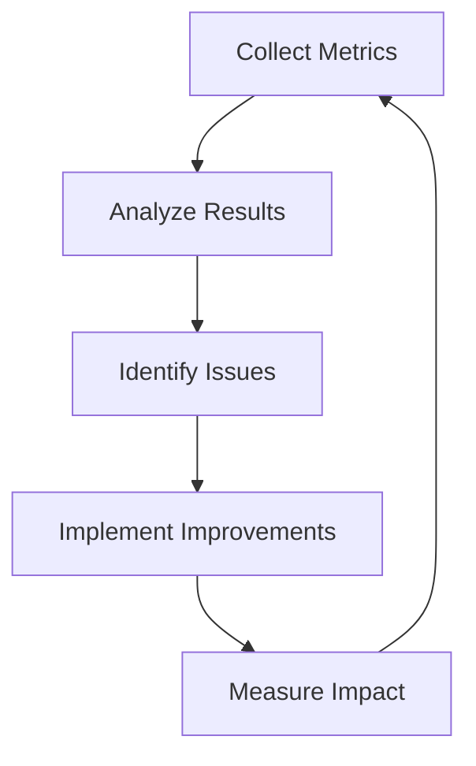
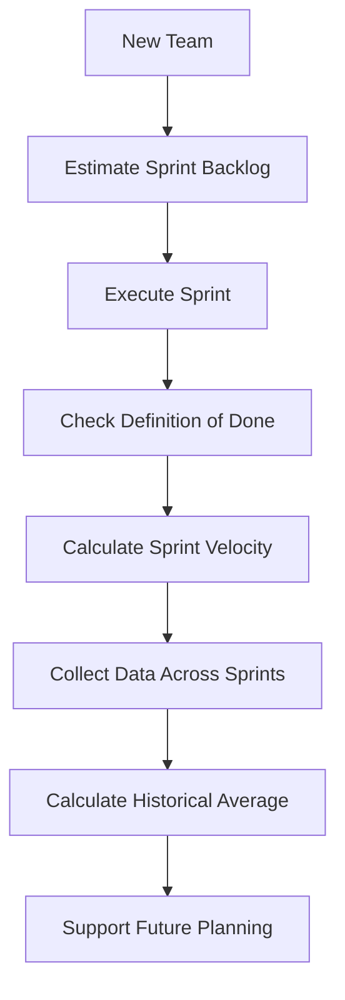
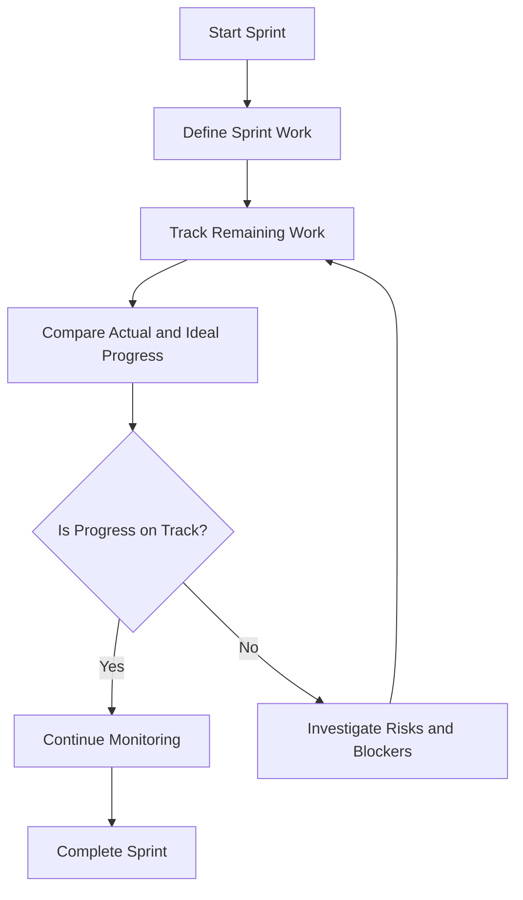
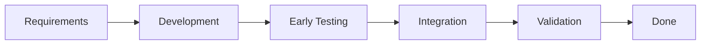
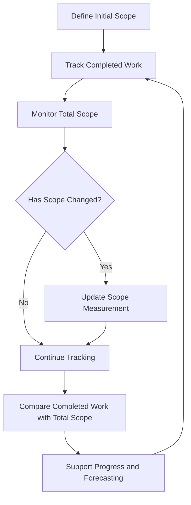
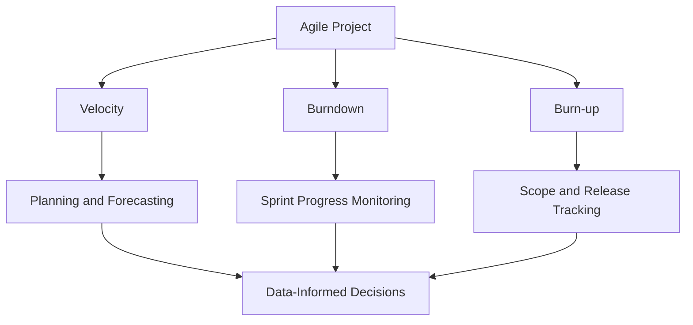

# Agile Metrics & KPIs

## 1. Introduction

**Agile metrics** are quantifiable measurements used to assess progress, performance, quality, and effectiveness in Agile software development.

They help teams track progress, identify bottlenecks, support planning, make data-informed decisions, and improve processes.

### Metrics vs KPIs

| Metrics | KPIs |
|---|---|
| Quantifiable measurements | Measurements connected to goals |
| May be informational | Directly aligned with an objective |
| Example: completed tasks | Example: achieve a release target |

### Continuous Improvement Cycle



## 2. Core Agile Metrics

| Metric | Main Focus |
|---|---|
| Velocity | Amount of work completed |
| Burndown chart | Work remaining over time |
| Burn-up chart | Completed work compared with total scope |

## 3. Velocity

**Velocity** is the amount of work a team completes during a defined period, commonly one Scrum sprint. It is often measured in story points.

### Sprint Velocity

Sprint velocity is the total story points completed in one sprint.

```text
Sprint Velocity = Sum of completed story points
```

Only work satisfying the **Definition of Done (DoD)** should be counted.

Example:

| Story | Points | Status |
|---|---:|---|
| A | 5 | Done |
| B | 8 | Done |
| C | 3 | Done |
| D | 5 | Incomplete |

```text
Sprint Velocity = 5 + 8 + 3 = 16 story points
```

### Team Velocity

Team velocity is the average completed story points across multiple sprints.

```text
Team Velocity = Total completed story points / Number of sprints
```

For sprint results of 20, 24, and 28 points:

```text
Average velocity = (20 + 24 + 28) / 3 = 24 points per sprint
```

### Velocity and Definition of Done

The Definition of Done is a shared agreement describing the conditions that a work item must satisfy before it is considered complete. Incomplete stories should not automatically contribute their full estimate to velocity.

### New Team Velocity Process



### Velocity Trends

- **Variable velocity:** May indicate changing team composition, unstable requirements, dependencies, blockers, or inconsistent estimation.
- **Decreasing velocity:** May indicate technical debt, increasing complexity, blockers, or reduced capacity.
- **Increasing velocity:** May indicate better collaboration, domain familiarity, reduced impediments, or improved estimation.

Increasing velocity does not automatically prove higher quality or business value.

### Forecasting Example

If remaining work is 120 story points and average velocity is 24 points per sprint:

```text
Estimated sprints = 120 / 24 = 5 sprints
```

This is an estimate, not a guarantee.

## 4. Burndown Charts

A **burndown chart** represents the amount of work remaining over time.

| Component | Meaning |
|---|---|
| X-axis | Time, such as sprint days |
| Y-axis | Remaining work |
| Ideal line | Planned reduction in work |
| Actual line | Recorded remaining work |

### Burndown Process



### Common Patterns

- **Actual line below ideal:** Less work remains than the ideal reference suggests.
- **Actual line above ideal:** More work remains than planned at that point.
- **Flat line:** Remaining work has not decreased; investigate blockers, delays, or batch updates.
- **Sudden downward dip:** Several items may have been completed or updated together.
- **Sudden upward spike:** May indicate added work, changed scope, or revised estimates.

## 5. Late-Sprint Crash

A **late-sprint crash** occurs when a large amount of work is completed near the end of a sprint rather than progressively.

### Causes

- Large user stories.
- Excessive work in progress.
- Testing or integration delayed until the end.
- Unclear requirements.
- Blocked tasks.
- Batch closure of work.

### Corrective Actions

| Action | Purpose |
|---|---|
| Break down large stories | Make work manageable |
| Shift-left testing | Find defects earlier |
| Stop starting, start finishing | Reduce work in progress |
| Address blockers quickly | Prevent stuck work |
| Integrate regularly | Detect integration problems earlier |



## 6. Burn-up Charts

A **burn-up chart** shows completed work compared with total scope over time.

| Component | Description |
|---|---|
| X-axis | Time, sprint number, or iteration |
| Y-axis | Work units |
| Completed work line | Increases as work is completed |
| Total scope line | Shows total planned scope |
| Ideal progress line | Optional planned-progress reference |

### Burn-up Workflow



### Scope Changes

- **Scope increase:** New requirements, newly discovered work, or stakeholder requests.
- **Scope reduction:** Work is removed, descoped, or deprioritized.

## 7. Burndown vs Burn-up

| Feature | Burndown | Burn-up |
|---|---|---|
| Main focus | Work remaining | Completed work and total scope |
| Scope visibility | May be less obvious | Explicitly visible |
| Common use | Sprint tracking | Release and project tracking |
| Main question | How much remains? | How much is complete compared with scope? |

## 8. Metrics in Scrum

- Velocity is commonly measured as completed story points per sprint.
- Burndown charts monitor daily sprint progress.
- Burn-up charts can monitor release scope and completion.

## 9. Metrics in Kanban

Kanban emphasizes continuous flow rather than fixed-length sprints.

Teams may measure **throughput**, such as completed work items per week.

Example:

```text
Throughput = (12 + 15 + 13) / 3 = 13.33 items per week
```

This is throughput, not necessarily Scrum story-point velocity.

| Aspect | Scrum | Kanban |
|---|---|---|
| Work structure | Fixed-length sprints | Continuous flow |
| Common measure | Story points per sprint | Throughput or flow measures |
| Burndown | Sprint tracking | Defined work sets or releases |
| Burn-up | Release tracking | Scope and release tracking |

## 10. Using Metrics Together



| Metric | Main Question |
|---|---|
| Velocity | How much work has historically been completed? |
| Burndown | How much work remains? |
| Burn-up | How much is complete compared with total scope? |

## 11. Advantages and Limitations

| Metric | Advantages | Limitations |
|---|---|---|
| Velocity | Supports historical planning | Can be distorted by changed estimates or team capacity |
| Burndown | Clearly shows remaining work | Scope changes may be less visible |
| Burn-up | Shows completed work and total scope | Requires accurate scope and completion data |

Metrics should not be interpreted in isolation. Higher velocity does not automatically mean higher quality, and a favorable chart position does not automatically prove higher business value.

## 12. Important Exam Questions

1. Define Agile metrics and explain their importance.
2. Differentiate between metrics and KPIs.
3. Explain sprint velocity and team velocity.
4. Explain the Definition of Done and its relationship to velocity.
5. Define and explain a burndown chart.
6. Differentiate between burndown and burn-up charts.
7. Explain late-sprint crash, its causes, and corrective actions.
8. Explain Agile metrics in Scrum and Kanban.
9. Explain how metrics support continuous improvement.
10. Discuss the limitations of using velocity as a forecasting tool.

## 13. Quick Revision

- **Metrics:** Quantifiable measurements.
- **KPIs:** Metrics connected to goals.
- **Velocity:** Completed work during a period.
- **Sprint velocity:** Completed story points in one sprint.
- **Team velocity:** Average completed story points across multiple sprints.
- **Definition of Done:** Conditions required for completion.
- **Burndown:** Work remaining over time.
- **Burn-up:** Completed work compared with total scope.
- **Late-sprint crash:** Large amount of work completed near the deadline.
- **Shift-left testing:** Testing performed earlier in development.

## 14. Summary

Agile metrics provide quantitative information for understanding and improving software development processes. Velocity supports historical planning, burndown charts show remaining work, and burn-up charts show completed work compared with total scope. These metrics are most useful when interpreted in context and used for continuous improvement rather than blame.

> **Exam takeaway:** Always explain what a metric measures, how it is calculated or interpreted, why it is useful, and what its limitations are.
