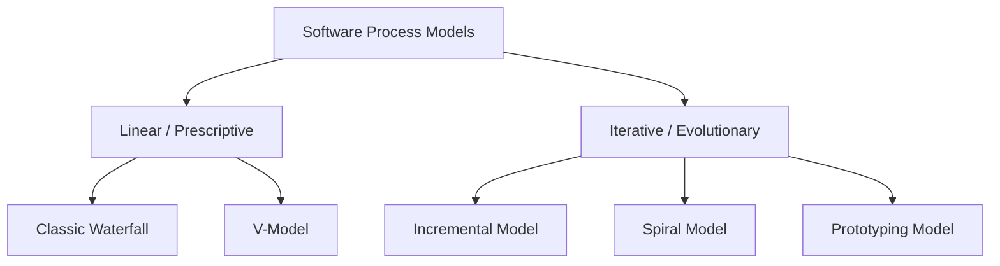
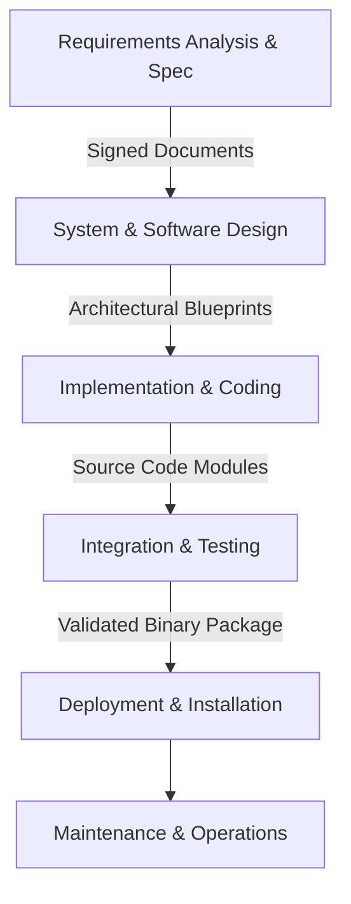
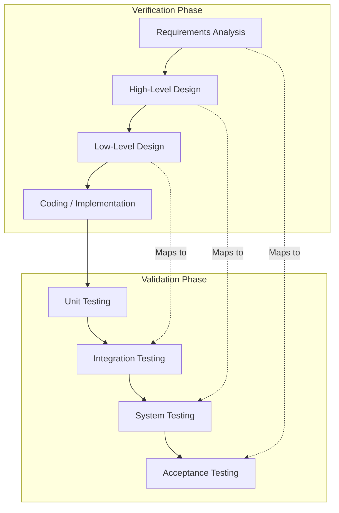
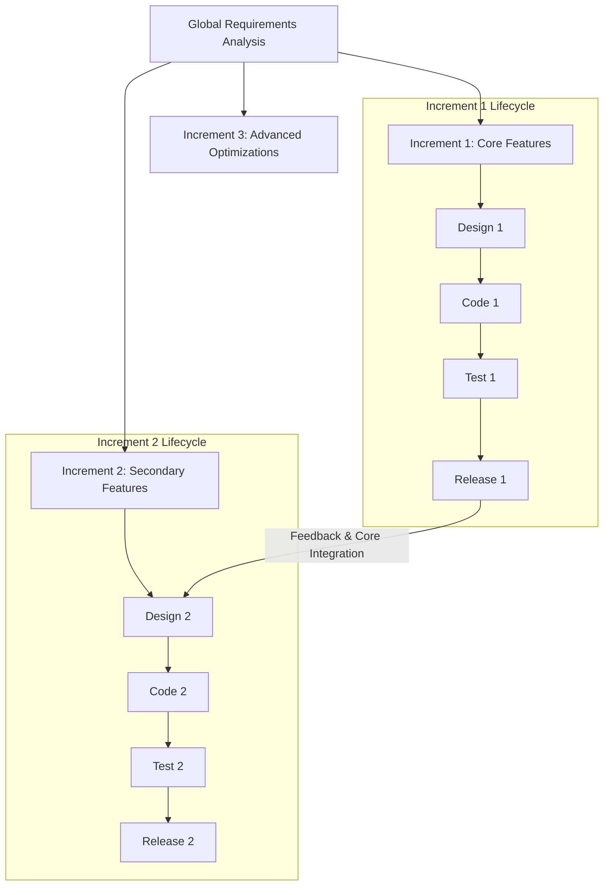
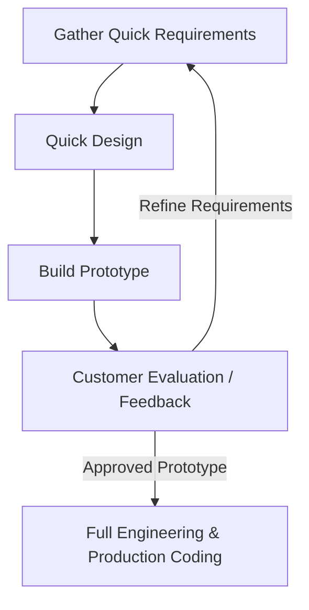

# Detailed Master's-Level Notes: Software Process Models

---

## 1. Prerequisites & The Process Continuum

Before analyzing specific software process models, a Master's student must understand the core distinction between **Prescriptive (Plan-Driven)** and **Evolutionary (Empirical/Agile)** processes.

A software process model specifies the constraints, sequencing, and governance of the software development lifecycle (SDLC). The choice of model directly dictates how a project handles **Requirement Uncertainty**, balances **Verification vs. Validation**, and mitigates **Structural Risk**.

---

## 2. Taxonomy of Software Process Models

Software process models are broadly classified based on their execution workflow and approach to change:



---

## 3. Deep-Dive: Prescriptive Linear Models

### 3.1 The Classic Waterfall Model

Introduced conceptually by Winston Royce (1970), the **Waterfall Model** is a pure, linear-sequential lifecycle. It operates on the assumption that a project phase should only begin when the previous phase's deliverables are fully complete, verified, and signed off.

#### Process Workflow & Internal Mechanics

Each phase acts as a gatekeeper, transforming abstract inputs into concrete, documented outputs. There is minimal back-tracking; the process flows strictly downward.



* **Internal Working:** Progress is measured via explicit milestones and baseline documents (e.g., Software Requirements Specification - SRS, High-Level Design - HLD). Testing occurs only late in the cycle, after implementation is finalized.

#### Architectural Properties

* **Approach:** Linear-sequential, document-driven.
* **Flexibility:** Extremely rigid. Changes to requirements late in the cycle require rewriting baseline documents and architectures, incurring high costs.
* **Risk Handling:** Poor. Risks are back-loaded; technical or structural flaws may remain hidden until integration testing.
* **User Involvement:** High at the beginning (requirements gathering) and end (acceptance testing), but absent during development.

#### Pros & Cons

* **Pros:**
* Simple, highly structured, and easy to manage.
* Clear milestones, defined deliverables, and well-documented outcomes for every phase.
* Works well when requirements are completely stable, understood, and unlikely to change.


* **Cons:**
* Highly vulnerable to requirement changes.
* No working software is produced until late in the lifecycle.
* High risk of project failure if early assumptions or requirements contain undetected errors.


#### Best Suited For

* Projects with static, well-defined requirements (e.g., defense system migrations, core banking backends, re-engineering existing software with established scopes).

---

### 3.2 The V-Model (Verification & Validation Model)

The **V-Model** is an extension of the Waterfall model that pairs every development phase directly with a corresponding testing phase. This structure emphasizes early test planning to catch defects well before coding begins.

#### Process Workflow & Internal Mechanics

The model forms a "V" shape. The left downward slope represents the **Verification** stream (building the system right), while the right upward slope represents the **Validation** stream (building the right system), joined at the bottom by the implementation phase.



* **Internal Working:** During the Requirements phase, engineers simultaneously write the *Acceptance Test Plan*. During High-Level Design, they create the *System Test Plan*. This approach ensures that test cases are derived directly from architectural and requirement designs rather than just the final code.

#### Pros & Cons

* **Pros:**
* Emphasizes early verification, helping to identify potential defects earlier than standard Waterfall processes.
* Highly disciplined approach with explicit validation gates for every major design artifact.
* Clear traceability between requirement definitions, design components, and test execution scripts.


* **Cons:**
* Inherits the underlying rigidity of linear-sequential processes.
* Does not handle mid-cycle requirement changes or evolving prototypes well.
* Does not produce working software early, leaving validation risk for late in the schedule.


#### Best Suited For

* Safety-critical or high-reliability domains where software defects carry severe real-world consequences (e.g., medical device control software, avionics avionics systems, automotive safety controllers).

---

## 4. Deep-Dive: Evolutionary & Iterative Models

### 4.1 The Incremental Model

The **Incremental Model** divides system requirements into distinct, manageable functional blocks. The project is delivered through a series of successive releases, with each release adding a new, fully validated slice of functionality (an "increment") to the core platform.

#### Process Workflow & Internal Mechanics

The system is designed as a series of modules. The initial increment delivers the "core product"—the essential features needed to run the software. Subsequent increments build on this core, adding secondary features or enhancements.



#### Pros & Cons

* **Pros:**
* Generates operational, working software early in the product lifecycle.
* Provides high flexibility, allowing the team to adjust future increments based on early user feedback.
* Lowers initial deployment risks and helps distribute project funding requirements over time.


* **Cons:**
* Requires clean architectural planning to ensure new increments integrate smoothly with the core platform.
* Can mask deep, system-wide architectural challenges if early modules are designed too narrowly.
* Total system cost can exceed a well-planned linear model if integration points require frequent refactoring.


#### Best Suited For

* Large-scale commercial enterprise applications, web platforms, SaaS products, and projects where getting a functional version to market quickly is a strategic priority.

---

### 4.2 The Spiral Model (Risk-Driven)

Developed by Barry Boehm (1988), the **Spiral Model** is an evolutionary process model that couples the iterative nature of prototyping with the controlled, systematic aspects of the linear-sequential model. Its defining characteristic is a heavy focus on **Risk Analysis** at every stage.

#### Process Workflow & Internal Mechanics

The model is mapped as a spiral divided into four distinct quadrants. Each loop around the spiral represents a complete process phase, slowly building a more advanced version of the software.

```mermaid
graph Quadrants
    %% Quadrant 1: Objective Setting
    Q1[1. Determine Objectives, Alternatives, & Constraints]
    %% Quadrant 2: Risk Evaluation
    Q2[2. Identify & Resolve Risks, Evaluate Alternatives]
    %% Quadrant 3: Engineering / Development
    Q3[3. Develop & Verify Next-Level Product]
    %% Quadrant 4: Review & Planning
    Q4[4. Plan Next Phases & Review]
    
    Q1 --> Q2
    Q2 --> Q3
    Q3 --> Q4
    Q4 --> Q1

```

* **The Four Quadrants:**
1. **Determine Objectives:** Define the specific functional goals, performance constraints, and management interfaces for this iteration loop.
2. **Identify and Resolve Risks:** Perform a detailed risk assessment. Use technical spikes, simulations, or prototypes to evaluate and neutralize identified threat vectors.
3. **Develop and Verify:** Implement the planned features for this loop, using testing patterns matching the current system maturity.
4. **Plan Next Phase:** Review the iteration with stakeholders and plan the scope for the next loop around the spiral.


#### Pros & Cons

* **Pros:**
* Strong focus on risk management, helping to identify and resolve critical issues before they can derail the project.
* Easily accommodates evolving requirements and architectural adjustments across loop iterations.
* Ensures consistent quality via regular stakeholder reviews at the end of every loop.


* **Cons:**
* Requires deep expertise in risk assessment; missing a critical risk can compromise the entire architecture.
* High management overhead makes it less efficient for small, straightforward projects.
* Project timelines and end dates can be difficult to predict due to the fluid, evolutionary nature of the spiral loops.


#### Best Suited For

* Massive, highly complex, and mission-critical enterprise systems that carry significant financial or technical risks (e.g., aerospace control systems, large-scale data center migrations, new operating system kernels).

---

### 4.3 The Prototyping Model

The **Prototyping Model** focuses on building an early, simplified version of the software before diving into full-scale development. It is designed to help stakeholders visualize the final system and clarify ambiguous user requirements.

#### Process Workflow & Internal Mechanics

Developers build a lightweight version of the software—often focusing on user interfaces or core algorithms—to gather immediate feedback and refine the requirement baseline.



* **Types of Prototyping:**
* **Throwaway Prototyping:** The prototype is used solely to uncover requirements and is discarded. The final production system is built from scratch with proper engineering discipline.
* **Evolutionary Prototyping:** The prototype is constructed with production-grade code from the start. It is iteratively refined, refactored, and expanded until it becomes the final system.


#### Pros & Cons

* **Pros:**
* Significantly improves alignment between users and developers by providing a tangible system to evaluate.
* Uncovers missing requirements and ambiguous specifications early in the lifecycle.
* Provides an early look at user interface usability and workflow challenges.
* Helps technical teams validate unfamiliar algorithms or integration points quickly.


* **Cons:**
* Can create false expectations; stakeholders may assume the working prototype is close to production-ready, ignoring necessary backend engineering, security, and scalability work.
* Can increase total project costs and extend timelines if throwaway prototypes are over-engineered.
* Risk of "scope creep" as users continuously suggest new features during every prototype review session.


#### Best Suited For

* Systems with highly interactive user interfaces, unique human-computer workflows, or deeply ambiguous requirements where users struggle to define their needs upfront.

---

## 5. Comprehensive Cross-Model Comparison

| Dimension | Classic Waterfall | V-Model | Incremental Model | Spiral Model | Prototyping Model |
| --- | --- | --- | --- | --- | --- |
| **Operational Approach** | Linear-Sequential | Linear with explicit testing pairs | Phased Divisional Modules | Multi-Stage Risk-Driven Loops | Continuous Feedback Loops |
| **Flexibility to Change** | Extremely Low | Low | Medium-High | High | Extremely High |
| **Risk Handling** | Back-loaded (High Risk) | Managed via early test design | Medium (Isolated to increments) | Excellent (Core focus of the model) | High (Resolves requirement risks) |
| **User Involvement** | High at start/end | High at start/end | Frequent at every release | High at every loop review | Continuous throughout development |
| **Relative Cost Profile** | Low upfront, high for late changes | Medium | Medium | High | High for early exploration |
| **Best Suited For** | Static, fully understood projects | High-reliability, safety-critical software | Scalable commercial web/app platforms | Massive, high-risk enterprise engineering | Ambiguous requirements, novel UX domains |

---

## 6. Exam Tips & High-Yield Points

> ### 🧠 Exam Tip 1: Tracing the Testing Boundary in the V-Model
> 
> 
> When explaining the V-Model on an exam, clearly emphasize that it is **not just a testing model**. Focus on how it connects design levels to test levels: *Low-Level Design (LLD)* directly dictates *Unit Testing*, *High-Level Design (HLD)* drives *Integration Testing*, and *Requirements Analysis* defines *Acceptance Testing*. Highlighting this direct mapping demonstrates a true understanding of verification and validation principles.

> ### 🧠 Exam Tip 2: Distinguishing Iterative vs. Incremental
> 
> 
> Be prepared to clarify the difference between iterative and incremental models. An **Incremental** process delivers a product in separate, fully functional pieces (e.g., building Module A, then Module B, then Module C). An **Iterative** process delivers the entire system all at once, refining and expanding its detail with each cycle (e.g., building a sketchy draft of the whole system, then sharpening the entire architecture on the next pass).

---

## 7. Common Interview Questions

### 1. In Boehm’s Spiral Model, what happens if the team does a poor job during the second quadrant (Risk Analysis)?

* **Answer:** The second quadrant is the core driver of the Spiral Model. If a team misidentifies or underestimates a critical risk here, they will plan and build the next iteration loop based on flawed assumptions. This can lead to a "risk rupture," where major architectural issues, performance bottlenecks, or security flaws are discovered late in the project. This undermines the primary benefit of the model and can lead to costly redesign loops that mimic the failure modes of a broken Waterfall project.

### 2. A startup needs to build an AI-driven medical diagnostic app. The data algorithms are experimental, and the user interface requirements are unclear. Which process model would you recommend, and why?

* **Answer:** I would recommend a hybrid approach that combines the **Prototyping Model** with the **Spiral Model**. The Prototyping model is ideal for the user interface, letting the team test different screen layouts and clinical workflows with doctors to clarify requirements. At the same time, the experimental AI algorithms carry significant technical risk, making the Spiral Model's risk-driven loops perfect for validating data accuracy and performance step-by-step. A linear model like Waterfall would be far too rigid for this level of uncertainty.

### 3. Why does the Classic Waterfall model often lead to an integration crisis ("the wall of tears") late in the development schedule?

* **Answer:** Waterfall isolates development phases into silos, pushing integration and comprehensive testing to the absolute end of the lifecycle. During the coding phase, individual developers often interpret design documents differently, creating subtle incompatibilities between subsystems. Because these modules aren't integrated early or often, these discrepancies remain hidden until the testing phase begins. This creates an integration crisis where teams must spend significant time and effort debugging deeply rooted architectural issues late in the project timeline.